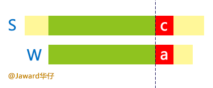
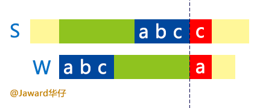
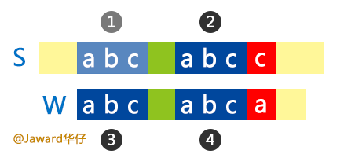
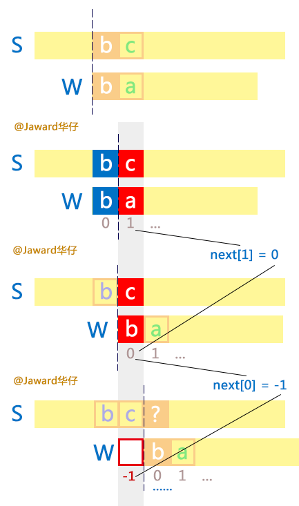
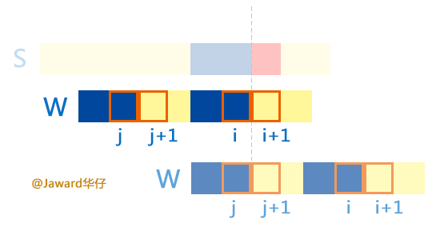
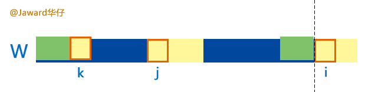
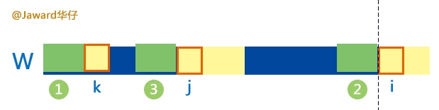

# 图解 KMP 算法（JavaScript 实现）

2014/09/11 · 


<font face=黑体>

本文作者： [伯乐在线][6] - [Mxt][7] 。未经作者许可，禁止转载！  
欢迎加入伯乐在线 [专栏作者][8]。

没碰算法久了大脑生锈得好快，看着 KMP 居然大脑一片空白，死活想不出当初怎么求 next 数组。google 一下，急躁地参考了一堆博客后终于想起来了。为了避免以后忘了又要浪费时间搜一遍，不如自己总结一篇吧！希望我的表述能帮更多人理解这个巧(qi)妙(pa)的算法。

本文的完整源码（JavaScript）以及图片的 PSD 源文件都在[[这里]][9]，有需要跟踪更新的可以 `star`，也可以 `fork` 个屌炸天的实现然后尽情嘲笑我。

领悟好的建议跳着读，只想看 next 数组求法可以跳到[这里][10]。

有什么问题尽管[评论][11]，但我很害羞的，表喷我。

## KMP 算法是什么？

* `KMP` 代表三个作者的名字，看维基去吧。
* 这是一个字符串查找算法，可以在一个字符串`（S）`中查找一个词`（W）`出现的位置。

## KMP 算法怎么查找？

说起字符串查找，大家肯定能理解朴素的查法，就是以 `S` 每个字符为开头与 `W` 比较。`O(m*n)`

这时，一群热(xian)爱(de)思(dan)考(teng)的人就想，我觉得不够快，能不能再优化成 `O(m+n)` 啊？别说还真可以。

看下图，现在字符串查找过程中出现了不匹配：



按朴素算法，这里 `W` 应该右移一位然后重新匹配。但是，你有没有发现，目前为止，绿色部分在两个字符串中都是已知的。于是就有人想，如果出现下图这样的情况就好了：



如果是这样的话，我们就不用一个个比较了，直接滑动，跳过不匹配的就好：


以上就是 KMP 算法的思想啦，就是找到最长的滑动区间，是不是很简单！

## 怎么确定滑动区间？

我们可以建立一个数组，叫 `next` ，它跟 `W` 串一样长，`next[j]` 表示当 `W[j]` 与 `S[i]` 不匹配时，W 应该滑到哪个位置上。

所以一但不匹配时，查一下 `next` 值，让 `S[i]` 跟 `W[next[j]]` 继续比较就行啦。

现在的问题就变为：怎么计算 `next` 数组？

先看回上面的图二，要求 `next` 数组必须先知道蓝色部分才行。这就头大了，我们是要先求 `next` 数组再做匹配啊，那求 `next` 的时候肯定不能碰 `S` 串，不然就相当于没优化了。

但是不看 `S` 串又怎么知道蓝色部分相等了！你坑爹啊！

有没有开始烦了……稍安勿躁！（我最近刚尝试了画一了一幅 [Low Poly][12]，结果现在眼睛那个累啊！打心底佩服设计师们！）

再看回上面图二，由于绿色部分都是 **已经匹配的**！所以就有了下面的关系：



之前我们假设了 2 和 3 是匹配的，现在看出了什么蹊跷没有？有没有豁然开朗的感觉？

没错，既然 2 与 3 是匹配的，2 与 4 是匹配的，那么 3 与 4 是不是一定是匹配的！有了这个传递关系我们现在只用 `W` 串就可以求出 `next` 数组啦！是不是省了很多时间！

## 准备求 next 数组

这节是求 `next` 数组前的一些热身概念，如果你有信心，可以直接跳到[下一节][10]。



1、对于 `next[1]`，请看灰色部分，在第二组中，因为 `W[1]`（图中的 a）前面只有一个字符（b），所以只要 `W[1]` 不匹配，不管 `W[0]` 是不是蓝色，`W` 总是会滑到开头的（图第三组）。好好理解这句话。  
所以 `next[1] == 0` 总是成立的，这是一种特殊情况。你可以 **顺着灰色条看上去**（注意是灰色部分哦），图第二组中 `c` 对应 `W` 的位置1在第三组是不是变成对应 0 了。

2、对于 `next[0]`，继续看图灰色部分，在第三组中，`W[0]`（b）就与 c 不匹配了，且 `W[0]` 左边已经没有字符了，这表示 `S[i]`（图中 c）肯定没戏了，所以要将 `W` 滑到 `c` 下一个字符的位置重新开始（图第四组），灰色部分的 `0` 现在是不是变成 `-1` 了。所以 `next[0] = -1`。这也是一种特殊情况。

3、最后再讲一下求 next 的核心思想，看下图中间的 `W` 。跟前面一样蓝色部分代表相等，于是有 `W[i] == W[j]（j < i）`。可以想象如果在 `W` 和 `S` 匹配过程中` W[i+1]` 不匹配了（与上面 `S` 的红色部分），那么 `W` 就要滑动且 `W[j+1]` 将覆盖在 `W[i+1]` 上（看最下面的 `W`）。所以 `W[i] == W[j]` 可以得出 `next[i+1] = j+1`。



## 求解 next 数组

说了这么多，终于可以开始求解 next 数组啦！

先看下图：


假设求 `next` 数组过程到达了上面的阶段，即刚利用 `i-1` 求完 `next[i]`，现在利用`i`求 `next[i+1]`。我们可以知道蓝色部分是相等的，因为刚刚求完 `next[i] = j`。现在对于 `W[i]` 和 `W[j]` 有两种情况：

* `W[i]` 和 `W[j]` 相等。这好办，参照上一节第 3 点，`next[i+1] =j+ 1`，然后 `W[i]` 和 `W[j]` 都向前继续看下一个字符（`i += 1`、`j += 1`）。（相当于把 `W[i]` 和 `W[j]` 合并到各自的蓝色部分中去）。
* `W[i]` 和 `W[j]` 不等。这时就要试图找下图的关系咯：

试图在`j`里找到一个 `k`，满足 `W[k] == W[i]` 且绿色部分相等。（虽然比`j`短一点，但有总比没有爽嘛。）



怎么确定 `k` 的位置？再仔细看一下上图，前面用过的一个策略，现在又要用上咯：



因为 1 和 2 相等，2 和 3 相等，所以 1 和 3 相等。所以现在变成了跟前面一模一样的问题 —— 只是规模变小了。嗅出动态规划的味道没有？假设你不知道动态规划，我们继续分析。

有了上面的传递关系，我们可以知道 `k = next[j]`，可以理解不？把上图左边一半单独看，假设在 `W` 和 `S` 匹配过程中 `W[j]` 不匹配了，那肯定是要滑到 `next[j]` 对不对？按照 `next` 数组的含义我们知道 `next[j]` 表示绿色部分是最长的咯，我们正好要为 `k` 找这样的值，所以 `k = next[j]`。

但如果 `W[k]` 和 `W[i]` 也是不相等呢？没关系，对 `k` 进行同样的查找（`k = next[k]`），再看有没有短一点的……一直找直到 `-1` 。

再次总结一下刚才的两种情况，对于 `W[i]` 和 `W[j]`：

* `W[i]` 和 `W[j]` 相等。`next[i+1] =j+ 1`，`i += 1`，`j += 1`。
* `W[i]` 和 `W[j]` 不等。`j = next[j]`。再次重复进行比较。

代码片段：

```js
if (w.charAt(i) === w.charAt(j)) {
  // 匹配成功之后两者都跳到下一字符继续匹配
  next[++i] = ++j;
} else {
  // 滑动 j 继续匹配（短了一点还是可以接受嘛）
  j = next[ j ];
}
```
再看一下边界的问题，从前面一节的图可以知道，滑动最多滑到 `-1`，代表最左侧的空位咯，所以 `j` 滑动的最坏情况是滑到了 `-1` 。从前面一节我们也知道 `j == -1` 时, `next[i+1] == 0 == j + 1`，所以：

```js
if (j === -1 || w.charAt(i) === w.charAt(j)) {
  next[++i] = ++j;
} else {
  j = next[ j ];
}
```

现在考虑循环的问题，求 `next` 数组只需利用 `i `遍历一遍。而对于 `j` ，因为 `next[ 0 ] == -1`，所以 `j` 初值为 `-1` 。再回想前面一节的第三点，我们是以 `i` 位置去算 `next[i+1]` 的，所以 `i` 在 `W1`（即 `W`）倒数第二个位置就可以停止了。

```js
var next = []
, i = 0
, j = -1
;
 
while (i < w.length-1) {
  if (j === -1 || w.charAt(i) === w.charAt(j)) {
    next[++i] = ++j;
  } else {
    j = next[j];
  }
}
```

就这样求完 `next` 数组啦！是不是超简单啊！

这里看不懂的话可以继续[讨论][11]。

## 小优化

对于 aaaab 这类的串，按上面的求法得出的 `next` 数组是 `[-1,0,1,2,3]`。其实对于中间的几个 `a` 来说，当其不匹配的时候，滑动到前面一位的 `a` 肯定也是不匹配了。所以应该直接滑到最前的一个 `a` 那里 `[-1,-1,-1,-1,3]`。

怎么实现呢？自己想吧！

弱弱的还是写一下吧，免得被人喷。

因为是以 `i` 求 `next[i+1]`，那么只需判断一下 `W[i]` 是否等于 `W[i+1]` 不就得了。

```js
while (i < w.length-1) {
  if (j === -1 || w.charAt(i) === w.charAt(j)) {
    if (w.charAt(++i) !== w.charAt(++j)) {
      next[i] = j;
    } else {
      next[i] = next[j];
    }
  } else {
    j = next[j];
  }
}
```

 KMP 算法实现

得到了 `next` 数组后就开始实现 KMP 匹配算法咯。其实跟求 `next` 数组大同小异。按照[前面][13]讲过的思路实现就行。最后如果 `j` 达到了 `W` 的长度，说明 `W` 字符全部匹配成功了。

```js
i = j = 0;
while (i < s.length && j < w.length) {
  if (j === -1 || s.charAt(i) === w.charAt(j)) {
    i += 1;
    j += 1;
  } else {
    j = next[j];
  }
}
if (j >= w.length) {
  return (i - w.length);
} else {
  return 0;
}
```

以上就是 KMP 算法啦，希望你以后都能记起来，写完这篇我是忘不了的啦。

有什么问题可以[评论][11]，本文的完整源码（JavaScript）以及图片的 PSD 源文件都在[[这里]][9]，有需要的可以 star。就这样，么么扎~

## 参考资料

* [字符串匹配的KMP算法 – 阮一峰][14]
* [The Knuth Morris Pratt Algorithm In My Own Words – Jake Boxer][15]
* [Knuth–Morris–Pratt Algorithm – Wikipedia][16]

</font>

[0]: http://blog.jobbole.com/category/it-tech/
[6]: http://blog.jobbole.com
[7]: http://www.jobbole.com/members/Jaward
[8]: http://blog.jobbole.com/99322
[9]: https://github.com/Crimx/Lab/tree/master/Algorithm/Searching/KMP
[10]: http://www.crimx.com/2014/09/07/kmp-algorithm/#next_array
[11]: http://www.crimx.com/2014/09/07/kmp-algorithm/#ds-thread
[12]: http://www.crimx.com/2014/09/02/low-poly/
[13]: http://www.crimx.com/2014/09/07/kmp-algorithm/#kmp
[14]: http://www.ruanyifeng.com/blog/2013/05/Knuth%E2%80%93Morris%E2%80%93Pratt_algorithm.html
[15]: http://jakeboxer.com/blog/2009/12/13/the-knuth-morris-pratt-algorithm-in-my-own-words/
[16]: http://en.wikipedia.org/wiki/Knuth%E2%80%93Morris%E2%80%93Pratt_algorithm