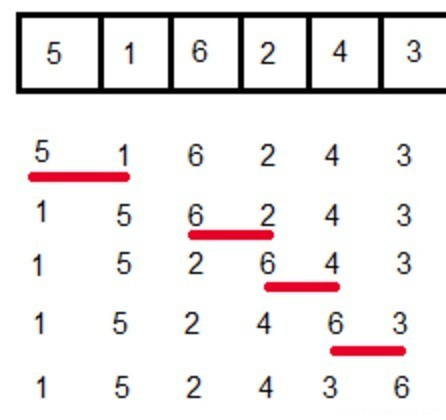
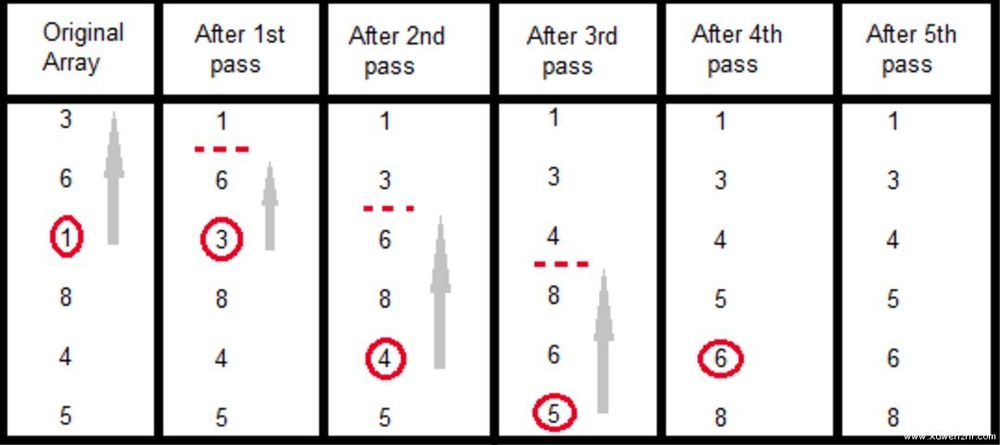
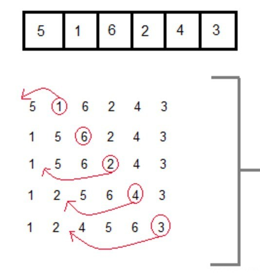

## [PHP程序员需要掌握的排序算法]

[](./img/fq0A8hx.gif)  
  
我们在大学的时候或者刚刚接触某个编程语言的时候就会了解过各种排序算法，比如最简单的冒泡排序、选择排序，然而由于这两个排序的效率低下的原因，还有一些其他高效一些的排序算法，比如快速排序、归并排序、插入排序等等。

**冒泡排序(Bubble Sort)**  
简介:每一次循环，相邻元素两两比较，以达到每次循环将最大(小)的元素移动到列表顶端，俗称冒泡。  
[](./img/3945EDD1-8893-416D-8BB1-901F9AC42F80.jpg)

```php
<?php
function bubbleSort(&$arr = array()){
    $cnt = count($arr);
    for($i = 0; $i < $cnt - 1; $i++)
    {
        for($j = $i; $j < $cnt-1; $j++){
            if($arr[$j] > $arr[$j+1]){
                $tmp = $arr[$j];
                $arr[$j] = $arr[$j+1];
                $arr[$j+1] = $tmp;
            }
        }
    }
}
```

复杂度  
Worst Case Time Complexity : O(n^2)  
Best Case Time Complexity : O(n)  
Average Time Complexity : O(n^2)  
Space Complexity : O(1)

- - -

**选择排序(Select Sort)**  
简介:如下图，第一次循环选择了最小的数1，并在循环之后将1移动到第一位，第二次循环选择了第二小的数3，并在循环后将3移动到第2位，以此类推，最后得到排好序的数列。  
[](./img/7264ACFE-1BEF-4A21-99B1-C69CD29C428A.jpg)

```php
<?php
function selectSort($arr = array())
{
    $cnt = count($arr);
    for($i = 0; $i < $cnt; $i ++){
        $k = $i;
        for($j = $i+1; $j < $cnt; $j++){
            if($arr[$k] > $arr[$j]){
                $k = $j;
            }
        }
        if($k != $i){
            $tmp = $arr[$i];
            $arr[$i] = $arr[$k];
            $arr[$k] = $tmp;
        }
    }
    return $arr;
}
```

复杂度  
Worst Case Time Complexity : O(n2)  
Best Case Time Complexity : O(n2)  
Average Time Complexity : O(n2)  
Space Complexity : O(1)

- - -

**插入排序(Insert Sort)**  
从左至右依次遍历数据，对当前值与前面的值进行判断，如符合判断，依次向前移动至正确的位置，也就是说左边的序列会慢慢变成一个已排序的序列，直至完成整个序列的排序。  
[](./img/B5C3ADC7-B903-4BE4-9DC3-1D098BD6B8BF.jpg)

```php
<?php
function insertSort($arr = array()){
    $cnt = count($arr);
    for($i = 0; $i < $cnt; $i++){
        $j = $i-1;
        $crt_val = $arr[$i];
        while($j > -1 && $arr[$j] > $crt_val) {
            $arr[$j + 1] = $arr[$j];
            $j--;
        }
        $arr[$j+1] = $crt_val;
    }
    return $arr;
}
```

复杂度  
Worst Case Time Complexity : O(n^2)  
Best Case Time Complexity : O(n)  
Average Time Complexity : O(n^2)  
Space Complexity : O(1)

- - -

**希尔排序(Shell Sort)**  
希尔排序是在插入排序基础上的一种排序算法，也可以叫做分组插入排序，非常高效，避免了在数据量非常大时的大范围的数据移动。  
如何工作的呢？  
1.数组大小为8，首先将区间定为gap=4(8/2)，比如{35,14}为一组，剩余的{33,19},{42,27},{10,44}各为一组。  
![][0]

2.组内进行判断，如需swap，就自行swap，swap之后会是这样  
![][1]

3.然后将区间定为gap=2(gap/2)，则分组为{14, 27, 35, 42}, {19, 10, 33, 44}，组内再次进行排序。

4.如此往复实现排序。

```php
<?php
function shellSort(&$arr, $n)
{
    for ($gap = intval($n / 2); $gap > 0; $gap = intval($gap/2))
    {
        for ($i = 0; $i < $gap; $i++)
        {
            for ($j = $i + $gap; $j < $n; $j += $gap)
                if ($arr[$j] < $arr[$j - $gap])
                {
                    $temp = $arr[$j];
                    $k = $j - $gap;
                    while ($k >= 0 && $arr[$k] > $temp)
                    {
                        $arr[$k + $gap] = $arr[$k];
                        $k -= $gap;
                    }
                    $arr[$k + $gap] = $temp;
                }
        }
    }
}
```

复杂度  
Worst Case Time Complexity : O(n)  
Best Case Time Complexity :  
Average Time Complexity : O(n)  
Space Complexity :

- - -

**快速排序(Quick Sort)**  
快速排序的实现大多通过递归来实现，快排的中心思想是:选取一个标准值(pivot)，将序列中小于标准值的元素挪到标准值左侧，将序列中大于标准值的元素挪到标志值右侧。以此递归来实现排序。快速排序是一种不稳定的排序算法。

![][2]

```php
<?php
function quickSort(&$arr, $left, $right)
{
    if($left < $right){
        $i = $left;
        $j = $right;
        $pivot = $arr[$left];
        while($i < $j){
            while($i < $j && $arr[$j] >= $pivot){
                $j--;
            }
            if($i < $j){
                $arr[$i++] = $arr[$j];
            }
            while($i < $j && $arr[$i] < $pivot){
                $i++;
            }
            if($i < $j){
                $arr[$j--] = $arr[$i];
            }
        }
        $arr[$i] = $pivot;
        quick_sort($arr, $left, $i-1);
        quick_sort($arr, $i+1, $right);
    }
}
```

- - -

**归并排序(Merge Sort)**  
归并排序也是一种基于分治的排序算法。

如何工作？  
1.原始序列在中间被分为两个序列，然后两个子序列再次被分为四个子序列，如此往复，直至最后只剩下单节点序列  
![][3]

2.相邻的单节点序列进行排序，比如54>26，则排序后应为 {26, 54}，其他以此类推。双节点再次进行排序，比如{26, 54}和{17， 93}进行排序后为{17， 26， 54， 93}，如此往复，达到最终的排序效果。  
![][4]

```php
<?php
function mergeSort($numlist)
{
    if(count($numlist) <= 1 ) return $numlist;
    //两个子序列的分割点
    $mid = count($numlist) / 2;
    //得到左右两个子序列
    $left = array_slice($numlist, 0, $mid);
    $right = array_slice($numlist, $mid);
    $left = mergeSort($left);
    $right = mergeSort($right);
    return merge($left, $right);
}
function merge($left, $right)
{
    $result=array();
    $leftIndex=0;
    $rightIndex=0;
    $leftCnt = count($left);
    $rightCnt = count($right);
    while($leftIndex< $leftCnt && $rightIndex<$rightCnt)
    {
        if($left[$leftIndex]>$right[$rightIndex])
        {
            $result[]=$right[$rightIndex];
            $rightIndex++;
        } else {
            $result[]=$left[$leftIndex];
            $leftIndex++;
        }
    }
    while($leftIndex<$leftCnt)
    {
        $result[]=$left[$leftIndex];
        $leftIndex++;
    }
    while($rightIndex<$rightCnt)
    {
        $result[]=$right[$rightIndex];
        $rightIndex++;
    }
    return $result;
}
```

复杂度  
Worst Case Time Complexity : O(nlogn)  
Best Case Time Complexity : O(nlogn)  
Average Time Complexity : O(nlogn)  
Space Complexity : O(n)

- - -

**扩展阅读**  
什么叫稳定排序，什么叫不稳定排序？  
看图理解，也就是说此序列中存在两个相同的数字26时，如果排序后两个26的顺序和排序前的顺序是一致的，那么就是稳定排序，否则是不稳定排序。

![][5]

稳定排序

![][6]

不稳定排序- - -

**参考网址**  
[白话经典算法][7]  
[Introduction to Sorting][8]  
[Data Structure – Sorting Techniques][9]

[0]: ./img/shell_sort_gap_4.jpg
[1]: ./img/shell_sort_step_1.jpg
[2]: ./img/quick_sort_partition_animation.gif
[3]: ./img/mergesortA.png
[4]: ./img/mergesortB.png
[5]: ./img/stable_sort.jpg
[6]: ./img/unstable_sort.jpg
[7]: http://blog.csdn.net/column/details/algorithm-easyword.html
[8]: http://www.studytonight.com/data-structures/introduction-to-sorting
[9]: http://www.tutorialspoint.com/data_structures_algorithms/sorting_algorithms.htm