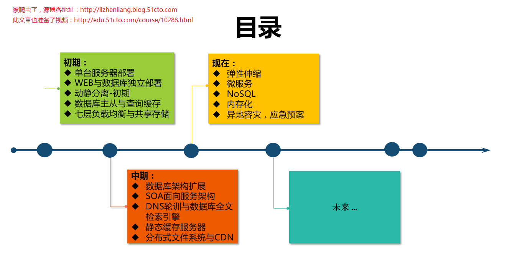
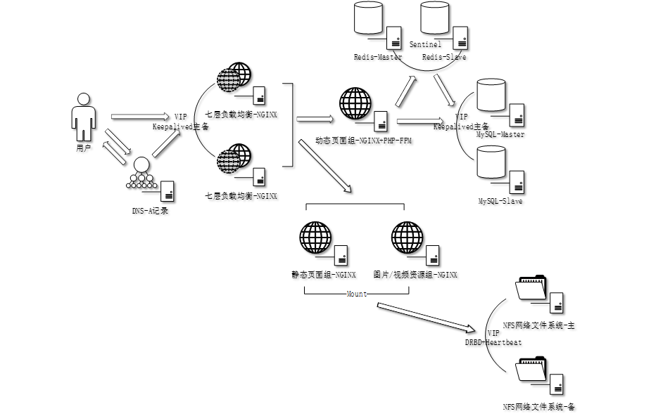
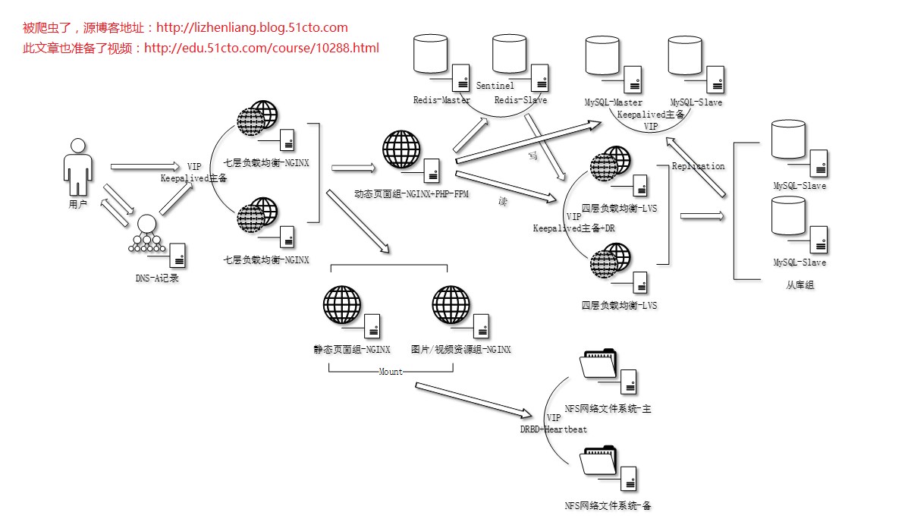
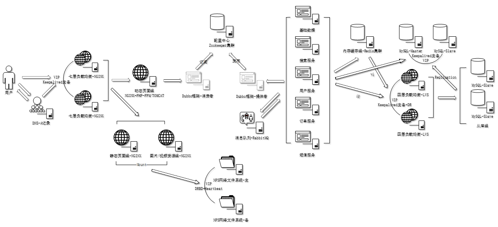
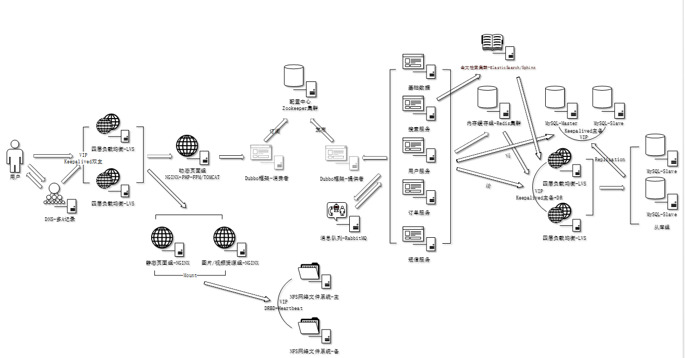
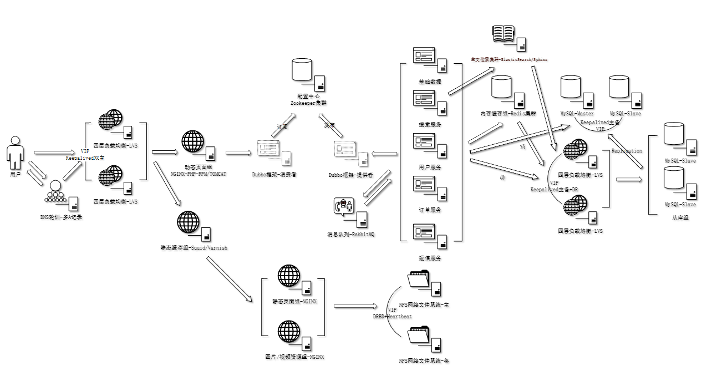
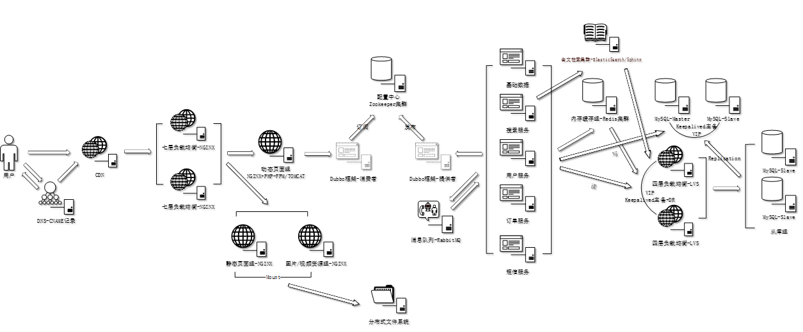
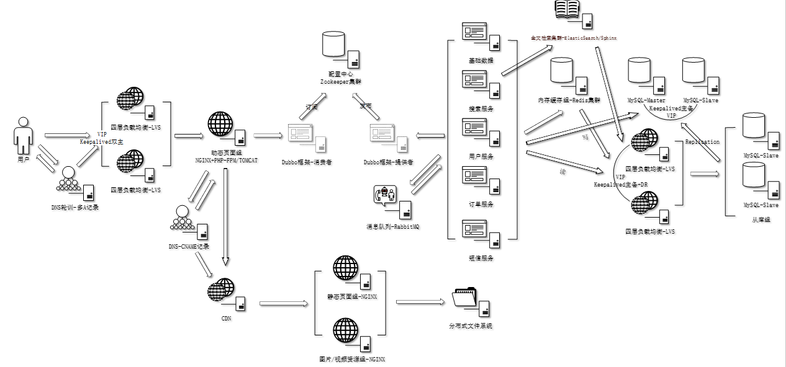
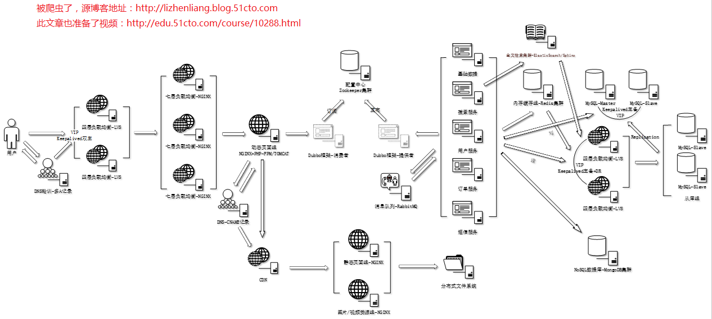

## 从运维角度看中大型网站架构的演变之路 

 2017-07-28 10:41:59

标签：[大型][0][网站架构][1]

原创作品，允许转载，转载时请务必以超链接形式标明文章 [原始出处][2] 、作者信息和本声明。否则将追究法律责任。[http://lizhenliang.blog.51cto.com/7876557/1951651][2]

#### 前言

 网上有很多文章类似于我今天要分享的课程，有架构师写的，有运维写的，还有开发些的，偏重点都不同，今天我以咱们运维角度全面讲解。

 一个成熟的网站架构并不是一开始设计就具备高可用、高伸缩、高性能等特性的，它是随着用户量和业务线不断增加，基础架构才逐渐健壮的。在发展初期，一般都是从0到1，不会一上来就整一些大而全的架构，也很少人这么任性。

#### 说明

**适用业务：** 电商/门户/招聘网站

**开发语言：** PHP和JAVA

**Web服务：** Nginx/Tomcat8

**数据库：** MySQL

**操作系统：** CentOS

**物理服务器：** Dell R730/R430

#### 录制视频地址：** [**http://edu.51cto.com/course/10288.html**][

#### 此文章为博主原创，转载请注明出处，抵制不道德行为！

#### 

#### 一、单台服务器部署

 项目开发完成上线，用户访问量寥寥无几。

![wKiom1l6nSbB5uCfAACPTOIseks145.png][4]

#### 二、WEB与数据库独立部署

 有一定用户访问量，单台服务器性能有些吃力，想提高并发能力，增加一台服务器，将HTTP请求与SQL操作负载分散不同服务器。

 

![wKioL1l6nWbyWBaKAACeKidaIj4646.png][5]

#### 三、 动静分离-初期

 什么是动静分离？静态页面与动态页面分离部署。

![wKiom1l6nZuDWWl5AADL8CP3zfY614.png][6]

#### 

#### 四、数据库主从与查询缓存

#####  RedisCache

 使用Redis缓存数据库查询结果，将热数据放到内存中，提高查询速度，减少数据库请求。

#####  MySQL主从

 基于binlog异步复制。

#####  HA

 MySQL：Keepalived

#####  怎么保证Redis缓存时效性？

**a)** 增加中间件，在主从同步延迟时间内，中间件将SQL读操作还路由到主。

**b)** 主从同步延迟时间后，再异步发起一次淘汰Cache。

**c)** 增加消息队列和清理Cache程序，入库同时也写入消息队列，缓存清理程序订阅消息队列，一旦有数据更新，重新Cache。

**d)** Cache中的Item一定要设置过期时间。

![wKioL1l6ndeikFq6AADn8189B6A446.png][7]

#### 五、七层负载均衡、共享存储与Redis高可用

 访问量越来越大，单台服务器性能已无法支撑，于是增加负载均衡，水平扩展WEB节点，同时调整动静分离。

#####  七层负载均衡

 根据域名或者后缀转发不同的upstream。

#####  NFS网络文件系统

 共享存储存放网站程序或者静态资源。

#####  Redis主从

#####  动静分离-中期

#####  HA

 LB：Keepalived

 NFS：DRBD+Heartbeat

 Redis：Sentinel/Keepalived

#####  Session如何会话保持？

 a) 源IP Hash

 b) Session共享

 c) Session Sticky（粘滞会话）

 d) Session复制

#### 六、数据库架构扩展

 访问量上来了，SQL操作自然也就多了，单台数据库读性能到达瓶颈，响应很慢；业务读多写少，需要提升读性能，考虑扩展数据库架构。

#####  一主多从

 基于binlog异步复制，多个从库同步主库。

#####  读写分离

 a) 代码逻辑层区分读写库。

 b) 使用中间件代理，对SQL解析区分处理；开源主流的有：Atlas、MyCat等。

#####  分库、分表、分区

 分库：根据业务类型分离相关表到不同数据库；例如WEB、BBS、Blog等。

 分表：单个表上千万条记录，操作耗时长，采用垂直拆分和水平拆分，将数据分散存储到不同小表上。

 分区：根据表字段分成多个区块，这些区块可以分布在不同磁盘上。

 以上主要是分散磁盘I/O压力，提高处理性能。

#####  从库四层负载均衡

 当多个从库时，采用LVS实现负载均衡，对程序提供VIP，访问透明。

#####  HA

 主库和从库LB：Keepalived

#### 七、SOA面向服务架构

#####  SOA

 面向服务架构设计理念，拆分臃肿程序架构，以核心业务为单位分解，服务化、模块化，分布式部署。

#####  服务化治理

 使用Dubbo分布式框架，治理SOA服务化，Dubbo提供高性能和透明化RPC远程调用方案 。

#####  配置中心

 使用Zookeeper存储服务连接信息。

#####  消息队列

 使用RabbitMQ解耦服务，保障服务直接通信。

#### 八、DNS轮训与数据库全文检索引擎

#####  DNS轮询

 DNS负载均衡技术实现原理是在DNS服务器上一个主机名配置多个IP地址，用户访问时，轮训返回解析记录，从而达到负载均衡目的。

#####  全文检索引擎

 像电商网站首页都会有查询表单，当商品多且品种多，关系型数据库庞大，想要快速从数据库中精确检索出用户想要的商品就显的力不从心了。

 引入全文检索引擎，建立索引缓存，快速查询海量数据，缓解数据库压力；开源主流的有：ElasticSearch、Sphinx。

#### 九、静态缓存服务器

 每次请求静态资源负载都会落在WEB节点和NFS存储上，而且这些资源都是很少变动的，我们把这些资源缓存到上层，请求到来时先判断本地是否有缓存，如果有就直接返回，从而减少后端HTTP请求，响应会快很多。

#### 十、 分布式文件系统与CDN

#####  分布式文件系统

 当图片、视频很多时，NFS在处理效率和存储容量上受局限，这时用分布式文件系统（DFS）就比较合适了，DFS是一种NAS存储架构，C/S模式，多台廉价服务器组成存储集群，提供高性能、高可用、高扩展等特性。客户端挂载到本地，就像访问本地文件系统一样访问远程服务器文件。

#####  CDN

 每次请求静态资源都会落在WEB节点和存储上，而且这些资源都是很少变动的，如果把这些资源放到网站入口，岂不减少后端大量HTTP请求，有什么方法呢？

 使用CDN技术，它通过一种缓存技术将频繁访问的资源（主要静态）分布到全国各地边缘服务器，用户先访问CDN服务器，CDN根据职能DNS返回客户端就近网络中的缓存服务器，如果这个缓存服务器有缓存请求的静态资源就直接返回，否则回源站获取返回，从而提高网站访问速度，减少后端服务器压力。

#### 十一、 四层负载均衡与NoSQL数据库

#####  四层负载均衡

 七层负载均衡要分析应用层协议，效率没有四层高，有些应用场景并不需要分析应用层协议，只想实现转发负载，那么，四层负载均衡是首选。

 当然，也可以四层代理七层负载均衡，方面扩展七层负载均衡。

#####  NoSQL数据库

 由于个别SQL查询量大，已经无法在深度优化，可以考虑使用NoSQL非关系型数据库，它的产生就是解决大规模、高并发、大数据量等问题。但比较适合非结构化数据存储，比如详情页内容、原始数据等。

#### 十二、现在

#####  弹性伸缩

 自动扩容，节点降级。

#####  微服务

 更细粒度拆分应用，实现服务化、轻量级、自动化部署等。

#####  内存化

 磁盘数据尽可能在内存中处理。

#####  异地容灾

 如果不可容忍网站不可用，应考虑到异地备份或异地双活。

#####  应急预案

#### 十三、谈古至今

 尽量将请求拦截在前面，从而减少数据库和HTTP请求

 数据库层是架构瓶颈，需要精心设计，比如架构扩展、SQL优化（压缩、索引等）

 避免单点

 分解压力

 扩展性

 找瓶颈出方案

#### 十三、应急预案

 SRE：网站可靠性工程师

 保证网站不宕机是他们的使命！

 制作应急预案大致以下几步：

 1、系统分级

 按照业务系统重要性划分，比如订单服务挂了，将影响用户无法下单，因此需要投入更多的资源保障；比如管理后台挂了，不会影响到用户；根据业务划分不同级别，实施不同的质量保障和成本投入。

 2、全链路分析

 梳理从网站入口到数据存储的各个环节，找出依赖服务，假设性去分析问题，如果某环节故障，影响范围怎样。

 3、全方位监控

 对相关链路实施全面监控，包括基础资源监控、服务状态监控、接口监控、日志监控等，确保出现问题有依据可追溯。

 4、制定应急预案

 多思考方案可行性，不定期进行预案演习，验证预案正确性和可控性及掌握恢复时间。

#### 十四、应对策略

 网络接入层：

 a) 机房故障：从DNS轮训摘除该机房或者切换到其他机房

 b) VIP网络异常：切换备用VIP

 代理层：

 a) IP限流：某些IP访问太大导致后端负载压力过高；实施IP限流

 b) 后端应用异常：如软硬件故障，摘除异常节点；如果某机房问题切换到其他机房

 应用层和服务层：

 a) 服务异常：某服务访问超时，响应慢；摘除服务或切换到正常服务

 b) 程序线程池不够用：线程池设置太小，导致请求堆积；提供参数开关，比如动态调整线程池大小

 c) 请求量太大：请求量太大，超过实际处理能力；请求限流或者设置请求阈值自动扩展节点

 缓存层和数据层：

 a) Redis挂掉：主从切换

 b) MySQL挂掉：主从切换，切换后验证

 c) 机房故障：切换缓存库/数据库到其他机房

[0]: http://blog.51cto.com/tag-大型.html
[1]: http://blog.51cto.com/tag-网站架构.html
[2]: http://lizhenliang.blog.51cto.com/7876557/1951651
[3]: http://edu.51cto.com/course/10288.html
[4]: ./img/wKiom1l6nSbB5uCfAACPTOIseks145.png
[5]: ./img/wKioL1l6nWbyWBaKAACeKidaIj4646.png
[6]: ./img/wKiom1l6nZuDWWl5AADL8CP3zfY614.png
[7]: ./img/wKioL1l6ndeikFq6AADn8189B6A446.png