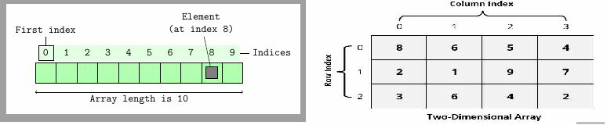
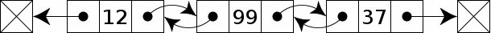
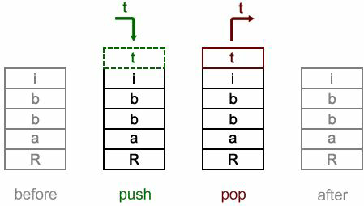
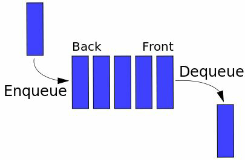
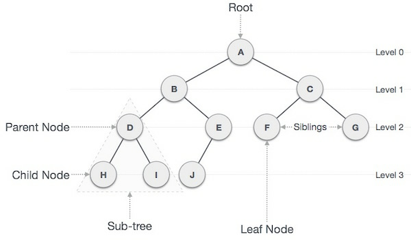
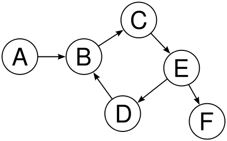
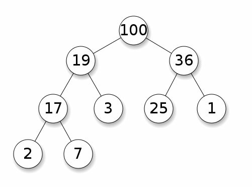

#### 不同的数据结构  

**Struct--结构体**  
**Array--数组**  
**Linked list--链表**  
**Doubly linked list--双向链表**  
**Stack--栈**  
**Queue--队列**  
**Priority queue--优先队列**  
**Set--集合**  
**Map--映射**  
**Tree--树**  
**Graph--图**  
**Heap--堆**  

> **少一种 hash 哈希**  

#### 各种数据结构简介

> Struct

> Array

如图  

> Linked

如图  

> Doubly

如图  

> Stack

如图  

> Queue

如图  

> Priority

> Set

> Map

> Tree

如图  

> Graph

如图  

> Heap

如图  
