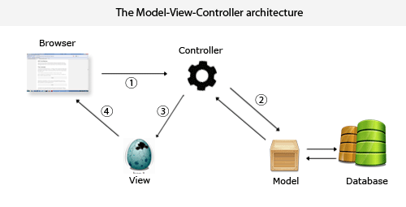
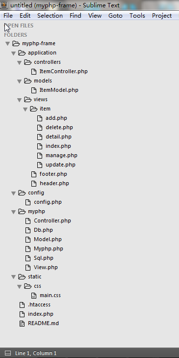
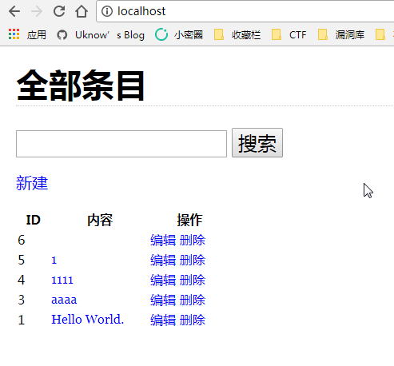

# PHP MVC开发框架学习笔记 

    发表于 2017-10-19   |   分类于  [笔记][0]   |   |   阅读次数  53

点击阅读全文

## MVC

MVC模式（Model-View-Controller）是软件工程中的一种软件架构模式，把软件系统分为三个基本部分：模型（Model）、视图（View）和控制器（Controller）。

PHP中MVC模式也称Web MVC，从上世纪70年代进化而来。MVC的目的是实现一种动态的程序设计，便于后续对程序的修改和扩展简化，并且使程序某一部分的重复利用成为可能。除此之外，此模式通过对复杂度的简化，使程序结构更加直观。软件系统通过对自身基本部份分离的同时，也赋予了各个基本部分应有的功能。

### MVC各部分的职能

MVC各部分的职能：

* 模型Model – 管理大部分的业务逻辑和所有的数据库逻辑。模型提供了连接和操作数据库的抽象层。
* 控制器Controller - 负责响应用户请求、准备数据，以及决定如何展示数据。
* 视图View – 负责渲染数据，通过HTML方式呈现给用户。

### MVC流程

一个典型的Web MVC流程：

* Controller截获用户发出的请求；
* Controller调用Model完成状态的读写操作；
* Controller把数据传递给View；
* View渲染最终结果并呈献给用户。


[](../img/web_mvc.gif)

## MVC框架开发

### 目录准备

[](../img/mvc1.png)

### 目录的作用

* application – 应用代码
* config – 程序配置或数据库配置
* myphp - 框架核心目录
* public – 静态文件
* runtime - 临时数据目录

### 代码规范

* MySQL的表名需小写，如：item，car
* 模块名（Models）需首字母大写，，并在名称后添加“Model”，如：ItemModel，CarModel
* 控制器（Controllers）需首字母大写，，并在名称中添加“Controller”，如：ItemController，CarController
* 视图（Views）部署结构为“控制器名/行为名”，如：item/view.php，car/buy.php

### 重定向

将所有的数据请求都重定向 index.php 文件，在 myphp-frame 目录下新建一个 .htaccess 文件，文件内容为：

```apache
    <IfModule mod_rewrite.c>
        RewriteEngine On
        # 确保请求路径不是一个文件名或目录
        RewriteCond %{REQUEST_FILENAME} !-f
        RewriteCond %{REQUEST_FILENAME} !-d
        # 重定向所有请求到 index.php?url=PATHNAME
        RewriteRule ^(.*)$ index.php?url=$1 [PT,L]
    </IfModule>
```
这样做的主要原因有：

* 程序有一个单一的入口；
* 除静态程序，其他所有程序都重定向到 index.php 上；
* 可以用来生成利于SEO的URL，想要更好的配置URL，后期可能会需要URL路由，这里先不做介绍了。

#### .htaccess创建方法

按组合键windows+R 打开运行，然后输入命名CMD，然后在输入copy con .htaccess 回车 （不会看到变化），然后再按ctrl+Z键，再回车，然后就创建了

### 入口文件

在 myphp-frame目录下添加 index.php 文件，文件内容为：

```php
    <?php 
    // 应用目录为当前目录
    define('APP_PATH', __DIR__.'/');
    // 开启调试模式
    define('APP_DEBUG', true);
    // 网站根URL
    define('APP_URL', 'http://localhost/myphp');
    // 加载框架
    require './myphp/MyPHP.php';
```

”，这么做的主要原因是，对于只有 PHP 代码的文件，结束标志(“?>”)最好不存在，PHP自身并不需要结束符号，不添加结束符号可以很大程度上防止末尾被添加额外的注入内容，让程序更加安全。

### 配置文件和主请求

在 index.php 中，我们对 myphp 文件夹下的 MyPHP.php 发起了请求，那么 MyPHP.php 这个启动文件中到底会包含哪些内容呢？

```php
    <?php
    // 应用目录为当前目录
    define('APP_PATH', __DIR__ . '/');
    // 开启调试模式
    define('APP_DEBUG', true);
    // 加载框架文件
    require(APP_PATH . 'myphp/Myphp.php');
    // 加载配置文件
    $config = require(APP_PATH . 'config/config.php');
    // 实例化框架类
    (new Myphp($config))->run();
```

以上文件都其实可以直接在 index.php 文件中包含，常量也可以直接在 index.php 中定义，我们这么做的原因是为了在后期管理和拓展中更加的方便，所以把需要在一开始的时候就加载运行的程序统一放到一个单独的文件中引用。

先来看看config文件下的 config .php 文件，该文件的主要作用是设置一些程序的配置项及数据库连接等，主要内容为：

```php
    <?php
    // 应用目录为当前目录
    define('APP_PATH', __DIR__ . '/');
    // 开启调试模式
    define('APP_DEBUG', true);
    // 加载框架文件
    require(APP_PATH . 'myphp/Myphp.php');
    // 加载配置文件
    $config = require(APP_PATH . 'config/config.php');
    // 实例化框架类
    (new Myphp($config))->run();
```

应该说 config.php 涉及到的内容并不多，不过是一些基础数据库的设置，再来看看 myphp下的共用框架入口文件 MyPHP.php 应该怎么写。

```php
    <?php
    /**
     * myphp框架核心
     */
    class Myphp
    {
        protected $config = [];
        public function __construct($config)
        {
            $this->config = $config;
        }
        // 运行程序
        public function run()
        {
            spl_autoload_register(array($this, 'loadClass'));
            $this->setReporting();
            $this->removeMagicQuotes();
            $this->unregisterGlobals();
            $this->setDbConfig();
            $this->route();
        }
        // 路由处理
        public function route()
        {
            $controllerName = $this->config['defaultController'];
            $actionName = $this->config['defaultAction'];
            $param = array();
            $url = $_SERVER['REQUEST_URI'];
            // 清除?之后的内容
            $position = strpos($url, '?');
            $url = $position === false ? $url : substr($url, 0, $position);
            // 删除前后的“/”
            $url = trim($url, '/');
            if ($url) {
                // 使用“/”分割字符串，并保存在数组中
                $urlArray = explode('/', $url);
                // 删除空的数组元素
                $urlArray = array_filter($urlArray);
                
                // 获取控制器名
                $controllerName = ucfirst($urlArray[0]);
                
                // 获取动作名
                array_shift($urlArray);
                $actionName = $urlArray ? $urlArray[0] : $actionName;
                
                // 获取URL参数
                array_shift($urlArray);
                $param = $urlArray ? $urlArray : array();
            }
            // 判断控制器和操作是否存在
            $controller = $controllerName . 'Controller';
            if (!class_exists($controller)) {
                exit($controller . '控制器不存在');
            }
            if (!method_exists($controller, $actionName)) {
                exit($actionName . '方法不存在');
            }
            // 如果控制器和操作名存在，则实例化控制器，因为控制器对象里面
            // 还会用到控制器名和操作名，所以实例化的时候把他们俩的名称也
            // 传进去。结合Controller基类一起看
            $dispatch = new $controller($controllerName, $actionName);
            // $dispatch保存控制器实例化后的对象，我们就可以调用它的方法，
            // 也可以像方法中传入参数，以下等同于：$dispatch->$actionName($param)
            call_user_func_array(array($dispatch, $actionName), $param);
        }
        // 检测开发环境
        public function setReporting()
        {
            if (APP_DEBUG === true) {
                error_reporting(E_ALL);
                ini_set('display_errors','On');
            } else {
                error_reporting(E_ALL);
                ini_set('display_errors','Off');
                ini_set('log_errors', 'On');
            }
        }
        // 删除敏感字符
        public function stripSlashesDeep($value)
        {
            $value = is_array($value) ? array_map(array($this, 'stripSlashesDeep'), $value) : stripslashes($value);
            return $value;
        }
        // 检测敏感字符并删除
        public function removeMagicQuotes()
        {
            if (get_magic_quotes_gpc()) {
                $_GET = isset($_GET) ? $this->stripSlashesDeep($_GET ) : '';
                $_POST = isset($_POST) ? $this->stripSlashesDeep($_POST ) : '';
                $_COOKIE = isset($_COOKIE) ? $this->stripSlashesDeep($_COOKIE) : '';
                $_SESSION = isset($_SESSION) ? $this->stripSlashesDeep($_SESSION) : '';
            }
        }
        // 检测自定义全局变量并移除。因为 register_globals 已经弃用，如果
        // 已经弃用的 register_globals 指令被设置为 on，那么局部变量也将
        // 在脚本的全局作用域中可用。 例如， $_POST['foo'] 也将以 $foo 的
        // 形式存在，这样写是不好的实现，会影响代码中的其他变量。 相关信息，
        // 参考: http://php.net/manual/zh/faq.using.php#faq.register-globals
        public function unregisterGlobals()
        {
            if (ini_get('register_globals')) {
                $array = array('_SESSION', '_POST', '_GET', '_COOKIE', '_REQUEST', '_SERVER', '_ENV', '_FILES');
                foreach ($array as $value) {
                    foreach ($GLOBALS[$value] as $key => $var) {
                        if ($var === $GLOBALS[$key]) {
                            unset($GLOBALS[$key]);
                        }
                    }
                }
            }
        }
        // 配置数据库信息
        public function setDbConfig()
        {
            if ($this->config['db']) {
                define('DB_HOST', $this->config['db']['host']);
                define('DB_NAME', $this->config['db']['dbname']);
                define('DB_USER', $this->config['db']['username']);
                define('DB_PASS', $this->config['db']['password']);
            }
        }
        // 自动加载控制器和模型类 
        public static function loadClass($class)
        {
            $frameworks = __DIR__ . '/' . $class . '.php';
            $controllers = APP_PATH . 'application/controllers/' . $class . '.php';
            $models = APP_PATH . 'application/models/' . $class . '.php';
            if (file_exists($frameworks)) {
                // 加载框架核心类
                include $frameworks;
            } elseif (file_exists($controllers)) {
                // 加载应用控制器类
                include $controllers;
            } elseif (file_exists($models)) {
                //加载应用模型类
                include $models;
            } else {
                // 错误代码
            }
        }
    }
```

主请求方法 route()，首先我们想看看我们的 URL 会这样：

    yoursite.com/controllerName/actionName/queryString

route()的作用就是，从全局变量 $ _GET[‘url’]变量中获取 URL，并将其分割成三部分： $ controller、 $ action 和 $queryString。

例如，URL链接为：myphp.com/item/view/1/first-item，那么

* $controller 就是：item
* $action 就是：view
* 查询字符串Query String就是：array(1, first-item)

分割完成后，会实例化一个新的控制器： controller.′Controller ′ （ 其 中 “ . ” 是 连 字 符 ） ， 并 调 用 其 方 法 action。

### 控制器/Controller基类

接下来的操作就是在 myphp 中建立程序所需的基类，包括控制器、模型和视图的基类。

新建控制器基类为 Controller.php，控制器的主要功能就是总调度，具体具体内容如下：

```php
    <?php 
    /**
     * 控制器基类
     */
    class Controller
    {
        protected $_controller;
        protected $_action;
        protected $_view;
     
        // 构造函数，初始化属性，并实例化对应模型
        public function __construct($controller, $action)
        {
            $this->_controller = $controller;
            $this->_action = $action;
            $this->_view = new View($controller, $action);
        }
        // 分配变量
        public function assign($name, $value)
        {
            $this->_view->assign($name, $value);
        }
        // 渲染视图
        public function render()
        {
            $this->_view->render();
        }
    }
```

Controller 类实现所有控制器、模型和视图（View类）的通信。在执行析构函数时，我们可以调用 render() 来显示视图（view）文件。

### 模型Model基类

新建模型基类为 Model.php，模型基类 Model.php 代码如下：

```php
    <?php
    class Model extends Sql
    {
        protected $model;
        public function __construct()
        {
            // 获取数据库表名
            if (!$this->table) {
                // 获取模型类名称
                $this->model = get_class($this);
                // 删除类名最后的 Model 字符
                $this->model = substr($this->model, 0, -5);
                // 数据库表名与类名一致
                $this->table = strtolower($this->model);
            }
        }
    }
```

考虑到模型需要对数据库进行处理，所以单独建立一个数据库基类 Sql.class.php，模型基类继承 Sql.php，代码如下：

    
```php
    <?php 
    class Sql
    {
        // 数据库表名
        protected $table;
        // 数据库主键
        protected $primary = 'id';
        // WHERE和ORDER拼装后的条件
        private $filter = '';
        // Pdo bindParam()绑定的参数集合
        private $param = array();
        /**
         * 查询条件拼接，使用方式：
         *
         * $this->where(['id = 1','and title="Web"', ...])->fetch();
         * 为防止注入，建议通过$param方式传入参数：
         * $this->where(['id = :id'], [':id' => $id])->fetch();
         *
         * @param array $where 条件
         * @return $this 当前对象
         */
        public function where($where = array(), $param = array())
        {
            if ($where) {
                $this->filter .= ' WHERE ';
                $this->filter .= implode(' ', $where);
                $this->param = $param;
            }
            return $this;
        }
        /**
         * 拼装排序条件，使用方式：
         *
         * $this->order(['id DESC', 'title ASC', ...])->fetch();
         *
         * @param array $order 排序条件
         * @return $this
         */
        public function order($order = array())
        {
            if($order) {
                $this->filter .= ' ORDER BY ';
                $this->filter .= implode(',', $order);
            }
            return $this;
        }
        // 查询所有
        public function fetchAll()
        {
            $sql = sprintf("select * from `%s` %s", $this->table, $this->filter);
            $sth = Db::pdo()->prepare($sql);
            $sth = $this->formatParam($sth, $this->param);
            $sth->execute();
            return $sth->fetchAll();
        }
        // 查询一条
        public function fetch()
        {
            $sql = sprintf("select * from `%s` %s", $this->table, $this->filter);
            $sth = Db::pdo()->prepare($sql);
            $sth = $this->formatParam($sth, $this->param);
            $sth->execute();
            return $sth->fetch();
        }
        // 根据条件 (id) 删除
        public function delete($id)
        {
            $sql = sprintf("delete from `%s` where `%s` = :%s", $this->table, $this->primary, $this->primary);
            $sth = Db::pdo()->prepare($sql);
            $sth = $this->formatParam($sth, [$this->primary => $id]);
            $sth->execute();
            return $sth->rowCount();
        }
        // 新增数据
        public function add($data)
        {
            $sql = sprintf("insert into `%s` %s", $this->table, $this->formatInsert($data));
            $sth = Db::pdo()->prepare($sql);
            $sth = $this->formatParam($sth, $data);
            $sth = $this->formatParam($sth, $this->param);
            $sth->execute();
            return $sth->rowCount();
        }
        // 修改数据
        public function update($data)
        {
            $sql = sprintf("update `%s` set %s %s", $this->table, $this->formatUpdate($data), $this->filter);
            $sth = Db::pdo()->prepare($sql);
            $sth = $this->formatParam($sth, $data);
            $sth = $this->formatParam($sth, $this->param);
            $sth->execute();
            return $sth->rowCount();
        }
        /**
         * 占位符绑定具体的变量值
         * @param PDOStatement $sth 要绑定的PDOStatement对象
         * @param array $params 参数，有三种类型：
         * 1）如果SQL语句用问号?占位符，那么$params应该为
         *    [$a, $b, $c]
         * 2）如果SQL语句用冒号:占位符，那么$params应该为
         *    ['a' => $a, 'b' => $b, 'c' => $c]
         *    或者
         *    [':a' => $a, ':b' => $b, ':c' => $c]
         *
         * @return PDOStatement
         */
        public function formatParam(PDOStatement $sth, $params = array())
        {
            foreach ($params as $param => &$value) {
                $param = is_int($param) ? $param + 1 : ':' . ltrim($param, ':');
                $sth->bindParam($param, $value);
            }
            return $sth;
        }
        // 将数组转换成插入格式的sql语句
        private function formatInsert($data)
        {
            $fields = array();
            $names = array();
            foreach ($data as $key => $value) {
                $fields[] = sprintf("`%s`", $key);
                $names[] = sprintf(":%s", $key);
            }
            $field = implode(',', $fields);
            $name = implode(',', $names);
            return sprintf("(%s) values (%s)", $field, $name);
        }
        // 将数组转换成更新格式的sql语句
        private function formatUpdate($data)
        {
            $fields = array();
            foreach ($data as $key => $value) {
                $fields[] = sprintf("`%s` = :%s", $key, $key);
            }
            return implode(',', $fields);
        }
    }
```

应该说，Sql.php 是框架的核心部分。为什么？因为通过它，我们创建了一个 SQL 抽象层，可以大大减少了数据库的编程工作。虽然 PDO 接口本来已经很简洁，但是抽象之后框架的可灵活性更高。

```php
    <?php
    /**
     * 数据库操作类，$pdo属性为静态属性，这样在页面执行周期内，
     * 只要经过一次赋值，那么第二次再获取还是首次赋值的内容，这
     * 里就是PDO对象，这样可以确保运行期间只有一个数据库连接对
     * 像，这种是一种简单的单例模式
     * Class Db
     */
    class Db
    {
        private static $pdo = null;
        public static function pdo()
        {
            if (self::$pdo !== null) {
                return self::$pdo;
            }
            $dsn = sprintf('mysql:host=%s;dbname=%s', DB_HOST, DB_NAME);
            $option = array(PDO::ATTR_DEFAULT_FETCH_MODE => PDO::FETCH_ASSOC);
            return self::$pdo = new PDO($dsn, DB_USER, DB_PASS, $option);
        }
    }
```

### 视图View类

视图类 View.php 内容如下：

```php
    <?php
    /**
     * 视图基类
     */
    class View
    {
        protected $variables = array();
        protected $_controller;
        protected $_action;
        function __construct($controller, $action)
        {
            $this->_controller = strtolower($controller);
            $this->_action = strtolower($action);
        }
     
        // 分配变量
        public function assign($name, $value)
        {
            $this->variables[$name] = $value;
        }
     
        // 渲染显示
        public function render()
        {
            extract($this->variables);
            $defaultHeader = APP_PATH . 'application/views/header.php';
            $defaultFooter = APP_PATH . 'application/views/footer.php';
            $controllerHeader = APP_PATH . 'application/views/' . $this->_controller . '/header.php';
            $controllerFooter = APP_PATH . 'application/views/' . $this->_controller . '/footer.php';
            $controllerLayout = APP_PATH . 'application/views/' . $this->_controller . '/' . $this->_action . '.php';
            // 页头文件
            if (file_exists($controllerHeader)) {
                include ($controllerHeader);
            } else {
                include ($defaultHeader);
            }
            //判断视图文件是否存在
            if (file_exists($controllerLayout)) {
                include ($controllerLayout);
            } else {
                echo "<h1>无法找到视图文件</h1>";
            }
            
            // 页脚文件
            if (file_exists($controllerFooter)) {
                include ($controllerFooter);
            } else {
                include ($defaultFooter);
            }
        }
    }
```

这样我们的核心的PHP MVC框架就编写完成了，下面我们开始编写应用来测试框架功能。

## 应用

### 数据库部署

在 SQL 中新建一个 mydb 数据库，使用下面的语句增加 item 数据表并插入2条记录：

```sql
    REATE DATABASE ` mydb ` DEFAULT CHARACTER SET utf8 COLLATE utf8_general_ci;
    USE ` mydb `;
    CREATE TABLE `item` (
        `id` int(11) NOT NULL auto_increment,
        `item_name` varchar(255) NOT NULL,
        PRIMARY KEY (`id`)
    ) ENGINE=InnoDB AUTO_INCREMENT=1 DEFAULT CHARSET=utf8;
    INSERT INTO `item` VALUES(1, 'Hello World.');
    INSERT INTO `item` VALUES(2, 'Lets go!');
```
### 部署模型

models 目录中创建一个 ItemModel.php 模型，内容如下：

```php
    <?php
    /**
     * 用户Model
     */
    class ItemModel extends Model
    {
        /**
         * 自定义当前模型操作的数据库表名称，
         * 如果不指定，默认为类名称的小写字符串，
         * 这里就是 item 表
         * @var string
         */
        protected $table = 'item';
        /**
         * 搜索功能，因为Sql父类里面没有现成的like搜索，
         * 所以需要自己写SQL语句，对数据库的操作应该都放
         * 在Model里面，然后提供给Controller直接调用
         * @param $title string 查询的关键词
         * @return array 返回的数据
         */
        public function search($keyword)
        {
            $sql = "select * from `$this->table` where `item_name` like :keyword";
            $sth = Db::pdo()->prepare($sql);
            $sth = $this->formatParam($sth, [':keyword' => "%$keyword%"]);
            $sth->execute();
            return $sth->fetchAll();
        }
    }
```

模型内容为空。因为 Item 模型继承了 Model，所以它拥有 Model 的所有功能。

### 部署控制器

在 controllers 目录下创建一个 ItemController.php 控制器，内容如下：

```php
    <?php
     
    class ItemController extends Controller
    {
        // 首页方法，测试框架自定义DB查询
        public function index()
        {
            $keyword = isset($_GET['keyword']) ? $_GET['keyword'] : '';
            if ($keyword) {
                $items = (new ItemModel())->search($keyword);
            } else {
                // 查询所有内容，并按倒序排列输出
                // where()方法可不传入参数，或者省略
                $items = (new ItemModel)->where()->order(['id DESC'])->fetchAll();
            }
            $this->assign('title', '全部条目');
            $this->assign('keyword', $keyword);
            $this->assign('items', $items);
            $this->render();
        }
        // 查看单条记录详情
        public function detail($id)
        {
            // 通过?占位符传入$id参数
            $item = (new ItemModel())->where(["id = ?"], [$id])->fetch();
            $this->assign('title', '条目详情');
            $this->assign('item', $item);
            $this->render();
        }
        
        // 添加记录，测试框架DB记录创建（Create）
        public function add()
        {
            $data['item_name'] = $_POST['value'];
            $count = (new ItemModel)->add($data);
            $this->assign('title', '添加成功');
            $this->assign('count', $count);
            $this->render();
        }
        
        // 操作管理
        public function manage($id = 0)
        {
            $item = array();
            if ($id) {
                // 通过名称占位符传入参数
                $item = (new ItemModel())->where(["id = :id"], [':id' => $id])->fetch();
            }
            $this->assign('title', '管理条目');
            $this->assign('item', $item);
            $this->render();
        }
        
        // 更新记录，测试框架DB记录更新（Update）
        public function update()
        {
            $data = array('id' => $_POST['id'], 'item_name' => $_POST['value']);
            $count = (new ItemModel)->where(['id = :id'], [':id' => $data['id']])->update($data);
            $this->assign('title', '修改成功');
            $this->assign('count', $count);
            $this->render();
        }
        
        // 删除记录，测试框架DB记录删除（Delete）
        public function delete($id = null)
        {
            $count = (new ItemModel)->delete($id);
            $this->assign('title', '删除成功');
            $this->assign('count', $count);
            $this->render();
        }
    }
```

### 部署视图

在 views 目录下新建 header.php 和 footer.php 两个页头页脚模板，内容如下。

header.php，内容：

```
    <html>
    <head>
        <meta http-equiv="Content-Type" content="text/html; charset=utf-8" />
        <title><?php echo $title ?></title>
        <link rel="stylesheet" href="/static/css/main.css" type="text/css" />
    </head>
    <body>
        <h1><?php echo $title ?></h1>
```

然后，在 views/item 创建以下几个视图文件。  
index.php，浏览数据库内 item 表的所有记录，内容：
```
    <form action="" method="get">
        <input type="text" value="<?php echo $keyword ?>" name="keyword">
        <input type="submit" value="搜索">
    </form>
    <p><a href="/item/manage">新建</a></p>
    <table>
        <tr>
            <th>ID</th>
            <th>内容</th>
            <th>操作</th>
        </tr>
        <?php foreach ($items as $item): ?>
            <tr>
                <td><?php echo $item['id'] ?></td>
                <td>
                    <a href="/item/detail/<?php echo $item['id'] ?>" title="查看详情">
                        <?php echo $item['item_name'] ?>
                    </a>
                </td>
                <td>
                    <a href="/item/manage/<?php echo $item['id'] ?>">编辑</a>
                    <a href="/item/delete/<?php echo $item['id'] ?>">删除</a>
                </td>
            </tr>
        <?php endforeach ?>
    </table>
```
add.php，添加记录，内容：

    <a class="big" href="/item/index">成功添加<?php echo $count ?>条记录，点击返回</a>

delete.php，删除记录，内容：

    
    <a href="/item/index">成功删除<?php echo $count ?>项，点击返回</a>


update.php 更新记录，内容：

    <a class="big" href="/item/index">成功修改<?php echo $count ?>项，点击返回</a>


manage.php 编辑记录，内容：
```php
    <form  <?php if (isset($item['id'])) { ?>
                action="/item/update/<?php echo $item['id'] ?>"
            <?php } else { ?>
                action="/item/add"
            <?php } ?>
          method="post">
        <?php if (isset($item['id'])): ?>
            <input type="hidden" name="id" value="<?php echo $item['id'] ?>">
        <?php endif; ?>
        <input type="text" name="value" value="<?php echo isset($item['item_name']) ? $item['item_name'] : '' ?>">
        <input type="submit" value="提交">
    </form>
    <a class="big" href="/item/index">返回</a>
```
detail.php 显示记录，内容
```php
    ID：<?php echo $item['id'] ?><br />
    Name：<?php echo isset($item['item_name']) ? $item['item_name'] : '' ?>
    <br />
    <br />
    <a class="big" href="/item/index">返回</a>
```

## 应用测试

直接访问 [http://localhost/][1]

[](../img/mvc2.png)

## Github Links

[Github myphp-frame][2]

## Reference

[编写自己的PHP MVC框架笔记][3]  
[手把手编写PHP MVC框架实例教程][4]

[0]: /categories/notes/
[1]: http://localhost/
[2]: https://github.com/uknowsec/myphp-frame
[3]: http://www.cnblogs.com/Steven-shi/p/5914175.html
[4]: https://www.awaimai.com/128.html