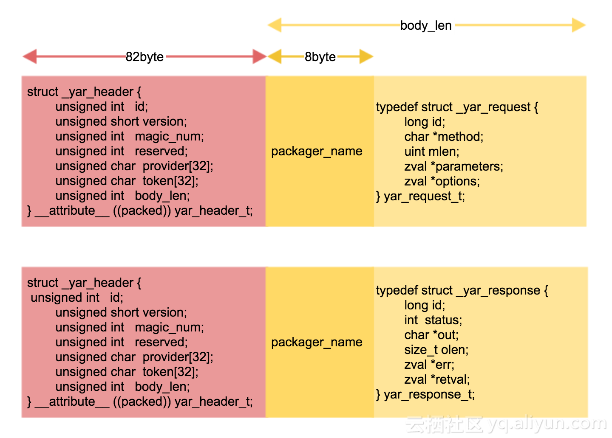
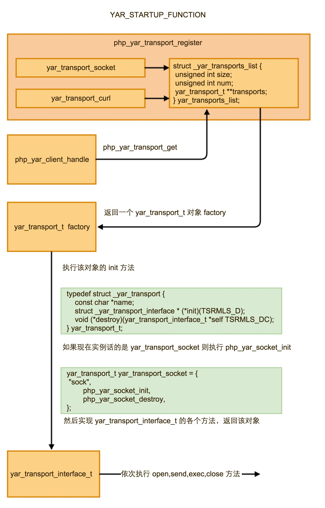

## [我与鸟哥 Yar 的亲密接触](https://yq.aliyun.com/articles/60058)

_摘要：_ 模块越来越多，业务越来越复杂，RPC 就上场了，在 PHP 的世界里，鸟哥的作品一直备受广大网友的青睐。下面一起学习下鸟哥的 PRC 框架 Yar 。 揭开 Yar 神秘面纱 RPC 采用客户端/服务器模式。首先，客户机调用进程发送一个有进程参数的调用信息到服务进程，然后等待应答信息。在服务器端 

模块越来越多，业务越来越复杂，RPC 就上场了，在 PHP 的世界里，鸟哥的作品一直备受广大网友的青睐。下面一起学习下鸟哥的 PRC 框架 Yar 。

## 揭开 Yar 神秘面纱

RPC 采用客户端/服务器模式。首先，客户机调用进程发送一个有进程参数的调用信息到服务进程，然后等待应答信息。在服务器端，进程保持睡眠状态直到调用信息的到达为止。当一个调用信息到达，服务器获得进程参数，计算结果，发送答复信息，然后等待下一个调用信息，最后，客户端调用进程接收答复信息，获得进程结果，然后调用执行继续进行。  
这和我们外网 api 的原理不都一个样么？那么我们一起看看高大上的 Yar 是怎么在玩。

### Yar 功能演示

客户端代码，假设该服务设在局域网10.211.55.4上

```php
<?php

class RpcClient {
    // RPC 服务地址映射表
    public static $rpcConfig = array(
        "RewardScoreService"    => "http://10.211.55.4/yar/server/RewardScoreService.class.php",
    );

    public static function init($server){
        if (array_key_exists($server, self::$rpcConfig)) {
            $uri = self::$rpcConfig[$server];
            return new Yar_Client($uri);
        }
    }
}

$RewardScoreService = RpcClient::init("RewardScoreService");
var_dump($RewardScoreService->support(1, 2));
```

服务器端代码

```php
<?php

class RewardScoreService {
    /**
     * $uid 给 $feedId 点赞
     * @param $feedId  interge
     * @param $uid  interge
     * @return void
     */
    public function support($uid,$feedId){
        return "uid = ".$uid.", feedId = ".$feedId;
    }
}

$yar_server = new Yar_server(new RewardScoreService());
$yar_server->handle();
```

访问结果如下

    uid = 1, feedId = 2
    

### Yar 远程调用的实现原理

实际呢，yar client 是通过`__call`这个魔术方法来实现远程调用的，在Yar_client类里面并没有任何方法，当我们在调用一个不存在的方式的时候，就会执行`__call`方法，这个在框架中非常常见。

### Yar 协议分析



在 yar 中规定的传输协议如下图所示，请求体为82个字节的yar_header_t和8字节的打包名称和请求实体yar_request_t，在yar_header_t里面用body_len记录8字节的打包名称+请求实体的长度；返回体类似，只是实体内容的结构体稍微不同，在reval里面才是实际最后客户端需要的结果。

整个传输以二进制流的形式传送。

### Yar 数据传输的整体流程分析

在yar_transport.h中，定义了yar_transport_t结构体，先不考虑并行处理的接口，以socket传输协议为例子学习，代码简化一些如下：

```c
typedef struct _yar_transport_interface {
    void *data;
    int  (*open)(struct _yar_transport_interface *self, char *address, uint len, long options, char **msg TSRMLS_DC);
    int  (*send)(struct _yar_transport_interface *self, struct _yar_request *request, char **msg TSRMLS_DC);
    struct _yar_response * (*exec)(struct _yar_transport_interface *self, struct _yar_request *request TSRMLS_DC);
    int  (*setopt)(struct _yar_transport_interface *self, long type, void *value, void *addition TSRMLS_DC);
    int  (*calldata)(struct _yar_transport_interface *self, yar_call_data_t *calldata TSRMLS_DC);
    void (*close)(struct _yar_transport_interface *self TSRMLS_DC);
} yar_transport_interface_t;


typedef struct _yar_transport {
    const char *name;
    struct _yar_transport_interface * (*init)(TSRMLS_D);
    void (*destroy)(yar_transport_interface_t *self TSRMLS_DC);
    yar_transport_multi_t *multi;
} yar_transport_t;
```

然后在transports/socket.c中定义了yar_transport_socket

```c
yar_transport_t yar_transport_socket = {
    "sock",
    php_yar_socket_init,
    php_yar_socket_destroy,
};
```

整理了整体的执行流程如下图



### Yar 数据的打包和解包

鸟哥在yar_packager.c中首先定义了一个结构体，初始化的时候会把各个yar_packager_t注册到**packagers数组中。

```c
struct _yar_packagers_list {
    unsigned int size;
    unsigned int num;
    yar_packager_t **packagers;
} yar_packagers_list;


typedef struct _yar_packager {
    const char *name;
    int  (*pack) (struct _yar_packager *self, zval *pzval, smart_str *buf, char **msg TSRMLS_DC);
    zval * (*unpack) (struct _yar_packager *self, char *content, size_t len, char **msg TSRMLS_DC);
} yar_packager_t;
```

然后通过传入的name和yar_packager_t的name做比较，相同则返回该实例

```c
PHP_YAR_API yar_packager_t * php_yar_packager_get(char *name, int nlen TSRMLS_DC) /* {{{ */ {
    int i = 0;
    for (;i<yar_packagers_list.num;i++) {
        if (strncasecmp(yar_packagers_list.packagers[i]->name, name, nlen) == 0) {
            return yar_packagers_list.packagers[i];
        }
    }

    return NULL;
} /* }}} */
```

**亲密接触完毕。纸上得来终觉浅，绝知此事要躬行。这篇博客只能是辅助大家在看源码时一起分析，觉得不能抛开源码仅仅看这篇博客。**

怎么样才能对这个内容真正的掌握呢，所以我有折腾了一个Java 版本的客户端，这样总算有所收获，这份代码也和我们平常写的业务逻辑还是有些区别，二进制的东西居多，整个过程下来对网络数据的传输有了更深刻的理解和学习哈。

Github 项目地址: [https://github.com/zhoumengkang/yar-java-client][0]

[0]: https://github.com/zhoumengkang/yar-java-client