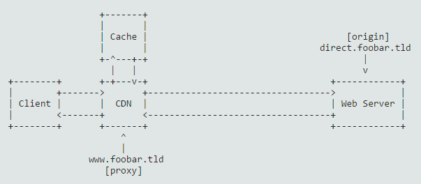
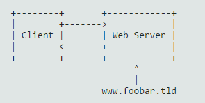

# 掌握 HTTP 缓存——从请求到响应过程的一切（上）

**CDN类的网站曾经一度雄踞 Alexa 域名排行的前 100。以前一些小网站不需要使用 CDN 或者根本负担不起其价格，不过这一现象近几年发生了很大的变化，CDN 市场上出现了很多按次付费，非公司性的提供商，这使得 CDN 变成人人都能负担的起的一种服务了。本文讲述的就是如何使用这种简单易用的缓存服务。**

使用内容分发网络（ CDN ）你需要先正确地认识 HTTP 响应头：和 HTTP 响应头中的哪些标签相关？它们是怎么起作用的？如何使用它们？文章中我会回答这些问题。

本文讲的并不会像教科书那么精确，实际上在某些情况下，为了叙述的清晰、简洁，我会按自己的理解简化某些问题，文章中会通过一些实际的例子来介绍缓存理论。在这篇文章的基础上，还会写一些文章来介绍对于某些指定的 CMS 或框架如何使用 CDN 来作为缓存层。

## 为什么使用 CDN？

CDN 是一个全球分布式网络，它把网站内容更快地传递给全球范围内的一个具体位置，而往往这个具体的位置离实际的内容服务器距离很远。举个例子，你的网站主机在爱尔兰，而你的用户则在澳大利亚访问。这时当你的用户访问你的网站的时候，延迟会很大，把你的（静态）数据用 CDN 放到澳大利亚则会很大程度上提高用户访问网站的体验。

然而 CDN 的使用并不局限于此。其实 CDN 可以理解成一个普通缓存，如**代理缓存**（边缘缓存）。即便你并不关心用户的具体地理位置，你也应该考虑使用 CDN 的代理缓存来提高你的用户体验。

## 为什么使用代理缓存？

简而言之，代理缓存会缓存你网站一些页面，通过缓存来传输“静态”内容非常快。一个简单的例子，假设你有一个带有开始页面的博客，这里面列出了所有近期的博客列表。完成这一过程，PHP 脚本要从数据库中获取到最近的文章实体，并且将它们转换成 HTML 结果页并返回给用户。因此，对于一次请求（访问）包含了：一次 PHP 执行 + 一组数据库查询。对于 1000 次请求（访问）包含了：1000 次 PHP 执行 + 1000 组数据库查询。每一次 PHP 执行都要进行 CPU、内存和 I/O 操作，对于数据库操作也是同样。

请求的需求量和访问用户的多少呈线性正比关系。听起来怎么样？不怎么样，因为这个线性关系是有最大限度的：磁盘最大只能提供一定程度的 I/O，CPU 和内存也都不是无限的。这样下去到了某个点，也就是说某个资源到了瓶颈的时候，就出现问题了：你的网站会访问的非常慢，甚至会出现所有人都不能访问的情况。其实这时其他资源并没有被全部打满。诚然，这时你可以扩展你的硬件规模来突破这一瓶颈，但是这将使工程变得很复杂，成本也更高。实际上还有更简单、更便宜的解决方法。

在中间加一层代理缓存，会减少资源对你的限制。拿前面的例子来讲，使用代理缓存只有第一次请求需要执行 PHP 脚本、查询数据库和生成 HTML 结果页。所有后面过来的请求都会从这个缓存中取内容，读取缓存几乎和直接读取内存一样快。这意味着，上面的线性规模瓶颈的问题解决了！100 个用户或者1000 个用户都没关系，依然只有 1 次 PHP 执行、1 次数据库查询和 1 次的结果页生成。

## CDN != CDN

CDN 的类型也各有不同。网站管理者可能会好奇数据是怎么存储的？存放在哪？以及数据是如何分布在 CDN 上的？是如何分发的呢？本文不是写给网站管理者的而是写给开发者的，所以在这我只能告诉你有“经典 CDN”和“对等 CDN”，后者是现在主流采用的方法。

对于开发者，相比于把数据拿到 CDN 以后做什么来说，会对如何把数据放到 CDN 中更感兴趣。说起来，有 **push CDN** 和 **pull CDN** 两种。顾名思义，“push CDN” 表示你要给 CDN 提供内容；“pull CDN” 表示如何从 CDN 取内容。

本文将主要介绍 pull CDN，因为在很多情况下 pull CDN 更加简单易用，不需要费多大事就能集成到现有的网站中。

## pull CDN 是如何起作用的？

我们来做个例子，假设你有一个可访问的网站，URL 是 [https://www.foobar.tld][0]。在这样的场景下，域名 www.foobar.tld 会被放到 pull CDN 服务器中，而不是你的网站服务器中。CDN 作为你网站服务器的一个**代理**。

还有一个不被公开的域名指向实际的网站服务器。在这个例子中假设它是 direct.foobar.tld，实际网站服务器叫做**源**。

这个 CDN 将会接受所有的请求。如果它的缓存中有结果的话将会直接返回给用户，否则会将这个请求托管给你实际的网站服务器，然后把返回的结果缓存起来为以后的请求做储备，同时将结果返回给用户。

最简单的 pull CDN 运行的过程如下：

* 获取一个页面的请求，这个页面：[http://www.foobar.tld/some/page][2]
* 把 some/page 当做缓存 key 检查缓存中是否存在
* 在缓存中则直接从缓存中返回结果给用户
* 不在缓存则请求 [http://direct.foobar.tld/some...][3]，把返回的结果以 some/page 作为 key 写入缓存，并返回结果给用户

## 静态内容 VS 动态内容

上面的这一过程对于完全静态的内容完全适用。静态内容指的是如果用户访问同一个 URL 地址，返回的所有数据都是一样的。比如 CSS 文件就有这样的特点，[http://www.foobar.tld/public/...][4] 这个文件是一个普通文件，对于所有访问网站的用户都是一样的，那么它就特别适合用缓存存起来。

和静态文件相对的是动态文件。内容在运行时才能确定，这种情况也是非常常见的。比如多语言问题，需要根据浏览器语言来返回内容。还有一些和 “user session” 相关的内容，比如当用户登陆了以后，就要把“登陆”按钮换成“退出”按钮，你肯定不希望这个被缓存。这些高度活跃的内容（如每小时或者更短时间更新的页面）不能被缓存，或者说不能在缓存中停留时间过长。

这就是缓存有意思的地方，理解和实现它并不难。

## 缓存头

绝大多数的 pull CDN 采用以“每页”缓存形式解决动态内容的问题。为了达到这样的效果，一个简单的方法是 HTPP 响应缓存头。

首先对于缓存头你需要知道有“旧版本”和“新版本”两种，就是说它并不是一开始就设计成当前所使用的这个版本的，也有一个逐渐演变的过程。新版本指的是 HTTP/1.1，而旧版本指的是 HTTP/1.0。它有特别多的可选选项，每个人对这个问题都很头疼。我认为这是大家不愿意使用缓存头的最重要的原因。

言归正传，我们只关注 ETag 和 Cache-Control 这两个标签就足以了。大多数 CDN 还支持旧版本（Expires，Pragma 和 Age），不过这些只作为向后兼容来使用。

### ETag 头

我们从最简单的开始 ETag：它是文档版本的标识符。通常是内容的 MD5 值，不过它也可以包含其他内容，代表的是文档的版本/日期，如： 1.0 或者 2017-02-27。这里注意一点是，它必须用双引号括起来，如：ETag: "d3b07384d113edec49eaa6238ad5ff00"。

#### 二次验证

现在来考虑 ETag 的实际应用：二次验证。我们暂时不考虑前面代理+源的架构模式，只考虑简单的客户端-服务器模式。如下图：

假设客户端请求了 [http://www.foobar.tld/hello.txt][6]，接着服务端返回了如下的响应内容：

    
    # REQUEST
    GET /hello.txt HTTP/1.1
    Host: www.foobar.tld
    
    # RESPONSE
    HTTP/1.1 200 OK
    Date: Sun, 05 Feb 2017 12:34:56 UTC
    Server: Apache
    Last-Modified: Sun, 05 Feb 2017 10:34:56 UTC
    ETag: "8a75d48aaf3e72648a4e3747b713d730"
    Content-Length: 8
    Content-Type: text/plain; charset=UTF-8
    
    the body
    

在响应里面，有两个有意思的头标识：一个是 ETag，内容的 MD5值，一个是 Last-Modified，这是 hello.txt 文件最后一次被修改的时间。

这里就是二次验证起作用的地方：当客户端在很短的时间内再次访问上面的 URL，客户端浏览器会使用 If-* 请求头。如 If-None-Match 检查 ETag 的内容是否有改变。也就是说，如果 ETag 发生变化，客户端接收到的一个完整的新响应；如果 ETag 没变化，客户端接收到的是一个表明内容没变化的标识。

    GET /hello.txt HTTP/1.1
    If-None-Match: "8a75d48aaf3e72648a4e3747b713d730"
    Host: www.foobar.tld
    

如果 ETag 没有改变，那么服务端将会返回：

    
    HTTP/1.1 304 Not Modified
    Date: Sun, 05 Feb 2017 12:34:57 UTC
    Server: Apache
    Last-Modified: Sun, 05 Feb 2017 10:34:56 UTC
    ETag: "8a75d48aaf3e72648a4e3747b713d730"
    Content-Length: 8
    Content-Type: text/plain; charset=UTF-8
    

正如上面所展示的，这次服务器的响应里面不是 _200 ok_，而是_304 Not Modified_，这就是说它略过包体部分，让客户端直接去自己的缓存里拿数据。在这个例子中，包体内容是 _the body_，比较小，效果不明显。可是想象一下如果是很大的内容呢，或者是很复杂的动态生成内容呢，价值就很大了。

作为一个开发者，你可能会想：“_并没有那么好用嘛，我还不得不掌握 IF- 类的头标识，比以前更费事了_”。

别急，这只是介绍了共享缓存，也就是代理缓存的由来，我们看原始的架构：<客户端-代理-源端>，代理根据自己的缓存返回给客户端 _304 Not Modified_，接下来的章节详解介绍，介绍之前我要先讲一下 Last-Modfied 头。

在处理上面那个 hello.txt 静态文件的例子时，客户端还可以使用 If-Not-Modified-Since: Sun, 05 Feb 2017 10:34:56 UTC 来达到同样的效果（返回 304 响应）。这对于静态文件来说也很好用，因为响应头中的 Last-Modified 标识是根据服务器磁盘上的“更改时间戳”自动生成的。然而，“更改时间戳”对于动态文件通常没什么用，因为动态生成文件频繁更新，时间戳很难确定。我们都知道，你最想缓存起来的是内容，生成内容的代价是最大的，所以 ETag 头是更好的选择。

### Cache-Control头

Cache-Control 头相对来讲难一些。两个原因：第一，Cache-Control 既可以用于请求头，也可以用于响应头。本文中着重讨论响应头，因为这是开发者所必须要掌握的。第二，它控制着**两个缓存**：本地缓存（又称私有缓存）和共享缓存。

**本地缓存**，是指在客户端本地机器中的缓存。站在开发者的角度，它并不完全受你的控制，通常浏览器会自己决定是否把某些内容放到缓存中，这意味着：不要依赖于本地缓存。用户也可能在关闭浏览器的时候清理所有缓存，而你并不知道有这样的操作。除非你监测到了某个用户的流量不断上涨，导致缓存内容迅速失效，这时候你才会意识到。

**共享缓存**，也就是本文所介绍的：处于客户端和服务器之间的缓存。即 CDN。你对共享缓存拥有绝对的控制，应该好好地利用它。

现在我们来用一些代码作为示例深入学习一下。

1. Cache-Control: public max-age=3600
1. Cache-Control: private immutable
1. Cache-Control: no-cache
1. Cache-Control: public max-age=3600 s-maxage=7200
1. Cache-Control: public max-age=3600 proxy-revalidate

乍一看这些代码很令人困惑，但是不要担心，它并没有那么难，我来一点点介绍。首先你要知道 Cache-Control 有三种属性：缓冲能力、过期时间和二次验证。

首先是**缓冲能力**，它关注的是缓存到什么地方，和是否应该被缓存。他的几个重要的属性是：

* private：表示它只应该存在本地缓存；
* public：表示它既可以存在共享缓存，也可以被存在本地缓存；
* no-cache：表示不论是本地缓存还是共享缓存，在使用它以前必须用缓存里的值来重新验证；
* no-store：表示不允许被缓存。

第二个是**过期时间**，很显然它关注的是内容可以被缓存多久。它的几个重要的属性是：

* max-age=<seconds>：设置缓存时间，设置单位为秒。本地缓存和共享缓存都可以；
* s-maxage=<seconds>：覆盖 max-age 属性。只在共享缓存中起作用。

最后一个是**二次验证**，表示精细控制。它的几个重要属性是：

* immutable：表示文档是不能更改的。
* must-revalidate：表示客户端（浏览器）必须检查代理服务器上是否存在，即使它已经本地缓存了也要检查。
* proxy-revalidata：表示共享缓存（CDN）必须要检查源是否存在，即使已经有缓存。

通过上面的具体解释，现在再来描述上面 Cache-Control 的那段代码所表达的意思就好理解多了：

1. 本地缓存和 CDN 缓存均缓存 1 小时；
1. 不能缓存在 CDN，只能缓存在本地。并且一旦被缓存了，则不能被更新；
1. 不能缓存。如果一定要缓存的话，确保对其进行了二次验证；
1. 本地缓存 1 小时，CDN 上缓存 2 小时；
1. 本地和 CDN 均缓存 1 小时。但是如果 CDN 收到请求，则尽管已经缓存了 1 小时，还是要检查源中文档是否已经被改变。

#### 实例

理论会很单调乏味，现在用短的实例来演示如何自动注入 ETag 和 Cache-Control 头。例子是一个 Apache 的 .htaccess 文件，但是我希望你能够领会要领，并且根据你自己的实际情况，应用到你自己的 Web 应用中。

    
    # 为所有图片设置 ETag，以及缓存时间为 1 天
    <FilesMatch "\.(gif|flv|jpg|jpeg|png|gif|swf)$">
        FileETag -INode MTime Size
        Header set Cache-Control "max-age=86400 public"
    </FilesMatch>
    
    # 为所有的 CSS 文件、JS 文件设置 ETag，以及缓存时间为 2 小时，同时保证进行了二次验证
    <FilesMatch "\.(js|css)$">
        FileETag -INode MTime Size
        Header set Cache-Control "max-age=7200 public must-revalidate"
        Header unset Last-Modified
    </FilesMatch>
    

上面例子，是一个对 URL：[http://www.foobar.tld/baz.jpg][7] 的响应。包含了一个 ETag 头，由更改时间和文件大小所构成，还有 Cache-Control 头来设定缓存 1 天的时间。见下面的请求和响应：

    
    # REQUEST
    GET /baz.jpg HTTP/1.1
    Host: www.foobar.tld
    
    # RESPONSE
    HTTP/1.1 200 OK
    Date: Tue, 07 Feb 2017 15:01:20 GMT
    Last-Modified: Tue, 07 Feb 2017 15:01:15 GMT
    ETag: "4-547f20501b9e9"
    Content-Length: 123
    Cache-Control: max-age=86400 public
    Content-Type: image/jpeg
    

对于 URL： [http://www.foobar.tld/dist/cs...][8] 的响应同样也包含了 ETag 头。由更改时间、文件大小和限定了 2 小时的 Cache-Control 构成。Last-Modfied 头也删除掉以确保只有 ETag 用来做二次验证。见下面的请求和响应：

    
    # REQUEST
    GET /styles.css HTTP/1.1
    Host: www.foobar.tld
    
    # RESPONSE
    HTTP/1.1 200 OK
    Date: Tue, 07 Feb 2017 15:00:00 GMT
    Server: Apache
    ETag: "20-547f1fbe02409"
    Content-Length: 32
    Cache-Control: max-age=7200 public must-revalidate
    Content-Type: text/css
    

## 小结

本文中我们介绍了：

1. 为什么要使用 CDN，以及 CDN 是如何起作用的。
1. 静态内容和动态内容分别是什么情况。
1. HTTP 头是如何解决缓存问题的。

那么想象一下这样的场景，假设你有个网站，需要保存用户的登录状态，而针对不同状态的用户需要不同的显示。通常情况下，我们是用 Cookie 来解决用户特性的问题。这时候问题就来了，如果 Cookie 也在 CDN 中缓存，那么将会导致所有用户的 Cookie 都一样，这不是我们想要看到的。那么怎么解决呢？我们会在《掌握 HTTP 缓存——从请求到响应过程的一切（下）》中详细介绍。

[0]: https://www.foobar.tld
[2]: http://www.foobar.tld/some/page
[3]: http://direct.foobar.tld/some/page
[4]: http://www.foobar.tld/public/css/main.css
[6]: http://www.foobar.tld/hello.txt
[7]: http://www.foobar.tld/baz.jpg
[8]: http://www.foobar.tld/dist/css/styles.css