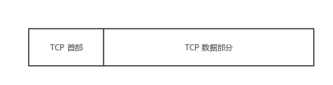
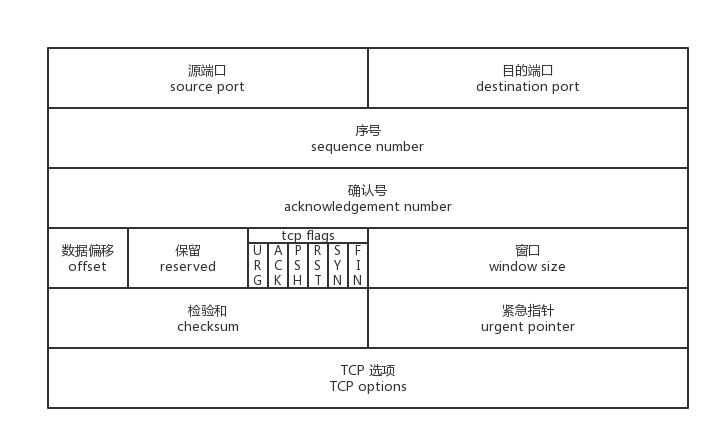
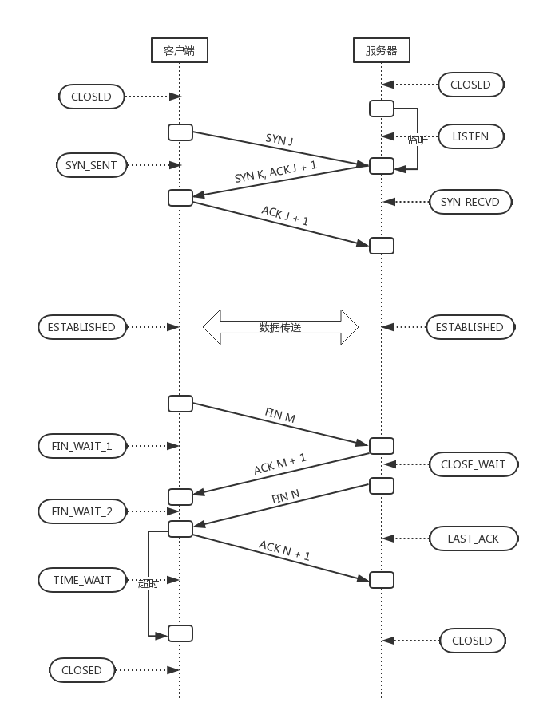
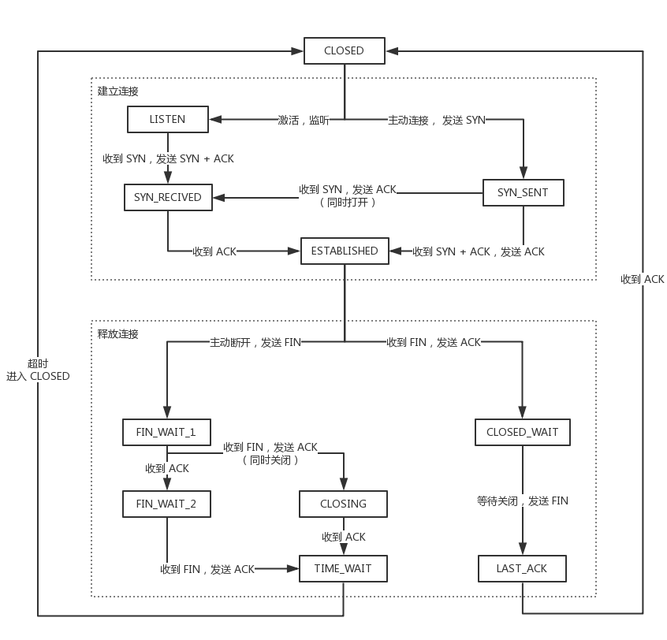
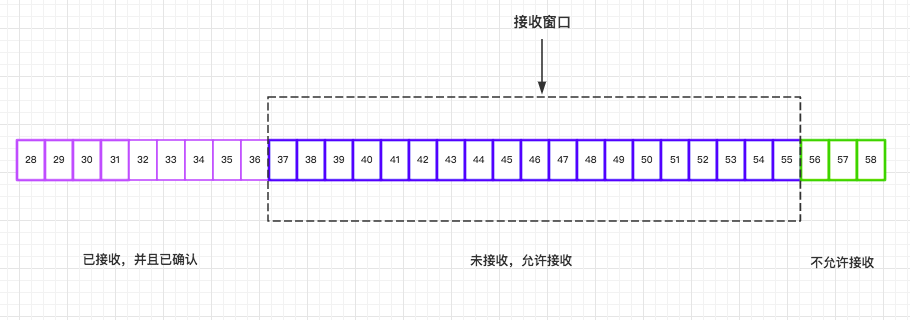
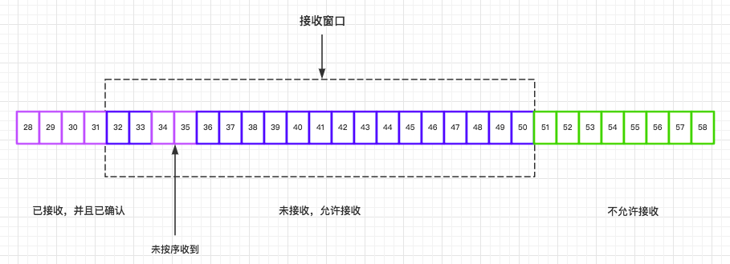
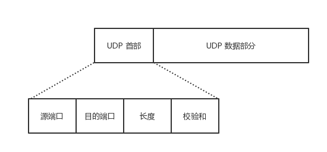
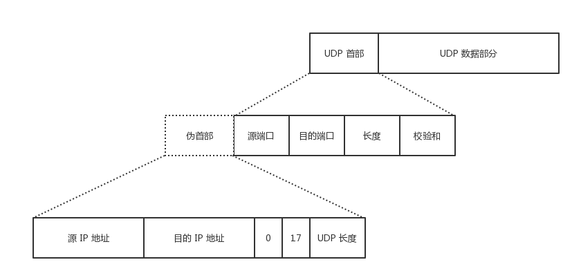
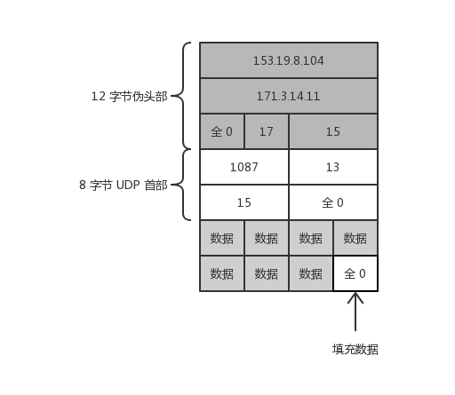

# 理解 TCP 和 UDP


# 端口
## 端口与进程
TCP 的包是不包含 IP 地址信息的，那是 IP 层上的事，但是有源端口和目的端口。    
就是说，端口这一东西，是属于 TCP 知识范畴的。    

我们知道两个进程，在计算机内部进行通信，可以有管道、内存共享、信号量、消息队列等方法。    
而两个进程如果需要进行通讯最基本的一个前提是能够唯一的标识一个进程，在本地进程通讯中我们可以使用 **「PID(进程标识符)」** 来唯一标识一个进程。    
但 PID 只在本地唯一，如果把两个进程放到了不同的两台计算机，然后他们要通信的话，PID 就不够用了，这样就需要另外一种手段了。    

解决这个问题的方法就是在运输层使用 **「协议端口号 (protocol port number)」**，简称 **「端口 (port)」**.    
我们知道 IP 层的 ip 地址可以唯一标识主机，而 TCP 层协议和端口号可以唯一标识主机的一个进程，这样我们可以利用：**「ip地址＋协议＋端口号」**唯一标示网络中的一个进程。    
在一些场合，也把这种唯一标识的模式称为**「套接字 (Socket)」**。    

这就是说，虽然通信的重点是应用进程，但我们只要把要传送的报文交到目的主机的某一个合适的端口，剩下的工作就由 TCP 来完成了。    

## 认识端口
TCP 用一个 16 位端口号来标识一个端口，可允许有 65536 ( 2的16次方) 个不同的端口号，范围在 0 ~ 65535 之间。    

端口号根据服务器使用还是客户端使用，以及常见不常见的维度来区分，主要有以下类别：

1. 服务器端使用的端口号
  - 熟知端口号
  - 登记端口号
2. 客户端使用的端口号

下面展开来说说。    
### 端口号的分类
#### 服务器端使用的端口号
**熟知端口号**：    
取值范围：0 ~ 1023。    
可以在 www.iana.org 查到，服务器机器一接通电源，服务器程序就运行起来，为了让因特网上所有的客户程序都能找到服务器程序，服务器程序所使用的端口就必须是固定的，并且总所众所周知的。    

一些常见的端口号：    

|应用程序 | FTP | TELNET | SMTP | DNS | TFTP | HTTP | HTTPS | SNMP |
| ---| --- | --- |--- |--- |--- |--- |--- |--- |--- |--- |--- |
|熟知端口号| **21** | 23 | 25 | 53 | 69 | **80** | **443** | 161 |

**登记端口号**：    
取值范围：1024 ~ 49151。    
这类端口没有熟知的应用程序使用，但是需要登记，以防重复

#### 客户端使用的端口号
取值范围：49152 ~ 65535。    
这类端口仅在客户端进程运行时才动态选择。    
又叫 短暂端口号，表示这种端口的存在时间是短暂的，客户进程并不在意操作系统给它分配的是哪一个端口号，因为客户进程之所以必须有一个端口号，是为了让传输层的实体能够找到自己。    

*PS：在`/etc/services`文件中可以查看所有知名服务使用的端口。*

# 参考
[《后台开发 核心技术与应用实践》](https://book.douban.com/subject/26850616/)    
[《计算机网络》](https://book.douban.com/subject/2970300/)

---


# TCP 报文结构

TCP 是面向字节流的，但传送的数据单元却是报文段。

**什么是报文？**    
例如一个 100kb 的 HTML 文档需要传送到另外一台计算机，并不会整个文档直接传送过去，可能会切割成几个部分，比如四个分别为 25kb 的数据段。    
而每个数据段再加上一个 TCP 首部，就组成了 TCP 报文。    
一共四个 TCP 报文，发送到另外一个端。    
另外一端收到数据包，然后再剔除 TCP 首部，组装起来。    
等到四个数据包都收到了，就能还原出来一个完整的 HTML 文档了。    

在 OSI 的七层协议中，第二层（数据链路层）的数据叫「Frame」，第三层（网络层）上的数据叫「Packet」，第四层（传输层）的数据叫「Segment」。

TCP 报文 (Segment)，包括首部和数据部分。    



而 TCP 的全部功能都体现在它首部中各字段的作用，只有弄清 TCP 首部各字段的作用才能掌握 TCP 的工作原理。    
TCP 报文段首部的前20个字节是固定的，后面有 4N 字节是根据需要而增加的。    
下图是把 TCP 报文中的首部放大来看。    



TCP 的首部包括以下内容：    

1. 源端口 source port    
2. 目的端口 destination port    
3. 序号 sequence number    
4. 确认号 acknowledgment number    
5. 数据偏移 offset    
6. 保留 reserved    
7. 标志位 tcp flags    
8. 窗口大小 window size    
9. 检验和 checksum    
10. 紧急指针 urgent pointer    
11. 选项 tcp options    

下面展开来描述个字段的意义和作用。    

## TCP 首部各字段的意义和作用

### 源端口和目的端口 Port
各占 2 个 字节，共 4 个字节。    
用来告知主机该报文段是来自哪里以及传送给哪个应用程序（应用程序绑定了端口）的。    
进行 TCP 通讯时，客户端通常使用系统自动选择的临时端口号，而服务器则使用知名服务端口号。    

### 序号 Sequence Number
占 4 个字节。    
TCP 是面向字节流的，在一个 TCP 连接中传输的字节流中的每个字节都按照顺序编号。    
例如 100 kb 的 HTML 文档数据，一共 102400 (100 * 1024) 个字节，那么每一个字节就都有了编号，整个文档的编号的范围是 0 ~ 102399。    

序号字段值指的是**本报文段**所发送的数据的第一个字节的序号。    
那么 100 的 HTML 文档分割成四个等分之后，    
第一个 TCP 报文段包含的是第一个 25kb 的数据，0 ~ 25599 字节， 该报文的序号的值就是：0    
第二个 TCP 报文段包含的是第二个 25kb 的数据，25600 ~ 51199 字节，该报文的序号的值就是：25600    
......    

根据 8 位 = 1 字节，那么 4 个字节可以表示的数值范围：[0, 2^32]，一共 2^32 (4294967296) 个序号。    
序号增加到最大值的时候，下一个序号又回到了 0.    
也就是说 TCP 协议可对 4GB  的数据进行编号，在一般情况下可保证当序号重复使用时，旧序号的数据早已经通过网络到达终点或者丢失了。    

### 确认号 Acknowledgemt Number
占 4 个字节。    
表示**期望收到对方下一个报文段的序号值**。    
TCP 的可靠性，是建立在「每一个数据报文都需要确认收到」的基础之上的。    
就是说，通讯的任何一方在收到对方的一个报文之后，都要发送一个相对应的「确认报文」，来表达确认收到。    
**那么，确认报文，就会包含确认号**。    
例如，通讯的一方收到了第一个 25kb 的报文，该报文的 序号值=0，那么就需要回复一个**确认报文**，其中的确认号 = 25600.    

### 数据偏移 Offset
占 0.5 个字节 (4 位)。    
这个字段实际上是指出了 **TCP 报文段的首部长度** ，它指出了 TCP报文段的数据起始处 距离 TCP报文的起始处 有多远。（注意 数据起始处 和 报文起始处 的意思）    

一个数据偏移量 = 4 byte，由于 4 位二进制数能表示的最大十进制数字是 15，因此数据偏移的最大值是 60 byte，这也侧面限制了 TCP 首部的最大长度。    

### 保留 Reserved
占 0.75 个字节 (6 位)。    
保留为今后使用，但目前应置为 0。    

### 标志位 TCP Flags
标志位，一共有 6 个，分别占 1 位，共 6 位 。    
每一位的值只有 0 和 1，分别表达不同意思。    

#### 紧急 URG (Urgent)
当 URG = 1 的时候，表示紧急指针（Urgent Pointer）有效。    
它告诉系统此报文段中有紧急数据，应尽快传送，而不要按原来的排队顺序来传送。    
URG 要与首部中的 紧急指针 字段配合使用。    

#### 确认 ACK (Acknowlegemt)
当 ACK = 1 的时候，确认号（Acknowledgemt Number）有效。    
一般称携带 ACK 标志的 TCP 报文段为「确认报文段」。    
TCP 规定，在连接建立后所有传送的报文段都必须把 ACK 设置为 1。    

#### 推送 PSH (Push)
当 PSH = 1 的时候，表示该报文段高优先级，接收方 TCP 应该尽快推送给接收应用程序，而不用等到整个 TCP 缓存都填满了后再交付。    

#### 复位 RST (Reset)
当 RST = 1 的时候，表示 TCP 连接中出现严重错误，需要释放并重新建立连接。    
一般称携带 RST 标志的 TCP 报文段为「复位报文段」。    

#### 同步 SYN (SYNchronization)
当 SYN = 1 的时候，表明这是一个请求连接报文段。    
一般称携带 SYN 标志的 TCP 报文段为「同步报文段」。    
在 TCP 三次握手中的第一个报文就是同步报文段，在连接建立时用来同步序号。    
对方若同意建立连接，则应在响应的报文段中使 SYN = 1 和 ACK = 1。    

#### 终止 FIN (Finis)
当 FIN = 1 时，表示此报文段的发送方的数据已经发送完毕，并要求释放 TCP 连接。    
一般称携带 FIN 的报文段为「结束报文段」。    
在 TCP 四次挥手释放连接的时候，就会用到该标志。    

### 窗口大小 Window Size
占 2 字节。    
该字段明确指出了现在允许对方发送的数据量，它告诉对方本端的 TCP 接收缓冲区还能容纳多少字节的数据，这样对方就可以控制发送数据的速度。    
窗口大小的值是指，从本报文段首部中的确认号算起，接收方目前允许对方发送的数据量。    
例如，假如确认号是 701 ，窗口字段是 1000。这就表明，从 701 号算起，发送此报文段的一方还有接收 1000 （字节序号是 701 ~ 1700） 个字节的数据的接收缓存空间。    

### 校验和 TCP Checksum
占 2 个字节。    
由发送端填充，接收端对 TCP 报文段执行 CRC 算法，以检验 TCP 报文段在传输过程中是否损坏，如果损坏这丢弃。    
检验范围包括首部和数据两部分，这也是 TCP 可靠传输的一个重要保障。    

### 紧急指针 Urgent Pointer
占 2 个字节。    
仅在 URG = 1 时才有意义，它指出本报文段中的紧急数据的字节数。    
当 URG = 1 时，发送方 TCP 就把紧急数据插入到本报文段数据的**最前面**，而在紧急数据后面的数据仍是普通数据。    
因此，紧急指针指出了紧急数据的末尾在报文段中的位置。    

# 参考
[《后台开发 核心技术与应用实践》](https://book.douban.com/subject/26850616/)    
[《计算机网络》](https://book.douban.com/subject/2970300/)


---

# TCP 的连接

TCP 的整个交流过程可以总结为：先建立连接，然后传输数据，最后释放链接。    



## 三次握手，建立连接
TCP 连接建立要解决的首要问题就是：**要使每一方能够确知对方的存在。**    

三次握手就像，在一个黑暗的森林，你知道前方十点钟方向好像有人。    
你喊了一句：Hello？I'am JerryC，Who are you？    
对面回了一句：Hi! I'am David, and nice to meet you!    
然后你回了一句：Nice to meet you too!    
......(自此，你们才算真正认识了双方，开始了后面省略3000字的谈话)    

所以说，两个人需要交朋友（两个端点需要建立连接），至少需要三次的通话（握手）    

其实，网络上的传输是没有连接的，TCP 也是一样的。    
而 TCP 所谓的「连接」，其实只不过是在通信的双方维护一个「连接状态」，让它看上去好像有连接一样。    

### 连接建立过程
TCP 连接的建立采用客户服务器方式，主动发起连接建立的一方叫**客户端（Client）**，被动等待连接建立的一方叫**服务器（Server）**。    

最初的时候，两端都处于 **CLOSED** 的状态，然后服务器打开了 TCP 服务，进入 **LISTEN** 状态，监听特定端口，等待客户端的 TCP 请求。    

**第一次握手**：
客户端主动打开连接，发送 TCP 报文，进行第一次握手，然后进入 **SYN_SEND** 状态，等待服务器发回确认报文。    
这时首部的同步位 SYN = 1，同时初始化一个序号 Sequence Number = J。    
TCP 规定，SYN 报文段不能携带数据，但会消耗一个序号。    

**第二次握手**：
服务器收到了 SYN 报文，如果同意建立连接，则向客户端发送一个确认报文，然后服务器进入 **SYN_RCVD** 状态。    
这时首部的 SYN = 1，ACK = 1，而确认号 Acknowledgemt Number = J + 1，同时也为自己初始化一个序号 Sequence Number = K。    
这个报文同样不携带数据。    

**第三次握手**：    
客户端收到了服务器发过来的确认报文，还要向服务器给出确认，然后进入 **ESTABLISHED** 状态。    
这时首部的 SYN 不再置为 1，而 ACK = 1，确认号 Acknowledgemt Number = K + 1，序号 Sequence Number = J + 1。    
第三次握手，一般会携带真正需要传输的数据，当服务器收到该数据报文的时候，就会同样进入 **ESTABLISHED** 状态。
此时，TCP 连接已经建立。    

对于建立连接的三次握手，主要目的是初始化序号 Sequence Number，并且通信的双方都需要告知对方自己的初始化序号，所以这个过程也叫 SYN。    
这个序号要作为以后的数据通信的序号，以保证应用层接收到的数据不会因为网络上的传输问题而乱序，因为TCP 会用这个序号来拼接数据。    

### 利用连接设计缺陷实施 TCP Flood 攻击
知道了 TCP 建立一个连接，需要进行三次握手。    
但如果你开始思考「三次握手的必要性」的时候，就会知道，其实网络是很复杂的，一个信息在途中丢失的可能性是有的。    
如果数据丢失了，那么，就需要重新发送，这时候就要知道数据是否真的送达了。    
这就是三次握手的必要性。    
但是再向深一层思考，你给我发信息，我收到了，我回复，因为我是君子。    
如果是小人，你给我发信息，我就算收到了，我也不回复，你就一直等我着我的回复。    
那么很多小人都这样做，你就要一直记住你在等待着小人1号、小人2号、小人3号......直到你的脑容量爆棚，烧坏脑袋。    
黑客就是利用这样的设计缺陷，实施 TCP Flood 攻击，属于 DDOS 攻击的一种。   
想了解更多 SYN Flood 攻击请看：[SYN flood - wiki](https://www.wikiwand.com/en/SYN_flood) 

## 四次挥手，释放连接

TCP 有一个特别的概念叫做**半关闭**，这个概念是说，TCP 的连接是全双工（可以同时发送和接收）的连接，因此在关闭连接的时候，必须关闭传送和接收两个方向上的连接。    
客户端给服务器发送一个携带 FIN 的 TCP 结束报文段，然后服务器返回给客户端一个 确认报文段，同时发送一个 结束报文段，当客户端回复一个 确认报文段 之后，连接就结束了。    

### 释放连接过程

在结束之前，通信双方都是处于 **ESTABLISHED** 状态，然后其中一方主动断开连接。    
下面假如客户端先主动断开连接。    

**第一次挥手：**     
客户端向服务器发送结束报文段，然后进入 **FIN_WAIT_1** 状态。    
此报文段 FIN = 1， Sequence Number = M。    

**第二次挥手：**     
服务端收到客户端的结束报文段，然后发送确认报文段，进入 **CLOSE_WAIT** 状态。    
此报文段 ACK = 1， Sequence Number = M + 1。    

客户端收到该报文，会进入 **FIN_WAIT_2** 状态。    

**第三次挥手：**     
同时服务端向客户端发送结束报文段，然后进入 **LAST_ACK** 状态。    
此报文段 FIN = 1，Sequence Number = N。    

**第四次挥手：**    
客户端收到服务端的结束报文段，然后发送确认报文段，进入 **TIME_WAIT** 状态，经过 2MSL 之后，自动进入 **CLOSED** 状态。    
此报文段 ACK = 1, Sequence Number = N + 1。    

服务端收到该报文之后，进入 **CLOSED** 状态。    

**关于 TIME_WAIT 过渡到 CLOSED 状态说明**：    
从 **TIME_WAIT** 进入 **CLOSED** 需要经过 2MSL，其中 MSL 就叫做 最长报文段寿命（Maxinum Segment Lifetime），根据 RFC 793 建议该值这是为 2 分钟，也就是说需要经过 4 分钟，才进入 **CLOSED** 状态。    

# 参考
[《后台开发 核心技术与应用实践》](https://book.douban.com/subject/26850616/)    
[《计算机网络》](https://book.douban.com/subject/2970300/)

---

## 状态流转

无论客户端还是服务器，在双方 TCP 通讯的过程中，都会有着一个「状态」的概念，状态会随着 TCP 通讯的不同阶段而变化。

### TCP 状态流转图


### 各种状态表示的意思

**CLOSED**：表示初始状态

**LISTEN**：表示服务器端的某个 socket 处于监听状态，可以接受连接

**SYN_SENT**：在服务端监听后，客户端 socket 执行 CONNECT 连接时，客户端发送 SYN 报文，此时客户端就进入 SYN_SENT 状态，等待服务端确认。

**SYN_RCVD**：表示服务端接收到了 SYN 报文。

**ESTABLISHED**：表示连接已经建立了。

**FIN_WAIT_1**：其中一方请求终止连接，等待对方的 FIN 报文。

**FIN_WAIT_2**：在 **FIN_WAIT_2** 之后， 当对方回应 ACK 报文之后，进入该状态。

**TIME_WAIT**：表示收到了对方的 FIN 报文，并发送出了 ACK 报文，就等 2MSL 之后即可回到 CLOSED 状态。

**CLOSING**：一种罕见状态，发生在发送 FIN 报文之后，本应是先收到 ACK 报文，却先收到对方的 FIN 报文，那么就从 FIN_WAIT_1 的状态进入 CLOSING 状态。

**CLOSE_WAIT**：表示等待关闭，在 ESTABLISHED 过渡到 LAST_ACK 的一个过渡阶段，该阶段需要考虑是否还有数据发送给对方，如果没有，就可以关闭连接，发送 FIN 报文，然后进入 LAST_ACK 状态。

**LAST_ACK**：被动关闭一方发送 FIN 报文之后，最后等待对方的 ACK 报文所处的状态。

**CLOSED**：当收到 ACK 保温后，就可以进入 CLOSED 状态了。

# 参考
[《后台开发 核心技术与应用实践》](https://book.douban.com/subject/26850616/)    
[《计算机网络》](https://book.douban.com/subject/2970300/)

---

# 可靠性交付的实现

TCP 是一种提供可靠性交付的协议。    
也就是说，通过 TCP 连接传输的数据，无差错、不丢失、不重复、并且按序到达。    
但是在网络中相连两端之间的介质，是复杂的，并不确保数据的可靠性交付，那么 TCP 是怎么样解决问题的？    
这就需要了解 TCP 的几种技术：    

1. 滑动窗口    
2. 超时重传    
3. 流量控制    
4. 拥塞控制    

下面来分别讲一下这几种技术的实现原理。    

# 超时重传
## 重传时机
TCP 报文段在传输的过程中，下面的情况都是有可能发生的：

1. 数据包中途丢失；
2. 数据包顺利到达，但对方发送的 ACK 报文中途丢失；
3. 数据包顺利到达，但对方异常未响应 ACK 或被对方丢弃；

当出现这些异常情况时，TCP 就会超时重传。    
TCP 每发送一个报文段，就对这个报文段设置一次计时器。只要计时器设置的重传时间到了，但还没有收到确认，就重传这一报文段，这个就叫做「超时重传」。    

## 重传算法

### 先认识两个概念

#### RTO ( Retransmission Time-Out ) 重传超时时间
指发送端发送数据后、重传数据前等待接收方收到该数据 ACK 报文的时间。    
大白话就是，需要等待多长时间还没收到确认，就重新传一次。    

RTO 的设置对于重传非常重要：    

1. 设长了，重发就慢，没有效率，性能差；
2. 设短了，重发得就快，会增加网络拥塞，导致更多的超时，更多的超时导致更多的重发。

#### RTT ( Round Trip Time ) 连接往返时间
指发送端从发送 TCP 包开始到接收它的 ACK 报文之间所耗费的时间。    
而在实际的网络传输中，RTT 的值每次都是随机的，无法事先预预知。    
TCP 通过测量来获得连接当前 RTT 的一个估计值，并以该 RTT 估计值为基准来设置当前的 RTO。    
这就引入了一类算法的称呼：自适应重传算法（Adaptive Restransmission Algorithm）    
这类算法的关键就在于对当前 RTT 的准确估计，以便适时调整 RTO。    

关于自适应重传算法，经历过多次的迭代和修正。    
从 1981 年的 [RFC793](https://tools.ietf.org/html/rfc793) 提及的经典算法，到 1987 年 Karn 提出的 Karn/Partridge 算法，再到后来的 1988 年的 Jacobson / Karels 算法。    
最后的这个算法在被用在今天的 TCP 协议中（Linux的源代码在：[`tcp_rtt_estimator`](http://lxr.free-electrons.com/source/net/ipv4/tcp_input.c?v=2.6.32#L609)）。    

自适应重传算法的发展读者有兴趣可以参考其他资料，在这里我拎一个现在在用的算法出来讲讲，随意感受一下。    

### Jacobson / Karels 算法
1988年，有人推出来了一个新的算法，这个算法叫 Jacobson / Karels Algorithm（参看[RFC6298](https://tools.ietf.org/html/rfc2988)）。    
其计算公式：

> SRTT = SRTT + α ( RTT – SRTT )  —— 计算平滑 RTT

> DevRTT = ( 1-β ) * DevRTT + β * ( | RTT - SRTT | ) ——计算平滑 RTT 和真实的差距（加权移动平均）

> RTO= µ * SRTT + ∂ * DevRTT 

其中：
* `α`、`β`、`μ`、`∂` 是可以调整的参数，在 RFC6298 中给出了对应的参考值，而在Linux下，α = 0.125，β = 0.25， μ = 1，∂ = 4；

* SRTT 是 Smoothed RTT 的意思，是 RTT 的平滑计算值，即根据每次测量的 RTT 和旧的 RTT 进行运算，得出新的 RTT。SRTT 的值，会在每一次测量到 RTT 之后进行更新；

* DevRTT 是 Deviation RTT 的意思，根据每次测量的 RTT 和旧的 SRTT 值进行运算，得出新的 DevRTT；

由算法可以知道 RTO 的值会根据每次测量的 RTT 值变化而变化，基本要点是 TCP 监视每个连接的性能，由每一个 TCP 的连接情况推算出合适的 RTO 值，根据不同的网络情况，自动修改 RTO 值，以适应负责的网络变化。

# 拥塞控制
# 滑动窗口 Sliding Window
滑动窗口协议比较复杂，也是 TCP 协议的精髓所在。    

TCP 头里有一个字段叫 Window，叫 Advertised-Window，这个字段是接收端告诉发送端自己还有多少缓冲区可以接收数据。于是发送端就可以根据这个接收端的处理能力来发送数据，而不会导致接收端处理不过来。    

滑动窗口分为「接收窗口」和「发送窗口」    
因为 TCP 协议是全双工的，会话的双方都可以同时接收和发送，那么就需要各自维护一个「发送窗口」和「接收窗口」。    

## 发送窗口
大小取决于对端通告的接受窗口。    
只有收到对端对于本端发送窗口内字节的 ACK 确认，才会移动发送窗口的左边界。    

下图是发送窗口的示意图：


对于发送窗口，在缓存内的数据有四种状态：

- \#1 已发送，并得到接收方 ACK 确认；
- \#2 已发送，但还未收到接收方 ACK；
- \#3 未发送，但接收方允许发送，接收方还有空间
- \#4 未发送，且接收方不允许发送，接收方没有空间

如果下一刻，收到了接收方对于 32-36 字节序的数据包的 ACK 确认，那么发送方的窗口就会发生「滑动」。    
并且发送下一个 46-51 字节序的数据包。    


滑动窗口的概念，描述了 TCP 的数据是怎么发送，以及怎么接收的。    
TCP 的滑动窗口是动态的，我们可以想象成小学常见的一个数学题，一个水池，体积 V，每小时进水量 V1, 出水量 V2。    
当水池满了就不允许再注入了，如果有个液压系统控制水池大小，那么就可以控制水的注入速率和量了。    
应用程序可以根据自身的处理能力变化，通过 API 来控制本端 TCP 接收窗口的大小，来进行流量控制。    

## 接收窗口
大小取决于应用、系统、硬件的限制。    

下图是接收窗口的示意图（找不到图，唯有自己画了）：    


相对于发送窗口，接受窗口在缓存内的数据只有三种状态：

* 已接收已确认；
* 未接收，准备接收；
* 未接收，并未准备接收；

下一刻接收到来自发送端的 32-36 数据包，然后回送 ACK 确认报，并且移动接收窗口。    



另外接收端相对于发送端还有不同的一点，只有前面所有的段都确认的情况下才会移动左边界，    
在前面还有字节未接收但收到后面字节的情况下，窗口不会移动，并不对后续字节确认，以此确保对端会对这些数据重传。    
假如 32-36 字节不是一个报文段的，而是每个字节一个报文段的话，那么就会分成了 5 个报文段。    
在实际的网络环境中，不能确保是按序收到的，其中会有一些早达到，一些迟到达。    



如图中的 34、35 字节序，先收到了，接收窗口也不会移动。    
因为有可能 32、33 字节序会出现丢包或者超时，这时就需要发送端重发报文段了。    

# 参考
[The TCP/IP Guide](http://www.tcpipguide.com/free/t_TCPSlidingWindowAcknowledgmentSystemForDataTranspo.htm)    
[TCP 的那些事儿（下）](http://coolshell.cn/articles/11609.html)    
[《后台开发 核心技术与应用实践》](https://book.douban.com/subject/26850616/)    
[《计算机网络》](https://book.douban.com/subject/2970300/)    


----

# 一切皆 Socket
我们已经知道网络中的进程是通过 socket 来通信的，那什么是 socket 呢？
socket 起源于 UNIX，而 UNIX/Linux 基本哲学之一就是「一切皆文件」，都可以用「open → write/read → close」模式来操作。
socket 其实就是该模式的一个实现，socket 即是一种特殊的文件，一些 socket 函数就是对其进行的操作。

使用 TCP/IP 协议的应用程序通常采用系统提供的编程接口：**UNIX BSD 的套接字接口（Socket Interfaces）**
以此来实现网络进程之间的通信。
就目前而言，几乎所有的应用程序都是采用 socket，所以说现在的网络时代，网络中进程通信是无处不在，**一切皆 socket**

# 套接字接口 Socket Interfaces
套接字接口是一组函数，由操作系统提供，用以创建网络应用。
大多数现代操作系统都实现了套接字接口，包括所有 Unix 变种，Windows 和 Macintosh 系统。

> **套接字接口的起源**
套接字接口是加州大学伯克利分校的研究人员在 20 世纪 80 年代早起提出的。
伯克利的研究者使得套接字接口适用于任何底层的协议，第一个实现就是针对 TCP/IP 协议，他们把它包括在 Unix 4.2 BSD 的内核里，并且分发给许多学校和实验室。
这在因特网的历史成为了一个重大事件。
—— 《深入理解计算机系统》

从 Linux 内核的角度来看，一个套接字就是通信的一个端点。
从 Linux 程序的角度来看，套接字是一个有相应描述符的文件。
普通文件的打开操作返回一个文件描述字，而 socket() 用于创建一个 socket 描述符，唯一标识一个 socket。
这个 socket 描述字跟文件描述字一样，后续的操作都有用到它，把它作为参数，通过它来进行一些操作。

常用的函数有：
- socket()
- bind()
- listen()
- connect()
- accept()
- write()
- read()
- close()

# Socket 的交互流程


图中展示了 TCP 协议的 socket 交互流程，描述如下：
1. 服务器根据地址类型、socket 类型、以及协议来创建 socket。
2. 服务器为 socket 绑定 IP 地址和端口号。
3. 服务器 socket 监听端口号请求，随时准备接收客户端发来的连接，这时候服务器的 socket 并没有全部打开。
4. 客户端创建 socket。
5. 客户端打开 socket，根据服务器 IP 地址和端口号试图连接服务器 socket。
6. 服务器 socket 接收到客户端 socket 请求，被动打开，开始接收客户端请求，知道客户端返回连接信息。这时候 socket 进入阻塞状态，阻塞是由于 accept() 方法会一直等到客户端返回连接信息后才返回，然后开始连接下一个客户端的连接请求。
7. 客户端连接成功，向服务器发送连接状态信息。
8. 服务器 accept() 方法返回，连接成功。
9. 服务器和客户端通过网络 I/O 函数进行数据的传输。
10. 客户端关闭 socket。
11. 服务器关闭 socket。

这个过程中，服务器和客户端建立连接的部分，就体现了 TCP 三次握手的原理。

下面详细讲一下 socket 的各函数。

## Socket 接口
socket 是系统提供的接口，而操作系统大多数都是用 C/C++ 开发的，自然函数库也是 C/C++ 代码。

## socket 函数
该函数会返回一个套接字描述符（socket descriptor），但是该描述符仅是部分打开的，还不能用于读写。
如何完成打开套接字的工作，取决于我们是客户端还是服务器。

### 函数原型
```C++
#include <sys/socket.h>

int socket(int domain, int type, int protocol);
```

### 参数说明
**domain**: 
协议域，决定了 socket 的地质类型，在通信中必须采用对应的地址。
常用的协议族有：`AF_INET`（ipv4地址与端口号的组合）、`AF_INET6`（ipv6地址与端口号的组合）、`AF_LOCAL`（绝对路径名作为地址）。
该值的常量定义在 `sys/socket.h` 文件中。

**type**:
指定 socket 类型。
常用的类型有：`SOCK_STREAM`、`SOCK_DGRAM`、`SOCK_RAW`、`SOCK_PACKET`、`SOCK_SEQPACKET`等。
其中 `SOCK_STREAM` 表示提供面向连接的稳定数据传输，即 TCP 协议。
该值的常量定义在 `sys/socket.h` 文件中。

**protocol**:
指定协议。
常用的协议有：`IPPROTO_TCP`（TCP协议）、`IPPTOTO_UDP`（UDP协议）、`IPPROTO_SCTP`（STCP协议）。
当值位 0 时，会自动选择 `type` 类型对应的默认协议。

## bind 函数
由服务端调用，把一个地址族中的特定地址和 socket 联系起来。

### 函数原型
```c++
#include <sys/socket.h>

int bind(int sockfd, const struct sockaddr *addr, socklen_t addrlen);
```

### 参数说明
**sockfd**:
即 socket 描述字，由 socket() 函数创建。

***addr**：
一个 `const struct sockaddr` 指针，指向要绑定给 `sockfd` 的协议地址。
这个地址结构根据地址创建 socket 时的地址协议族不同而不同，例如 ipv4 对应 `sockaddr_in`，ipv6 对应 `sockaddr_in6`.
这几个结构体在使用的时候，都可以强制转换成 `sockaddr`。
下面是这几个结构体对应的所在的头文件：
1. `sockaddr`： `sys/socket.h`
2. `sockaddr_in`： `netinet/in.h`
3. `sockaddr_in6`： `netinet6/in.h`

> _in 后缀意义：互联网络(internet)的缩写，而不是输入(input)的缩写。

## listen 函数
服务器调用，将 socket 从一个主动套接字转化为一个监听套接字（listening socket）, 该套接字可以接收来自客户端的连接请求。
在默认情况下，操作系统内核会认为 socket 函数创建的描述符对应于主动套接字（active socket）。

### 函数原型
```C++
#include <sys/socket.h>
int listen(int sockfd, int backlog);
```

### 参数说明
**sockfd**:
即 socket 描述字，由 socket() 函数创建。

**backlog**:
指定在请求队列中的最大请求数，进入的连接请求将在队列中等待 accept() 它们。

## connect 函数
由客户端调用，与目的服务器的套接字建立一个连接。

### 函数原型
```C++
#include <sys/socket.h>
int connect(int clientfd, const struct sockaddr *addr, socklen_t addrlen);
```

### 参数说明
**clientfd**:
目的服务器的 socket 描述符

***addr**:
一个 `const struct sockaddr` 指针，包含了目的服务器 IP 和端口。

**addrlen**：
协议地址的长度，如果是 ipv4 的 TCP 连接，一般为 `sizeof(sockaddr_in)`;

## accept 函数
服务器调用，等待来自客户端的连接请求。
当客户端连接，accept 函数会在 `addr` 中会填充上客户端的套接字地址，并且返回一个已连接描述符（connected descriptor），这个描述符可以用来利用 Unix I/O 函数与客户端通信。

### 函数原型
```C++
#indclude <sys/socket.h>
int accept(int listenfd, struct sockaddr *addr, int *addrlen);
```

### 参数说明
**listenfd**:
服务器的 socket 描述字，由 socket() 函数创建。

***addr**:
一个 `const struct sockaddr` 指针，用来存放提出连接请求客户端的主机的信息

***addrlen**:
协议地址的长度，如果是 ipv4 的 TCP 连接，一般为 `sizeof(sockaddr_in)`。

## close 函数
在数据传输完成之后，手动关闭连接。

### 函数原型
```C++
#include <sys/socket.h>
#include <unistd.h>
int close(int fd);
```

### 参数说明
**fd**:
需要关闭的连接 socket 描述符

## 网络 I/O 函数
当客户端和服务器建立连接后，可以使用网络 I/O 进行读写操作。
网络 I/O 操作有下面几组：
1. read()/write()
2. recv()/send()
3. readv()/writev()
4. recvmsg()/sendmsg()
5. recvfrom()/sendto()

最常用的是 read()/write()
他们的原型是：

```C++
ssize_t read(int fd, void *buf, size_t count);
ssize_t write(int fd, const void *buf, size_t count);
```

鉴于该文是侧重于描述 socket 的工作原理，就不再详细描述这些函数了。

# 实现一个简单 TCP 交互
## 服务端

```C++
// socket_server.cpp

#include <stdio.h>
#include <stdlib.h>
#include <string.h>
#include <errno.h>
#include <sys/types.h>
#include <sys/socket.h>
#include <netinet/in.h>
#include <unistd.h>

#define MAXLINE 4096 // 4 * 1024

int main(int argc, char **argv)
{
    int listenfd, // 监听端口的 socket 描述符
        connfd;   // 连接端 socket 描述符
    struct sockaddr_in servaddr;
    char buff[MAXLINE];
    int n;

    // 创建 socket，并且进行错误处理
    if ((listenfd = socket(AF_INET, SOCK_STREAM, 0)) == -1)
    {
        printf("create socket error: %s(errno: %d)\n", strerror(errno), errno);
        return 0;
    }

    // 初始化 sockaddr_in 数据结构
    memset(&servaddr, 0, sizeof(servaddr));
    servaddr.sin_family = AF_INET;
    servaddr.sin_addr.s_addr = htonl(INADDR_ANY);
    servaddr.sin_port = htons(6666);

    // 绑定 socket 和 端口
    if (bind(listenfd, (struct sockaddr *)&servaddr, sizeof(servaddr)) == -1)
    {
        printf("bind socket error: %s(errno: %d)\n", strerror(errno), errno);
        return 0;
    }

    // 监听连接
    if (listen(listenfd, 10) == -1)
    {
        printf("listen socket error: %s(errno: %d)\n", strerror(errno), errno);
        return 0;
    }

    printf("====== Waiting for client's request======\n");

    // 持续接收客户端的连接请求
    while (true)
    {
        if ((connfd = accept(listenfd, (struct sockaddr *)NULL, NULL) == -1))
        {
            printf("accept socket error: %s(errno: %d)\n", strerror(errno), errno);
            continue;
        }

        n = recv(connfd, buff, MAXLINE, 0);
        buff[n] = '\0';
        printf("recv msg from client: %s\n", buff);
        close(connfd);
    }

    close(listenfd);
    return 0;
}
```

## 客户端
```C++
// socket_client.cpp

#include <stdio.h>
#include <stdlib.h>
#include <string.h>
#include <errno.h>
#include <sys/types.h>
#include <sys/socket.h>
#include <netinet/in.h>
#include <arpa/inet.h>
#include <unistd.h>

#define MAXLINE 4096

int main(int argc, char **argv)
{
    int sockfd, n;
    char recvline[4096], sendline[4096];
    struct sockaddr_in servaddr;

    if (argc != 2)
    {
        printf("usage: ./client <ipaddress>\n");
        return 0;
    }

    // 创建 socket 描述符
    if ((sockfd = socket(AF_INET, SOCK_STREAM, 0)) < 0)
    {
        printf("create socket error: %s(errno: %d)\n", strerror(errno), errno);
        return 0;
    }

    // 初始化目标服务器数据结构
    memset(&servaddr, 0, sizeof(servaddr));
    servaddr.sin_family = AF_INET;
    servaddr.sin_port = htons(6666);
    // 从参数中读取 IP 地址
    if (inet_pton(AF_INET, argv[1], &servaddr.sin_addr) <= 0)
    {
        printf("inet_pton error for %s\n", argv[1]);
        return 0;
    }

    // 连接目标服务器，并和 sockfd 联系起来。
    if (connect(sockfd, (struct sockaddr *)&servaddr, sizeof(servaddr)) < 0)
    {
        printf("connect error: %s(errno: %d)\n", strerror(errno), errno);
        return 0;
    }

    printf("send msg to server: \n");

    // 从标准输入流中读取信息
    fgets(sendline, 4096, stdin);

    // 通过 sockfd，向目标服务器发送信息
    if (send(sockfd, sendline, strlen(sendline), 0) < 0)
    {
        printf("send msg error: %s(errno: %d)\n", strerror(errno), errno);
        return 0;
    }

    // 数据传输完毕，关闭 socket 连接
    close(sockfd);
    return 0;
}
```

# Run
首先创建 `makefile` 文件
```makefile
all:server client
server:socket_server.o
    g++ -g -o socket_server socket_server.o
client:socket_client.o
    g++ -g -o socket_client socket_client.o
socket_server.o:socket_server.cpp
    g++ -g -c socket_server.cpp
socket_client.o:socket_client.cpp
    g++ -g -c socket_client.cpp
clean:all
    rm all
```

然后使用命令:
```
$ make
```

会生成两个可执行文件：
1. `socket_server`
2. `socket_client`

分别打开两个终端，运行：
1. `./socket_server`
2. `./socket_client 127.0.0.1`

然后在 `socket_client` 中键入发送内容，可以再 `socket_server` 接收到同样的信息。

# 参考
[《后台开发 核心技术与应用实践》](https://book.douban.com/subject/26850616/)
[《计算机网络》](https://book.douban.com/subject/2970300/)

----

# UDP 和 TCP 的不同
TCP 在传送数据之前必须先建立连接，数据传送结束后要释放连接。    
TCP 不提供广播或多播服务，由于 TCP 要提供可靠的、面向连接的运输服务，因此不可避免地增加了许多的开销，如确认、流量控制、计时器以及连接管理等。    

而 UDP 在传送数据之前不需要先建立连接。接收方收到 UDP 报文之后，不需要给出任何确认。    
虽然 UDP 不提供可靠交付，但在某些情况下 UDP 却是一种最有效的工作方式。    

简单来说就是：

**UDP：单个数据报，不用建立连接，简单，不可靠，会丢包，会乱序；**

**TCP：流式，需要建立连接，复杂，可靠 ，有序。**


# UDP 概述
UDP 全称 User Datagram Protocol, 与 TCP 同是在网络模型中的传输层的协议。

**UDP 的主要特点是：**

1. **无连接的**，即发送数据之前不需要建立连接，因此减少了开销和发送数据之前的时延。
2. **不保证可靠交付**，因此主机不需要为此复杂的连接状态表
3. **面向报文的**，意思是 UDP 对应用层交下来的报文，既不合并，也不拆分，而是保留这些报文的边界，在添加首部后向下交给 IP 层。
4. **没有阻塞控制**，因此网络出现的拥塞不会使发送方的发送速率降低。
5. **支持一对一、一对多、多对一和多对多的交互通信**，也即是提供广播和多播的功能。
6. **首部开销小**，首部只有 8 个字节，分为四部分。

**UDP 的常用场景：**

1. 名字转换（DNS）
2. 文件传送（TFTP）
3. 路由选择协议（RIP）
4. IP 地址配置（BOOTP，DHTP）
5. 网络管理（SNMP）
6. 远程文件服务（NFS）
7. IP 电话
8. 流式多媒体通信

# UDP 报文结构
UDP 数据报分为数据字段和首部字段。    
首部字段只有 8 个字节，由四个字段组成，每个字段的长度是 2 个字节。    



**首部各字段意义**：

1. **源端口**：源端口号，在需要对方回信时选用，不需要时可全 0.
2. **目的端口**：目的端口号，在终点交付报文时必须要使用到。
3. **长度**：UDP 用户数据报的长度，在只有首部的情况，其最小值是 8 。
4. **检验和**：检测 UDP 用户数据报在传输中是否有错，有错就丢弃。

# UDP 如何进行校验和

## 伪首部
UDP 数据报首部中检验和的计算方法比较特殊。        
在计算检验和时，要在数据报之前增加 12 个字节的伪首部，用来计算校验和。    
伪首部并不是数据报真正的首部，是为了计算校验和而临时添加在数据报前面的，在真正传输的时候并不会把伪首部一并发送。    




**伪首部个字段意义**：

1. 第一字段，源 IP 地址
2. 第二字段，目的 IP 地址
3. 第三字段，字段全 0
4. 第四字段，IP 首部中的协议字段的值，对于 UDP，此字段值为 17
5. 第五字段，UDP 用户数据报的长度

## 校验和计算方法

校验和的计算中，频繁用到了二进制的反码求和运算，运算规则见下：    

**二进制反码求和运算**

```
0 + 0 = 0
1 + 0 = 0 + 1 = 1
1 + 1 = 10
```

其中 10 中的 1 加到了下一列去，如果是最高列的 1 + 1 ，那么得到的 10 留下 0 , 1 移到最低列，与最低位再做一次二进制加法即可。

**检验和计算过程**

1. 把首部的检验和字段设置为全 0 
2. 把伪首部以及数据段看成是许多 16 位的字串接起来。
3. 若数据段不是偶数个字节，则填充一个全 0 字节，但是这个字节不发送。
4. 通过二进制反码运算，计算出 16 位字的和。
  1. 让第一行和第二行做二进制反码运算。  
  2. 将第一行和第二行的结果与第三行做二进制反码计算，以此类推。
5. 最后运算结果取反，得到校验和。
6. 把计算出来的校验和值，填入首部校验和字段。

接收方收到数据报之后，按照同样的方法计算校验和，如果有差错，则丢弃这个数据报。    

可以看出校验和，既检查了 UDP 用户数据报的源端口号和目的端口号以及数据报的数据部分，又检查了 IP 数据报的源 IP 地址和目的地址。    

**一个校验和例子**
假设一个 UDP 数据报：



各字段以二进制表示：

```
1001 1001 0001 0011 //伪首部源IP地址前16位，值：153.19
0000 1000 0110 1000 //伪首部源IP地址后16位，值：8.104
1010 1011 0000 0011 //伪首部目的IP地址前16位，值：171.3
0000 1110 0000 1011 //伪首部目的IP地址后16位，值：14.11
0000 0000 0001 0001 //伪首部UDP协议字段代表号，值：17
0000 0000 0000 1111 //伪首部UDP长度字段，值：15
0000 0100 0011 1111 //UDP头部源IP地址对应的进程端口号，值：1087
0000 0000 0000 1101 //UDP头部目的IP地址对应的进程端口号，值：13
0000 0000 0000 1111 //UDP头部UDP长度字段，值：15
0000 0000 0000 0000 //UDP头部UDP检验和，值：0
0101 0100 0100 0101 //数据字段
0101 0011 0101 0100 //数据字段
0100 1001 0100 1110 //数据字段
0100 0111 0000 0000 //数据字段+填充0字段
```

按照二进制反码运算求和，结果：`10010110 11101101`    
结果求反码得出校验和：`01101001 00010010` 


# 参考
[二进制反码求和运算](https://jcchan23.github.io/2016/07/12/%E4%BA%8C%E8%BF%9B%E5%88%B6%E5%8F%8D%E7%A0%81%E6%B1%82%E5%92%8C%E8%BF%90%E7%AE%97/)    
[《后台开发 核心技术与应用实践》](https://book.douban.com/subject/26850616/)    
[《计算机网络》](https://book.douban.com/subject/2970300/)    