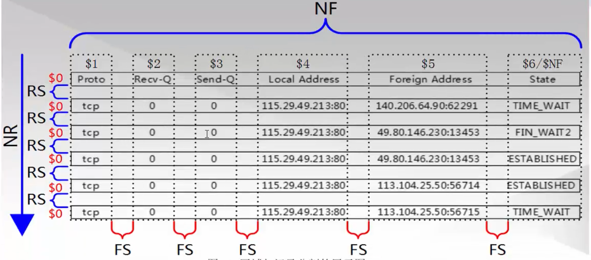

## 快捷跳转目录：


* [第1章：awk基础入门][0]    
* [1.1：awk简介][1]    
* [1.2：学完awk你可以掌握：][2]    
* [1.3：awk环境简介][3]    
* [1.4：awk的格式][4]    
* [1.5：模式动作][5]    
* [1.6：awk的执行过程][6]    
* [1.6.1：小结awk执行过程][7]    
* [1.7：记录和字段][8]    
* [1.7.1：记录（行）][9]    
* [1.7.2：记录分隔符-RS][10]    
* [1.7.3：对$0的认识][11]    
* [1.7.4：企业面试题][12]    
* [1.7.5：awk记录知识小结][13]    
* [1.7.6：字段（列）][14]    
* [1.7.7：ORS与OFS简介][15]    
* [1.9：awk基础入门总结][16]   

* [第2章：awk进阶][17]    
* [2.1：awk模式与动作][18]    
* [2.2：正则表达式作为模式][19]    
* [2.2.1：awk正则匹配操作符][20]    
* [2.2.2：awk正则表达式匹配整行][21]    
* [2.2.3：awk正则表达式匹配一行中的某一列][22]    
* [2.2.4：某个区域中的开头和结尾][23]    
* [2.2.5：创建测试环境][24]    
* [2.2.6：测试文件说明][25]    
* [2.2.7：awk正则表达式练习题][26]    
* [2.2.8：awk正则表达式练习题-详解][27]    
* [2.2.9：企业面试题][28]    
* [2.2.10：明明白白扩展正则表达式：+（加号）][29]    
* [2.2.11：awk正则之{} -花括号][30]    
* [2.2.12：企业案例1][31]    
* [2.2.13：企业案例2][32]    
* [2.3：比较表达式做为模式-需要一些例子][33]    
* [2.3.1：企业面试题][34]    
* [2.3.2：如果判断某一列是否等于某个字符呢？][35]    
* [2.4：范围模式][36]    
* [2.5：awk特殊模式-BEGIN模式与END模式][37]    
* [2.5.1：BEGIN模块][38]    
* [2.5.2：awk中变量的概念简介][39]    
* [2.5.3：END模块][40]    
* [2.6：awk中的动作][41]    
* [2.7：awk模式与动作小结][42]    
* [2.8：总结awk执行过程][43]    
* [2.9：awk数组][44]    
* [2.10：图片-数组][45]   

- - -


## 第1章 awk基础入门

> 要弄懂awk程序，必须熟悉了解这个工具的规则。本实战笔记的目的是通过实际案例或面试题带同学们熟练掌握awk在企业中的用法，而不是awk程序的帮助手册。

### 1.1 awk简介

* 一种名字怪异的语言
* 模式扫描和处理

> awk不仅仅时linux系统中的一个命令，而且是一种编程语言，可以用来处理数据和生成报告（excel）。处理的数据可以是一个或多个文件，可以是来自标准输入，也可以通过管道获取标准输入，awk可以在命令行上直接编辑命令进行操作，也可以编写成awk程序来进行更为复杂的运用。本章主要讲解awk命令的运用。

### 1.2 学完awk你可以掌握：

1. 记录与字段
1. 模式匹配：模式与动作
1. 基本的awk执行过程
1. awk常用内置变量（预定义变量）
1. awk数组（工作常用）
1. awk语法：循环，条件
1. awk常用函数
1. 向awk传递参数
1. awk引用shell变量
1. awk小程序及调试思路

### 1.3 awk环境[简介](#1.3)

    [root@chensiqi1 ~]# cat /etc/redhat-release 
    CentOS release 6.8 (Final)
    [root@chensiqi1 ~]# uname -r
    2.6.32-642.el6.x86_64
    [root@chensiqi1 ~]# ll `which awk`
    lrwxrwxrwx. 1 root root 4 Dec 23 20:25 /bin/awk -> gawk
    [root@chensiqi1 ~]# awk --version
    GNU Awk 3.1.7
    Copyright (C) 1989, 1991-2009 Free Software Foundation.
    
    This program is free software; you can redistribute it and/or modify
    it under the terms of the GNU General Public License as published by
    the Free Software Foundation; either version 3 of the License, or
    (at your option) any later version.
    
    This program is distributed in the hope that it will be useful,
    but WITHOUT ANY WARRANTY; without even the implied warranty of
    MERCHANTABILITY or FITNESS FOR A PARTICULAR PURPOSE.  See the
    GNU General Public License for more details.
    
    You should have received a copy of the GNU General Public License
    along with this program. If not, see http://www.gnu.org/licenses/.

### 1.4 awk的格式

* awk指令是由模式，动作，或者模式和动作的组合组成。
* 模式既pattern,可以类似理解成sed的模式匹配，可以由表达式组成，也可以是两个正斜杠之间的正则表达式。比如NR==1，这就是模式，可以把他理解为一个条件。
* 动作即action，是由在大括号里面的一条或多条语句组成，语句之间使用分号隔开。比如awk使用格式：

awk处理的内容可以来自标准输入（<），一个或多个文本文件或管道。


* pattern既模式，也可以理解为条件，也叫找谁，你找谁？高矮，胖瘦，男女？都是条件，既模式。
* action既动作，可以理解为干啥，找到人之后你要做什么。  
模式和动作的详细介绍我们放在后面部分，现在大家先对awk结构有一个了解。

### 1.5 模式动作

**示例1-1: 基本的模式和动作**

    [root@chensiqi1 ~]# awk -F ":" 'NR>=2 && NR<=6{print NR,$1}' /etc/passwd
    2 bin
    3 daemon
    4 adm
    5 lp
    6 sync
    命令说明：
    -F 指定分隔符为冒号，相当于以“：”为菜刀，进行字段的切割。
    NR>=2 && NR<=6：这部分表示模式，是一个条件，表示取第2行到第6行。
    {print NR,$1}：这部分表示动作，表示要输出NR行号和$1第一列。

**示例1-2 只有模式**

    [root@chensiqi1 ~]# awk -F ":" 'NR>=2&&NR<=6' /etc/passwd
    bin:x:1:1:bin:/bin:/sbin/nologin
    daemon:x:2:2:daemon:/sbin:/sbin/nologin
    adm:x:3:4:adm:/var/adm:/sbin/nologin
    lp:x:4:7:lp:/var/spool/lpd:/sbin/nologin
    sync:x:5:0:sync:/sbin:/bin/sync
    
    命令说明：
    -F指定分隔符为冒号
    NR>=2&&NR<=6这部分是条件，表示取第2行到第6行。
    但是这里没有动作，这里大家需要了解如果只有条件（模式）没有动作，awk默认输出整行

**示例1-3:只有动作**

    [root@chensiqi1 ~]# awk -F ":" '{print NR,$1}' /etc/passwd
    1 root
    2 bin
    3 daemon
    4 adm
    5 lp
    6 sync
    7 shutdown
    8 halt
    9 mail
    10 uucp
    以下省略....
    
    命令说明：
    -F指定分隔符为冒号
    这里没有条件，表示对每一行都处理
    {print NR,$1}表示动作，显示NR行号与$1第一列
    这里要理解没有条件的时候，awk会处理每一行。

**示例1-4:多个模式和动作**

    [root@chensiqi1 ~]# awk -F ":" 'NR==1{print NR,$1}NR==2{print NR,$NF}' /etc/passwd
    1 root
    2 /sbin/nologin
    
    命令说明：
    -F指定分隔符为冒号
    这里有多个条件与动作的组合
    NR==1表示条件，行号（NR）等于1的条件满足的时候，执行{print NR,$1}动作，输出行号与第一列。
    NR==2表示条件，行号（NR）等于2的条件满足的时候，执行{print NR,$NF}动作，输出行号与最后一列（$NF）

**注意：**

* Pattern和{Action}需要用单引号引起来，防止shell作解释。
* Pattern是可选的。如果不指定，awk将处理输入文件中的所有记录。如果指定一个模式，awk则只处理匹配指定的模式的记录。
* {Action}为awk命令，可以是但个命令，也可以多个命令。整个Action（包括里面的所有命令）都必须放在{ 和 }之间。
* Action必须被{ }包裹，没有被{ }包裹的就是Patern
* file要处理的目标文件

### 1.6 awk执行过程

> 在深入了解awk前，我们需要知道awk如何处理文件的。

示例1-5 示例文件的创建

    [root@chensiqi1 ~]# mkdir /server/files/ -p
    [root@chensiqi1 ~]# head /etc/passwd > /server/files/awkfile.txt
    [root@chensiqi1 ~]# cat /server/files/awkfile.txt 
    root:x:0:0:root:/root:/bin/bash
    bin:x:1:1:bin:/bin:/sbin/nologin
    daemon:x:2:2:daemon:/sbin:/sbin/nologin
    adm:x:3:4:adm:/var/adm:/sbin/nologin
    lp:x:4:7:lp:/var/spool/lpd:/sbin/nologin
    sync:x:5:0:sync:/sbin:/bin/sync
    shutdown:x:6:0:shutdown:/sbin:/sbin/shutdown
    halt:x:7:0:halt:/sbin:/sbin/halt
    mail:x:8:12:mail:/var/spool/mail:/sbin/nologin
    uucp:x:10:14:uucp:/var/spool/uucp:/sbin/nologin

**这个文件仅包含十行文件，我们使用下面的命令：**

示例1-6 awk执行过程演示

    [root@chensiqi1 ~]# awk 'NR>=2{print $0}' /server/files/awkfile.txt 
    bin:x:1:1:bin:/bin:/sbin/nologin
    daemon:x:2:2:daemon:/sbin:/sbin/nologin
    adm:x:3:4:adm:/var/adm:/sbin/nologin
    lp:x:4:7:lp:/var/spool/lpd:/sbin/nologin
    sync:x:5:0:sync:/sbin:/bin/sync
    shutdown:x:6:0:shutdown:/sbin:/sbin/shutdown
    halt:x:7:0:halt:/sbin:/sbin/halt
    mail:x:8:12:mail:/var/spool/mail:/sbin/nologin
    uucp:x:10:14:uucp:/var/spool/uucp:/sbin/nologin
    
    命令说明：
    条件NR>=2,表示行号大于等于2时候，执行{print $0}显示整行。
    awk是通过一行一行的处理文件，这条命令中包含模式部分（条件）和动作部分（动作），awk将处理模式（条件）指定的行

#### 1.6.1 小结awk执行过程

1）awk读入第一行内容

2）判断是否符合模式中的条件NR>=2

a，如果匹配则执行对应的动作{print $0}  
b，如果不匹配条件，继续读取下一行

3）继续读取下一行  
4）重复过程1-3，直到读取到最后一行（EOF：end of file）


### 1.7 记录和字段

接下来我给大家带来两个新概念记录和字段，这里为了方便大家理解可以把记录就当作行即记录==行，字段相当于列，字段==列。

| 名称 | 含义 |
|-|-|
| record | 记录，行 |
| field | 域，区域，字段，列 |

#### 1.7.1 记录（行）

**查看一下下面这段文字**

    root:x:0:0:root:/root:/bin/bash
    bin:x:1:1:bin:/bin:/sbin/nologin
    daemon:x:2:2:daemon:/sbin:/sbin/nologin
    adm:x:3:4:adm:/var/adm:/sbin/nologin
    lp:x:4:7:lp:/var/spool/lpd:/sbin/nologin
    sync:x:5:0:sync:/sbin:/bin/sync
    shutdown:x:6:0:shutdown:/sbin:/sbin/shutdown
    halt:x:7:0:halt:/sbin:/sbin/halt
    mail:x:8:12:mail:/var/spool/mail:/sbin/nologin
    uucp:x:10:14:uucp:/var/spool/uucp:/sbin/nologin

**思考：**  
一共有多少行呢？你如何知道的？通过什么标志？

> awk对每个要处理的输入数据认为都是具有格式和结构的，而不仅仅是一堆字符串。默认情况下，每一行内容都是一条记录，并以换行符分隔（\n）结束

#### 1.7.2 记录分隔符-RS


* awk默认情况下每一行都是一个记录（record）
* RS既record separator输入输出数据记录分隔符，每一行是怎么没的，表示每个记录输入的时候的分隔符，既行与行之间如何分隔。
* NR既number of record 记录（行）号，表示当前正在处理的记录（行）的号码。
* ORS既output record separator 输出记录分隔符。

awk使用内置变量RS来存放输入记录分隔符，RS表示的是输入的记录分隔符，这个值可以通过BEGIN模块重新定义修改。

示例1-1：使用“/”为默认记录分隔符  
示例文件：

    [root@chensiqi1 ~]# cat /server/files/awkfile.txt 
    root:x:0:0:root:/root:/bin/bash
    bin:x:1:1:bin:/bin:/sbin/nologin
    daemon:x:2:2:daemon:/sbin:/sbin/nologin
    adm:x:3:4:adm:/var/adm:/sbin/nologin
    lp:x:4:7:lp:/var/spool/lpd:/sbin/nologin
    sync:x:5:0:sync:/sbin:/bin/sync
    shutdown:x:6:0:shutdown:/sbin:/sbin/shutdown
    halt:x:7:0:halt:/sbin:/sbin/halt
    mail:x:8:12:mail:/var/spool/mail:/sbin/nologin
    uucp:x:10:14:uucp:/var/spool/uucp:/sbin/nologin

    [root@chensiqi1 ~]# awk 'BEGIN{RS="/"}{print NR,$0}' /server/files/awkfile.txt 
    1 root:x:0:0:root:
    2 root:
    3 bin
    4 bash
    bin:x:1:1:bin:
    5 bin:
    6 sbin
    7 nologin
    daemon:x:2:2:daemon:
    8 sbin:
    9 sbin
    10 nologin
    adm:x:3:4:adm:
    11 var
    12 adm:
    13 sbin
    14 nologin
    lp:x:4:7:lp:
    15 var
    16 spool
    17 lpd:
    18 sbin
    19 nologin
    sync:x:5:0:sync:
    20 sbin:
    21 bin
    22 sync
    shutdown:x:6:0:shutdown:
    23 sbin:
    24 sbin
    25 shutdown
    halt:x:7:0:halt:
    26 sbin:
    27 sbin
    28 halt
    mail:x:8:12:mail:
    29 var
    30 spool
    31 mail:
    32 sbin
    33 nologin
    uucp:x:10:14:uucp:
    34 var
    35 spool
    36 uucp:
    37 sbin
    38 nologin
    
    命令说明：
    在每行的开始先打印输出NR（记录号行号），并打印出每一行$0（整行）的内容。
    我们设置RS（记录分隔符）的值为“／”，表示一行（记录）以“／”结束
    在awk眼中，文件是从头到尾一段连续的字符串，恰巧中间有些\n（回车换行符），\n也是字符哦。

**我们回顾下“行（记录）”到底是什么意思？**

* 行（记录）：默认以\n（回车换行）结束。而这个行的结束不就是记录分隔符嘛。
* 所以在awk中，RS（记录分隔符）变量表示着行的结束符号（默认是回车换行）

**在工作中，我们可以通过修改RS变量的值来决定行的结束标志，最终来决定“每行”的内容。  
为了方便人们理解，awk默认就把RS的值设置为“\n”**

**> 注意：**  
> awk的BEGIN模块，我会在后面（模式-BEGIN模块）详细讲解，此处大家仅需要知道在BEGIN模块里面我们来定义一些awk内置变量即可。

#### 1.7.3 对$0的认识

* 如1.7.2的例子，可以看出awk中$0表示整行，其实awk使用$0来表示整条记录。记录分隔符存在RS变量中，或者说每个记录以RS内置变量结束。
* 另外，awk对每一行的记录号都有一个内置变量NR来保存，每处理完一条记录，NR的值就会自动+1
* 下面通过示例来加深印象。

示例1-2:NR记录号

    [root@chensiqi1 ~]# awk '{print NR,$0}' /server/files/awkfile.txt 
    1 root:x:0:0:root:/root:/bin/bash
    2 bin:x:1:1:bin:/bin:/sbin/nologin
    3 daemon:x:2:2:daemon:/sbin:/sbin/nologin
    4 adm:x:3:4:adm:/var/adm:/sbin/nologin
    5 lp:x:4:7:lp:/var/spool/lpd:/sbin/nologin
    6 sync:x:5:0:sync:/sbin:/bin/sync
    7 shutdown:x:6:0:shutdown:/sbin:/sbin/shutdown
    8 halt:x:7:0:halt:/sbin:/sbin/halt
    9 mail:x:8:12:mail:/var/spool/mail:/sbin/nologin
    10 uucp:x:10:14:uucp:/var/spool/uucp:/sbin/nologin
    
    命令说明：
    NR既number of record，当前记录的记录号，刚开始学也可以理解为行号。
    $0表示整行或者说整个记录

#### 1.7.4 企业面试题：按单词出现频率降序排序（计算文件中每个单词的重复数量）

注：（此处使用sort与uniq即可）

**题目：**

> 题目创建方法：  
> sed -r '1,10s#[^a-zA-Z]+# #g' /etc/passwd>/server/files/count.txt    [root@chensiqi1 files]# cat /server/files/count.txt 
    root x root root bin bash
    bin x bin bin sbin nologin
    daemon x daemon sbin sbin nologin
    adm x adm var adm sbin nologin
    lp x lp var spool lpd sbin nologin
    sync x sync sbin bin sync
    shutdown x shutdown sbin sbin shutdown
    halt x halt sbin sbin halt
    mail x mail var spool mail sbin nologin
    uucp x uucp var spool uucp sbin nologin

**思路：**

让所有单词排成一列，这样每个单词都是单独的一行

1)设置RS值为空格  
2）将文件里面的所有空格替换为回车换行符“\n”  
3)grep所有连续的字母，grep -o参数让他们排成一列。

方法一：

    [root@chensiqi1 files]# awk 'BEGIN{RS="[ ]+"}{print $0}' count.txt | sort |uniq -c|sort
          1 
          1 bash
          1 lpd
          2 daemon
          2 lp
          3 adm
          3 halt
          3 mail
          3 root
          3 shutdown
          3 spool
          3 sync
          3 uucp
          4 var
          5 bin
          6 nologin
         10 x
         12 sbin

方法二：

    [root@chensiqi1 files]# cat count.txt | tr " " "\n" | sort | uniq -c | sort
          1 bash
          1 lpd
          2 daemon
          2 lp
          3 adm
          3 halt
          3 mail
          3 root
          3 shutdown
          3 spool
          3 sync
          3 uucp
          4 var
          5 bin
          6 nologin
         10 x
         12 sbin

方法三：

    [root@chensiqi1 files]# grep -o "[a-zA-Z]\+" count.txt | sort | uniq -c | sort
          1 bash
          1 lpd
          2 daemon
          2 lp
          3 adm
          3 halt
          3 mail
          3 root
          3 shutdown
          3 spool
          3 sync
          3 uucp
          4 var
          5 bin
          6 nologin
         10 x
         12 sbin

#### 1.7.5 awk记录知识小结

1. NR存放着每个记录的号（行号）读取新行时候会自动+1
1. RS是输入数据的记录的分隔符，简单理解就是可以指定每个记录的结尾标志。
1. RS作用就是表示一个记录的结束
1. 当我们修改了RS的值，最好配合NR（行）来查看变化，也就是修改了RS的值通过NR查看结果，调试awk程序。
1. ORS输出数据的记录的分隔符

**> awk学习技巧一则：**  
> 大象放冰箱分几步？打开冰箱，把大象放进去，关闭冰箱门。  
> awk也是一样的，一步一步来，先修改了RS，然后用NR调试，看看到底如何分隔的。然后通过sort排序，uniq -c去重

#### 1.7.6 字段（列）

* 每条记录都是由多个区域（field）组成的，默认情况下区域之间的分隔符是由空格（即空格或制表符）来分隔，并且将分隔符记录在内置变量FS中，每行记录的区域数保存在awk的内置变量NF中。

* FS既field separator,输入字段（列）分隔符。分隔符就是菜刀，把一行字符串切为很多个区域。
* NF既number of fileds，表示一行中列（字段）的个数，可以理解为菜刀切过一行后，切成了多少份。

**OFS输出字段（列）分隔符**

* > awk使用内置变量FS来记录区域分隔符的内容，FS可以在命令行上通过-F参数来更改，也可以通过BEGIN模块来更改。
* > 然后通过$n,n是整数，来取被切割后的区域，$1取第一个区域，$2取第二个区域，$NF取最后一个区域。

**下面我们通过示例来加强学习。**

示例1-3：指定分隔符

    [root@chensiqi1 files]# awk -F ":" 'NR>=2&&NR<=5{print $1,$3}' /server/files/awkfile.txt 
    bin 1
    daemon 2
    adm 3
    lp 4
    
    命令说明：
    以：（冒号）为分隔符，显示第2行到第5行之间的第一区域和第三区域。

* 此处的FS知识一个字符，其实它可以指定多个的，此时FS指定的值可以是一个正则表达式。
* 正常情况下，当你指定分隔符（非空格）的时候，例如指定多个区域分隔符，每个分隔符就是一把刀，把左右两边切为两个部分。

**企业面试题：**同时取出chensiqi和215379068这两个内容（指定多分隔符）

    [root@chensiqi1 files]# echo "I am chensiqi,my qq is 1234567890">>/server/files/chensiqi.txt
    [root@chensiqi1 files]# cat /server/files/chensiqi.txt 
    I am chensiqi,my qq is 1234567890

同时取出chensiqi和1234567890这两个内容。

**思路：**  
我们用默认的想法一次使用一把刀，需要配合管道的。如何同时使用两把刀呢？看下面的结果

    [root@chensiqi1 files]# awk -F "[ ,]" '{print $3,$NF}' /server/files/chensiqi.txt 
    chensiqi 1234567890
    
    命令说明：
    通过命令-F参数指定区域分隔符
    [ ,]是正则表达式里面的内容，它表示一个整体，“一个”字符，既空格或者逗号（,），合并在一起，-F “[ ,]”就表示以空格或者逗号（,）为区域分隔符

**> 小技巧：**  
> 在动作（‘{print \$3,\$NF}’）里面的逗号，表示空格，其实动作中的逗号就是OFS的值，我们会在后面说明。刚开始大家把动作中的都逗号，当作空格即可。

示例：默认分隔符和指定分隔符会有些差异

    [root@chensiqi1 files]# ifconfig eth0 | awk 'NR==2' >/server/files/awkblank.txt
    [root@chensiqi1 files]# cat /server/files/awkblank.txt 
              inet addr:192.168.197.133  Bcast:192.168.197.255  Mask:255.255.255.0
    #默认分隔符时候
    [root@chensiqi1 files]# awk '{print $1}' /server/files/awkblank.txt 
    inet
    #指定分隔符时候
    [root@chensiqi1 files]# awk -F "[ :]+" '{print $1}' /server/files/awkblank.txt 
    
    [root@chensiqi1 files]# awk -F "[ :]+" '{print $2}' /server/files/awkblank.txt 
    inet
    
    命令说明：
    awk默认的FS分隔符对于空格序列，一个空格或多个空格tab都认为是一样的，一个整体。

* 这个文件的开头有很多连续的空格，然后才是inet这个字符
* 当我们使用默认的分隔符的时候，$1是有内容的。
* 当我们指定其他分隔符（非空格）时候，区域会有所变化
* 到底为何会这样，我们在这里不再深入研究，只要了解有这种情况，注意一下即可。

#### 1.7.7 ORS与OFS简介

现在说说ORS和OFS这两个内置变量的含义。

* RS是输入记录分隔符，决定awk如何读取或分隔每行（记录）
* ORS表示输出记录分隔符，决定awk如何输出一行（记录）的，默认是回车换行（\n）
* FS是输入区域分隔符，决定awk读入一行后如何再分为多个区域。
* OFS表示输出区域分隔符，决定awk输出每个区域的时候使用什么分隔她们。
* awk无比强大，你可以通过RS，FS决定awk如何读取数据。你也可以通过修改ORS，OFS的值指定awk如何输出数据。

### 1.8 字段与记录小结

现在你应该会对awk的记录字段有所了解了，下面我们总结一下，学会给阶段性知识总结是学好运维的必备技能。

* RS记录分隔符，表示每行的结束标志
* NR行号（记录号）
* FS字段分隔符，每列的分隔标志或结束标志
* NF就是每行有多少列，每个记录中字段的数量
* $符号表示取某个列（字段）,$1$2$NF
* NF表示记录中的区域（列）数量，$NF取最后一个列（区域。）
* FS（-F）字段（列）分隔符，-F（FS）“：”<==>‘BEGIN{FS=':'}’
* RS 记录分隔符（行的结束标识）
* NR 行号
* 选好合适的刀FS（***）,RS,OFS,ORS
* 分隔符==>结束标识
* 记录与区域，你就对我们所谓的行与列，有了新的认识（RS，FS）

### 1.9 awk基础入门总结

> 到了这里我们回头看看，我们之前学习的内容。

* awk的命令行结构
* awk的模式和动作
* awk的记录和字段

比较核心常用的是字段。  
另外这些企业面试题可是学会awk的必备，必须自己也能写出来。

## 第2章 awk进阶

### 2.1 awk模式与动作

接下来就详细介绍下，awk的模式都有几种：

* 正则表达式作为模式
* 比较表达式作为模式
* 范围模式
* 特殊模式BEGIN和END

**awk的模式是你玩好awk的必备也是最基础的内容，必须熟练掌握**

### 2.2 正则表达式作为模式

awk同sed一样也可以通过模式匹配来对输入的文本进行匹配处理。说到模式匹配，肯定少不了正则表达式，awk也支持大量的正则表达式模式，大部分与sed支持的元字符类似，而且正则表达式是玩转三剑客的必备工具，下表列出了awk支持的正则表达式元字符：

**awk默认就支持的元字符：**

| 元字符 | 功能 | 示例 | 解释 |
|-|-|-|-|
| ^ | 字符串开头 | /^chensiqi/或\$3~/^chensiqi/ |匹配所有以chensiqi开头的字符串；匹配出所有第三列中以chensiqi开头的  |
| \$ | 字符串结尾 | /chensiqi$/或$3~/chensiqi$/ | 匹配所有以chensiqi结尾的字符串；匹配第三列中以chensiqi结尾的 |
| .(点) | 匹配任意但个字符 |（包括回车符） /c..l/ | 匹配字母c，然后两个任意字符，再以l结尾的行 |
| * | 重复0个或多个前一个字符 | /a*cool/ | 匹配0个或多个a之后紧跟着cool的行 |
| + | 重复前一个字符一次或多次 | /a+b/ | 匹配一个或多个a加上字符串b的行 |
| ? | 匹配0个或一个前边的字符 | /a?b/ | 匹配以字母a或b或c开头的行 |
| [] | 匹配指定字符组内的任一个字符 | /^[abc]/ | 匹配以字母a或b或c开头的行 |
| [^] | 匹配不在指定字符组内的任一字符 | /^[^abc]/ | 匹配不以字母a或b或c开头的行 |
| () |子表达式组合 | /(chensiqi)+/  | 表示一个或多个cool组合，当有一些字符需要组合时，使用括号括起来 |
| I | 或者的意思 | /(chensiqi)\|B/ | 匹配chensiqi或字母B的行 |

**awk默认不支持的元字符:（参数--posix）**

| 元字符 | 功能 | 示例 | 解释 | 
|-|-|-|-|
| x{m} | x字符重复m次 | /cool{5}/ | 匹配l字符5次 | 
| x{m,} | x字符重复至少m次 | /(cool){2,}/ | 匹配cool整体，至少2次 | 
| x{m,n} | x字符重复至少m次，但不超过n次 | /(cool){5,6}/  | 匹配cool整体，至少5次，最多6次 |

**提示：**

* 加括号代表整体匹配，不加那么就匹配前边的一个字符。awk默认不支持这种形式的正则，需要加--posix参数或者--re-interval
* 正则表达式的运用，默认是在行内查找匹配的字符串，若有匹配则执行action操作，但是有时候仅需要固定的列来匹配指定的正则表达式，比如：我想取/etc/passwd文件中第五列{$5}这一列查找匹配mail字符串的行，这样就需要用另外两个匹配操作符，并且awk里面只有这两个操作符来匹配正则表达式。

#### 2.2.1 awk正则匹配操作符

**awk正则匹配操作符：**  

|~|用于对记录或区域的表达式进行匹配|  
|--|--|  
|!~|用于表达与～相反的意思|

下面还是通过具体示例来看看，awk如何来通过正则表达式匹配字符串的

#### 2.2.2 awk正则表达式匹配整行

    [root@chensiqi1 files]# awk -F ":" '/^root/' awkfile.txt 
    root:x:0:0:root:/root:/bin/bash

**和下面的效果是一样的**

    [root@chensiqi1 files]# awk -F ":" '$0~/^root/' awkfile.txt 
    root:x:0:0:root:/root:/bin/bash

**提示：**

awk只用正则表达式的时候是默认匹配整行的即‘$0~/^root/’和‘/^root/’是一样的。

#### 2.2.3 awk正则表达式匹配一行中的某一列

    [root@chensiqi1 files]# awk -F ":" '$5~/shutdown/' awkfile.txt 
    shutdown:x:6:0:shutdown:/sbin:/sbin/shutdown

**提示：**

* $5表示第五个区域（列）
* ~表示匹配（正则表达式匹配）
* /shutdown/表示匹配shutdown这个字符串

**合并在一起**

$5~/shutdown/表示第五个区域（列）匹配正则表达式/shutdown/，既第5列包含shutdown这个字符串，则显示这一行。

#### 2.2.4 某个区域中的开头和结尾

知道了如何使用正则表达式匹配操作符之后，我们来看看awk正则与grep和sed不同的地方。

**awk正则表达式**  

|^|匹配一个字符串的开头|  
|--|--|  
|$|匹配一个字符串的结尾|

在sed和grep这两个命令中，我们都把它们当作行的开头和结尾。但是在awk中他表示的是字符串的开头和结尾。

**接下来我们通过练习题来联系awk如何使用正则表达式。**

#### 2.2.5 创建测试环境

    [root@chensiqi1 ~]# cat >>/server/files/reg.txt<<KOF
    Zhang Dandan    41117397    :250:100:175
    Zhang Xiaoyu    390320151   :155:90:201
    Meng  Feixue    80042789    :250:60:50
    Wu    Waiwai    70271111    :250:80:75
    Liu   Bingbing  41117483    :250:100:175
    Wang  Xiaoai    3515064655  :50:95:135
    Zi    Gege      1986787350  :250:168:200
    Li    Youjiu    918391635   :175:75:300
    Lao   Nanhai    918391635   :250:100:175
    KOF

#### 2.2.6 测试文件说明

    Zhang Dandan    41117397    :250:100:175
    Zhang Xiaoyu    390320151   :155:90:201
    Meng  Feixue    80042789    :250:60:50
    Wu    Waiwai    70271111    :250:80:75
    Liu   Bingbing  41117483    :250:100:175
    Wang  Xiaoai    3515064655  :50:95:135
    Zi    Gege      1986787350  :250:168:200
    Li    Youjiu    918391635   :175:75:300
    Lao   Nanhai    918391635   :250:100:175

**说明：**

* 第一列是姓氏
* 第二列是名字
* 第一列第二列合起来就是姓名
* 第三列是对应的ID号码
* 最后三列是三次捐款数量

#### 2.2.7 awk正则表达式练习题

练习题1:显示姓Zhang的人的第二次捐款金额及她的名字

练习题2:显示Xiaoyu的名字和ID号码

练习题3:显示所有以41开头的ID号码的人的全名和ID号码

练习题4:显示所有以一个D或X开头的人名全名

练习题5:显示所有ID号码最后一位数字是1或5的人的全名

练习题6:显示Xiaoyu的捐款，每个值都有以$开头。如$520$200$135

练习题7:显示所有人的全名，以姓，名的格式显示，如Meng，Feixue

#### 2.2.8 awk正则表达式练习题-详解

示例1:显示姓Zhang的人的第二次捐款金额及她的名字

    [root@chensiqi1 files]# cat reg.txt 
    Zhang Dandan    41117397    :250:100:175
    Zhang Xiaoyu    390320151   :155:90:201
    Meng  Feixue    80042789    :250:60:50
    Wu    Waiwai    70271111    :250:80:75
    Liu   Bingbing  41117483    :250:100:175
    Wang  Xiaoai    3515064655  :50:95:135
    Zi    Gege      1986787350  :250:168:200
    Li    Youjiu    918391635   :175:75:300
    Lao   Nanhai    918391635   :250:100:175
    [root@chensiqi1 files]# awk -F "[ :]+" '$1~/^Zhang/{print $2,$(NF-1)}' reg.txt 
    Zhang 100
    Zhang 90

**说明：**

* -F指定分隔符，现在大家知道了-F即FS也是支持正则表达式的。
* 【 ：】+ 表示连续的空格或冒号
* -F “【 ：】+” 以连续的空格或冒号为分隔符
* /Zhang/表示条件，整行中包含Dan字符的这个条件。
* {print $1,$(NF-1)} 表示动作，满足条件后，执行显示第一列（$1）和倒数第二列（$(NF-1)）当然$5也可以。

**注意：**  
NF是一行中有多少列，NF-1整行就是倒数第二列。  
$(NF-1)就是取倒数第二列内容。

示例2:显示Xiaoyu的姓氏和ID号码

    [root@chensiqi1 files]#cat reg.txt  
    Zhang Dandan    41117397    :250:100:175
    Zhang Xiaoyu    390320151   :155:90:201
    Meng  Feixue    80042789    :250:60:50
    Wu    Waiwai    70271111    :250:80:75
    Liu   Bingbing  41117483    :250:100:175
    Wang  Xiaoai    3515064655  :50:95:135
    Zi    Gege      1986787350  :250:168:200
    Li    Youjiu    918391635   :175:75:300
    Lao   Nanhai    918391635   :250:100:175
    [root@chensiqi1 files]# awk -F "[ :]+" '$2~/^Xiaoyu/{print $1,$3}' reg.txt 
    Zhang 390320151
    
    命令说明：
    指定分隔符-F “【：】+”
    $2~/Xiaoyu/表示条件，第二列包含Xiaoyu时候执行对应的动作
    {print $1,$3}表示动作，显示第一列和第三列的内容

示例3:显示所有以41开头的ID号码的人的全名和ID号码

    [root@chensiqi1 files]# cat reg.txt 
    Zhang Dandan    41117397    :250:100:175
    Zhang Xiaoyu    390320151   :155:90:201
    Meng  Feixue    80042789    :250:60:50
    Wu    Waiwai    70271111    :250:80:75
    Liu   Bingbing  41117483    :250:100:175
    Wang  Xiaoai    3515064655  :50:95:135
    Zi    Gege      1986787350  :250:168:200
    Li    Youjiu    918391635   :175:75:300
    Lao   Nanhai    918391635   :250:100:175
    [root@chensiqi1 files]# awk -F "[ :]+" '$3~/^(41)/{print $1,$2,$3}' reg.txt 
    Zhang Dandan 41117397
    Liu Bingbing 41117483  

示例4:显示所有以一个D或X开头的人名全名

    [root@chensiqi1 files]# cat reg.txt 
    Zhang Dandan    41117397    :250:100:175
    Zhang Xiaoyu    390320151   :155:90:201
    Meng  Feixue    80042789    :250:60:50
    Wu    Waiwai    70271111    :250:80:75
    Liu   Bingbing  41117483    :250:100:175
    Wang  Xiaoai    3515064655  :50:95:135
    Zi    Gege      1986787350  :250:168:200
    Li    Youjiu    918391635   :175:75:300
    Lao   Nanhai    918391635   :250:100:175
    [root@chensiqi1 files]# awk -F "[ :]+" '$2~/^D|^X/{print $1,$2}' reg.txt 
    Zhang Dandan
    Zhang Xiaoyu
    Wang Xiaoai
    
    命令说明：
    -F “【 ：】+”指定分隔符
    |表示或，^以...开头

注意：  
这里要用（）括号表示即^(D|X)相当于^D|^X，有的同学写成^D|X这样是错误的。

示例5:显示所有ID号码最后一位数字是1或5的人的全名

    [root@chensiqi1 files]# cat reg.txt 
    Zhang Dandan    41117397    :250:100:175
    Zhang Xiaoyu    390320151   :155:90:201
    Meng  Feixue    80042789    :250:60:50
    Wu    Waiwai    70271111    :250:80:75
    Liu   Bingbing  41117483    :250:100:175
    Wang  Xiaoai    3515064655  :50:95:135
    Zi    Gege      1986787350  :250:168:200
    Li    Youjiu    918391635   :175:75:300
    Lao   Nanhai    918391635   :250:100:175
    [root@chensiqi1 files]# awk -F "[ :]+" '$3~/1$|5$/{print $1,$2}' reg.txt 
    Zhang Xiaoyu
    Wu Waiwai
    Wang Xiaoai
    Li Youjiu
    Lao Nanhai
    

示例6:显示Xiaoyu的捐款，每个值都有以$开头。如```$520$200$135```    
    
    [root@chensiqi1 files]# cat reg.txt 
    Zhang Dandan    41117397    :250:100:175
    Zhang Xiaoyu    390320151   :155:90:201
    Meng  Feixue    80042789    :250:60:50
    Wu    Waiwai    70271111    :250:80:75
    Liu   Bingbing  41117483    :250:100:175
    Wang  Xiaoai    3515064655  :50:95:135
    Zi    Gege      1986787350  :250:168:200
    Li    Youjiu    918391635   :175:75:300
    Lao   Nanhai    918391635   :250:100:175
    [root@chensiqi1 files]# awk -F "[ :]+" '$2~/Xiaoyu/{print "$"$4"$"$5"$"$6}' reg.txt 
    $155$90$201

示例7:显示所有人的全名，以姓，名的格式显示，如Meng，Feixue

    [root@chensiqi1 files]# cat reg.txt 
    Zhang Dandan    41117397    :250:100:175
    Zhang Xiaoyu    390320151   :155:90:201
    Meng  Feixue    80042789    :250:60:50
    Wu    Waiwai    70271111    :250:80:75
    Liu   Bingbing  41117483    :250:100:175
    Wang  Xiaoai    3515064655  :50:95:135
    Zi    Gege      1986787350  :250:168:200
    Li    Youjiu    918391635   :175:75:300
    Lao   Nanhai    918391635   :250:100:175
    [root@chensiqi1 files]# awk -F "[ ]+" '{print $1","$2}' reg.txt 
    Zhang,Dandan
    Zhang,Xiaoyu
    Meng,Feixue
    Wu,Waiwai
    Liu,Bingbing
    Wang,Xiaoai
    Zi,Gege
    Li,Youjiu
    Lao,Nanhai

#### 2.2.9 企业面试题：取出网卡eth0的ip地址

最简单：hostname -I

**awk处理：**

方法一：

    [root@chensiqi1 files]# ifconfig eth0|awk 'BEGIN{RS="[ :]"}NR==31'
    192.168.197.133

方法二：

    [root@chensiqi1 files]# ifconfig eth0 | awk -F "(addr:)|( Bcast:)" 'NR==2{print $2}'
    192.168.197.133 

方法三：

    [root@chensiqi1 files]# ifconfig eth0 | awk -F "[ :]+" 'NR==2{print $4}'
    192.168.197.133

方法四：

    [root@chensiqi1 files]# ifconfig eth0 | awk -F "[^0-9.]+" 'NR==2{print $2}'
    192.168.197.133

**提示：**

* 前边的三种方法都还是比较好理解的，这第四种方法，需要学会逆向思维，看看我们要的结果10.0.0.50，ip地址：数字和点（.），我是否可以指定分隔符，以数字和点以外的字符为分隔符呢？
* 换句话说就是要排除数字和点（.）正则表达式与排除常用的就是[^0-9.]即不匹配数字和点（.）
* 最后-F “[^0-9]”位分隔符，但是要使用+，表示连续的。合起来就是：awk -F “[^0-9.]+” 'NR==2{print $2}'

**> 注意：**  
> 正则表达式是玩好awk的必要条件，必会掌握

#### 2.2.10 明明白白扩展正则表达式：+（加号）

    [root@chensiqi1 files]# echo "------======1########2"
    ------======1########2
    [root@chensiqi1 files]# echo "------======1########2" | grep "[-=#]"
    ------======1########2
    [root@chensiqi1 files]# echo "------======1########2" | grep -o "[-=#]"
    -
    -
    -
    -
    -
    -
    =
    =
    =
    =
    =
    =
    #
    #
    #
    #
    #
    #
    #
    #

#### 2.2.11 awk正则之{} -花括号

awk中的花括号有些不常用，但是偶尔会用到这里简单介绍。

**示例：**取出awkfile中第一列包含一个o或者两个o的行

    [root@chensiqi1 files]# awk -F: '$1~/o{1,2}/' awkfile.txt 
    [root@chensiqi1 files]# awk -F: --posix '$1~/o{1,2}/' awkfile.txt 
    root:x:0:0:root:/root:/bin/bash
    daemon:x:2:2:daemon:/sbin:/sbin/nologin
    shutdown:x:6:0:shutdown:/sbin:/sbin/shutdown
    [root@chensiqi1 files]# awk -F: --re-interval '$1~/o{1,2}/' awkfile.txt 
    root:x:0:0:root:/root:/bin/bash
    daemon:x:2:2:daemon:/sbin:/sbin/nologin
    shutdown:x:6:0:shutdown:/sbin:/sbin/shutdown

#### 2.2.12 企业案例1:取出常用服务端口号

思路：  
linux下面服务与端口信息的对应表格在/etc/services里面，所以这道题要处理/etc/services文件。

我们简单分析以下servics文件：

    [root@chensiqi1 ~]# sed -n '23,30p' /etc/services
    tcpmux          1/tcp                           # TCP port service multiplexer
    tcpmux          1/udp                           # TCP port service multiplexer
    rje             5/tcp                           # Remote Job Entry
    rje             5/udp                           # Remote Job Entry
    echo            7/tcp
    echo            7/udp
    discard         9/tcp           sink null
    discard         9/udp           sink null
    

从23行开始基本上每一行第一列是服务名称，第二列的第一部分是端口号，第二列的第二部分是tcp或udp协议。

方法：

    [root@chensiqi1 ~]# awk -F "[ /]+" '$1~/^(ssh)$|^(http)$|^(https)$|^(mysql)$|^(ftp)$/{print $1,$2}' /etc/services |sort|uniq
    ftp 21
    http 80
    https 443
    mysql 3306
    ssh 22

提示：

* |是或者的意思，正则表达式
* sort是将输出结果排序
* uniq是去重复但不标记重复个数
* uniq -c去重复但标记重复个数

#### 2.2.13 企业案例2:取出常用服务端名称

> 同学们自己尝试下

### 2.3 比较表达式做为模式-需要一些例子

> 之前我们看了正则表达式在awk下的运用，下面再具体看看比较表达式如何在awk下工作。

awk是一种编程语言，能够进行更为复杂的判断，当条件为真时候，awk就执行相关的action。主要是针对某一区域做出相关的判断，比如打印成绩在80分以上的行，这样就必须对这一区域做比较判断，下表列出了awk可以使用的关系运算符，可以用来比较数字字符串，还有正则表达式。当表达式为真时候，表达式结果1，否0，只有表达式为真，awk才执行相关的action

| 运算符 | 含义| 示例 |
|-|-|-|
| < | 小于 | x>y |
| <= | 小于等于 | x<=y |
| == | 等于 | x==y |
| != | 不等于 | x!=y |
| \>= | 大于或等于 | x>=y
| \> | 大于 | x < y |

以上运算符是针对数字的，下面两个运算符之前已有示例，针对字符串

||||
|-|-|-|
| ~ | 与正则表达式匹配 |  x~/y/ |
| !~ | 与正则表达式不匹配 | x!~y |

#### 2.3.1 企业面试题：取出文件/etc/services的23～30行

**思路：**  
想表示一个范围，一个行的范围，就要用到NR这个内置变量了，同时也要用到比较表达式。

答案：

    [root@www ~]# awk 'NR>=23&&NR<=30' /etc/services
    [root@www ~]# awk 'NR>22&&NR<31' /etc/services

过程：

    [root@www ~]# awk 'NR>=23&&NR<=30' /etc/services
    tcpmux          1/tcp                           # TCP port service multiplexer
    tcpmux          1/udp                           # TCP port service multiplexer
    rje             5/tcp                           # Remote Job Entry
    rje             5/udp                           # Remote Job Entry
    echo            7/tcp
    echo            7/udp
    discard         9/tcp           sink null
    discard         9/udp           sink null
    [root@www ~]# awk 'NR>22&&NR<31' /etc/services
    tcpmux          1/tcp                           # TCP port service multiplexer
    tcpmux          1/udp                           # TCP port service multiplexer
    rje             5/tcp                           # Remote Job Entry
    rje             5/udp                           # Remote Job Entry
    echo            7/tcp
    echo            7/udp
    discard         9/tcp           sink null
    discard         9/udp           sink null
    

说明：  
1）比较表达式比较常用的还是表示大于等于，小于等于或者等于，根据这个例子来学习即可  
2）NR表示行号，大于等于23即，NR>=23小于等于30，即NR<=30  
3)合起来就是NR>=23并且NR<=30,&&表示并且，同时成立的意思。  
4）换一种表达式方法就是大于22行小于31行，即NR>22&&NR<31

#### 2.3.2 如果判断某一列是否等于某个字符呢？

示例：找出/etc/passwd中第五列是root的行

测试文件：

    [root@www ~]# cat /server/files/awk_equal.txt
    root:x:0:0:root:/root:/bin/bash
    root:x:0:0:rootroot:/root:/bin/bash
    root:x:0:0:rootrooot:/root:/bin/bash
    root:x:0:0:rootrooot:/root:/bin/bash
    root:x:0:0:/root:/bin/bash

答案：

    awk -F":" '$5=="root"' /server/files/awk_equal.txt 
    awk -F":" '$5~/^root$/' /server/files/awk_equal.txt 

过程：

    #方法一：
    [root@www ~]# awk -F":" '$5=="root"' /server/files/awk_equal.txt 
    root:x:0:0:root:/root:/bin/bash
    #方法二：
    [root@www ~]# awk -F":" '$5~/^root$/' /server/files/awk_equal.txt 
    root:x:0:0:root:/root:/bin/bash

我们如果想要完全匹配root这个字符串，那就用$5=="root"即可，这也是答案里面给大家的。

方法二：  
此题也可通过正则匹配来限制root的字符串。$5~/^root$/

### 2.4 范围模式

| pattern1 | | pattern2 |
|-|-|-|
| 从哪里来 |  到 | 哪里去 |
| 条件1 | | 条件2 |

* 范围模式简单理解就是从哪里来，到哪里去。
* 匹配从条件1开始到条件2介绍的范围

**> 1）**> 还记得sed使用地址范围来处理文本内容嘛？awk的范围模式，与sed类似，但是又有不同，awk不能直接使用行号来作为范围起始地址，因为awk具有内置变量NR来存储记录号，所有需要使用NR=1,NR=5这样来使用。  
**> 2）**> 范围模式处理的原则是：先匹配从第一个模式的首次出现到第二个模式的首次出现之间的内容，执行action。然后匹配从第一个模式的下一次出现到第二个模式的下一次出现，直到文本结束。如果匹配到第一个模式而没有匹配到第二个模式，则awk处理从第一个模式开始直到文本结束全部的行。如果第一个模式不匹配，就算第二个模式匹配，awk依旧不处理任何行。

    awk '/start pos/,/end pos/{print $)} passwd chensiqi'
    awk '/start pos/,NR==XXX{print $0}' passwd chensiqi

范围模式的时候，范围条件的时候，表达式必须能匹配一行。

**示例1：**

    [root@www files]# awk 'NR==2,NR==5{print NR,$0}' count.txt 
    2 bin x bin bin sbin nologin
    3 daemon x daemon sbin sbin nologin
    4 adm x adm var adm sbin nologin
    5 lp x lp var spool lpd sbin nologin

说明：  
条件是：从第二行，到第五行  
动作是：显示行号（NR）和整行（$0）  
合起来就是显示第二行到第五行的行好和整行的内容

示例2:

    [root@www files]# awk '/^bin/,NR==5{print NR,$0}' awkfile.txt 
    2 bin:x:1:1:bin:/bin:/sbin/nologin
    3 daemon:x:2:2:daemon:/sbin:/sbin/nologin
    4 adm:x:3:4:adm:/var/adm:/sbin/nologin
    5 lp:x:4:7:lp:/var/spool/lpd:/sbin/nologin

说明：  
条件是：从以bin开头的行，到第五行  
动作是：显示行号和整行内容  
合起来就是显示从以bin开头的行，到第五行中的行号和整行内容。

示例3:

    [root@www files]# awk -F":" '$5~/^bin/,/^lp/{print NR,$0}' awkfile.txt
    2 bin:x:1:1:bin:/bin:/sbin/nologin
    3 daemon:x:2:2:daemon:/sbin:/sbin/nologin
    4 adm:x:3:4:adm:/var/adm:/sbin/nologin
    5 lp:x:4:7:lp:/var/spool/lpd:/sbin/nologin

说明：  
条件：从第五列以bin开头的行到以lp开头的行  
动作：显示行号和正航内容  
合起来：从第三列以bin开始的行到以lp开头的行并显示其行号和整行内容

    [root@www files]# awk -F: '$5~/^bin/,$5~/^lp/{print NR,$0}' awkfile.txt 
    2 bin:x:1:1:bin:/bin:/sbin/nologin
    3 daemon:x:2:2:daemon:/sbin:/sbin/nologin
    4 adm:x:3:4:adm:/var/adm:/sbin/nologin
    5 lp:x:4:7:lp:/var/spool/lpd:/sbin/nologin

说明：  
条件：从第三列以bin开头字符串的行到第三列以lp开头字符串的行  
动作：显示行号和整行

### 2.5 awk特殊模式-BEGIN模式与END模式

* BEGIN模块再awk读取文件之前就执行，一般用来定义我们的内置变量（预定义变量，eg:FS，RS),可以输出表头（类似excel表格名称）
* BEGIN模式之前我们有在示例中提到，自定义变量，给内容变量赋值等，都使用过。需要注意的是BEGIN模式后面要接跟一个action操作块，包含在大括号内。awk必须在输入文件进行任何处理前先执行BEGIN里的动作（action）。我们可以不要任何输入文件，就可以对BEGIN模块进行测试，因为awk需要先执行完BEGIN模式，才对输入文件做处理。BEGIN模式常常被用来修改内置变量ORS，RS，FS，OFS等值。

#### 2.5.1 BEGIN模块

1）第一个作用，内置变量的定义

示例：取eth0的IP地址

答案：

    [root@www files]# ifconfig eth0|awk -F "(addr:)|( Bcast:)" 'NR==2{print $2}'
    192.168.197.133 
    [root@www files]# ifconfig eth0 | awk -F "[ :]+" 'NR==2{print $4}'
    192.168.197.133
    [root@www files]# ifconfig eth0 | awk -F "[^0-9.]+" 'NR==2{print $2}'
    192.168.197.133
    
    #上面的也可以写成
    [root@www files]# ifconfig eth0 | awk 'BEGIN{FS="(addr:)|( Bcast:)"} NR==2{print $2}'
    192.168.197.133 
    [root@www files]# ifconfig eth0 | awk 'BEGIN{FS="[ :]+"}NR==2{print $4}'
    192.168.197.133
    [root@www files]# ifconfig eth0 | awk 'BEGIN{FS="[^0-9.]+"}NR==2{print $2}'
    192.168.197.133

注意：  
命令行-F本质就是修改的FS变量

2）第二个作用，在读取文件之前，输出些提示性信息（表头）。

    [root@www files]# awk -F: 'BEGIN{print "username","UID"}{print $1,$3}' awkfile.txt 
    username UID   #这就是输出的表头信息
    root 0
    bin 1
    daemon 2
    adm 3
    lp 4
    sync 5
    shutdown 6
    halt 7
    mail 8
    uucp 10

说明：  
要在第一行输出一些username和UID，我们应该想到BEGIN{}这个特殊的条件（模式），因为BEGIN{}在awk读取文件之前执行的。  
所以结果是BEGIN{print "username","UID"},注意print命令里面双引号吃啥吐啥，原样输出。  
然后我们实现了在输出文件内容之前输出“username”和“UID”，下一步输出文件的第一列和第三列即{print $1,$3}  
最后结果就是BEGIN{print "username","UID"}{print $1,$3}3)第三个作用，使用BEGIN模块的特殊性质，进行一些测试。

    [root@www files]#简单输出内容：
    [root@www files]# awk 'BEGIN{print "hello world!"}'
    hello world!
    [root@www files]# #进行计算
    [root@www files]# awk 'BEGIN{print 10/3}'
    3.33333
    [root@www files]# awk 'BEGIN{print 10/3+1}'
    4.33333
    [root@www files]# awk 'BEGIN{print 10/3+1/4*9}'
    5.58333
    [root@www files]# #和变量有关的操作
    [root@www files]# awk 'BEGIN{a=1;b=2;print a,b}'
    1 2
    [root@www files]# awk 'BEGIN{a=1;b=2;print a,b,a+b}'
    1 2 3

4）第四种用法：配合getline读取文件，后面awk函数处讲解

#### 2.5.2 awk中变量的概念简介

* 直接定义，直接使用即可
* awk中字母会被认为是变量，如果真的要给一个变量赋值字母（字符串），请使用双引号

    [root@chensiqi files]# awk 'BEGIN{a=abcd;print a}'
    
    [root@chensiqi files]# awk 'BEGIN{abcd=123456;a=abcd;print a}'
    123456
    [root@chensiqi files]# awk 'BEGIN{a="abcd";print a}'
    abcd

说明：  
没有文件awk依旧可以处理BEGIN模式下的动作（命令）

#### 2.5.3 END模块

EHD在awk读取完所有的文件的时候，再执行END模块，一般用来输出一个结果（累加，数组结果），也可以是和BEGIN模块类似的结尾标识信息

    [root@chensiqi files]# awk 'BEGIN{print "hello world!"}{print NR,$0}END{print "end of file"}' count.txt 
    hello world!
    1 root x root root bin bash
    2 bin x bin bin sbin nologin
    3 daemon x daemon sbin sbin nologin
    4 adm x adm var adm sbin nologin
    5 lp x lp var spool lpd sbin nologin
    6 sync x sync sbin bin sync
    7 shutdown x shutdown sbin sbin shutdown
    8 halt x halt sbin sbin halt
    9 mail x mail var spool mail sbin nologin
    10 uucp x uucp var spool uucp sbin nologin
    end of file

与BEGIN模式相对应的END模式，格式一样，但是END模式仅在awk处理完所有输入行后才进行处理。

**企业案例：统计/etc/servies文件里的空行数量**

思路：  
a)空行通过正则表达式来实现：^$  
b)统计数量：

* grep -c
* awk

方法一：grep

    [root@chensiqi files]# grep "^$" /etc/services | wc -l
    16
    [root@chensiqi files]# grep -c "^$" /etc/services
    16
    
    说明：
    grep命令-c表示count计数统计包含^$的行一共有多少。

方法二：

    [root@chensiqi files]# awk '/^$/{i++}END{print i}' /etc/services 
    16

提示：  
使用了awk的技术功能，很常用  
第一步：统计空行个数  
/^$/表示条件，匹配出空行，然后执行{i++}(i++等于i=i+1)即:/^$/{i=i+1}我们可以通过/^$/{i=i+1;print i}来查看awk执行过程

    [root@chensiqi files]# awk '/^$/{i=i+1;print "the value of i is:"i}' /etc/services 
    the value of i is:1
    the value of i is:2
    the value of i is:3
    the value of i is:4
    the value of i is:5
    the value of i is:6
    the value of i is:7
    the value of i is:8
    the value of i is:9
    the value of i is:10
    the value of i is:11
    the value of i is:12
    the value of i is:13
    the value of i is:14
    the value of i is:15
    the value of i is:16

第二步：输出最后结果

* 但是我们只想要最后的结果16，不想要过程怎么办？使用END模式输出结果
* 因为END模式的特殊性质所以很适合输出最终结果

所以最终结果就是awk '/^$/{i=i+1}END{print "blank lines count:"i}' /etc/services**awk编程思想：**

1. 先处理，最后再END模块输出
1. {print NR,$0}body模块处理，处理完毕后
1. END{print "end of file"}输出一个结果

**企业面试题5：文件count.txt,文件内容是1到100（由seq 100生成），请计**算文件每行值加起来的结果（计算1+...+100）

思路：  
文件每一行都有且只有一个数字，所以我们要让文件的每行内容相加。  
回顾一下上一道题我们用的是i++即i=i+1  
这里我们需要使用到第二个常用的表达式  
i=i+$0

**对比一下，其实只是把上边的1换成了$0**

    [root@chensiqi files]# awk '{i=i+$0}END{print i}' count.txt 
    5050

### 2.6 awk中的动作

> 在一个模式-动作语句中，模式决定动作什么时候执行，有时候动作会非常简单：一条单独的打印或赋值语句。在有些时候，动作有可能是多条语句，语句之间用换行符或分号分开。  
> awk的动作中如果有两个或两个以上的语句，需要用分号分隔  
> 动作部分大家理解为花括号里面的内容即可，总体分为：

* 表达式
* 流程控制语句
* 空语句
* 数组（以后如果有时间的话会再写一个awk高级部分进行介绍）

### 2.7 awk模式与动作小结

* awk命令核心由模式和动作组成
* 模式就是条件，动作就是具体干什么  
1）正则表达式：必须掌握正则，熟练  
2）条件表达式：比大小，比较是否相等  
3）范围表达式：从哪里来到哪里去
* 注意BEGIN或END模块只能有一个。BEGIN{}BEGIN{}或者END{}END{}都是错误的。

### 2.8 总结awk执行过程

回顾一下awk的结构

awk -F 指定分隔符 ‘BRGIN{}END{}’，如下图


    #awk完整执行过程
    [root@chensiqi ~]# awk -F ":" 'BEGIN{RS="/";print "hello world!"}{print NR,$0}END{print "end of file"}' /server/files/awkfile.txt 
    hello world!
    1 root:x:0:0:root:
    2 root:
    3 bin
    4 bash
    bin:x:1:1:bin:
    5 bin:
    6 sbin
    7 nologin
    daemon:x:2:2:daemon:
    8 sbin:
    9 sbin
    10 nologin
    adm:x:3:4:adm:
    11 var
    12 adm:
    13 sbin
    14 nologin
    lp:x:4:7:lp:
    15 var
    16 spool
    17 lpd:
    18 sbin
    19 nologin
    sync:x:5:0:sync:
    20 sbin:
    21 bin
    22 sync
    shutdown:x:6:0:shutdown:
    23 sbin:
    24 sbin
    25 shutdown
    halt:x:7:0:halt:
    26 sbin:
    27 sbin
    28 halt
    mail:x:8:12:mail:
    29 var
    30 spool
    31 mail:
    32 sbin
    33 nologin
    uucp:x:10:14:uucp:
    34 var
    35 spool
    36 uucp:
    37 sbin
    38 nologin
    
    end of file

说明：  
我们·同时再命令行定义了分隔符和在BEGIN模式中定义了RS内置变量，在最后通过END模式输出了结果

### 2.9 awk数组

awk提供了数组来存放一组相关的值。  
awk是一种编程语言，肯定也支持数组的运用，但是又不同于c语言的数组。数组在awk中被称为关联数组，因为它的下标既可以是数字也可以是字符串。下标通常被称作key，并且与对应的数组元素的值关联。数组元素的key和值都存储在awk程序内部的一张表中，通过一定散列算法来存储，所以数组元素都不是按顺序存储的。打印出来的顺序也肯定不是按照一定的顺序，但是我们可以通过管道来对所需的数据再次操作来达到自己的效果。


如图不难发现，awk数组就和酒店一样。数组的名称就像是酒店名称，数组元素名称就像酒店房间号码，每个数组元素里面的内容就像是酒店房间里面的人。

### 2.10 图片-数组

假设我们有一个酒店

    酒店<===>chensiqihotel

酒店里面有几个房间110，119，120，114这几个房间

    酒店110房间<===>chensiqihotel[110]
    酒店120房间<===>chensiqihotel[120]
    酒店119房间<===>chensiqihotel[119]
    酒店114房间<===>chensiqihotel[114]

酒店房间里面入住客人

    酒店110房间住着xiaoyu<===>chensiqihotel[110]="xiaoyu"
    酒店119房间住着ruxue<===>chensiqihotel[119]="ruxue"
    酒店120房间住着dandan<===>chensiqihotel[120]="dandan"
    酒店114房间住着waiwai<===>chensiqihotel[114]="waiwai"

示例：

    [root@chensiqi ~]# awk 'BEGIN{chensiqihotel[110]="xiaoyu";chensiqihotel[119]="ruxue";chensiqihotel[120]="dandan";chensiqihotel[114]="waiwai";print chensiqihotel[110],chensiqihotel[119],chensiqihotel[120],chensiqihotel[114]}'
    xiaoyu ruxue dandan waiwai

    [root@chensiqi ~]# awk 'BEGIN{chensiqihotel[110]="xiaoyu";chensiqihotel[119]="ruxue";chensiqihotel[120]="dandan";chensiqihotel[114]="waiwai";for(hotel in chensiqihotel)print hotel,chensiqihotel[hotel]}'
    110 xiaoyu
    120 dandan
    114 waiwai
    119 ruxue

**企业面试题1:统计域名访问次数**

处理以下文件内容，将域名取出并根据域名进行计数排序处理：（百度和sohu面试题）

    http://www.etiantian.org/index.html
    http://www.etiantian.org/1.html
    http://post.etiantian.org/index.html
    http://mp3.etiantian.org/index.html
    http://www.etiantian.org/3.html
    http://post.etiantian.org/2.html

思路：  
1）以斜线为菜刀取出第二列（域名）  
2）创建一个数组  
3）把第二列（域名）作为数组的下标  
4）通过类似于i++的形式进行计数  
5）统计后把结果输出

**过程演示：**  
第一步：查看一下内容

    [root@chensiqi ~]# awk -F "[/]+" '{print $2}' file 
    www.etiantian.org
    www.etiantian.org
    post.etiantian.org
    mp3.etiantian.org
    www.etiantian.org
    post.etiantian.org
    
    命令说明：
    这是我们需要计数的内容

第二步：计数

    [root@chensiqi ~]# awk -F "[/]+" '{i++;print $2,i}' file 
    www.etiantian.org 1
    www.etiantian.org 2
    post.etiantian.org 3
    mp3.etiantian.org 4
    www.etiantian.org 5
    post.etiantian.org 6
    
    命令说明：
    i++:i最开始是空的，当awk读取一行，i自身+1

第三步：用数组替换i

    [root@chensiqi ~]# awk -F "[/]+" '{h[$2]++;print $2,h["www.etiantian.org"]}' file 
    www.etiantian.org 1
    www.etiantian.org 2
    post.etiantian.org 2
    mp3.etiantian.org 2
    www.etiantian.org 3
    post.etiantian.org 3
    
    命令说明：
    1）将i替换成h[$2];相当于我创建了一个数组h[]，然后用$2作为我的房间号。但是目前房间里是没有东西的。也就是说h[$2]=h["www.etiantian.org"] and h["post.etiantian.org"] and h["mp3.etiantian.org"] 但是具体房间里是没有东西的也就是空。
    2）h[$2]++就等于i++：也就是说我开始给房间里加东西；当出现同样的东西，我就++
    3）print h["www.etiantian.org"]:意思就是说我开始要输出了。我要输出的是房间号为“www.etiantian.org”里面的内容。这里面的内容最早是空的，随着awk读取每一行一旦出现房间号为“www.etiantian.org”的房间时，我就给房间里的内容进行++。
    4）综上，输出的结果中，每次出现www.etiantian.org时，h["www.etiantian.org"]就会++。因此最后的输出数字是3

第四步：输出最终计数结果

    [root@chensiqi ~]# awk -F "[/]+" '{h[$2]++}END{for(i in h)print i,h[i]}' file 
    mp3.etiantian.org 1
    post.etiantian.org 2
    www.etiantian.org 3
    [root@chensiqi ~]# 
    
    命令说明：
    我们最终需要输出的是去重复以后的统计结果，所以得在END模块里进行输出
    for（i in h）遍历这个数组，i里存的都是房间号
    print i，h[i]：输出每一个房间号及其房间里的内容（计数结果）

**提示：**  
awk的应用里最重要的一个功能就是计数，而数组在awk里最大的作用就是去重复。请同学们仔细理解，多动手试验一下。

[0]: #1
[1]: #1.1
[2]: #1.2
[3]: #1.3
[4]: #1.4
[5]: #1.5
[6]: #1.6
[7]: #1.6.1
[8]: #1.7
[9]: #1.7.1
[10]: #1.7.2
[11]: #1.7.3
[12]: #1.7.4
[13]: #1.7.5
[14]: #1.7.6
[15]: #1.7.7
[16]: #1.9
[17]: #2
[18]: #2.1
[19]: #2.2
[20]: #2.2.1
[21]: #2.2.2
[22]: #2.2.3
[23]: #2.2.4
[24]: #2.2.5
[25]: #2.2.6
[26]: #2.2.7
[27]: #2.2.8
[28]: #2.2.9
[29]: #2.2.10
[30]: #2.2.11
[31]: #2.2.12
[32]: #2.2.13
[33]: #2.3
[34]: #2.3.1
[35]: #2.3.2
[36]: #2.4
[37]: #2.5
[38]: #2.5.1
[39]: #2.5.2
[40]: #2.5.3
[41]: #2.6
[42]: #2.7
[43]: #2.8
[44]: #2.9
[45]: #2.10