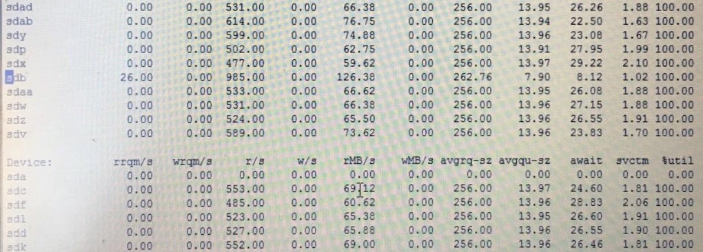

# 容易被误读的iostat

 [2016/11/22][0]  [vmunix][1]

iostat(1)是在Linux系统上查看I/O性能最基本的工具，然而对于那些熟悉其它UNIX系统的人来说它是很容易被误读的。_比如在HP-UX上 avserv（相当于Linux上的 svctm）是最重要的I/O指标，反映了硬盘设备的性能，它是指I/O请求从SCSI层发出、到I/O完成之后返回SCSI层所消耗的时间，不包括在SCSI队列中的等待时间，所以avserv体现了硬盘设备处理I/O的速度，又被称为disk service time，如果avserv很大，那么肯定是硬件出问题了。_然而Linux上svctm的含义截然不同，事实上在iostat(1)和sar(1)的man page上都说了不要相信svctm，该指标将被废弃：  
“Warning! Do not trust this field any more. This field will be removed in a future sysstat version.”

在Linux上，每个I/O的平均耗时是用await表示的，但它不能反映硬盘设备的性能，因为await不仅包括硬盘设备处理I/O的时间，还包括了在队列中等待的时间。I/O请求在队列中的时候尚未发送给硬盘设备，即队列中的等待时间不是硬盘设备消耗的，所以说await体现不了硬盘设备的速度，内核的问题比如I/O调度器什么的也有可能导致await变大。那么有没有哪个指标可以衡量硬盘设备的性能呢？非常遗憾的是，iostat(1)和sar(1)都没有，这是因为它们所依赖的/proc/diskstats不提供这项数据。要真正理解iostat的输出结果，应该从理解/proc/diskstats开始。

```

 # cat /proc/diskstats

  8  0  sda  239219  1806  37281259  2513275  904326  88832  50268824  26816609  0  4753060  29329105

  8  1  sda1  338  0  53241  6959  154  0  5496  3724  0  6337  10683

  8  2  sda2  238695  1797  37226458  2504489  620322  88832  50263328  25266599  0  3297988  27770221

  8  16  sdb  1009117  481  1011773  127319  0  0  0  0  0  126604  126604

  8  17  sdb1  1008792  480  1010929  127078  0  0  0  0  0  126363  126363

  253  0  dm - 0  1005  0  8040  15137  30146  0  241168  2490230  0  30911  2505369

  253  1  dm - 1  192791  0  35500457  2376087  359162  0  44095600  22949466  0  2312433  25325563

  253  2  dm - 2  47132  0  1717329  183565  496207  0  5926560  7348763  0  2517753  7532688
```
/proc/diskstats有11个字段，以下内核文档解释了它们的含义[https://www.kernel.org/doc/Documentation/iostats.txt][2]，我重新表述了一下，注意除了字段#9之外都是累计值，从系统启动之后一直累加：

1. (rd_ios)读操作的次数。
1. (rd_merges)合并读操作的次数。如果两个读操作读取相邻的数据块时，可以被合并成一个，以提高效率。合并的操作通常是I/O scheduler（也叫elevator）负责的。
1. (rd_sectors)读取的扇区数量。
1. (rd_ticks)读操作消耗的时间（以毫秒为单位）。每个读操作从__make_request()开始计时，到end_that_request_last()为止，包括了在队列中等待的时间。
1. (wr_ios)写操作的次数。
1. (wr_merges)合并写操作的次数。
1. (wr_sectors)写入的扇区数量。
1. (wr_ticks)写操作消耗的时间（以毫秒为单位）。
1. (in_flight)当前未完成的I/O数量。在I/O请求进入队列时该值加1，在I/O结束时该值减1。  
注意：是I/O请求进入队列时，而不是提交给硬盘设备时。
1. (io_ticks)该设备用于处理I/O的自然时间(wall-clock time)。  
请注意io_ticks与rd_ticks(字段#4)和wr_ticks(字段#8)的区别，rd_ticks和wr_ticks是把每一个I/O所消耗的时间累加在一起，因为硬盘设备通常可以并行处理多个I/O，所以rd_ticks和wr_ticks往往会比自然时间大。而io_ticks表示该设备有I/O（即非空闲）的时间，不考虑I/O有多少，只考虑有没有。在实际计算时，字段#9(in_flight)不为零的时候io_ticks保持计时，字段#9(in_flight)为零的时候io_ticks停止计时。
1. (time_in_queue)对字段#10(io_ticks)的加权值。字段#10(io_ticks)是自然时间，不考虑当前有几个I/O，而time_in_queue是用当前的I/O数量（即字段#9 in-flight）乘以自然时间。虽然该字段的名称是time_in_queue，但并不真的只是在队列中的时间，其中还包含了硬盘处理I/O的时间。iostat在计算avgqu-sz时会用到这个字段。

iostat(1)是以/proc/diskstats为基础计算出来的，因为/proc/diskstats并未把队列等待时间和硬盘处理时间分开，所以凡是以它为基础的工具都不可能分别提供disk service time以及与queue有关的值。  
注：下面的公式中“Δ”表示两次取样之间的差值，“Δt”表示采样周期。

* tps：每秒I/O次数=[(Δrd_ios+Δwr_ios)/Δt] 
  * r/s：每秒读操作的次数=[Δrd_ios/Δt]
  * w/s：每秒写操作的次数=[Δwr_ios/Δt]
* rkB/s：每秒读取的千字节数=[Δrd_sectors/Δt]*[512/1024]
* wkB/s：每秒写入的千字节数=[Δwr_sectors/Δt]*[512/1024]
* rrqm/s：每秒合并读操作的次数=[Δrd_merges/Δt]
* wrqm/s：每秒合并写操作的次数=[Δwr_merges/Δt]
* avgrq-sz：每个I/O的平均扇区数=[Δrd_sectors+Δwr_sectors]/[Δrd_ios+Δwr_ios]
* avgqu-sz：平均未完成的I/O请求数量=[Δtime_in_queue/Δt]  
（手册上说是队列里的平均I/O请求数量，更恰当的理解应该是平均未完成的I/O请求数量。）
* await：每个I/O平均所需的时间=[Δrd_ticks+Δwr_ticks]/[Δrd_ios+Δwr_ios]  
（不仅包括硬盘设备处理I/O的时间，还包括了在kernel队列中等待的时间。）
  * r_await：每个读操作平均所需的时间=[Δrd_ticks/Δrd_ios]  
不仅包括硬盘设备读操作的时间，还包括了在kernel队列中等待的时间。
  * w_await：每个写操作平均所需的时间=[Δwr_ticks/Δwr_ios]  
不仅包括硬盘设备写操作的时间，还包括了在kernel队列中等待的时间。
* %util：该硬盘设备的繁忙比率=[Δio_ticks/Δt]  
表示该设备有I/O（即非空闲）的时间比率，不考虑I/O有多少，只考虑有没有。
* svctm：已被废弃的指标，没什么意义，svctm=[util/tput]

对iostat(1)的恰当解读有助于正确地分析问题，我们结合实际案例进一步讨论。

##### 关于rrqm/s和wrqm/s

前面讲过，如果两个I/O操作发生在相邻的数据块时，它们可以被合并成一个，以提高效率，合并的操作通常是I/O scheduler（也叫elevator）负责的。

以下案例对许多硬盘设备执行同样的压力测试，结果惟有sdb比其它硬盘都更快一些，可是硬盘型号都一样，为什么sdb的表现不一样？

[](./img/IMG_1781.jpg)

可以看到其它硬盘的rrqm/s都为0，而sdb不是，就是说发生了I/O合并，所以效率更高，r/s和rMB/s都更高，我们知道I/O合并是内核的I/O scheduler（elevator）负责的，于是检查了sdb的/sys/block/sdb/queue/scheduler，发现它与别的硬盘用了不同的I/O scheduler，所以表现也不一样。

##### %util与硬盘设备饱和度

%util表示该设备有I/O（即非空闲）的时间比率，不考虑I/O有多少，只考虑有没有。由于现代硬盘设备都有并行处理多个I/O请求的能力，所以%util即使达到100%也不意味着设备饱和了。举个简化的例子：某硬盘处理单个I/O需要0.1秒，有能力同时处理10个I/O请求，那么当10个I/O请求依次顺序提交的时候，需要1秒才能全部完成，在1秒的采样周期里%util达到100%；而如果10个I/O请求一次性提交的话，0.1秒就全部完成，在1秒的采样周期里%util只有10%。可见，即使%util高达100%，硬盘也仍然有可能还有余力处理更多的I/O请求，即没有达到饱和状态。那么iostat(1)有没有哪个指标可以衡量硬盘设备的饱和程度呢？很遗憾，没有。

##### await多大才算有问题

await是单个I/O所消耗的时间，包括硬盘设备处理I/O的时间和I/O请求在kernel队列中等待的时间，正常情况下队列等待时间可以忽略不计，姑且把await当作衡量硬盘速度的指标吧，那么多大算是正常呢？  
对于SSD，从0.0x毫秒到1.x毫秒不等，具体看产品手册；  
对于机械硬盘，可以参考以下文档中的计算方法：  
[http://cseweb.ucsd.edu/classes/wi01/cse102/sol2.pdf][3]大致来说一万转的机械硬盘是8.38毫秒，包括寻道时间、旋转延迟、传输时间。

在实践中，要根据应用场景来判断await是否正常，如果I/O模式很随机、I/O负载比较高，会导致磁头乱跑，寻道时间长，那么相应地await要估算得大一些；如果I/O模式是顺序读写，只有单一进程产生I/O负载，那么寻道时间和旋转延迟都可以忽略不计，主要考虑传输时间，相应地await就应该很小，甚至不到1毫秒。在以下实例中，await是7.50毫秒，似乎并不大，但考虑到这是一个dd测试，属于顺序读操作，而且只有单一任务在该硬盘上，这里的await应该不到1毫秒才算正常：

```

 Device :  rrqm / s  wrqm / s  r / s  w / s  rsec / s  wsec / s  avgrq - sz avgqu - sz await svctm  % util

 sdg  0.00  0.00  133.00  0.00  2128.00  0.00  16.00  1.00  7.50  7.49  99.60
```
对磁盘阵列来说，因为有硬件缓存，写操作不等落盘就算完成，所以写操作的service time大大加快了，如果磁盘阵列的写操作不在一两个毫秒以内就算慢的了；读操作则未必，不在缓存中的数据仍然需要读取物理硬盘，单个小数据块的读取速度跟单盘差不多。

[0]: http://linuxperf.com/?p=156
[1]: http://linuxperf.com/?author=1
[2]: https://www.kernel.org/doc/Documentation/iostats.txt
[3]: http://cseweb.ucsd.edu/classes/wi01/cse102/sol2.pdf