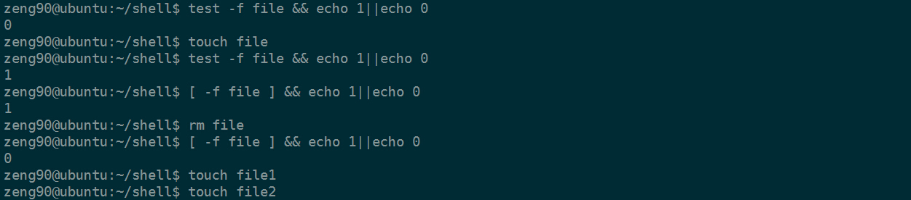
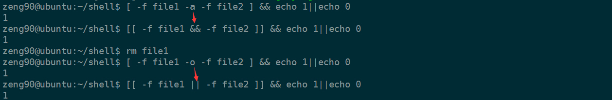
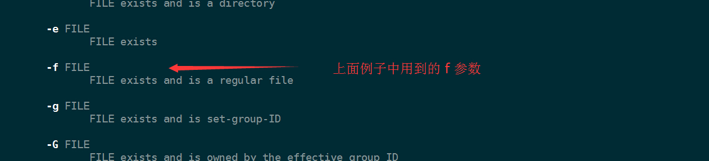
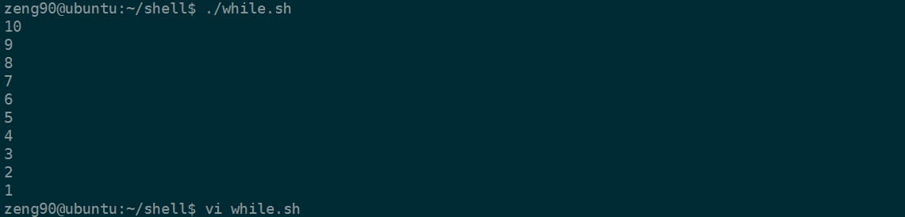

# shell中级使用笔记

 时间 2017-10-17 17:33:57 

原文[http://www.jianshu.com/p/6ea16bd16963][1]

### 目录

1、shell脚本的执行方法

2.shell的变量类型

3.shell特殊变量

4.变量子串的常用操作

5.批量修改文件名实践

6.变量替换

7.在shell中计算字符串长度的方法

8.变量的数值计算：(()) 的用法

9. 变量的数值计算：let的用法

10.变量的数值计算：expr的用法

11.变量的数值计算：bc的用法

12.条件测试的多种方法

13.字符串测试操作符

14.整数二元比较操作符

15.逻辑操作符

16.利用shell知识制作单级及多级菜单

17.case结构条件语句

18. 当型循环和直到型循环

19.for循环

#### 1.shell脚本的执行方法

当shell脚本以非交互的方式运行时，它会先查找环境变量ENV，该变量指定了一个环境文件（通常是.bashrc）,然后从该环境变量文件开始执行，当读取了ENV文件后，SHELL才开始执行shell脚本中的内容。

shell脚本的执行通常可以采用以下三种方法：

    bash script-name 或者 sh script-name
    path/script-name 或者 ./script-name(当前路径下执行)
    source script-name 或 . script-name（注意符号“.”与 script-name之间有空格）

第一种方法是脚本文件本身没有可执行权限时，通常使用的方法；

第二种方法需要先将脚本文件的权限改为可执行，然后通过脚本路径就可以直接执行；

第三中方法是在当前shell环境中直接执行，而不是新创建一个子shell，当我们需要在一个脚本中使用另一个脚本中的变量的时候就使用第三种方法，例如创建如下脚本，其中定义了chars变量:

![][3]

通过上面三种方法执行：

![][4]

可以看出方法1,2执行脚本是系统会自动新创建一个子shell，执行之后，其变量不会在当前shell有效，而第三种方法是告诉系统让这个脚本直接在当前shell执行，显然其定义的变量chars在当前shell中也是有效的，所以需要在某个脚本中使用另外一个脚本中的变量时，需要使用第3中方法执行脚本。

#### 2.shell的变量类型

shell中的变量分为环境变量和全局变量

环境变量也称为全局变量，可以在创建他们的shell及其派生的任意子进程shell中使用。局部变量只能使用在创建它们的shell函数或脚本中使用。

环境变量用于定义Shell的运行环境，保证shell命令的正确执行，shell通过环境变量来确定登录用户名，命令路径，终端类型，登录目录。环境变量可以在命令行中设置，但用户退出时这些变量值也会丢失，因此最好在用户家目录下的.bash_ptofile文件会全局配置`/etc/profile`文件或者`/etc/profile.d`中定义，将环境变量放入profile中，每次用户登录，这些变量值都将被初始化。

传统上，所有环境变量均为大写。环境变量用于用户进程前，必须用export命令导出。

有一些环境变量,比如HOME,PATH,SHELL,UID,USER等在用户登录之前就已经被`/bin/login`程序设置了，通常环境变量的定义并保存在用户的家目录下的`./bash_profile`文件中。

已经定义的变量可以用unset在取消定义。

本地变量定义的三种方式：

    var_name=value
    
    var_name='value'
    
    var_name="value"

下面看看这三种方式的区别

![][5]

第一种方法是直接定义变量内容，但是内容必须连续，中间不能有空格字符；

接着看下面：

![][6]

第二种方法通过单引号定义变量，只会 **原样** 输出字符串内容，而不会对字符串中的变量和特殊字符进行解析，适合定义单纯字符显示； 

第一种和第三种，输出时，会对内容进行解析，输出解析后的内容，有于第一种方法不能定义不连续的变量，所以通常在需要解析的时候都加上双引号，而很少使用第一种方法，第一种方法一般仅仅用来定义连续的数字或者路径。

#### 3.shell的特殊变量

* 位置变量
    * `$n` `$0`表示文件名本身,`$1`表示命令行第一个参数，依次类推。如果 n 大于9, 使用大括号`${10}`。

* 预定义变量
    * `$#` ：命令行中位置参数的个数
    * `$*` ：以一个单字符串显示所有向脚本传递的参数
    * `$@` : 与`$*`相同，但是使用时加引号，并在引号中返回每个参数

只有在双引号中体现出来。假设在脚本运行时写了三个参数 1、2、3，，则 " * " 等价于 "1 2 3"（传递了一个参数），而 "@" 等价于 "1" "2" "3"（传递了三个参数）

- `$?` ：上一条命令执行后返回的状态，当返回状态值为0时表示执行正常，非0表示执行异常或出错.
    * `$$` ：当前所在进程的进程号(PID)
    * `$!` ：后台运行的最后一个进程号
    * `$?` : 获取上一个命令的结束代码或返回值(0为成功,非零为失败)
    * `$0` ：获取当前执行脚本的文件名，包括路径

#### 4.变量子串的常用操作

#### 常用操作

编号 | 表达式 | 说明 
-|-|-
1 | `${#string}` | 返回$string的长度 
2 | `${string:position}` | 在$string中，从位置position之后开始提取子串 
3 | `${string:position:length}` | 在中，从位置之后开始提取长度为string中，从位置position之后开始提取长度为length的子串 
4 | `${string#substring}` | 从变量开头删除最短匹配string开头删除最短匹配substring子串 
5 | `${string##substring}` | 从变量开头删除最长匹配string开头删除最长匹配substring子串 
6 | `${string%substring}` | 从变量结尾删除最短匹配string结尾删除最短匹配substring子串 
7 | `${string%%substring}` | 从变量结尾删除最长匹配string结尾删除最长匹配substring子串 
8 | `${string/substring/replace}` | 使用来代替第一个匹配的replace来代替第一个匹配的substring 
9 | `${string//substring/replace}` | 使用来代替所有匹配的replace来代替所有匹配的substring 
10 | `${string/#substring/replace}` | 如果前缀匹配string前缀匹配substring,就用来代替匹配的字符串replace来代替匹配的字符串substring 
11 | `${string/%substring/replace}` | 如果后缀匹配string后缀匹配substring,就用来代替匹配的字符串replace来代替匹配的字符串substring 

举例说明如下：

![][7]

#### 5.批量修改文件名实践

例如有下面的文件：

![][8]

现在想要将后缀前部改为大写JPG：

方法一：

    #!/bin/bash
    for obj in $(ls *.jpg)
    do
        mv ${obj} $(echo ${obj/%jpg/JPG})
    done

方法二：

    rename 's/jpg$/JPG/' *.jpg

#### 6.变量替换

运算符号 | 作用 
-|-
`${value:-word}` |如果变量名存在且非null,返回变量值；否则，返回word字符串    用途：如果变量未定义，则返回默认值 
`${value:=word}` | 如果变量名存在且非null,返回变量值；否则，设置这个变量值为word    用途：如果变量未定义，，则设置变量为默认值，并返回默认值 
`${value:?"not defined"}` | 如果变量名存在且非null,返回变量值；否则显示“not defined”,并退出当前命令或脚本。    用途：用于捕捉由于变量未定义而导致的错误，并退出程序。 
`${value:+word}` | 如果变量名存在且非null,返回word，否则返回null。    用途：测试变量是否存在。 

示例如下:

![][9]

#### 7.在shell中计算字符串长度的方法

建立一个字符串：

![][10]

注意：使用 `wc -m` 的方法会计算换行符，因为echo会在输出完字符串之后自动加上一个换行符，使用`echo -n` 会去掉换行符：

![][11]

比较上面三种方法的效率:

![][12]

time :

获取一个程序的执行时间，可以获取到实际运行时间以及程序在用户态和内核态分别的时间，大部分的性能测试，可能只需要关注实际（real）时间.

看到上面三种获取字符串长度的速度相差几十倍到上百倍，一般调用外部命令处理，与内置功能性能相差很大。所以在shell编程，尽量使用内置操作或函数完成。

#### 8.变量的数值计算:(())的用法

#### (())用法：（此法很常用，且效率高）

用于执行的整数运算，支持的运算符与C语言中的基本一致，除了特别注意 " `**` " 在 `(())` 中表示幂运算，而C语言不支持，如 `((2**3))` 结果是 8，((expr))进行expr表达式计算，且没有返回值，而$((expr))产生表达式计算结果的返回值。

* 整数扩展。这种扩展计算是整数型的计算，不支持浮点型。((exp))结构扩展并计算一个算术表达式的值，如果表达式的结果为0，那么返回的退出状态码为1，或者是"假"，而一个非零值的表达式所返回的退出状态码将为0，或者是"true"。若是逻辑判断，表达式exp为真则为1,假则为0。
* 只要括号中的运算符、表达式符合C语言运算规则，都可用在$((exp))中，甚至是三目运算符。作不同进位(如二进制、八进制、十六进制)运算时，输出结果全都自动转化成了十进制。如：`echo $((16#5f))` 结果为95 (16进位转十进制)
* 单纯用 `(( ))` 也可重定义变量值，比如 `a=5; ((a++))` 可将 `$a` 重定义为6
* 常用于算术运算比较，双括号中的变量可以不使用$符号前缀。括号内支持多个表达式用逗号分开。 只要括号中的表达式符合C语言运算规则,比如可以直接使用`for((i=0;i<5;i++))`, 如果不使用双括号, 则为`for i in seq 0 4` 或者`for i in {0..4}`。再如可以直接使用`if (($i<5))`, 如果不使用双括号, 则为`if [ $i -lt 5 ]`。

示例：

![][13]

注意：1）`**`表示幂运算

2）上面涉及的变量元素必须为整型，不能是小数和字符，涉及小数的后面使用 **`bc`** 可以实现。 

![][14]

`(())` 内部的变量可以不用加 `$` 符号：

![][15]

各种shell运算的脚本例子：

![][16]

![][17]

==实践：用shell脚本编写一个实现加，减，乘，除的计算器：==

![][18]

![][19]

#### 9.变量的数值计算：let的用法

与 `((表达式))` 功能一致，但是没有 `(())` 的计算效率高，所以常用 `(())`，而不去使用let.

![][20]

#### 10.变量的数值计算：expr的用法

expr命令一般用于整数计算，但也可用于字符串，用来求表达式变量的值，同时expr也是一个手工命令计算器。

![][21]

![][22]

expr 的语法不是很好，所以不常用，这里标记，保证看到别人使用的时候，自己能够看懂。

下面介绍expr比较好用两个技巧

1）检查某个文件是否是某一类型或扩展名： 

![][23]

2）判断一个变量是否是整数：

![][24]

写出判断一个输入是否为整数的脚本：

![][25]

![][26]

#### 11.变量的数值计算：bc的用法

bc支持科学计算

![][27]

使用shell编写输出杨辉三角的脚本：

    #!/bin/bash
    
    export LANG="zh_CN.GB18030"
    
    #本文内容来自《老男孩linux运维实战培训中心》shell 编程部分学生练习资料
    
    #如果脚本后面没有参数，提示输入一个参数
    if ( test -z $1 );then
        read -p "Input max int lines:" MAX 
    else
        MAX=$1
    fi
    
    #判断参数的合法性
    #将参数中的数字全部替换为空，然后判断替换后的内容是否为空
    #若不为空，表明参数中含有非数字的其他非数字内容，则不合法
    #“[ ]”的功能与test一致，可以 man test 查看
    [ -n "$(echo ${MAX}|sed 's/[0-9]//g')" ] && \
    echo "The number you input must be int(1-9)" && exit 1
    
    #将输入限制在小于10
    [ ! ${MAX} -lt 10 ] && \
    echo "The number you input must be int(1-9)" && exit 1
    
    #start
    a[0]=1
    for ((i=0;i<MAX;i++))
    do
        for ((j=$i;j>0;j--))
        do
            ((a[$j]+=a[$j-1]))
        done
    
        for ((j=0;j<=MAX-i;j++))
        do
            if ((MAX<=6));then
                echo -en "\t"
            else
                echo -n "    "
            fi
        done
    
        for ((j=0;j<=i;j++))
        do
            if [ ${MAX} -le 6 ];then
                echo -en "\t\t"${a[$j]}
            else
                echo -en ${a[$j]}
            fi
        done
    echo
    done

运行结果：

![][28]

#### 12.条件测试的多种方法

语法格式：

    格式1：test expression 
    
    格式2：[ expression ]
    
    格式3：[[ 测试表达式 ]]
    
    注：中括号与表达式之间前后都有空格
    
格式1与格式2是等价的；格式3为扩展的test命令，在 `[[  ]]` 中可以使用通配符进行模式匹配，如`&&`，`||`，`>`, `<`等操作符可以应用于`[[ ]]`中，但不能应用于`[ ]`中；对整数的关系运算，也可以使用Shell的算术运算符 `(())`.
    

    

    
关于各种测试操作符只需要在终端man test 即可得到详细描述:
    

常用的文件测试操作符号 | 说明 
-|-
`-f file` | 若文件存在且为普通文件则真 
`-d file` | 若文件存在且为目录则真 
`-s file` | 若文件存在且不为空（文件大小非0）则真 
`-e file` | 若文件存在则真，区别于-f 
`-r file` | 若文件存在且可读则真 
`-w file` | 若文件存在且可写则真 
`-x file` | 若文件存在且可执行则真 
`-L file` | 若文件存在且为链接文件则真 
`f1 -nt f2` | 若文件f1 比文件 f2 新则真 
`f1 -ot f2` | 若文件f1 比文件 f2 旧则真 

#### 13.字符串测试操作符

字符串测试操作符的作用：比较两个字符串是否相同、字符串长度是否为0，字符串是否为null等

“=”比较两个字符串是否相同，与 “==”等价，如 `if [ "$a"="$b" ]`,其中 $a 这样的变量最好用双引号括起来。

#### 字符串测试操作符

常用字符串测试操作符 | 说明 
-|-
-z "string" | 若string长度为0，则真 
-n "string" | 若string长度步为0，则真 
“string1”= ”string2“ | 若string1等于string2则真，可以使用“==”代替“=” 
“string1”!= ”string2“ | 若string1不等于string2则真 

注意：测试符“==”，“=”，“!=”号前后均需与测试字符串之间留空格！！！ 

![][29]

#### 14.整数二元比较操作符

在`[ ]`中使用的比较符 | 在`(())`和`[[]]`中使用的比较符 | 说明 
-|-|-
-eq | == | 相等 
-ne | != | 不等 
-gt | > | 大于 
-ge | >= | 大于或等于 
-lt | < | 小于 
-le | <= | 小于或等于 

![][30]

#### 15.逻辑操作符

在`[]`中的使用 | 在`[[]]`中的使用 | 说明 
-|-|-
-a |  && | 与,两端均为真则真 
-o |  `|` | 或,两端有一个为真则真 
!  | ! | 非,相反则真 

#### 16.利用shell知识制作单级及多级菜单

![][31]

![][32]

#### 17.case结构条件语句

语法：

    case "字符串变量" in
    
    　　值1)指令1...
    
    ;;
    
    　　值2)指令2...
    
    ;;
    
    　　*）指令
    
    ;;
    
    esca

给字符串显示不同的颜色：

    shell脚本中echo可以显示不同颜色的字符,格式如下：
    
    格式如下（参考http://www.cnblogs.com/wish123/p/4131825.html）：
    　　echo -e "\033[字背景颜色;文字颜色m字符串\033[0m"
    　　例如：
    　　echo -e "\033[41;36m something here \033[0m"
    　　其中41的位置代表底色， 36的位置是代表字的颜色
    　　1、字背景颜色和文字颜色之间是英文的";"
    　　2、文字颜色后面有个m
    　　3、字符串前后可以没有空格，如果有的话，输出也是同样有空格
    　　

![][33]

![][34]

下面利用case来该给定的字符串加上不同的颜色：

    #!/bin/bash
    #Paint given chars with given color
    usage="Usage:chars {black|red|green|yellow|blue|purple|white}"
     [[ $# -ne 2 ]] &&{ 
         echo "${usage}" 
         exit 1
    }
    BLACK="\033[1;30m"; RED="\033[1;31m" ;GREEN="\033[1;32m"; YELLOW="\033[1;33m"
    BLUE="\033[1;34m"; PRUPLE="\033[1;35m"; WHITE="\033[1;37m"
    COLOR_END="\033[0m"
    
    chars=$1
    selected_color=$2
    
    case ${selected_color} in
        black) res=${BLACK}
    ;;
        red) res=${RED}
    ;;
        green) res=${GREEN}
    ;;
        yellow) res=${YELLOW}
    ;;
        blue) res=${BLUE}
    ;;
        purple) res=${PURPLE}
    ;;
        white) res=${WHITE}
    ;;
        *) echo 'Input color is not supported'
           echo ${usage}
           exit 1
    ;;
    esac
    
    echo -e "${res}"$1"${COLOR_END}"

![][35]

#### 18. 当型循环和直到型循环

while条件语句,条件满足一直执行command

    while condition
        do
        command
    done

until语法,条件满足就退出,目前很少用，作为了解

    until condition
        do
        command
    done

    #!/bin/bash
    i=10
    while (($i>=1))
    do
        echo $i
        ((i--))
    done
    

使用until实现上面同样的功能：

    #!/bin/bash
    
    i=10
    until [ $i -eq 0 ] 
    do
        echo $i
        (( i-- ))
    done

在实践中经常需要使用while来处理日志文件，下面实际中使用while读取文本的方法：

    #!/bin/bash
    exec <FILE
    while read line
    do
        cmd
    done
    
    #2
    cat ${FILE} | while read line
    do
        cmd
    done
    
    #3
    while read line
    do
        cmd
    done<FILE

#### 19.for循环. 当型循环和直到型循环

for循环语法结构1：

    for var in var_list
    do
        cmd1
        cmd2
        ...
    done

在此结构中, “in var_list”可以省略，省略时，相当于in "例如就相当于@",例如fori就相当于for i in "@".

for循环语法结构2：

    for ((exp1;exp2;exp3)) #与C语言一样
    do
        cmd1
        cmd2
        ...
    done

    #!/bin/bash
    for i in 10 9 8 7 6 
    do
        echo $i
    done

![][36]

下面代码实现同样的功能：

    #!/bin/bash
    for i in {10..6}
    do
        echo $i
    done
    
    
    #!/bin/bash
    for i in $(seq -s " " 10 -1 6)
    do
        echo $i
    done

获取当前目录下的所有文件名，打印

    #!/bin/bash
    for i in $(ls) 
    do
        echo $i
    done

打印9*9乘法表：

    #!/bin/bash
    for a in $( seq 1 9 )
    do
        for b in $( seq 1 9 )
        do  
            if [ $a -ge $b ];then
                echo -en "$a x $b = $((a*b))  "
            fi  
        done
    echo " "
    done
    
    echo

![][37]

参考资料： [http://www.cnblogs.com/90zeng/][38]

[1]: http://www.jianshu.com/p/6ea16bd16963

[3]: ./img/7BrmIjz.jpg
[4]: ./img/YVz2ue7.jpg
[5]: ./img/ZRF32ai.jpg
[6]: ./img/AnEZ3eV.jpg
[7]: ./img/iMVN73z.jpg
[8]: ./img/IjyMFbI.jpg
[9]: ./img/BbqUJbV.jpg
[10]: ./img/AFfYVfz.jpg
[11]: ./img/riAvMvj.jpg
[12]: ./img/7F3iquU.jpg
[13]: ./img/3yqIzuF.jpg
[14]: ./img/buu6ni6.jpg
[15]: ./img/nIRzEfN.jpg
[16]: ./img/NZvyMvu.jpg
[17]: ./img/6namInV.jpg
[18]: ./img/JnEVZjf.jpg
[19]: ./img/7RNRjuY.jpg
[20]: ./img/beiMfyA.jpg
[21]: ./img/bIbuIvJ.jpg
[22]: ./img/7jUZbmA.jpg
[23]: ./img/nMVvayF.jpg
[24]: ./img/RjUzYfA.jpg
[25]: ./img/FNfARzn.jpg
[26]: ./img/FfEJz2v.jpg
[27]: ./img/QBZrQ3i.jpg
[28]: ./img/qEFjYbq.jpg
[29]: ./img/rYB77f7.jpg
[30]: ./img/zuINfyI.jpg
[31]: ./img/3MnUny3.jpg
[32]: ./img/FbmAnyB.jpg
[33]: ./img/yyM7Vna.jpg
[34]: ./img/y2Av22B.jpg
[35]: ./img/iIjaMfu.jpg
[36]: ./img/m6NnInz.jpg
[37]: ./img/FBvAr22.jpg
[38]: http://www.cnblogs.com/90zeng/