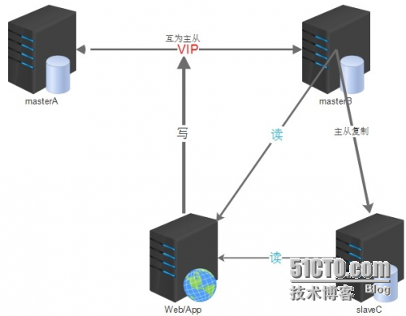
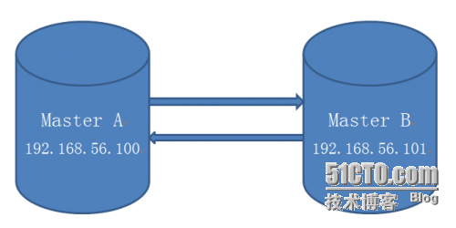

## 企业中MySQL高可用集群架构三部曲之MM+keepalived

<font face=微软雅黑>
 各位老铁们，老张与大家又见面了。看到各位在博客里面给我的留言和访问量的情况，我很是欣慰，也谢谢大家对我的认可。我写这些博客，就是想把自己对于MySQL数据库的一些看法和自己平时的实战经验分享出来，我们可以一起探讨，共同进步。也保证今后只要一有空就更新博文，推出更多的干货。

 我的学生经常对我说：“张老师，每次我遇到报错，有时还是会百度，但是最烦的是不知道百度哪篇帖子说的是正确的".其实这些呢，都是因为自己还没有对MySQL数据库核心知识的不熟悉，和对技术掌握的不牢固。平时下得功夫还是不到位。我们做技术这个行业，还是需要自己给自己加发条，促使自己每天都要学习一些新的知识。理论配合实验一起，先要学会多问自己几个问题，一个实验多做几遍，可能会得到不同的实验效果。学习知识要踏实下来，学会多做实验总结。我想今后再遇到报错，可能自己就会有一个清晰的解题思路，这个需要一定时间的磨练。

 也有人经常问Oracle和MySQL到底有啥区别，其实MySQL数据库上手很简单，难的是后期架构的设计与维护。老张三部曲中[第一部曲MHA][0]希望对大家在线上部署方面有帮助。

 今儿给大家介绍第二部曲，`MM+keepalived`的环境部署，我们会多种数据库的架构就可以灵活应用到我们的公司。根据公司业务的不同，选择合适的集群架构。

 **MM+keepalived**

 **简介** ：

` 双主配合keepalived`这种架构设计，也是基于主从复制的原理而搭建的。

 使用MySQL主主复制技术+Keepalived是一种简单、便捷的解决方案，在高可用集群环境中，`keepalived`使用VIP，使用Keepalived自带的服务监控功能和自定义脚本来实现MySQL故障时自动切换，非常灵活。

 ****

 **应用范围：**

 一般中小型公司都使用这种架构，搭建比较方便简单；

 可以采用主从或者主主模式，在 `master` 节点发生故障后，利用 `keepalived` 高可用机制实现快速切换到 `slave` 节点。原来的从库变成新的主库。

 ****

 **个人建议：**

1. 一定要完善好切换脚本，keepalived 的切换机制要合理，避免切换不成功的现象发生。
1. 从库的配置尽快要与主库一致，不能太次；避免主库宕机发生切换，新的主库（原来的从库）影响线上业务进行。
1. 对于延迟的问题，在这套架构中，也不能避免。可以使用 mysql 5.7 中增强半同步完成。也可以改变架构使用 PXC，完成时时同步功能，基本上没有延迟；
1. keepalived 无法解决脑裂的问题，因此在进行服务异常判断时，可以修改我们的判断脚本，通过对第三方节点补充检测来决定是否进行切换，可降低脑裂问题产生的风险。
1. 采用 keepalived 这个架构，在设置两节点状态时，都要设置成不抢占模式，都是 backup 状态，通过优先级，来决定谁是主库。避免脑裂，冲突现象发生。
1. 安装好 mysql 需要的一些依赖包；建议配置好 yum 源，用 yum 安装 keepalived 即可。

****

**搭建架构之前理清思路：**

1. 首先需要装有两台mysql的数据库服务器，两者之间互为主从模式，都可读写。其实就只有一台服务器A负责数据的写入工作，而另一台服务器B作为我们的备用数据库；
1. 安装keepalived的软件包，个人建议使用yum安装就可以，很方便。当然我们要知道yum安装之后的软件路径在什么位置。
1. 整理好keepalived的配置文件，理清keepalived的三种状态信息。还要准备一个监控MySQL的脚本，便于检测到宕机顺利发生切换的过程。
1. 所有提供服务的从服务器与备用服务器B进行主从同步。----双主从库模式
1. 在两台服务器A和B，当配置keepalived的参数文件中，要注意两台机器都要采用backup这种状态，就是nopreempt这种非抢占模式，避免出现冲突，发生脑裂现象。

架构图展示：



**实验部署环境介绍：**

192.168.56.100 主 ---master1

192.168.56.101 备库---master2

都是干净环境没有任何数据

VIP：192.168.56.111

MySQL数据库版本5.7.14，采用GTID模式搭建主从环境

**注意事项：**

1. 两台机器的防火墙必须是关闭状态。
1. 两台MySQL数据库配置文件中server-id绝对不能一样，要不会报1593这个主从同步的错误，导致搭建不成功。

 实战开始：

 首先先要搭建两台MySQL数据库为互为主从的架构模式。

 



**添加主从同步账号：**

**在192.168.56.100：**

     grant replication slave on *.* to 'bak'@'192.168.56.%' identified by '123456';

     flush privileges;

**在192.168.56.101：**

     grant replication slave on *.* to 'bak'@'192.168.56.%' identified by '123456';

     flush privileges;

**配置同步信息：**

 先在192.168.56.101上：

     CHANGE MASTER TO MASTER_HOST='192.168.56.100',MASTER_USER='bak',MASTER_PASSWORD='123456',master_auto_position=1;

 **打开主从同步开关：**

    start slave；

 **查看主从同步状态：**

```
root@db 10:49:  [(none)]> show slave status\G;
*************************** 1. row ***************************
               Slave_IO_State: Waiting for master to send event
                  Master_Host: 192.168.56.100
                  Master_User: bak
                  Master_Port: 3306
                Connect_Retry: 60
              Master_Log_File: mybinlog.000005
          Read_Master_Log_Pos: 234
               Relay_Log_File: node2-relay-bin.000010
                Relay_Log_Pos: 365
        Relay_Master_Log_File: mybinlog.000005
             Slave_IO_Running: Yes
            Slave_SQL_Running: Yes
              Replicate_Do_DB: 
          Replicate_Ignore_DB: 
           Replicate_Do_Table: 
       Replicate_Ignore_Table: 
      Replicate_Wild_Do_Table: 
  Replicate_Wild_Ignore_Table: 
                   Last_Errno: 0
                   Last_Error: 
                 Skip_Counter: 0
          Exec_Master_Log_Pos: 234
              Relay_Log_Space: 572
              Until_Condition: None
               Until_Log_File: 
                Until_Log_Pos: 0
           Master_SSL_Allowed: No
           Master_SSL_CA_File: 
           Master_SSL_CA_Path: 
              Master_SSL_Cert: 
            Master_SSL_Cipher: 
               Master_SSL_Key: 
        Seconds_Behind_Master: 0
Master_SSL_Verify_Server_Cert: No
                Last_IO_Errno: 0
                Last_IO_Error: 
               Last_SQL_Errno: 0
               Last_SQL_Error: 
  Replicate_Ignore_Server_Ids: 
             Master_Server_Id: 3306100
                  Master_UUID: 913cc1d6-771a-11e7-8fe1-080027f1fd08
             Master_Info_File: mysql.slave_master_info
                    SQL_Delay: 0
          SQL_Remaining_Delay: NULL
      Slave_SQL_Running_State: Slave has read all relay log; waiting for more updates
           Master_Retry_Count: 86400
                  Master_Bind: 
      Last_IO_Error_Timestamp: 
     Last_SQL_Error_Timestamp: 
               Master_SSL_Crl: 
           Master_SSL_Crlpath: 
           Retrieved_Gtid_Set: 
            Executed_Gtid_Set: 5a668126-771d-11e7-b14c-08002783b39d:1-2,
913cc1d6-771a-11e7-8fe1-080027f1fd08:1-13
                Auto_Position: 1
         Replicate_Rewrite_DB: 
                 Channel_Name: 
           Master_TLS_Version: 
1 row in set (0.00 sec)
```

```
从库两个工作的线程：IO，SQL都为yes，代表同步搭建成功
Slave_IO_Running: Yes
Slave_SQL_Running: Yes
```

 再在**192.168.56.100**上：

**配置主从同步信息** ：

     CHANGE MASTER TO MASTER_HOST='192.168.56.101',MASTER_USER='bak',MASTER_PASSWORD='123456',master_auto_position=1;

 **开启主从开关** ：

    start slave；

 **查看主从同步状态** ：

```
root@db 10:49:  [(none)]> show slave status\G;
*************************** 1. row ***************************
               Slave_IO_State: Waiting for master to send event
                  Master_Host: 192.168.56.101
                  Master_User: bak
                  Master_Port: 3306
                Connect_Retry: 60
              Master_Log_File: mybinlog.000005
          Read_Master_Log_Pos: 234
               Relay_Log_File: node1-relay-bin.000008
                Relay_Log_Pos: 365
        Relay_Master_Log_File: mybinlog.000005
             Slave_IO_Running: Yes
            Slave_SQL_Running: Yes
              Replicate_Do_DB: 
          Replicate_Ignore_DB: 
           Replicate_Do_Table: 
       Replicate_Ignore_Table: 
      Replicate_Wild_Do_Table: 
  Replicate_Wild_Ignore_Table: 
                   Last_Errno: 0
                   Last_Error: 
                 Skip_Counter: 0
          Exec_Master_Log_Pos: 234
              Relay_Log_Space: 572
              Until_Condition: None
               Until_Log_File: 
                Until_Log_Pos: 0
           Master_SSL_Allowed: No
           Master_SSL_CA_File: 
           Master_SSL_CA_Path: 
              Master_SSL_Cert: 
            Master_SSL_Cipher: 
               Master_SSL_Key: 
        Seconds_Behind_Master: 0
Master_SSL_Verify_Server_Cert: No
                Last_IO_Errno: 0
                Last_IO_Error: 
               Last_SQL_Errno: 0
               Last_SQL_Error: 
  Replicate_Ignore_Server_Ids: 
             Master_Server_Id: 3306101
                  Master_UUID: 5a668126-771d-11e7-b14c-08002783b39d
             Master_Info_File: mysql.slave_master_info
                    SQL_Delay: 0
          SQL_Remaining_Delay: NULL
      Slave_SQL_Running_State: Slave has read all relay log; waiting for more updates
           Master_Retry_Count: 86400
                  Master_Bind: 
      Last_IO_Error_Timestamp: 
     Last_SQL_Error_Timestamp: 
               Master_SSL_Crl: 
           Master_SSL_Crlpath: 
           Retrieved_Gtid_Set: 
            Executed_Gtid_Set: 5a668126-771d-11e7-b14c-08002783b39d:1-2,
913cc1d6-771a-11e7-8fe1-080027f1fd08:1-13
                Auto_Position: 1
         Replicate_Rewrite_DB: 
                 Channel_Name: 
           Master_TLS_Version: 
1 row in set (0.00 sec)

```

```
Slave_IO_Running: Yes
Slave_SQL_Running: Yes
从库两个工作的线程：IO，SQL都为yes，代表同步搭建成功。
```

 **分别两台机器上安装keepalived的软件包，可以使用yum安装方式**

    yum -y install keepalived;

```
Loaded plugins: fastestmirror, refresh-packagekit, security
Loading mirror speeds from cached hostfile
 * c6-media: 
file:///media/CentOS/repodata/repomd.xml: [Errno 14] Could not open/read file:///media/CentOS/repodata/repomd.xml
Trying other mirror.
file:///media/cdrecorder/repodata/repomd.xml: [Errno 14] Could not open/read file:///media/cdrecorder/repodata/repomd.xml
Trying other mirror.
c6-media                                                                                                       | 4.0 kB     00:00 ... 
Setting up Install Process
Resolving Dependencies
--> Running transaction check
---> Package keepalived.x86_64 0:1.2.7-3.el6 will be installed
--> Finished Dependency Resolution
 
Dependencies Resolved
 
======================================================================================================================================
 Package                          Arch                         Version                           Repository                      Size
======================================================================================================================================
Installing:
 keepalived                       x86_64                       1.2.7-3.el6                       c6-media                       174 k
 
Transaction Summary
======================================================================================================================================
Install       1 Package(s)
 
Total download size: 174 k
Installed size: 526 k
Downloading Packages:
Running rpm_check_debug
Running Transaction Test
Transaction Test Succeeded
Running Transaction
  Installing : keepalived-1.2.7-3.el6.x86_64                                                                                      1/1 
  Verifying  : keepalived-1.2.7-3.el6.x86_64                                                                                      1/1 
 
Installed:
  keepalived.x86_64 0:1.2.7-3.el6                                                                                                     
 
Complete!
```

**证明keepalived软件已经存在：**

```
rpm -qa|grep keepalived
keepalived-1.2.7-3.el6.x86_64
```

 **在两台机器上分别配置检测MySQL数据库的脚本：**

 **首先进入到yum安装后的软件目录下：**
```
cd /etc/keepalived
vim check_mysql.py
```
脚本通过查看MySQL进程的存在，和是否可以连接，来判断MySQL的状态

 （这里只展现了脚本中判断的一部分）

```python
    def existMySQL(self):
        cmd="ps -ef | egrep -i \"mysqld\" | grep %s | egrep -iv \"mysqld_safe\" | grep -v grep | wc -l" % self.dbport
        mysqldNum = os.popen(cmd).read()
        cmd ="netstat -tunlp | grep \":%s\" | wc -l" % self.dbport
        mysqlPortNum= os.popen(cmd).read()
        #print mysqldNum, mysqlPortNum
        if ( int(mysqldNum) <= 0):
            print "error"
            return 1
        if ( int(mysqldNum) > 0 and  mysqlPortNum <= 0):
            return 1
        return 0
 
    def connect(self):
    #    print "in db conn"
#        print "host : %s, port: %d, user: %s, password: %s" % (self.dbhost, self.dbport, self.dbuser, self.dbpassword)
        try:
            self.conn=MySQLdb.connect(host="%s"%self.dbhost, port=self.dbport,user="%s"%dbuser, passwd="%s"%self.dbpassword)
        except Exception, e:
#            print " Error"
            print e
            return 1
        return 0
    def disconnect(self):
        if (self.conn):
            self.conn.close()
            self.conn = None
```

 在两台机器上修改keepalived的配置文件：

**192.168.56.100上面**

    vim /etc/keepalived/keepalived.conf

```
vrrp_instance VI_100 {
    state BACKUP
    nopreempt
    interface eth0
    virtual_router_id 100
    priority 100
    advert_int 5
    authentication {
        auth_type PASS
        auth_pass 1111
    }
    track_script {
        vs_mysql_100
    }
    virtual_ipaddress {
        192.168.56.111
    }
}
```

**192.168.56.101上面：**

```
vrrp_instance VI_101 {
    state BACKUP
    nopreempt
    interface eth0
    virtual_router_id 100
    priority 90
    advert_int 5
    authentication {
        auth_type PASS
        auth_pass 1111
    }
    track_script {
        vs_mysql_101
    }
    virtual_ipaddress {
        192.168.56.111
   
```

**总结：可以看到两台机器的state都是backup并且都是非抢占模式nopreempt，通过优先级的高低来决定谁是主库。（这里192.168.56.100是主）还有注意virtual_router_id(虚拟路由id）要保持一致。**

 **接下来可以启动两台机器的keepalived进程：**

 **192.168.56.100：**

```
[root@node1 keepalived]# /etc/init.d/keepalived start
Starting keepalived:               [  OK  ]
```

**观察日志中信息的变化：**

**cat /var/log/messages**

```
Aug  3 10:52:17 node1 Keepalived_vrrp[6760]: Opening file '/etc/keepalived/keepalived.conf'.
Aug  3 10:52:17 node1 Keepalived_vrrp[6760]: Configuration is using : 62711 Bytes
Aug  3 10:52:17 node1 Keepalived_vrrp[6760]: Using LinkWatch kernel netlink reflector...
Aug  3 10:52:17 node1 Keepalived_vrrp[6760]: VRRP_Instance(VI_100) Entering BACKUP STATE
Aug  3 10:52:17 node1 Keepalived_vrrp[6760]: VRRP sockpool: [ifindex(2), proto(112), fd(11,12)]
Aug  3 10:52:17 node1 Keepalived_healthcheckers[6759]: Opening file '/etc/keepalived/keepalived.conf'.
Aug  3 10:52:17 node1 Keepalived_healthcheckers[6759]: Configuration is using : 4431 Bytes
Aug  3 10:52:17 node1 Keepalived_healthcheckers[6759]: Using LinkWatch kernel netlink reflector...
Aug  3 10:52:18 node1 Keepalived_vrrp[6760]: VRRP_Script(vs_mysql_100) succeeded
Aug  3 10:52:33 node1 Keepalived_vrrp[6760]: VRRP_Instance(VI_100) Transition to MASTER STATE
Aug  3 10:52:38 node1 Keepalived_vrrp[6760]: VRRP_Instance(VI_100) Entering MASTER STATE
Aug  3 10:52:38 node1 Keepalived_vrrp[6760]: VRRP_Instance(VI_100) setting protocol VIPs.
Aug  3 10:52:38 node1 Keepalived_vrrp[6760]: VRRP_Instance(VI_100) Sending gratuitous ARPs on eth0 for 192.168.56.111
Aug  3 10:52:38 node1 Keepalived_healthcheckers[6759]: Netlink reflector reports IP 192.168.56.111 added
Aug  3 10:52:43 node1 Keepalived_vrrp[6760]: VRRP_Instance(VI_100) Sending gratuitous ARPs on eth0 for 192.168.56.111
```

**可以看到它从backup状态切换到master的状态了，并且发送了一个广播协议，证明192.168.56.111已经在本台机器上面，其他机器不要再使用了。**

```
[root@node1 keepalived]# ip addr show
1: lo: <LOOPBACK,UP,LOWER_UP> mtu 16436 qdisc noqueue state UNKNOWN 
    link/loopback 00:00:00:00:00:00 brd 00:00:00:00:00:00
    inet 127.0.0.1/8 scope host lo
    inet6 ::1/128 scope host 
       valid_lft forever preferred_lft forever
2: eth0: <BROADCAST,MULTICAST,UP,LOWER_UP> mtu 1500 qdisc pfifo_fast state UP qlen 1000
    link/ether 08:00:27:f1:fd:08 brd ff:ff:ff:ff:ff:ff
    inet 192.168.56.100/24 brd 192.168.56.255 scope global eth0
    inet 192.168.56.111/32 scope global eth0
    inet6 fe80::a00:27ff:fef1:fd08/64 scope link 
       valid_lft forever preferred_lft forever
```

**192.168.56.101:**

```
[root@node2 ~]# /etc/init.d/keepalived start
Starting keepalived:               [  OK  ]
```

**cat /var/log/messages**

```
Aug  3 10:53:28 node2 Keepalived_healthcheckers[8111]: Interface queue is empty
Aug  3 10:53:28 node2 Keepalived_healthcheckers[8111]: Netlink reflector reports IP 192.168.56.101 added
Aug  3 10:53:28 node2 Keepalived_healthcheckers[8111]: Netlink reflector reports IP fe80::a00:27ff:fe83:b39d added
Aug  3 10:53:28 node2 Keepalived_healthcheckers[8111]: Registering Kernel netlink reflector
Aug  3 10:53:28 node2 Keepalived_healthcheckers[8111]: Registering Kernel netlink command channel
Aug  3 10:53:28 node2 Keepalived_healthcheckers[8111]: Opening file '/etc/keepalived/keepalived.conf'.
Aug  3 10:53:28 node2 Keepalived_healthcheckers[8111]: Configuration is using : 4561 Bytes
Aug  3 10:53:28 node2 Keepalived_healthcheckers[8111]: Using LinkWatch kernel netlink reflector...
Aug  3 10:53:28 node2 Keepalived_vrrp[8112]: Opening file '/etc/keepalived/keepalived.conf'.
Aug  3 10:53:28 node2 Keepalived_vrrp[8112]: Configuration is using : 62577 Bytes
Aug  3 10:53:28 node2 Keepalived_vrrp[8112]: Using LinkWatch kernel netlink reflector...
Aug  3 10:53:28 node2 Keepalived_vrrp[8112]: VRRP_Instance(VI_101) Entering BACKUP STATE
Aug  3 10:53:28 node2 Keepalived_vrrp[8112]: VRRP sockpool: [ifindex(2), proto(112), fd(12,13)]
Aug  3 10:53:28 node2 Keepalived_vrrp[8112]: VRRP_Script(vs_mysql_101) succeeded

```

**这台服务器就是正常的backup状态，时刻准备着接管主库的服务。**

**模拟一下主库宕机的故障切换：**

**主库192.168.56.100上面执行关闭MySQL服务操作：**

    mysqladmin -uroot -proot123 shutdown

**这时再查看一下keepalived日志的情况**：

```
cat /var/log/messages
Aug  3 11:04:17 node1 Keepalived_vrrp[6760]: VRRP_Script(vs_mysql_100) failed
Aug  3 11:04:18 node1 Keepalived_vrrp[6760]: VRRP_Instance(VI_100) Entering FAULT STATE
Aug  3 11:04:18 node1 Keepalived_vrrp[6760]: VRRP_Instance(VI_100) removing protocol VIPs.
Aug  3 11:04:18 node1 Keepalived_healthcheckers[6759]: Netlink reflector reports IP 192.168.56.111 removed
Aug  3 11:04:18 node1 Keepalived_vrrp[6760]: VRRP_Instance(VI_100) Now in FAULT state

```

**已经把vip removed了，并且keepalived的状态变成了fault**

**在备库192.168.56.101上面查看日志：**

```
cat /var/log/messages
Aug  3 11:04:29 node2 Keepalived_vrrp[8112]: VRRP_Instance(VI_101) Transition to MASTER STATE
Aug  3 11:04:34 node2 Keepalived_vrrp[8112]: VRRP_Instance(VI_101) Entering MASTER STATE
Aug  3 11:04:34 node2 Keepalived_vrrp[8112]: VRRP_Instance(VI_101) setting protocol VIPs.
Aug  3 11:04:34 node2 Keepalived_vrrp[8112]: VRRP_Instance(VI_101) Sending gratuitous ARPs on eth0 for 192.168.56.111
Aug  3 11:04:34 node2 Keepalived_healthcheckers[8111]: Netlink reflector reports IP 192.168.56.111 added
Aug  3 11:04:39 node2 Keepalived_vrrp[8112]: VRRP_Instance(VI_101) Sending gratuitous ARPs on eth0 for 192.168.56.111
```

备库已经从backup状态切换成master状态了。并且VIP（192.168.56.111）已经切换过来。

 **查看ip地址：**

```
[root@node2 ~]# ip addr show
1: lo: <LOOPBACK,UP,LOWER_UP> mtu 16436 qdisc noqueue state UNKNOWN 
    link/loopback 00:00:00:00:00:00 brd 00:00:00:00:00:00
    inet 127.0.0.1/8 scope host lo
    inet6 ::1/128 scope host 
       valid_lft forever preferred_lft forever
2: eth0: <BROADCAST,MULTICAST,UP,LOWER_UP> mtu 1500 qdisc pfifo_fast state UP qlen 1000
    link/ether 08:00:27:83:b3:9d brd ff:ff:ff:ff:ff:ff
    inet 192.168.56.101/24 brd 192.168.56.255 scope global eth0
    inet 192.168.56.111/32 scope global eth0
    inet6 fe80::a00:27ff:fe83:b39d/64 scope link 
       valid_lft forever preferred_lft forever
```

**主备库切换成功。**

实战演练过程结束，希望对大家学习MySQL高可用集群有帮助。

今后我们可能还会遇到其他的MySQL高可用架构，学习它的时候，先不要忙于搭建，要先弄清原理，整理好实验过程的思路，遇到报错，一步步地去排查。自己的水平也会在这个历练的过程中，得到提升。

今后我们可以一起讨论，在写博的过程中难免可能会有一些笔误，或是想不周全的地方，希望大家谅解。有不对的地方欢迎各位老铁指定。（ **MySQL高可用集群第二部曲完结** ）

</font>

[0]: http://sumongodb.blog.51cto.com/4979448/1951495
[1]: http://edu.51cto.com/course/10681.html