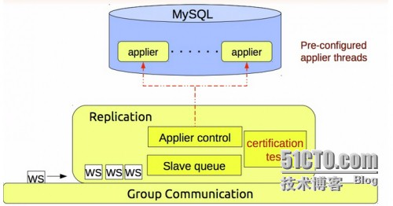
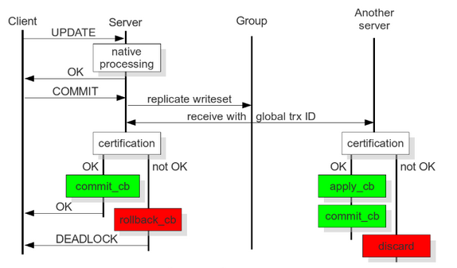
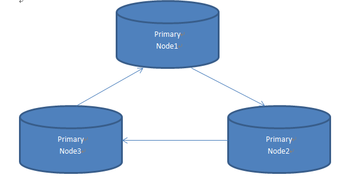

## 企业主流MySQL高可用集群架构三部曲之PXC

<font face=微软雅黑>
今儿给大家介绍最后一部曲，是percona公司的percona xtraDB cluster .简称PXC。它是基于GaLera 协议的 高可用集群方案。 可以实现多个节点间的数据同步复制以及读写，并且可保障数据库的服务高可用及数据强一致性 **。**

****

**PXC 架构图：**



****



pxc就属于一套近乎完美的MySQL高可用集群架构方案；

**优点总结：**

1. 可以达到时时同步，无延迟现象发生
1. 完全兼容MySQL
1. 对于集群中新节点的加入，维护起来很简单
1. 数据的强一致性

**不足之处总结：**

1. 只支持Innodb存储引擎
1. 存在多节点update更新问题，也就是写放大问题
1. 在线DDL语句，锁表问题
1. sst针对新节点加入的传输代价过高的问题

**实战过程：**

环境介绍：

```
192.168.56.100 node1
192.168.56.101 node2
192.168.56.102 node3
```

**安装之前的注意事项：**

**三台机器的防火墙iptables都要关闭，三台机器的server-id不能一样。**

PXC软件包下载：[**https://www.percona.com/downloads/Percona-XtraDB-Cluster-56/LATEST/**][0]

这里我下载的是：Percona-XtraDB-Cluster-5.6.21-rel70.1-25.8.938.Linux.x86_64.tar.gz

接下来三台机器上都需要针对基础软件包进行安装，使用yum安装即可，解决依赖性。

```
 perl-IO-Socket-SSL.noarch 
 perl-DBD-MySQL.x86_64  
 perl-Time-HiRes
 openssl 
 openssl-devel
 socat
```

**在节点一（192.168.56.100）上执行操作：**

先解压软件包并赋予权限

```
cd /usr/local/
tar -zxvf Percona-XtraDB-Cluster-5.6.21-rel70.1-25.8.938.Linux.x86_64.tar.gz
ln -s Percona-XtraDB-Cluster-5.6.21-rel70.1-25.8.938.Linux.x86_64 mysql
chown mysql:mysql -R mysql
mkdir -p /data/mysql
chown mysql:mysql -R /data/mysql
```

配置pxc的参数文件，这里就比普通的MySQL参数文件多如下几点：

提及一点注意事项：这里binlog的格式必须row

```
#pxc
default_storage_engine=Innodb
innodb_autoinc_lock_mode=2
wsrep_cluster_name=pxc_zs ---------------集群的名字
wsrep_cluster_address=gcomm://192.168.56.100,192.168.56.101,192.168.56.102（集群中节点的IP）
wsrep_node_address=192.168.56.100------当前机器的ip地址
wsrep_provider=/usr/local/mysql/lib/libgalera_smm.so
wsrep_sst_method=xtrabackup-v2 （sst传输方法）
wsrep_sst_auth=sst:zs （账号权限）
```

初始化数据：

```
/usr/local/mysql/scripts/mysql_install_db  --basedir=/usr/local/mysql 
--datadir=/data/mysql/ --defaults-file=/etc/my.cnf  --user=mysql
```

启动第一节点的服务：

```
cd /usr/local/mysql/support-files
cp mysql.server /etc/init.d/mysql
```

```
[root@node1 support-files]# /etc/init.d/mysql bootstrap-pxc
Bootstrapping PXC (Percona XtraDB Cluster)MySQL (Percona Xt[  OK  ]ster) running (4740)
```

启动成功之后，维护数据库环境并创建用户

```
mysql> delete from mysql.user where user!='root' or host!='localhost';
mysql> grant all privileges on *.* to 'zs'@'%' identified by 'zs';
mysql> grant all privileges on *.* to 'sst'@'localhost' identified by 'zs';
mysql> flush privileges;
```

**在节点二（192.168.56.101）上执行操作：**

```
cd /usr/local/
tar -zxvf Percona-XtraDB-Cluster-5.6.21-rel70.1-25.8.938.Linux.x86_64.tar.gz
ln -s Percona-XtraDB-Cluster-5.6.21-rel70.1-25.8.938.Linux.x86_64 mysql
chown mysql:mysql -R mysql
mkdir -p /data/mysql
chown mysql:mysql -R /data/mysql
```

编辑pxc的配置文件：

```
#pxc
default_storage_engine=Innodb
innodb_autoinc_lock_mode=2
wsrep_cluster_name=pxc_zs ---------------集群的名字
wsrep_cluster_address=gcomm://192.168.56.100,192.168.56.101,192.168.56.102（集群中节点的IP）
wsrep_node_address=192.168.56.101------当前机器的ip地址
wsrep_provider=/usr/local/mysql/lib/libgalera_smm.so
wsrep_sst_method=xtrabackup-v2 （sst传输方法）
wsrep_sst_auth=sst:zs （账号权限）
```

初始化数据：

```
/usr/local/mysql/scripts/mysql_install_db  --basedir=/usr/local/mysql 
--datadir=/data/mysql/ --defaults-file=/etc/my.cnf  --user=mysql
```

启动第二个节点的服务：

```
cd /usr/local/mysql/support-files
cp mysql.server /etc/init.d/mysql
```

```
[root@node2 mysql]# /etc/init.d/mysql start
Starting MySQL (Percona XtraDB Cluster)..                  [  OK  ]
```

**在第三个节点（192.168.56.102）上面执行：**

```
cd /usr/local/
tar -zxvf Percona-XtraDB-Cluster-5.6.21-rel70.1-25.8.938.Linux.x86_64.tar.gz
ln -s Percona-XtraDB-Cluster-5.6.21-rel70.1-25.8.938.Linux.x86_64 mysql
chown mysql:mysql -R mysql
mkdir -p /data/mysql
chown mysql:mysql -R /data/mysql
```

编辑pxc的配置文件：

```
#pxc
default_storage_engine=Innodb
innodb_autoinc_lock_mode=2
wsrep_cluster_name=pxc_zs ---------------集群的名字
wsrep_cluster_address=gcomm://192.168.56.100,192.168.56.101,192.168.56.102（集群中节点的IP）
wsrep_node_address=192.168.56.102------当前机器的ip地址
wsrep_provider=/usr/local/mysql/lib/libgalera_smm.so
wsrep_sst_method=xtrabackup-v2 （sst传输方法）
wsrep_sst_auth=sst:zs （账号权限）
```

[初始化数据：][1]

```
/usr/local/mysql/scripts/mysql_install_db  --basedir=/usr/local/mysql 
--datadir=/data/mysql/ --defaults-file=/etc/my.cnf  --user=mysql

```

启动第三个节点的服务：

```
cd /usr/local/mysql/support-files
cp mysql.server /etc/init.d/mysql
```

```
[root@node3 mysql]# /etc/init.d/mysql start
Starting MySQL (Percona XtraDB Cluster)..                  [  OK  ]
```

注：其他两个节点同样进行安装与初始化的操作；

但启动方式不是以/etc/init.d/mysql bootstrap-pxc，换成/etc/init.d/mysql start 这种方式

三个节点都已经启动成功，这样在任意一个节点上面，执行一条DML语句的操作，都会同步到另外两个节点。



至此张老师的企业级MySQL主流高可用集群架构三部曲就完结了！有欠妥的地方，请大家多多指教。

今后还会出更多好文章奉献给大家，技术只有在无限的分享中，得到进一步地升华！

</font>

[0]: https://www.percona.com/downloads/Percona-XtraDB-Cluster-56/LATEST/
[1]: http://blog.51cto.com/user_index.php?action=addblog_new&did=365290