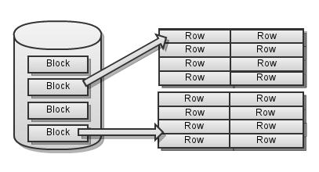
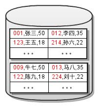
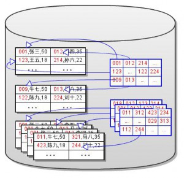
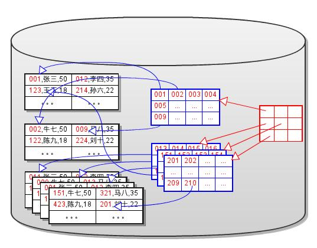
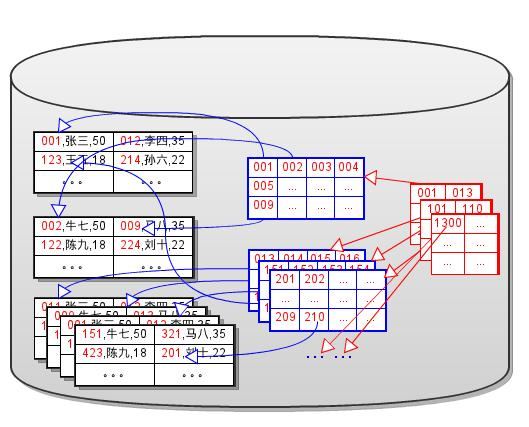
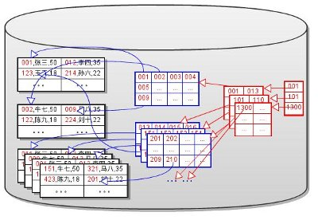
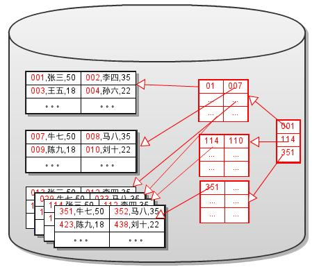
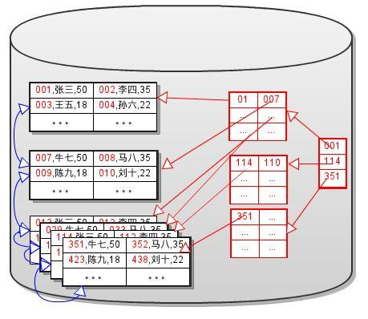
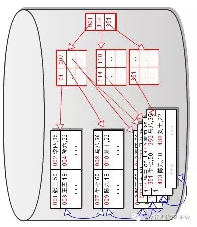

## 由浅入深理解索引的实现(1)

时间 2011-11-24 19:41:57  Mysqlops

原文[http://www.mysqlops.com/2011/11/24/understanding_index.html][1]

### 00 – 背景知识

#### B-Tree & B+Tree

 [http://en.wikipedia.org/wiki/B%2B_tree][3]   
 [http://en.wikipedia.org/wiki/B-tree][4]

#### 折半查找(Binary Search)

 [http://en.wikipedia.org/wiki/Binary_search_algorithm][5]

#### 数据库的性能问题

 A. 磁盘IO性能非常低，严重的影响数据库系统的性能。   
 B. 磁盘顺序读写比随机读写的性能高很多。

#### 数据的基本存储结构

 A. 磁盘空间被划分为许多大小相同的块（`Block`）或者页(`Page`).   
 B. 一个表的这些数据块以链表的方式串联在一起。   
 C. 数据是以行（`Row`）为单位一行一行的存放在磁盘上的块中,如图所示.   
 D. 在访问数据时，一次从磁盘中读出或者写入至少一个完整的Block。

- Fig. 1

  
### 01 – 数据基本操作的实现

 基本操作包括：INSERT、UPDATE、DELETE、SELECT。

#### SELECT

 A. 定位数据   
 B. 读出数据所在的块，对数据加工   
 C. 返回数据给用户

#### UPDATE、DELETE

 A. 定位数据   
 B. 读出数据所在的块，修改数据   
 C. 写回磁盘

#### INSERT

 A. 定位数据要插入的页（如果数据需要排序）   
 B. 读出要插入的数据页，插入数据.   
 C. 写回磁盘

_如何定位数据？_  

#### 表扫描(Table Scan)

 A. 从磁盘中依次读出所有的数据块，一行一行的进行数据匹配。   
 B. 时间复杂度 是O(n)， 如果所有的数据占用了100个块。尽管只查询一行数据，   
 也需要读出所有100个块的数据。   
 C. 需要大量的磁盘IO操作，极大的影响了数据定位的性能。

_因为数据定位操作是所有数据操作必须的操作，数据定位操作的效率会直接影响所有的数据操作的效率。_  
_因此我们开始思考，如何来减少磁盘的IO？_  

#### 减少磁盘IO

 A. 减少数据占用的磁盘空间   
 压缩算法、优化数据存储结构   
 B. 减少访问数据的总量   
 读出或写入的数据中，有一部分是数据操作所必须的，这部分称作  有效数据。剩余的   
 部分则不是数据操作必须的数据，称为无效数据。例如，查询姓名是‘张三’的记录。   
 那么这条记录是有效记录，其他记录则是无效记录。我们要努力减少无效数据的访问。

### 02 – 索引的产生

#### 键(Key)

首先，我们发现在多数情况下，定位操作并不需要匹配整行数据。而是很规律的只匹配某一个   
 或几个列的值。 例如，图中第1列就可以用来确定一条记录。这些用来确定一条数据的列，统   
 称为 **键(Key)**.

- Fig. 2

#### Dense Index

 根据减少无效数据访问的原则，我们将键的值拿过来存放到独立的块中。并且为每一个键值添   
 加一个指针， 指向原来的数据块。如图所示,

- Fig. 3

这就是‘索引’的祖先 **Dense Index** . 当进行定位操作时，不再进行表扫描。而是进行   
**索引扫描(Index Scan)** ，依次读出所有的索引块，进行键值的匹配。当找到匹配的键值后，   
 根据该行的指针直接读取对应的数据块，进行操作。假设一个块中能存储100行数据，   
 10,000,000行的数据需要100,000个块的存储空间。假设键值列（+指针）占用一行数据   
 1/10的空间。那么大约需要10,000个块来存储Dense索引。因此我们用大约1/10的额外存储   
 空间换来了大约全表扫描10倍的定位效率。

### 03 – 索引的进化

 _在实际的应用中，这样的定位效率仍然不能满足需求。很多人可能已经想到了，通过排序和查找_   
 _算法来减少IO的访问。_  _因此我们开始尝试对Dense Index进行排序存储,并且期望利用排序查_   
 _找算法来减少磁盘IO。_

#### 折半块查找

 A. 对Dense Index排序   
 B. 需要一个数组按顺序存储索引块地址。以块为单位，不存储所有的行的地址。   
 C. 这个索引块地址数组，也要存储到磁盘上。将其单独存放在一个块链中，如下图所示。   
 D. 折半查找的时间复杂度是`O(log2(N))`。在上面的列子中，dense索引总共有10,000个块。假设1个块   
 能存储2000个指针，需要5个块来存储这个数组。通过折半块查找，我们最多只需要读取   
 5（数组块）+ 14（索引块 log 2(10000)）+1（数据块）=20个块。

- Fig. 4

#### Sparse Index

实现基于块的折半查找时发现，读出每个块后只需要和第一行的键值匹配，就可以决定下一个块   
的位置（方向）。 因此有效数据是每个块（最后一个块除外）的第一行的数据。还是根据减少无   
效数据IO的原则，将每一个块的第一行的数据单独拿出来，和索引数组的地址放到一起。这样就   
可以直接在这个数组上进行折半查找了。如下图所示，这个数组就进化成了 **Sparse Index** 。 

- Fig. 5

因为Sparse Index和Dense Index的存储结构是相同的，所以占用的空间也相同。大约需   
要10个块来存储10000个Dense Index块的地址和首行键值。通过Sparse索引，仅需要读   
取10(Sparse块)+1(Dense块)+1(数据块)=12个块.

#### 多层Sparse Index

因为Sparse Index本身是有序的，所以可以为Sparse Index再建sparse Index。通过   
这个方法，一层一层的建立 Sparse Indexes,直到最上层的Sparse Index只占用一个块   
为止,如下图所示.

- Fig. 6

A. 这个最上层的Sparse Index称作整个索引树的根(root).   
B. 每次进行定位操作时，都从根开始查找。   
C. 每层索引只需要读出一个块。   
D. 最底层的Dense Index或数据称作叶子(leaf).   
E. 每次查找都必须要搜索到叶子节点，才能定位到数据。   
F. 索引的层数称作索引树的高度(height).   
G. 索引的IO性能和索引树的高度密切相关。索引树越高，磁盘IO越多。

在我们的例子中的Sparse Index，只有10个块，因此我们只需要再建立一个Sparse Index.   
通过两层Sparse Index和一层Dense Index查找时，只需读取1+1+1+1=4个块。

#### Dense Index和Sparse Index的区别

A. Dense Index包含所有数据的键值，但是Sparse Index仅包含部分键值。   
Sparse Index占用更少的磁盘空间。   
B. Dense Index指向的数据可以是无序的，但是Sparse Index的数据必须是有序的。   
C. Sparse Index 可以用来做索引的索引，但是Dense Index不可以。   
D. 在数据是有序的时候，Sparse Index更有效。因此Dense Index仅用于无序的数据。   
E. 索引扫描(Index Scan)实际上是对Dense Index层进行遍历。

**- 簇索引(Clustered Index)和辅助索引(Secondary Index)**

如果数据本身是基于某个Key来排序的，那么可以直接在数据上建立sparse索引，而不需要建立一个dense索引层(可以认为数据就是dense索引层)。 如下图所示：

- Fig. 7

这个索引就是我们常说的“ **Clustered Index** ”,而用来排序数据的键叫做主键 **Primary Key**.

A. 一个表只能有一个Clustered Index,因为数据只能根据一个键排序.   
B. 用其他的键来建立索引树时，必须要先建立一个dense索引层，在dense索引层上对此键的值   
进行排序。这样的索引树称作 **Secondary Index**.   
C. 一个表上可以有多个Secondary Index.   
D. 对簇索引进行遍历，实际上就是对数据进行遍历。因此簇索引的遍历效率比辅组索引低。   
如SELECT count(*) 操作，使用辅组索引遍历的效率更高。

#### 范围搜索(Range Search)

由于键值是有序的，因此可以进行  范围查找。只需要将数据块、Dense Index块分别以双向链表   
的方式进行连接， 就可以  实现高效的范围查找。如下图所示：

- Fig. 8

- 范围查找的过程：
- A. 选择一个合适的边界值，定位该值数据所在的块
- B. 然后选择合适的方向，在数据块（或Dense Index块）链中进行遍历。
- C. 直到数据不满足另一个边界值，结束范围查找。
- _是不是看着这个索引树很眼熟？换个角度看看这个图吧！_

 这分明就是传说中的B+Tree.

#### 索引上的操作

 A. 插入键值

 B. 删除键值

 C. 分裂一个节点

 D. 合并两个节点

 这些操作在教科书上都有介绍，这里就不介绍了。

 先写到这吧，实在写不动了，想明白容易，写明白就难了。下一篇里，打算谈谈标准B+Tree的几个问题，以及在实现过程中，B+Tree的一些变形。

 很多知识来自于下面这两本书。

 “ Database Systems: The Complete Book (2nd Edition) ” “Transaction Processing: Concepts and Techniques”

[1]: http://www.mysqlops.com/2011/11/24/understanding_index.html
[3]: http://en.wikipedia.org/wiki/B%2B_tree
[4]: http://en.wikipedia.org/wiki/B-tree
[5]: http://en.wikipedia.org/wiki/Binary_search_algorithm