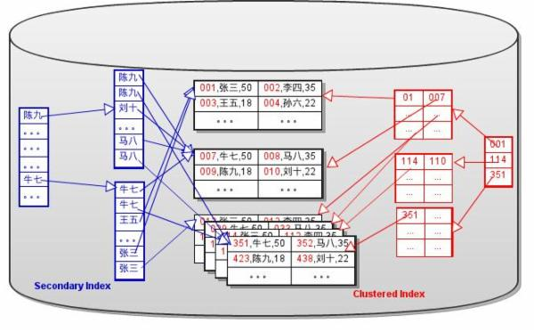
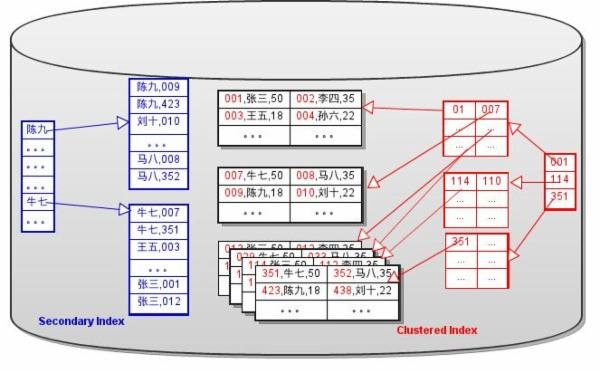
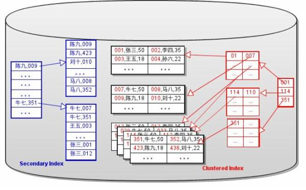
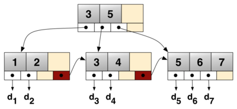
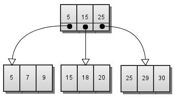
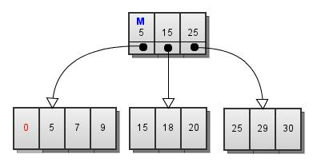
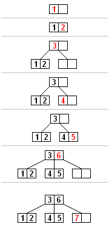

## 由浅入深理解索引的实现(2)

 时间 2011-12-20 20:08:53  Mysqlops

原文[http://www.mysqlops.com/2011/12/20/understanding_index2.html][2]

如果要看“由浅入深理解索引的实现(1)”，请点 [这里][4] 。 

教科书上的`B+Tree`是一个简化了的，方便于研究和教学的`B+Tree`。然而在数据库实现时，为了更好的性能或者降低实现的难度，都会在细节上进行一定的变化。下面以InnoDB为例，来说说这些变化。

### 04 Sparse Index中的数据指针

在“由浅入深理解索引的实现(1)”中提到，Sparse Index中的每个键值都有一个指针指向所在的数据页。这样每个`B+Tree`都有指针指向数据页。如图Fig.1所示：

Fig.1

如果数据页进行了拆分或合并操作，那么所有的`B+Tree`都需要修改相应的页指针。特别是Secondary `B+Tree`（辅助索引对应的`B+Tree`), 要对很多个不连续的页进行修改。同时也需要对这些页加锁，这会降低并发性。

为了降低难度和增加更新(分裂和合并`B+Tree`节点)的性能，InnoDB 将 Secondary `B+Tree`中的指针替换成了主键的键值。如图Fig.2所示：

Fig.2

这样就去除了Secondary `B+Tree`对数据页的依赖，而数据就变成了Clustered `B+Tree`(簇索引对应的`B+Tree`)独占的了。对数据页的拆分及合并操作，仅影响`Clustered B+Tree`. 因此InnoDB的数据文件中存储的实际上就是多个孤立`B+Tree`。

一个有趣的问题，当用户显式的把主键定义到了二级索引中时，还需要额外的主键来做二级索引的数据吗(即存储2份主键)? 很显然是不需要的。InnoDB在创建二级索引的时候，会判断主键的字段是否已经被包含在了要创建的索引中。

 接下来看一下数据操作在`B+Tree`上的基本实现。

##### 用主键查询

直接在`Clustered B+Tree`上查询。

##### 用辅助索引查询

 A. 在`Secondary B+Tree`上查询到主键。   
 B. 用主键在`Clustered B+Tree`

**可以看出，在使用主键值替换页指针后，辅助索引的查询效率降低了。**

 A. 尽量使用主键来查询数据(索引遍历操作除外).   
 B. 可以通过缓存来弥补性能，因此所有的键列，都应该尽量的小。

##### INSERT

 A. 在`Clustered B+Tree`上插入数据   
 B. 在所有其他`Secondary B+Tree`上插入主键。

##### DELETE
 A. 在`Clustered B+Tree`上删除数据。   
 B. 在所有其他`Secondary B+Tree`上删除主键。

##### UPDATE 非键列
 A. 在`Clustered B+Tree`上更新数据。

##### UPDATE 主键列
 A. 在`Clustered B+Tree`删除原有的记录(只是标记为DELETED,并不真正删除)。   
 B. 在`Clustered B+Tree`插入新的记录。   
 C. 在每一个`Secondary B+Tree`上删除原有的数据。 (有疑问，看下一节。)   
 D. 在每一个`Secondary B+Tree`上插入原有的数据。

##### UPDATE 辅助索引的键值

 A. 在`Clustered B+Tree`上更新数据。   
 B. 在每一个`Secondary B+Tree`上删除原有的主键。   
 C. 在每一个`Secondary B+Tree`上插入原有的主键。

**更新键列时，需要更新多个页，效率比较低。**

 A. 尽量不用对主键列进行UPDATE操作。   
 B. 更新很多时，尽量少建索引。

### 05 – 非唯一键索引

教科书上的B+Tree操作，通常都假设”键值是唯一的“。但是在实际的应用中 `Secondary Index`是允许键值重复的。在极端的情况下，所有的键值都一样，该如何来处理呢？InnoDB 的 `Secondary B+Tree`中，主键也是此键的一部分。`Secondary Key = 用户定义的KEY + 主键`。如图Fig.3所示：

Fig.3

注意主键不仅做为数据出现在叶子节点，同时也作为键的一部分出现非叶子节点。对于非唯一键来说，因为主键是唯一的，`Secondary Key`也是唯一的。当然，在插入数据时，还是会根据用户定义的Key，来判断唯一性。按理说，如果辅助索引是唯一的(并且所有字段不能为空)，就不需要这样做。可是，InnoDB对所有的`Secondary B+Tree`都这样创建。

**还没弄明白有什么特殊的用途？**  **有知道的朋友可以帮忙解答一下。**也许是为了降低代码的复杂性，这是我想到的唯一理由。

### 06 – `<Key, Pointer>`对

标准的  B+Tree的每个节点有K个键值和K+1个指针，指向K+1个子节点。如图Fig.4：

Fig.4(图片来自于WikiPedia)

而在“由浅入深理解索引的实现(1)”中 [Fig.9][5]的B+Tree上，每个节点有K个键值和K个指针。InnoDB的B+Tree也是如此。如图Fig.5所示：

Fig.5

这样做的好处在于，键值和指针一一对应。我们可以将一个`<Key,Pointer>`对看作一条记录。这样就可以用数据块的存储格式来存储索引块。因为不需要为索引块定义单独的存储格式，就降低了实现的难度。

##### 插入最小值

当考虑在变形后的B+Tree上进行INSERT操作时,发现了一个有趣的问题。如果插入的数据的健值比B+Tree的最小键值小时，就无法定位到一个适当的数据块上去 (`<Key,Pointer>`中的Key代表了子节点上的键值是>=Key的)。例如，在Fig.5的B+Tree中插入键值为0的数据时，无法定位到任何节点。

在标准的B+Tree上，这样的键值会被定位到最左侧的节点上去。这个做法，对于Fig.5中的B+Tree也是合理的。Innodb的做法是，将每一层（叶子层除外）的最左侧节点 的第一条记录标记为最小记录(MIN_REC).在进行定位操作时，任何键值都比标记为MIN_REC的键值大。因此0会被插入到最左侧的记录节点上。如Fig.6所示：

Fig.6

### 07 – 顺序插入数据

 Fig.7是B-Tree的插入和分裂过程，我们看看有没有什么问题？

Fig.7(图片来自于WikiPedia)

标准的B-Tree分裂时，将一半的键值和数据移动到新的节点上去。原有节点和新节点都保留一半的空间，用于以后的插入操作。当按照键值的顺序插入数据时，左侧的节点不可能再有新的数据插入。因此，会浪费约一半的存储空间。

解决这个问题的基本思路是：分裂顺序插入的B-Tree时，将原有的数据都保留在原有的节点上。创建一个新的节点，用来存储新的数据。顺序插入时的分裂过程如Fig.8所示：

 Fig.8

以上是以B-Tree为例，B+Tree的分裂过程类似。InnoDB的实现以这个思路为基础，不过要复杂 一些。因为顺序插入是有方向性的，可能是从小到大，也可能是从大到小的插入数据。所以要区分不同的情况。如果要了解细节，可参考以下函数的代码。   

 btr_page_split_and_insert();   
 btr_page_get_split_rec_to_right();   
 btr_page_get_split_rec_to_right();

**InnoDB的代码太复杂了，有时候也不敢肯定自己的理解是对的。因此写了一个小脚本，来打印InnoDB数**

**据文件中B+Tree。这样可以直观的来观察B+Tree的结构，验证自己的理解是否正确。**

[ibd-analyzer.tar][6]

[2]: http://www.mysqlops.com/2011/12/20/understanding_index2.html
[4]: http://www.mysqlops.com/2011/11/24/understanding_index.html
[5]: http://www.mysqlops.com/wp-content/uploads/2011/11/Fig.9-11.jpg
[6]: http://www.mysqlops.com/wp-content/uploads/2011/12/ibd-analyzer.tar.gz