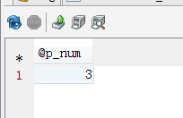
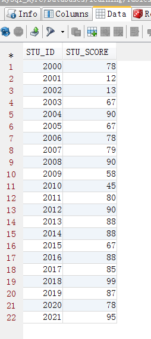
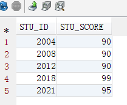
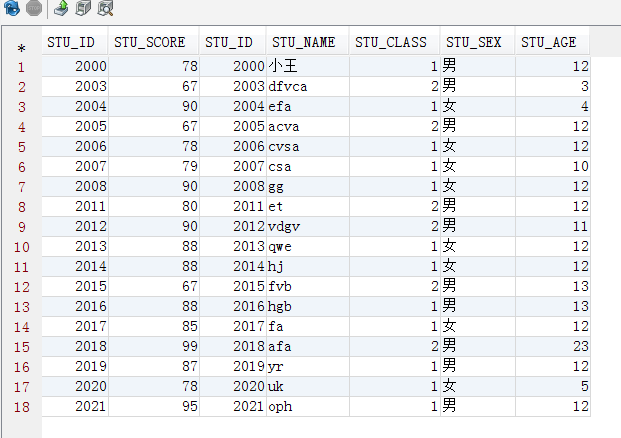
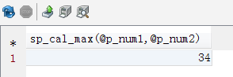

存储过程和函数是在数据库中定义一些SQL语句的集合，然后直接调用这些存储过程和函数来执行已经定义好的SQL语句。存储过程和函数可以避免开发人员重复的编写相同的SQL语句。而且，存储过程和函数是在MySQL服务器中存储和执行的，可以减少客户端和服务器端的数据传输。  
**一、存储过程****1.1、基本语法**

CREATE PROCEDURE sp_name ([proc_parameter[,…]])   
  
[characteristic …] routine_body 

Sp_name:存储过程的名称，默认在当前数据库中创建。这个名称应当尽量避免与MySQL的内置函数相同的名称

Proc_parameter:存储过程的参数列表  
格式[IN|OUT|INOUT]param_name type  
Param_name为参数名，type为参数的数据类型。多个参数彼此间用逗号分隔。输入参数、输出参数和输入/输出参数，分别用in/out/inout标识。参数的取名不要与数 据表的列名相同。  

Characteristic:存储过程的某些特征设定，分别介绍  

1 COMMENT‘string‘:用于对存储过程的描述，其中string为描述内容,comment为关键字。  

2 LANGUAGE SQL:指明编写这个存储过程的语言为SQL语言。这个选项可以不指定。  

3 DETERMINISTIC:表示存储过程对同样的输入参数产生相同的结果;NOT DETERMINISTIC，则表示会产生不确定的结果（默认）。  

4 contains sql | no sql | reads sql data | modifies sql data Contains sql表示存储过程包含读或写数据的语句（默认）  
No sql表示不包含sql语句  
Reads sql data表示存储过程只包含读数据的语句  
Modifies sql data 表示存储过程只包含写数据的语句  

5 sql security:这个特征用来指定存储过程使用创建该存储过程的用户(definer)的许可来执行，还是使用调用者(invoker)的许可来执行。默认是definer  
Routine_body:存储过程的主体部分，包含了在过程调用的时候必须执行的sql语句。以begin开始，以end结束。如果存储过程体中只有一条sql语句,可以省略begin-end标志。  

**1.2、数据准备**

```sql
CREATE TABLE
 t_user
 (
  USER_ID INT NOT NULL AUTO_INCREMENT,
  USER_NAME CHAR(30) NOT NULL,
  USER_PASSWORD CHAR(10) NOT NULL,
  USER_EMAIL CHAR(30) NOT NULL,
  PRIMARY KEY (USER_ID),
  INDEX IDX_NAME (USER_NAME)
 )
 ENGINE=InnoDB DEFAULT CHARSET=utf8;
```

然后这是插入的一些数据：

![MySql存储过程、函数][0]

**1.3 IN、OUT、INOUT参数**  
**（1）、带IN的存储过程**
```sql
//创建储存过程.cmd 中运行
CREATE PROCEDURE SP_SEARCH(IN p_name CHAR(20))
BEGIN
IF p_name is null or p_name=‘‘ THEN
SELECT * FROM t_user;
ELSE
SELECT * FROM t_user WHERE USER_NAME LIKE p_name;
END IF;
END
```

因为;分会冲突，所以要加delimiter //。将//设置为结束运行符号

如下：

![MySql存储过程、函数][1]

调用：
```sql
//调用并输出结果
CALL SP_SEARCH(‘林炳文‘)
```

结果

![MySql存储过程、函数][2]

**（2）、带OUT的存储过程**

```sql
//带OUT返回的
CREATE PROCEDURE SP_SEARCH2(IN p_name CHAR(20),OUT p_int INT)
BEGIN
IF p_name is null or p_name=‘‘ THEN
SELECT * FROM t_user;
ELSE
SELECT * FROM t_user WHERE USER_NAME LIKE p_name;
END IF;
SELECT FOUND_ROWS() INTO p_int;
END
```

调用输出：统计带林开头的人数

```sql
//调用并输出结果
CALL SP_SEARCH2(‘林%‘,@p_num);
SELECT @p_num;
```



**（3）、带INOUT的存储过程**

```sql
//带INOUT的存储过程
CREATE PROCEDURE sp_inout(INOUT p_num INT)
BEGIN
SET p_num=p_num*10;
END
//调用并输出结果
SET @p_num=2;
call sp_inout(@p_num);
SELECT @p_num;
```

输出结果：

![MySql存储过程、函数][3]

**1.4、存储过程体**  
存储过程体中可以使用各种sql语句和过程式语句的组合，来封装数据库应用中复杂的业务逻辑和处理规则，以实现数据库应用的灵活编程。下面主要介绍几个用于构造存储过程体的常用语法元素。  
**1、局部变量**  
在存储过程体中可以声明局部变量，用来存储存储过程体中临时结果。

```sql
DECLARE var_name[,…] type [DEFAULT value]
Var_name:指定局部变量的名称
Type:用于声明局部变量的数据类型
default子句:用于为局部变量指定一个默认值。若没有指定，默认为null.
```

如：
```
Declare cid int(10);
```

**使用说明：**  
局部变量只能在存储过程体的begin…end语句块中声明。  
局部变量必须在存储过程体的开头处声明。  
局部变量的作用范围仅限于声明它的begin..end语句块，其他语句块中的语句不可以使用它。  
局部变量不同于用户变量，两者区别：局部变量声明时，在其前面没有使用@符号，并且它只能在begin..end语句块中使用；而用户变量在声明时，会在其名称前面使用@符号，同时已声明的用户变量存在于整个会话之中。  
**2、set语句**  
使用set语句为局部变量赋值

Set var_name=expr   
Set cid=910; 

**3、select … into 语句**  
把选定列的值直接存储到局部变量中，语法格式
```sql
Select col_name[,…] into var_name[,…] table_expr
Col_name:用于指定列名
Var_name:用于指定要赋值的变量名
Table_expr:表示select语句中的from字句及后面的语法部分
```
说明:存储过程体中的select…into语句返回的结果集只能有一行数据。  
**4、定义处理程序**是事先定义程序执行过程中可能遇到的问题。并且可以在处理程序中定义解决这些问题的办法。这种方式可以提前预测可能出现的问题，并提出解决方法。
```sql
DECLARE handler_type HANDLER FOR condition_value[,…] sp_statement
handler_type:CONTINUE | EXIT | UNDO
Condition_value:Sqlwarning | not found | sqlexception
```

**5、流程控制语句**（1）条件判断语句  
**If语句**
```sql
If search_condition then statement_list
[elseif search_condition then statement_list]…
[else statement_list]
End if
```


Search_condition参数:条件判断语句  
Statement_list参数:不同条件的执行语句  
多重IF的存储过程实例  
数据准备

学生表：
```sql
CREATE TABLE
 t_student
 (
  STU_ID INT NOT NULL,
  STU_NAME CHAR(10) NOT NULL,
  STU_CLASS INT NOT NULL,
  STU_SEX CHAR(2) NOT NULL,
  STU_AGE INT NOT NULL,
  PRIMARY KEY (STU_ID)
 )
 ENGINE=InnoDB DEFAULT CHARSET=utf8;
```


数据如下：

![MySql存储过程、函数][4]

成绩表（STU_ID是学生表是外键关系）：
```sql
CREATE TABLE
 t_grade
 (
  STU_ID INT NOT NULL,
  STU_SCORE INT NOT NULL,
  FOREIGN KEY (STU_ID) REFERENCES t_student (STU_ID),
  INDEX STU_ID (STU_ID)
 )
 ENGINE=InnoDB DEFAULT CHARSET=utf8;
```




然后写一个存储过程：返回各个分数等级的人
```sql
//带多重IF的存储过程
CREATE PROCEDURE SP_SCHOLARSHIP_LEVEL(IN p_level char(1))
BEGIN
IF p_level =‘A‘ THEN
SELECT * FROM t_grade WHERE STU_SCORE >=90;
ELSEIF p_level =‘B‘ THEN
SELECT * FROM t_grade WHERE STU_SCORE <90 AND STU_SCORE>=80;
ELSEIF p_level =‘C‘ THEN
SELECT * FROM t_grade WHERE STU_SCORE <80 AND STU_SCORE>=70;
ELSEIF p_level =‘D‘ THEN
SELECT * FROM t_grade WHERE STU_SCORE <60;
ELSE
SELECT * FROM t_grade;
END IF;
END
```
调用过程：
```sql
//调用并输出结果
CALL SP_SCHOLARSHIP_LEVEL(‘A‘);
```



**Case 语句**  
**表达形式1**
```sql
Case case_value
When when_value then statement_list
[When when_value then statement_list]…
[else statement_list]
End case
```

**表达形式2**
```sql
Case
When search_condition then statement_list
End case
```

**使用范例**
```sql
CREATE PROCEDURE SP_SCHOLARSHIP_LEVEL3(IN p_level char(1))
BEGIN
DECLARE p_num int DEFAULT 0;
CASE p_level
WHEN ‘A‘ THEN
SET p_num=90;
WHEN ‘B‘ THEN
SET p_num=80;
WHEN ‘C‘ THEN
SET p_num=70;
WHEN ‘D‘ THEN
SET p_num=60;
ELSE
SET p_num=0;
END CASE;
SELECT * FROM t_grade g, t_student s WHERE g.STU_ID=s.STU_ID AND g.STU_SCORE >= p_num ;
END
```

**调用：**
```sql
//调用并输出结果
CALL SP_SCHOLARSHIP_LEVEL3(‘d‘);
```



**(2)循环语句**While语句、repeat语句和loop语句。  
**While语句**
```sql
[begin_label:]
while search_condition do
Statement_list
End while
[end_label]
```

判断条件search_condition是否为真,若为真,则执行statement_list中的语句，然后再进行判断，如若仍然为真则继续循环，直至条件判断不为真时循环结束。  
**使用范例**
```sql
//带while的存储过程
CREATE PROCEDURE sp_cal(IN p_num INT,OUT p_result INT)
BEGIN
 SET p_result=1;
 WHILE p_num > 1 DO
 SET p_result = p_num * p_result;
 SET p_num = p_num-1;
 END WHILE;
END
//调用并输出结果
CALL sp_cal(5,@result);
SELECT @result;
```

输出结果：计算5！

![MySql存储过程、函数][5]

**Repeat语句语法格式**
```
[begin_label:]
repeat
Statement_list
Until search_condition
End repeat
[end_label]  
```


Repeat语句首先执行statement_list中的语句，然后判断条件search_condition是否为真，倘若为真，则结束循环，若不为真，继续循环。  
Repeat先执行后判断，while先判断后执行。  
**使用范例：**
```sql
//带repeat的存储过程
CREATE PROCEDURE sp_cal2(IN p_num INT,OUT p_result INT)
BEGIN
 SET p_result=1;
 REPEAT
  SET p_result = p_num * p_result;
  SET p_num = p_num-1;
  UNTIL p_num<=1
 END REPEAT;
END
//调用并输出结果
CALL sp_cal2(5,@result);
SELECT @result;
```


**1.5、 调用存储过程**

```
Call sp_name([parameter[,…]]);
Sp_name被调用存储过程的名称
Parameter:指定调用存储过程所要使用的参数。
```

**1.6、 修改存储过程**

    Alter procedure proc_name[characteristic…] 

只能修改存储过程的特征，如果要修改存储过程的内容，可以先删除该存储过程，然后再重新创建  
**1.7、 删除存储过程**


    Drop procedure [if exists] sp_name; 

**二、函数**
**2.1、 定义**
```
MySQL中，创建存储函数的基本形式如下：
CREATE FUNCTION sp_name([func_parameter[,...]])
RETURNS type
[characteristic ...] routine_body
Return
```

子句用于声明存储函数返回值的数据类型。存储过程是用户定义的一系列sql语句的集合，涉及特定表或其它对象的任务，用户可以调用存储过程，而函数通常是数据库已定义的方法，它接收参数并返回某种类型的值并且不涉及特定用户表。  
调用存储函数
```
Select sp_name([func_parameter…])
Select fn_search(2);
```
删除存储函数drop  
修改存储函数alter 修改存储函数的某些相关特征。

**2.2、函数使用例子**  
（比较大小 ，返回大的数）
```sql
/**函数使用**/
CREATE FUNCTION sp_cal_max(p_num1 INT,p_num2 INT)
RETURNS INT
BEGIN
IF p_num1 >= p_num2 THEN
RETURN p_num1;
ELSE
RETURN p_num2;
END IF;
END
```
调用：
```sql
SET @p_num1=2;
SET @p_num2=34;
SELECT sp_cal_max(@p_num1,@p_num2);
```



**2.3、存储过程和函数区别**  
1）一般来说，存储过程实现的功能要复杂一点，而函数的实现的功能针对性比较强。存储过程，功能强大，可以执行包括修改表等一系列数据库操作；用户定义函数不能用于执行一组修改全局数据库状态的操作。

2）对于存储过程来说可以返回参数，如记录集，而函数只能返回值或者表对象。函数只能返回一个变量；而存储过程可以返回多个。存储过程的参数可以有IN,OUT,INOUT三种类型，而函数只能有IN类~~存储过程声明时不需要返回类型，而函数声明时需要描述返回类型，且函数体中必须包含一个有效的RETURN语句。

3）存储过程，可以使用非确定函数，不允许在用户定义函数主体中内置非确定函数。

4）存储过程一般是作为一个独立的部分来执行（ EXECUTE 语句执行），而函数可以作为查询语句的一个部分来调用（SELECT调用），由于函数可以返回一个表对象，因此它可以在查询语句中位于FROM关键字的后面。 SQL语句中不可用存储过程，而可以使用函数。  
**三、光标（游标）**  
**3.1 定义** 查询语句可能查询出多条记录，在存储过程和函数中使用光标标来逐条读取查询结果集中的记录。光标的使用包括声明光标、打开光标、使用光标和关闭光标。光标必须声明光标、打开光标、使用光标和关闭光标。光标必须声明在处理程序之前，并且声明在变量和条件之后。  
**1 声明光标**
```
Declare cursor_name cursor forselect_statement;
Cursor_name:光标名称
Select_statement:select语句的内容
Declare cur_employee cursor forselect name,age from employee;
```
**2 打开光标**
```
Open cursor_name
Open cur_employee;
```

**3 使用光标**  
Mysql中使用fetch关键字来使用光标，语法形式
```
Fetch cur_name intovar_name[,var_name…];
Cur_name表示光标的名称
Var_name表示将光标中的select语句查询出来的信息存入该参数。Var_name必须在声明光标前就定义好。
Fetch cur_employee intoemp_name,emp_age;
```
**4 关闭光标**
```
Close cursor_name;
Close cur_employee;
```
每个光标不再需要时都应该被关闭，使用close语句将会释放光标所使用的全部资源。在一个光标被关闭后，如果没有重新被打开，则不能被使用。对于声明过的光标，则不需要再次声明，可直接使用open语句打开。  
**3.2、使用范例**
（将表test_cur1数据复制到test_cur2）
```sql
CREATE TABLE `test_cur1` (
 `id` int(11) NOT NULL auto_increment,
 `type` char(11) default NULL,
 `order1` char(11) default NULL,
 PRIMARY KEY (`id`)
)
INSERT INTO `test_cur1` VALUES (1, ‘145‘, ‘d1‘);
INSERT INTO `test_cur1` VALUES (2, ‘134‘, ‘1d‘);
INSERT INTO `test_cur1` VALUES (3, ‘123‘, ‘1ad‘);
INSERT INTO `test_cur1` VALUES (4, ‘121‘, ‘1as‘);
  
CREATE TABLE `test_cur2` (
 `id` int(11) NOT NULL auto_increment,
 `type` char(11) default NULL,
 `order1` char(11) default NULL,
 PRIMARY KEY (`id`)
)
```

然后写光标了：
```sql
create procedure get_cur ()
BEGIN
 DECLARE done INT DEFAULT 0;
 DECLARE ID int(11);
 DECLARE type char(11);
 DECLARE order1 char(11);
 DECLARE mycur CURSOR FOR SELECT * FROM test_cur1;//定义光标
 DECLARE CONTINUE HANDLER FOR SQLSTATE ‘02000‘ SET done = 1;
 //打开光标
 OPEN mycur;
 //开始循环
 REPEAT
 FETCH mycur INTO ID,type,order1;//取出光标的内容到临时变量
 IF NOT done THEN
  INSERT INTO test_cur2 VALUES (ID,type,order1);//插入到另一张表
 END IF;
 UNTIL done END REPEAT;//当done=1时结束循环
 //关闭光标
 CLOSE mycur;
END
```
运行：
```sql
call get_cur()
```
来看看两张表的数据：这是表2

![MySql存储过程、函数][6]

这是表1

![MySql存储过程、函数][7]

说明数据已成功复制过去了。

[0]:./img/20158692226845.png
[1]:./img/20158692526841.png
[2]:./img/20158692604827.png
[3]:./img/20158692732466.png
[4]:./img/20158693156503.png
[5]:./img/20158694304608.png
[6]:./img/20158695339293.png
[7]:./img/20158695412977.png