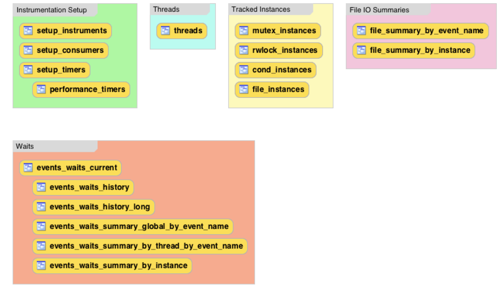
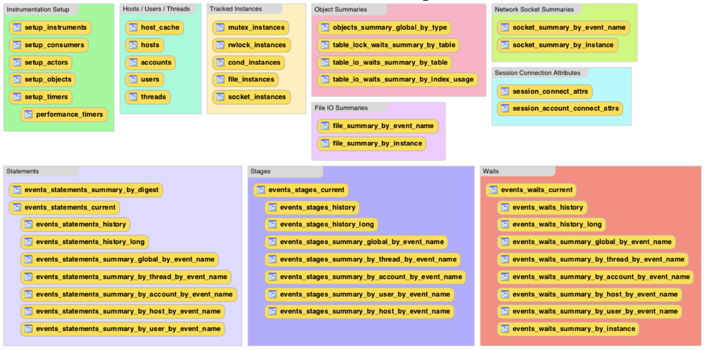
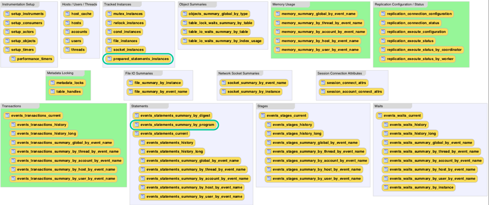
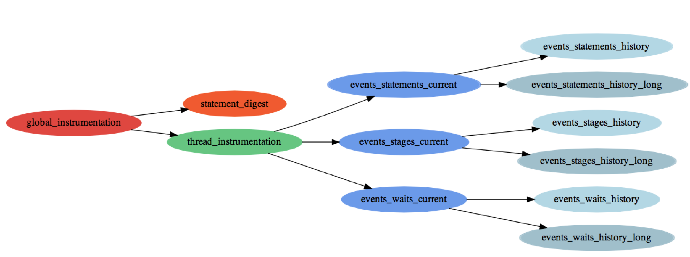
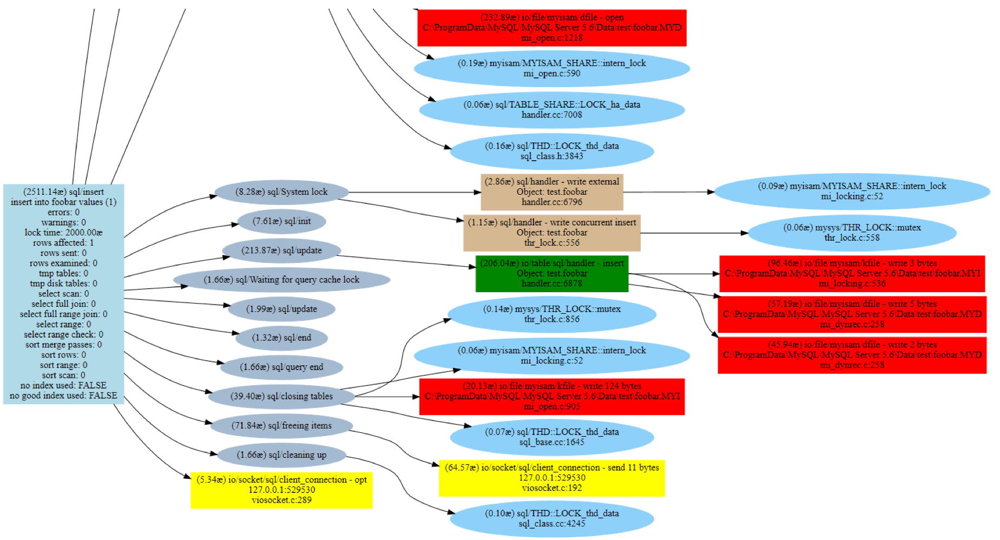

# Mysql5.6 Performance_schema 深入浅出

目录结构

22.1 performance Schema 快速入门  
22.2 Performance Schema 配置  
22.2.1 mysql编译的时候 修改Performance Schema配置  
22.2.2 mysql启动的时候 修改Performance Schema配置  
22.2.3 mysql运行过程中 修改Performance Schema配置  
22.3 Performance Schema 查询  
22.4 Performance Schema Instrument Naming Conventions  
22.5 Performance Schema Status 监控  
22.6 Performance Schema 原子性，分子性 事件  
22.7 Performance Schema Statement 诊断  
22.8 Performance Schema 基本表特征  
22.9 Performance Schema 表的描述  
22.9.1 Performance Schema 表的索引  
22.9.2 Performance Schema Setup 类型的表  
22.9.3 Performance Schema Instance 类型的表  
22.9.4 Performance Schema Wait Event 类型的表  
22.9.5 Performance Schema Stage Event 类型的表  
22.9.6 Performance Schema Statement Event 类型的表  
22.9.7 Performance Schema Connection 类型的表  
22.9.8 Performance Schema Connection Attribute 类型的表  
22.9.9 Performance Schema Summary 类型的表  
22.9.10 Performance Schema 其他类型的表  
22.10 Performance Schema 变量与选项  
22.11 Performance Schema 命令选项  
22.12 Performance Schema 系统变量  
22.13 Performance Schema status变量  
22.14 Performance Schema 与插件  
22.15 使用Performance Schema 来诊断问题  
  
22.15.1 使用Performance Schema来替代profiling  
心得： performance_schema的使用  

架构图

Mysql 5.5 Performance schema  



Mysql 5.6 Performance schema  



Mysql 5.7 Performance schema  



consumer 层次图



Statement 诊断



22.1 performance Schema 快速入门

这一节简单的讲解如何使用performance schema，并附上例子。如： Section 22.15, “Using the Performance Schema to Diagnose Problems”

如果要让mysql可用，必须在mysql编译的时候built进来。通过检查服务器的帮助信息，你也可以确认一下perf 是否可用。如果可用，会有一些提示如：

```sql
shell> mysqld --verbose --help
...
  --performance_schema
                      Enable the performance schema.
  --performance_schema_events_waits_history_long_size=#
                     Number of rows in events_waits_history_long.
...
```
如果以上变量没有出现在你的output上，那么说明你的mysql不支持performance schema。
请关注 Section 22.2, “Performance Schema Configuration”.

如果你performance schema被支持，那么在mysql5.6.6开始就已经默认打开的。
如果要显示打开关闭PS，那么就在mysql启动的时候加上performance_schema变量，
并且给予适当的值。比如：在你的my.cnf文件中

```sql
[mysqld]
performance_schema=ON
```
一旦这样配置后，当mysql启动时，就会自动初始化performance schema。为了验证初始化是否成功，
可以使用这样的语句：

```sql
mysql> SHOW VARIABLES LIKE 'performance_schema';
+--------------------+-------+
| Variable_name      | Value |
+--------------------+-------+
| performance_schema | ON    |
+--------------------+-------+
```
ON表示成功，OFF表示有错误，请查看相关error log 定位错误。

performance schema 是以存储引擎的方式实现的，你可以通过INFORMATION_SCHEMA.ENGINES 或者
show engines来确认：

```sql
mysql> SELECT * FROM INFORMATION_SCHEMA.ENGINES
    -> WHERE ENGINE='PERFORMANCE_SCHEMA'\G
*************************** 1. row ***************************
      ENGINE: PERFORMANCE_SCHEMA
     SUPPORT: YES
     COMMENT: Performance Schema
TRANSACTIONS: NO
          XA: NO
  SAVEPOINTS: NO
mysql> SHOW ENGINES\G
...
      Engine: PERFORMANCE_SCHEMA
     Support: YES
     Comment: Performance Schema
Transactions: NO
          XA: NO
  Savepoints: NO
...
```
你可以像使用正常database一样使用performance schema。
比如：use performance_schema, 以及show语法。

performance_schema数据库名必须是小写。可以使用show create table 查看表：

```sql
mysql> SHOW CREATE TABLE setup_timers\G
*************************** 1. row ***************************
       Table: setup_timers
Create Table: CREATE TABLE `setup_timers` (
  `NAME` varchar(64) NOT NULL,
  `TIMER_NAME` enum('CYCLE','NANOSECOND','MICROSECOND','MILLISECOND','TICK')
   NOT NULL
) ENGINE=PERFORMANCE_SCHEMA DEFAULT CHARSET=utf8
```
也可以查询 INFORMATION_SCHEMA.COLUMNS来查看列。

performance_schema里面的表可以根据名字分类为：

Current events
event histories
summaries
object instances
setup (configuration)
下面有些例子来简单的使用这些表，详细的使用请看：Section 22.9, “Performance Schema Table Descriptions”.

一开始，不是所有的instrument 和 consumer 都会被enable ， 所以一开始他们不会收集所有的事件。
为了让他们都enable 或者 enable event timing。 执行以下两条语句

```sql
mysql> UPDATE setup_instruments SET ENABLED = 'YES', TIMED = 'YES';
Query OK, 338 rows affected (0.12 sec)
mysql> UPDATE setup_consumers SET ENABLED = 'YES';
Query OK, 8 rows affected (0.00 sec)
```
如果想查看某个时刻的等待事件，可以查询 events_waits_current表。它记录了每个thread最近的监控信息。

```sql
mysql> SELECT * FROM events_waits_current\G
*************************** 1. row ***************************
            THREAD_ID: 0
             EVENT_ID: 5523
           EVENT_NAME: wait/synch/mutex/mysys/THR_LOCK::mutex
               SOURCE: thr_lock.c:525
          TIMER_START: 201660494489586
            TIMER_END: 201660494576112
           TIMER_WAIT: 86526
                SPINS: NULL
        OBJECT_SCHEMA: NULL
          OBJECT_NAME: NULL
          OBJECT_TYPE: NULL
OBJECT_INSTANCE_BEGIN: 142270668
     NESTING_EVENT_ID: NULL
            OPERATION: lock
      NUMBER_OF_BYTES: NULL
                FLAGS: 0
...
```
这个事件说明 thread 0 在等待86526皮秒 来获得一个锁THR_LOCK::mutex，而这个锁是mysys子系统中。
以下是列的一些描述

id： thread id
event name：别监控的instrument名字
timer 类型的列： 时间，以皮秒为基准单位
history 表包含了一些列相同事件的历史记录，就如同current-events 一样，不同的是，
有更多的记录来说明服务器最近做了什么，而不是当前做了什么。events_waits_history & events_waits_history_long 记录了每个thread最近10条和10000条event。

```sql
mysql> SELECT EVENT_ID, EVENT_NAME, TIMER_WAIT
    -> FROM events_waits_history WHERE THREAD_ID = 13
    -> ORDER BY EVENT_ID;
+----------+-----------------------------------------+------------+
| EVENT_ID | EVENT_NAME                              | TIMER_WAIT |
+----------+-----------------------------------------+------------+
|       86 | wait/synch/mutex/mysys/THR_LOCK::mutex  |     686322 |
|       87 | wait/synch/mutex/mysys/THR_LOCK_malloc  |     320535 |
|       88 | wait/synch/mutex/mysys/THR_LOCK_malloc  |     339390 |
|       89 | wait/synch/mutex/mysys/THR_LOCK_malloc  |     377100 |
|       90 | wait/synch/mutex/sql/LOCK_plugin        |     614673 |
|       91 | wait/synch/mutex/sql/LOCK_open          |     659925 |
|       92 | wait/synch/mutex/sql/THD::LOCK_thd_data |     494001 |
|       93 | wait/synch/mutex/mysys/THR_LOCK_malloc  |     222489 |
|       94 | wait/synch/mutex/mysys/THR_LOCK_malloc  |     214947 |
|       95 | wait/synch/mutex/mysys/LOCK_alarm       |     312993 |
+----------+-----------------------------------------+------------+
```
如果这个表满了，那么新的event会被加进来，踢掉最老的那个。

summary 表提供了整个时间段的一些统计信息。他们统计事件的处理方式和之前都不一样。
如果想知道某个instrument 被执行的最频繁，或者发生的频率非常高，可以通过排序 events_waits_summary_global_by_event_name表，根据 COUNT_STAR 或者 SUM_TIMER_WAIT列。

```sql
mysql> SELECT EVENT_NAME, COUNT_STAR
    -> FROM events_waits_summary_global_by_event_name
    -> ORDER BY COUNT_STAR DESC LIMIT 10;
+---------------------------------------------------+------------+
| EVENT_NAME                                        | COUNT_STAR |
+---------------------------------------------------+------------+
| wait/synch/mutex/mysys/THR_LOCK_malloc            |       6419 |
| wait/io/file/sql/FRM                              |        452 |
| wait/synch/mutex/sql/LOCK_plugin                  |        337 |
| wait/synch/mutex/mysys/THR_LOCK_open              |        187 |
| wait/synch/mutex/mysys/LOCK_alarm                 |        147 |
| wait/synch/mutex/sql/THD::LOCK_thd_data           |        115 |
| wait/io/file/myisam/kfile                         |        102 |
| wait/synch/mutex/sql/LOCK_global_system_variables |         89 |
| wait/synch/mutex/mysys/THR_LOCK::mutex            |         89 |
| wait/synch/mutex/sql/LOCK_open                    |         88 |
+---------------------------------------------------+------------+
mysql> SELECT EVENT_NAME, SUM_TIMER_WAIT
    -> FROM events_waits_summary_global_by_event_name
    -> ORDER BY SUM_TIMER_WAIT DESC LIMIT 10;
+----------------------------------------+----------------+
| EVENT_NAME                             | SUM_TIMER_WAIT |
+----------------------------------------+----------------+
| wait/io/file/sql/MYSQL_LOG             |     1599816582 |
| wait/synch/mutex/mysys/THR_LOCK_malloc |     1530083250 |
| wait/io/file/sql/binlog_index          |     1385291934 |
| wait/io/file/sql/FRM                   |     1292823243 |
| wait/io/file/myisam/kfile              |      411193611 |
| wait/io/file/myisam/dfile              |      322401645 |
| wait/synch/mutex/mysys/LOCK_alarm      |      145126935 |
| wait/io/file/sql/casetest              |      104324715 |
| wait/synch/mutex/sql/LOCK_plugin       |       86027823 |
| wait/io/file/sql/pid                   |       72591750 |
+----------------------------------------+----------------+
```
以上说明THR_LOCK_malloc 非常hot。

instance 表记录了什么类型的object被instrumented。一个被instrumented的object，当被server使用时就会产生一个event。这些表提供了event名以及简单的阐述。
比如：file_instances 就列出了file IO相关的instance of instrument。

```sql
xxx:performance_schema> show tables like '%_instances'
    -> ;
+--------------------------------------------+
| Tables_in_performance_schema (%_instances) |
+--------------------------------------------+
| cond_instances                             |
| file_instances                             |
| mutex_instances                            |
| rwlock_instances                           |
| socket_instances                           |
+--------------------------------------------+
5 rows in set (0.00 sec)
```
```sql
mysql> SELECT * FROM file_instances\G
*************************** 1. row ***************************
 FILE_NAME: /opt/mysql-log/60500/binlog.000007
EVENT_NAME: wait/io/file/sql/binlog
OPEN_COUNT: 0
*************************** 2. row ***************************
 FILE_NAME: /opt/mysql/60500/data/mysql/tables_priv.MYI
EVENT_NAME: wait/io/file/myisam/kfile
OPEN_COUNT: 1
*************************** 3. row ***************************
 FILE_NAME: /opt/mysql/60500/data/mysql/columns_priv.MYI
EVENT_NAME: wait/io/file/myisam/kfile
OPEN_COUNT: 1
...
```
setup表用来配置和显示监控信息的。 例如：什么样的timer 被使用，
请查询setup_timers

```sql
mysql> SELECT * FROM setup_timers;
+-----------+-------------+
| NAME      | TIMER_NAME  |
+-----------+-------------+
| idle      | MICROSECOND |
| wait      | CYCLE       |
| stage     | NANOSECOND  |
| statement | NANOSECOND  |
+-----------+-------------+
```
setup_instruments 列出了哪些event会被收集与监控：

```sql
mysql> SELECT * FROM setup_instruments;
+------------------------------------------------------------+---------+-------+
| NAME                                                       | ENABLED | TIMED |
+------------------------------------------------------------+---------+-------+
...
| wait/synch/mutex/sql/LOCK_global_read_lock                 | YES     | YES   |
| wait/synch/mutex/sql/LOCK_global_system_variables          | YES     | YES   |
| wait/synch/mutex/sql/LOCK_lock_db                          | YES     | YES   |
| wait/synch/mutex/sql/LOCK_manager                          | YES     | YES   |
...
| wait/synch/rwlock/sql/LOCK_grant                           | YES     | YES   |
| wait/synch/rwlock/sql/LOGGER::LOCK_logger                  | YES     | YES   |
| wait/synch/rwlock/sql/LOCK_sys_init_connect                | YES     | YES   |
| wait/synch/rwlock/sql/LOCK_sys_init_slave                  | YES     | YES   |
...
| wait/io/file/sql/binlog                                    | YES     | YES   |
| wait/io/file/sql/binlog_index                              | YES     | YES   |
| wait/io/file/sql/casetest                                  | YES     | YES   |
| wait/io/file/sql/dbopt                                     | YES     | YES   |
...
```
相应了解如何翻译这些instrument 的名字，请看：Section 22.4, “Performance Schema Instrument Naming Conventions”.

为了控制哪些event是不是instrument，可以给enabled设置yes or no。

```sql
mysql> UPDATE setup_instruments SET ENABLED = 'NO'
    -> WHERE NAME = 'wait/synch/mutex/sql/LOCK_mysql_create_db';
```
performance schema 使用收集的events 来更新performance_schema 数据库的那些表，这些表扮演着事件信息消费者的角色。setup_consumers 列出了可用的消费者 以及哪些是enabled。

```sql
mysql> SELECT * FROM setup_consumers;
+--------------------------------+---------+
| NAME                           | ENABLED |
+--------------------------------+---------+
| events_stages_current          | NO      |
| events_stages_history          | NO      |
| events_stages_history_long     | NO      |
| events_statements_current      | YES     |
| events_statements_history      | NO      |
| events_statements_history_long | NO      |
| events_waits_current           | NO      |
| events_waits_history           | NO      |
| events_waits_history_long      | NO      |
| global_instrumentation         | YES     |
| thread_instrumentation         | YES     |
| statements_digest              | YES     |
+--------------------------------+---------+
```
22.2 Performance Schema 配置

22.2.1 mysql编译的时候 修改Performance Schema配置
目前，一般的binary版本都会默认支持PS，不过最后还是想官方的provider 确认一下。
如果使用的是源码包，用cmake WITH_PERFSCHEMA_STORAGE_ENGINE 使其ok


    shell> cmake . -DWITH_PERFSCHEMA_STORAGE_ENGINE=1
如何check是否支持performance schema？
第一：

```sql
shell> mysqld --verbose --help
...
  --performance_schema
                      Enable the performance schema.
  --performance_schema_events_waits_history_long_size=#
                      Number of rows in events_waits_history_long.
...
```
也可以

```sql
mysql> SHOW ENGINES\G
...
      Engine: PERFORMANCE_SCHEMA
     Support: YES
     Comment: Performance Schema
Transactions: NO
          XA: NO
  Savepoints: NO
...
```
注意：show engines 中即便包含了PERFORMANCE_SCHEMA，只能说明已经支持，不代表已经开启。
如果要开启，必须在start up阶段设置，请看下一章节。

22.2.2 mysql启动的时候 修改Performance Schema配置
假设编译的时候已经支持ps，那么mysql5.6.6 版本以及以上版本都会默认enable 。
开启，只需要在my.cnf中


    [mysqld]
    performance_schema=ON
如果server没有足够多的内存用于初始化performance schema，那么它会自己disable 掉，然后没有instrument相关信息。

mysql5.6.4版本开始，允许instrument 和 consumer在server startup阶段配置。之前的版本都
只能在runtime阶段用update配置。

在startup阶段控制instrument，可以用这种形式：


    --performance-schema-instrument='instrument_name=value'
这里面instrument_name 指的是类似wait/synch/mutex/sql/LOCK_open这种instrument，
value 就是下面其中一种：

OFF，False， or 0 关闭这个instrument
ON，TRUE，or 1 开启这个instrument
counted：开启并且统计这个instrument
—performance-schema-instrument 只能指定一个instrument名字。多个instances可以在多instrument中配置。另外：模式也是被允许的。如：


    --performance-schema-instrument='wait/synch/cond/%=COUNTED'
关闭所有instrument，使用：


    --performance-schema-instrument='%=OFF'
在startup阶段控制consumer


    --performance-schema-consumer-$consumer_name=$value
这里面$consumer_name 指的是consumer 如：events_waits_history，
$value 为：

OFF，FALSE，or 0： 不收集这个consumer相关的事件
ON，TRUE，or 1 ： 收集这个consumer相关的事件
例如：开启events_waits_history consumer，


    --performance-schema-consumer-events-waits-history=ON
合法的consumer的名字可以在setup_consumers表中找到。模式匹配是不允许的。
consumer的名字在setup_consumers中以下划线表示，但是在starup 阶段的my.cnf配置文件中，
下划线和横线都是被允许的。

performance schema的默认系统变量：

```sql
mysql> SHOW VARIABLES LIKE 'perf%';
+--------------------------------------------------------+---------+
| Variable_name                                          | Value   |
+--------------------------------------------------------+---------+
| performance_schema                                     | ON      |
| performance_schema_accounts_size                       | 100     |
| performance_schema_digests_size                        | 200     |
| performance_schema_events_stages_history_long_size     | 10000   |
| performance_schema_events_stages_history_size          | 10      |
| performance_schema_events_statements_history_long_size | 10000   |
| performance_schema_events_statements_history_size      | 10      |
| performance_schema_events_waits_history_long_size      | 10000   |
| performance_schema_events_waits_history_size           | 10      |
| performance_schema_hosts_size                          | 100     |
| performance_schema_max_cond_classes                    | 80      |
| performance_schema_max_cond_instances                  | 1000    |
...
```
performance_schema ON 和 OFF 表示是否开启和关闭。其他变量表示：表sizes（number of rows）以及内存分配

一旦开启了performance schema，mysql就会分配内存，这个内存表示最小值，可能会更大，所以
需要根据自己的情况设置一个合理的值。

如果要改变系统变量的值，目前只能在startup阶段修改。如：在my.cnf中：

```sql
[mysqld]
performance_schema
performance_schema_events_waits_history_size=20
performance_schema_events_waits_history_long_size=15000
```
mysql5.6.6 以及以上版本，如果你不显示的设置系统变量，那么mysql自己会设置默认的值。

22.2.3 mysql运行过程中 修改Performance Schema配置
setup表：如果你有update权限，可以直接更改监控行为。

```sql
mysql> SELECT TABLE_NAME FROM INFORMATION_SCHEMA.TABLES
    -> WHERE TABLE_SCHEMA = 'performance_schema'
    -> AND TABLE_NAME LIKE 'setup%';
+-------------------+
| TABLE_NAME        |
+-------------------+
| setup_actors      |
| setup_consumers   |
| setup_instruments |
| setup_objects     |
| setup_timers      |
+-------------------+
```
如果要查看哪些事件选择了哪些时间，可以查看setup_timers

```sql
mysql> SELECT * FROM setup_timers;
+-----------+-------------+
| NAME      | TIMER_NAME  |
+-----------+-------------+
| idle      | MICROSECOND |
| wait      | CYCLE       |
| stage     | NANOSECOND  |
| statement | NANOSECOND  |
+-----------+-------------+
```
setup_instruments 列出了哪些instrument事件被收集
setup_consumers 列出了某一类consumer的instrument事件实际被收集
这是一个典型的生产者-消费者模式，即便你设置了setup_instruments=xx，
但是如果setup_consumers没有设置对应的内容（即没有消费者），那么实际的instrument
也不会收集数据到performance schema的表中。

22.2.3.1 performance_schema事件计时
计时事件，主要用于提供事件到底话费了多少时间。当然，你也可以配置不开启计时功能。

以下两个表主要提供timer信息：

performance_timers: 列出了可用的timers和他们的特点
setup_timers : 描述了哪些instrument对应哪些timers
setup_timer是里面的每一条记录都必须是performance_timers里面定义好的内容。


```sql
mysql> SELECT * FROM performance_timers;
+-------------+-----------------+------------------+----------------+
| TIMER_NAME  | TIMER_FREQUENCY | TIMER_RESOLUTION | TIMER_OVERHEAD |
+-------------+-----------------+------------------+----------------+
| CYCLE       |      2389029850 |                1 |             72 |
| NANOSECOND  |            NULL |             NULL |           NULL |
| MICROSECOND |         1000000 |                1 |            585 |
| MILLISECOND |            1035 |                1 |            738 |
| TICK        |             101 |                1 |            630 |
+-------------+-----------------+------------------+----------------+
```
一般都采用picsecond皮秒 作为基准单位。

22.2.3.2 performance_schema 过滤事件
事件处理是一种典型的生产者-消费者模式

Instrument 生产事件，然后被收集。setup_instruments表列出来哪些instrument 可以被收集。
```sql
mysql> SELECT * FROM setup_instruments;
+------------------------------------------------------------+---------+-------+
| NAME                                                       | ENABLED | TIMED |
+------------------------------------------------------------+---------+-------+
...
| wait/synch/mutex/sql/LOCK_global_read_lock                 | YES     | YES   |
| wait/synch/mutex/sql/LOCK_global_system_variables          | YES     | YES   |
| wait/synch/mutex/sql/LOCK_lock_db                          | YES     | YES   |
| wait/synch/mutex/sql/LOCK_manager                          | YES     | YES   |
...
```
setup_instruments 提供了最基本的形式来控制事件的产生。其他的事件产生形式（如：基于某一个object或者thread）可以参考：Section 22.2.3.3, “Event Pre-Filtering”

Performan schema里面的那些表，就是用来事件的目的地和消费事件用的。setup_consumers表列出了很多类型的consumer
```sql
mysql> SELECT * FROM setup_consumers;
+--------------------------------+---------+
| NAME                           | ENABLED |
+--------------------------------+---------+
| events_stages_current          | NO      |
| events_stages_history          | NO      |
| events_stages_history_long     | NO      |
| events_statements_current      | YES     |
| events_statements_history      | NO      |
| events_statements_history_long | NO      |
| events_waits_current           | NO      |
| events_waits_history           | NO      |
| events_waits_history_long      | NO      |
| global_instrumentation         | YES     |
| thread_instrumentation         | YES     |
| statements_digest              | YES     |
+--------------------------------+---------+
```
对于监控事件的过滤分为不同的阶段：

Pre-filtering: 修改Performance schema的配置（开启或者关闭相应的 instrument 或者 consumer），可以让一部分事件从生产者中收集然后只影响部分consumer. pre-filtering 完成后
会所有用户产生全局影响。
```
为什么要使用pre-filtering
* 减少负载。 虽然开启所有的事件监控也只会有少许压力负载。 但是你还想竟可能的降低负载，
比如：你可以关闭一些不用的功能，如计时。
* 避免填充你不关心的current-events or history表。比如：你只开启了文件相关的instrument，那么那些非文件的记录就不会填充在current-events or history表中。那么在post-filtering 中，也不会有相关记录。
* 避免维护一些你不关心的事件表。如果你关闭了某些consumer，服务器就不会话费事件来维护consumer对于的destination表。举例：如果你不关心历史记录事件，你就可以关闭 history table consumer 来提升性能。
```
Post-filtering： 需要用到一些查询语句（where子句）来过滤。Post-filtering是基于用户的不同用户不一样。
22.2.3.3 Pre-Filtering 事件
Pre-Filtering 既可以用在 producer ， 也可以用在 consumer 中

配置pre-filtering用在 producer上，主要有这些表

setup_instruments : 如果对应的instrument关闭了，那么就不会收集对应event的信息，即便是production-related setup 表。

setup_objects : 控制了是否监控特定对象

threads ： 是否每一个thread都会被监控

setup_actors: 决定了哪些host，user，role的foreground thread被监控。

配置pre-filtering用在 consumer上，主要是setup_consumers 这张表。这决定了被收集的event会被发送的目的地。setup_consumers 也会潜在影响production。如果给定的事件没有被配置发送到任何地方（没有consumer），那么performance schema 也不会produce 它。

修改以上表，基本上都会立刻生效。但是也有一些例外：

某些setup_instruments 只在server startup阶段生效，即便你在running 阶段设置也是没有用的。
他们就是： mutexes, conditions, and rwlocks

setup_actors 只影响foreground thread，并且只会对新进来的thread有影响。已经存在的thread不受影响。

即便你修改了以上配置，performance schema不会flush 信息到history表。原来的记录还是存在current-events and history tables ，直到被新的event替换。关闭instrument，也是一样。
当然，你可以truncate table 来情况history历史表。

你也许也想使用truncate 来清空summary类型的表。遗憾的是truncate summary类型的表只会将summary列设置为0或者null，不会删除数据。 events_statements_summary_by_digest例外。

22.2.3.3.1 Pre-Filtering by Instrument

更改立刻生效，部分必须在startup阶段（mutexes, conditions, and rwlocks）

例子：
```sql
* Disable all instruments:
mysql> UPDATE setup_instruments SET ENABLED = 'NO';
Now no events will be collected.
* Disable all file instruments, adding them to the current set of disabled instruments:
mysql> UPDATE setup_instruments SET ENABLED = 'NO'
    -> WHERE NAME LIKE 'wait/io/file/%';
    
* Disable only file instruments, enable all other instruments:
mysql> UPDATE setup_instruments
    -> SET ENABLED = IF(NAME LIKE 'wait/io/file/%', 'NO', 'YES');
* Enable all but those instruments in the mysys library:
mysql> UPDATE setup_instruments
    -> SET ENABLED = CASE WHEN NAME LIKE '%/mysys/%' THEN 'YES' ELSE 'NO' END;
* Disable a specific instrument:
mysql> UPDATE setup_instruments SET ENABLED = 'NO'
    -> WHERE NAME = 'wait/synch/mutex/mysys/TMPDIR_mutex';
* To toggle the state of an instrument, “flip” its ENABLED value:
mysql> UPDATE setup_instruments
    -> SET ENABLED = IF(ENABLED = 'YES', 'NO', 'YES')
    -> WHERE NAME = 'wait/synch/mutex/mysys/TMPDIR_mutex';
* Disable timing for all events:
mysql> UPDATE setup_instruments SET TIMED = 'NO';
```
22.2.3.3.2 Pre-Filtering by Object

更改后，立刻生效。

例子1：

```sql
mysql> SELECT * FROM setup_objects;
+-------------+--------------------+-------------+---------+-------+
| OBJECT_TYPE | OBJECT_SCHEMA      | OBJECT_NAME | ENABLED | TIMED |
+-------------+--------------------+-------------+---------+-------+
| TABLE       | mysql              | %           | NO      | NO    |
| TABLE       | performance_schema | %           | NO      | NO    |
| TABLE       | information_schema | %           | NO      | NO    |
| TABLE       | %                  | %           | YES     | YES   |
+-------------+--------------------+-------------+---------+-------+
```
例子2：

```sql
+-------------+---------------+-------------+---------+-------+
| OBJECT_TYPE | OBJECT_SCHEMA | OBJECT_NAME | ENABLED | TIMED |
+-------------+---------------+-------------+---------+-------+
| TABLE       | db1           | t1          | YES     | YES   |
| TABLE       | db1           | t2          | NO      | NO    |
| TABLE       | db2           | %           | YES     | YES   |
| TABLE       | db3           | %           | NO      | NO    |
| TABLE       | %             | %           | YES     | YES   |
+-------------+---------------+-------------+---------+-------+
```
22.2.3.3.3 Pre-Filtering by Thread

略。。。

22.2.3.3.4 Pre-Filtering by Consumer

配置修改，立刻生效

关于setup_consumer 的几个基本原则：

和consumer相关的destination 不会接收任何event，除非对于的consumer都开启了

consumer只有等待他所依赖的consumer都enable，才会被check。

如果一个consumer没有被checked通过，或者check了，但是被disable了，那么依赖它的那些consumer不会被check.

如果一个event没有对应的destination（没有对应的consumer），那么会被自动disable.

以下列出consumer的等级关系图：

```sql
global_instrumentation                           --1 level
    thread_instrumentation                        --2 level
        events_waits_current                        --3 level
            events_waits_history                      --4 level
            events_waits_history_long                 --4 level
        events_stages_current                       --3 level
            events_stages_history                     --4 level
            events_stages_history_long                --4 level
        events_statements_current                   --3 level
            events_statements_history                 --4 level 
            events_statements_history_long            --4 level
     statements_digest                            --2 level
```
22.2.3.3.5 Example Consumer Configurations

略。。。

22.3 Performance Schema Queries

也就是post-filtering，只不过多了where 从句

22.4 Performance Schema Instrument命名规则

名字基本都由‘/’分割，从左到右基本都是从普通粒度到精细粒度。

最上层的instrument 组件

idle
stage
statement
wait
idle instrument 组件

idle event描述来自：socket_instances.STATE 列： Section 22.9.3.5, “The socket_instances Table”.

stage instrument 组件
组成形式： stage/code_area/stage_name ， code_area 一般是sql or myisam。
stage name 一般来自： SHOW PROCESSLIST，如：Sorting result ，Sending data

Statement instrument 组件

statement/abstract/* ： 一般都是早期的stage，在抽象sql都还没来得及解析的时候。

statement/com: SQL 命令操作 如：statement/com/Connect

statement/sql： SQL语句操作 如：statement/sql/create_db

Wait Instrument组件

wait/io ： IO 等待事件

wait/io/file ： 文件IO等待事件。等待文件操作完成的时间如：fwrite（）。
但是物理IO有可能因为缓存的原因调用fwrite时不会写磁盘。

wait/io/socket： socket相关的IO等待

wait/io/table ： 表相关的IO等待。一般对于记录rows来说有fetch，insert，update，delete四种操作。
不像其他等待事件，table I/O 还包含了其他的等待事件。比如：table io可能包含了文件IO和内存IO。因为读取table rows的时候，有可能会去从文件读取数据。

* wait/lock
    * wait/lock/table ： 表操作的锁等待事件

* wait/synch
    * wait/synch/cond ：condition就是线程与线程之间的信号。
    * wait/synch/mutex ： mutex主要用来锁住一块共享资源。
    * wait/synch/rwlock ： 读写锁

22.5 performance schema 状态监控

SHOW STATUS LIKE ‘perf%’
```sql
mysql> SHOW STATUS LIKE 'perf%';
+-----------------------------------------------+-------+
| Variable_name                                 | Value |
+-----------------------------------------------+-------+
| Performance_schema_accounts_lost              | 0     |
| Performance_schema_cond_classes_lost          | 0     |
| Performance_schema_cond_instances_lost        | 0     |
| Performance_schema_digest_lost                | 0     |
| Performance_schema_file_classes_lost          | 0     |
| Performance_schema_file_handles_lost          | 0     |
| Performance_schema_file_instances_lost        | 0     |
| Performance_schema_hosts_lost                 | 0     |
| Performance_schema_locker_lost                | 0     |
| Performance_schema_mutex_classes_lost         | 0     |
| Performance_schema_mutex_instances_lost       | 0     |
| Performance_schema_rwlock_classes_lost        | 0     |
| Performance_schema_rwlock_instances_lost      | 0     |
| Performance_schema_session_connect_attrs_lost | 0     |
| Performance_schema_socket_classes_lost        | 0     |
| Performance_schema_socket_instances_lost      | 0     |
| Performance_schema_stage_classes_lost         | 0     |
| Performance_schema_statement_classes_lost     | 0     |
| Performance_schema_table_handles_lost         | 0     |
| Performance_schema_table_instances_lost       | 0     |
| Performance_schema_thread_classes_lost        | 0     |
| Performance_schema_thread_instances_lost      | 0     |
| Performance_schema_users_lost                 | 0     |
+-----------------------------------------------+-------+
```
这些状态表明了由于内存限制，有哪些instrument不能被load或者create。

SHOW ENGINE PERFORMANCE_SCHEMA STATUS
```sql
mysql> SHOW ENGINE PERFORMANCE_SCHEMA STATUS\G
...
*************************** 3. row ***************************
  Type: performance_schema
  Name: events_waits_history.row_size
Status: 76
*************************** 4. row ***************************
  Type: performance_schema
  Name: events_waits_history.row_count
Status: 10000
*************************** 5. row ***************************
  Type: performance_schema
  Name: events_waits_history.memory
Status: 760000
...
*************************** 57. row ***************************
  Type: performance_schema
  Name: performance_schema.memory
Status: 26459600
...
```
这个可以查看status的最大值（.size），以及当前以及达到多少量了（.count）

如：


    | performance_schema | (table_share_hash).count | 12391     |
    | performance_schema | (table_share_hash).size  | 12500     |
使用心得： 当(table_share_hash).count=(table_share_hash).size，那么就会增加Performance_schema_table_instances_lost的值。这样新的表监控就不会被collect。这时候
可以drop 掉一些不用的表，那么(table_share_hash).count 就会下降。

22.8 Performance Schema General Table Characteristics

基本表只允许truncate，select，其他操作都不允许。

最后注意事项

variables目前只能重启才能重新配置

重启mysql后，所有状态都会重置

实战

1) 源码：https://github.com/MarkLeith/mysql-sys/
2）这里面的代码参考Mark leith，有部分做过修改，也有部分对线上影响非常大。
3）对所有view都做过详细解释与实战测试，有部分坑里面说明

```sql
/*
* 所涉及的performance_schema的所有列表
* 1）file_summary_by_instance
* 2) file_summary_by_event_name
* 3) table_io_waits_summary_by_index_usage
* 4) events_statements_summary_by_digest
* 5) events_statements_summary_by_host_by_event_name
* 6) events_statements_summary_global_by_event_name
* 7) events_waits_summary_global_by_event_name
* 8) events_waits_summary_by_host_by_event_name 
* 9) objects_summary_global_by_type
* 10) 
*/
/*
*   Create DATABASE v_monitor
*/
CREATE DATABASE IF NOT EXISTS v_monitor DEFAULT CHARACTER SET utf8;
USE v_monitor;
/*
*   Create function format_time
*/
DROP FUNCTION IF EXISTS format_time;
DELIMITER $$
CREATE DEFINER='xxx'@'%'  FUNCTION format_time (
        picoseconds BIGINT UNSIGNED
    )
    RETURNS VARCHAR(16) CHARSET UTF8
    SQL SECURITY INVOKER
    DETERMINISTIC
    NO SQL
BEGIN
  IF picoseconds IS NULL THEN RETURN NULL;
  ELSEIF picoseconds >= 3600000000000000 THEN RETURN CONCAT(ROUND(picoseconds / 3600000000000000, 2), 'h');
  ELSEIF picoseconds >= 60000000000000 THEN RETURN SEC_TO_TIME(ROUND(picoseconds / 1000000000000, 2));
  ELSEIF picoseconds >= 1000000000000 THEN RETURN CONCAT(ROUND(picoseconds / 1000000000000, 2), ' s');
  ELSEIF picoseconds >= 1000000000 THEN RETURN CONCAT(ROUND(picoseconds / 1000000000, 2), ' ms');
  ELSEIF picoseconds >= 1000000 THEN RETURN CONCAT(ROUND(picoseconds / 1000000, 2), ' us');
  ELSEIF picoseconds >= 1000 THEN RETURN CONCAT(ROUND(picoseconds / 1000, 2), ' ns');
  ELSE RETURN CONCAT(picoseconds, ' ps');
  END IF;
END $$
DELIMITER ;
/*
*   Create function format_statement
*/
DROP FUNCTION IF EXISTS format_statement;
DELIMITER $$
CREATE DEFINER='xxx'@'%'  FUNCTION format_statement (
        statement LONGTEXT
    )
    RETURNS VARCHAR(65)
    SQL SECURITY INVOKER
    DETERMINISTIC
    NO SQL
BEGIN
  IF LENGTH(statement) > 64 THEN 
      RETURN REPLACE(CONCAT(LEFT(statement, 30), ' ... ', RIGHT(statement, 30)), '\n', ' ');
  ELSE 
      RETURN REPLACE(statement, '\n', ' ');
  END IF;
END $$
DELIMITER ;
/*
*   Create function format_bytes
*/
DROP FUNCTION IF EXISTS format_bytes;
DELIMITER $$
CREATE DEFINER='xxx'@'%'  FUNCTION format_bytes (
        bytes BIGINT
    )
    RETURNS VARCHAR(16)
    SQL SECURITY INVOKER
    DETERMINISTIC
    NO SQL
BEGIN
  IF bytes IS NULL THEN RETURN NULL;
  ELSEIF bytes >= 1125899906842624 THEN RETURN CONCAT(ROUND(bytes / 1125899906842624, 2), ' PiB');
  ELSEIF bytes >= 1099511627776 THEN RETURN CONCAT(ROUND(bytes / 1099511627776, 2), ' TiB');
  ELSEIF bytes >= 1073741824 THEN RETURN CONCAT(ROUND(bytes / 1073741824, 2), ' GiB');
  ELSEIF bytes >= 1048576 THEN RETURN CONCAT(ROUND(bytes / 1048576, 2), ' MiB');
  ELSEIF bytes >= 1024 THEN RETURN CONCAT(ROUND(bytes / 1024, 2), ' KiB');
  ELSE RETURN CONCAT(bytes, ' bytes');
  END IF;
END $$
DELIMITER ;
/*
*   Create function format_path
*/
DROP FUNCTION IF EXISTS format_path;
DELIMITER $$
CREATE DEFINER='xxx'@'%'  FUNCTION format_path (
        path VARCHAR(260)
    )
    RETURNS VARCHAR(260) CHARSET UTF8
    SQL SECURITY INVOKER
    DETERMINISTIC
    NO SQL
BEGIN
  DECLARE v_path VARCHAR(260);
  
  IF path LIKE '/private/%' 
    THEN SET v_path = REPLACE(path, '/private', '');
    ELSE SET v_path = path;
  END IF;
  IF v_path IS NULL THEN RETURN NULL;
  ELSEIF v_path LIKE CONCAT(@@global.datadir, '%') ESCAPE '|' THEN 
    RETURN REPLACE(REPLACE(REPLACE(v_path, @@global.datadir, '@@datadir/'), '\\\\', ''), '\\', '/');
  ELSEIF v_path LIKE CONCAT(@@global.tmpdir, '%') ESCAPE '|' THEN 
    RETURN REPLACE(REPLACE(REPLACE(v_path, @@global.tmpdir, '@@tmpdir/'), '\\\\', ''), '\\', '/');
  ELSE RETURN v_path;
  END IF;
END$$
DELIMITER ;
/*
*   IO 相关，文件相关的延迟 ， 事件相关的延迟， FILE IO
*   View: io_global_by_file_by_bytes
*   使用说明： 统计每个文件的IO使用率, 比如读写次数，读写bytes  
*   能解决什么问题？
*   1）可以清楚的知道那个文件是被访问的最频繁，压力最大，延迟最多的文件。
*   2）可以实时监控redo log，undo，datafile的变化，从而做针对性的优化和调整。当然，通过这个，也能知道瓶颈。
*   3）可以清楚的知道某个库级别，表级别的压力情况，这个比之前count sql数量，观察data size要靠谱，真实的多。
*   4）可以做前瞻性的规划，比如：拆库拆表，可以指导如何按照压力负载均衡的做到合理来优化拆分
*   5）通过表级别的count监控，还可以用做前端缓存的利用率监控。
*   6）可以知道哪些db.table是以只读为主，哪些db.test是以只写为主。从而又进一步做缓存和业务监控。
*xxx:v_monitor> select * from io_global_by_file_by_bytes limit 10;
*+--------------------------------------------------+------------+------------+-------------+---------------+------------+
*| file                                             | count_read | total_read | count_write | total_written | total      |
*+--------------------------------------------------+------------+------------+-------------+---------------+------------+
*| /data/mysql/var/ibdata1                          |          0 | 0 bytes    |    16952506 | 880.15 GiB    | 880.15 GiB |
*| /data/mysql/var/ark_db/hp_pro_stats_hour_11.ibd  |          0 | 0 bytes    |     8782380 | 140.21 GiB    | 140.21 GiB |
*| /data/mysql/var/ark_db/hp_pro_stats_hour_oth.ibd |          0 | 0 bytes    |     5631256 | 89.36 GiB     | 89.36 GiB  |
*| /data/mysql/var/ark_db/hp_pro_stats_day_11.ibd   |          0 | 0 bytes    |     5017652 | 80.69 GiB     | 80.69 GiB  |
*| /data/mysql/var/ark_db/hp_pro_stats_11.ibd       |          0 | 0 bytes    |     3692307 | 60.88 GiB     | 60.88 GiB  |
*| /data/mysql/var/ark_db/hp_pro_stats_day_oth.ibd  |          0 | 0 bytes    |     2999151 | 49.81 GiB     | 49.81 GiB  |
*| /data/mysql/var/ark_db/hp_pro_stats_oth.ibd      |          0 | 0 bytes    |     2103639 | 36.41 GiB     | 36.41 GiB  |
*| /data/mysql/var/ib_logfile0                      |          0 | 0 bytes    |    29454850 | 21.94 GiB     | 21.94 GiB  |
*| /data/mysql/var/ib_logfile1                      |          0 | 0 bytes    |    29102130 | 21.60 GiB     | 21.60 GiB  |
*| /data/mysql/var/ark_db/hp_pro_click_oth.ibd      |          0 | 0 bytes    |      898190 | 14.53 GiB     | 14.53 GiB  |
*+--------------------------------------------------+------------+------------+-------------+---------------+------------+
*10 rows in set (0.00 sec)
*/
CREATE OR REPLACE
  ALGORITHM = MERGE
  DEFINER = 'xxx'@'%' 
  SQL SECURITY INVOKER 
VIEW io_global_by_file_by_bytes (
  file,
  count_read,
  total_read,
  count_write,
  total_written,
  total
) AS
SELECT v_monitor.format_path(file_name) AS file, 
       count_read, 
       v_monitor.format_bytes(sum_number_of_bytes_read) AS total_read,
       count_write, 
       v_monitor.format_bytes(sum_number_of_bytes_write) AS total_written,
       v_monitor.format_bytes(sum_number_of_bytes_read + sum_number_of_bytes_write) AS total
  FROM performance_schema.file_summary_by_instance
 ORDER BY sum_number_of_bytes_read + sum_number_of_bytes_write DESC;
/*
    * 未经过转换的原始信息
*/
 CREATE OR REPLACE
   ALGORITHM = MERGE
   DEFINER = 'xxx'@'%' 
   SQL SECURITY INVOKER 
 VIEW origin_io_global_by_file_by_bytes (
   file,
   count_read,
   total_read,
   count_write,
   total_written,
   total
 ) AS
 SELECT v_monitor.format_path(file_name) AS file, 
        count_read, 
        sum_number_of_bytes_read AS total_read,
        count_write, 
        sum_number_of_bytes_write AS total_written,
        sum_number_of_bytes_read + sum_number_of_bytes_write AS total
   FROM performance_schema.file_summary_by_instance
  ORDER BY sum_number_of_bytes_read + sum_number_of_bytes_write DESC;
/*
*   IO 相关，文件相关的延迟 ， 事件相关的延迟 FILE IO
*   View: io_global_by_file_by_latency
*   使用说明： 统计每个文件的latency    
*   能解决什么问题？
*   1）能解决的问题和io_global_by_file_by_bytes一样，只不过角度不一样。这里是以延迟来衡量
*xxx:v_monitor> select * from io_global_by_file_by_latency limit 10;
*+--------------------------------------------------+----------+---------------+------------+--------------+-------------+---------------+
*| file                                             | total    | total_latency | count_read | read_latency | count_write | write_latency |
*+--------------------------------------------------+----------+---------------+------------+--------------+-------------+---------------+
*| /data/mysql/var/ib_logfile0                      | 59328704 | 1.40h         |          0 | 0 ps         |    29670415 | 00:03:05.51   |
*| /data/mysql/var/ib_logfile1                      | 58204245 | 1.38h         |          0 | 0 ps         |    29102130 | 00:03:01.40   |
*| /data/mysql/var/ibdata1                          | 18492358 | 00:54:07.96   |          0 | 0 ps         |    17039981 | 00:06:49.20   |
*| /data/mysql/var/ark_db/hp_pro_stats_hour_11.ibd  |  9369453 | 00:08:23.82   |          0 | 0 ps         |     8832634 | 00:01:19.78   |
*| /data/mysql/var/ark_db/hp_pro_stats_day_11.ibd   |  5548183 | 00:05:52.43   |          0 | 0 ps         |     5052084 | 45.78 s       |
*| /data/mysql/var/ark_db/hp_pro_stats_hour_oth.ibd |  6172184 | 00:05:46.43   |          0 | 0 ps         |     5667656 | 54.00 s       |
*| /data/mysql/var/ark_db/hp_pro_stats_11.ibd       |  4126313 | 00:04:59.54   |          0 | 0 ps         |     3717949 | 32.73 s       |
*| /data/mysql/var/ark_db/hp_pro_stats_oth.ibd      |  2376313 | 00:04:14.98   |          0 | 0 ps         |     2116758 | 17.49 s       |
*| /data/mysql/var/ark_db/hp_pro_stats_day_oth.ibd  |  3412908 | 00:03:58.03   |          0 | 0 ps         |     3018950 | 26.98 s       |
*| /data/mysql/var/ark_db/hp_pro_click_oth.ibd      |  1101398 | 00:01:12.65   |          0 | 0 ps         |      902427 | 9.63 s        |
*+--------------------------------------------------+----------+---------------+------------+--------------+-------------+---------------+
*10 rows in set (0.01 sec)
*/
CREATE OR REPLACE
  ALGORITHM = MERGE
  DEFINER = 'xxx'@'%' 
  SQL SECURITY INVOKER 
VIEW io_global_by_file_by_latency (
  file,
  total,
  total_latency,
  count_read,
  read_latency,
  count_write,
  write_latency
) AS
SELECT v_monitor.format_path(file_name) AS file, 
       count_star AS total, 
       v_monitor.format_time(sum_timer_wait) AS total_latency,
       count_read,
       v_monitor.format_time(sum_timer_read) AS read_latency,
       count_write,
       v_monitor.format_time(sum_timer_write) AS write_latency
  FROM performance_schema.file_summary_by_instance
 ORDER BY sum_timer_wait DESC;
 
 
 
 
/*
*   IO 相关，classes相关的延迟 ， 事件相关的延迟  Event IO
*   View: io_global_by_wait_by_bytes
*   使用说明： 统计每个事件的IO使用率，单位bytes，counts。 Top Waits By bytes
*   能解决什么问题？
*   1）专注的不再只是文件一个点，包括服务器层和引擎层。
*   2）如果relaylog非常大，说明同步有问题。
*   3）如果binlog比较大，说明binlog有问题。
*   4）如果sql/FRM 比较大，Tune table_open_cache / table_definition_cache
*   5）如果sql/file_parse比较大，如果在5.5比较高，那就升级mysql到5.6
*   6）如果query_log比较大，那就disable genery log
*   7）如果slow log比较大，那就调整slow阈值。
*   8）还有很多值得挖掘~~
*xxx:v_monitor> select * from io_global_by_wait_by_bytes limit 10;
*+-------------------------+------------+---------------+------------+------------+-------------+---------------+-----------------+
*| event_name              | total      | total_latency | count_read | total_read | count_write | total_written | total_requested |
*+-------------------------+------------+---------------+------------+------------+-------------+---------------+-----------------+
*| innodb/innodb_data_file |  116249025 | 3.14h         |    1179948 | 25.17 GiB  |   100838192 | 2.35 TiB      | 2.37 TiB        |
*| sql/relaylog            | 4401630943 | 4.67h         |  640398925 | 403.44 GiB |  3120571330 | 403.44 GiB    | 806.88 GiB      |
*| innodb/innodb_log_file  |  117730283 | 2.78h         |          0 | 0 bytes    |    58871213 | 43.77 GiB     | 43.77 GiB       |
*| myisam/dfile            |    5077011 | 5.72 s        |    3376135 | 841.29 MiB |       13950 | 1.61 GiB      | 2.43 GiB        |
*| sql/FRM                 |     565451 | 14.43 s       |     231981 | 44.23 MiB  |      111230 | 11.97 MiB     | 56.21 MiB       |
*| sql/binlog_index        |      38898 | 1.89 s        |       5978 | 203.68 KiB |           0 | 0 bytes       | 203.68 KiB      |
*| sql/file_parser         |       1273 | 26.81 ms      |         50 | 83.65 KiB  |          33 | 105.21 KiB    | 188.86 KiB      |
*| myisam/kfile            |       4910 | 65.62 ms      |        342 | 70.79 KiB  |        3421 | 70.17 KiB     | 140.96 KiB      |
*| sql/binlog              |         78 | 111.03 ms     |          7 | 24.23 KiB  |          56 | 34.59 KiB     | 58.82 KiB       |
*| sql/slow_log            |          2 | 10.13 ms      |          0 | 0 bytes    |           2 | 476 bytes     | 476 bytes       |
*+-------------------------+------------+---------------+------------+------------+-------------+---------------+-----------------+
*10 rows in set (0.06 sec)
*/
CREATE OR REPLACE
  ALGORITHM = MERGE
  DEFINER = 'xxx'@'%' 
  SQL SECURITY INVOKER 
VIEW io_global_by_wait_by_bytes (
  event_name,
  total,
  total_latency,
  count_read,
  total_read,
  count_write,
  total_written,
  total_requested
) AS
SELECT SUBSTRING_INDEX(event_name, '/', -2) event_name,
       count_star AS total,
       v_monitor.format_time(sum_timer_wait) AS total_latency,
       count_read,
       v_monitor.format_bytes(sum_number_of_bytes_read) AS total_read,
       count_write,
       v_monitor.format_bytes(sum_number_of_bytes_write) AS total_written,
       v_monitor.format_bytes(sum_number_of_bytes_write + sum_number_of_bytes_read) AS total_requested
  FROM performance_schema.file_summary_by_event_name
 WHERE event_name LIKE 'wait/io/file/%' 
   AND count_star > 0
 ORDER BY sum_number_of_bytes_write + sum_number_of_bytes_read DESC;
 
 
 
 
 
/*
*   IO 相关，classes相关的延迟 ， 事件相关的延迟  Event IO
*   View: io_global_by_wait_by_latency
*   使用说明： 统计每个事件的IO latency 
*   能解决什么问题？
*   1）和io_global_by_wait_by_bytes一样，只是维度不同。  -- 延迟的维度
*xxx:v_monitor> select * from io_global_by_wait_by_latency limit 10;
*+-------------------------+------------+---------------+--------------+---------------+------------+------------+-------------+---------------+
*| event_name              | total      | total_latency | read_latency | write_latency | count_read | total_read | count_write | total_written |
*+-------------------------+------------+---------------+--------------+---------------+------------+------------+-------------+---------------+
*| sql/relaylog            | 4402876075 | 4.67h         | 00:34:17.72  | 3.56h         |  640580183 | 403.56 GiB |  3121453858 | 403.55 GiB    |
*| innodb/innodb_data_file |  116267316 | 3.14h         | 00:18:01.37  | 00:22:40.06   |    1179948 | 25.17 GiB  |   100854878 | 2.35 TiB      |
*| innodb/innodb_log_file  |  118276625 | 2.79h         | 0 ps         | 00:06:09.20   |          0 | 0 bytes    |    59144386 | 43.97 GiB     |
*| sql/FRM                 |     565457 | 14.43 s       | 11.19 s      | 186.53 ms     |     231983 | 44.23 MiB  |      111230 | 11.97 MiB     |
*| myisam/dfile            |    5077011 | 5.72 s        | 2.47 s       | 2.32 s        |    3376135 | 841.29 MiB |       13950 | 1.61 GiB      |
*| sql/binlog_index        |      38898 | 1.89 s        | 19.19 ms     | 0 ps          |       5978 | 203.68 KiB |           0 | 0 bytes       |
*| sql/binlog              |         78 | 111.03 ms     | 20.85 us     | 671.02 us     |          7 | 24.23 KiB  |          56 | 34.59 KiB     |
*| myisam/kfile            |       4910 | 65.62 ms      | 572.33 us    | 39.10 ms      |        342 | 70.79 KiB  |        3421 | 70.17 KiB     |
*| archive/data            |       6931 | 30.00 ms      | 0 ps         | 0 ps          |          0 | 0 bytes    |           0 | 0 bytes       |
*| sql/file_parser         |       1274 | 26.81 ms      | 189.70 us    | 597.35 us     |         50 | 83.65 KiB  |          33 | 105.21 KiB    |
*+-------------------------+------------+---------------+--------------+---------------+------------+------------+-------------+---------------+
*10 rows in set (0.06 sec) 
*/
CREATE OR REPLACE
  ALGORITHM = MERGE
  DEFINER = 'xxx'@'%' 
  SQL SECURITY INVOKER 
VIEW io_global_by_wait_by_latency (
  event_name,
  total,
  total_latency,
  read_latency,
  write_latency,
  count_read,
  total_read,
  count_write,
  total_written
) AS
SELECT SUBSTRING_INDEX(event_name, '/', -2) AS event_name,
       count_star AS total,
       v_monitor.format_time(sum_timer_wait) AS total_latency,
       v_monitor.format_time(sum_timer_read) AS read_latency,
       v_monitor.format_time(sum_timer_write) AS write_latency,
       count_read,
       v_monitor.format_bytes(sum_number_of_bytes_read) AS total_read,
       count_write,
       v_monitor.format_bytes(sum_number_of_bytes_write) AS total_written
  FROM performance_schema.file_summary_by_event_name 
 WHERE event_name LIKE 'wait/io/file/%'
   AND count_star > 0
 ORDER BY sum_timer_wait DESC;
 
 
 /*
 *  Table IO 相关
 *  View:io_global_by_table_by_latency
 *  使用说明：Top Tables By Latency
 *  能解决什么问题：
 *  1） 从table的角度来衡量DB的压力。
 *  2） 和io_global_by_file_by_latency类似，io_global_by_file_by_latency 考虑的是文件，是物理IO。而io_global_by_table_by_latency更多的是上层的压力分布。
 *  3） 除了能解决io_global_by_file_by_latency的问题外，还可以发现并发的问题。
 *      比如：如果这里table的total很低，但是total_latency 很高，这就能很好的说明，80%是由于这个file的并发访问造成的high latency
 *  4)  它还能做一件非常niubility的事情，那就是查看哪些表已经不被使用，已经下线了。其实很多开发也会问哪些表不被使用了，这下就可以派上用场了。好处：a）优化业务 b）减少磁盘空间。 c）减少备份的压力。
*xxx:v_monitor> select * from io_global_by_table_by_latency limit 10;
*+-----------------+--------------------------------+----------+---------------+-------------+-------------+
*| table_schema    | table_name                     | total    | total_latency | avg_latency | max_latency |
*+-----------------+--------------------------------+----------+---------------+-------------+-------------+
*| anjuke_db       | ajk_propertysale               | 17053410 | 1.11h         | 233.37 us   | 1.40 s      |
*| anjuke_db       | ajk_members                    | 65246324 | 00:33:58.47   | 31.24 us    | 323.66 ms   |
*| anjuke_db       | ajk_brokerextend               | 51277324 | 00:23:31.12   | 27.52 us    | 423.48 ms   |
*| stats_db        | list_acenter_consume_c         | 73892219 | 00:13:44.54   | 11.16 us    | 414.73 ms   |
*| anjuke_db       | log_broker_login_201406        | 25700871 | 00:13:00.67   | 30.38 us    | 514.11 ms   |
*| propertys_sh_db | ajk_propertys                  | 14348854 | 00:12:51.18   | 53.75 us    | 758.49 ms   |
*| stats_db        | list_acenter_charge_c          | 33333810 | 00:11:59.95   | 21.60 us    | 321.49 ms   |
*| anjuke_db       | ajk_private_tag                |  9723376 | 00:10:56.38   | 67.51 us    | 428.58 ms   |
*| anjuke_db       | account_balance_log_sublist_06 | 24463818 | 00:10:38.03   | 26.08 us    | 427.08 ms   |
*| anjuke_db       | ajk_property_data              | 23114971 | 00:09:31.39   | 24.72 us    | 305.56 ms   |
*+-----------------+--------------------------------+----------+---------------+-------------+-------------+
*10 rows in set (0.01 sec)
 */
 
 CREATE OR REPLACE
   ALGORITHM = MERGE
   DEFINER = 'xxx'@'%' 
   SQL SECURITY INVOKER 
 VIEW io_global_by_table_by_latency (
   table_schema,
   table_name,
   total,
   total_latency,
   avg_latency,
   max_latency
 ) AS 
 SELECT object_schema AS table_schema,
             object_name AS table_name,
             count_star AS total,
             v_monitor.format_time(sum_timer_wait) as total_latency,
             v_monitor.format_time(sum_timer_wait / count_star) as avg_latency,
             v_monitor.format_time(max_timer_wait) as max_latency
  FROM performance_schema.objects_summary_global_by_type
       ORDER BY sum_timer_wait DESC;
 
/*
*   Table IO 相关 
*   View:io_global_by_table_detail_breakdown
*   使用说明： Table Usage Detailed Breakdown      
*   可以解决的问题：
*   1） 可以精确到表级别的IOPS，TPS。为诊断问题性能问题提供可靠的粒度。
*   2） 可以指导通过数据来了解业务并且指导业务开发，为什么IUD很高，为什么S很高。
*   3） 有些表如果只有IDU，或者甚至只有I，那么这些表根本就不适合放入在线DB，so，可以提供在线DB的架构优化。      
*xxx:v_monitor> select * from io_global_by_table_detail_breakdown limit 10;
*+-----------------+--------------------------------+----------+----------------+---------+----------------+----------+----------------+---------+----------------+
*| table_schema    | table_name                     | selects  | select_latency | inserts | insert_latency | updates  | update_latency | deletes | delete_latency |
*+-----------------+--------------------------------+----------+----------------+---------+----------------+----------+----------------+---------+----------------+
*| anjuke_db       | ajk_propertysale               |  6532225 | 00:56:34.78    | 1105708 | 00:03:03.19    |  1944954 | 00:06:20.39    | 1322582 | 17.20 s        |
*| anjuke_db       | ajk_members                    | 16270425 | 00:11:49.35    |   60983 | 00:01:36.68    | 16267120 | 00:20:05.95    |      59 | 17.76 ms       |
*| anjuke_db       | ajk_brokerextend               | 15377867 | 00:11:36.55    |    4083 | 3.56 s         |  5142498 | 00:11:26.88    |       0 | 0 ps           |
*| stats_db        | list_acenter_consume_c         | 16288296 | 00:03:28.84    | 8260912 | 00:06:12.97    |  8260912 | 00:02:30.94    | 7997084 | 00:01:08.67    |
*| anjuke_db       | log_broker_login_201406        |        0 | 0 ps           | 8568979 | 00:12:47.28    |        0 | 0 ps           |       0 | 0 ps           |
*| propertys_sh_db | ajk_propertys                  |  3963117 | 00:04:44.38    |  366787 | 00:01:46.98    |  2521943 | 00:05:33.12    |  397469 | 41.13 s        |
*| stats_db        | list_acenter_charge_c          |  8292546 | 00:03:34.09    |   56871 | 7.38 s         |  8292546 | 00:08:06.29    |       0 | 0 ps           |
*| anjuke_db       | ajk_private_tag                |  3811793 | 00:09:27.39    |  158063 | 43.71 s        |  3811793 | 44.06 s        |       0 | 0 ps           |
*| anjuke_db       | account_balance_log_sublist_06 |        0 | 0 ps           | 8156298 | 00:10:25.48    |        0 | 0 ps           |       0 | 0 ps           |
*| anjuke_db       | ajk_property_data              |  5598966 | 00:04:29.53    | 1104535 | 00:01:31.36    |  4277478 | 00:02:50.94    | 1321179 | 31.39 s        |
*+-----------------+--------------------------------+----------+----------------+---------+----------------+----------+----------------+---------+----------------+
*10 rows in set (0.01 sec)    
       
       
*  重点说明：以performance_schema.table_io_waits_summary_by_table举例
*   1) 几个常用的命令：
*      show variables like 'perf%';
*      show status like 'perf%';
*      show engine performance_schema status;
*       (table_share_hash).count --> performance_schema 监控 当前表的数量
*       (table_share_hash).size  --> performance_schema 监控 表打开的最大的数量
*      
*   2）如果(table_share_hash).size 达到最大限制了会有什么影响？如何解决？
*      a）如果达到最大限制，即(table_share_hash).count = (table_share_hash).size ， 之后新的表就不能被统计进来。
*      b）原来已经打开的表，任然受监控，不影响。
*      
*      如何解决呢？
*      a）如果可以停mysql的话，可以调大performance_schema_max_table_instances 值。
*      b）如果不能停mysql，可以适当的删除一些表如： drop table xx; 这样做可以减少(table_share_hash).count的数量。
*      c）注意： truncate table performance_schema.table_io_waits_summary_by_table  只能reset status = 0 ，不会删除里面的记录，所以这个行不通。
*      
*   3) performance_schema.table_io_waits_summary_by_table 里面的count_fetch 需要注意：
*      a）count_fetch, 指的是数据库底层com_fetch的量，千万别理解成select。
*      b）哪些操作会导致count_fetch 增长呢？
*          1）insert 操作不会造成 count_fetch ++ , 但是update 会造成 count_fetch ++。 
*          2）其实，这也很好理解，因为update语句，会从数据库中fetch数据到server层以及内存，然后在修改。
*          3）select 操作会造成 count_fetch 增长。
*      c）一次select，count_fetch 增长 1 么？
*           1）显然不是，count_fetch 指的是： 一次底层fetch调用，增长一次。
*           2）比如：有一张表100条记录。
*                   SQL语句为：select * from table;
*                   rows_affected: 100rows
*               那么count_fetch 至少是100，而不是1. 
*      
*               为什么说至少是100呢？ 
*                   a）有可能会从二级索引中fetch 数据。
*                   b）然后再从主键索引中fetch 数据。
*                   c）以上两点都是我的推断。。--待验证，解决。
*      
*      d）特别注意： 有的时候count_update 不增长，也没有select 操作，为啥count_fetch 会增长呢？
*           1）如果理解了count_fetch,你就不难懂了。
*           2）fetch 指的是从数据库文件fetch的fetch 调用。举例子： table_A
*      
*           id  name
*           1   'lan'
*           2   'chun'
*           一条SQL语句如： update table_A set name = 'test' where id = 3; 你猜，会怎样？
*           结果是：
*           count_fetch 增加，count_update 没有增加。因为：根本就没有id=3的记录与之匹配，也就是说udpate根本就没有更改任何记录，
*           所以count_update 不会增加，但是有fetch操作，所以count_fetch 由此增长。
*       
*           
*/ 
CREATE OR REPLACE
     ALGORITHM = MERGE
     DEFINER = 'xxx'@'%' 
     SQL SECURITY INVOKER 
VIEW io_global_by_table_detail_breakdown (
     table_schema,
     table_name,
     rows_io_total,
     rows_reads,
     rows_writes,
     rows_fetchs,
     rows_inserts,
     rows_updates,  
     rows_deletes,    
     select_latency,     
     insert_latency,
     update_latency,
     delete_latency
       ) AS 
SELECT object_schema AS table_schema, 
            object_name AS table_name,
            count_star AS rows_io_total,
            count_read AS rows_read,            
            count_write AS rows_write,
            count_fetch AS rows_fetchs, 
            count_insert AS rows_inserts,
            count_update AS rows_updates,
            count_delete AS rows_deletes,           
            v_monitor.format_time(sum_timer_fetch)  AS fetch_latency,           
            v_monitor.format_time(sum_timer_insert) AS insert_latency, 
            v_monitor.format_time(sum_timer_update) AS update_latency, 
            v_monitor.format_time(sum_timer_delete) AS delete_latency      
     FROM performance_schema.table_io_waits_summary_by_table 
        ORDER BY sum_timer_wait DESC ;
 
 
 
 
/*
*   Table 索引IO 相关   
*   View:schema_index_statistics
*   用于检测索引的使用情况 
*   1）哪些索引没有利用？ 2）哪些索引使用率高      
*/
        
CREATE OR REPLACE
    ALGORITHM = MERGE
    DEFINER = 'xxx'@'%'
    SQL SECURITY INVOKER 
VIEW schema_index_statistics (
          table_schema,
          table_name,
          index_name,
          rows_fetched,
          select_latency,
          rows_inserted,
          insert_latency,
          rows_updated,
          update_latency,
          rows_deleted,
          delete_latency
    ) AS
SELECT OBJECT_SCHEMA AS table_schema,
               OBJECT_NAME AS table_name,
               INDEX_NAME as index_name,
               COUNT_FETCH AS rows_fetched,
               v_monitor.format_time(SUM_TIMER_FETCH) AS select_latency,
               COUNT_INSERT AS rows_inserted,
               v_monitor.format_time(SUM_TIMER_INSERT) AS insert_latency,
               COUNT_UPDATE AS rows_updated,
               v_monitor.format_time(SUM_TIMER_UPDATE) AS update_latency,
               COUNT_DELETE AS rows_deleted,
               v_monitor.format_time(SUM_TIMER_INSERT) AS delete_latency
FROM performance_schema.table_io_waits_summary_by_index_usage
WHERE index_name IS NOT NULL
ORDER BY sum_timer_wait DESC;       
 
 
 
 
 
/*
*   性能调优相关： 全表扫描的schema
*   View: schema_tables_with_full_table_scans
*   使用说明： 找到全表扫描的表，以扫描的行数降序排列   
*   能解决什么问题：
*   1）能找到哪些表被全表扫描的多，从而针对性的对这张表优化。
*   2）优化内存使用率。将full_scann减少，更加能够提高内存利用率。能够让更多合理的数据进入内存，从而进一步的减少了slow
*xxx:v_monitor> select * from schema_tables_with_full_table_scans limit 10;
*+---------------+-----------------------------+-------------------+
*| object_schema | object_name                 | rows_full_scanned |
*+---------------+-----------------------------+-------------------+
*| ark_db        | hp_pro_stats_hour_11        |           6961159 |
*| ark_db        | hp_pro_stats_hour_oth       |           5957428 |
*| ark_db        | log_rankprop_update_auction |           3047492 |
*| ark_db        | hp_broker_stats_hour_oth    |            979462 |
*| ark_db        | ajk_propspread              |            935123 |
*| ark_db        | hp_broker_stats_hour_11     |            815424 |
*| ark_db        | hp_comm_stats_hour_oth      |            744698 |
*| ark_db        | hp_comm_stats_hour_11       |            574816 |
*| ark_db        | hp_pro_stats_day_11         |            483393 |
*| ark_db        | hp_pro_stats_day_oth        |            404916 |
*+---------------+-----------------------------+-------------------+
*10 rows in set (0.04 sec)
*/
CREATE OR REPLACE
  ALGORITHM = MERGE
  DEFINER = 'xxx'@'%' 
  SQL SECURITY INVOKER 
VIEW schema_tables_with_full_table_scans (
  object_schema,
  object_name,
  rows_full_scanned
) AS
SELECT object_schema, 
       object_name,
       count_read AS rows_full_scanned
  FROM performance_schema.table_io_waits_summary_by_index_usage 
 WHERE index_name IS NULL
   AND count_read > 0
 ORDER BY count_read DESC;
 
 
 
 /*
 *  性能调优相关： 找出未使用过的index和schema
 *   View: schema_unused_indexes
 *   能解决什么问题：
 *  1）找出哪些表的使用有问题。
 *  2）找出哪些索引是从来没有被用过，进而指导DBA&&开发优化没有使用的索引，可以提高写的性能。
 
*xxx:v_monitor> select * from schema_unused_indexes limit 10;
*+---------------+----------------------+--------------------+
*| object_schema | object_name          | index_name         |
*+---------------+----------------------+--------------------+
*| ark_db        | ajk_propspread       | idx_areacode_price |
*| ark_db        | ajk_propspread       | serialnumber       |
*| ark_db        | ajk_propspread       | city_status_type   |
*| ark_db        | ajk_propspread       | updated_datetime   |
*| ark_db        | ajk_propspread       | idx_commId_price   |
*| ark_db        | ajk_propspread       | broker_id          |
*| ark_db        | ajk_propspread       | createtime         |
*| ark_db        | ajk_propspread_queue | stoptime           |
*| ark_db        | ajk_propspread_redo  | plan_id            |
*| ark_db        | ajk_propspread_redo  | createtime         |
*+---------------+----------------------+--------------------+
*10 rows in set (0.05 sec)
 */
 
 CREATE OR REPLACE
   ALGORITHM = MERGE
   DEFINER = 'xxx'@'%' 
   SQL SECURITY INVOKER 
 VIEW schema_unused_indexes (
   object_schema,
   object_name,
   index_name
 ) AS
 SELECT object_schema,
        object_name,
        index_name
   FROM performance_schema.table_io_waits_summary_by_index_usage 
  WHERE index_name IS NOT NULL
    AND count_star = 0
    AND object_schema not in  ('mysql','v_monitor')
    AND index_name <> 'PRIMARY'
  ORDER BY object_schema, object_name;
 /*
  * 语句statment相关
  *   View: statement_analysis
  *         列出top N 个SQL的详细情况，以latency降序排列 。  兼容Mysql Enterprise Monitor
  *   能解决什么问题：
  *   1）这个能解决的问题就太多了，为什么？ 因为这个就是Mysql Enterprise Monitor中的一个重要功能。
  *   2）exec
  *   3）err && warnings
  *   4）latency
  *   5）lock latency
  *   6）rows sent  && rows examed
  *   7）tmp table ** tmp disk table 
  *   8）rows sort
  *   9）sort merge
*xxx:v_monitor> select * from statement_analysis \G
*************************** 1. row ***************************
*            query: INSERT INTO `hp_pro_stats_hour ... PDATE `disnum` = `disnum` + ?
*               db: ark_db
*        full_scan:
*       exec_count: 97704732
*        err_count: 0
*       warn_count: 0
*    total_latency: 3.34h
*      max_latency: 2.90 s
*      avg_latency: 123.00 us
*     lock_latency: 1.57h
*        rows_sent: 0
*    rows_sent_avg: 0
*    rows_examined: 0
*rows_examined_avg: 0
*       tmp_tables: 0
*  tmp_disk_tables: 0
*      rows_sorted: 0
*sort_merge_passes: 0
*           digest: 4878125158ccfb0239731d889bce8221
*       first_seen: 2014-05-20 10:27:36
*        last_seen: 2014-06-18 16:31:01
 */
 CREATE OR REPLACE
   ALGORITHM = MERGE
   DEFINER = 'xxx'@'%'
   SQL SECURITY INVOKER 
 VIEW statement_analysis (
   query,
   db,
   full_scan,
   exec_count,
   err_count,
   warn_count,
   total_latency,
   max_latency,
   avg_latency,
   lock_latency,
   rows_sent,
   rows_sent_avg,
   rows_examined,
   rows_examined_avg,
   tmp_tables,
   tmp_disk_tables,
   rows_sorted,
   sort_merge_passes,
   digest,
   first_seen,
   last_seen
 ) AS
 SELECT v_monitor.format_statement(DIGEST_TEXT) AS query,
        SCHEMA_NAME AS db,
        IF(SUM_NO_GOOD_INDEX_USED > 0 OR SUM_NO_INDEX_USED > 0, '*', '') AS full_scan,
        COUNT_STAR AS exec_count,
        SUM_ERRORS AS err_count,
        SUM_WARNINGS AS warn_count,
        v_monitor.format_time(SUM_TIMER_WAIT) AS total_latency,
        v_monitor.format_time(MAX_TIMER_WAIT) AS max_latency,
        v_monitor.format_time(AVG_TIMER_WAIT) AS avg_latency,
        v_monitor.format_time(SUM_LOCK_TIME) AS lock_latency,
        SUM_ROWS_SENT AS rows_sent,
        ROUND(IFNULL(SUM_ROWS_SENT / NULLIF(COUNT_STAR, 0), 0)) AS rows_sent_avg,
        SUM_ROWS_EXAMINED AS rows_examined,
        ROUND(IFNULL(SUM_ROWS_EXAMINED / NULLIF(COUNT_STAR, 0), 0))  AS rows_examined_avg,
        SUM_CREATED_TMP_TABLES AS tmp_tables,
        SUM_CREATED_TMP_DISK_TABLES AS tmp_disk_tables,
        SUM_SORT_ROWS AS rows_sorted,
        SUM_SORT_MERGE_PASSES AS sort_merge_passes,
        DIGEST AS digest,
        FIRST_SEEN AS first_seen,
        LAST_SEEN as last_seen
   FROM performance_schema.events_statements_summary_by_digest
 ORDER BY SUM_TIMER_WAIT DESC;
 /*
 *  语句statment相关
 *   View: statements_with_errors_or_warnings
 *  使用说明： 统计有error或者warnings的top N SQL
 *  能解决的问题：
 *  1) 找出有error 或者 warning 的 SQL
 *  2）有warnin的语句，迟早都会变成error，而且还是隐形的error。-- tom kyte oracle 资深DBA
 *  3）找出频繁warning或者error的SQL，有助于预防SQL注入或者更高级别的SQL攻击。
 
*************************** 5. row ***************************
*     query: SELECT * FROM `events_waits_su ... `sum_timer_wait` DESC LIMIT ?
*        db: sys
*exec_count: 3
*    errors: 3
*  warnings: 0
*first_seen: 2014-06-16 16:41:02
* last_seen: 2014-06-16 17:07:39
*    digest: 3e9e2ddc267ff4ef679a5a49855176ea
 */
 
 CREATE OR REPLACE
   ALGORITHM = MERGE
   DEFINER = 'xxx'@'%' 
   SQL SECURITY INVOKER 
 VIEW statements_with_errors_or_warnings (
   query,
   db,
   exec_count,
   errors,
   warnings,
   first_seen,
   last_seen,
   digest
 ) AS
 SELECT v_monitor.format_statement(DIGEST_TEXT) AS query,
        SCHEMA_NAME as db,
        COUNT_STAR AS exec_count,
        SUM_ERRORS AS errors,
        SUM_WARNINGS AS warnings,
        FIRST_SEEN as first_seen,
        LAST_SEEN as last_seen,
        DIGEST AS digest
   FROM performance_schema.events_statements_summary_by_digest
  WHERE SCHEMA_NAME not in ('mysql','v_monitor') and (SUM_ERRORS > 0 OR SUM_WARNINGS > 0)
 ORDER BY SUM_ERRORS DESC, SUM_WARNINGS DESC;
 
 
 /*
 *  语句statment相关
 *   View: statements_with_full_table_scans
 *      统计哪些SQL是全表扫描，按照扫描latency排序  
 *   能解决什么问题：
 *   1）前面有个view可以找出被全表扫描的表的行数，这个可以找出具体的SQL。
 *   2）同样，这种SQL会浪费内存，IO，cpu，应该立刻，马上制止 （Three star system 理论）
 
*************************** 2. row ***************************
*                   query: SELECT SQL_NO_CACHE * FROM `ark_db` . `hp_pro_click_fees_oth`
*                      db: NULL
*              exec_count: 5
*           total_latency: 00:06:08.67
*     no_index_used_count: 5
*no_good_index_used_count: 0
*       no_index_used_pct: 100
*               rows_sent: 36203370
*           rows_examined: 36203370
*           rows_sent_avg: 7240674
*       rows_examined_avg: 7240674
*              first_seen: 2014-05-23 13:02:58
*               last_seen: 2014-05-23 14:35:18
*                  digest: 8042a32250334bff7b5f17eff13ac205
 
 */
 
 CREATE OR REPLACE
   ALGORITHM = MERGE
   DEFINER = 'xxx'@'%' 
   SQL SECURITY INVOKER 
 VIEW statements_with_full_table_scans (
   query,
   db,
   exec_count,
   total_latency,
   no_index_used_count,
   no_good_index_used_count,
   no_index_used_pct,
   rows_sent,
   rows_examined,
   rows_sent_avg,
   rows_examined_avg,
   first_seen,
   last_seen,
   digest
 ) AS
 SELECT v_monitor.format_statement(DIGEST_TEXT) AS query,
        SCHEMA_NAME as db,
        COUNT_STAR AS exec_count,
        v_monitor.format_time(SUM_TIMER_WAIT) AS total_latency,
        SUM_NO_INDEX_USED AS no_index_used_count,
        SUM_NO_GOOD_INDEX_USED AS no_good_index_used_count,
        ROUND(IFNULL(SUM_NO_INDEX_USED / NULLIF(COUNT_STAR, 0), 0) * 100) AS no_index_used_pct,
        SUM_ROWS_SENT AS rows_sent,
        SUM_ROWS_EXAMINED AS rows_examined,
        ROUND(SUM_ROWS_SENT/COUNT_STAR) AS rows_sent_avg,
        ROUND(SUM_ROWS_EXAMINED/COUNT_STAR) AS rows_examined_avg,
        FIRST_SEEN as first_seen,
        LAST_SEEN as last_seen,
        DIGEST AS digest
   FROM performance_schema.events_statements_summary_by_digest
  WHERE SCHEMA_NAME not in ('mysql','v_monitor') and (SUM_NO_INDEX_USED > 0 OR SUM_NO_GOOD_INDEX_USED > 0)
  ORDER BY no_index_used_pct DESC, SUM_TIMER_WAIT DESC;
  
  
 
 /*
 *  语句statment相关
 *   View: statements_with_sorting
 *      统计需要排序的top N SQL
 *   能解决什么问题：
 *   1） 找出排序延迟对多的SQL
 *   2） 这种SQL，会非常好内存和cpu ，应该避免。 （Three star system 理论）
*************************** 1. row ***************************
*            query: SELECT * FROM `innodb_buffer_s ... _SIZE` = ? ) , ? , `ibp` . ...
*               db: ark_db
*       exec_count: 1
*    total_latency: 00:04:58.40
*sort_merge_passes: 0
*sorts_using_scans: 2
* sort_using_range: 0
*      rows_sorted: 1685768
*       first_seen: 2014-06-03 15:18:20
*        last_seen: 2014-06-03 15:18:20
*           digest: 8819ae6337417a82fa5ada32dd5b8de2
 */
 
 CREATE OR REPLACE
   ALGORITHM = MERGE
   DEFINER = 'xxx'@'%' 
   SQL SECURITY INVOKER 
 VIEW statements_with_sorting (
   query,
   db,
   exec_count,
   total_latency,
   sort_merge_passes,
   sorts_using_scans,
   sort_using_range,
   rows_sorted,
   first_seen,
   last_seen,
   digest
 ) AS
 SELECT v_monitor.format_statement(DIGEST_TEXT) AS query,
        SCHEMA_NAME db,
        COUNT_STAR AS exec_count,
        v_monitor.format_time(SUM_TIMER_WAIT) AS total_latency,
        SUM_SORT_MERGE_PASSES AS sort_merge_passes,
        SUM_SORT_SCAN AS sorts_using_scans,
        SUM_SORT_RANGE AS sort_using_range,
        SUM_SORT_ROWS AS rows_sorted,
        FIRST_SEEN as first_seen,
        LAST_SEEN as last_seen,
        DIGEST AS digest
   FROM performance_schema.events_statements_summary_by_digest
  WHERE SUM_SORT_ROWS > 0 and SCHEMA_NAME not in ('mysql','v_monitor')
  ORDER BY SUM_TIMER_WAIT DESC;
 
 /*
 *  语句statment相关
 *   View: statements_with_temp_tables
 *      统计需要临时表（磁盘，内存）TOP N  SQL
 *   能解决什么问题：
 *   1） 找出使用临时表最多的SQL
 *   2） 临时表，我想不用多少，可以让性能跌倒谷底（特别是disk 临时表） ，应该避免 （Three star system 理论）
*************************** 1. row ***************************
*                   query: SELECT * FROM `schema_object_o ... MA` , `information_schema` ...
*                      db: sys
*              exec_count: 3
*           total_latency: 8.91 s
*       memory_tmp_tables: 567
*         disk_tmp_tables: 99
*avg_tmp_tables_per_query: 189
*  tmp_tables_to_disk_pct: 17
*              first_seen: 2014-06-03 15:40:44
*               last_seen: 2014-06-04 15:42:36
*                  digest: ccc857fb69a9f151a1b8cb8687697b1a
 */
CREATE OR REPLACE
  ALGORITHM = MERGE
  DEFINER = 'xxx'@'%' 
  SQL SECURITY INVOKER 
VIEW statements_with_temp_tables (
  query,
  db,
  exec_count,
  total_latency,
  memory_tmp_tables,
  disk_tmp_tables,
  avg_tmp_tables_per_query,
  tmp_tables_to_disk_pct,
  first_seen,
  last_seen,
  digest
) AS
SELECT v_monitor.format_statement(DIGEST_TEXT) AS query,
       SCHEMA_NAME as db,
       COUNT_STAR AS exec_count,
       v_monitor.format_time(SUM_TIMER_WAIT) as total_latency,
       SUM_CREATED_TMP_TABLES AS memory_tmp_tables,
       SUM_CREATED_TMP_DISK_TABLES AS disk_tmp_tables,
       ROUND(IFNULL(SUM_CREATED_TMP_TABLES / NULLIF(COUNT_STAR, 0), 0)) AS avg_tmp_tables_per_query,
       ROUND(IFNULL(SUM_CREATED_TMP_DISK_TABLES / NULLIF(SUM_CREATED_TMP_TABLES, 0), 0) * 100) AS tmp_tables_to_disk_pct,
       FIRST_SEEN as first_seen,
       LAST_SEEN as last_seen,
       DIGEST AS digest
  FROM performance_schema.events_statements_summary_by_digest
 WHERE SUM_CREATED_TMP_TABLES > 0 and SCHEMA_NAME not in ('mysql','v_monitor')
ORDER BY SUM_CREATED_TMP_DISK_TABLES DESC, SUM_CREATED_TMP_TABLES DESC;
 /*
 *   host相关的统计
 *   View: host_summary_by_statement_type
 *   统计每个statment'type 的latency，count，by each host
 *   能解决什么问题：
 *   1）首先，这个是按照host来分类的。我们的需求，很多都是针对业务IP来的，比如：二手房，API，DFS，JOB。
 *   2）可以清楚的知道来自那个IP，哪类业务的statment的情况，从而可以很轻松的从业务角度来衡量使用好坏。我想，这应该是代价最低，最精确的做法。
 
*xxx:v_monitor> select * from host_summary_by_statement_type limit 10;
*+------------+-------------------+-------+---------------+-------------+--------------+------------+---------------+---------------+------------+
*| host       | statement         | total | total_latency | max_latency | lock_latency | rows_sent  | rows_examined | rows_affected | full_scans |
*+------------+-------------------+-------+---------------+-------------+--------------+------------+---------------+---------------+------------+
*| localhost | select            |  7890 | 00:59:57.61   | 00:02:41.89 | 4.97 s       | 1215285385 |    1215285385 |             0 |       7820 |
*| localhost | show_table_status |    34 | 7.33 s        | 3.46 s      | 4.18 ms      |      14191 |         14191 |             0 |         34 |
*| localhost | show_create_table |  7890 | 3.98 s        | 14.00 ms    | 0 ps         |          0 |             0 |             0 |          0 |
*| localhost | flush             |    13 | 103.95 ms     | 17.02 ms    | 0 ps         |          0 |             0 |             0 |          0 |
*| localhost | Binlog Dump       |     9 | 70.03 ms      | 25.89 ms    | 0 ps         |          0 |             0 |             0 |          0 |
*| localhost | set_option        |   351 | 16.92 ms      | 267.39 us   | 0 ps         |          0 |             0 |             0 |          0 |
*| localhost | show_binlogs      |     1 | 15.62 ms      | 15.62 ms    | 0 ps         |          0 |             0 |             0 |          0 |
*| localhost | show_databases    |     7 | 8.25 ms       | 3.95 ms     | 788.00 us    |         42 |            42 |             0 |          7 |
*| localhost | begin             |    91 | 7.25 ms       | 682.23 us   | 0 ps         |          0 |             0 |             0 |          0 |
*| localhost | Quit              |    92 | 2.46 ms       | 113.67 us   | 0 ps         |          0 |             0 |             0 |          0 |
*+------------+-------------------+-------+---------------+-------------+--------------+------------+---------------+---------------+------------+
*10 rows in set (0.01 sec)
 */
CREATE OR REPLACE
  ALGORITHM = MERGE
  DEFINER = 'xxx'@'%' 
  SQL SECURITY INVOKER 
VIEW host_summary_by_statement_type (
  host,
  statement,
  total,
  total_latency,
  max_latency,
  lock_latency,
  rows_sent,
  rows_examined,
  rows_affected,
  full_scans
) AS
SELECT host,
       SUBSTRING_INDEX(event_name, '/', -1) AS statement,
       count_star AS total,
       v_monitor.format_time(sum_timer_wait) AS total_latency,
       v_monitor.format_time(max_timer_wait) AS max_latency,
       v_monitor.format_time(sum_lock_time) AS lock_latency,
       sum_rows_sent AS rows_sent,
       sum_rows_examined AS rows_examined,
       sum_rows_affected AS rows_affected,
       sum_no_index_used + sum_no_good_index_used AS full_scans
  FROM performance_schema.events_statements_summary_by_host_by_event_name
 WHERE host IS NOT NULL
   AND sum_timer_wait != 0
 ORDER BY host, sum_timer_wait DESC;
 
 
 /*
 *   global 相关的statment级别的统计，包括延迟，exec count，rows scann
 *   View: global_summary_by_statement_type
 *   统计每个statment'type 的latency，count，by total
 *   可以解决什么问题：
 *   1) 上面说了按照业务分，那么很明显这个就是总体的一个情况。
 *   2） 可以分清楚的知道这台机器IOPS，TPS，甚至可以知道每年，每月这台DB的DDL变更的数量。
 *   3） 最主要的还是延迟，如果show_status ， show variables 的延迟很大，那么就要想办法优化。 为什么show status那么多，延迟那么高？
*xxx:v_monitor> select * from global_summary_by_statement_type limit 10;
*+----------------+-----------+---------------+-------------+--------------+------------+---------------+---------------+------------+
*| statement      | total     | total_latency | max_latency | lock_latency | rows_sent  | rows_examined | rows_affected | full_scans |
*+----------------+-----------+---------------+-------------+--------------+------------+---------------+---------------+------------+
*| insert         | 891988701 | 36.21h        | 6.30 s      | 15.59h       |          0 |             0 |    2008411261 |          0 |
*| update         |  79182572 | 3.35h         | 2.62 s      | 1.25h        |          0 |      80241508 |      79084166 |          0 |
*| begin          | 971583219 | 2.50h         | 37.90 ms    | 0 ps         |          0 |             0 |             0 |          0 |
*| select         |    177367 | 1.40h         | 00:05:28.72 | 22.07 s      | 1215746513 |    1262891559 |             0 |      50531 |
*| delete         |    320751 | 00:09:52.35   | 442.94 ms   | 28.86 s      |          0 |      18367238 |      18365896 |          0 |
*| show_status    |    463635 | 00:09:29.23   | 36.06 ms    | 48.18 s      |  158098899 |     158098899 |             0 |     463635 |
*| truncate       |        82 | 00:01:24.88   | 15.45 s     | 4.17 s       |          0 |             0 |             0 |          0 |
*| drop_db        |         2 | 00:01:12.38   | 45.16 s     | 00:01:12.36  |          0 |             0 |          3100 |          0 |
*| show_variables |     84340 | 56.17 s       | 43.63 ms    | 7.35 s       |      94226 |         94226 |             0 |      84340 |
*| create_table   |      3787 | 26.76 s       | 108.38 ms   | 0 ps         |          0 |             0 |             0 |          0 |
*+----------------+-----------+---------------+-------------+--------------+------------+---------------+---------------+------------+
*10 rows in set (0.00 sec)
 */
CREATE OR REPLACE
  ALGORITHM = MERGE
  DEFINER = 'xxx'@'%' 
  SQL SECURITY INVOKER 
VIEW global_summary_by_statement_type (
  statement,
  total,
  total_latency,
  max_latency,
  lock_latency,
  rows_sent,
  rows_examined,
  rows_affected,
  full_scans
) AS
SELECT 
       SUBSTRING_INDEX(event_name, '/', -1) AS statement,
       count_star AS total,
       v_monitor.format_time(sum_timer_wait) AS total_latency,
       v_monitor.format_time(max_timer_wait) AS max_latency,
       v_monitor.format_time(sum_lock_time) AS lock_latency,
       sum_rows_sent AS rows_sent,
       sum_rows_examined AS rows_examined,
       sum_rows_affected AS rows_affected,
       sum_no_index_used + sum_no_good_index_used AS full_scans
  FROM performance_schema.events_statements_summary_global_by_event_name
 WHERE 
    sum_timer_wait != 0
 ORDER BY  sum_timer_wait DESC;
 /*
 *   等待相关的监控 classes
 *   View: wait_classes_global_by_latency
 *    列出Top N 个 class等待event  by latency  
 *   能解决什么问题：
 *  1） 站在更高的角度来衡量，主要是table的io，文件的io，表的lock的wait事件延迟。
 
*xxx:v_monitor> select * from wait_classes_global_by_latency limit 10;
*+-----------------+------------+---------------+-------------+-------------+-------------+
*| event_class     | total      | total_latency | min_latency | avg_latency | max_latency |
*+-----------------+------------+---------------+-------------+-------------+-------------+
*| wait/io/table   | 2217307512 | 11.45h        | 72.29 ns    | 18.59 us    | 2.91 s      |
*| wait/io/file    | 4670586905 | 10.94h        | 0 ps        | 8.43 us     | 746.08 ms   |
*| wait/lock/table | 1402423408 | 00:14:28.26   | 117.97 ns   | 619.11 ns   | 12.23 ms    |
*+-----------------+------------+---------------+-------------+-------------+-------------+
*3 rows in set (0.07 sec)
 */
CREATE OR REPLACE
  ALGORITHM = TEMPTABLE
  DEFINER = 'xxx'@'%' 
  SQL SECURITY INVOKER 
VIEW wait_classes_global_by_latency (
  event_class,
  total,
  total_latency,
  min_latency,
  avg_latency,
  max_latency
) AS
SELECT SUBSTRING_INDEX(event_name,'/', 3) AS event_class, 
       SUM(COUNT_STAR) AS total,
       v_monitor.format_time(SUM(sum_timer_wait)) AS total_latency,
       v_monitor.format_time(MIN(min_timer_wait)) min_latency,
       v_monitor.format_time(IFNULL(SUM(sum_timer_wait) / NULLIF(SUM(COUNT_STAR), 0), 0)) AS avg_latency,
       v_monitor.format_time(MAX(max_timer_wait)) AS max_latency
  FROM performance_schema.events_waits_summary_global_by_event_name
 WHERE sum_timer_wait > 0
   AND event_name != 'idle'
 GROUP BY SUBSTRING_INDEX(event_name,'/', 3) 
 ORDER BY SUM(sum_timer_wait) DESC;
 /*
 *   等待相关的监控 each host
 *   View: waits_by_host_by_latency
 *    列出Top N 个 class等待event  by latency  by each host
 *   能解决什么问题：
 *   1） 按照业务ip进行统计，统计每个ip对应的event使用情况和压力情况
 *   2)  如果wait/synch/mutex/innodb/buf_pool_mutex 比较高，那么需要增加innodb_buffer_pool_instances
 *   3） 如果wait/synch/mutex/sql/Query_cache::structure_guard_mutex 比较高，那么需要disable query cache
 *   4） 如果wait/synch/mutex/myisam/MYISAM_SHARE::intern_lock 比较高，那么请使用Myisam
 *   5） 如果wait/io/file/sql/FRM 比较高，调整table_open_cache / table_definition_cache
 *   6） 如果wait/io/file/sql/query_log and wait/io/file/sql/slow_log ，调整相应的general log和slow log   
 *   7） 如果 xxx ， 那就 YYY ， 等等。  对DB底层的知识越了解，那么可以监控的点就更多，这里应有竟有。
 
* xxx:v_monitor> select * from waits_by_host_by_latency limit 10;
* +------------+--------------------------------------+------------+---------------+
* | host       | event                                | total      | total_latency |
* +------------+--------------------------------------+------------+---------------+
* | localhost | wait/io/table/sql/handler            | 1215188725 | 00:30:23.81   |
* | localhost | wait/io/file/innodb/innodb_data_file |     761405 | 00:11:22.06   |
* | localhost | wait/io/file/sql/FRM                 |     385645 | 2.42 s        |
* | localhost | wait/io/file/csv/metadata            |        132 | 633.20 ms     |
* | localhost | wait/io/file/sql/query_log           |      16567 | 199.15 ms     |
* | localhost | wait/io/file/myisam/kfile            |        906 | 67.62 ms      |
* | localhost | wait/io/file/sql/slow_log            |        215 | 62.09 ms      |
* | localhost | wait/io/file/myisam/dfile            |        725 | 41.31 ms      |
* | localhost | wait/io/file/sql/binlog              |         57 | 36.96 ms      |
* | localhost | wait/lock/table/sql/handler          |      15520 | 6.93 ms       |
* +------------+--------------------------------------+------------+---------------+
* 10 rows in set (0.01 sec)
 */
CREATE OR REPLACE
  ALGORITHM = MERGE
  DEFINER = 'xxx'@'%' 
  SQL SECURITY INVOKER 
VIEW waits_by_host_by_latency (
  host,
  event,
  total,
  total_latency
  ) AS
SELECT host,
       event_name AS event,
       count_star AS total,
       v_monitor.format_time(sum_timer_wait) AS total_latency
  FROM performance_schema.events_waits_summary_by_host_by_event_name
 WHERE event_name != 'idle'
   AND host IS NOT NULL
   AND sum_timer_wait > 0
 ORDER BY host, sum_timer_wait DESC;
 
 
 /*
 *   等待相关的监控 global
 *   View: waits_global_by_latency
 *    列出top n IO相关等待event by latency
 *  能解决什么问题：  请参考waits_by_host_by_latency
 *xxx:v_monitor> select * from waits_global_by_latency limit 10;
 *+--------------------------------------+------------+---------------+-------------+-------------+
 *| events                               | total      | total_latency | avg_latency | max_latency |
 *+--------------------------------------+------------+---------------+-------------+-------------+
 *| wait/io/table/sql/handler            | 2217608663 | 11.45h        | 18.59 us    | 2.91 s      |
 *| wait/io/file/sql/relaylog            | 4419075002 | 4.69h         | 3.82 us     | 554.50 ms   |
 *| wait/io/file/innodb/innodb_data_file |  121477770 | 3.30h         | 97.70 us    | 746.08 ms   |
 *| wait/io/file/innodb/innodb_log_file  |  125421910 | 2.96h         | 84.99 us    | 427.05 ms   |
 *| wait/lock/table/sql/handler          | 1402672902 | 00:14:28.41   | 618.97 ns   | 12.23 ms    |
 *| wait/io/file/sql/FRM                 |     565536 | 14.44 s       | 25.54 us    | 427.89 ms   |
 *| wait/io/file/myisam/dfile            |    5077014 | 5.72 s        | 1.13 us     | 195.42 ms   |
 *| wait/io/file/sql/binlog_index        |      38950 | 1.89 s        | 48.49 us    | 288.94 ms   |
 *| wait/io/file/sql/binlog              |         78 | 111.03 ms     | 1.42 ms     | 110.20 ms   |
 *| wait/io/file/myisam/kfile            |       4910 | 65.62 ms      | 13.36 us    | 11.39 ms    |
 *+--------------------------------------+------------+---------------+-------------+-------------+
 *10 rows in set (0.09 sec)
 */
 
 CREATE OR REPLACE
   ALGORITHM = MERGE
   DEFINER = 'xxx'@'%' 
   SQL SECURITY INVOKER 
 VIEW waits_global_by_latency (
   events,
   total,
   total_latency,
   avg_latency,
   max_latency
 ) AS
 SELECT event_name AS event,
        count_star AS total,
        v_monitor.format_time(sum_timer_wait) AS total_latency,
        v_monitor.format_time(avg_timer_wait) AS avg_latency,
        v_monitor.format_time(max_timer_wait) AS max_latency
   FROM performance_schema.events_waits_summary_global_by_event_name
  WHERE event_name != 'idle'
    AND sum_timer_wait > 0
  ORDER BY sum_timer_wait DESC;
```
参考资料

https://dev.mysql.com/doc/refman/5.6/en/performance-schema.html  
http://www.markleith.co.uk/2011/04/18/monitoring-table-and-index-io-with-performance_schema/