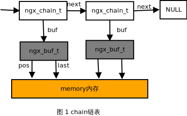

### 概述

       在学习 Nginx 之前首先了解其基本的数据结构是非常重要的，这是入门必须了解的一个步骤。本节只是简单介绍了 Nginx 对基本数据的一种封装，包括 基本整型数据类型、字符串数据类型、缓冲区类型以及 chain 数据类型。

### 基本数据类型

#### 整型数据

```c
/* 基本数据结构 */

/* Nginx 简单数据类型 */
/* 在文件 src/core/ngx_config.h 定义了基本的数据映射 */

typedef intptr_t        ngx_int_t;
typedef uintptr_t       ngx_uint_t;
typedef intptr_t        ngx_flag_t;
/* 其中 intptr_t uintptr_t 定义在文件 /usr/include/stdint.h 文件中*/

/* Types for `void *' pointers.  */
#if __WORDSIZE == 64
# ifndef __intptr_t_defined
typedef long int		intptr_t;
#  define __intptr_t_defined
# endif
typedef unsigned long int	uintptr_t;
#else
# ifndef __intptr_t_defined
typedef int			intptr_t;
#  define __intptr_t_defined
# endif
typedef unsigned int		uintptr_t;

/* 因此，Nginx 的简单数据类型的操作和整型或指针类型类似 */

```
  

#### 字符串类型

```c
/* Nginx 字符串数据类型 */
/* Nginx 字符串类型是对 C 语言字符串类型的简单封装，
 * 其定义在 core/ngx_string.h 或 core/ngx_string.c 中
 * 定义了 ngx_str_t, ngx_keyval_t, ngx_variable_value_t
 */

/* ngx_str_t 在 u_char 的基础上增加了字符串长度的信息，即len变量 */
typedef struct {
    size_t      len;    /* 字符串的长度 */
    u_char     *data;   /* 指向字符串的第一个字符 */
} ngx_str_t;

typedef struct {
    ngx_str_t   key;
    ngx_str_t   value;
} ngx_keyval_t;

typedef struct {
    unsigned    len:28;

    unsigned    valid:1;
    unsigned    no_cacheable:1;
    unsigned    not_found:1;
    unsigned    escape:1;

    u_char     *data;
} ngx_variable_value_t;
/* Nginx 字符串的初始化使用 ngx_string 或 ngx_null_string ，这两个宏定义如下 */

#define ngx_string(str) {sizeof(str)-1, (u_char *) str}
#define ngx_null_string {0, NULL}

/* 若已经定义了 Nginx 字符串变量之后再赋值，则必须使用 ngx_str_set, ngx_str_null 宏定义*/

#define ngx_str_set(str, text)
    (str)->len = sizeof(text)-1; (str)->data = (u_char *)text

#define ngx_str_null(str)   (str)->len = 0; (str)->data = NULL

/* 例如：*/
/* 正确写法*/
ngx_str_t str1 = ngx_string("hello nginx");
ngx_str_t str2 = ngx_null_string;

/* 错误写法*/
ngx_str_t str1, str2;
str1 = ngx_string("hello nginx");   /* 编译出错 */
str2 = ngx_null_string;             /* 编译出错 */

/* 正确写法*/
ngx_str_t str1, str2;
ngx_str_set(&amp;str1, "hello nginx");
ngx_str_null(&amp;str2);
/* 注意：ngx_string 和 ngx_str_set 字符串参数必须是常量字符串，不能是变量字符串 */

```
  

#### 内存池类型

内存池类型即是 ngx_pool_t ，有关内存池的讲解可参考前文《[Nginx 内存池管理](http://blog.csdn.net/chenhanzhun/article/details/42365605)》

```c
/* 内存池结构 */
/* 文件 core/ngx_palloc.h */
typedef struct {/* 内存池数据结构模块 */
    u_char               *last; /* 当前内存分配的结束位置，即下一段可分配内存的起始位置 */
    u_char               *end;  /* 内存池的结束位置 */
    ngx_pool_t           *next; /* 指向下一个内存池 */
    ngx_uint_t            failed;/* 记录内存池内存分配失败的次数 */
} ngx_pool_data_t;  /* 维护内存池的数据块 */

struct ngx_pool_s {/* 内存池的管理模块，即内存池头部结构 */
    ngx_pool_data_t       d;    /* 内存池的数据块 */
    size_t                max;  /* 内存池数据块的最大值 */
    ngx_pool_t           *current;/* 指向当前内存池 */
    ngx_chain_t          *chain;/* 指向一个 ngx_chain_t 结构 */
    ngx_pool_large_t     *large;/* 大块内存链表，即分配空间超过 max 的内存 */
    ngx_pool_cleanup_t   *cleanup;/* 析构函数，释放内存池 */
    ngx_log_t            *log;/* 内存分配相关的日志信息 */
};
/* 文件 core/ngx_core.h */
typedef struct ngx_pool_s   ngx_pool_t;
typedef struct ngx_chain_s  ngx_chain_t;

```
  

#### 缓冲区数据类型

缓冲区 ngx_buf_t 的定义如下：  

```c
/* 缓冲区结构 */
typedef void *            ngx_buf_tag_t;

typedef struct ngx_buf_s  ngx_buf_t;

struct ngx_buf_s {
    u_char          *pos;   /* 缓冲区数据在内存的起始位置 */
    u_char          *last;  /* 缓冲区数据在内存的结束位置 */
    /* 这两个参数是处理文件时使用，类似于缓冲区的pos, last */
    off_t            file_pos;
    off_t            file_last;

    /* 由于实际数据可能被包含在多个缓冲区中，则缓冲区的start和end指向
     * 这块内存的开始地址和结束地址，
     * 而pos和last是指向本缓冲区实际包含的数据的开始和结尾
     */
    u_char          *start;         /* start of buffer */
    u_char          *end;           /* end of buffer */
    ngx_buf_tag_t    tag;
    ngx_file_t      *file;          /* 指向buffer对应的文件对象 */
    /* 当前缓冲区的一个影子缓冲区，即当一个缓冲区复制另一个缓冲区的数据，
     * 就会发生相互指向对方的shadow指针
     */
    ngx_buf_t       *shadow;

    /* 为1时，表示该buf所包含的内容在用户创建的内存块中
     * 可以被filter处理变更
     */
    /* the buf's content could be changed */
    unsigned         temporary:1;

    /* 为1时，表示该buf所包含的内容在内存中，不能被filter处理变更 */
    /*
     * the buf's content is in a memory cache or in a read only memory
     * and must not be changed
     */
    unsigned         memory:1;

    /* 为1时，表示该buf所包含的内容在内存中，
     * 可通过mmap把文件映射到内存中，不能被filter处理变更 */
    /* the buf's content is mmap()ed and must not be changed */
    unsigned         mmap:1;

    /* 可回收，即这些buf可被释放 */
    unsigned         recycled:1;
    unsigned         in_file:1; /* 表示buf所包含的内容在文件中 */
    unsigned         flush:1;   /* 刷新缓冲区 */
    unsigned         sync:1;    /* 同步方式 */
    unsigned         last_buf:1;/* 当前待处理的是最后一块缓冲区 */
    unsigned         last_in_chain:1;/* 在当前的chain里面，该buf是最后一个，但不一定是last_buf */

    unsigned         last_shadow:1;
    unsigned         temp_file:1;

    /* STUB */ int   num;
};

```
  

#### chain 数据类型

ngx_chain_t 数据类型是与缓冲区类型 ngx_buf_t 相关的链表结构，定义如下：

```c
struct ngx_chain_s {
    ngx_buf_t    *buf;  /* 指向当前缓冲区 */
    ngx_chain_t  *next; /* 指向下一个chain，形成chain链表 */
};
typedef struct {

```
  
链表图如下：

  

  

参考资料：

《深入理解 Nginx 》

《[Nginx 从入门到精通](http://tengine.taobao.org/book/chapter_02.html#id3)》

《[Nginx 代码研究](https://code.google.com/p/nginxsrp/wiki/NginxCodeReview#ngx的内存池)》