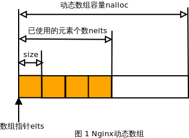

### 概述

       本节源码来自 src/core/ngx_array.h/.c。Nginx 源码的数组类似于前面介绍的《[STL源码剖析——序列容器之 vector](http://blog.csdn.net/chenhanzhun/article/details/39287983)》，在 Nginx 数组中，内存分配是基于内存池的，并不是固定不变的，也不是需要多少内存就申请多少，若当前内存不足以存储所需元素时，按照当前数组的两倍内存大小进行申请，这样做减少内存分配的次数，提高效率。

### 数组数据结构

动态数组的数据结构定义如下：

```c
typedef struct {
    void        *elts;  /* 指向数组数据区域的首地址 */
    ngx_uint_t   nelts; /* 数组实际数据的个数 */
    size_t       size;  /* 单个元素所占据的字节大小 */
    ngx_uint_t   nalloc;/* 数组容量 */
    ngx_pool_t  *pool;  /* 数组对象所在的内存池 */
} ngx_array_t;

```

数组结构图如下：


  

  

### 数组的基本操作

```c
/* 创建新的动态数组 */
ngx_array_t *ngx_array_create(ngx_pool_t *p, ngx_uint_t n, size_t size);
/* 销毁数组对象，内存被内存池回收 */
void ngx_array_destroy(ngx_array_t *a);
/* 在现有数组中增加一个新的元素 */
void *ngx_array_push(ngx_array_t *a);
/* 在现有数组中增加 n 个新的元素 */
void *ngx_array_push_n(ngx_array_t *a, ngx_uint_t n);

```
  
创建新的动态数组：

       创建数组的操作实现如下，首先分配数组头，然后分配数组数据区，两次分配均在传入的内存池(pool指向的内存池)中进行。然后简单初始化数组头并返回数组头的起始位置。  

```c
/* 创建动态数组对象 */
ngx_array_t *
ngx_array_create(ngx_pool_t *p, ngx_uint_t n, size_t size)
{
    ngx_array_t *a;

    /* 分配动态数组头部 */
    a = ngx_palloc(p, sizeof(ngx_array_t));
    if (a == NULL) {
        return NULL;
    }

    /* 分配容量为 n 的动态数组数据区，并将其初始化 */
    if (ngx_array_init(a, p, n, size) != NGX_OK) {
        return NULL;
    }

    return a;
}

/* 当一个数组对象被分配在堆上，且调用ngx_array_destroy之后，若想重新使用，则需调用该函数 */
/* 若数组对象被分配在栈上，则需调用此函数 */
static ngx_inline ngx_int_t
ngx_array_init(ngx_array_t *array, ngx_pool_t *pool, ngx_uint_t n, size_t size)
{
    /*
     * set "array->nelts" before "array->elts", otherwise MSVC thinks
     * that "array->nelts" may be used without having been initialized
     */

    /* 初始化数组成员，注意：nelts必须比elts先初始化 */
    array->nelts = 0;
    array->size = size;
    array->nalloc = n;
    array->pool = pool;

    /* 分配数组数据域所需要的内存 */
    array->elts = ngx_palloc(pool, n * size);
    if (array->elts == NULL) {
        return NGX_ERROR;
    }

    return NGX_OK;
}

```
  
销毁动态数组

       销毁数组的操作实现如下，包括销毁数组数据区和数组头。销毁动作实际上就是修改内存池的 last 指针，即数组的内存被内存池回收，并没有调用 free 等释放内存的操作。  

```c
/* 销毁数组对象，即数组所占据的内存被内存池回收 */
void
ngx_array_destroy(ngx_array_t *a)
{
    ngx_pool_t  *p;

    p = a->pool;

    /* 移动内存池的last指针，释放数组所有元素所占据的内存 */
    if ((u_char *) a->elts + a->size * a->nalloc == p->d.last) {
        p->d.last -= a->size * a->nalloc;
    }

    /* 释放数组首指针所占据的内存 */
    if ((u_char *) a + sizeof(ngx_array_t) == p->d.last) {
        p->d.last = (u_char *) a;
    }
}

```
  
添加元素操作

       数组添加元素的操作有两个，ngx_array_push 和ngx_array_push_n，分别添加一个和多个元素。实际的添加操作并不在这两个函数中完成，只是在这两个函数中申请元素所需的内存空间，并返回指向该内存空间的首地址，在利用指针赋值的形式添加元素。  

```c
/* 数组增加一个元素 */
void *
ngx_array_push(ngx_array_t *a)
{
    void        *elt, *new;
    size_t       size;
    ngx_pool_t  *p;

    /* 判断数组是否已满 */
    if (a->nelts == a->nalloc) {

        /* 若现有数组所容纳的元素个数已满 */
        /* the array is full */

        /* 计算数组所有元素占据的内存大小 */
        size = a->size * a->nalloc;

        p = a->pool;

        if ((u_char *) a->elts + size == p->d.last
            &amp;&amp; p->d.last + a->size <= p->d.end)
            /* 若当前内存池的内存空间至少可容纳一个元素大小 */
        {
            /*
             * the array allocation is the last in the pool
             * and there is space for new allocation
             */

            p->d.last += a->size;
            a->nalloc++;

        } else {
            /* 若当前内存池不足以容纳一个元素，则分配新的数组内存 */
            /* allocate a new array */

            /* 新的数组内存为当前数组大小的 2 倍 */
            new = ngx_palloc(p, 2 * size);
            if (new == NULL) {
                return NULL;
            }

            /* 首先把现有数组的所有元素复制到新的数组中 */
            ngx_memcpy(new, a->elts, size);
            a->elts = new;
            a->nalloc *= 2;
        }
    }

    elt = (u_char *) a->elts + a->size * a->nelts;
    a->nelts++;

    /* 返回指向新增加元素的指针 */
    return elt;
}

/* 数组增加 n 个元素 */
void *
ngx_array_push_n(ngx_array_t *a, ngx_uint_t n)
{
    void        *elt, *new;
    size_t       size;
    ngx_uint_t   nalloc;
    ngx_pool_t  *p;

    size = n * a->size;

    if (a->nelts + n > a->nalloc) {

        /* the array is full */

        p = a->pool;

        if ((u_char *) a->elts + a->size * a->nalloc == p->d.last
            &amp;&amp; p->d.last + size <= p->d.end)
        {
            /*
             * the array allocation is the last in the pool
             * and there is space for new allocation
             */

            p->d.last += size;
            a->nalloc += n;

        } else {
            /* allocate a new array */

            nalloc = 2 * ((n >= a->nalloc) ? n : a->nalloc);

            new = ngx_palloc(p, nalloc * a->size);
            if (new == NULL) {
                return NULL;
            }

            ngx_memcpy(new, a->elts, a->nelts * a->size);
            a->elts = new;
            a->nalloc = nalloc;
        }
    }

    elt = (u_char *) a->elts + a->size * a->nelts;
    a->nelts += n;

```
  

测试程序：

```c
#include "ngx_config.h"
#include <stdio.h>
#include "ngx_conf_file.h"
#include "nginx.h"
#include "ngx_core.h"
#include "ngx_string.h"
#include "ngx_palloc.h"
#include "ngx_array.h"

volatile ngx_cycle_t  *ngx_cycle;

void ngx_log_error_core(ngx_uint_t level, ngx_log_t *log, ngx_err_t err,
            const char *fmt, ...)
{
}

void dump_array(ngx_array_t* a)
{
    if (a)
    {
        printf("array = 0x%x\n", a);
        printf("  .elts = 0x%x\n", a->elts);
        printf("  .nelts = %d\n", a->nelts);
        printf("  .size = %d\n", a->size);
        printf("  .nalloc = %d\n", a->nalloc);
        printf("  .pool = 0x%x\n", a->pool);

        printf("elements: ");
        int *ptr = (int*)(a->elts);
        for (; ptr < (int*)(a->elts + a->nalloc * a->size); )
        {
            printf("%d  ", *ptr++);
        }
        printf("\n");
    }
}

int main()
{
    ngx_pool_t *pool;
    int i;

    printf("--------------------------------\n");
    printf("create a new pool:\n");
    printf("--------------------------------\n");
    pool = ngx_create_pool(1024, NULL);

    printf("--------------------------------\n");
    printf("alloc an array from the pool:\n");
    printf("--------------------------------\n");
    ngx_array_t *a = ngx_array_create(pool, 5, sizeof(int));

    for (i = 0; i < 5; i++)
    {
        int *ptr = ngx_array_push(a);
        *ptr = 2*i;
    }

    dump_array(a);

    ngx_array_destroy(a);
    ngx_destroy_pool(pool);
    return 0;
}

```
  
输出结果：

```c
$ ./test 
--------------------------------
create a new pool:
--------------------------------
--------------------------------
alloc an array from the pool:
--------------------------------
array = 0x9fe2048
  .elts = 0x9fe205c
  .nelts = 5
  .size = 4
  .nalloc = 5
  .pool = 0x9fe2020
elements: 0  2  4  6  8  

```
  
参考资料：
《深入理解 Nginx》

《[Nginx源码分析—数组结构ngx_array_t](http://blog.csdn.net/livelylittlefish/article/details/6599056)》