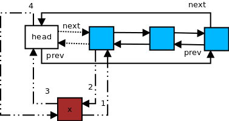
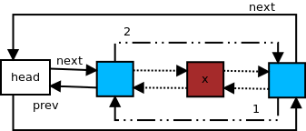
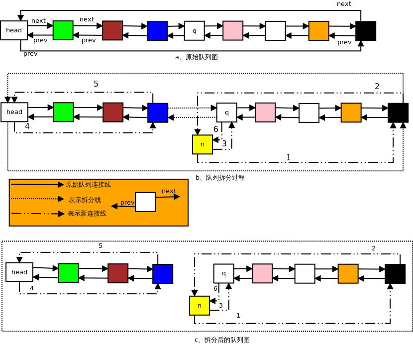
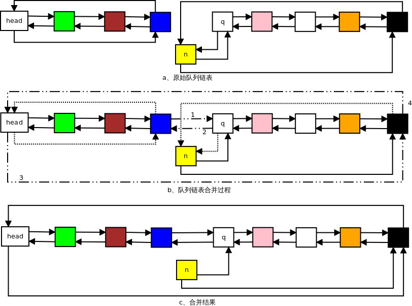

### 队列链表结构

       队列双向循环链表实现文件：文件：src/core/ngx_queue.h/.c。在 Nginx 的队列实现中，实质就是具有头节点的双向循环链表，这里的双向链表中的节点是没有数据区的，只有两个指向节点的指针。需注意的是队列链表的内存分配不是直接从内存池分配的，即没有进行内存池管理，而是需要我们自己管理内存，所有我们可以指定它在内存池管理或者直接在堆里面进行管理，最好使用内存池进行管理。节点结构定义如下：

```c
/* 队列结构，其实质是具有有头节点的双向循环链表 */
typedef struct ngx_queue_s  ngx_queue_t;

/* 队列中每个节点结构，只有两个指针，并没有数据区 */
struct ngx_queue_s {
    ngx_queue_t  *prev;
    ngx_queue_t  *next;
};
```

### 队列链表操作

其基本操作如下：

```c
/* h 为链表结构体 ngx_queue_t 的指针；初始化双链表 */
ngx_queue_int(h)

/* h 为链表容器结构体 ngx_queue_t 的指针； 判断链表是否为空 */
ngx_queue_empty(h)

/* h 为链表容器结构体 ngx_queue_t 的指针，x 为插入元素结构体中 ngx_queue_t 成员的指针；将 x 插入到链表头部 */
ngx_queue_insert_head(h, x)

/* h 为链表容器结构体 ngx_queue_t 的指针，x 为插入元素结构体中 ngx_queue_t 成员的指针。将 x 插入到链表尾部 */
ngx_queue_insert_tail(h, x)

/* h 为链表容器结构体 ngx_queue_t 的指针。返回链表容器 h 中的第一个元素的 ngx_queue_t 结构体指针 */
ngx_queue_head(h)

/* h 为链表容器结构体 ngx_queue_t 的指针。返回链表容器 h 中的最后一个元素的 ngx_queue_t 结构体指针 */
ngx_queue_last(h)

/* h 为链表容器结构体 ngx_queue_t 的指针。返回链表结构体的指针 */
ngx_queue_sentinel(h)

/* x 为链表容器结构体 ngx_queue_t 的指针。从容器中移除 x 元素 */
ngx_queue_remove(x)

/* h 为链表容器结构体 ngx_queue_t 的指针。该函数用于拆分链表，
 * h 是链表容器，而 q 是链表 h 中的一个元素。
 * 将链表 h 以元素 q 为界拆分成两个链表 h 和 n
 */
ngx_queue_split(h, q, n)

/* h 为链表容器结构体 ngx_queue_t 的指针， n为另一个链表容器结构体 ngx_queue_t 的指针
 * 合并链表，将 n 链表添加到 h 链表的末尾
 */
ngx_queue_add(h, n)

/* h 为链表容器结构体 ngx_queue_t 的指针。返回链表中心元素，即第 N/2 + 1 个 */
ngx_queue_middle(h)

/* h 为链表容器结构体 ngx_queue_t 的指针，cmpfunc 是比较回调函数。使用插入排序对链表进行排序 */
ngx_queue_sort(h, cmpfunc)

/* q 为链表中某一个元素结构体的 ngx_queue_t 成员的指针。返回 q 元素的下一个元素。*/
ngx_queue_next(q)

/* q 为链表中某一个元素结构体的 ngx_queue_t 成员的指针。返回 q 元素的上一个元素。*/
ngx_queue_prev(q)

/* q 为链表中某一个元素结构体的 ngx_queue_t 成员的指针，type 是链表元素的结构体类型名称，
 * link 是上面这个结构体中 ngx_queue_t 类型的成员名字。返回 q 元素所属结构体的地址
 */
ngx_queue_data(q, type, link)

/* q 为链表中某一个元素结构体的 ngx_queue_t 成员的指针，x 为插入元素结构体中 ngx_queue_t 成员的指针 */
ngx_queue_insert_after(q, x)

```
  
下面是队列链表操作源码的实现：

#### 初始化链表

```c
/* 初始化队列，即节点指针都指向自己，表示为空队列  */
#define ngx_queue_init(q)                                                     \
    (q)->prev = q;                                                            \
    (q)->next = q

/* 判断队列是否为空 */
#define ngx_queue_empty(h)                                                    \
    (h == (h)->prev)
```

#### 获取指定的队列链表中的节点

```c
/* 获取队列头节点 */
#define ngx_queue_head(h)                                                     \
    (h)->next

/* 获取队列尾节点 */
#define ngx_queue_last(h)                                                     \
    (h)->prev

#define ngx_queue_sentinel(h)                                                 \
    (h)

/* 获取队列指定节点的下一个节点 */
#define ngx_queue_next(q)                                                     \
    (q)->next

/* 获取队列指定节点的前一个节点 */
#define ngx_queue_prev(q)                                                     \
    (q)->prev
```

#### 插入节点

在头节点之后插入新节点：

```c
/* 在队列头节点的下一节点插入新节点，其中h为头节点，x为新节点 */
#define ngx_queue_insert_head(h, x)                                           \
    (x)->next = (h)->next;                                                    \
    (x)->next->prev = x;                                                      \
    (x)->prev = h;                                                            \
    (h)->next = x

```
  
       插入节点比较简单，只是修改指针的指向即可。下图是插入节点的过程：注意：虚线表示断开连接，实线表示原始连接，破折线表示重新连接，图中的数字与源码步骤相对应。


  

在尾节点之后插入节点

```c
/* 在队列尾节点之后插入新节点，其中h为尾节点，x为新节点 */
#define ngx_queue_insert_tail(h, x)                                           \
    (x)->prev = (h)->prev;                                                    \
    (x)->prev->next = x;                                                      \
    (x)->next = h;                                                            \
    (h)->prev = x
```
下图是插入节点的过程：  


  

#### 删除节点

       删除指定的节点，删除节点只是修改相邻节点指针的指向，并没有实际将该节点的内存释放，内存释放必须由我们进行处理。

```c
#if (NGX_DEBUG)

#define ngx_queue_remove(x)                                                   \
    (x)->next->prev = (x)->prev;                                              \
    (x)->prev->next = (x)->next;                                              \
    (x)->prev = NULL;                                                         \
    (x)->next = NULL

#else
/* 删除队列指定的节点 */
#define ngx_queue_remove(x)                                                   \
    (x)->next->prev = (x)->prev;                                              \
    (x)->prev->next = (x)->next

#endif
```
删除节点过程如下图所示：


  

#### 拆分链表

```c
/* 拆分队列链表，使其称为两个独立的队列链表；
 * 其中h是原始队列的头节点，q是原始队列中的一个元素节点，n是新的节点，
 * 拆分后，原始队列以q为分界，头节点h到q之前的节点作为一个队列（不包括q节点），
 * 另一个队列是以n为头节点，以节点q及其之后的节点作为新的队列链表；
 */
#define ngx_queue_split(h, q, n)                                              \
    (n)->prev = (h)->prev;                                                    \
    (n)->prev->next = n;                                                      \
    (n)->next = q;                                                            \
    (h)->prev = (q)->prev;                                                    \
    (h)->prev->next = h;                                                      \
    (q)->prev = n;
```

      该宏有 3 个参数，h 为队列头(即链表头指针)，将该队列从 q 节点将队列(链表)拆分为两个队列(链表)，q 之后的节点组成的新队列的头节点为 n 。链表拆分过程如下图所示：



#### 合并链表

```c
/* 合并两个队列链表，把n队列链表连接到h队列链表的尾部 */
#define ngx_queue_add(h, n)                                                   \
    (h)->prev->next = (n)->next;                                              \
    (n)->next->prev = (h)->prev;                                              \
    (h)->prev = (n)->prev;                                                    \
    (h)->prev->next = h;                                                      \
    (n)->prev = (n)->next = n;/* 这是我个人增加的语句，若加上该语句，就不会出现头节点n会指向队列链表的节点 */

```

  

其中，h、n分别为两个队列的指针，即头节点指针，该操作将n队列链接在h队列之后。具体操作如下图所示：

  

  

  

#### 获取中间节点

```c
/* 返回队列链表中心元素 */
ngx_queue_t *
ngx_queue_middle(ngx_queue_t *queue)
{
    ngx_queue_t  *middle, *next;

    /* 获取队列链表头节点 */
    middle = ngx_queue_head(queue);

    /* 若队列链表的头节点就是尾节点，表示该队列链表只有一个元素 */
    if (middle == ngx_queue_last(queue)) {
        return middle;
    }

    /* next作为临时指针，首先指向队列链表的头节点 */
    next = ngx_queue_head(queue);

    for ( ;; ) {
        /* 若队列链表不止一个元素，则等价于middle = middle->next */
        middle = ngx_queue_next(middle);

        next = ngx_queue_next(next);

        /* 队列链表有偶数个元素 */
        if (next == ngx_queue_last(queue)) {
            return middle;
        }

        next = ngx_queue_next(next);

        /* 队列链表有奇数个元素 */
        if (next == ngx_queue_last(queue)) {
            return middle;
        }
    }
}
```

#### 链表排序

       队列链表排序采用的是稳定的简单插入排序方法，即从第一个节点开始遍历，依次将当前节点(q)插入前面已经排好序的队列(链表)中，下面程序中，前面已经排好序的队列的尾节点为prev。操作如下：

```c
/* the stable insertion sort */

/* 队列链表排序 */
void
ngx_queue_sort(ngx_queue_t *queue,
    ngx_int_t (*cmp)(const ngx_queue_t *, const ngx_queue_t *))
{
    ngx_queue_t  *q, *prev, *next;

    q = ngx_queue_head(queue);

    /* 若队列链表只有一个元素，则直接返回 */
    if (q == ngx_queue_last(queue)) {
        return;
    }

    /* 遍历整个队列链表 */
    for (q = ngx_queue_next(q); q != ngx_queue_sentinel(queue); q = next) {

        prev = ngx_queue_prev(q);
        next = ngx_queue_next(q);

        /* 首先把元素节点q独立出来 */
        ngx_queue_remove(q);

        /* 找到适合q插入的位置 */
        do {
            if (cmp(prev, q) <= 0) {
                break;
            }

            prev = ngx_queue_prev(prev);

        } while (prev != ngx_queue_sentinel(queue));

        /* 插入元素节点q */
        ngx_queue_insert_after(prev, q);
    }
}
```

#### 获取队列中节点数据地址

       由队列基本结构和以上操作可知，nginx 的队列操作只对链表指针进行简单的修改指向操作，并不负责节点数据空间的分配。因此，用户在使用nginx队列时，要自己定义数据结构并分配空间，且在其中包含一个 ngx_queue_t 的指针或者对象，当需要获取队列节点数据时，使用ngx_queue_data宏，其定义如下：  

```c
/* 返回q在所属结构类型的地址，type是链表元素的结构类型 */
#define ngx_queue_data(q, type, link)                                         \
    (type *) ((u_char *) q - offsetof(type, link))
/*

```

  

测试程序：

```c
#include <stdio.h>
#include "ngx_queue.h"
#include "ngx_conf_file.h"
#include "ngx_config.h"
#include "ngx_palloc.h"
#include "nginx.h"
#include "ngx_core.h"

#define MAX     10
typedef struct Score
{
    unsigned int score;
    ngx_queue_t Que;
}ngx_queue_score;
volatile ngx_cycle_t  *ngx_cycle;

void ngx_log_error_core(ngx_uint_t level, ngx_log_t *log, ngx_err_t err,  
            const char *fmt, ...)
{
}

ngx_int_t CMP(const ngx_queue_t *x, const ngx_queue_t *y)
{
    ngx_queue_score *xinfo = ngx_queue_data(x, ngx_queue_score, Que);
    ngx_queue_score *yinfo = ngx_queue_data(y, ngx_queue_score, Que);

    return(xinfo->score > yinfo->score);
}

void print_ngx_queue(ngx_queue_t *queue)
{
    ngx_queue_t *q = ngx_queue_head(queue);

    printf("score: ");
    for( ; q != ngx_queue_sentinel(queue); q = ngx_queue_next(q))
    {
        ngx_queue_score *ptr = ngx_queue_data(q, ngx_queue_score, Que);
        if(ptr != NULL)
            printf(" %d\t", ptr->score);
    }
    printf("\n");
}

int main()
{
    ngx_pool_t *pool;
    ngx_queue_t *queue;
    ngx_queue_score *Qscore;

    pool = ngx_create_pool(1024, NULL);

    queue = ngx_palloc(pool, sizeof(ngx_queue_t));
    ngx_queue_init(queue);

    int i;
    for(i = 1; i < MAX; i++)
    {
        Qscore = (ngx_queue_score*)ngx_palloc(pool, sizeof(ngx_queue_score));
        Qscore->score = i;
        ngx_queue_init(&amp;Qscore->Que);

        if(i%2)
        {
            ngx_queue_insert_tail(queue, &amp;Qscore->Que);
        }
        else
        {
            ngx_queue_insert_head(queue, &amp;Qscore->Que);
        }
    }

    printf("Before sort: ");
    print_ngx_queue(queue);

    ngx_queue_sort(queue, CMP);

    printf("After sort: ");
    print_ngx_queue(queue);

    ngx_destroy_pool(pool);
    return 0;

}

```
  
输出结果：

```c
$./queue_test 
Before sort: score:  8	 6	 4	 2	 1	 3	 5	 7	 9	
After sort: score:  1	 2	 3	 4	 5	 6	 7	 8	 9	

```
  

### 总结

       在 Nginx 的队列链表中，其维护的是指向链表节点的指针，并没有实际的数据区，所有对实际数据的操作需要我们自行操作，队列链表实质是双向循环链表，其操作是双向链表的基本操作。