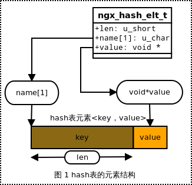
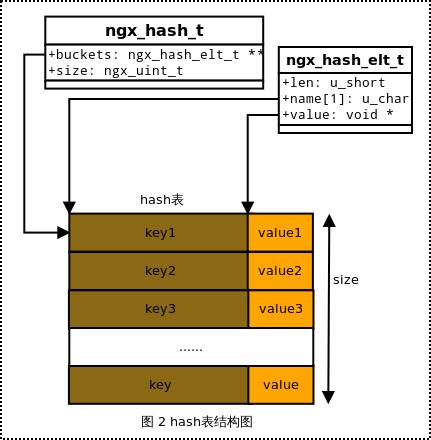

### 概述

       关于哈希表的基本知识在前面的文章《[数据结构-哈希表](http://blog.csdn.net/chenhanzhun/article/details/38091431)》已作介绍。哈希表结合了数组和链表的特点，使其寻址、插入以及删除操作更加方便。哈希表的过程是将关键字通过某种哈希函数映射到相应的哈希表位置，即对应的哈希值所在哈希表的位置。但是会出现多个关键字映射相同位置的情况导致冲突问题，为了解决这种情况，哈希表使用两个可选择的方法：**拉链法**和 **开放寻址法**。

       Nginx 的哈希表中使用开放寻址来解决冲突问题，为了处理字符串，Nginx 还实现了支持通配符操作的相关函数，下面对 Nginx 中哈希表的源码进行分析。源码文件：src/core/ngx_hash.h/.c。

### 哈希表结构

**ngx_hash_elt_t 结构 **

哈希表中关键字元素的结构 ngx_hash_elt_t，哈希表元素结构采用 键-值 形式，即<key，value> 。其定义如下：

```c
/* hash散列表中元素的结构，采用键值及其所以应的值<key，value>*/
typedef struct {
    void             *value;    /* 指向用户自定义的数据 */
    u_short           len;      /* 键值key的长度 */
    u_char            name[1];  /* 键值key的第一个字符，数组名name表示指向键值key首地址 */
} ngx_hash_elt_t;
```
**ngx_hash_t 结构**  

哈希表基本结构 ngx_hash_t，其结构定义如下：

```c
/* 基本hash散列表结构 */
typedef struct {
    ngx_hash_elt_t  **buckets;  /* 指向hash散列表第一个存储元素的桶 */
    ngx_uint_t        size;     /* hash散列表的桶个数 */
} ngx_hash_t;
```

元素结构图以及基本哈希结构图如下所示：

             
                         
  

  

**ngx_hash_init_t 初始化结构 **

       哈希初始化结构 ngx_hash_init_t，Nginx 的 hash 初始化结构是 ngx_hash_init_t，用来将其相关数据封装起来作为参数传递给ngx_hash_init()，其定义如下：

```c
typedef ngx_uint_t (*ngx_hash_key_pt) (u_char *data, size_t len);

/* 初始化hash结构 */
typedef struct {
    ngx_hash_t       *hash;         /* 指向待初始化的基本hash结构 */
    ngx_hash_key_pt   key;          /* hash 函数指针 */

    ngx_uint_t        max_size;     /* hash表中桶bucket的最大个数 */
    ngx_uint_t        bucket_size;  /* 每个桶bucket的存储空间 */

    char             *name;         /* hash结构的名称(仅在错误日志中使用) */
    ngx_pool_t       *pool;         /* 分配hash结构的内存池 */
    /* 分配临时数据空间的内存池，仅在初始化hash表前，用于分配一些临时数组 */
    ngx_pool_t       *temp_pool;
} ngx_hash_init_t;
```
  
       哈希元素数据 ngx_hash_key_t，该结构也主要用来保存要 hash 的数据，即键-值对<key,value>，在实际使用中，一般将多个键-值对保存在 ngx_hash_key_t 结构的数组中，作为参数传给ngx_hash_init()。其定义如下：

```c
/* 计算待添加元素的hash元素结构 */
typedef struct {
    ngx_str_t         key;      /* 元素关键字 */
    ngx_uint_t        key_hash; /* 元素关键字key计算出的hash值 */
    void             *value;    /* 指向关键字key对应的值，组成hash表元素：键-值<key，value> */
} ngx_hash_key_t;
```

### 哈希操作

       哈希操作包括初始化函数、查找函数；其中初始化函数是 Nginx 中哈希表比较重要的函数，由于 Nginx 的 hash 表是静态只读的，即不能在运行时动态添加新元素的，一切的结构和数据都在配置初始化的时候就已经规划完毕。

#### 哈希函数

       哈希表中使用哈希函数把用户数据映射到哈希表对应的位置中，下面是 Nginx 哈希函数的定义：

```c
/* hash函数 */
#define ngx_hash(key, c)   ((ngx_uint_t) key * 31 + c)
ngx_uint_t ngx_hash_key(u_char *data, size_t len);
ngx_uint_t ngx_hash_key_lc(u_char *data, size_t len);
ngx_uint_t ngx_hash_strlow(u_char *dst, u_char *src, size_t n);
#define ngx_hash(key, c)   ((ngx_uint_t) key * 31 + c)
/* hash函数 */
ngx_uint_t
ngx_hash_key(u_char *data, size_t len)
{
    ngx_uint_t  i, key;

    key = 0;

    for (i = 0; i < len; i++) {
        /* 调用宏定义的hash 函数 */
        key = ngx_hash(key, data[i]);
    }

    return key;
}

/* 这里只是将字符串data中的所有字符转换为小写字母再进行hash值计算 */
ngx_uint_t
ngx_hash_key_lc(u_char *data, size_t len)
{
    ngx_uint_t  i, key;

    key = 0;

    for (i = 0; i < len; i++) {
        /* 把字符串转换为小写字符，并计算每个字符的hash值 */
        key = ngx_hash(key, ngx_tolower(data[i]));
    }

    return key;
}

/* 把原始关键字符串的前n个字符转换为小写字母再计算hash值
 * 注意：这里只计算前n个字符的hash值
 */
ngx_uint_t
ngx_hash_strlow(u_char *dst, u_char *src, size_t n)
{
    ngx_uint_t  key;

    key = 0;

    while (n--) {/* 把src字符串的前n个字符转换为小写字母 */
        *dst = ngx_tolower(*src);
        key = ngx_hash(key, *dst);/* 计算所转换小写字符的hash值 */
        dst++;
        src++;
    }

    return key;/* 返回整型的hash值 */
}
```

#### 哈希初始化函数

       hash 初始化由 ngx_hash_init() 函数完成，其 names 参数是 ngx_hash_key_t 结构的数组，即键-值对 <key,value> 数组，nelts 表示该数组元素的个数。该函数初始化的结果就是将 names 数组保存的键-值对<key,value>，通过 hash 的方式将其存入相应的一个或多个 hash 桶(即代码中的 buckets )中。hash 桶里面存放的是 ngx_hash_elt_t 结构的指针(hash元素指针)，该指针指向一个基本连续的数据区。该数据区中存放的是经 hash 之后的键-值对<key',value'>，即 ngx_hash_elt_t 结构中的字段 <name,value>。每一个这样的数据区存放的键-值对<key',value'>可以是一个或多个。其定义如下：  

```c
#define NGX_HASH_ELT_SIZE(name)                                               \
    (sizeof(void *) + ngx_align((name)->key.len + 2, sizeof(void *)))

/* 初始化hash结构函数 */
/* 参数hinit是hash表初始化结构指针；
 * name是指向待添加在hash表结构的元素数组；
 * nelts是待添加元素数组中元素的个数；
 */
ngx_int_t
ngx_hash_init(ngx_hash_init_t *hinit, ngx_hash_key_t *names, ngx_uint_t nelts)
{
    u_char          *elts;
    size_t           len;
    u_short         *test;
    ngx_uint_t       i, n, key, size, start, bucket_size;
    ngx_hash_elt_t  *elt, **buckets;

    for (n = 0; n < nelts; n++) {
        /* 若每个桶bucket的内存空间不足以存储一个关键字元素，则出错返回
         * 这里考虑到了每个bucket桶最后的null指针所需的空间，即该语句中的sizeof(void *)，
         * 该指针可作为查找过程中的结束标记
         */
        if (hinit->bucket_size < NGX_HASH_ELT_SIZE(&amp;names[n]) + sizeof(void *))
        {
            ngx_log_error(NGX_LOG_EMERG, hinit->pool->log, 0,
                          "could not build the %s, you should "
                          "increase %s_bucket_size: %i",
                          hinit->name, hinit->name, hinit->bucket_size);
            return NGX_ERROR;
        }
    }

    /* 临时分配sizeof(u_short)*max_size的test空间，即test数组总共有max_size个元素，即最大bucket的数量，
     * 每个元素会累计落到相应hash表位置的关键字长度，
     * 当大于256字节，即u_short所表示的字节大小，
     * 则表示bucket较少
     */
    test = ngx_alloc(hinit->max_size * sizeof(u_short), hinit->pool->log);
    if (test == NULL) {
        return NGX_ERROR;
    }

    /* 每个bucket桶实际容纳的数据大小，
     * 由于每个bucket的末尾结束标志是null，
     * 所以bucket实际容纳的数据大小必须减去一个指针所占的内存大小
     */
    bucket_size = hinit->bucket_size - sizeof(void *);

    /* 估计hash表最少bucket数量；
     * 每个关键字元素需要的内存空间是 NGX_HASH_ELT_SIZE(&amp;name[n])，至少需要占用两个指针的大小即2*sizeof(void *)
     * 这样来估计hash表所需的最小bucket数量
     * 因为关键字元素内存越小，则每个bucket所容纳的关键字元素就越多
     * 那么hash表的bucket所需的数量就越少，但至少需要一个bucket
     */
    start = nelts / (bucket_size / (2 * sizeof(void *)));
    start = start ? start : 1;

    
    if (hinit->max_size > 10000 &amp;&amp; nelts &amp;&amp; hinit->max_size / nelts < 100) {
        start = hinit->max_size - 1000;
    }

    /* 以前面估算的最小bucket数量start，通过测试数组test估算hash表容纳 nelts个关键字元素所需的bucket数量
     * 根据需求适当扩充bucket的数量
     */
    for (size = start; size <= hinit->max_size; size++) {

        ngx_memzero(test, size * sizeof(u_short));

        for (n = 0; n < nelts; n++) {
            if (names[n].key.data == NULL) {
                continue;
            }

            /* 根据关键字元素的hash值计算存在到测试数组test对应的位置中，即计算bucket在hash表中的编号key,key取值为0～size-1 */
            key = names[n].key_hash % size;
            test[key] = (u_short) (test[key] + NGX_HASH_ELT_SIZE(&amp;names[n]));

#if 0
            ngx_log_error(NGX_LOG_ALERT, hinit->pool->log, 0,
                          "%ui: %ui %ui \"%V\"",
                          size, key, test[key], &amp;names[n].key);
#endif

            /* test数组中对应的内存大于每个桶bucket最大内存，则需扩充bucket的数量
             * 即在start的基础上继续增加size的值
             */
            if (test[key] > (u_short) bucket_size) {
                goto next;
            }
        }

        /* 若size个bucket桶可以容纳name数组的所有关键字元素，则表示找到合适的bucket数量大小即为size */
        goto found;

    next:

        continue;
    }

    ngx_log_error(NGX_LOG_WARN, hinit->pool->log, 0,
                  "could not build optimal %s, you should increase "
                  "either %s_max_size: %i or %s_bucket_size: %i; "
                  "ignoring %s_bucket_size",
                  hinit->name, hinit->name, hinit->max_size,
                  hinit->name, hinit->bucket_size, hinit->name);

found:

    /* 到此已经找到合适的bucket数量，即为size
     * 重新初始化test数组元素，初始值为一个指针大小
     */
    for (i = 0; i < size; i++) {
        test[i] = sizeof(void *);
    }

    /* 计算每个bucket中关键字所占的空间，即每个bucket实际所容纳数据的大小，
     * 必须注意的是：test[i]中还有一个指针大小
     */
    for (n = 0; n < nelts; n++) {
        if (names[n].key.data == NULL) {
            continue;
        }

        /* 根据hash值计算出关键字放在对应的test[key]中，即test[key]的大小增加一个关键字元素的大小 */
        key = names[n].key_hash % size;
        test[key] = (u_short) (test[key] + NGX_HASH_ELT_SIZE(&amp;names[n]));
    }

    len = 0;

    /* 调整成对齐到cacheline的大小，并记录所有元素的总长度 */
    for (i = 0; i < size; i++) {
        if (test[i] == sizeof(void *)) {
            continue;
        }

        test[i] = (u_short) (ngx_align(test[i], ngx_cacheline_size));

        len += test[i];
    }

    /*
     * 向内存池申请bucket元素所占的内存空间，
     * 注意：若前面没有申请hash表头结构，则在这里将和ngx_hash_wildcard_t一起申请
     */
    if (hinit->hash == NULL) {
        hinit->hash = ngx_pcalloc(hinit->pool, sizeof(ngx_hash_wildcard_t)
                                             + size * sizeof(ngx_hash_elt_t *));
        if (hinit->hash == NULL) {
            ngx_free(test);
            return NGX_ERROR;
        }

        /* 计算buckets的起始位置 */
        buckets = (ngx_hash_elt_t **)
                      ((u_char *) hinit->hash + sizeof(ngx_hash_wildcard_t));

    } else {
        buckets = ngx_pcalloc(hinit->pool, size * sizeof(ngx_hash_elt_t *));
        if (buckets == NULL) {
            ngx_free(test);
            return NGX_ERROR;
        }
    }

    /* 分配elts，对齐到cacheline大小 */
    elts = ngx_palloc(hinit->pool, len + ngx_cacheline_size);
    if (elts == NULL) {
        ngx_free(test);
        return NGX_ERROR;
    }

    elts = ngx_align_ptr(elts, ngx_cacheline_size);

    /* 将buckets数组与相应的elts对应起来，即设置每个bucket对应实际数据的地址 */
    for (i = 0; i < size; i++) {
        if (test[i] == sizeof(void *)) {
            continue;
        }

        buckets[i] = (ngx_hash_elt_t *) elts;
        elts += test[i];

    }

    /* 清空test数组，以便用来累计实际数据的长度，这里不计算结尾指针的长度 */
    for (i = 0; i < size; i++) {
        test[i] = 0;
    }

    /* 依次向各个bucket中填充实际数据 */
    for (n = 0; n < nelts; n++) {
        if (names[n].key.data == NULL) {
            continue;
        }

        key = names[n].key_hash % size;
        elt = (ngx_hash_elt_t *) ((u_char *) buckets[key] + test[key]);

        elt->value = names[n].value;
        elt->len = (u_short) names[n].key.len;

        ngx_strlow(elt->name, names[n].key.data, names[n].key.len);

        /* test[key]记录当前bucket内容的填充位置，即下一次填充的起始位置 */
        test[key] = (u_short) (test[key] + NGX_HASH_ELT_SIZE(&amp;names[n]));
    }

    /* 设置bucket结束位置的null指针 */
    for (i = 0; i < size; i++) {
        if (buckets[i] == NULL) {
            continue;
        }

        elt = (ngx_hash_elt_t *) ((u_char *) buckets[i] + test[i]);

        elt->value = NULL;
    }

    ngx_free(test);

    hinit->hash->buckets = buckets;
    hinit->hash->size = size;

#if 0

    for (i = 0; i < size; i++) {
        ngx_str_t   val;
        ngx_uint_t  key;

        elt = buckets[i];

        if (elt == NULL) {
            ngx_log_error(NGX_LOG_ALERT, hinit->pool->log, 0,
                          "%ui: NULL", i);
            continue;
        }

        while (elt->value) {
            val.len = elt->len;
            val.data = &amp;elt->name[0];

            key = hinit->key(val.data, val.len);

            ngx_log_error(NGX_LOG_ALERT, hinit->pool->log, 0,
                          "%ui: %p \"%V\" %ui", i, elt, &amp;val, key);

            elt = (ngx_hash_elt_t *) ngx_align_ptr(&amp;elt->name[0] + elt->len,
                                                   sizeof(void *));
        }
    }

#endif

    return NGX_OK;
}
```

#### 哈希查找函数

       hash 查找操作由 ngx_hash_find() 函数完成，查找时由 key 直接计算所在的 bucket，该 bucket 中保存其所在 ngx_hash_elt_t 数据区的起始地址；然后根据长度判断并用 name 内容匹配，匹配成功，其 ngx_hash_elt_t 结构的 value 字段即是所求。其定义如下：  

```c
/* 查找hash元素 */
void *
ngx_hash_find(ngx_hash_t *hash, ngx_uint_t key, u_char *name, size_t len)
{
    ngx_uint_t       i;
    ngx_hash_elt_t  *elt;

#if 0
    ngx_log_error(NGX_LOG_ALERT, ngx_cycle->log, 0, "hf:\"%*s\"", len, name);
#endif

    /* 由key找到元素在hash表中所在bucket的位置 */
    elt = hash->buckets[key % hash->size];

    if (elt == NULL) {
        return NULL;
    }

    while (elt->value) {
        if (len != (size_t) elt->len) {/* 判断长度是否相等 */
            goto next;
        }

        for (i = 0; i < len; i++) {
            if (name[i] != elt->name[i]) {/* 若长度相等，则比较name的内容 */
                goto next;
            }
        }

        /* 匹配成功，则返回value字段 */
        return elt->value;

    next:

        elt = (ngx_hash_elt_t *) ngx_align_ptr(&amp;elt->name[0] + elt->len,
                                               sizeof(void *));
        continue;
    }

    return NULL;
}

```
  

测试程序：

```c
#include <stdio.h>
#include "ngx_config.h"
#include "ngx_conf_file.h"
#include "nginx.h"
#include "ngx_core.h"
#include "ngx_string.h"
#include "ngx_palloc.h"
#include "ngx_array.h"
#include "ngx_hash.h"
volatile ngx_cycle_t  *ngx_cycle;
void ngx_log_error_core(ngx_uint_t level, ngx_log_t *log, ngx_err_t err, const char *fmt, ...) { }

static ngx_str_t names[] = {ngx_string("www.baidu.com"),
                            ngx_string("www.google.com.hk"),
                            ngx_string("www.github.com")};
static char* descs[] = {"baidu: 1","google: 2", "github: 3"};

// hash table的一些基本操作
int main()
{
    ngx_uint_t          k;
    ngx_pool_t*         pool;
    ngx_hash_init_t     hash_init;
    ngx_hash_t*         hash;
    ngx_array_t*        elements;
    ngx_hash_key_t*     arr_node;
    char*               find;
    int                 i;
    ngx_cacheline_size = 32;

    pool = ngx_create_pool(1024*10, NULL);

    /* 分配hash表基本结构内存 */
    hash = (ngx_hash_t*) ngx_pcalloc(pool, sizeof(hash));
    /* 初始化hash结构 */
    hash_init.hash      = hash;                      // hash结构
    hash_init.key       = &amp;ngx_hash_key_lc;          // hash函数
    hash_init.max_size  = 1024*10;                   // max_size
    hash_init.bucket_size = 64;
    hash_init.name      = "test_hash_error";
    hash_init.pool           = pool;
    hash_init.temp_pool      = NULL;

    /* 创建数组，把关键字压入到数组中 */

    elements = ngx_array_create(pool, 32, sizeof(ngx_hash_key_t));
    for(i = 0; i < 3; i++) {
        arr_node            = (ngx_hash_key_t*) ngx_array_push(elements);
        arr_node->key       = (names[i]);
        arr_node->key_hash  = ngx_hash_key_lc(arr_node->key.data, arr_node->key.len);
        arr_node->value     = (void*) descs[i];

        printf("key: %s , key_hash: %u\n", arr_node->key.data, arr_node->key_hash);
    }

    /* hash初始化函数 */
    if (ngx_hash_init(&amp;hash_init, (ngx_hash_key_t*) elements->elts, elements->nelts) != NGX_OK){
        return 1;
    }

    /* 查找hash 元素 */
    k    = ngx_hash_key_lc(names[0].data, names[0].len);
    printf("%s key is %d\n", names[0].data, k);
    find = (char*)
        ngx_hash_find(hash, k, (u_char*) names[0].data, names[0].len);

    if (find) {
        printf("get desc: %s\n",(char*) find);
    }

    ngx_array_destroy(elements);
    ngx_destroy_pool(pool);

    return 0;
}

```
  
输出结果：

```c
 ./hash_test 
key: www.baidu.com , key_hash: 270263191
key: www.google.com.hk , key_hash: 2472785358
key: www.github.com , key_hash: 2818415021
www.baidu.com key is 270263191
get desc: baidu: 1

```
  
  

参考资料：

《深入理解 Nginx 》

《 [nginx中hash表的设计与实现](http://blog.csdn.net/brainkick/article/details/7816420)》

《[Nginx 代码研究](http://code.google.com/p/nginxsrp/wiki/NginxCodeReview#ngx_hash)》