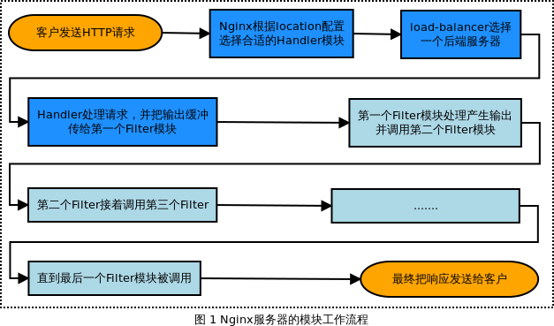
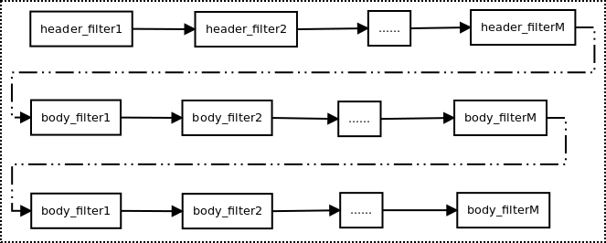

### 关注校招、实习信息

  

### Nginx 模块概述

Nginx 模块有三种角色：

- 处理请求并产生输出的 Handler 模块；
- 处理由 Handler 产生的输出的 Filter（滤波器）模块；
- 当出现多个后台服务器时，Load-balancer （负载均衡器）模块负责选择其中一个后台服务器发送请求；

       通常，服务器启动时，任何 Handler 模块都有可能去处理配置文件中的 location 定义。若出现多个Handler 模块被配置成需要处理某一特定的 location 时，最终只有其中一个Handler 模块是成功的。Handler 模块有三种返回方式：

1. 接收请求，并成功返回；
1. 接收请求，但是出错返回；
1. 拒绝请求，使默认的 Handler 模块处理该请求；

       若 Handler 模块的作用是把一个请求反向代理到后台服务器，则会出现另一种类型的空间模块—— Load-balancer。 Load-balancer 负责决定将请求发送给哪个后端服务器。Nginx 目前支持两种 Load-balancer 模块：round-robin （轮询，处理请求就像打扑克时发牌那样）和"IP hash" method（众多请求时，保证来自同一 IP 的请求被分发的同一个后端服务器）。

       若 Handler 模块没有产生错误返回时，则会调用 Filter 模块。每个location 配置里都可以添加多个Filter 模块 ，因此响应可以被压缩和分块。Filter 模块之间的处理顺序是在编译时就已经确定的。Filter 模块采用“CHAIN OF RESPONSIBILITY”链式的设计模式。当有请求到达时，请求依次经过这条链上的全部 Filter 模块，一个Filter 被调用并处理，接下来调用下一个Filter，直到最后一个Filter 被调用完成，Nginx 才真正完成响应流程。

       总结如下，典型的处理形式如下：

```c
Client sends HTTP request → Nginx chooses the appropriate handler based on the location config →  
 (if applicable) load-balancer picks a backend server →   
Handler does its thing and passes each output buffer to the first filter →   
First filter passes the output to the second filter → second to third → third to fourth → etc.   
→ Final response sent to client  
```


  

```c

```

### Nginx 模块的结构

### 模块的配置结构

       模块最多可以定义三个配置结构：main、server、location。绝大多数模块仅需要一个location 配置。名称约定如下以ngx_http_<module name>_(main|srv|loc)_conf_t为例的dav module：

```c
typedef struct {
      ngx_uint_t methods;
      ngx_flag_t create_full_put_path;
      ngx_uint_t access;
} ngx_http_dav_loc_conf_t;

```
      Nginx 模块的数据结构如下定义：

```c
/* Nginx 模块的数据结构 */
#define NGX_MODULE_V1          0, 0, 0, 0, 0, 0, 1
#define NGX_MODULE_V1_PADDING  0, 0, 0, 0, 0, 0, 0, 0

struct ngx_module_s {
    /* 模块类别由type成员决定，ctx_index表示当前模块在type类模块中的序号 */
    ngx_uint_t            ctx_index;
    /* index 区别与ctx_index，index表示当前模块在所有模块中的序号 */
    ngx_uint_t            index;

    /* spare 序列保留变量，暂时不被使用 */
    ngx_uint_t            spare0;
    ngx_uint_t            spare1;
    ngx_uint_t            spare2;
    ngx_uint_t            spare3;

    /* 当前模块的版本 */
    ngx_uint_t            version;

    /* ctx指向特定类型模块的公共接口，例如在HTTP模块中，ctx指向ngx_http_module_t结构体 */
    void                 *ctx;
    /* 处理nginx.conf中的配置项 */
    ngx_command_t        *commands;
    /* type表示当前模块的类型 */
    ngx_uint_t            type;

    /* 下面的7个函数指针是在Nginx启动或停止时，分别调用的7中方法 */
    /* 在master进程中回调init_master */
    ngx_int_t           (*init_master)(ngx_log_t *log);

    /* 初始化所有模块时回调init_module */
    ngx_int_t           (*init_module)(ngx_cycle_t *cycle);

    /* 在worker进程提供正常服务之前回调init_process初始化进程 */
    ngx_int_t           (*init_process)(ngx_cycle_t *cycle);
    /* 初始化多线程 */
    ngx_int_t           (*init_thread)(ngx_cycle_t *cycle);
    /* 退出多线程 */
    void                (*exit_thread)(ngx_cycle_t *cycle);
    /* 在worker进程停止服务之前回调exit_process */
    void                (*exit_process)(ngx_cycle_t *cycle);

    /* 在master进程退出之前回调exit_master */
    void                (*exit_master)(ngx_cycle_t *cycle);

    /* 保留字段，未被使用 */
    uintptr_t             spare_hook0;
    uintptr_t             spare_hook1;
    uintptr_t             spare_hook2;
    uintptr_t             spare_hook3;
    uintptr_t             spare_hook4;
    uintptr_t             spare_hook5;
    uintptr_t             spare_hook6;
    uintptr_t             spare_hook7;
};
```
       在该数据结构中，其中最重要的是两个成员 ctx和commands，这里两个成员会在分别在下面的模块配置指令和模块上下文中讲解；若是HTTP 模块时，type 字段必须定义为NGX_HTTP_MODULE；

### 模块配置指令

       模块指令存储在一个 ngx_command_t 类型的静态数组结构中，例如：

```c
static ngx_command_t  ngx_http_circle_gif_commands[] = {
    { ngx_string("circle_gif"),
      NGX_HTTP_LOC_CONF|NGX_CONF_NOARGS,
      ngx_http_circle_gif,
      NGX_HTTP_LOC_CONF_OFFSET,
      0,
      NULL },

    { ngx_string("circle_gif_min_radius"),
      NGX_HTTP_MAIN_CONF|NGX_HTTP_SRV_CONF|NGX_HTTP_LOC_CONF|NGX_CONF_TAKE1,
      ngx_conf_set_num_slot,
      NGX_HTTP_LOC_CONF_OFFSET,
      offsetof(ngx_http_circle_gif_loc_conf_t, min_radius),
      NULL },
      ...
      ngx_null_command
};
```
ngx_command_t 类型定义在 [core/ngx_conf_file.h](http://lxr.nginx.org/source/src/core/ngx_conf_file.h)：  

```c
struct ngx_command_s {
    /* 配置项名称 */
    ngx_str_t             name;
    /* 配置项类型，type将指定配置项可以出现的位置以及携带参数的个数 */
    ngx_uint_t            type;
    /* 处理配置项的参数 */
    char               *(*set)(ngx_conf_t *cf, ngx_command_t *cmd, void *conf);
    /* 在配置文件中的偏移量，conf与offset配合使用 */
    ngx_uint_t            conf;
    ngx_uint_t            offset;
    /* 配置项读取后的处理方法，必须指向ngx_conf_post_t 结构 */
    void                 *post;
};
```
name ：配置指令的名称；  
type    ：该配置的类型，指定配置项的出现位置以及可携带参数的个数，下面规定只是其中一部分，更多信息可查看文件[core/ngx_conf_file.h](http://lxr.nginx.org/source/src/core/ngx_conf_file.h)：

```c
NGX_HTTP_MAIN_CONF:  directive is valid in the main config
NGX_HTTP_SRV_CONF:   directive is valid in the server (host) config
NGX_HTTP_LOC_CONF:   directive is valid in a location config
NGX_HTTP_UPS_CONF:   directive is valid in an upstream config
NGX_CONF_NOARGS:     directive can take 0 arguments
NGX_CONF_TAKE1:      directive can take exactly 1 argument
NGX_CONF_TAKE2:      directive can take exactly 2 arguments
…
NGX_CONF_TAKE7:      directive can take exactly 7 arguments
NGX_CONF_FLAG:       directive takes a boolean ("on" or "off")
NGX_CONF_1MORE:      directive must be passed at least one argument
NGX_CONF_2MORE:      directive must be passed at least two arguments
```
set     ：这是一个函数指针，当Nginx 在解析配置时，若遇到该配置指令，将会把读取到的值传递给这个函数进行分解处理。因为具体每个配置指令的值如何处理，只有定义这个配置指令的人是最清楚的。来看一下这个函数指针要求的函数原型。  

```c
char *(*set)(ngx_conf_t *cf, ngx_command_t *cmd, void *conf);
```
         该函数处理成功时，返回 NGX_OK，否则返回 NGX_CONF_ERROR 或者是一个自定义的错误信息的字符串。该函数传入三个类型的参数：

1. cf    ：指向ngx_conf_t  结构的指针，该结构包括从配置指令传递的参数；
1. cmd：指向当前ngx_command_t 结构；
1. conf：指向模块配置结构；

       为了方便实现对配置指令参数的读取，Nginx 已经默认提供了对一些标准类型的参数进行读取的函数，可以直接赋值给set 字段使用。下面是一部分已经实现的set 类型函数，更多可参考文件[core/ngx_conf_file.h](http://lxr.nginx.org/source/src/core/ngx_conf_file.h)：

- ngx_conf_set_flag_slot : 把 "on" 或 "off" 解析为 1 或 0；
- ngx_conf_set_str_slot   : 解析字符串并保存 ngx_str_t类型；
- ngx_conf_set_num_slot: 解析一个数字并将其保存为int 类型；
- ngx_conf_set_size_slot: 解析数据大小 ("8k", "1m", etc.) 并将其保存为size_t；

conf   ：用于指示配置项所处内存的相对偏移量，仅在type 中没有设置NGX_DIRECT_CONF 和NGX_MAIN_CONF 时才生效。对于HTTP 模块，conf 必须设置，它的取值如下：

- NGX_HTTP_MAIN_CONF_OFFSET：使用create_main_conf 方法产生的结构体来存储解析出的配置项参数；
- NGX_HTTP_SRV_CONF_OFFSET：使用 create_srv_conf 方法产生的结构体来存储解析出的配置项参数；
- NGX_HTTP_LOC_CONF_OFFSET：使用 create_loc_conf 方法产生的结构体来存储解析出的配置项参数；

offset ：表示当前配置项在整个存储配置项的结构体中的偏移位置。  

### 模块上下文

       这是一个静态的 ngx_http_module_t 结构，它的名称是ngx_http_<module name>_module_ctx。以下是该结构的定义，具体可查阅文件 [http/ngx_http_config.h](http://lxr.nginx.org/source/src/http/ngx_http_config.h)：  

- preconfiguration
- postconfiguration
- creating the main conf (i.e., do a malloc and set defaults)
- initializing the main conf (i.e., override the defaults with what's in nginx.conf)
- creating the server conf
- merging it with the main conf
- creating the location conf
- merging it with the server conf

```c
typedef struct{/* 可以把不需要调用的函数指针设置为 NULL */
    /* 解析配置文件之前被调用 */
    ngx_int_t   (*preconfiguration)(ngx_conf_t *cf);
    /* 完成配置文件的解析后被调用 */
    ngx_int_t   (*postconfiguration)(ngx_conf_t *cf);

    /* 创建存储main级别的全局配置项的结构体（直属于http块） */
    void        *(*create_main_conf)(ngx_conf_t *cf);
    /* 初始化main级别的配置项 */
    char        *(*init_main_conf)(ngx_conf_t *cf);

    /* 创建存储srv级别的配置项的结构体（直属于server块） */
    void        *(*create_srv_conf)(ngx_conf_t *cf);
    /* 合并main级别与srv级别下的同名配置项 */
    char        *(*merge_srv_conf)(ngx_conf_t *cf, void *prev, void *conf);

    /* 创建存储loc级别的配置项的结构体（直属于location块） */
    void        *(*create_loc_conf)(ngx_conf_t *cf);
    /* 合并srv级别与loc级别下的同名配置项 */
    char        *(*merge_loc_conf)(ngx_conf_t *cf, void *prev, void *conf);
}ngx_http_module_t;
```

      在以上的结构内容中，大多数模块只使用最后两项：ngx_http_<module name>_create_loc_conf和ngx_http_<module name >_merge_loc_conf；例如：

```c
static ngx_http_module_t  ngx_http_circle_gif_module_ctx = {
    NULL,                          /* preconfiguration */
    NULL,                          /* postconfiguration */

    NULL,                          /* create main configuration */
    NULL,                          /* init main configuration */

    NULL,                          /* create server configuration */
    NULL,                          /* merge server configuration */

    ngx_http_circle_gif_create_loc_conf,  /* create location configuration */
    ngx_http_circle_gif_merge_loc_conf /* merge location configuration */
};
```
      下面针对最后两项进行说明，以下是以 circle_gif 模块为例子，该[模块源码](http://www.evanmiller.org/nginx/ngx_http_circle_gif_module.c.txt)；

#### create_loc_conf 函数

      该函数是传入一个 ngx_conf_t 结构的参数，返回新创建模块的配置结构，在这里是返回：ngx_http_circle_gif_loc_conf_t

```c
static void *
ngx_http_circle_gif_create_loc_conf(ngx_conf_t *cf)
{
    ngx_http_circle_gif_loc_conf_t  *conf;

    conf = ngx_pcalloc(cf->pool, sizeof(ngx_http_circle_gif_loc_conf_t));
    if (conf == NULL) {
        return NGX_CONF_ERROR;
    }
    conf->min_radius = NGX_CONF_UNSET_UINT;
    conf->max_radius = NGX_CONF_UNSET_UINT;
    return conf;
}
```

#### merge_loc_conf 函数  

          Nginx 为不同的数据类型提供了merge 函数，可查阅 [core/ngx_conf_file.h](http://lxr.nginx.org/source/src/core/ngx_conf_file.h)；merge_loc_conf 函数定义如下：

```c
static char *
ngx_http_circle_gif_merge_loc_conf(ngx_conf_t *cf, void *parent, void *child)
{
    ngx_http_circle_gif_loc_conf_t *prev = parent;
    ngx_http_circle_gif_loc_conf_t *conf = child;

    ngx_conf_merge_uint_value(conf->min_radius, prev->min_radius, 10);
    ngx_conf_merge_uint_value(conf->max_radius, prev->max_radius, 20);

    if (conf->min_radius < 1) {
        ngx_conf_log_error(NGX_LOG_EMERG, cf, 0, 
            "min_radius must be equal or more than 1");
        return NGX_CONF_ERROR;
    }
    if (conf->max_radius < conf->min_radius) {
        ngx_conf_log_error(NGX_LOG_EMERG, cf, 0, 
            "max_radius must be equal or more than min_radius");
        return NGX_CONF_ERROR;
    }

    return NGX_CONF_OK;
}
```

### 模块的定义

       对任何开发模块，都需要定义一个 ngx_module_t 类型的变量来说明这个模块本身的信息，它告诉了 Nginx 这个模块的一些信息。这个变量是  ngx_http_<module name>_module；例如：更多例子可查找文件 [core/ngx_conf_file.h](http://lxr.nginx.org/source/src/core/ngx_conf_file.h)；  

```c
ngx_module_t  ngx_http_<module name>_module = {
    NGX_MODULE_V1,
    &amp;ngx_http_<module name>_module_ctx, /* module context */
    ngx_http_<module name>_commands,   /* module directives */
    NGX_HTTP_MODULE,               /* module type */
    NULL,                          /* init master */
    NULL,                          /* init module */
    NULL,                          /* init process */
    NULL,                          /* init thread */
    NULL,                          /* exit thread */
    NULL,                          /* exit process */
    NULL,                          /* exit master */
    NGX_MODULE_V1_PADDING
};
```

### Handler 模块

       Handler 模块必须提供一个真正的处理函数，这个函数负责处理来自客户端的请求。该函数既可以选择自己直接生成内容，也可以选择拒绝处理，并由后续的 Handler 去进行处理，或者是选择丢给后续的 Filter 模块进行处理。以下是该函数的原型：  

```c
typedef ngx_int_t (*ngx_http_handler_pt)(ngx_http_request_t *r);
```
 其中r 是 request 结构http 请求，包含客户端请求所有的信息，例如：request method, URI, and headers。 该函数处理成功返回NGX_OK，处理发生错误返回NGX_ERROR，拒绝处理（留给后续的Handler 进行处理）返回NGX_DECLINE。 返回NGX_OK 也就代表给客户端的响应已经生成，否则返回NGX_ERROR 就发生错误了。  

       Handler 模块处理过程中做了四件事情：**获取 location 配置**、**生成合适的响应**、**发送响应的 header 头部**、**发送响应的 body 包体**。

### 获取 location 配置

       获取 location 配置 指向调用 ngx_http_get_module_loc_conf 函数即可，该函数传入的参数是 request 结构和  自定义的 module 模块。例如：circle gif模块；

```c
static ngx_int_t
ngx_http_circle_gif_handler(ngx_http_request_t *r)
{
    ngx_http_circle_gif_loc_conf_t  *circle_gif_config;
    circle_gif_config = ngx_http_get_module_loc_conf(r, ngx_http_circle_gif_module);
    ...
}
```

### 生成合适的响应

        这里主要是 request 结构，其定义如下：更多可参考文件  [http/ngx_http_request.h](http://lxr.nginx.org/source/src/http/ngx_http_request.h#L316)；

```c
typedef struct {
...
/* the memory pool, used in the ngx_palloc functions */
    ngx_pool_t                       *pool; 
    ngx_str_t                         uri;
    ngx_str_t                         args;
    ngx_http_headers_in_t             headers_in;

...
} ngx_http_request_t;
```
其中参数的意义如下：  

- uri              是 request 请求的路径,e.g. "/query.cgi".
- args           是请求串参数中问号后面的参数(e.g. "name=john").
- headers_in 包含有用的stuff，例如：cookies 和browser 信息。

### 发送响应的 header 头部

      发送响应头部有函数ngx_http_send_header(r) 实现。响应的header 头部在 headers_out 结构中，定义如下：更多可参考文件 [http/ngx_http_request.h](http://lxr.nginx.org/source/src/http/ngx_http_request.h#L316)；

```c
typedef stuct {
...
    ngx_uint_t                        status;
    size_t                            content_type_len;
    ngx_str_t                         content_type;
    ngx_table_elt_t                  *content_encoding;
    off_t                             content_length_n;
    time_t                            date_time;
    time_t                            last_modified_time;
..
} ngx_http_headers_out_t;
```
      例如，一个模块设置为 Content-Type to "image/gif", Content-Length to 100, and return a 200 OK response，则其实现为：

```c
r->headers_out.status = NGX_HTTP_OK;
    r->headers_out.content_length_n = 100;
    r->headers_out.content_type.len = sizeof("image/gif") - 1;
    r->headers_out.content_type.data = (u_char *) "image/gif";
    ngx_http_send_header(r);
```
      假如content_encoding 是 (ngx_table_elt_t*)类型时，则模块需要为这些类型分配内存，可以调用ngx_list_push 函数，实现如下：

```c
r->headers_out.content_encoding = ngx_list_push(&amp;r->headers_out.headers);
if (r->headers_out.content_encoding == NULL) {
return NGX_ERROR;
}
r->headers_out.content_encoding->hash = 1;
r->headers_out.content_encoding->key.len = sizeof("Content-Encoding") - 1;
r->headers_out.content_encoding->key.data = (u_char *) "Content-Encoding";
r->headers_out.content_encoding->value.len = sizeof("deflate") - 1;
r->headers_out.content_encoding->value.data = (u_char *) "deflate";
ngx_http_send_header(r);
```

### 发送响应的 body 包体

      到此，该模块已经产生响应，并把它存储在内存中。发送包体的步骤是：首先分配响应特殊的缓冲区，然后分配缓冲区链接到chain link，然后在 chain link 调用发送函数。  

      1、chain links 是 Nginx  使 Handler 模块在缓冲区中产生响应。在 chain 中每个 chain link 有一个指向下一个 link 的指针。首先，模块声明缓冲区 buffer 和 chain link：

```c
ngx_buf_t    *b;
ngx_chain_t   out;
```
2、然后分配缓冲区 buffer，使响应数据指向它：  

```c
b = ngx_pcalloc(r->pool, sizeof(ngx_buf_t));
    if (b == NULL) {
        ngx_log_error(NGX_LOG_ERR, r->connection->log, 0, 
            "Failed to allocate response buffer.");
        return NGX_HTTP_INTERNAL_SERVER_ERROR;
    }

    b->pos = some_bytes; /* first position in memory of the data */
    b->last = some_bytes + some_bytes_length; /* last position */

    b->memory = 1; /* content is in read-only memory */
    /* (i.e., filters should copy it rather than rewrite in place) */

    b->last_buf = 1; /* there will be no more buffers in the request */
```
3、接着，把模块挂载到 chain link 上：

```c
out.buf = b;
out.next = NULL;
```
4、最后，发送包体：

```c
return ngx_http_output_filter(r, &amp;out);
```

### Handler 模块挂载

  
       Handler 模块真正的处理函数通过两种方式挂载到处理过程中：按处理阶段挂载；按需挂载。

#### 按处理阶段挂载
       为了更精细地控制对于客户端请求的处理过程，Nginx 把这个处理过程划分成了11个阶段。依次列举如下：  

```c
NGX_HTTP_POST_READ_PHASE:
/* 读取请求内容阶段 */
NGX_HTTP_SERVER_REWRITE_PHASE:
/* Server请求地址重写阶段 */
NGX_HTTP_FIND_CONFIG_PHASE:
/* 配置查找阶段: */
NGX_HTTP_REWRITE_PHASE:
/* Location请求地址重写阶段 */
NGX_HTTP_POST_REWRITE_PHASE:
/* 请求地址重写提交阶段 */
NGX_HTTP_PREACCESS_PHASE:
/* 访问权限检查准备阶段 */
NGX_HTTP_ACCESS_PHASE:
/* 访问权限检查阶段 */
NGX_HTTP_POST_ACCESS_PHASE:
/* 访问权限检查提交阶段 */
NGX_HTTP_TRY_FILES_PHASE:
/* 配置项try_files处理阶段 */
NGX_HTTP_CONTENT_PHASE:
/* 内容产生阶段 */
NGX_HTTP_LOG_PHASE:
/* 日志模块处理阶段 */
```
       一般情况下，我们自定义的模块，大多数是挂载在NGX_HTTP_CONTENT_PHASE阶段的。挂载的动作一般是在模块上下文调用的postconfiguration 函数中。注意：有几个阶段是特例，它不调用挂载任何的Handler，也就是你就不用挂载到这几个阶段了：  

```c
NGX_HTTP_FIND_CONFIG_PHASE
NGX_HTTP_POST_ACCESS_PHASE
NGX_HTTP_POST_REWRITE_PHASE
NGX_HTTP_TRY_FILES_PHASE
```

#### 按需挂载
       以这种方式挂载的Handler 也被称为content handler。当一个请求进来以后，Nginx 从NGX_HTTP_POST_READ_PHASE 阶段开始依次执行每个阶段中所有 Handler。执行到  NGX_HTTP_CONTENT_PHASE 阶段时，如果这个location 有一个对应的content handler 模块，那么就去执行这个content handler 模块真正的处理函数。否则继续依次执行NGX_HTTP_CONTENT_PHASE 阶段中所有content phase handlers，直到某个函数处理返回NGX_OK 或者NGX_ERROR。但是使用这个方法挂载上去的handler 有一个特点是必须在NGX_HTTP_CONTENT_PHASE 阶段才能被执行。如果你想自己的handler 更早的阶段被执行，那就不要使用这种挂载方式。  
       以下是例子：

```c
circle gif ngx_command_t looks like this:

    { ngx_string("circle_gif"),
      NGX_HTTP_LOC_CONF|NGX_CONF_NOARGS,
      ngx_http_circle_gif,
      0,
      0,
      NULL }
```
挂载函数：

```c
static char *
ngx_http_circle_gif(ngx_conf_t *cf, ngx_command_t *cmd, void *conf)
{
    ngx_http_core_loc_conf_t  *clcf;

    clcf = ngx_http_conf_get_module_loc_conf(cf, ngx_http_core_module);
    clcf->handler = ngx_http_circle_gif_handler;

    return NGX_CONF_OK;
}
```

### Handler 模块编写
Handler 模块编写步骤如下：  

1. 编写模块基本结构：包括模块的定义，模块上下文结构，模块的配置结构等；
1. 实现 handler 的挂载函数；根据模块的需求选择正确的挂载方式；
1. 编写 handler 处理函数；模块的功能主要通过这个函数来完成；

### Filter 模块
  
       Filter 处理由Handler 模块产生的响应，即仅处理由服务器发往客户端的HTTP 响应，并不处理由客户端发往服务器的 HTTP 请求。Filter 模块包括过滤头部（Header Filter）和过滤包体（Body Filter ），Filter 模块过滤头部处理HTTP 的头部（HTTP headers），Filter 包体处理响应内容（response content）（即HTTP 包体），这两个阶段可以对HTTP 响应头部和内容进行修改。
       Filter 模块 HTTP 响应的方法如下：定义在文件 [src/http/ngx_http_core_module.h](http://lxr.nginx.org/source/src/http/ngx_http_core_module.h)

```c
typedef ngx_int_t (*ngx_http_output_header_filter_pt) (ngx_http_request_t *r);
typedef ngx_int_t (*ngx_http_output_body_filter_pt) (ngx_http_request_t *r, ngx_chain_t *chain);
```
其中，参数 r 是当前的请求，chain 是待发送的 HTTP  响应包体；

       所有 HTTP 过滤模块都需要实现上面的两个方法，在 HTTP 过滤模块组成的链表中，链表元素就是处理方法。HTTP 框架定义了链表入口：

```c
extern ngx_http_output_header_filter_pt  ngx_http_top_header_filter;
extern ngx_http_output_body_filter_pt  ngx_http_top_body_filter;
```
       过滤模块链表中通过 next 遍历，其定义如下： 

```c
static ngx_http_output_header_filter_pt  ngx_http_next_header_filter;
static ngx_http_output_body_filter_pt  ngx_http_next_body_filter;
```

       当执行发送 HTTP 头部或 HTTP 响应包体时，HTTP 框架是从  ngx_http_top_header_filter 和 ngx_http_top_body_filter 开始遍历 HTTP 头部过滤模块和 HTTP 包体过来模块。其源码实现在文件：[src/http/ngx_http_core_module.c](http://lxr.nginx.org/source/src/http/ngx_http_core_module.c)

```c
/* 发送 HTTP 响应头部 */
ngx_int_t
ngx_http_send_header(ngx_http_request_t *r)
{
    if (r->header_sent) {
        ngx_log_error(NGX_LOG_ALERT, r->connection->log, 0,
                      "header already sent");
        return NGX_ERROR;
    }

    if (r->err_status) {
        r->headers_out.status = r->err_status;
        r->headers_out.status_line.len = 0;
    }

    return ngx_http_top_header_filter(r);
}

/* 发送HTTP 响应包体 */
ngx_int_t
ngx_http_output_filter(ngx_http_request_t *r, ngx_chain_t *in)
{
    ngx_int_t          rc;
    ngx_connection_t  *c;

    c = r->connection;

    ngx_log_debug2(NGX_LOG_DEBUG_HTTP, c->log, 0,
                   "http output filter \"%V?%V\"", &amp;r->uri, &amp;r->args);

    rc = ngx_http_top_body_filter(r, in);

    if (rc == NGX_ERROR) {
        /* NGX_ERROR may be returned by any filter */
        c->error = 1;
    }

    return rc;
}
```

### Filter 模块相关结构

       Filter 模块是采用链表形式的，其基本结构是ngx_chain_t 和 ngx_buf_t；这两种结构定义如下：

```c
typedef struct ngx_chain_s ngx_chain_t;

        struct ngx_chain_s {
                ngx_buf_t    *buf;
                ngx_chain_t  *next;
        };

struct ngx_buf_s {
        u_char          *pos;       /* 当前buffer真实内容的起始位置 */
        u_char          *last;      /* 当前buffer真实内容的结束位置 */
        off_t            file_pos;  /* 在文件中真实内容的起始位置   */
        off_t            file_last; /* 在文件中真实内容的结束位置   */

        u_char          *start;    /* buffer内存的开始分配的位置 */
        u_char          *end;      /* buffer内存的结束分配的位置 */
        ngx_buf_tag_t    tag;      /* buffer属于哪个模块的标志 */
        ngx_file_t      *file;     /* buffer所引用的文件 */

        /* 用来引用替换过后的buffer，以便当所有buffer输出以后，
         * 这个影子buffer可以被释放。
         */
        ngx_buf_t       *shadow;

        /* the buf's content could be changed */
        unsigned         temporary:1;

        /*
         * the buf's content is in a memory cache or in a read only memory
         * and must not be changed
         */
        unsigned         memory:1;

        /* the buf's content is mmap()ed and must not be changed */
        unsigned         mmap:1;

        unsigned         recycled:1; /* 内存可以被输出并回收 */
        unsigned         in_file:1;  /* buffer的内容在文件中 */
        /* 马上全部输出buffer的内容, gzip模块里面用得比较多 */
        unsigned         flush:1;
        /* 基本上是一段输出链的最后一个buffer带的标志，标示可以输出，
         * 有些零长度的buffer也可以置该标志
         */
        unsigned         sync:1;
        /* 所有请求里面最后一块buffer，包含子请求 */
        unsigned         last_buf:1;
        /* 当前请求输出链的最后一块buffer         */
        unsigned         last_in_chain:1;
        /* shadow链里面的最后buffer，可以释放buffer了 */
        unsigned         last_shadow:1;
        /* 是否是暂存文件 */
        unsigned         temp_file:1;

        /* 统计用，表示使用次数 */
        /* STUB */ int   num;
};
```

### Filter 过滤头部
  
header filter 包含三个基本步骤：  

1. 决定是否处理响应；
1. 对响应进行处理；
1. 调用下一个 filter；

       例如下面的"not modified" header filter：其中 headers_out 结构可参考文件 [http/ngx_http_request.h](http://lxr.nginx.org/source/src/http/ngx_http_request.h#L220)；

```c
static
ngx_int_t ngx_http_not_modified_header_filter(ngx_http_request_t *r)
{
time_t if_modified_since;

if_modified_since = ngx_http_parse_time(r->headers_in.if_modified_since->value.data,
r->headers_in.if_modified_since->value.len);

/* step 1: decide whether to operate */
if (if_modified_since != NGX_ERROR &amp;&amp; 
if_modified_since == r->headers_out.last_modified_time) {

/* step 2: operate on the header */
r->headers_out.status = NGX_HTTP_NOT_MODIFIED;
r->headers_out.content_type.len = 0;
ngx_http_clear_content_length(r);
ngx_http_clear_accept_ranges(r);
}

/* step 3: call the next filter */
return ngx_http_next_header_filter(r);
}
```

### Filter 过滤包体
       Filter 包体只能在chain link缓冲区buffer 中操作。模块必须决定是否修改输入缓冲区，或分配新的缓冲区替换当前缓冲区，或是在当前缓冲区之后还是之前插入新的缓冲区。很多模块接收多个缓冲区，导致这些模块在不完整的chain 缓冲区中操作。Filter 包体操作如下：

```c
static ngx_int_t ngx_http_chunked_body_filter(ngx_http_request_t *r, ngx_chain_t *in);
```
 以下是一个例子：

```c
/*
 * Let's take a simple example.
 * Suppose we want to insert the text "<l!-- Served by Nginx -->" to the end of every request.
 * First, we need to figure out if the response's final buffer is included in the buffer chain we were given.
 * Like I said, there's not a fancy API, so we'll be rolling our own for loop:
 */

    ngx_chain_t *chain_link;
    int chain_contains_last_buffer = 0;

    chain_link = in;
    for ( ; ; ) {
        if (chain_link->buf->last_buf)
            chain_contains_last_buffer = 1;
        if (chain_link->next == NULL)
            break;
        chain_link = chain_link->next;
    }
/*
 * Now let's bail out if we don't have that last buffer:
 */

    if (!chain_contains_last_buffer)
        return ngx_http_next_body_filter(r, in);
/*
 * Super, now the last buffer is stored in chain_link.
 * Now we allocate a new buffer:
 */

    ngx_buf_t    *b;
    b = ngx_calloc_buf(r->pool);
    if (b == NULL) {
        return NGX_ERROR;
    }
/*
 * And put some data in it:
 */

    b->pos = (u_char *) "<!-- Served by Nginx -->";
    b->last = b->pos + sizeof("<!-- Served by Nginx -->") - 1;
/*
 * And hook the buffer into a new chain link:
 */

    ngx_chain_t   *added_link;

    added_link = ngx_alloc_chain_link(r->pool);
    if (added_link == NULL)
        return NGX_ERROR;

    added_link->buf = b;
    added_link->next = NULL;
/*
 * Finally, hook the new chain link to the final chain link we found before:
 */

    chain_link->next = added_link;
/*
 * And reset the "last_buf" variables to reflect reality:
 */

    chain_link->buf->last_buf = 0;
    added_link->buf->last_buf = 1;
/*
 * And pass along the modified chain to the next output filter:
 */

    return ngx_http_next_body_filter(r, in);

/*
 * The resulting function takes much more effort than what you'd do with, say, mod_perl ($response->body =~ s/$/<!-- Served by mod_perl -->/),
 * but the buffer chain is a very powerful construct, allowing programmers to process data incrementally so that the client gets something as soon as possible.
 * However, in my opinion, the buffer chain desperately needs a cleaner interface so that programmers can't leave the chain in an inconsistent state.
 * For now, manipulate it at your own risk.
 */
```

### Filter 模块挂载

       Filters 模块和Handler 模块一样，也是挂载到post-configuration ，如下面代码所示：  

```c
static ngx_http_module_t ngx_http_chunked_filter_module_ctx = {
NULL, /* preconfiguration */
ngx_http_chunked_filter_init, /* postconfiguration */
...
};
```
       其中 ngx_http_chunked_filter_init 处理如下定义：

```c
static ngx_int_t
ngx_http_chunked_filter_init(ngx_conf_t *cf)
{
ngx_http_next_header_filter = ngx_http_top_header_filter;
ngx_http_top_header_filter = ngx_http_chunked_header_filter;

ngx_http_next_body_filter = ngx_http_top_body_filter;
ngx_http_top_body_filter = ngx_http_chunked_body_filter;

return NGX_OK;
}
```
由于 Filter 模块是 “CHAIN OF RESPONSIBILITY” 链表模式的。Handler 模块生成响应后，Filter 模块调用两个函数：ngx_http_output_filter 和 ngx_http_send_header，其中ngx_http_output_filter 函数是调用全局函数 ngx_http_top_body_filter；ngx_http_send_header 函数是调用全局函数 ngx_http_top_header_filter。

```c
ngx_int_t
ngx_http_send_header(ngx_http_request_t *r)
{
        ...

        return ngx_http_top_header_filter(r);
}

ngx_int_t
ngx_http_output_filter(ngx_http_request_t *r, ngx_chain_t *in)
{
    ngx_int_t          rc;
    ngx_connection_t  *c;

    c = r->connection;

    rc = ngx_http_top_body_filter(r, in);

    if (rc == NGX_ERROR) {
        /* NGX_ERROR may be returned by any filter */
        c->error = 1;
    }

    return rc;
}
```
Filter 模块的执行方式如下图所示：  


  

### Filter 模块编写

Filter 模块编写步骤如下

- 编写基本结构：模块定义，上下文结构，基本结构；
- 初始化过滤模块：把本模块中处理的 HTTP 头部的 ngx_http_output_header_filter_pt 方法与处理HTTP 包体的ngx_http_output_body_filter_pt 方法插入到过滤模块链表首部；
- 实现处理 HTTP 响应的方法：处理 HTTP 头部，即 ngx_http_output_header_filter_pt 方法的实现，处理HTTP 包体的方法，即ngx_http_output_body_filter_pt 方法的实现；
- 编译安装；

### 开发 Nginx 新模块

       把自己开发的模块编译到 Nginx 中需要编写两个文件：

1. "config"，该文件会被 ./configure 包含；
1. "ngx_http_<your module>_module.c"，该文件是定义模块的功能；

       config 文件的编写如下：

```c
/*
 * "config" for filter modules:
 */

ngx_addon_name=ngx_http_<your module>_module	/* 模块的名称 */
HTTP_AUX_FILTER_MODULES="$HTTP_AUX_FILTER_MODULES ngx_http_<your module>_module"	/* 保存所有 HTTP 模块*/
NGX_ADDON_SRCS="$NGX_ADDON_SRCS $ngx_addon_dir/ngx_http_<your module>_module.c"		/* 指定新模块的源码路径 */

/*
 * "config" for other modules:
 */

ngx_addon_name=ngx_http_<your module>_module
HTTP_MODULES="$HTTP_MODULES ngx_http_<your module>_module"
NGX_ADDON_SRCS="$NGX_ADDON_SRCS $ngx_addon_dir/ngx_http_<your module>_module.c"
```

       关于 "ngx_http_<your module>_module.c" 文件的编写，可参考上面的Handler 模块，同时可参考Nginx 现有的模块：[src/http/modules/](http://lxr.nginx.org/source/src/http/modules/)；例如下面的“Hello World ”代码：

```c
#include <ngx_config.h>
#include <ngx_core.h>
#include <ngx_http.h>

typedef struct
{
        ngx_str_t hello_string;
        ngx_int_t hello_counter;
}ngx_http_hello_loc_conf_t;

static ngx_int_t ngx_http_hello_init(ngx_conf_t *cf);

static void *ngx_http_hello_create_loc_conf(ngx_conf_t *cf);

static char *ngx_http_hello_string(ngx_conf_t *cf, ngx_command_t *cmd,
        void *conf);
static char *ngx_http_hello_counter(ngx_conf_t *cf, ngx_command_t *cmd,
        void *conf);

static ngx_command_t ngx_http_hello_commands[] = {
   {
                ngx_string("hello_string"),
                NGX_HTTP_LOC_CONF|NGX_CONF_NOARGS|NGX_CONF_TAKE1,
                ngx_http_hello_string,
                NGX_HTTP_LOC_CONF_OFFSET,
                offsetof(ngx_http_hello_loc_conf_t, hello_string),
                NULL },

        {
                ngx_string("hello_counter"),
                NGX_HTTP_LOC_CONF|NGX_CONF_FLAG,
                ngx_http_hello_counter,
                NGX_HTTP_LOC_CONF_OFFSET,
                offsetof(ngx_http_hello_loc_conf_t, hello_counter),
                NULL },

        ngx_null_command
};

/*
static u_char ngx_hello_default_string[] = "Default String: Hello, world!";
*/
static int ngx_hello_visited_times = 0;

static ngx_http_module_t ngx_http_hello_module_ctx = {
        NULL,                          /* preconfiguration */
        ngx_http_hello_init,           /* postconfiguration */

        NULL,                          /* create main configuration */
        NULL,                          /* init main configuration */

        NULL,                          /* create server configuration */
        NULL,                          /* merge server configuration */

        ngx_http_hello_create_loc_conf, /* create location configuration */
        NULL                            /* merge location configuration */
};

ngx_module_t ngx_http_hello_module = {
        NGX_MODULE_V1,
        &amp;ngx_http_hello_module_ctx,    /* module context */
        ngx_http_hello_commands,       /* module directives */
        NGX_HTTP_MODULE,               /* module type */
        NULL,                          /* init master */
        NULL,                          /* init module */
        NULL,                          /* init process */
        NULL,                          /* init thread */
        NULL,                          /* exit thread */
        NULL,                          /* exit process */
        NULL,                          /* exit master */
        NGX_MODULE_V1_PADDING
};

static ngx_int_t
ngx_http_hello_handler(ngx_http_request_t *r)
{
        ngx_int_t    rc;
        ngx_buf_t   *b;
        ngx_chain_t  out;
        ngx_http_hello_loc_conf_t* my_conf;
        u_char ngx_hello_string[1024] = {0};
        ngx_uint_t content_length = 0;

        ngx_log_error(NGX_LOG_EMERG, r->connection->log, 0, "ngx_http_hello_handler is called!");

        my_conf = ngx_http_get_module_loc_conf(r, ngx_http_hello_module);
        if (my_conf->hello_string.len == 0 )
        {
                ngx_log_error(NGX_LOG_EMERG, r->connection->log, 0, "hello_string is empty!");
                return NGX_DECLINED;
        }

        if (my_conf->hello_counter == NGX_CONF_UNSET
                || my_conf->hello_counter == 0)
        {
                ngx_sprintf(ngx_hello_string, "%s", my_conf->hello_string.data);
        }
        else
        {
                ngx_sprintf(ngx_hello_string, "%s Visited Times:%d", my_conf->hello_string.data,
                        ++ngx_hello_visited_times);
        }
        ngx_log_error(NGX_LOG_EMERG, r->connection->log, 0, "hello_string:%s", ngx_hello_string);
        content_length = ngx_strlen(ngx_hello_string);

        /* we response to 'GET' and 'HEAD' requests only */
        if (!(r->method &amp; (NGX_HTTP_GET|NGX_HTTP_HEAD))) {
                return NGX_HTTP_NOT_ALLOWED;
        }

        /* discard request body, since we don't need it here */
        rc = ngx_http_discard_request_body(r);

        if (rc != NGX_OK) {
                return rc;
        }

        /* set the 'Content-type' header */
        /*
         *r->headers_out.content_type.len = sizeof("text/html") - 1;
         *r->headers_out.content_type.data = (u_char *)"text/html";
         */
        ngx_str_set(&amp;r->headers_out.content_type, "text/html");

        /* send the header only, if the request type is http 'HEAD' */
        if (r->method == NGX_HTTP_HEAD) {
                r->headers_out.status = NGX_HTTP_OK;
                r->headers_out.content_length_n = content_length;

                return ngx_http_send_header(r);
        }

        /* allocate a buffer for your response body */
        b = ngx_pcalloc(r->pool, sizeof(ngx_buf_t));
        if (b == NULL) {
                return NGX_HTTP_INTERNAL_SERVER_ERROR;
        }

        /* attach this buffer to the buffer chain */
        out.buf = b;
        out.next = NULL;

        /* adjust the pointers of the buffer */
        b->pos = ngx_hello_string;
        b->last = ngx_hello_string + content_length;
        b->memory = 1;    /* this buffer is in memory */
        b->last_buf = 1;  /* this is the last buffer in the buffer chain */

        /* set the status line */
        r->headers_out.status = NGX_HTTP_OK;
        r->headers_out.content_length_n = content_length;

        /* send the headers of your response */
        rc = ngx_http_send_header(r);

        if (rc == NGX_ERROR || rc > NGX_OK || r->header_only) {
                return rc;
        }

        /* send the buffer chain of your response */
        return ngx_http_output_filter(r, &amp;out);
}

static void *ngx_http_hello_create_loc_conf(ngx_conf_t *cf)
{
        ngx_http_hello_loc_conf_t* local_conf = NULL;
        local_conf = ngx_pcalloc(cf->pool, sizeof(ngx_http_hello_loc_conf_t));
        if (local_conf == NULL)
        {
                return NULL;
        }

        ngx_str_null(&amp;local_conf->hello_string);
        local_conf->hello_counter = NGX_CONF_UNSET;

        return local_conf;
}

/*
static char *ngx_http_hello_merge_loc_conf(ngx_conf_t *cf, void *parent, void *child)
{
        ngx_http_hello_loc_conf_t* prev = parent;
        ngx_http_hello_loc_conf_t* conf = child;

        ngx_conf_merge_str_value(conf->hello_string, prev->hello_string, ngx_hello_default_string);
        ngx_conf_merge_value(conf->hello_counter, prev->hello_counter, 0);

        return NGX_CONF_OK;
}*/

static char *
ngx_http_hello_string(ngx_conf_t *cf, ngx_command_t *cmd, void *conf)
{

        ngx_http_hello_loc_conf_t* local_conf;

        local_conf = conf;
        char* rv = ngx_conf_set_str_slot(cf, cmd, conf);

        ngx_conf_log_error(NGX_LOG_EMERG, cf, 0, "hello_string:%s", local_conf->hello_string.data);

        return rv;
}

static char *ngx_http_hello_counter(ngx_conf_t *cf, ngx_command_t *cmd,
        void *conf)
{
        ngx_http_hello_loc_conf_t* local_conf;

        local_conf = conf;

        char* rv = NULL;

        rv = ngx_conf_set_flag_slot(cf, cmd, conf);

        ngx_conf_log_error(NGX_LOG_EMERG, cf, 0, "hello_counter:%d", local_conf->hello_counter);
        return rv;
}

static ngx_int_t
ngx_http_hello_init(ngx_conf_t *cf)
{
        ngx_http_handler_pt        *h;
        ngx_http_core_main_conf_t  *cmcf;

        cmcf = ngx_http_conf_get_module_main_conf(cf, ngx_http_core_module);

        h = ngx_array_push(&amp;cmcf->phases[NGX_HTTP_CONTENT_PHASE].handlers);
        if (h == NULL) {
                return NGX_ERROR;
        }

        *h = ngx_http_hello_handler;

        return NGX_OK;
}
```


       写好上面的两个文件后，在编译 Nginx 时，步骤如下：

```c
./configure --add-module=path/to/your/new/module/directory
make
make install

```
  
参考资料：

《[Emiller's Guide To Nginx Module Development](http://www.evanmiller.org/nginx-modules-guide.html)》

《[nginx模块开发篇](http://tengine.taobao.org/book/module_development.html)》

《[https://github.com/simpl/ngx_devel_kit](https://github.com/simpl/ngx_devel_kit)》