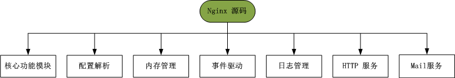

### Nginx 源码基本结构

       学习 Nginx 的构架之前，对 Nginx 源码结构进行简单的分析，可以了解 Nginx 模块结构以及模块之间的关系。充分理解Nginx 的基本构架。解压源码到相应的文件后，我们可以看到有一个存放源码的目录文件src，该目录文件存储Nginx 所有的源代码。首先，我们通过命令查看源码的组织结构：

```c
$ tree -L 1
.
├── core
├── event
├── http
├── mail
├── misc
└── os

6 directories, 0 files

```
  
       输出结果显示有 6 个目录文件，以下是这些目录文件的功能：

- core  ：Nginx的核心源代码，包括常用数据结构的以及Nginx 内核实现的核心代码；
- event：Nginx事件驱动模型，以及定时器的实现相关代码；
- http   ：Nginx 实现http 服务器相关的代码；
- mail  ：Nginx 实现邮件代理服务器相关的代码；
- misc ：辅助代码，测试C++头 的兼容性，以及对Google_PerfTools 的支持；
- os     ：不同体系统结构所提供的系统函数的封装，提供对外统一的系统调用接口；

       下面主要针对重要的三个目录进行简单的介绍：core 目录、http 目录、event 目录；

### core 核心模块结构

       core 目录中的源码定义了 Nginx 服务器最基本的数据结构以及最基本的核心模块（核心模块为其他模块提供了公共调用的基本功能）。首先看下该核心模块的源码结构：

```c
/* 实现对各模块的整体控制，是 Nginx 程序 main 函数 */
├── nginx.c
├── nginx.h
	
/* 以下是基本数据结构及其操作 */
├── ngx_array.c
├── ngx_array.h
├── ngx_hash.c
├── ngx_hash.h
├── ngx_list.c
├── ngx_list.h
├── ngx_queue.c
├── ngx_queue.h
├── ngx_radix_tree.c
├── ngx_radix_tree.h
├── ngx_rbtree.c
├── ngx_rbtree.h
├── ngx_output_chain.c
├── ngx_buf.c
├── ngx_buf.h
/* 整个Nginx 模块构架基本配置管理  */
├── ngx_conf_file.c
├── ngx_conf_file.h
├── ngx_config.h
/* 网络连接管理 */
├── ngx_connection.c
├── ngx_connection.h
/* 定义一些头文件与结构别名 */
├── ngx_core.h
├── ngx_cpuinfo.c
/* CRC 校验表信息 */
├── ngx_crc32.c
├── ngx_crc32.h
├── ngx_crc.h
/* 实现对系统运行过程参数、资源的通用管理 */
├── ngx_cycle.c
├── ngx_cycle.h
/* 实现文件读写相关的功能 */
├── ngx_file.c
├── ngx_file.h
/* socket 网络套接字功能 */
├── ngx_inet.c
├── ngx_inet.h
/* 实现日志输出、管理的相关功能 */
├── ngx_log.c
├── ngx_log.h
├── ngx_syslog.c
├── ngx_syslog.h
/* hash字符串操作 */
├── ngx_md5.c
├── ngx_md5.h
├── ngx_murmurhash.c
├── ngx_murmurhash.h
/* 内存管理相关文件 */
├── ngx_open_file_cache.c
├── ngx_open_file_cache.h
├── ngx_palloc.c
├── ngx_palloc.h
├── ngx_shmtx.c
├── ngx_shmtx.h
├── ngx_slab.c
├── ngx_slab.h
/* PCRE 上层封装 */
├── ngx_parse.c
├── ngx_parse.h
/* 反向代理的协议信息 */
├── ngx_proxy_protocol.c
├── ngx_proxy_protocol.h
/* 实现支持正则表达式 */
├── ngx_regex.c
├── ngx_regex.h
/* 字符串处理功能 */
├── ngx_string.c
├── ngx_string.h
/* 时间获取与管理功能 */
├── ngx_times.c
└── ngx_times.h
/* 其他文件 */
├── ngx_resolver.c
├── ngx_resolver.h
├── ngx_sha1.h
├── ngx_spinlock.c
├── ngx_crypt.c
├── ngx_crypt.h

```

### event 事件驱动模型结构

       event 目录里面包含一种子目录 module 以及一些文件，除了 module 子目录，其他文件提供了事件驱动模型相关数据结构的定义、初始化、事件接收、传递、管理功能以及事件驱动模型调用功能。module 子目录里面的源码实现了Nginx 支持的事件驱动模型：AIO、epoll、kqueue、select、/dev/poll、poll 等事件驱动模型； 

```c
.
├── modules
│   ├── ngx_aio_module.c           /* AIO 事件驱动模型 */
│   ├── ngx_devpoll_module.c       /* dev/poll 事件驱动模型 */
│   ├── ngx_epoll_module.c         /* epoll 事件驱动模型 */
│   ├── ngx_eventport_module.c     /* 事件驱动模型端口 */
│   ├── ngx_kqueue_module.c        /* kqueue 事件驱动模型 */
│   ├── ngx_poll_module.c          /* poll 事件驱动模型 */
│   ├── ngx_rtsig_module.c         /* rtsing 事件驱动模型 */
│   ├── ngx_select_module.c        /* Linux 平台下的 select 事件驱动模型 */
│   └── ngx_win32_select_module.c  /* Win32 平台下的 select 事件驱动模型 */
├── ngx_event_accept.c
├── ngx_event_busy_lock.c
├── ngx_event_busy_lock.h
├── ngx_event.c
├── ngx_event_connect.c
├── ngx_event_connect.h
├── ngx_event.h
├── ngx_event_mutex.c
├── ngx_event_openssl.c
├── ngx_event_openssl.h
├── ngx_event_openssl_stapling.c
├── ngx_event_pipe.c
├── ngx_event_pipe.h
├── ngx_event_posted.c
├── ngx_event_posted.h
├── ngx_event_timer.c
└── ngx_event_timer.h

1 directory, 26 files

```

### http 模块结构

       http 目录和 event 目录一样，通用包含了模块实现源码的 module 目录文件以及一些结构定义、初始化、网络连接建立、管理、关闭，以及数据报解析、服务器组管理等功能的源码文件。module 目录文件实现了HTTP 模块的功能。

```c
.
├── modules
├── ngx_http_busy_lock.c
├── ngx_http_busy_lock.h
├── ngx_http.c
├── ngx_http_cache.h
├── ngx_http_config.h
├── ngx_http_copy_filter_module.c
├── ngx_http_core_module.c
├── ngx_http_core_module.h
├── ngx_http_file_cache.c
├── ngx_http.h
├── ngx_http_header_filter_module.c
├── ngx_http_parse.c
├── ngx_http_parse_time.c
├── ngx_http_postpone_filter_module.c
├── ngx_http_request_body.c
├── ngx_http_request.c
├── ngx_http_request.h
├── ngx_http_script.c
├── ngx_http_script.h
├── ngx_http_spdy.c
├── ngx_http_spdy_filter_module.c
├── ngx_http_spdy.h
├── ngx_http_spdy_module.c
├── ngx_http_spdy_module.h
├── ngx_http_special_response.c
├── ngx_http_upstream.c
├── ngx_http_upstream.h
├── ngx_http_upstream_round_robin.c
├── ngx_http_upstream_round_robin.h
├── ngx_http_variables.c
├── ngx_http_variables.h
└── ngx_http_write_filter_module.c

1 directory, 32 files

```

### Nginx 源码的模块化结构

       根据各模块的功能，可把 Nginx 源码划分为以下几种功能，如下图所示：


  

- 核心模块功能：为其他模块提供一些基本功能：字符串处理、时间管理、文件读写等功能；
- 配置解析：主要包括文件语法检查、配置参数解析、参数初始化等功能；
- 内存管理：内存池管理、共享内存的分配、缓冲区管理等功能；
- 事件驱动：进程创建与管理、信号接收与处理、所有事件驱动模型的实现、高级 IO 等功能；
- 日志管理：错误日志的生成与管理、任务日志的生成与管理等功能；
- HTTP 服务：提供 Web 服务，包括客户度连接管理、客户端请求处理、虚拟主机管理、服务器组管理等功能；
- Mail 服务：与 HTTP 服务类似，但是增加了邮件协议的实现；