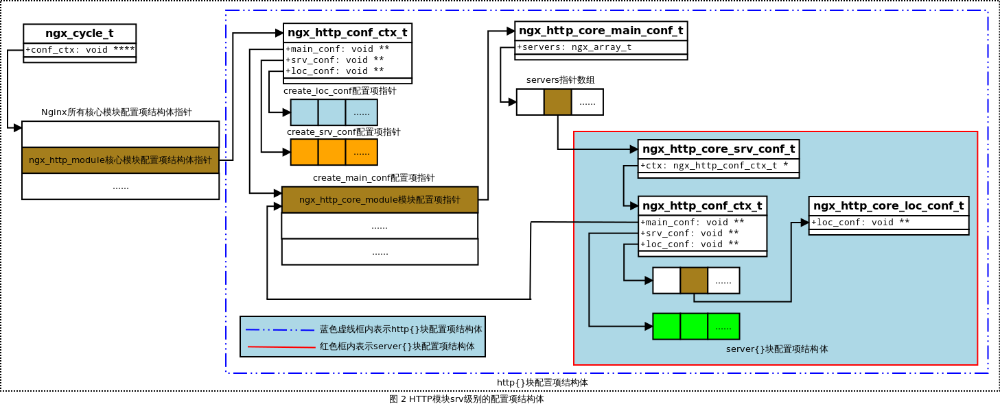
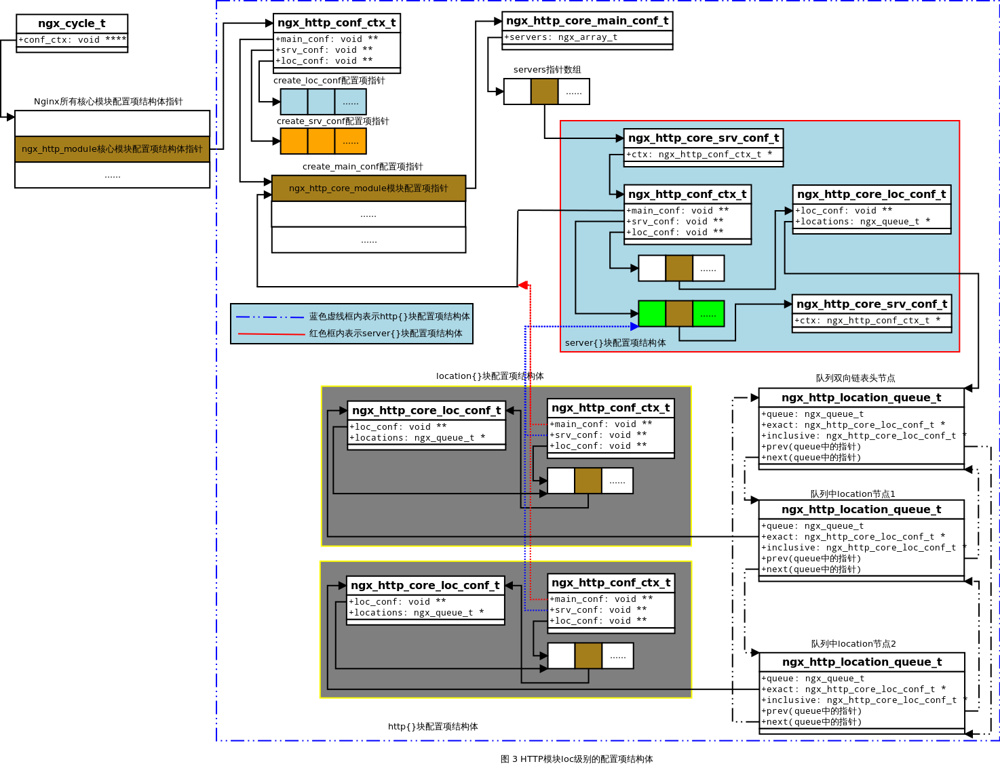
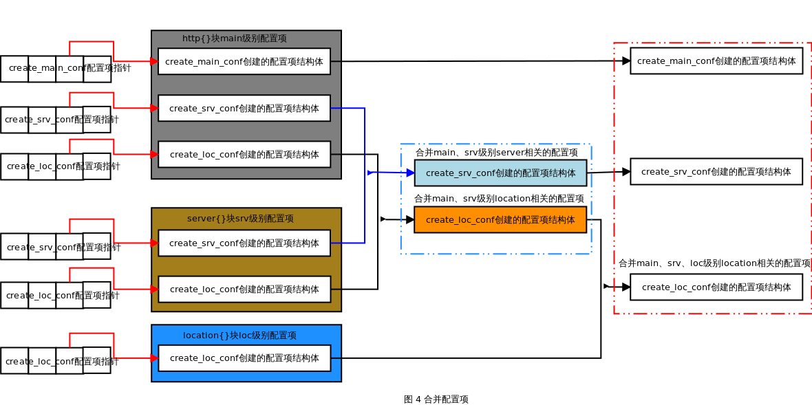

### 概述

       在前面的文章《 [Nginx 配置解析](http://blog.csdn.net/chenhanzhun/article/details/42615433)》简单讲解了通用模块的配置项解析，并且大概讲解了HTTP 模块的配置项解析过程，本文更具体的分析HTTP 模块的初始化过程。HTTP 模块初始化过程主要有：上下文结构初始化、配置项解析、配置项合并、server 相关端口设置。

### HTTP 模块接口

### ngx_http_module_t 结构体

       在 Nginx 中，结构体 ngx_module_t 是 Nginx 模块最基本的接口。对于每一种不同类型的模块，都有一个具体的结构体来描述这一类模块的通用接口。在Nginx 中定义了HTTP 模块的通用接口ngx_http_module_t 结构体，该结构体定义在文件[src/http/ngx_http_config.h](http://lxr.nginx.org/source/src/http/ngx_http_config.h)：我们把直属于http{}、server{}、location{} 块的配置项分别称为main、srv、loc 级别配置项。

```c
/* 所有HTTP模块的通用接口结构ngx_http_module_t */
typedef struct {
    /* 在解析http{}块内的配置项前回调 */
    ngx_int_t   (*preconfiguration)(ngx_conf_t *cf);
    /* 在解析http{}块内的配置项后回调 */
    ngx_int_t   (*postconfiguration)(ngx_conf_t *cf);

    /*
     * 创建用于存储HTTP全局配置项的结构体；
     * 该结构体中的成员将保存直属于http{}块的配置项参数；
     * 该方法在解析main配置项前调用；
     */
    void       *(*create_main_conf)(ngx_conf_t *cf);
    /* 解析完main配置项后回调 */
    char       *(*init_main_conf)(ngx_conf_t *cf, void *conf);

    /*
     * 创建用于存储可同时出现在main、srv级别配置项的结构体；
     * 该结构体中的成员与server配置是相关联的；
     */
    void       *(*create_srv_conf)(ngx_conf_t *cf);
    /*
     * 由create_srv_conf产生的结构体所要解析的配置项，
     * 可能同时出现在main、srv级别中，
     * merge_srv_conf 方法可以将出现在main级别中的配置项值合并到srv级别的配置项中；
     */
    char       *(*merge_srv_conf)(ngx_conf_t *cf, void *prev, void *conf);

    /*
     * 创建用于存储同时出现在main、srv、loc级别配置项的结构体，
     * 该结构体成员与location配置相关联；
     */
    void       *(*create_loc_conf)(ngx_conf_t *cf);
    /*
     * 由create_loc_conf 产生的结构体所要解析的配置项，
     * 可能同时出现在main、srv、loc级别的配置项中，
     * merge_loc_conf 方法将出现在main、srv级别的配置项值合并到loc级别的配置项中；
     */
    char       *(*merge_loc_conf)(ngx_conf_t *cf, void *prev, void *conf);
} ngx_http_module_t;

```

### ngx_http_conf_ctx_t 结构体

       在 HTTP 模块中，管理 HTTP 模块配置项的结构由 ngx_http_conf_ctx_t 实现，该结构有三个成员，分别指向三个指针数组，指针数组是由相应地 HTTP 模块create_main_conf、create_srv_conf、create_loc_conf 方法创建的结构体指针组成的数组。ngx_http_conf_ctx_t 结构体定义在文件[src/http/ngx_http_config.h](http://lxr.nginx.org/source/src/http/ngx_http_config.h) 中：

```c
/* HTTP框架的上下文结构体ngx_http_conf_ctx_t */
typedef struct {
    /*
     * 指向一个指针数组；
     * 数组中的每个成员都是由所有HTTP模块create_main_conf方法创建的存放全局配置项的结构体，
     * 它们存放着解析直属于http{}块内main级别的配置项参数；
     */
    void        **main_conf;
    /*
     * 指向一个指针数组；
     * 数组中的每个成员都是由所有HTTP模块create_srv_conf方法创建的与server相关的配置项结构体，
     * 它们存放着main级别，或srv级别的配置项参数；
     * 这与当前的ngx_http_conf_ctx_t是在解析http{}或server{}块时创建有关；
     */
    void        **srv_conf;
    /*
     * 指向一个指针数组；
     * 数组中的每个成员都是由所有HTTP模块create_loc_conf方法创建的与location有关的配置项结构体，
     * 它们存放着main级别、srv级别、loc级别的配置项参数；
     * 这样当前ngx_http_conf_ctx_t是在解析http{}、server{}或location{}块时创建有关；
     */
    void        **loc_conf;
} ngx_http_conf_ctx_t;

```

### ngx_http_module 核心模块

### ngx_http_module 核心模块定义

       ngx_http_module 是 HTTP 模块的核心模块，该模块的功能是：定义新的 HTTP 模块类型，并为每个HTTP 模块定义通用接口ngx_http_module_t 结构体，管理HTTP 模块生成的配置项结构体，并解析HTTP 类配置项。该模块定义在文件[src/http/ngx_http.c](http://lxr.nginx.org/source/src/http/ngx_http.c) 中：

```c
/* 定义http核心模块 */
ngx_module_t  ngx_http_module = {
    NGX_MODULE_V1,
    &amp;ngx_http_module_ctx,                  /* module context */
    ngx_http_commands,                     /* module directives */
    NGX_CORE_MODULE,                       /* module type */
    NULL,                                  /* init master */
    NULL,                                  /* init module */
    NULL,                                  /* init process */
    NULL,                                  /* init thread */
    NULL,                                  /* exit thread */
    NULL,                                  /* exit process */
    NULL,                                  /* exit master */
    NGX_MODULE_V1_PADDING
};

```

       ngx_http_module 作为核心模块，必须定义核心模块的通用接口上下文结构，其通用接口上下文结构定义在文件[src/http/ngx_http.c](http://lxr.nginx.org/source/src/http/ngx_http.c) 中：在 ngx_http_module 核心模块中只定义了 http 模块的名称。

```c
/* 定义核心模块的通用接口上下文结构 */
static ngx_core_module_t  ngx_http_module_ctx = {
    ngx_string("http"),
    NULL,
    NULL
};

```

       在 ngx_http_module 模块中定义了http{} 块感兴趣的配置项数组，配置项数组定义在文件[src/http/ngx_http.c](http://lxr.nginx.org/source/src/http/ngx_http.c) 中：

```c
/* 定义http模块感兴趣的配置项，即配置项指令数组 */
static ngx_command_t  ngx_http_commands[] = {

    { ngx_string("http"),
      NGX_MAIN_CONF|NGX_CONF_BLOCK|NGX_CONF_NOARGS,
      ngx_http_block,
      0,
      0,
      NULL },

      ngx_null_command
};

```

       从 ngx_http_module 模块的定义中可以知道，该模块只有一个初始化处理方法ngx_http_block，该处理方法是HTTP 模块的初始化作用。

### ngx_http_module 核心模块初始化

       在上面 ngx_http_module 模块的定义中已经知道，HTTP 模块的初始化过程由函数ngx_http_block 实现，首先先给出该函数的整体分析，接着对该函数进行具体的分析。该函数定义在文件[src/http/ngx_http.c](http://lxr.nginx.org/source/src/http/ngx_http.c) 中：

```c
/* HTTP框架初始化 */
static char *
ngx_http_block(ngx_conf_t *cf, ngx_command_t *cmd, void *conf)
{
    char                        *rv;
    ngx_uint_t                   mi, m, s;
    ngx_conf_t                   pcf;
    ngx_http_module_t           *module;
    ngx_http_conf_ctx_t         *ctx;
    ngx_http_core_loc_conf_t    *clcf;
    ngx_http_core_srv_conf_t   **cscfp;
    ngx_http_core_main_conf_t   *cmcf;

    /* the main http context */

    /* 分配HTTP框架的上下文结构ngx_http_conf_ctx_t 空间 */
    ctx = ngx_pcalloc(cf->pool, sizeof(ngx_http_conf_ctx_t));
    if (ctx == NULL) {
        return NGX_CONF_ERROR;
    }

    /*
     * conf 是结构体ngx_cycle_t 成员conf_ctx数组中的元素，
     * 该元素conf指向ngx_http_module模块所对应的配置项结构信息；
     */
    *(ngx_http_conf_ctx_t **) conf = ctx;

    /* count the number of the http modules and set up their indices */

    /* 初始化所有HTTP模块的ctx_index序号 */
    ngx_http_max_module = 0;
    for (m = 0; ngx_modules[m]; m++) {
        if (ngx_modules[m]->type != NGX_HTTP_MODULE) {
            continue;
        }

        ngx_modules[m]->ctx_index = ngx_http_max_module++;
    }

    /*
     * 分配存储HTTP模块main级别下的main_conf配置项的空间；
     */
    /* the http main_conf context, it is the same in the all http contexts */

    ctx->main_conf = ngx_pcalloc(cf->pool,
                                 sizeof(void *) * ngx_http_max_module);
    if (ctx->main_conf == NULL) {
        return NGX_CONF_ERROR;
    }

    /*
     * 分配存储HTTP模块main级别下的srv_conf配置项的空间；
     */
    /*
     * the http null srv_conf context, it is used to merge
     * the server{}s' srv_conf's
     */

    ctx->srv_conf = ngx_pcalloc(cf->pool, sizeof(void *) * ngx_http_max_module);
    if (ctx->srv_conf == NULL) {
        return NGX_CONF_ERROR;
    }

    /*
     * 分配存储HTTP模块main级别下的loc_conf配置项的空间；
     */
    /*
     * the http null loc_conf context, it is used to merge
     * the server{}s' loc_conf's
     */

    ctx->loc_conf = ngx_pcalloc(cf->pool, sizeof(void *) * ngx_http_max_module);
    if (ctx->loc_conf == NULL) {
        return NGX_CONF_ERROR;
    }

    /*
     * create the main_conf's, the null srv_conf's, and the null loc_conf's
     * of the all http modules
     */

    /*
     * 遍历所有HTTP模块，为每个HTTP模块创建main级别的配置项结构main_conf、srv_conf、loc_conf；
     */
    for (m = 0; ngx_modules[m]; m++) {
        if (ngx_modules[m]->type != NGX_HTTP_MODULE) {
            continue;
        }

        module = ngx_modules[m]->ctx;
        mi = ngx_modules[m]->ctx_index;

        /*
         * 调用create_main_conf创建main级别的配置项结构main_conf；
         */
        if (module->create_main_conf) {
            ctx->main_conf[mi] = module->create_main_conf(cf);
            if (ctx->main_conf[mi] == NULL) {
                return NGX_CONF_ERROR;
            }
        }

        /*
         * 调用create_srv_conf创建main级别的配置项结构srv_conf；
         */
        if (module->create_srv_conf) {
            ctx->srv_conf[mi] = module->create_srv_conf(cf);
            if (ctx->srv_conf[mi] == NULL) {
                return NGX_CONF_ERROR;
            }
        }

        /*
         * 调用create_loc_conf创建main级别的配置项结构loc_conf；
         */
        if (module->create_loc_conf) {
            ctx->loc_conf[mi] = module->create_loc_conf(cf);
            if (ctx->loc_conf[mi] == NULL) {
                return NGX_CONF_ERROR;
            }
        }
    }

    /*
     * 保存待解析配置项结构cf的副本为pcf，待解析完毕后恢复cf；
     * 这里备份是由于配置指令解析函数ngx_conf_parse递归调用，因此为了不影响外层的调用环境；
     */
    pcf = *cf;
    /*
     * 把HTTP模块解析指令的上下文参数保存到配置项结构ngx_http_conf_ctx_t ctx中；
     */
    cf->ctx = ctx;/* 值-结果 模式 */

    /* 遍历所有HTTP模块，并调用每个模块的preconfiguration回调函数 */
    for (m = 0; ngx_modules[m]; m++) {
        if (ngx_modules[m]->type != NGX_HTTP_MODULE) {
            continue;
        }

        module = ngx_modules[m]->ctx;

        if (module->preconfiguration) {
            if (module->preconfiguration(cf) != NGX_OK) {
                return NGX_CONF_ERROR;
            }
        }
    }

    /*
     * 调用模块通用配置项解析函数ngx_conf_parse解析http{}块内的指令；
     */
    /* parse inside the http{} block */

    cf->module_type = NGX_HTTP_MODULE;/* 模块类型为HTTP模块 */
    cf->cmd_type = NGX_HTTP_MAIN_CONF;/* 指令类型为HTTP模块的main级别指令 */
    /*
     * 开始解析http{}块内的指令；
     *      这里必须注意的是：http{}块内可能会包含server{}块，
     * 而server{}可能会包含location{}块，location{}块会嵌套location{}块；
     *      还需注意的是http{}块内可能有多个server{}块，
     * location{}块也可能有多个location{}块；
     * 因此，配置项解析函数ngx_conf_parse是被递归调用的；*/
    rv = ngx_conf_parse(cf, NULL);

    if (rv != NGX_CONF_OK) {
        goto failed;
    }

    /*
     * 解析完成http{}块内的所有指令后（包括server{}、location{}块的解析），
     * 进行下面的程序
     */
    /*
     * init http{} main_conf's, merge the server{}s' srv_conf's
     * and its location{}s' loc_conf's
     */

    /* 获取ngx_http_core_module模块的main_conf配置项结构 */
    cmcf = ctx->main_conf[ngx_http_core_module.ctx_index];
    /* 获取所有srv_conf配置项结构 */
    cscfp = cmcf->servers.elts;

    /*
     * 遍历所有HTTP模块，并初始化每个HTTP模块的main_conf结构，
     * 同时合并srv_conf 结构（当然srv_conf结构里面包含loc_conf结构，所有也合并loc_conf结构）；
     */
    for (m = 0; ngx_modules[m]; m++) {
        if (ngx_modules[m]->type != NGX_HTTP_MODULE) {
            continue;
        }

        /*
        * ngx_modules[m]是一个ngx_module_t模块结构体，
        * 它的ctx成员相对于HTTP模块来说是ngx_http_module_t接口；
        */
       module = ngx_modules[m]->ctx;
       /* 获取当前HTTP模块在HTTP模块类的序号 */
       mi = ngx_modules[m]->ctx_index;

        /* 初始化HTTP模块的main_conf结构 */
        /* init http{} main_conf's */

        if (module->init_main_conf) {
            rv = module->init_main_conf(cf, ctx->main_conf[mi]);
            if (rv != NGX_CONF_OK) {
                goto failed;
            }
        }

        /* 合并当前HTTP模块不同级别的配置项结构 */
        rv = ngx_http_merge_servers(cf, cmcf, module, mi);
        if (rv != NGX_CONF_OK) {
            goto failed;
        }
    }

    /* 以下是监听端口管理的内容 */

    /* 静态二叉查找树来保存location配置 */
    /* create location trees */

    /* 遍历http{}块下的所有server{}块 */
    for (s = 0; s < cmcf->servers.nelts; s++) {

        /* 获取server{}块下location{}块所对应的ngx_http_core_loc_conf_t loc_conf结构体 */
        clcf = cscfp[s]->ctx->loc_conf[ngx_http_core_module.ctx_index];

        /*
         * 将ngx_http_core_loc_conf_t 组成的双向链表按照location匹配字符串进行排序；
         * 注意：location{}块可能嵌套location{}块，所以该函数是递归调用；
         */
        if (ngx_http_init_locations(cf, cscfp[s], clcf) != NGX_OK) {
            return NGX_CONF_ERROR;
        }

        /*
         * 按照已排序的location{}的双向链表构建静态的二叉查找树，
         * 该方法也是递归调用；
         */
        if (ngx_http_init_static_location_trees(cf, clcf) != NGX_OK) {
            return NGX_CONF_ERROR;
        }
    }

    /* 初始化可添加自定义处理方法的7个HTTP阶段的动态数组 */
    if (ngx_http_init_phases(cf, cmcf) != NGX_OK) {
        return NGX_CONF_ERROR;
    }

    /* 将HTTP请求的头部header初始化成hash结构 */
    if (ngx_http_init_headers_in_hash(cf, cmcf) != NGX_OK) {
        return NGX_CONF_ERROR;
    }

    /* 调用所有HTTP模块的postconfiguration方法 */
    for (m = 0; ngx_modules[m]; m++) {
        if (ngx_modules[m]->type != NGX_HTTP_MODULE) {
            continue;
        }

        module = ngx_modules[m]->ctx;

        if (module->postconfiguration) {
            if (module->postconfiguration(cf) != NGX_OK) {
                return NGX_CONF_ERROR;
            }
        }
    }

    if (ngx_http_variables_init_vars(cf) != NGX_OK) {
        return NGX_CONF_ERROR;
    }

    /*
     * http{}'s cf->ctx was needed while the configuration merging
     * and in postconfiguration process
     */

    *cf = pcf;

    /* 初始化phase_engine_handlers数组 */
    if (ngx_http_init_phase_handlers(cf, cmcf) != NGX_OK) {
        return NGX_CONF_ERROR;
    }

    /* optimize the lists of ports, addresses and server names */

    /* 设置server与监听端口的关系，并设置新连接事件的处理方法 */
    if (ngx_http_optimize_servers(cf, cmcf, cmcf->ports) != NGX_OK) {
        return NGX_CONF_ERROR;
    }

    return NGX_CONF_OK;

failed:

    *cf = pcf;

    return rv;
}

```

       从上面的分析中可以总结出 HTTP 模块初始化的流程如下：

- Nginx 进程进入主循环，在主循环中调用配置解析器解析配置文件*nginx.conf*;
- 在配置文件中遇到 http{} 块配置，则 HTTP 框架开始初始化并启动，其由函数 ngx_http_block() 实现；

- HTTP 框架初始化所有 HTTP 模块的序列号，并创建 3 个类型为 *ngx_http_conf_ctx_t *结构的数组用于存储所有HTTP 模块的*create_main_conf*、*create_srv_conf*、*create_loc_conf*方法返回的指针地址；
- 调用每个 HTTP 模块的 preconfiguration 方法；
- HTTP 框架调用函数 ngx_conf_parse() 开始循环解析配置文件 *nginx.conf *中的http{}块里面的所有配置项，http{} 块内可嵌套多个server{} 块，而 server{} 块可嵌套多个 location{}，location{} 依旧可以嵌套location{}，因此配置项解析函数是递归调用；
- HTTP 框架处理完毕 http{} 配置项，根据解析配置项的结果，必要时调用ngx_http_merge_servers 方法进行配置项合并处理，即合并main、srv、loc 级别下server、location 相关的配置项；
- 初始化可添加处理方法的 HTTP 阶段的动态数组；
- 调用所有 HTTP 模块的 postconfiguration 方法使 HTTP 模块可以处理HTTP 阶段，即将HTTP 模块的ngx_http_handler_pt 处理方法添加到HTTP 阶段中；
- 根据 HTTP 模块处理 HTTP 阶段的方法构造 phase_engine_handlers 数组；
- 构造 server 相关的监听端口，并设置新连接事件的回调方法为ngx_http_init_connection ；

- 继续处理其他 http{} 块之外的配置项，直到配置文件解析器处理完所有配置项后通知Nginx 主循环配置项解析完毕。此时，Nginx 才会启动Web 服务器；

### ngx_http_core_module 模块

### ngx_http_core_main_conf_t 结构体

       在初始化 HTTP 模块的过程中，会调用配置项解析函数ngx_conf_parse 解析http{} 块内的配置项，当遇到server{} 块、location{} 块配置项时，此时会调用配置项解析函数解析server{} 和location{} 块，在解析这两个配置块的过程中依旧会创建属于该块的配置项结构srv_conf、loc_conf，因此就会导致与http{} 块所创建的配置项结构体重复，这时候就需要对这些配置项进行管理与合并。首先先看下结构体ngx_http_core_main_conf_t，ngx_http_core_main_conf_t 是ngx_http_core_module 的 main_conf，存储了 http{} 层的配置参数。该结构体定义在文件[src/http/ngx_http_core_module.h](http://lxr.nginx.org/source/src/http/ngx_http_core_module.h)中：

```c
/* ngx_http_core_main_conf_t 结构体 */
typedef struct {
    /* 指针数组，每个指针指向表示server{}块的ngx_http_core_srv_conf_t结构体地址 */
    ngx_array_t                servers;         /* ngx_http_core_srv_conf_t */

    /* 各HTTP阶段处理方法构成的phases数组构建的阶段索引 */
    ngx_http_phase_engine_t    phase_engine;

    ngx_hash_t                 headers_in_hash;

    ngx_hash_t                 variables_hash;

    ngx_array_t                variables;       /* ngx_http_variable_t */
    ngx_uint_t                 ncaptures;

    /* 配置项中散列桶bucket最大数量 */
    ngx_uint_t                 server_names_hash_max_size;
    /* 配置项中每个散列桶bucket占用内存的最大值 */
    ngx_uint_t                 server_names_hash_bucket_size;

    ngx_uint_t                 variables_hash_max_size;
    ngx_uint_t                 variables_hash_bucket_size;

    ngx_hash_keys_arrays_t    *variables_keys;

    /* 存放http{}配置块下监听的所有ngx_http_conf_port_t 端口*/
    ngx_array_t               *ports;

    ngx_uint_t                 try_files;       /* unsigned  try_files:1 */

    /*
     * 在HTTP模块初始化时，使各HTTP模块在HTTP阶段添加处理方法，
     * 数组中每一个成员ngx_http_phase_t结构对应一个HTTP阶段；
     */
    ngx_http_phase_t           phases[NGX_HTTP_LOG_PHASE + 1];
} ngx_http_core_main_conf_t;

```

### ngx_http_core_srv_conf_t 结构体

       结构体 ngx_http_core_srv_conf_t，ngx_http_core_srv_conf_t 是ngx_http_core_module 的srv_conf，存储了server{} 层的配置参数。该结构体定义在文件[src/http/ngx_http_core_module.h](http://lxr.nginx.org/source/src/http/ngx_http_core_module.h)中：

```c
/* ngx_http_core_srv_conf_t结构体 */
typedef struct {
    /* array of the ngx_http_server_name_t, "server_name" directive */
    ngx_array_t                 server_names;

    /* server ctx */
    /* 指向当前server{}块所属的ngx_http_conf_ctx_t结构体 */
    ngx_http_conf_ctx_t        *ctx;

    /* 当前server{}块的虚拟主机名 */
    ngx_str_t                   server_name;

    size_t                      connection_pool_size;
    size_t                      request_pool_size;
    size_t                      client_header_buffer_size;

    ngx_bufs_t                  large_client_header_buffers;

    ngx_msec_t                  client_header_timeout;

    ngx_flag_t                  ignore_invalid_headers;
    ngx_flag_t                  merge_slashes;
    ngx_flag_t                  underscores_in_headers;

    unsigned                    listen:1;
#if (NGX_PCRE)
    unsigned                    captures:1;
#endif

    ngx_http_core_loc_conf_t  **named_locations;
} ngx_http_core_srv_conf_t;

```

### ngx_http_core_loc_conf_t 结构体

       结构体 ngx_http_core_loc_conf_t，ngx_http_core_loc_conf_t 是ngx_http_core_module 的loc_conf，存储了location{} 层的配置参数。该结构体定义在文件[src/http/ngx_http_core_module.h](http://lxr.nginx.org/source/src/http/ngx_http_core_module.h)中：

```c
struct ngx_http_core_loc_conf_s {
    /* location名称，即nginx.conf配置文件中location后面的表达式 */
    ngx_str_t     name;          /* location name */

#if (NGX_PCRE)
    ngx_http_regex_t  *regex;
#endif

    unsigned      noname:1;   /* "if () {}" block or limit_except */
    unsigned      lmt_excpt:1;
    unsigned      named:1;

    unsigned      exact_match:1;
    unsigned      noregex:1;

    unsigned      auto_redirect:1;
#if (NGX_HTTP_GZIP)
    unsigned      gzip_disable_msie6:2;
#if (NGX_HTTP_DEGRADATION)
    unsigned      gzip_disable_degradation:2;
#endif
#endif

    ngx_http_location_tree_node_t   *static_locations;
#if (NGX_PCRE)
    ngx_http_core_loc_conf_t       **regex_locations;
#endif

    /* 指向所属location{}块内ngx_http_conf_ctx_t 结构体中的loc_conf指针数组 */
    /* pointer to the modules' loc_conf */
    void        **loc_conf;

    uint32_t      limit_except;
    void        **limit_except_loc_conf;

    ngx_http_handler_pt  handler;

    /* location name length for inclusive location with inherited alias */
    size_t        alias;
    ngx_str_t     root;                    /* root, alias */
    ngx_str_t     post_action;

    ngx_array_t  *root_lengths;
    ngx_array_t  *root_values;

    ngx_array_t  *types;
    ngx_hash_t    types_hash;
    ngx_str_t     default_type;

    off_t         client_max_body_size;    /* client_max_body_size */
    off_t         directio;                /* directio */
    off_t         directio_alignment;      /* directio_alignment */

    size_t        client_body_buffer_size; /* client_body_buffer_size */
    size_t        send_lowat;              /* send_lowat */
    size_t        postpone_output;         /* postpone_output */
    size_t        limit_rate;              /* limit_rate */
    size_t        limit_rate_after;        /* limit_rate_after */
    size_t        sendfile_max_chunk;      /* sendfile_max_chunk */
    size_t        read_ahead;              /* read_ahead */

    ngx_msec_t    client_body_timeout;     /* client_body_timeout */
    ngx_msec_t    send_timeout;            /* send_timeout */
    ngx_msec_t    keepalive_timeout;       /* keepalive_timeout */
    ngx_msec_t    lingering_time;          /* lingering_time */
    ngx_msec_t    lingering_timeout;       /* lingering_timeout */
    ngx_msec_t    resolver_timeout;        /* resolver_timeout */

    ngx_resolver_t  *resolver;             /* resolver */

    time_t        keepalive_header;        /* keepalive_timeout */

    ngx_uint_t    keepalive_requests;      /* keepalive_requests */
    ngx_uint_t    keepalive_disable;       /* keepalive_disable */
    ngx_uint_t    satisfy;                 /* satisfy */
    ngx_uint_t    lingering_close;         /* lingering_close */
    ngx_uint_t    if_modified_since;       /* if_modified_since */
    ngx_uint_t    max_ranges;              /* max_ranges */
    ngx_uint_t    client_body_in_file_only; /* client_body_in_file_only */

    ngx_flag_t    client_body_in_single_buffer;
                                           /* client_body_in_singe_buffer */
    ngx_flag_t    internal;                /* internal */
    ngx_flag_t    sendfile;                /* sendfile */
#if (NGX_HAVE_FILE_AIO)
    ngx_flag_t    aio;                     /* aio */
#endif
    ngx_flag_t    tcp_nopush;              /* tcp_nopush */
    ngx_flag_t    tcp_nodelay;             /* tcp_nodelay */
    ngx_flag_t    reset_timedout_connection; /* reset_timedout_connection */
    ngx_flag_t    server_name_in_redirect; /* server_name_in_redirect */
    ngx_flag_t    port_in_redirect;        /* port_in_redirect */
    ngx_flag_t    msie_padding;            /* msie_padding */
    ngx_flag_t    msie_refresh;            /* msie_refresh */
    ngx_flag_t    log_not_found;           /* log_not_found */
    ngx_flag_t    log_subrequest;          /* log_subrequest */
    ngx_flag_t    recursive_error_pages;   /* recursive_error_pages */
    ngx_flag_t    server_tokens;           /* server_tokens */
    ngx_flag_t    chunked_transfer_encoding; /* chunked_transfer_encoding */
    ngx_flag_t    etag;                    /* etag */

#if (NGX_HTTP_GZIP)
    ngx_flag_t    gzip_vary;               /* gzip_vary */

    ngx_uint_t    gzip_http_version;       /* gzip_http_version */
    ngx_uint_t    gzip_proxied;            /* gzip_proxied */

#if (NGX_PCRE)
    ngx_array_t  *gzip_disable;            /* gzip_disable */
#endif
#endif

#if (NGX_HAVE_OPENAT)
    ngx_uint_t    disable_symlinks;        /* disable_symlinks */
    ngx_http_complex_value_t  *disable_symlinks_from;
#endif

    ngx_array_t  *error_pages;             /* error_page */
    ngx_http_try_file_t    *try_files;     /* try_files */

    ngx_path_t   *client_body_temp_path;   /* client_body_temp_path */

    ngx_open_file_cache_t  *open_file_cache;
    time_t        open_file_cache_valid;
    ngx_uint_t    open_file_cache_min_uses;
    ngx_flag_t    open_file_cache_errors;
    ngx_flag_t    open_file_cache_events;

    ngx_log_t    *error_log;

    ngx_uint_t    types_hash_max_size;
    ngx_uint_t    types_hash_bucket_size;

    /* 将同一个server{}块内多个表达location{}块的ngx_http_core_loc_conf_t 结构体以双向链表方式组织，
     * 该指针指向ngx_http_location_queue_t结构体
     */
    ngx_queue_t  *locations;

#if 0
    ngx_http_core_loc_conf_t  *prev_location;
#endif
};

typedef struct{

      /* 作为ngx_queue_t 双向链表容器，将ngx_http_location_queue_t结构体连接起来 */
      ngx_queue_t queue;

      /* 若location中字符串可以精确匹配（包括正则表达式），
       * exact将指向对应的ngx_http_core_loc_conf_t结构体，否则为NULL
       */
       ngx_http_core_loc_conf_t *exact;

       /* 若location中字符串无精确匹配（包括自定义通配符），
       * inclusive将指向对应的ngx_http_core_loc_conf_t结构体，否则为NULL
       */
       ngx_http_core_loc_conf_t *inclusive;

       /* 指向location的名称 */
       ngx_str_t *name;
       ...

}ngx_http_location_queue_t; 

```

### ngx_http_core_module 模块定义

       ngx_http_core_module 模块是HTTP 模块中的第一个模块，该模块管理srv、loc 级别的配置项结构。该模块在文件[src/http/ngx_http_core_module.c](http://lxr.nginx.org/source/src/http/ngx_http_core_module.c)中定义：

```c
ngx_module_t  ngx_http_core_module = {
    NGX_MODULE_V1,
    &amp;ngx_http_core_module_ctx,             /* module context */
    ngx_http_core_commands,                /* module directives */
    NGX_HTTP_MODULE,                       /* module type */
    NULL,                                  /* init master */
    NULL,                                  /* init module */
    NULL,                                  /* init process */
    NULL,                                  /* init thread */
    NULL,                                  /* exit thread */
    NULL,                                  /* exit process */
    NULL,                                  /* exit master */
    NGX_MODULE_V1_PADDING
};

```

       在模块的定义中，其中定义了 HTTP 模块的上下文结构ngx_http_core_module_ctx，该上下文结构体定义如下：

```c
static ngx_http_module_t  ngx_http_core_module_ctx = {
    ngx_http_core_preconfiguration,        /* preconfiguration */
    NULL,                                  /* postconfiguration */

    ngx_http_core_create_main_conf,        /* create main configuration */
    ngx_http_core_init_main_conf,          /* init main configuration */

    ngx_http_core_create_srv_conf,         /* create server configuration */
    ngx_http_core_merge_srv_conf,          /* merge server configuration */

    ngx_http_core_create_loc_conf,         /* create location configuration */
    ngx_http_core_merge_loc_conf           /* merge location configuration */
};

```

       由于该模块中感兴趣的配置项太多，这里只列出 server、location 配置项。定义如下：

```c
    ...

    { ngx_string("server"),
      NGX_HTTP_MAIN_CONF|NGX_CONF_BLOCK|NGX_CONF_NOARGS,
      ngx_http_core_server,
      0,
      0,
      NULL },

    ...

    { ngx_string("location"),
      NGX_HTTP_SRV_CONF|NGX_HTTP_LOC_CONF|NGX_CONF_BLOCK|NGX_CONF_TAKE12,
      ngx_http_core_location,
      NGX_HTTP_SRV_CONF_OFFSET,
      0,
      NULL },

      ...
      ngx_null_command
};

```

### 管理 HTTP 模块不同级别的配置项结构体

       在 HTTP 模块的 http{} 配置项解析过程中，可能遇到多个嵌套 server{} 块以及location{}，不同块之间的解析都会创建相应的结构体保存配置项参数，但是由于属于嵌套关系，所有必须管理好不同块之间的配置项结构体，方便解析完毕后合并相应的配置项，以下针对不同级别的配置项结构体进行分析。

### 获取不同级别配置项结构

       根据不同结构体变量的参数获取不同级别的配置项结构体由宏定义实现，在文件 [src/http/ngx_http_config.h](http://lxr.nginx.org/source/src/http/ngx_http_config.h)中定义如下：

```c
/* 利用结构体变量ngx_http_request_t r获取HTTP模块main、srv、loc级别的配置项结构体 */
#define ngx_http_get_module_main_conf(r, module)                             \
    (r)->main_conf[module.ctx_index]
#define ngx_http_get_module_srv_conf(r, module)  (r)->srv_conf[module.ctx_index]
#define ngx_http_get_module_loc_conf(r, module)  (r)->loc_conf[module.ctx_index]

/* 利用结构体变量ngx_conf_t cf获取HTTP模块的main、srv、loc级别的配置项结构体 */
#define ngx_http_conf_get_module_main_conf(cf, module)                        \
    ((ngx_http_conf_ctx_t *) cf->ctx)->main_conf[module.ctx_index]
#define ngx_http_conf_get_module_srv_conf(cf, module)                         \
    ((ngx_http_conf_ctx_t *) cf->ctx)->srv_conf[module.ctx_index]
#define ngx_http_conf_get_module_loc_conf(cf, module)                         \
    ((ngx_http_conf_ctx_t *) cf->ctx)->loc_conf[module.ctx_index]

/* 利用全局变量ngx_cycle_t cycle获取HTTP模块的main级别配置项结构体 */
#define ngx_http_cycle_get_module_main_conf(cycle, module)                    \
    (cycle->conf_ctx[ngx_http_module.index] ?                                 \
        ((ngx_http_conf_ctx_t *) cycle->conf_ctx[ngx_http_module.index])      \
            ->main_conf[module.ctx_index]:                                    \
        NULL)

```

### main 级别的配置项结构体

       在 ngx_http_module 模块 http{} 块配置项解析的初始化过程中由函数 ngx_http_block 实现，在实现过程中创建并初始化了HTTP 模块main 级别的配置项main_conf、srv_conf、loc_conf 结构体。main 级别的配置项结构体之间的关系如下图所示：


### server 级别的配置项结构体

       在 ngx_http_module 模块在调用函数ngx_conf_parse 解析 http{} 块main 级别配置项时，若遇到server{} 块配置项，则会递归调用函数ngx_conf_parse 解析ngx_http_core_module 模块中 server{} 块配置项，并调用方法ngx_http_core_server 初始化server{} 块 ，该方法创建并初始化了HTTP 模块srv 级别的配置项srv_conf、loc_conf 结构体。server{} 块配置项的初始化函数创建配置项结构体的源码如下所示：

```c
static char *
ngx_http_core_server(ngx_conf_t *cf, ngx_command_t *cmd, void *dummy)
{
    char                        *rv;
    void                        *mconf;
    ngx_uint_t                   i;
    ngx_conf_t                   pcf;
    ngx_http_module_t           *module;
    struct sockaddr_in          *sin;
    ngx_http_conf_ctx_t         *ctx, *http_ctx;
    ngx_http_listen_opt_t        lsopt;
    ngx_http_core_srv_conf_t    *cscf, **cscfp;
    ngx_http_core_main_conf_t   *cmcf;

    /* 分配HTTP框架的上下文结构ngx_http_conf_ctx_t */
    ctx = ngx_pcalloc(cf->pool, sizeof(ngx_http_conf_ctx_t));
    if (ctx == NULL) {
        return NGX_CONF_ERROR;
    }

    /* 其中main_conf将指向所属于http{}块下ngx_http_conf_ctx_t 结构体的main_conf指针数组 */
    http_ctx = cf->ctx;
    ctx->main_conf = http_ctx->main_conf;

    /* the server{}'s srv_conf */

    /* 分配存储HTTP模块srv级别下的srv_conf配置项空间 */
    ctx->srv_conf = ngx_pcalloc(cf->pool, sizeof(void *) * ngx_http_max_module);
    if (ctx->srv_conf == NULL) {
        return NGX_CONF_ERROR;
    }

    /* the server{}'s loc_conf */

    /* 分配存储HTTP模块srv级别下的loc_conf配置项空间 */
    ctx->loc_conf = ngx_pcalloc(cf->pool, sizeof(void *) * ngx_http_max_module);
    if (ctx->loc_conf == NULL) {
        return NGX_CONF_ERROR;
    }

    /* 遍历所有HTTP模块，为每个模块创建srv级别的配置项结构srv_conf、loc_conf */
    for (i = 0; ngx_modules[i]; i++) {
        if (ngx_modules[i]->type != NGX_HTTP_MODULE) {
            continue;
        }

        module = ngx_modules[i]->ctx;

        /* 调用create_srv_conf创建srv级别的配置项结构srv_conf */
        if (module->create_srv_conf) {
            mconf = module->create_srv_conf(cf);
            if (mconf == NULL) {
                return NGX_CONF_ERROR;
            }

            ctx->srv_conf[ngx_modules[i]->ctx_index] = mconf;
        }

        /* 调用create_loc_conf创建srv级别的配置项结构loc_conf */
        if (module->create_loc_conf) {
            mconf = module->create_loc_conf(cf);
            if (mconf == NULL) {
                return NGX_CONF_ERROR;
            }

            ctx->loc_conf[ngx_modules[i]->ctx_index] = mconf;
        }
    }

    /*
     * 将属于当前server{}块的ngx_http_core_srv_conf_t 添加到
     * 结构体ngx_http_core_main_conf_t成员servers的动态数组中；
     */
    /* the server configuration context */

    cscf = ctx->srv_conf[ngx_http_core_module.ctx_index];
    cscf->ctx = ctx;

    cmcf = ctx->main_conf[ngx_http_core_module.ctx_index];

    cscfp = ngx_array_push(&amp;cmcf->servers);
    if (cscfp == NULL) {
        return NGX_CONF_ERROR;
    }

    *cscfp = cscf;

    /* 解析当前server{}块下的全部srv级别的配置项 */
    /* parse inside server{} */

    pcf = *cf;
    cf->ctx = ctx;
    cf->cmd_type = NGX_HTTP_SRV_CONF;

    rv = ngx_conf_parse(cf, NULL);

    /* 设置listen监听端口 */
    *cf = pcf;

    if (rv == NGX_CONF_OK &amp;&amp; !cscf->listen) {
        ngx_memzero(&amp;lsopt, sizeof(ngx_http_listen_opt_t));

        sin = &amp;lsopt.u.sockaddr_in;

        sin->sin_family = AF_INET;
#if (NGX_WIN32)
        sin->sin_port = htons(80);
#else
        sin->sin_port = htons((getuid() == 0) ? 80 : 8000);
#endif
        sin->sin_addr.s_addr = INADDR_ANY;

        lsopt.socklen = sizeof(struct sockaddr_in);

        lsopt.backlog = NGX_LISTEN_BACKLOG;
        lsopt.rcvbuf = -1;
        lsopt.sndbuf = -1;
#if (NGX_HAVE_SETFIB)
        lsopt.setfib = -1;
#endif
#if (NGX_HAVE_TCP_FASTOPEN)
        lsopt.fastopen = -1;
#endif
        lsopt.wildcard = 1;

        (void) ngx_sock_ntop(&amp;lsopt.u.sockaddr, lsopt.socklen, lsopt.addr,
                             NGX_SOCKADDR_STRLEN, 1);

        if (ngx_http_add_listen(cf, cscf, &amp;lsopt) != NGX_OK) {
            return NGX_CONF_ERROR;
        }
    }

    return rv;
}

```

srv 级别的配置项结构体之间的关系如下图所示：



### location 级别的配置项结构体

       在 ngx_http_core_module 模块在调用函数ngx_conf_parse 解析 server{} 块srv 级别配置项时，若遇到 location{} 块配置项，则会递归调用函数ngx_conf_parse 解析ngx_http_core_module 模块中 location{} 块配置项，并调用方法ngx_http_core_location 初始化location{} 块 ，该方法创建并初始化了HTTP 模块loc 级别的配置项loc_conf 结构体。location{} 块配置项的初始化函数创建配置项结构体的源码如下所示：

```c
static char *
ngx_http_core_location(ngx_conf_t *cf, ngx_command_t *cmd, void *dummy)
{
    char                      *rv;
    u_char                    *mod;
    size_t                     len;
    ngx_str_t                 *value, *name;
    ngx_uint_t                 i;
    ngx_conf_t                 save;
    ngx_http_module_t         *module;
    ngx_http_conf_ctx_t       *ctx, *pctx;
    ngx_http_core_loc_conf_t  *clcf, *pclcf;

    /* 分配HTTP框架的上下文结构ngx_http_conf_ctx_t */
    ctx = ngx_pcalloc(cf->pool, sizeof(ngx_http_conf_ctx_t));
    if (ctx == NULL) {
        return NGX_CONF_ERROR;
    }

    /*
     * 其中main_conf、srv_conf将指向所属于server{}块下ngx_http_conf_ctx_t 结构体
     * 的main_conf、srv_conf指针数组；
     */
    pctx = cf->ctx;
    ctx->main_conf = pctx->main_conf;
    ctx->srv_conf = pctx->srv_conf;

    /* 分配存储HTTP模块loc级别下的loc_conf配置项空间 */
    ctx->loc_conf = ngx_pcalloc(cf->pool, sizeof(void *) * ngx_http_max_module);
    if (ctx->loc_conf == NULL) {
        return NGX_CONF_ERROR;
    }

    /* 遍历所有HTTP模块，为每个模块创建loc级别的配置项结构体loc_conf */
    for (i = 0; ngx_modules[i]; i++) {
        if (ngx_modules[i]->type != NGX_HTTP_MODULE) {
            continue;
        }

        module = ngx_modules[i]->ctx;

        /* 调用模块的create_loc_conf创建loc级别的配置项结构体loc_conf */
        if (module->create_loc_conf) {
            ctx->loc_conf[ngx_modules[i]->ctx_index] =
                                                   module->create_loc_conf(cf);
            /* 将loc_conf配置项结构体按照ctx_index顺序保存到loc_conf指针数组中 */
            if (ctx->loc_conf[ngx_modules[i]->ctx_index] == NULL) {
                 return NGX_CONF_ERROR;
            }
        }
    }

    clcf = ctx->loc_conf[ngx_http_core_module.ctx_index];
    clcf->loc_conf = ctx->loc_conf;

    value = cf->args->elts;

    /* 以下是对正则表达式的处理 */
    if (cf->args->nelts == 3) {

        len = value[1].len;
        mod = value[1].data;
        name = &amp;value[2];

        if (len == 1 &amp;&amp; mod[0] == '=') {

            clcf->name = *name;
            clcf->exact_match = 1;

        } else if (len == 2 &amp;&amp; mod[0] == '^' &amp;&amp; mod[1] == '~') {

            clcf->name = *name;
            clcf->noregex = 1;

        } else if (len == 1 &amp;&amp; mod[0] == '~') {

            if (ngx_http_core_regex_location(cf, clcf, name, 0) != NGX_OK) {
                return NGX_CONF_ERROR;
            }

        } else if (len == 2 &amp;&amp; mod[0] == '~' &amp;&amp; mod[1] == '*') {

            if (ngx_http_core_regex_location(cf, clcf, name, 1) != NGX_OK) {
                return NGX_CONF_ERROR;
            }

        } else {
            ngx_conf_log_error(NGX_LOG_EMERG, cf, 0,
                               "invalid location modifier \"%V\"", &amp;value[1]);
            return NGX_CONF_ERROR;
        }

    } else {

        name = &amp;value[1];

        if (name->data[0] == '=') {

            clcf->name.len = name->len - 1;
            clcf->name.data = name->data + 1;
            clcf->exact_match = 1;

        } else if (name->data[0] == '^' &amp;&amp; name->data[1] == '~') {

            clcf->name.len = name->len - 2;
            clcf->name.data = name->data + 2;
            clcf->noregex = 1;

        } else if (name->data[0] == '~') {

            name->len--;
            name->data++;

            if (name->data[0] == '*') {

                name->len--;
                name->data++;

                if (ngx_http_core_regex_location(cf, clcf, name, 1) != NGX_OK) {
                    return NGX_CONF_ERROR;
                }

            } else {
                if (ngx_http_core_regex_location(cf, clcf, name, 0) != NGX_OK) {
                    return NGX_CONF_ERROR;
                }
            }

        } else {

            clcf->name = *name;

            if (name->data[0] == '@') {
                clcf->named = 1;
            }
        }
    }

    pclcf = pctx->loc_conf[ngx_http_core_module.ctx_index];

    if (pclcf->name.len) {

        /* nested location */

#if 0
        clcf->prev_location = pclcf;
#endif

        if (pclcf->exact_match) {
            ngx_conf_log_error(NGX_LOG_EMERG, cf, 0,
                               "location \"%V\" cannot be inside "
                               "the exact location \"%V\"",
                               &amp;clcf->name, &amp;pclcf->name);
            return NGX_CONF_ERROR;
        }

        if (pclcf->named) {
            ngx_conf_log_error(NGX_LOG_EMERG, cf, 0,
                               "location \"%V\" cannot be inside "
                               "the named location \"%V\"",
                               &amp;clcf->name, &amp;pclcf->name);
            return NGX_CONF_ERROR;
        }

        if (clcf->named) {
            ngx_conf_log_error(NGX_LOG_EMERG, cf, 0,
                               "named location \"%V\" can be "
                               "on the server level only",
                               &amp;clcf->name);
            return NGX_CONF_ERROR;
        }

        len = pclcf->name.len;

#if (NGX_PCRE)
        if (clcf->regex == NULL
            &amp;&amp; ngx_filename_cmp(clcf->name.data, pclcf->name.data, len) != 0)
#else
        if (ngx_filename_cmp(clcf->name.data, pclcf->name.data, len) != 0)
#endif
        {
            ngx_conf_log_error(NGX_LOG_EMERG, cf, 0,
                               "location \"%V\" is outside location \"%V\"",
                               &amp;clcf->name, &amp;pclcf->name);
            return NGX_CONF_ERROR;
        }
    }

    /* 将ngx_http_location_queue_t添加到双向链表中 */
    if (ngx_http_add_location(cf, &amp;pclcf->locations, clcf) != NGX_OK) {
        return NGX_CONF_ERROR;
    }

    save = *cf;
    cf->ctx = ctx;
    cf->cmd_type = NGX_HTTP_LOC_CONF;

    /* 解析当前location{}块下的所有loc级别配置项 */
    rv = ngx_conf_parse(cf, NULL);

    *cf = save;

    return rv;
}

```

       loc 级别的配置项结构体之间的关系如下图所示：若 location 是精确匹配、正则表达式、@命名则exact 字段有效，否则就是 inclusive 字段有效，画图过程中只画出exact 字段有效。


  

### 合并配置项

       HTTP 框架解析完毕 http{} 块配置项时，会根据解析的结果进行合并配置项操作，即合并 http{}、server{}、location{} 不同级别下各 HTTP 模块生成的存放配置项的结构体。其合并过程在文件[src/http/ngx_http.c](http://lxr.nginx.org/source/src/http/ngx_http.c)中定义，如下所示：

- 若 HTTP 模块实现了 *merge_srv_conf* 方法，则将 http{} 块下由 *create_srv_conf* 生成的 *main* 级别结构体与遍历每一个 server{}块下由 *create_srv_conf*生成的*srv* 级别的配置项结构体进行 *merge_srv_conf* 操作；
- 若 HTTP 模块实现了 *merge_loc_conf* 方法，则将 http{} 块下由 *create_loc_conf* 生成的 *main* 级别的配置项结构体与嵌套在每一个server{} 块下由 *create_loc_conf *生成的*srv*级别的配置项结构体进行*merge_loc_conf* 操作；
- 若 HTTP 模块实现了 *merge_loc_conf* 方法，由于在上一步骤已经将main、srv级别由*create_loc_conf* 生成的结构体进行合并，只要把上一步骤合并的结果在 server{} 块下与嵌套每一个location{}块下由*create_loc_conf* 生成的配置项结构体再次进行*merge_loc_conf* 操作；
- 若 HTTP 模块实现了 *merge_loc_conf* 方法，则将上一步骤的合并结果与与嵌套每一个location{}块下由 *create_loc_conf* 生成的的配置项结构体再次进行*merge_loc_conf* 操作；

具体合并过程如下图所示：



```c
/* 合并配置项操作 */
static char *
ngx_http_merge_servers(ngx_conf_t *cf, ngx_http_core_main_conf_t *cmcf,
    ngx_http_module_t *module, ngx_uint_t ctx_index)
{
    char                        *rv;
    ngx_uint_t                   s;
    ngx_http_conf_ctx_t         *ctx, saved;
    ngx_http_core_loc_conf_t    *clcf;
    ngx_http_core_srv_conf_t   **cscfp;

    /*
     * ngx_http_core_main_conf_t 中的成员servers是指针数组，
     * servers数组中的指针指向ngx_http_core_srv_conf_t结构体；
     */
    cscfp = cmcf->servers.elts;
    ctx = (ngx_http_conf_ctx_t *) cf->ctx;
    saved = *ctx;
    rv = NGX_CONF_OK;

    /* 遍历每一个server{}块内对应的ngx_http_core_srv_conf_t结构体 */
    for (s = 0; s < cmcf->servers.nelts; s++) {

        /* merge the server{}s' srv_conf's */

        /* srv_conf指向所有HTTP模块产生的server相关的srv级别配置项结构体 */
        ctx->srv_conf = cscfp[s]->ctx->srv_conf;

        /*
         * 这里合并http{}块下main、server{}块下srv级别与server相关的配置项结构；
         *
         * 若定义了merge_srv_conf 方法；
         * 则将当前HTTP模块在http{}块下由create_srv_conf 生成的结构体
         * 与遍历每个server{}块由create_srv_conf生成的配置项结构体进行merge_srv_conf合并操作；
         * saved.srv_conf[ctx_index]表示当前HTTP模块在http{}块下由create_srv_conf方法创建的结构体；
         * cscfp[s]->ctx->srv_conf[ctx_index]表示当前HTTP模块在server{}块下由create_srv_conf方法创建的结构体；
         */
        if (module->merge_srv_conf) {
            rv = module->merge_srv_conf(cf, saved.srv_conf[ctx_index],
                                        cscfp[s]->ctx->srv_conf[ctx_index]);
            if (rv != NGX_CONF_OK) {
                goto failed;
            }
        }

        /*
         * 这里合并http{}块下main、server{}块下srv级别与location相关的配置项结构；
         *
         * 若定义了merge_loc_conf 方法；
         * 则将当前HTTP模块在http{}块下由create_loc_conf 生成的结构体
         * 与嵌套在server{}块内由create_loc_conf生成的配置项结构体进行merge_loc_conf合并操作；
         *
         * 其中saved.loc_conf[ctx_index]表示当前HTTP模块在http{}块下由create_loc_conf方法生成的配置项结构体；
         * cscfp[s]->ctx->loc_conf[ctx_index]表示当前HTTP模块在server{}块下由create_loc_conf方法创建的配置项结构体；
         */
        if (module->merge_loc_conf) {

            /* merge the server{}'s loc_conf */

            ctx->loc_conf = cscfp[s]->ctx->loc_conf;

            rv = module->merge_loc_conf(cf, saved.loc_conf[ctx_index],
                                        cscfp[s]->ctx->loc_conf[ctx_index]);
            if (rv != NGX_CONF_OK) {
                goto failed;
            }

            /* merge the locations{}' loc_conf's */

            /*
             * 若定义了merge_loc_conf 方法；
             * 则进行server{}块下create_loc_conf 生成的结构体与嵌套location{}块配置项生成的结构体进行merge_loc_conf操作；
             */

            /* clcf表示ngx_http_core_module模块在server{}块下由create_loc_conf方法创建的ngx_http_core_loc_conf_t 结构体 */
            clcf = cscfp[s]->ctx->loc_conf[ngx_http_core_module.ctx_index];

            rv = ngx_http_merge_locations(cf, clcf->locations,
                                          cscfp[s]->ctx->loc_conf,
                                          module, ctx_index);
            if (rv != NGX_CONF_OK) {
                goto failed;
            }
        }
    }

failed:

    *ctx = saved;

    return rv;
}

static char *
ngx_http_merge_locations(ngx_conf_t *cf, ngx_queue_t *locations,
    void **loc_conf, ngx_http_module_t *module, ngx_uint_t ctx_index)
{
    char                       *rv;
    ngx_queue_t                *q;
    ngx_http_conf_ctx_t        *ctx, saved;
    ngx_http_core_loc_conf_t   *clcf;
    ngx_http_location_queue_t  *lq;

    /* 若locations链表为空，即server{}块下没有嵌套location{}块，则立即返回 */
    if (locations == NULL) {
        return NGX_CONF_OK;
    }

    ctx = (ngx_http_conf_ctx_t *) cf->ctx;
    saved = *ctx;

    /*
     * 若定义了merge_loc_conf 方法；
     * 则进行location{}块下create_loc_conf 生成的结构体与嵌套location{}块配置项生成的结构体进行merge_loc_conf操作；
     */

    /* 遍历locations双向链表 */
    for (q = ngx_queue_head(locations);
         q != ngx_queue_sentinel(locations);
         q = ngx_queue_next(q))
    {
        lq = (ngx_http_location_queue_t *) q;

        /* exact 与 inclusive 的区别在文章中已经说过 */
        clcf = lq->exact ? lq->exact : lq->inclusive;
        /* 获取由create_loc_conf方法创建的结构体指针 */
        ctx->loc_conf = clcf->loc_conf;

        /* 合并srv、loc级别的location相关的配置项结构 */
        rv = module->merge_loc_conf(cf, loc_conf[ctx_index],
                                    clcf->loc_conf[ctx_index]);
        if (rv != NGX_CONF_OK) {
            return rv;
        }

        /*
         * 递归调用该函数；
         * 因为location{}继续内嵌location{}
         */
        rv = ngx_http_merge_locations(cf, clcf->locations, clcf->loc_conf,
                                      module, ctx_index);
        if (rv != NGX_CONF_OK) {
            return rv;
        }
    }

    *ctx = saved;

    return NGX_CONF_OK;
}

```

### HTTP 请求处理阶段

       按照下列顺序将各个模块设置的phase handler依次加入cmcf->phase_engine.handlers列表，各个phase的phase handler的checker不同。checker主要用于限定某个phase的框架逻辑，包括处理返回值。 在Nginx 定义了 11 个处理阶段，有一部分是不能添加 phase handler 方法的。在文件[src/http/ngx_http_core_module.h](http://lxr.nginx.org/source/src/http/ngx_http_core_module.h)中定义，如下所示：

```c
/* HTTP请求的11个处理阶段 */
typedef enum {
    /* 接收到完整的HTTP头部后处理的HTTP阶段，可自定义handler处理方法 */
    NGX_HTTP_POST_READ_PHASE = 0,

    /* 将请求的URI与location表达式匹配前，修改请求的URI的HTTP阶段，可自定义handler处理方法 */
    NGX_HTTP_SERVER_REWRITE_PHASE,

    /* 根据请求的URI寻找匹配的location表达式，只能由ngx_http_core_module模块实现，
     * 且不可自定义handler处理方法 */
    NGX_HTTP_FIND_CONFIG_PHASE,
    /* 在NGX_HTTP_FIND_CONFIG_PHASE阶段寻找到匹配的location之后再修改请求的URI，
     * 可自定义handler处理方法 */
    NGX_HTTP_REWRITE_PHASE,
    /* 在rewrite重写URI后，防止错误的nginx.conf配置导致死循环，
     * 只能用ngx_http_core_module模块处理，不可自定义handler处理方法 */
    NGX_HTTP_POST_REWRITE_PHASE,

    /* 在处理NGX_HTTP_ACCESS_PHASE阶段决定请求的访问权限前，处理该阶段，可自定义handler处理方法 */
    NGX_HTTP_PREACCESS_PHASE,

    /* 由HTTP模块判断是否允许请求访问Nginx服务器，可自定义handler处理方法 */
    NGX_HTTP_ACCESS_PHASE,
    /* 向用户发送拒绝服务的错误响应，不可自定义handler处理方法 */
    NGX_HTTP_POST_ACCESS_PHASE,

    /* 使请求顺序的访问多个静态文件资源，不可自定义handler处理方法 */
    NGX_HTTP_TRY_FILES_PHASE,
    /* 处理HTTP请求内容，可自定义handler处理方法 */
    NGX_HTTP_CONTENT_PHASE,

    /* 处理完请求后记录日志阶段，可自定义handler处理方法 */
    NGX_HTTP_LOG_PHASE
} ngx_http_phases;

```

每个HTTP的checker方法与handler处理如下所示：

```c
typedef struct ngx_http_phase_handler_s  ngx_http_phase_handler_t;

typedef ngx_int_t (*ngx_http_phase_handler_pt)(ngx_http_request_t *r,
    ngx_http_phase_handler_t *ph);

struct ngx_http_phase_handler_s {
    /*
     * 在HTTP框架中所有的checker方法都有ngx_http_core_module模块实现，其他普通模块不能对其重定义；
     * 在处理某一个HTTP阶段时，HTTP框架会首先调用checker方法，然后在checker方法里面再调用handler方法；
     */
    ngx_http_phase_handler_pt  checker;
    /* 由HTTP模块实现的handler方法处理HTTP阶段，一般用于普通HTTP模块 */
    ngx_http_handler_pt        handler;
    /* 下一个将要执行的HTTP阶段 */
    ngx_uint_t                 next;
};

```

       完成 http{} 块的解析后，根据 *nginx.conf *文件中配置产生由 ngx_http_phase_handler_t  组成的数组，在处理 HTTP 请求时，一般情况下按照阶段的方向顺序 phase handler 加入到回调表中。ngx_http_phase_engine_t 结构体由所有ngx_http_phase_handler_t 组成的数组，如下所示：

```c
typedef struct {
    /* 由ngx_http_phase_handler_t 构成的数组首地址，
     * 表示一个请求可能经历的所有ngx_http_handler_pt处理方法 */
    ngx_http_phase_handler_t  *handlers;
    /* 表示NGX_HTTP_SERVER_REWRITE_PHASE阶段第一个ngx_http_phase_handler_pt处理方法在handlers数组中的序号；*/
    ngx_uint_t                 server_rewrite_index;
    /* 表示NGX_HTTP_REWRITE_PHASE阶段第一个ngx_http_phase_handler_pt处理方法在handlers数组中的序号；*/
    ngx_uint_t                 location_rewrite_index;
} ngx_http_phase_engine_t;

```

       ngx_http_phase_engine_t 中保存在当前*nginx.conf* 配置下，一个用户请求可能经历的所有 ngx_http_handler_pt 处理方法。

```c
typedef struct {
    /* 保存在每一个HTTP模块初始化时添加到当前阶段的处理方法 */
    ngx_array_t                handlers;
} ngx_http_phase_t;

```

       在 HTTP模块初始化过程中，HTTP模块通过postconfiguration方法将自定义的方法添加到handler数组中，即该方法会被添加到phase_engine数组中。下面以NGX_HTTP_POST_READ_PHASE阶段为例，讲解了该阶段的checker方法的实现：

```c
ngx_int_t
ngx_http_core_generic_phase(ngx_http_request_t *r, ngx_http_phase_handler_t *ph)
{
    ngx_int_t  rc;

    /*
     * generic phase checker,
     * used by the post read and pre-access phases
     */

    ngx_log_debug1(NGX_LOG_DEBUG_HTTP, r->connection->log, 0,
                   "generic phase: %ui", r->phase_handler);

    /* 调用当前阶段各HTTP模块中的handler处理方法 */
    rc = ph->handler(r);

    /* 进入下一阶段处理，忽略当前阶段其他的处理方法 */
    if (rc == NGX_OK) {
        r->phase_handler = ph->next;
        return NGX_AGAIN;
    }

    /* 进入下一个处理方法，该处理方法可能属于当前阶段，也可能属于下一个阶段 */
    if (rc == NGX_DECLINED) {
        r->phase_handler++;
        return NGX_AGAIN;
    }

    /* 当前请求依旧处于当前处理阶段 */
    if (rc == NGX_AGAIN || rc == NGX_DONE) {
        return NGX_OK;
    }

    /* rc == NGX_ERROR || rc == NGX_HTTP_...  */

    /* 若出错，结束请求 */
    ngx_http_finalize_request(r, rc);

    return NGX_OK;
}

```