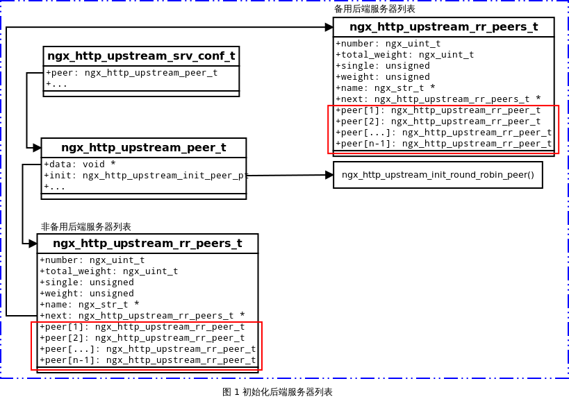

**目录**


- [负载均衡](#)
- [加权轮询](#)

- [相关结构体](#)
- [加权轮询策略的启动](#)
- [加权轮询工作流程](#)

- [初始化服务器列表](#)
- [选择合适的后端服务器](#)

- [初始化后端服务器](#)
- [根据权重选择后端服务器](#)

- [释放后端服务器](#)

- [IP 哈希](#)

- [初始化后端服务器列表](#)
- [选择后端服务器](#)

- [总结](#)

### 负载均衡

upstream 机制使得 Nginx 以反向代理的形式运行，因此 Nginx 接收客户端的请求，并根据客户端的请求，Nginx 选择合适后端服务器来处理该请求。但是若存在多台后端服务器时，Nginx 是根据怎样的策略来决定哪个后端服务器负责处理请求？这就涉及到后端服务器的负载均衡问题。   
Nginx 的负载均衡策略可以划分为两大类：内置策略 和 扩展策略。内置策略包含 加权轮询 和 IP hash，在默认情况下这两种策略会编译进 Nginx 内核，只需在 Nginx 配置中指明参数即可。扩展策略有第三方模块策略：fair、URL hash、consistent hash等，默认不编译进 Nginx 内核。本文只讲解 加权轮询 和 IP_hash 策略。

### 加权轮询

加权轮询策略是先计算每个后端服务器的权重，然后选择权重最高的后端服务器来处理请求。

### 相关结构体

**ngx_http_upstream_peer_t 结构体**

```c
typedef struct {
    /* 负载均衡的类型 */
    ngx_http_upstream_init_pt        init_upstream;
    /* 负载均衡类型的初始化函数 */
    ngx_http_upstream_init_peer_pt   init;
    /* 指向 ngx_http_upstream_rr_peers_t 结构体 */
    void                            *data;
} ngx_http_upstream_peer_t;
```

**ngx_http_upstream_server_t 结构体**

```c
/* 服务器结构体 */
typedef struct {
    /* 指向存储 IP 地址的数组，因为同一个域名可能会有多个 IP 地址 */
    ngx_addr_t                      *addrs;
    /* IP 地址数组中元素个数 */
    ngx_uint_t                       naddrs;
    /* 权重 */
    ngx_uint_t                       weight;
    /* 最大失败次数 */
    ngx_uint_t                       max_fails;
    /* 失败时间阈值 */
    time_t                           fail_timeout;

    /* 标志位，若为 1，表示不参与策略选择 */
    unsigned                         down:1;
    /* 标志位，若为 1，表示为备用服务器 */
    unsigned                         backup:1;
} ngx_http_upstream_server_t;
```

**ngx_http_upstream_rr_peer_t 结构体**

```c
typedef struct {
    /* 后端服务器 IP 地址 */
    struct sockaddr                *sockaddr;
    /* 后端服务器 IP 地址的长度 */
    socklen_t                       socklen;
    /* 后端服务器的名称 */
    ngx_str_t                       name;

    /* 后端服务器当前的权重 */
    ngx_int_t                       current_weight;
    /* 后端服务器有效权重 */
    ngx_int_t                       effective_weight;
    /* 配置项所指定的权重 */
    ngx_int_t                       weight;

    /* 已经失败的次数 */
    ngx_uint_t                      fails;
    /* 访问时间 */
    time_t                          accessed;
    time_t                          checked;

    /* 最大失败次数 */
    ngx_uint_t                      max_fails;
    /* 失败时间阈值 */
    time_t                          fail_timeout;

    /* 后端服务器是否参与策略，若为1，表示不参与 */
    ngx_uint_t                      down;          /* unsigned  down:1; */

#if (NGX_HTTP_SSL)
    ngx_ssl_session_t              *ssl_session;   /* local to a process */
#endif
} ngx_http_upstream_rr_peer_t;
```

**ngx_http_upstream_rr_peers_t 结构体**

```c
typedef struct ngx_http_upstream_rr_peers_s  ngx_http_upstream_rr_peers_t;

struct ngx_http_upstream_rr_peers_s {
    /* 竞选队列中后端服务器的数量 */
    ngx_uint_t                      number;

 /* ngx_mutex_t                    *mutex; */

    /* 所有后端服务器总的权重 */
    ngx_uint_t                      total_weight;

    /* 标志位，若为 1，表示后端服务器仅有一台，此时不需要选择策略 */
    unsigned                        single:1;
    /* 标志位，若为 1，表示所有后端服务器总的权重等于服务器的数量 */
    unsigned                        weighted:1;

    ngx_str_t                      *name;

    /* 后端服务器的链表 */
    ngx_http_upstream_rr_peers_t   *next;

    /* 特定的后端服务器 */
    ngx_http_upstream_rr_peer_t     peer[1];
};
```

**ngx_http_upstream_rr_peer_data_t 结构体**

```c
typedef struct {
    ngx_http_upstream_rr_peers_t   *peers;
    ngx_uint_t                      current;
    uintptr_t                      *tried;
    uintptr_t                       data;
} ngx_http_upstream_rr_peer_data_t;
```

### 加权轮询策略的启动

在 Nginx 启动过程中，在解析完 http 配置块之后，会调用各个 http 模块对应的初始函数。对于 upstream 机制的 `ngx_http_upstream_module` 模块来说，对应的 main 配置初始函数是`ngx_http_upstream_init_main_conf()`如下所示：

```c
for (i = 0; i < umcf->upstreams.nelts; i++) {  

    init = uscfp[i]->peer.init_upstream ? 
        uscfp[i]->peer.init_upstream:                                  ngx_http_upstream_init_round_robin;  

    if (init(cf, uscfp[i]) != NGX_OK) {  
            return NGX_CONF_ERROR;  
    }  
}  
```

在 `ngx_http_upstream_module` 模块中，如果用户没有做任何策略选择，那么执行默认采用加权轮询策略初始函数为`ngx_http_upstream_init_round_robin`。否则的话执行的是`uscfp[i]->peer.init_upstream`指针函数。

当接收到来自客户端的请求时，Nginx 会调用 `ngx_http_upstream_init_request` 初始化请求的过程中，调用 `uscf->peer.init(r, uscf)`，对于 upstream 机制的加权轮询策略来说该方法就是 `ngx_http_upstream_init_round_robin_peer`，该方法完成请求初始化工作。

```c
static void  
ngx_http_upstream_init_request(ngx_http_request_t *r)  
{  
...  
if (uscf->peer.init(r, uscf) != NGX_OK) {  
        ngx_http_upstream_finalize_request(r, u,  
                                           NGX_HTTP_INTERNAL_SERVER_ERROR);  
        return;  
    }  

    ngx_http_upstream_connect(r, u);  
}  
```

完成客户端请求的初始化工作之后，会选择一个后端服务器来处理该请求，选择后端服务器由函数 `ngx_http_upstream_get_round_robin_peer` 实现。该函数在 `ngx_event_connect_peer`中被调用。

```c
ngx_int_t  
ngx_event_connect_peer(ngx_peer_connection_t *pc)  
{  
...  
/* 调用 ngx_http_upstream_get_round_robin_peer  */
   rc = pc->get(pc, pc->data);  
   if (rc != NGX_OK) {  
       return rc;  
   }  

  s = ngx_socket(pc->sockaddr->sa_family, SOCK_STREAM, 0);  
...  
}  
```

当已经选择一台后端服务器来处理请求时，接下来就会测试该后端服务器的连接情况，测试连接由函数 `ngx_http_upstream_test_connect` 实现，在函数 `ngx_http_upstream_send_request` 中被调用。

```c
static void  
ngx_http_upstream_send_request(ngx_http_request_t *r, ngx_http_upstream_t *u)  
{  
...  
    if (!u->request_sent &amp;&amp; ngx_http_upstream_test_connect(c) != NGX_OK) {  
        /* 测试连接失败 */ 
        ngx_http_upstream_next(r, u, NGX_HTTP_UPSTREAM_FT_ERROR);  
        return;  
    }  
...  
}  
```

若连接测试失败，会由函数 `ngx_http_upstream_next` 发起再次测试，若测试成功，则处理完请求之后，会调用 `ngx_http_upstream_free_round_robin_peer` 释放后端服务器。

### 加权轮询工作流程

加权轮询策略的基本工作过程是：初始化负载均衡服务器列表，初始化后端服务器，选择合适后端服务器处理请求，释放后端服务器。

#### 初始化服务器列表

初始化服务器列表由函数 `ngx_http_upstream_init_round_robin` 实现，该函数的执行流程如下所示：

- 第一种情况：若 upstream 机制配置项中配置了服务器：   

- 初始化非备用服务器列表，并将其挂载到 `us->peer.data` 中；
- 初始化备用服务器列表，并将其挂载到 `peers->next` 中；

- 第二种情况：采用默认的方式 proxy_pass 配置后端服务器地址；   

- 初始化非备用服务器列表，并将其挂载到 `us->peer.data` 中；

该方法执行完成之后得到的结构如下图所示：



```c
/* 初始化服务器负载均衡列表 */
ngx_int_t
ngx_http_upstream_init_round_robin(ngx_conf_t *cf,
    ngx_http_upstream_srv_conf_t *us)
{
    ngx_url_t                      u;
    ngx_uint_t                     i, j, n, w;
    ngx_http_upstream_server_t    *server;
    ngx_http_upstream_rr_peers_t  *peers, *backup;

    /* 设置 ngx_http_upstream_peer_t 结构体中 init 的回调方法 */
    us->peer.init = ngx_http_upstream_init_round_robin_peer;

    /* 第一种情况：若 upstream 机制中有配置后端服务器 */
    if (us->servers) {
        /* ngx_http_upstream_srv_conf_t us 结构体成员 servers 是一个指向服务器数组 ngx_array_t 的指针，*/
        server = us->servers->elts;

        n = 0;
        w = 0;
        /* 在这里说明下：一个域名可能会对应多个 IP 地址，upstream 机制中把一个 IP 地址看作一个后端服务器 */

        /* 遍历服务器数组中所有后端服务器，统计非备用后端服务器的 IP 地址总个数(即非备用后端服务器总的个数) 和 总权重 */
        for (i = 0; i < us->servers->nelts; i++) {
            /* 若当前服务器是备用服务器，则 continue 跳过以下检查，继续检查下一个服务器 */
            if (server[i].backup) {ngx_http_upstream_peer_t
                continue;
            }

            /* 统计所有非备用后端服务器 IP 地址总的个数(即非备用后端服务器总的个数) */
            n += server[i].naddrs;
            /* 统计所有非备用后端服务器总的权重 */
            w += server[i].naddrs * server[i].weight;
        }

        /* 若 upstream 机制中配置项指令没有设置后端服务器，则出错返回 */
        if (n == 0) {
            ngx_log_error(NGX_LOG_EMERG, cf->log, 0,
                          "no servers in upstream \"%V\" in %s:%ui",
                          &amp;us->host, us->file_name, us->line);
            return NGX_ERROR;
        }

        /* 值得注意的是：备用后端服务器列表 和 非备用后端服务器列表 是分开挂载的，因此需要分开设置 */
        /* 为非备用后端服务器分配内存空间 */
        peers = ngx_pcalloc(cf->pool, sizeof(ngx_http_upstream_rr_peers_t)
                              + sizeof(ngx_http_upstream_rr_peer_t) * (n - 1));
        if (peers == NULL) {
            return NGX_ERROR;
        }

        /* 初始化非备用后端服务器列表 ngx_http_upstream_rr_peers_t 结构体 */
        peers->single = (n == 1);/* 表示只有一个非备用后端服务器 */
        peers->number = n;/* 非备用后端服务器总的个数 */
        peers->weighted = (w != n);/* 设置默认权重为 1 或 0 */
        peers->total_weight = w;/* 设置非备用后端服务器总的权重 */
        peers->name = &amp;us->host;/* 非备用后端服务器名称 */

        n = 0;

        /* 遍历服务器数组中所有后端服务器，初始化非备用后端服务器 */
        for (i = 0; i < us->servers->nelts; i++) {
            if (server[i].backup) {/* 若为备用服务器则 continue 跳过 */
                continue;
            }
            /* 以下关于 ngx_http_upstream_rr_peer_t 结构体中三个权重值的说明 */
            /*
             * effective_weight 相当于质量(来源于配置文件配置项的 weight)，current_weight 相当于重量。
             * 前者反应本质，一般是不变的。current_weight 是运行时的动态权值，它的变化基于 effective_weight。
             * 但是 effective_weight 在其对应的 peer 服务异常时，会被调低，
             * 当服务恢复正常时，effective_weight 会逐渐恢复到实际值（配置项的weight）;
             */

            /* 遍历非备用后端服务器所对应 IP 地址数组中的所有 IP 地址(即一个后端服务器域名可能会对应多个 IP 地址) */
            for (j = 0; j < server[i].naddrs; j++) {
                /* 为每个非备用后端服务器初始化 */
                peers->peer[n].sockaddr = server[i].addrs[j].sockaddr;/* 设置非备用后端服务器 IP 地址 */
                peers->peer[n].socklen = server[i].addrs[j].socklen;/* 设置非备用后端服务器 IP 地址长度 */
                peers->peer[n].name = server[i].addrs[j].name;/* 设置非备用后端服务器域名 */
                peers->peer[n].weight = server[i].weight;/* 设置非备用后端服务器配置项权重 */
                peers->peer[n].effective_weight = server[i].weight;/* 设置非备用后端服务器有效权重 */
                peers->peer[n].current_weight = 0;/* 设置非备用后端服务器当前权重 */
                peers->peer[n].max_fails = server[i].max_fails;/* 设置非备用后端服务器最大失败次数 */
                peers->peer[n].fail_timeout = server[i].fail_timeout;/* 设置非备用后端服务器失败时间阈值 */
                peers->peer[n].down = server[i].down;/* 设置非备用后端服务器 down 标志位，若该标志位为 1，则不参与策略 */
                n++;
            }
        }

        /*
         * 将非备用服务器列表挂载到 ngx_http_upstream_srv_conf_t 结构体成员结构体
         * ngx_http_upstream_peer_t peer 的成员 data 中；
         */
        us->peer.data = peers;

        /* backup servers */

        n = 0;
        w = 0;

         /* 遍历服务器数组中所有后端服务器，统计备用后端服务器的 IP 地址总个数(即备用后端服务器总的个数) 和 总权重 */
        for (i = 0; i < us->servers->nelts; i++) {
            if (!server[i].backup) {
                continue;
            }

            n += server[i].naddrs;/* 统计所有备用后端服务器的 IP 地址总的个数 */
            w += server[i].naddrs * server[i].weight;/* 统计所有备用后端服务器总的权重 */
        }

        if (n == 0) {/* 若没有备用后端服务器，则直接返回 */
            return NGX_OK;
        }

        /* 分配备用服务器列表的内存空间 */
        backup = ngx_pcalloc(cf->pool, sizeof(ngx_http_upstream_rr_peers_t)
                              + sizeof(ngx_http_upstream_rr_peer_t) * (n - 1));
        if (backup == NULL) {
            return NGX_ERROR;
        }

        peers->single = 0;
        /* 初始化备用后端服务器列表 ngx_http_upstream_rr_peers_t 结构体 */
        backup->single = 0;
        backup->number = n;
        backup->weighted = (w != n);
        backup->total_weight = w;
        backup->name = &amp;us->host;

        n = 0;

        /* 遍历服务器数组中所有后端服务器，初始化备用后端服务器 */
        for (i = 0; i < us->servers->nelts; i++) {
            if (!server[i].backup) {/* 若是非备用后端服务器，则 continue 跳过当前后端服务器，检查下一个后端服务器 */
                continue;
            }

            /* 遍历备用后端服务器所对应 IP 地址数组中的所有 IP 地址(即一个后端服务器域名可能会对应多个 IP 地址) */
            for (j = 0; j < server[i].naddrs; j++) {
                backup->peer[n].sockaddr = server[i].addrs[j].sockaddr;/* 设置备用后端服务器 IP 地址 */
                backup->peer[n].socklen = server[i].addrs[j].socklen;/* 设置备用后端服务器 IP 地址长度 */
                backup->peer[n].name = server[i].addrs[j].name;/* 设置备用后端服务器域名 */
                backup->peer[n].weight = server[i].weight;/* 设置备用后端服务器配置项权重 */
                backup->peer[n].effective_weight = server[i].weight;/* 设置备用后端服务器有效权重 */
                backup->peer[n].current_weight = 0;/* 设置备用后端服务器当前权重 */
                backup->peer[n].max_fails = server[i].max_fails;/* 设置备用后端服务器最大失败次数 */
                backup->peer[n].fail_timeout = server[i].fail_timeout;/* 设置备用后端服务器失败时间阈值 */
                backup->peer[n].down = server[i].down;/* 设置备用后端服务器 down 标志位，若该标志位为 1，则不参与策略 */
                n++;
            }
        }

        /*
         * 将备用服务器列表挂载到 ngx_http_upstream_rr_peers_t 结构体中
         * 的成员 next 中；
         */
        peers->next = backup;

        /* 第一种情况到此返回 */
        return NGX_OK;
    }

     /* 第二种情况：若 upstream 机制中没有直接配置后端服务器，则采用默认的方式 proxy_pass 配置后端服务器地址 */
    /* an upstream implicitly defined by proxy_pass, etc. */

    /* 若端口号为 0，则出错返回 */
    if (us->port == 0) {
        ngx_log_error(NGX_LOG_EMERG, cf->log, 0,
                      "no port in upstream \"%V\" in %s:%ui",
                      &amp;us->host, us->file_name, us->line);
        return NGX_ERROR;
    }

    /* 初始化 ngx_url_t 结构体所有成员为 0 */
    ngx_memzero(&amp;u, sizeof(ngx_url_t));

    u.host = us->host;
    u.port = us->port;

    /* 解析 IP 地址 */
    if (ngx_inet_resolve_host(cf->pool, &amp;u) != NGX_OK) {
        if (u.err) {
            ngx_log_error(NGX_LOG_EMERG, cf->log, 0,
                          "%s in upstream \"%V\" in %s:%ui",
                          u.err, &amp;us->host, us->file_name, us->line);
        }

        return NGX_ERROR;
    }

    n = u.naddrs;

    /* 分配非备用后端服务器列表的内存空间 */
    peers = ngx_pcalloc(cf->pool, sizeof(ngx_http_upstream_rr_peers_t)
                              + sizeof(ngx_http_upstream_rr_peer_t) * (n - 1));
    if (peers == NULL) {
        return NGX_ERROR;
    }

    /* 初始化非备用后端服务器列表 */
    peers->single = (n == 1);
    peers->number = n;
    peers->weighted = 0;
    peers->total_weight = n;
    peers->name = &amp;us->host;

    for (i = 0; i < u.naddrs; i++) {
        peers->peer[i].sockaddr = u.addrs[i].sockaddr;
        peers->peer[i].socklen = u.addrs[i].socklen;
        peers->peer[i].name = u.addrs[i].name;
        peers->peer[i].weight = 1;
        peers->peer[i].effective_weight = 1;
        peers->peer[i].current_weight = 0;
        peers->peer[i].max_fails = 1;
        peers->peer[i].fail_timeout = 10;
    }

    /* 挂载非备用后端服务器列表 */
    us->peer.data = peers;

    /* implicitly defined upstream has no backup servers */

    return NGX_OK;
}
```

#### 选择合适的后端服务器

在选择合适的后端服务器处理客户请求时，首先需要初始化后端服务器，然后根据后端服务器的权重，选择权重最高的后端服务器来处理请求。

##### 初始化后端服务器

上面的初始化负载服务器列表的全局初始化工作完成之后，当客户端发起请求时，Nginx 会选择一个合适的后端服务器来处理该请求。在本轮选择后端服务器之前，Nginx 会对后端服务器进行初始化工作，该工作由函数 `ngx_http_upstream_init_round_robin_peer` 实现。

`ngx_http_upstream_init_round_robin_peer` 函数的执行流程如下所示：

- 计算服务器列表中的数量 n，n 的取值为 非备用后端服务器数量 与 备用后端服务器数量 较大者；
- 根据 n 的取值，创建一个位图 `tried`，该位图是记录后端服务器是否被选择过：   

- 若 n 不大于 32， 只需要在一个 `int` 中记录所有后端服务器的状态；
- 若 n 大于 32，则需要从内存池申请内存来存储所有后端服务器的状态；

- 设置 `ngx_peer_connection_t` 结构体中 `get` 的回调方法为 `ngx_http_upstream_get_round_robin_peer`；`free` 的回调方法为 `ngx_http_upstream_free_round_robin_peer`，设置 `tries` 重试连接的次数为非备用后端服务器的个数；

```c
/* 当客户端发起请求时，upstream 机制为本轮选择一个后端服务器做初始化工作 */
ngx_int_t
ngx_http_upstream_init_round_robin_peer(ngx_http_request_t *r,
    ngx_http_upstream_srv_conf_t *us)
{
    ngx_uint_t                         n;
    ngx_http_upstream_rr_peer_data_t  *rrp;

    /* 注意：r->upstream->peer 是 ngx_peer_connection_t 结构体类型 */

    /* 获取当前客户端请求中的 ngx_http_upstream_rr_peer_data_t 结构体 */
    rrp = r->upstream->peer.data;

    if (rrp == NULL) {
        rrp = ngx_palloc(r->pool, sizeof(ngx_http_upstream_rr_peer_data_t));
        if (rrp == NULL) {
            return NGX_ERROR;
        }

        r->upstream->peer.data = rrp;
    }

    /* 获取非备用后端服务器列表 */
    rrp->peers = us->peer.data;
    rrp->current = 0;/* 若采用遍历方式选择后端服务器时，作为起始节点编号 */

    /* 下面是取值 n，若存在备用后端服务器列表，则 n 的值为非备用后端服务器个数 与 备用后端服务器个数 之间的较大者 */

    n = rrp->peers->number;

    if (rrp->peers->next &amp;&amp; rrp->peers->next->number > n) {
        n = rrp->peers->next->number;
    }

    /* rrp->tried 是一个位图，在本轮选择中，该位图记录各个后端服务器是否被选择过 */

    /*
     * 如果后端服务器数量 n 不大于 32，则只需在一个 int 中即可记录下所有后端服务器状态；
     * 如果后端服务器数量 n 大于 32，则需在内存池中申请内存来存储所有后端服务器的状态；
     */
    if (n <= 8 * sizeof(uintptr_t)) {
        rrp->tried = &amp;rrp->data;
        rrp->data = 0;

    } else {
        n = (n + (8 * sizeof(uintptr_t) - 1)) / (8 * sizeof(uintptr_t));

        rrp->tried = ngx_pcalloc(r->pool, n * sizeof(uintptr_t));
        if (rrp->tried == NULL) {
            return NGX_ERROR;
        }
    }

    /*
     * 设置 ngx_peer_connection_t 结构体中 get 、free 的回调方法；
     * 设置 ngx_peer_connection_t 结构体中 tries 重试连接的次数为非备用后端服务器的个数；
     */
    r->upstream->peer.get = ngx_http_upstream_get_round_robin_peer;
    r->upstream->peer.free = ngx_http_upstream_free_round_robin_peer;
    r->upstream->peer.tries = rrp->peers->number;
#if (NGX_HTTP_SSL)
    r->upstream->peer.set_session =
                               ngx_http_upstream_set_round_robin_peer_session;
    r->upstream->peer.save_session =
                               ngx_http_upstream_save_round_robin_peer_session;
#endif

    return NGX_OK;
}
```

##### 根据权重选择后端服务器

完成后端服务器的初始化工作之后，根据各个后端服务器的权重来选择权重最高的后端服务器处理客户端请求，由函数 `ngx_http_upstream_get_round_robin_peer` 实现。

`ngx_http_upstream_get_round_robin_peer` 函数的执行流程如下所示：

- *步骤1*：检查 `ngx_http_upstream_rr_peers_t` 结构体中的 `single` 标志位：   

- 若 `single` 标志位为 1，表示只有一台非备用后端服务器：   

- 接着检查该非备用后端服务器的 `down` 标志位：   

- 若 `down` 标志位为 0，则选择该非备用后端服务器来处理请求；
- 若 `down` 标志位为 1, 该非备用后端服务器表示不参与策略选择，则跳至 `goto failed` 步骤从备用后端服务器列表中选择后端服务器来处理请求； 

- 若 `single` 标志位为 0，则表示不止一台非备用后端服务器，则调用 `ngx_http_upstream_get_peer` 方法根据非备用后端服务器的权重来选择一台后端服务器处理请求，根据该方法的返回值 `peer` 进行判断：   

- 若该方法返回值 `peer = NULL`， 表示在非备用后端服务器列表中没有选中到合适的后端服务器来处理请求，则跳至 `goto failed` 从备用后端服务器列表中选择一台后端服务器来处理请求；
- 若该方法返回值 peer 不为 NULL，表示已经选中了合适的后端服务器来处理请求，设置该服务器重试连接次数 tries，并 `return NGX_OK` 从当前函数返回；

- *goto failed 步骤*：计算备用后端服务器在位图 tried 中的位置 n，并把他们在位图的记录都设置为 0，此时，把备用后端服务器列表作为参数调用 `ngx_http_upstream_get_round_robin_peer` 选择一台后端服务器来处理请求；

```c
/* 选择一个后端服务器来处理请求 */
ngx_int_t
ngx_http_upstream_get_round_robin_peer(ngx_peer_connection_t *pc, void *data)
{
    ngx_http_upstream_rr_peer_data_t  *rrp = data;

    ngx_int_t                      rc;
    ngx_uint_t                     i, n;
    ngx_http_upstream_rr_peer_t   *peer;
    ngx_http_upstream_rr_peers_t  *peers;

    ngx_log_debug1(NGX_LOG_DEBUG_HTTP, pc->log, 0,
                   "get rr peer, try: %ui", pc->tries);

    /* ngx_lock_mutex(rrp->peers->mutex); */

    pc->cached = 0;
    pc->connection = NULL;

    /*
     * 检查 ngx_http_upstream_rr_peers_t 结构体中的 single 标志位;
     * 若 single 标志位为 1，表示只有一台非备用后端服务器，
     * 接着检查该非备用后端服务器的 down 标志位，若 down 标志位为 0，则选择该非备用后端服务器来处理请求；
     * 若 down 标志位为 1, 该非备用后端服务器表示不参与策略选择，
     * 则跳至 goto failed 步骤从备用后端服务器列表中选择后端服务器来处理请求；
     */
    if (rrp->peers->single) {
        peer = &amp;rrp->peers->peer[0];

        if (peer->down) {
            goto failed;
        }

    } else {/* 若 single 标志位为 0，表示不止一台非备用后端服务器 */

        /* there are several peers */

        /* 根据非备用后端服务器的权重来选择一台后端服务器处理请求 */
        peer = ngx_http_upstream_get_peer(rrp);

        if (peer == NULL) {
            /*
             * 若从非备用后端服务器列表中没有选择一台合适的后端服务器处理请求，
             * 则 goto failed 从备用后端服务器列表中选择一台后端服务器来处理请求；
             */
            goto failed;
        }

        ngx_log_debug2(NGX_LOG_DEBUG_HTTP, pc->log, 0,
                       "get rr peer, current: %ui %i",
                       rrp->current, peer->current_weight);
    }

    /*
     * 若从非备用后端服务器列表中已经选到了一台合适的后端服务器处理请求;
     * 则获取该后端服务器的地址信息；
     */
    pc->sockaddr = peer->sockaddr;/* 获取被选中的非备用后端服务器的地址 */
    pc->socklen = peer->socklen;/* 获取被选中的非备用后端服务器的地址长度 */
    pc->name = &amp;peer->name;/* 获取被选中的非备用后端服务器的域名 */

    /* ngx_unlock_mutex(rrp->peers->mutex); */

    /*
     * 检查被选中的非备用后端服务器重试连接的次数为 1，且存在备用后端服务器列表，
     * 则将该非备用后端服务器重试连接的次数设置为 备用后端服务器个数加 1；
     * 否则不用重新设置；
     */
    if (pc->tries == 1 &amp;&amp; rrp->peers->next) {
        pc->tries += rrp->peers->next->number;
    }

    /* 到此，表示已经选择到了一台合适的非备用后端服务器来处理请求，则成功返回 */
    return NGX_OK;

failed:
      /*
       * 若从非备用后端服务器列表中没有选择到后端服务器处理请求，
       * 若存在备用后端服务器，则从备用后端服务器列表中选择一台后端服务器来处理请求；
       */

    peers = rrp->peers;

    /* 若存在备用后端服务器，则从备用后端服务器列表中选择一台后端服务器来处理请求；*/
    if (peers->next) {

        /* ngx_unlock_mutex(peers->mutex); */

        ngx_log_debug0(NGX_LOG_DEBUG_HTTP, pc->log, 0, "backup servers");

        /* 获取备用后端服务器列表 */
        rrp->peers = peers->next;
        /* 把后端服务器重试连接的次数 tries 设置为备用后端服务器个数 number */
        pc->tries = rrp->peers->number;

        /* 计算备用后端服务器在位图中的位置 n */
        n = (rrp->peers->number + (8 * sizeof(uintptr_t) - 1))
                / (8 * sizeof(uintptr_t));

        /* 初始化备用后端服务器在位图 rrp->tried[i] 中的值为 0 */
        for (i = 0; i < n; i++) {
             rrp->tried[i] = 0;
        }

        /* 把备用后端服务器列表当前非备用后端服务器列表递归调用 ngx_http_upstream_get_round_robin_peer 选择一台后端服务器 */
        rc = ngx_http_upstream_get_round_robin_peer(pc, rrp);

        /* 若选择成功则返回 */
        if (rc != NGX_BUSY) {
            return rc;
        }

        /* ngx_lock_mutex(peers->mutex); */
    }

    /*
     * 若从备用后端服务器列表中也没有选择到一台后端服务器处理请求，
     * 则重新设置非备用后端服务器连接失败的次数 fails 为 0 ,以便重新被选择；
     */
    /* all peers failed, mark them as live for quick recovery */

    for (i = 0; i < peers->number; i++) {
        peers->peer[i].fails = 0;
    }

    /* ngx_unlock_mutex(peers->mutex); */

    pc->name = peers->name;

    /* 选择失败，则返回 */
    return NGX_BUSY;
}
```

`ngx_http_upstream_get_peer` 函数是计算每一个后端服务器的权重值，并选择一个权重最高的后端服务器。

`ngx_http_upstream_get_peer` 函数的执行流程如下所示：

- for 循环遍历后端服务器列表，计算当前后端服务器在位图 tried 中的位置 n，判断当前服务器是否在位图中记录过，若已经记录过，则 continue 继续检查下一个后端服务器；若没有记录过则继续当前后端服务器检查；
- 检查当前后端服务器的标志位 down，若该标志位为 1，表示该后端服务器不参与选择策略，则 continue 继续检查下一个后端服务器；若该标志位为 0，继续当前后端服务器的检查；
- 若当前后端服务器的连接失败次数已到达 max_failes，且睡眠时间还没到 fail_timedout ，则 continue 继续检查下一个后端服务器；否则继续当前后端服务器的检查；
- 计算当前后端服务器的权重，设置当前后端服务器的权重 current_weight 的值为原始值加上 effective_weight；设置总的权重 total 为原始值加上 effective_weight；
- 判断当前后端服务器是否异常，若 effective_weight 小于 weight，表示正常，则调整 effective_weight 的值 effective_weight++；
- 根据权重在后端服务器列表中选择权重最高的后端服务器 best；
- 计算被选中后端服务器咋服务器列表中的为 i，记录被选中后端服务器在 `ngx_http_upstream_rr_peer_data_t` 结构体 current 成员的值，在释放后端服务器时会用到该值；
- 计算被选中后端服务器在位图中的位置 n，并在该位置记录 best 后端服务器已经被选中过；
- 更新被选中后端服务器的权重，并返回被选中的后端服务器 best；

```c
 /* 根据后端服务器的权重来选择一台后端服务器处理请求 */
static ngx_http_upstream_rr_peer_t *
ngx_http_upstream_get_peer(ngx_http_upstream_rr_peer_data_t *rrp)
{
    time_t                        now;
    uintptr_t                     m;
    ngx_int_t                     total;
    ngx_uint_t                    i, n;
    ngx_http_upstream_rr_peer_t  *peer, *best;

    now = ngx_time();

    best = NULL;
    total = 0;

    /* 遍历后端服务器列表 */
    for (i = 0; i < rrp->peers->number; i++) {

        /* 计算当前后端服务器在位图中的位置 n */
        n = i / (8 * sizeof(uintptr_t));
        m = (uintptr_t) 1 << i % (8 * sizeof(uintptr_t));

        /* 当前后端服务器在位图中已经有记录，则不再次被选择，即 continue 检查下一个后端服务器 */
        if (rrp->tried[n] &amp; m) {
            continue;
        }

        /* 若当前后端服务器在位图中没有记录，则可能被选中，接着计算其权重 */
        peer = &amp;rrp->peers->peer[i];

        /* 检查当前后端服务器的 down 标志位，若为 1 表示不参与策略选择，则 continue 检查下一个后端服务器 */
        if (peer->down) {
            continue;
        }

        /*
         * 当前后端服务器的 down 标志位为 0,接着检查当前后端服务器连接失败的次数是否已经达到 max_fails；
         * 且睡眠的时间还没到 fail_timeout，则当前后端服务器不被选择，continue 检查下一个后端服务器；
         */
        if (peer->max_fails
            &amp;&amp; peer->fails >= peer->max_fails
            &amp;&amp; now - peer->checked <= peer->fail_timeout)
        {
            continue;
        }

        /* 若当前后端服务器可能被选中，则计算其权重 */

        /*
         * 在上面初始化过程中 current_weight = 0，effective_weight = weight；
         * 此时，设置当前后端服务器的权重 current_weight 的值为原始值加上 effective_weight；
         * 设置总的权重为原始值加上 effective_weight；
         */
        peer->current_weight += peer->effective_weight;
        total += peer->effective_weight;

        /* 服务器正常，调整 effective_weight 的值 */
        if (peer->effective_weight < peer->weight) {
            peer->effective_weight++;
        }

        /* 若当前后端服务器的权重 current_weight 大于目前 best 服务器的权重，则当前后端服务器被选中 */
        if (best == NULL || peer->current_weight > best->current_weight) {
            best = peer;
        }
    }

    if (best == NULL) {
        return NULL;
    }

    /* 计算被选中后端服务器在服务器列表中的位置 i */
    i = best - &amp;rrp->peers->peer[0];

    /* 记录被选中后端服务器在 ngx_http_upstream_rr_peer_data_t 结构体 current 成员的值，在释放后端服务器时会用到该值 */
    rrp->current = i;

    /* 计算被选中后端服务器在位图中的位置 */
    n = i / (8 * sizeof(uintptr_t));
    m = (uintptr_t) 1 << i % (8 * sizeof(uintptr_t));

    /* 在位图相应的位置记录被选中后端服务器 */
    rrp->tried[n] |= m;

    /* 更新被选中后端服务器的权重 */
    best->current_weight -= total;

    if (now - best->checked > best->fail_timeout) {
        best->checked = now;
    }

    /* 返回被选中的后端服务器 */
    return best;
}
```

#### 释放后端服务器

成功连接后端服务器并且正常处理完成客户端请求后需释放后端服务器，由函数 `ngx_http_upstream_free_round_robin_peer` 实现。

```c
/* 释放后端服务器 */
void
ngx_http_upstream_free_round_robin_peer(ngx_peer_connection_t *pc, void *data,
    ngx_uint_t state)
{
    ngx_http_upstream_rr_peer_data_t  *rrp = data;

    time_t                       now;
    ngx_http_upstream_rr_peer_t  *peer;

    ngx_log_debug2(NGX_LOG_DEBUG_HTTP, pc->log, 0,
                   "free rr peer %ui %ui", pc->tries, state);

    /* TODO: NGX_PEER_KEEPALIVE */

    /* 若只有一个后端服务器，则设置 ngx_peer_connection_t 结构体成员 tries 为 0，并 return 返回 */
    if (rrp->peers->single) {
        pc->tries = 0;
        return;
    }

    /* 若不止一个后端服务器，则执行以下程序 */

    /* 获取已经被选中的后端服务器 */
    peer = &amp;rrp->peers->peer[rrp->current];

    /*
     * 若在本轮被选中的后端服务器在进行连接测试时失败，或者在处理请求过程中失败，
     * 则需要进行重新选择后端服务器；
     */
    if (state &amp; NGX_PEER_FAILED) {
        now = ngx_time();

        /* ngx_lock_mutex(rrp->peers->mutex); */

        peer->fails++;/* 增加当前后端服务器失败的次数 */
        /* 设置当前后端服务器访问的时间 */
        peer->accessed = now;
        peer->checked = now;

        if (peer->max_fails) {
            /* 由于当前后端服务器失败，表示发生异常，此时降低 effective_weight 的值 */
            peer->effective_weight -= peer->weight / peer->max_fails;
        }

        ngx_log_debug2(NGX_LOG_DEBUG_HTTP, pc->log, 0,
                       "free rr peer failed: %ui %i",
                       rrp->current, peer->effective_weight);

        /* 保证 effective_weight 的值不能小于 0 */
        if (peer->effective_weight < 0) {
            peer->effective_weight = 0;
        }

        /* ngx_unlock_mutex(rrp->peers->mutex); */

    } else {/* 若被选中的后端服务器成功处理请求，并返回，则将其 fails 设置为 0 */

        /* mark peer live if check passed */

        /* 若 fail_timeout 时间已过，则将其 fails 设置为 0 */
        if (peer->accessed < peer->checked) {
            peer->fails = 0;
        }
    }

    /* 减少 tries 的值 */
    if (pc->tries) {
        pc->tries--;
    }

    /* ngx_unlock_mutex(rrp->peers->mutex); */
}
```

### IP 哈希

IP 哈希策略选择后端服务器时，将来自同一个 IP 地址的客户端请求分发到同一台后端服务器处理。在 Nginx 中，IP 哈希策略的一些初始化工作是基于加权轮询策略的，这样减少了一些工作。

Nginx 使用 IP 哈希负载均衡策略时，在进行策略选择之前由 `ngx_http_upstream_init_ip_hash` 函数进行全局初始化工作，其实该函数也是调用加权轮询策略的全局初始化函数。当一个客户端请求过来时，Nginx 将调用 `ngx_http_upstream_init_ip_hash_peer()` 为选择后端服务器处理该请求做初始化工作。在多次哈希选择失败后，Nginx 会将选择策略退化到加权轮询。

`ngx_http_upstream_get_ip_hash_peer` 函数会在选择后端服务器时计算客户端请求 IP 地址的哈希值，并根据哈希值得到被选中的后端服务器，判断其是否可用，如果可用则保存服务器地址，若不可用则在上次哈希选择结果基础上再次进行哈希选择。如果哈希选择失败次数达到 20 次以上，此时回退到采用轮询策略进行选择。

### 初始化后端服务器列表

初始化服务器列表工作是调用加权轮询策略的初始化函数，只是最后设置 IP 哈希的回调方法为 `ngx_http_upstream_init_ip_hash_peer`。

```c
static ngx_int_t
ngx_http_upstream_init_ip_hash(ngx_conf_t *cf, ngx_http_upstream_srv_conf_t *us)
{
    /* 调用加权轮询策略的初始化函数 */
    if (ngx_http_upstream_init_round_robin(cf, us) != NGX_OK) {
        return NGX_ERROR;
    }

    /* 由于 ngx_http_upstream_init_round_robin 方法的选择后端服务器处理客户请求的初始化函数
     * 为 us->peer.init = ngx_http_upstream_init_round_robin_peer;
     */
    /* 重新设置 ngx_http_upstream_peer_t 结构体中 init 的回调方法为  ngx_http_upstream_init_ip_hash_peer */

    us->peer.init = ngx_http_upstream_init_ip_hash_peer;

    return NGX_OK;
}
```

### 选择后端服务器

选择后端服务器之前会调用函数 `ngx_http_upstream_init_ip_hash_peer` 进行一些服务器初始化工作。最终由函数 `ngx_http_upstream_get_ip_hash_peer` 进行 IP 哈希选择。

`ngx_http_upstream_init_ip_hash_peer` 函数执行流程：

- 调用加权轮询策略的初始化函数 `ngx_http_upstream_init_round_robin_peer`；
- 设置 IP hash 的决策函数为 `ngx_http_upstream_get_ip_hash_peer`；
- 保存客户端 IP 地址；
- 初始化 `ngx_http_upstream_ip_hash_peer_data_t`结构体成员 hash 值为 89；tries 重试连接次数为 0；`get_rr_peer` 为加权轮询的决策函数 `ngx_http_upstream_get_round_robin_peer`；

`ngx_http_upstream_get_ip_hash_peer` 函数执行流程：

- 若重试连接的次数 tries 大于 20，或 只有一台后端服务器，则直接调用加权轮询策略 get_rr_peer 选择当前后端服务器处理请求；
- 计算 IP 地址的 hash 值，下面根据哈希值进行选择后端服务器；
- 若 `ngx_http_upstream_rr_peers_t` 结构体中 weighted 标志位为 1，则被选中的后端服务器在后端服务器列表中的位置为 hash 值与后端服务器数量的余数 p；
- 若 `ngx_http_upstream_rr_peers_t` 结构体中 weighted 标志位为 0，首先计算 hash 值与后端服务器总权重的余数 w； 将 w 值减去后端服务器的权重，直到有一个后端服务器使 w 值小于 0，则选中该后端服务器来处理请求，并记录在后端服务器列表中的位置 p；
- 计算被选中后端服务器在位图中的位置 n；
- 若当前被选中的后端服务器已经在位图记录过，则跳至 goto next 执行；
- 检查当前被选中后端服务器的 down 标志位：   

- 若该标志位为1，则跳至 goto next_try 执行；
- 若 down 标志位为 0，接着检查当前被选中后端服务器失败连接次数是否到达 max_fails，若已经达到 max_fails 次，并且睡眠时间还没到 fail_timeout，则跳至 goto next_try 执行；

- 若不满足以上条件，表示选择成功，记录当前后端服务器的地址信息，把当前后端服务器记录在位图相应的位置，更新哈希值，最后返回该后端服务器；
- *goto next*：tries 重试连接的次数加 1，并判断 tries 是否大于阈值 20，若大于，则采用加权轮询策略；
- *goto next_try *：把当前后端服务器记录在位图中，减少当前后端服务器重试连接的次数 tries；

```c
static ngx_int_t
ngx_http_upstream_init_ip_hash_peer(ngx_http_request_t *r,
    ngx_http_upstream_srv_conf_t *us)
{
    struct sockaddr_in                     *sin;
#if (NGX_HAVE_INET6)
    struct sockaddr_in6                    *sin6;
#endif
    ngx_http_upstream_ip_hash_peer_data_t  *iphp;

    /* 分配 ngx_http_upstream_ip_hash_peer_data_t 结构体内存空间 */
    iphp = ngx_palloc(r->pool, sizeof(ngx_http_upstream_ip_hash_peer_data_t));
    if (iphp == NULL) {
        return NGX_ERROR;
    }

    r->upstream->peer.data = &amp;iphp->rrp;

    /* 调用加权轮询策略的初始化函数 ngx_http_upstream_init_round_robin_peer */
    if (ngx_http_upstream_init_round_robin_peer(r, us) != NGX_OK) {
        return NGX_ERROR;
    }

    /* 设置 IP hash 的决策函数  */
    r->upstream->peer.get = ngx_http_upstream_get_ip_hash_peer;

    switch (r->connection->sockaddr->sa_family) {

    /* 保存客户端 IP 地址 */

    /* IPv4 地址 */
    case AF_INET:
        sin = (struct sockaddr_in *) r->connection->sockaddr;
        iphp->addr = (u_char *) &amp;sin->sin_addr.s_addr;
        iphp->addrlen = 3;
        break;

    /* IPv6 地址 */
#if (NGX_HAVE_INET6)
    case AF_INET6:
        sin6 = (struct sockaddr_in6 *) r->connection->sockaddr;
        iphp->addr = (u_char *) &amp;sin6->sin6_addr.s6_addr;
        iphp->addrlen = 16;
        break;
#endif

    /* 非法地址 */
    default:
        iphp->addr = ngx_http_upstream_ip_hash_pseudo_addr;
        iphp->addrlen = 3;
    }

    /* 初始化 ngx_http_upstream_ip_hash_peer_data_t结构体成员 */
    iphp->hash = 89;
    iphp->tries = 0;
    /* 这个是设置为加权轮询策略的决策函数 */
    iphp->get_rr_peer = ngx_http_upstream_get_round_robin_peer;

    return NGX_OK;
}
```

```c
/* 选择后端服务器处理请求 */
static ngx_int_t
ngx_http_upstream_get_ip_hash_peer(ngx_peer_connection_t *pc, void *data)
{
    ngx_http_upstream_ip_hash_peer_data_t  *iphp = data;

    time_t                        now;
    ngx_int_t                     w;
    uintptr_t                     m;
    ngx_uint_t                    i, n, p, hash;
    ngx_http_upstream_rr_peer_t  *peer;

    ngx_log_debug1(NGX_LOG_DEBUG_HTTP, pc->log, 0,
                   "get ip hash peer, try: %ui", pc->tries);

    /* TODO: cached */

    /* 若重试连接的次数 tries 大于 20，或 只有一台后端服务器，则直接调用加权轮询策略选择当前后端服务器处理请求 */
    if (iphp->tries > 20 || iphp->rrp.peers->single) {
        return iphp->get_rr_peer(pc, &amp;iphp->rrp);
    }

    now = ngx_time();

    pc->cached = 0;
    pc->connection = NULL;

    hash = iphp->hash;

    for ( ;; ) {

        /* 计算 IP 地址的 hash 值 */
        for (i = 0; i < (ngx_uint_t) iphp->addrlen; i++) {
            hash = (hash * 113 + iphp->addr[i]) % 6271;/* hash 函数 */
        }

        /* 以下是根据 hash 值选择合适的后端服务器来处理请求 */

        /* 若 ngx_http_upstream_rr_peers_t 结构体中 weighted 标志位为 1，
         * 表示所有后端服务器的总权重 与 后端服务器的数量 相等，
         * 则被选中的后端服务器在后端服务器列表中的位置为 hash 值与后端服务器数量的余数 p；
         */
        if (!iphp->rrp.peers->weighted) {
            p = hash % iphp->rrp.peers->number;

        } else {
            /* 若 ngx_http_upstream_rr_peers_t 结构体中 weighted 标志位为 0，
             * 首先计算 hash 值与后端服务器总权重的余数 w；
             * 将 w 值减去后端服务器的权重，直到有一个后端服务器使 w 值小于 0，
             * 则选中该后端服务器来处理请求，并记录在后端服务器列表中的位置 p；
             */
            w = hash % iphp->rrp.peers->total_weight;

            for (i = 0; i < iphp->rrp.peers->number; i++) {
                w -= iphp->rrp.peers->peer[i].weight;
                if (w < 0) {
                    break;
                }
            }

            p = i;
        }

        /* 计算被选中后端服务器在位图中的位置 n */
        n = p / (8 * sizeof(uintptr_t));
        m = (uintptr_t) 1 << p % (8 * sizeof(uintptr_t));

        /* 若当前被选中的后端服务器已经在位图记录过，则跳至 goto next 执行 */
        if (iphp->rrp.tried[n] &amp; m) {
            goto next;
        }

        ngx_log_debug2(NGX_LOG_DEBUG_HTTP, pc->log, 0,
                       "get ip hash peer, hash: %ui %04XA", p, m);

        /* 获取当前被选中的后端服务器 */
        peer = &amp;iphp->rrp.peers->peer[p];

        /* ngx_lock_mutex(iphp->rrp.peers->mutex); */

        /* 检查当前被选中后端服务器的 down 标志位，若该标志位为1，则跳至 goto next_try 执行 */
        if (peer->down) {
            goto next_try;
        }

        /* 若 down 标志位为 0，接着检查当前被选中后端服务器失败连接次数是否到达 max_fails，
         * 若已经达到 max_fails 次，并且睡眠时间还没到 fail_timeout，则跳至 goto next_try 执行；
         */
        if (peer->max_fails
            &amp;&amp; peer->fails >= peer->max_fails
            &amp;&amp; now - peer->checked <= peer->fail_timeout)
        {
            goto next_try;
        }

        /* 若不满足以上条件，则表示选择后方服务器成功 */
        break;

    next_try:

        /* 把当前后端服务器记录在位图中 */
        iphp->rrp.tried[n] |= m;

        /* ngx_unlock_mutex(iphp->rrp.peers->mutex); */

        /* 减少当前后端服务器重试连接的次数 */
        pc->tries--;

    next:

        /* tries 重试连接的次数加 1，并判断 tries 是否大于阈值 20，若大于，则采用加权轮询策略 */
        if (++iphp->tries >= 20) {
            return iphp->get_rr_peer(pc, &amp;iphp->rrp);
        }
    }

    /* 到此已经成功选择了后端服务器来处理请求 */

    /* 记录当前后端服务器在后端服务器列表中的位置，该位置方便释放后端服务器调用 */
    iphp->rrp.current = p;

    /* 记录当前后端服务器的地址信息 */
    pc->sockaddr = peer->sockaddr;
    pc->socklen = peer->socklen;
    pc->name = &amp;peer->name;

    if (now - peer->checked > peer->fail_timeout) {
        peer->checked = now;
    }

    /* ngx_unlock_mutex(iphp->rrp.peers->mutex); */

    /* 把当前后端服务器记录在位图相应的位置 */
    iphp->rrp.tried[n] |= m;
    /* 记录 hash 值 */
    iphp->hash = hash;

    return NGX_OK;
}
```

### 总结

**加权轮询策略**：不依赖于客户端的任何信息，完全依靠后端服务器的情况来进行选择。但是同一个客户端的多次请求可能会被分配到不同的后端服务器进行处理，无法满足做会话保持的应用的需求。

**IP哈希策略**：把同一个 IP 地址的客户端请求分配到同一台服务器处理，避免了加权轮询无法适用会话保持的需求。但是来自同一的 IP 地址的请求比较多时，会导致某台后端服务器的压力可能非常大，而其他后端服务器却空闲的不均衡情况。