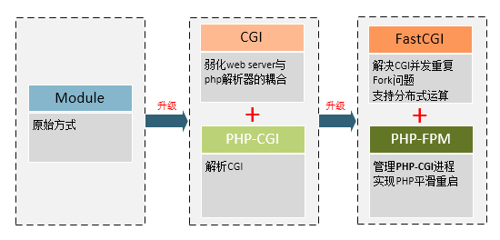

<style type="text/css">
    h2{color:#428BD1;}
</style>
# CGI、FastCGI和PHP-FPM关系图解

转自 [https://www.awaimai.com/371.html](https://www.awaimai.com/371.html)

 2016-01-05 [PHP教程][0] [6评论][1]

目录

* [基础][2]
* [Module方式][3]
* [CGI][4]
* [FastCGI介绍][5]
    * [FastCGI简单介绍][6]
    * [FastCGI的工作原理][7]
* [PHP-FPM介绍][8]
* [总结][9]
* [参考资料][10]

在搭建 LAMP/LNMP 服务器时，会经常遇到 PHP-FPM、FastCGI和CGI 这几个概念。如果对它们一知半解，很难搭建出高性能的服务器。接下来我们就以图形方式，解释这些概念之间的关系。

## 基础 

在整个网站架构中，Web Server（如Apache）只是内容的分发者。举个栗子，如果客户端请求的是 index.html，那么Web Server会去文件系统中找到这个文件，发送给浏览器，这里分发的是静态数据。

[](./img/html.png)

如果请求的是 index.php，根据配置文件，Web Server知道这个不是静态文件，需要去找 PHP 解析器来处理，那么他会把这个请求简单处理，然后交给PHP解析器。

[](./img/cgi.png)

当Web Server收到 index.php 这个请求后，会启动对应的 CGI 程序，这里就是PHP的解析器。接下来PHP解析器会解析php.ini文件，初始化执行环境，然后处理请求，再以规定CGI规定的格式返回处理后的结果，退出进程，Web server再把结果返回给浏览器。这就是一个完整的动态PHP Web访问流程，接下来再引出这些概念，就好理解多了，

* **`CGI`：** 是 Web Server 与 Web Application 之间数据交换的一种协议。
* **`FastCGI`：** 同 CGI，是一种通信协议，但比 CGI 在效率上做了一些优化。同样，SCGI 协议与 FastCGI 类似。
* **`PHP-CGI`：** 是 PHP （Web Application）对 Web Server 提供的 CGI 协议的接口程序。
* **`PHP-FPM`：** 是 PHP（Web Application）对 Web Server 提供的 FastCGI 协议的接口程序，额外还提供了相对智能一些任务管理。

WEB 中，

* Web Server 一般指Apache、Nginx、IIS、Lighttpd、Tomcat等服务器，
* Web Application 一般指PHP、Java、Asp.net等应用程序。

## Module方式 

在了解 CGI 之前，我们先了解一下Web server 传递数据的另外一种方法：**PHP Module加载方式**。以 Apache 为例，在PHP Module方式中，是不是在 Apache 的配置文件 httpd.conf 中加上这样几句：
```apache
    # 加入以下2句
    LoadModule php5_module D:/php/php5apache2_2.dll
    AddType application/x-httpd-php .php
    
    # 修改如下内容
    <IfModule dir_module>
        DirectoryIndex index.php index.html
    </IfModule>
```
上面是 Windows 下安装php和apache环境后手动配置，在linux下源码安装大致是这样配置的：

    # ./configure --with-mysql=/usr/local --with-apache=/usr/local/apache --enable-track-vars

所以，这种方式，他们的共同本质都是用 LoadModule 来加载 php5_module，就是 **`把php作为apache的一个子模块来运行`** 。当通过web访问php文件时，apache就会调用php5_module来解析php代码。

那么php5_module是怎么来将数据传给php解析器来解析php代码的呢？答案是通过sapi。

我们再来看一张图，详细的说说apache 与 php 与 sapi的关系：

[](./img/1417244404_9526.png)

从上面图中，我们看出了sapi就是这样的一个中间过程，SAPI提供了一个和外部通信的接口，有点类似于socket，使得PHP可以和其他应用进行交互数据（apache，nginx等）。php默认提供了很多种SAPI，常见的提供给apache和nginx的php5_module、CGI、FastCGI，给IIS的ISAPI，以及Shell的CLI。

所以，以上的apache调用php执行的过程如下：

    apache -> httpd -> php5_module -> sapi -> php
    

好了。apache与php通过php5_module的方式就搞清楚了吧！

这种模式将php模块安装到apache中，所以每一次apache结束请求，都会产生一条进程，这个进程就完整的包括php的各种运算计算等操作。

在上图中，我们很清晰的可以看到，apache每接收一个请求，都会产生一个进程来连接php通过sapi来完成请求，可想而知，如果一旦用户过多，并发数过多，服务器就会承受不住了。

而且，把mod_php编进apache时，出问题时很难定位是php的问题还是apache的问题。

## CGI 

CGI（ **`Common Gateway Interface`** ）全称是“**`通用网关接口`**”，WEB 服务器与PHP应用进行“交谈”的一种工具，其程序须运行在网络服务器上。CGI可以用任何一种语言编写，只要这种语言具有标准输入、输出和环境变量。如php、perl、tcl等。

WEB服务器会传哪些数据给PHP解析器呢？ **`URL、查询字符串、POST数据、HTTP header`** 都会有。所以，CGI就是规定要传哪些数据，以什么样的格式传递给后方处理这个请求的协议。仔细想想，你在PHP代码中使用的用户从哪里来的。

也就是说，CGI就是专门用来和 web 服务器打交道的。web服务器收到用户请求，就会把请求提交给cgi程序（如php-cgi），cgi程序根据请求提交的参数作应处理（解析php），然后输出标准的html语句，返回给web服服务器，WEB服务器再返回给客户端，这就是普通cgi的工作原理。

CGI的好处就是完全独立于任何服务器，仅仅是做为中间分子。提供接口给apache和php。他们通过cgi搭线来完成数据传递。这样做的好处了尽量减少2个的关联，使他们2变得更独立。

但是CGI有个蛋疼的地方，就是每一次web请求都会有启动和退出过程，也就是最为人诟病的**fork-and-execute**模式，这样一在大规模并发下，就死翘翘了。

## FastCGI介绍 

### FastCGI简单介绍 

从根本上来说，FastCGI是用来提高CGI程序性能的。类似于CGI，**`FastCGI也可以说是一种协议`**。

FastCGI像是一个**`常驻(long-live)型的CGI`**，它可以一直执行着，只要激活后，不会每次都要花费时间去fork一次。它还支持分布式的运算, 即 FastCGI 程序可以在网站服务器以外的主机上执行，并且接受来自其它网站服务器来的请求。

FastCGI是语言无关的、可伸缩架构的CGI开放扩展，其主要行为是将CGI解释器进程保持在内存中，并因此获得较高的性能。众所周知，CGI解释器的反复加载是CGI性能低下的主要原因，如果CGI解释器保持在内存中，并接受FastCGI进程管理器调度，则可以提供良好的性能、伸缩性、Fail- Over特性等等。

### FastCGI的工作原理 

FastCGI接口方式采用C/S结构，可以将HTTP服务器和脚本解析服务器分开，同时在脚本解析服务器上启动一个或者多个脚本解析守护进程。当HTTP服务器每次遇到动态程序时，可以将其直接交付给FastCGI进程来执行，然后将得到的结果返回给浏览器。这种方式可以让HTTP服务器专一地处理静态请求，或者将动态脚本服务器的结果返回给客户端，这在很大程度上提高了整个应用系统的性能。

[](./img/fastcgi.png)

1. Web Server启动时载入FastCGI进程管理器（Apache Module或IIS ISAPI等)
1. FastCGI进程管理器自身初始化，启动多个CGI解释器进程(可建多个php-cgi)，并等待来自Web Server的连接。
1. 当客户端请求到达Web Server时，FastCGI进程管理器选择并连接到一个CGI解释器。Web server将CGI环境变量和标准输入发送到FastCGI子进程php-cgi。
1. FastCGI子进程完成处理后，将标准输出和错误信息从同一连接返回Web Server。当FastCGI子进程关闭连接时，请求便告处理完成。FastCGI子进程接着等待，并处理来自FastCGI进程管理器(运行在Web Server中)的下一个连接。 在CGI模式中，php-cgi在此便退出了。

FastCGI与CGI特点：

1. 对于CGI来说，每一个Web请求PHP都必须重新解析php.ini、重新载入全部扩展，并重初始化全部数据结构。而使用FastCGI，所有这些都只在进程启动时发生一次。一个额外的好处是，持续数据库连接(Persistent database connection)可以工作。
1. 由于FastCGI是多进程，所以比CGI多线程消耗更多的服务器内存，php-cgi解释器每进程消耗7至25兆内存，将这个数字乘以50或100就是很大的内存数。

## PHP-FPM介绍 

要了解PHP-FPM，就得先说说PHP-CGI。

**`PHP-CGI就是PHP实现的自带的FastCGI管理器`**。 虽然是php官方出品，但是这丫的却一点也不给力，性能太差，而且也很麻烦不人性化，主要体现在：

1. php-cgi变更php.ini配置后，需重启php-cgi才能让新的php-ini生效，不可以平滑重启。
1. 直接杀死php-cgi进程，php就不能运行了。

上面2个问题，一直让很多人病垢了很久，所以很多人一直还是在用 Module 方式。 直到 2004年一个叫 Andrei Nigmatulin的屌丝发明了PHP-FPM ，这神器的出现就彻底打破了这种局面，这是一个PHP专用的 fastcgi 管理器，它很爽的克服了上面2个问题，而且，还表现在其他方面更表现强劲。

也就是说，PHP-FPM 是对于 FastCGI 协议的具体实现，他负责管理一个进程池，来处理来自Web服务器的请求。**目前，PHP5.3版本之后，PHP-FPM是内置于PHP的**。

因为PHP-CGI只是个CGI程序，他自己本身只能解析请求，返回结果，不会进程管理。所以就出现了一些能够调度 php-cgi 进程的程序，比如说由lighthttpd分离出来的spawn-fcgi。同样，PHP-FPM也是用于调度管理PHP解析器php-cgi的管理程序。

PHP-FPM通过生成新的子进程可以实现php.ini修改后的平滑重启。

## 总结 

最后，我们来总结一下，这些技术经过不断的升级，可以解决什么问题（不然也不会升级嘛）。

[](./img/update.png)

所以，如果要搭建一个高性能的PHP WEB服务器，目前最佳的方式是 **Apache/Nginx** + **FastCGI** + **PHP-FPM(+PHP-CGI)** 方式了，不要再使用 Module加载或者 CGI 方式啦：）

本文章图片用Visio制作，源文件：[php-fpm][12]

## 参考资料 

1. 概念了解：CGI，FastCGI，PHP-CGI与PHP-FPM：[http://www.nowamagic.net/librarys/veda/detail/1319][13]
1. php中fastcgi和php-fpm是什么东西：[https://www.zybuluo.com/phper/note/50231][14]
1. 请问CGI、PHP-CGI、PHP-FPM之间是什么关系？[https://groups.google.com/forum/?fromgroups=#!topic/shlug/d5hJKyFzI-g][15]
1. FastCGI 进程管理器（FPM）：[http://php.net/manual/zh/install.fpm.php][16]

[0]: https://www.awaimai.com/category/php
[1]: https://www.awaimai.com/371.html#comments
[2]: #i
[3]: #Module
[4]: #CGI
[5]: #FastCGI
[6]: #FastCGI-2
[7]: #FastCGI-3
[8]: #PHP-FPM
[9]: #i-2
[10]: #i-3

[12]: ./img/php-fpm.7z
[13]: http://www.nowamagic.net/librarys/veda/detail/1319
[14]: https://www.zybuluo.com/phper/note/50231
[15]: https://groups.google.com/forum/?fromgroups=#!topic/shlug/d5hJKyFzI-g
[16]: http://php.net/manual/zh/install.fpm.php