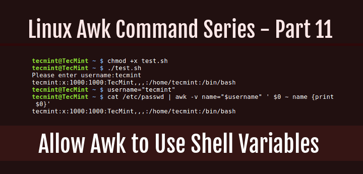

awk 系列：如何让 awk 使用 Shell 变量
==================================================

当我们编写 shell 脚本时，我们通常会在脚本中包含其它小程序或命令，例如 awk 操作。对于 awk 而言，我们需要找一些将某些值从 shell 传递到 awk 操作中的方法。

我们可以通过在 awk 命令中使用 shell 变量达到目的，在 awk 系列的这一节中，我们将学习如何让 awk 使用 shell 变量，这些变量可能包含我们希望传递给 awk 命令的值。



有两种可能的方法可以让 awk 使用 shell 变量：

### 1. 使用 Shell 引用

让我们用一个示例来演示如何在一条 awk 命令中使用 shell 引用来替代一个 shell 变量。在该示例中，我们希望在文件 /etc/passwd 中搜索一个用户名，过滤并输出用户的账户信息。

因此，我们可以编写一个 `test.sh` 脚本，内容如下：

```
#!/bin/bash

### 读取用户名
read -p "请输入用户名：" username

### 在 /etc/passwd 中搜索用户名，然后在屏幕上输出详细信息
cat /etc/passwd | awk "/$username/ "' { print $0 }'
```

然后，保存文件并退出。

上述 `test.sh` 脚本中 awk 命令的说明：

```
cat /etc/passwd | awk "/$username/ "' { print $0 }'
```

`"/$username/ "`：该 shell 引用用于在 awk 命令中替换 shell 变量 `username` 的值。`username` 的值就是要在文件 /etc/passwd 中搜索的模式。

注意，双引号位于 awk 脚本 `'{ print $0 }'` 之外。

接下来给脚本添加可执行权限并运行它，操作如下：

```
$ chmod  +x  test.sh
$ ./text.sh 
```

运行脚本后，它会提示你输入一个用户名，然后你输入一个合法的用户名并回车。你将会看到来自 /etc/passwd 文件中详细的用户账户信息，如下图所示：


*在 Password 文件中查找用户名的 shell 脚本*

### 2. 使用 awk 进行变量赋值

和上面介绍的方法相比，该方法更加单，并且更好。考虑上面的示例，我们可以运行一条简单的命令来完成同样的任务。
在该方法中，我们使用 `-v` 选项将一个 shell 变量的值赋给一个 awk 变量。

首先，创建一个 shell 变量 `username`，然后给它赋予一个我们希望在 /etc/passwd 文件中搜索的名称。

```
username="aaronkilik"
```
然后输入下面的命令并回车：

```
# cat /etc/passwd | awk -v name="$username" ' $0 ~ name {print $0}'
```


*使用 awk 在 Password 文件中查找用户名*

上述命令的说明：

- `-v`：awk 选项之一，用于声明一个变量
- `username`：是 shell 变量
- `name`：是 awk 变量

让我们仔细瞧瞧 awk 脚本 `' $0 ~ name {print $0}'` 中的 `$0 ~ name`。还记得么，当我们在 awk 系列第四节中介绍 awk 比较运算符时，`value ~ pattern` 便是比较运算符之一，它是指：如果 `value` 匹配了 `pattern` 则返回 `true`。

cat 命令通过管道传给 awk 的 `output($0)` 与模式 `(aaronkilik)` 匹配，该模式即为我们在 /etc/passwd 中搜索的名称，最后，比较操作返回 `true`。接下来会在屏幕上输出包含用户账户信息的行。

### 结论

我们已经介绍了 awk 功能的一个重要部分，它能帮助我们在 awk 命令中使用 shell 变量。很多时候，你都会在 shell 脚本中编写小的 awk 程序或命令，因此，你需要清晰地理解如何在 awk 命令中使用 shell 变量。

在 awk 系列的下一个部分，我们将会深入学习 awk 功能的另外一个关键部分，即流程控制语句。所以请继续保持关注，并让我们坚持学习与分享。


--------------------------------------------------------------------------------

via: http://www.tecmint.com/use-shell-script-variable-in-awk/

作者：[Aaron Kili][a]
译者：[ChrisLeeGit](https://github.com/chrisleegit)
校对：[wxy](https://github.com/wxy)

本文由 [LCTT](https://github.com/LCTT/TranslateProject) 原创编译，[Linux中国](https://linux.cn/) 荣誉推出

[a]: http://www.tecmint.com/author/aaronkili/
