# [玩转JavaScript OOP[0]——基础类型][0]

### 前言

long long ago，大家普遍地认为JavaScript就是做一些网页特效的、处理一些事件的。  
我身边有一些老顽固的.NET程序员仍然停留在这种认知上，他们觉得没有后端开发肯定是构建不了系统的。

编程语言和技术的结合使用，就像一个男人娶了好几个妞一样。  
在旧的时代，.NET是大房，JavaScript是偏房。  
大房是“后宫之主”，不仅要操持家业，还能给你生娃，娃将来也要继承家业的。  
偏房就没那么幸运了，在“后宫”没什么地位，虽然衣食无忧，但不能管理家族事务，生的娃也只能算是庶出，没有继承家业的权利。

But，时代变迁了，家族事业越做越大，家族也在各地开枝散叶，男人也变成了众人口中的“老爷“。  
事业这么稳定，老爷太无聊了，好色又是人的本能，老爷要找点“性趣”来满足自己了。  
大房为家族劳心劳力，岁月在她的脸上留下了很多痕迹，老爷已经逐渐失去了对她的兴趣；  
偏房悠闲度日，家族事务又不用她操心，日常事务就是打扮自己、维持自己的青春光彩。  
老爷这双好色的眸子又盯上了偏房，于是偏房终于上位了，上位当然是地位的提升，不仅能够插手家族的事业，还能让自己的娃也管理一部分生意。  
(PS：这个例子有不恰当的地方，JavaScript出现的比.NET早）

随着互联网的普及和迅速发展，JavaScript能做的事儿越来越多。  
它能做什么呢？

* 它能做网页富客户端应用，结合HTML5和CSS3它可以实现复杂的前端交互
* 它能做服务端应用，比如当前非常流行的Node.js框架
* 它可以做移动端应用，比如你可以通过PhoneGap或Titianium制作IOS和Android平台的app
JavaScript还能做其他很多事儿，JavaScript近乎无处不在。  
现在我们可以这么说，无论是PC、智能手机，还是智能电视，凡是提供了JavaScript运行环境的设备，都可以用JavaScript来做一些事情。

### 类型概述

标题揭示了这又是一个系列文章，是关于JavaScript面向对象编程的。  
在正式开始JavaScript面向对象编程前，我们需要先对JavaScript的类型有一个全面的了解。 

很多.NET程序员能够理解C#中的数据类型，但不能完全理解JavaScript的数据类型。  
JavaScript是一门弱类型的语言，它的类型虽然不如C#中那么繁多，但它胜在灵活。

例如：在C#中，1就是int类型的，true就是bool类型的，1和true是不能直接比较的。  
在JavaScript中，数字不仅仅是数字，有时还能作为条件判断的逻辑表达式。

    var count = 1;
    if(count){
        console.log("Hello!");
    }

在C#中，编译器是不允许你这么做的，下面的代码根本就编译不通过。

    var count = 1;
    if (count)
    {
        Console.WriteLine("Hello!");
    }

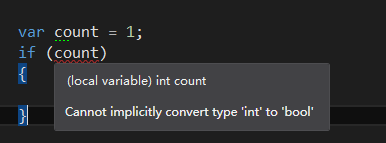

正式因为这样的灵活性，使得一些.NET的程序员在编写JavaScript代码时产生了很多困惑。  
今天我们就带着这个困惑开始这个系列之旅。

### JavaScript数据类型简介

在JavaScript中类型可以分为两大类：

* 基础类型：Number、String、Boolean、Undefined和Null。
* 复杂类型：只有Object一种。
（最新的ECMAScript 6追加了一个新的基础类型Symbol）

1. **Number**: 数字类型，它包括整数、浮点数，例如：666, 3.14。  
2. **String**: 表示文本数据的类型，例如："Hello", "JavaScript"。  
3. **Boolean**: 表示一个逻辑实体，它只有两个值true和false。  
4. **Undefined**: 表示变量未定义或未赋值，它有一个唯一的值undefined。  
5. **Null**: 它表示空、无值，它也只有一个唯一的值null。  
6. **Object**: 它表示JavaScript中的对象，例如由new Array()或new Object创建的对象。

**基础类型和复杂类型的区别**

* 基础类型的变量直接保存值，例如数字100，字符串"Hello"。
* 复杂类型的变量并不直接保存对象，而是一个指向内存中实际对象的指针。

### 基础类型

#### Number类型

.NET FCL的数字类型有多种，包括Int16、Int32、Int64、Float、Double和Decimal。  
Int16、Int32、Int64还分别包含有符号和无符号版本。

    Int16 shortValue = 73;
    Int32 intValue = 666;
    Int64 longValue = 2147483648;
    Single floatValue = 3.14f;
    Double doubleValue = 999.99;
    Decimal decimalValue = 86400.35627m;

在JavaScript中则只有一种数字类型，即Number类型，它包括整数和浮点数。  
JavaScript的数字类型还有3个特殊的表示： 

* Inifiity：正的无穷大
* -Inifity：负的无穷大
* NaN：非数字（Not a number）
下面这段JS代码定义了5个变量，分别表示这5种情况，使用typeof查看变量的类型：

    var intValue = 123;
    var floatValue = 3.14;
    var nanValue = NaN;
    var positiveInfinityValue = Infinity;
    var negativeInfinityValue = -Infinity;
    

typeof操作用于获取变量的类型，它符返回一个字符串

#### String类型

.NET的FCL有两种字符类型，分别是Char和String。  
Char用于表示一个16位的Unicode字符，String则用于表示一个字符数组。  
Char类型须用一对单引号包围字符，String类型需用一对双引号包围字符。

    // Char字符
    var ch = 'g';
    // String字符串
    var str1 = "Hello";
    // 包含双引号的字符串（使用转义字符）
    var str2 = "He said: \" It is a good job!\"";

JavaScript只有一种字符类型，即String类型。  
和.NET不同的是，JavaScript的String类型用单引号和双引号包围字符都可以，这一定程度上提供了便利性。

    // 1个字符的字符串
    var ch = 'g';
    // 字符串
    var str1 = 'Hello World';
    // 带双引号的字符串（使用转义字符）
    var str2 = "He said: \" It is a good job!\"";
    // 使用单引号表示字符串，双引号不用转义
    var str3 = 'He said: "It is a good job!"';

用typeof查看变量的类型：

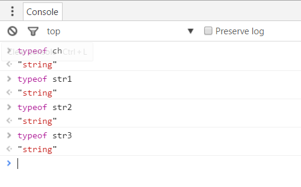

#### Boolean类型

和.NET一样，Boolean类型是表示逻辑实体，它只有true和false两个值。

    var flag = true;
    var deleted = false;

用typeof查看变量类型：

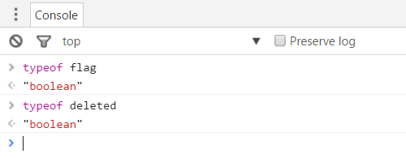

#### Null类型

.NET也有null值，表示一个空指针的对象，null值用于引用类型。

由于C#是强类型语言，所以无法通过var关键字直接将null值赋给一个变量，因为编译器无法推断它的隐式类型。 

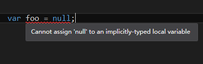

在JavaScript中，null值是Null类型的唯一值，概念上和.NET是一致的。

    var foo = null;
    

使用typeof查看变量的类型

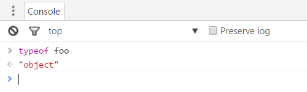

**为什么typeof null为"object"呢？**

实际上typeof null为"object"时ECMAScript的一个bug， 从JavaScript一开始出现时就是这样的，typeof null本来应该是"null"。

#### Undefined类型

.NET没有Undefined类型，Undefined是JavaScript特有的类型，表示未赋值的变量，或未定义的变量。

    // 定义变量，未赋值
    var undefinedValue1;
    // 定义变量赋值为undefined
    var undefinedValue2 = undefined;
    

如果你定义了变量却没有赋值，JavaScript引擎会自动地帮你将变量初始化为undefined值。

在Chrome控制台查看变量undefinedValue1，它的值是undefined。  
用typeof查看变量的类型：

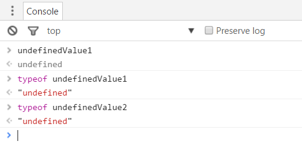

##### 判断变量是否有值

如果变量已经定义了，但不知道变量是否有值，可以通过=== undefined来判断

    var unassigndVar;
    if(unassigndVar === undefined){
        // 逻辑处理
    }else{
        // 逻辑处理
    }
    

##### 判断变量是否存在

如下变量undeclaredVar未定义，则不能用 === undefined来判断，否则浏览器会提示一个错误：  
Uncaught ReferenceError: undeclaredVar is not defined

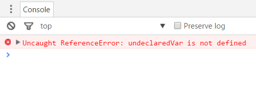

这时需要通过typeof来判断变量是否存在

    if (typeof undeclaredVar === 'undefined') {
        console.log('变量undeclaredVar未定义！');
    } else {
        console.log('Hello!');
    }
    

**小技巧**：判断变量是否有值或判断变量是否存在，都可以通过_if (typeof (variable) !== "undefined")_这种方式。

### ==和===操作符

在介绍Undefined类型时，我们使用了===，它是“相等”操作符。  
在JavaScript中，有两种“相等”操作符，分别是==和===。

* **==操作符**：用于比较两个变量的值，它会忽视变量的类型。即使两个变量的类型不一致，JavaScript引擎会先将两个变量转换成相同的类型。只要值相同，==操作符就会返回true。
* **===操作符**：不仅比较两个变量的值，它还比较两个变量的类型，只有类型和值都相同时才返回true。
我们在控制台中分别用这两个操作符比较数字1和字符串"1"，JavaScript认为1和"1"值是相等的，但类型是不相等的。

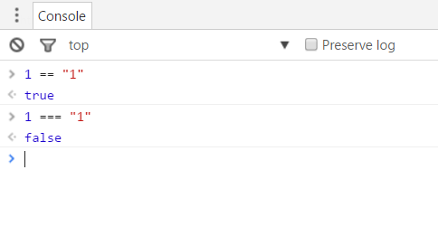

有“相等”就会有“不等”，JavaScript也提供了两种“不等”比较符，!=是宽松比较符号，!==是严格比较符。

注意：NaN是一个特殊的存在，它和任何值都是不相等的，即使是它本身。

    NaN == NaN; // false

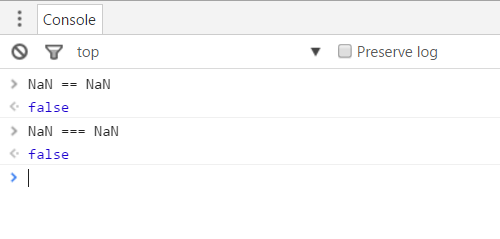

PS：在这篇文章中我没有介绍其他比较符，比如>=、<=、&&、||等，因为它们和C#中相应的操作符的表现是一致的。

### undefined和null的比较

undefined和null是两个有意思的值，undefined表示”无“或”不存在“，null表示”空“。  
从字面解释来看，它们多少有些相近的意思，二者也经常拿来作比较。

#### 区别1：值相等类型不相等

先看一段代码：

    var x;
    var y = null;
    
    console.log(x == y);
    

变量x和y是不同类型的，在Chrome控制台中输出的结果却为true，是不是有点惊讶？

我们可以这么认为：null和undefined虽然类型不同，但持有相同的值。

在Chrome的控制台中输入以下两行代码：

    null == undefined;
    null === undefined;
    

得到的结果如下：

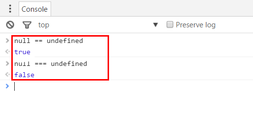

#### 区别2：和数字的运算

既然null和undefined的值是相同的，那么它们在运算上有什么区别呢？

说到运算，最常见的当然是数字的加减乘除预算，在Chrome控制台中输入以下两行代码：

    1 + null;
    1 + undefined;
    

1 + null得到的是1，1 + undefined得到的是NaN。

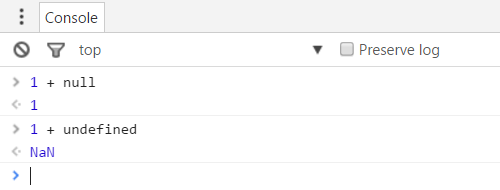

在JavaScript中，undefined和null参与运算时，有两个约定：

* 运算表达式中包含undefined的，最终的结果都是NaN。
* 运算表达式中包含null的，在运行时被当作0。
这能意味着null和0的值是相等的吗？不，null和0仍然是不相等的。

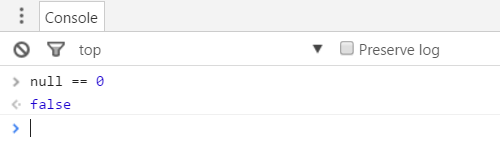

##### null和数字的加减乘除运算

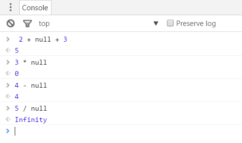

注意：5 / null的结果为Infinity，Infinity表示正的无穷大， 5 / 0的结果也是Infinity。

##### undefined和数字的加减乘除运算

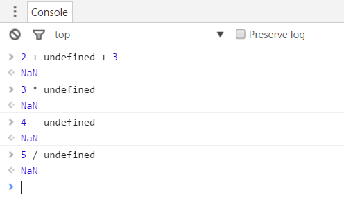

#### undefined和null比较总结

1. undefined和null持有相同的值，undefined == null返回true
1. undefined和null的类型不同，undefined === null返回false
1. undefined和数字进行加减乘除运算，结果始终为NaN
1. null和数字进行加减乘除运算，null会被当作0来运算
### Number、Boolean和String的比较

前面已经比较了null和undefined这两个特殊的存在，既然==操作符能比较值，那么Number、Boolean和String的值，放在一起比较时会有什么表现呢？

#### Number和Boolean的比较

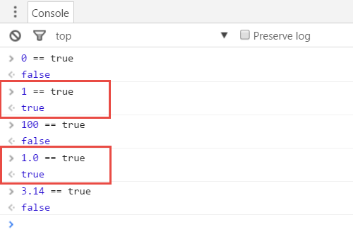

**结论：用==操作符比较Number和Boolean类型时，只有数字1才和true相等。**

#### Number和String的比较

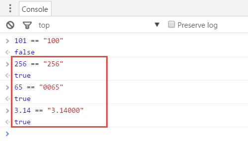

有意思的是，65 == "0065"和3.14 == "3.14000"的结果是真。

**结论：比较Number和String类型时，总是会将字符串先转换成相应的数字，然后再做比较，只要数值相同结果就为true。**

#### Boolean和String的比较

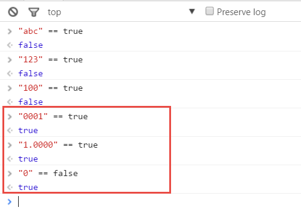

"0001" == true、"1.0000" == true和"0" == false的结果为真。

**结论：比较Boolean和String类型，如果字符串不能转换为数字类型的，则结果为false。如果能够转换为数字类型，总是先将字符串先转换成相应的数字，然后再比较，只有1才和true相等。**

### 基础类型总结

到此我们已经介绍完了JavaScript的基础类型，我们用一段代码和三幅图来总结本篇的内容

    var intValue = 666;
    var floatValue = 3.14;
    var strValue = "Hello";
    var boolValue = true;
    var nullValue = null;
    var unassignedValue;

**变量类型**

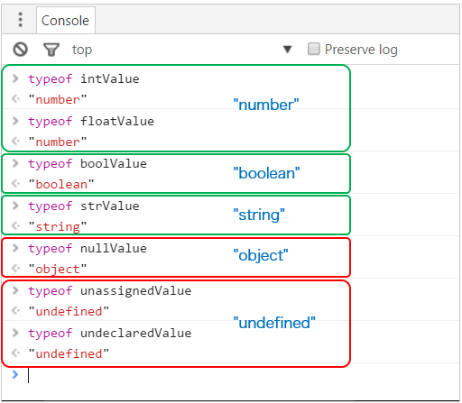

**undefined和null的比较**

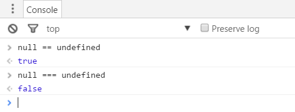

**Number、String和Boolean的==比较**

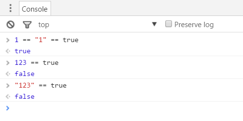

**null和undefined分别用于四则运算**

### 引用和参考

1. 《Object-Oriented JavaScript 2nd Edition》

2. [https://developer.mozilla.org/zh-CN/docs/Web/JavaScript/Data_structures][1]

[0]: http://www.cnblogs.com/keepfool/p/5559886.html
[1]: https://developer.mozilla.org/zh-CN/docs/Web/JavaScript/Data_structures