# [玩转JavaScript OOP[1]——复杂类型][0]

### 概述

在JavaScript中，我们可以使用函数、数组、对象，以及日期、正则等一些内置类型的实例，它们都是复杂类型的表现。从本质上讲，这些复杂类型都是Object类型。本篇将主要介绍三种Object类型的体现：函数、数组和对象。

### 函数

函数是JavaScript的一大重点，它非常的灵活。不像C#这种强类型语言，可以显式地声明"class"，JavaScript没有"class"的概念，但借助函数我们可以实现"class"的概念。类和对象是面向对象编程的基础，所以掌握函数是掌握JavaScript面向对象编程的前提。

#### 定义函数

JavaScript的函数有两种定义方式：函数声明和表达式声明。

##### 方式1：函数声明

    // 函数声明
    function sum(a,b){
        return a + b;
    }
    
    var result = sum(3,5); // 8;

**函数声明**：function关键字后面跟着函数名称，参数放在一对小括号中，函数内容放在大括号内。  
这段代码中，sum是函数的名称，如果指定了return语句，则可以通过变量来接收。

##### 方式2：表达式声明

    // 表达式声明
    var hello = function(){
        console.log('Hello!');
    }
    hello();

**表达式声明**：function关键字后面没有函数名称，这种函数也被称作**匿名函数**，匿名函数通常会被一个变量引用。  
这段代码中，hello不是函数的名称，它是一个指向匿名函数的指针变量。  
函数可以没有return语句，这时JavaScript引擎会自动地返回一个undefined。

##### 两种方式的区别

虽然这两种方式比较相似，但它们有一个较大的区别——**声明的提升**。  
使用方式1声明的函数会被会被提升至函数所处上下文的顶部，使用方式2则不会。

下面这段代码在浏览器中是可以工作的，并且不会报错。

    var result = sum(3,5); // 8;
    
    // JavaScript引擎将函数声明提升到顶部
    function sum(a,b){
        return a + b;
    }
    

上面这段代码会被JavaScript引擎解释为下面这段代码。

    function sum(a,b){
        return a + b;
    }
    
    var result = sum(3,5); // 8;
    

使用表达式声明的函数不会被提升，下面这段代码会报错。

    // 会报错：hello is not a function
    hello();
    
    var hello = function(){
        consol.log('Hello!');
    }
    

函数声明使得JavaScript引擎提前获知了函数的名称，匿名函数由于没有名称，JavaScript引擎无法对它进行提升。

**小提示：无论使用哪种方式，应该先声明函数再使用，这样才不会出错。**

#### 函数的类型

使用typeof查看函数的类型时，得到的结果是"function"。  
在JavaScript中，函数是一种特殊的引用类型，所有非函数的引用类型使用typeof都会返回"object"。

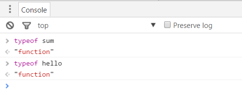

之前提到了JavaScript只有一种复杂类型（引用类型）——Object类型，函数既然是引用类型，那么怎么证明他是属于Object类型的呢？

##### 使用instanceof操作符

虽然JavaScript没有类的概念，但是它有构造函数的概念，JavaScript是通过构造函数来创建对象实例的。  
instanceof操作符可以用来判断某个构造函数的prototype属性所指向的對象是否存在于另外一个要检测对象的原型链上。  
后面的文章会讲到prototype和原型链，如果你不理解这句话，则可以将这个操作符看成C#中的is操作符（判断对象是否为某个类的实例）。

下面这幅图揭示了sum函数是Function的实例，Function又是Object的实例，sum也是Object的实例。

(./img/341820-20160606071352199-261361681.png)  
Function()和Object()是JavaScript内置的两个构造函数。

sum()函数同样可以通过Function()函数来实现：

    var sum = new Function('a','b', 'return a + b;');
    

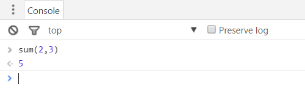

Function()构造函数的前面几个参数都表示函数的参数，最后一个参数表示函数的内容。  
不管是函数参数还是函数内容，都是用字符串表示的，JavaScript引擎在运行时才需要先解析这种方式声明的函数，才能确定其形式。  
虽然Function()构造函数可用于创建函数，但不建议这么做，因为它会使代码难以理解和调试。

小提示：在JavaScript中，new后面接的肯定是一个构造函数，例如new Function()、new Object()。

#### 函数的本质是数据

**函数本质上是数据**，这是一个比较重要的概念。  
函数可以用表达式声明，并将其赋给一个变量。  
变量用于存储数据，变量要么存储基础类型的值，要么存储引用类型的地址。

下面这段代码，sum是一个变量，存储的却是函数指针。  
同时，这个匿名函数被当成一般的值，并赋给了变量add。

    var sum = function (a, b) {
        return a + b;
    };
    
    var add = sum;
    add(6,4);   // 10
    

JavaScript的函数就是数据，但它们是一种特殊的数据：

* 包含代码
* 这些代码可以被执行或被调用
### 对象

使用基础类型时，我们只能一个变量存储一个值，如果要将多个值存储在一个变量中，可以使用对象。  
JavaScript中的对象是动态的，对象中包含属性，属性以key-value形式存在。  
由于JavaScript的灵活性，使得我们可以为在任意地方指定对象的属性，对象的属性也可以被指定为任意类型。

#### 创建对象

在使用对象前，我们应该先创建对象。  
对象有两种创建方式：使用{}或Object()构造函数。

    // 方式1：使用{}创建对象
    var person = {
        name: 'keepfool',
        job: 'developer',
        say: function() {
            return 'Hello! I am ' + this.name + ', I am a ' + this.job;
        }
    };
    
    // 方式2：使用Object()构造函数
    var player = new Object();
    player.name = 'Stephen Cury';
    player.age = 28;
    player.play = function() {
        return 'I am ' + this.name + ', ' + this.age + ' years old, I play basketball very well!';
    }
    

这两种方式本质上没有什么区别，使用方式1声明对象时，JavaScript引擎背后做的工作和new Object()是一样的。  
方式1相当于方式2的快捷方式，建议使用方式1来创建。

在对象初始化后，你可以在任意时间给对象追加新的属性。

    // 方式1：使用{}创建对象
    var person = {
        name: 'keepfool',
        job: 'developer',
        say: function() {
            return 'Hello! I am ' + this.name + ', I am a ' + this.job;
        }
    };
    
    // 追加新的属性
    person.weigh = '70kg';
    person.run = function() {
        return 'I am running!';
    }

**注意：**person对象的say属性是一个函数，当函数作为对象的一个属性时，我们称之为“方法”。  
对象的属性就是数据，JavaScript的属性可以是方法，方法本质上是函数，从这个层面又印证了“函数就是数据”的说法。  
say方法中用到了this，this是一个指针，它指向person对象本身，this.name即person.name。

##### 访问属性

访问对象属性的方式也有两种：使用_object.property_和_object['property']_。

_object.property_方式：

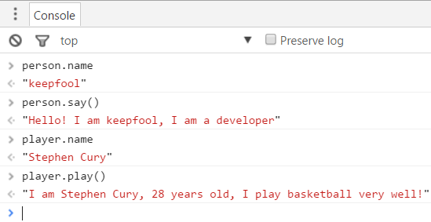

_object['property']_方式：

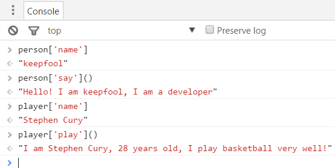

**注意：**person的say属性和player的play属性都是方法，通过person.say和player.play得到的是方法的指针（函数的指针），使用()才是调用对象的方法。  
由于数组也提供了[]方式访问元素，为了区分数组和对象，建议使用_object.property_方式访问属性。

#### 对象的类型

使用typeof查看对象的类型，得到的结果都是"object"。

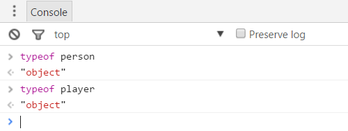

使用instanceof检测是否为Object类型，得到的结果都是true。

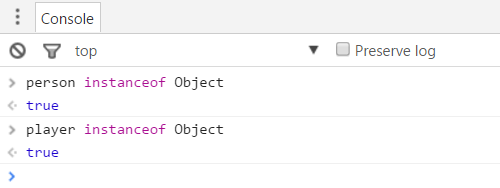

### 数组

在C#中，数组中的元素是同一个类型的，JavaScript则不然。  
在JavaScript中，你可以在数组中存储任意类型的值，数组元素可以是数字、字符、日期、对象、数组等等。  
这和C#中的ArrayList有些相似。

#### 创建数组

在JavaScript中，创建数组有两种方式：

    // 方式1：使用[]创建数组
    var arr1 = [1,"Hello", true, {id : 1, name : "keepfool"}];
    
    // 方式2：使用Array()构造函数创建数组
    var arr2 = new Array(1, "Hello", true, {id : 1, name : "keepfool"});
    

方式1和方式2本质上是一样的，在使用方式1声明数组时，JavaScript引擎做的事情和new Array()也是一样的。  
方式1比方式2更加便捷直观一些，建议使用方式1。

##### 访问数组元素

数组是一个有序的数据集合，通过[]索引器可以访问数组元素。

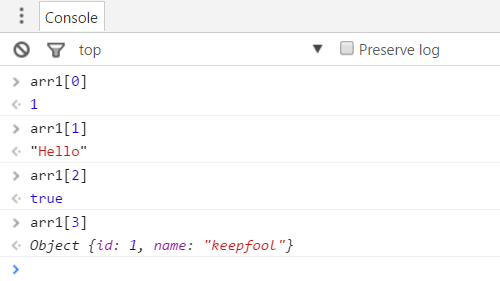

#### 数组的类型

使用typeof查看数组的类型时，得到的结果是"object"。

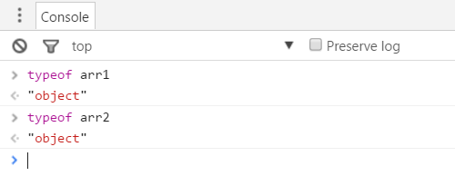

##### 数组的检测

如果你定义了多个变量，有些变量用于表示对象，有些变量用于表示数组。  
将typeof操作符应用于对象或数组变量，得到的结果都是"object"。  
我们怎么区别哪个变量是对象，哪个变量时数组呢？有两种方式可以鉴别。

**方式1：使用instanceof**

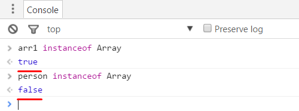

  
**方式2：使用isArray()方法**

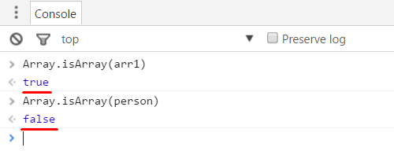

##### 数组是否为Object？

instanceof操作符检测函数的类型是Object的，那么数组也可以用这种方式来检测。

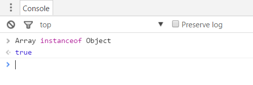

所以数组本质上也是Object类型的。

### 复杂类型总结

* 函数、对象和数组都是Object类型的实例，使用Instanceof操作符可以检测它们
* 函数的本质是数据，function是Function的实例，Function又是Object的实例
* 对象是由属性构成的，对象的属性可以是任意类型的
* 数组是有序的数据集合，数组元素可以是任意类型的，Array是Object的实例

[0]: http://www.cnblogs.com/keepfool/p/5562613.html