# [玩转JavaScript OOP[4]——实现继承的12种套路][0]

### 概述

在之前的文章中，我们借助构造函数实现了“类”，然后结合原型对象实现了“继承”，并了解了JavaScript中原型链的概念。

理解这些内容，有助于我们更深入地进行JavaScript面向对象编程。

由于JavaScript是一门基于对象和原型的弱语言，灵活度非常高，这使得JavaScript有各种套路去实现继承。本篇文章将逐一介绍实现继承的12种套路，它们可以适用于不同的场景，总一种套路适合你。

（亲：文章有点长，请点击右侧的「显示文章目录」按钮，以便导航和阅读哦。）

### 01.原型链（经典模式）

这是实现继承的经典方式，这种方式我就不再多做介绍了，具体请参考上一篇文章。

```js
    function Person(name) {
        this.name = name;
    }
    Person.prototype.sayHello = function() {
        return 'Hello, I am ' + this.name +'!';
    }
    
    function Employee(name,email) {
        this.name = name;
        this.email = email;
    }
    
    Employee.prototype = new Person();
    Employee.prototype.constructor = Employee;
    
    var emp = new Employee('keepfool','keepfool@xxx.com');
```
#### 实现要点

* 基于构造函数和原型链
* 子类构造函数的原型指向父类构造函数的一个对象
* 重写子类构造函数原型对象的constructor
### 02.仅继承父构造函数的原型

以上的sayHello()方法是定义在Person.prototype上的，name属性在Employee()构造函数也定义了，所以我们可以只用继承副高早函数的原型。
```js
    /*
     * 继承方式02：共用父构造函数的原型对象
     */
            
    function Person(name) {
        this.name = name;
    }
    Person.prototype.sayHello = function() {
        return 'Hello, I am ' + this.name +'!';
    }
    
    function Employee(name,email) {
        this.name = name;
        this.email = email;
    }
    
    Employee.prototype = Person.prototype;
    Employee.prototype.constructor = Employee;
```

和01方式唯一的区别在于Employee.prototype = Person.prototype这行代码。

#### 实现要点

* 基于构造函数，但不基于原型链
* 子构造函数和父构造函数共用一个原型对象
* 重写子类构造函数原型对象的constructor
#### 优点

* 由于共用一个原型对象，访问对象的属性和方法时无需遍历原型链，使得访问效率得以提升
* 实现继承关系时，不需要新建父构造函数的实例
#### 缺点

* 由于共用一个原型对象，所以当子对象修改复杂类型的属性时，会同时影响父对象。
```js
    Employee.prototype.sayHello = function(){
        return 'Hello, I am ' + this.name + ', my email is ' + this.email;
    }
    
    var person = new Person('Jack');  
```

这段代码修改了Employee.prototype.sayHello方法，同时也影响了Person.prototype.sayHello方法。

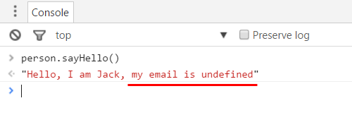

### 03. 借用构造函数

在01和02两种方式中，Person()构造函数和Employee()构造函数都定义了name属性。  
如果Person()和Employee()构造函数相同的属性很多，在Employee()构造函数中将会出现大量重复的this.xxx = xxx赋值操作。

使用apply()方法借用Person()构造函数，可以减少这些重复的赋值操作。

#### 初版
```js
    function Person(name) {
        this.name = name;
        
        //调用Person.apply(this,[name])后，emp对象也会拥有favorites属性
        this.favorits = ['orange','apple'];
    }
    Person.prototype.sayHello = function() {
        return 'Hello, I am ' + this.name +'!';
    }
    
    function Employee(name,email) {
        Person.apply(this,[name]);
        this.email = email;
    }
    
    var emp = new Employee('keepfool', 'keepfool@xxx.com');
    
```
**注意：**当未指定Employee.prototype = new Person()时，emp对象是可以访问favorites属性的。因为Person.apply(this,[name,age]);中的this是Employee()构造函数的实例，调用apply方法时，Person()构造函数中的属性和方法都会被分配给this对象，所以emp对象是可以访问favorites属性的。

#### 完整版
```js
    /*
     * 继承方式03：借用构造函数
     */
            
    function Person(name) {
        this.name = name;
        
        //调用Person.apply(this,[name])后，emp对象也会拥有favorites属性
        this.favorits = ['orange','apple'];
    }
    Person.prototype.sayHello = function() {
        return 'Hello, I am ' + this.name +'!';
    }
    
    function Employee(name,email) {
        // 第2次调用Person()构造函数
        Person.apply(this,[name]);
        this.email = email;
    }
    
    // 第1次调用Person()构造函数
    Employee.prototype = new Person();
    Employee.prototype.constructor = Employee;
    
    var emp = new Employee('keepfool', 'keepfool@xxx.com');
    
```

#### 实现要点

* 在子构造函数中使用apply()方法，借用父构造函初始化子构造函数的属性和方法
* 基于构造函数和原型链，子类构造函数的原型指向父类构造函数的一个对象
* 重写子构造函数原型对象的constructor
#### 缺点

* 父构造函数会被调用2次：第1次是Employee.prototype = new Person();，第2次是调用Person.apply()方法。
### 04.临时构造函数
```js

    /*
     * 继承方式04：使用临时构造函数
     */
    
    // Person
    function Person(name) {
        this.name = name;
        this.favorites = ['orange','apple'];
    }
    Person.prototype.sayHello = function() {
        return 'Hello, I am ' + this.name +'!';
    }
    
    // Employee
    function Employee(name,email) {
        this.name = name;
        this.email = email;
    }
    
    // Developer
    function Developer(name, email, skills){
        this.name = name;
        this.email = email;
        this.skills = skills;
    }
    
    /* 1.借助临时构造函数实现Employee()继承Person() */
    var F = function() {};
    F.prototype = Person.prototype;
    
    Employee.prototype = new F();
    Employee.prototype.constructor = Employee;
    
    
    /* 2.借助临时构造函数实现Developer()继承Employee() */
    var F = function(){};
    F.prototype = Employee.prototype;
    
    Developer.prototype = new F();
    Developer.prototype.constructor = Developer;
    
    var emp = new Employee('keepfool','keepfool@xxx.com');
    var dev = new Developer('Jack','Jack@xxx.com',['C#','JavaScript','HTML5'])
     **注意：**子构造函数只继承定义在父构造函数原型对象上的属性和方法，例如：Employee()只继承定义在Person.prototype上的属性和方法，Person()构造函数中定义的favorites属性不会被Employee()继承。
```

#### 实现要点

* 基于构造函数和原型链，临时构造函数的原型指向父构造函数的原型对象
* 子构造函数的原型指向临时构造函数的一个实例
* 重写子构造函数原型对象的constructor
#### 缺点

* 每次实现继承时都需要创建临时构造函数
#### uber——让子对象访问父对象

在介绍uber前，我们先看下面一则代码：

```js
    // Person
    function Person(name) {
        this.name = name;
    }
    Person.prototype.type = 'Person';
    Person.prototype.toString = function(){
        return this.type;
    }
    
    // Employee
    function Employee(name,email) {
        this.name = name;
        this.email = email;
    }
    
    // Developer
    function Developer(name, email, skills){
        this.name = name;
        this.email = email;
        this.skills = skills;
    }
    
    
    var F = function() {};
    F.prototype = Person.prototype;
    Employee.prototype = new F();
    Employee.prototype.constructor = Employee;
    Employee.prototype.type = 'Employee';
    
    var F = function(){};
    F.prototype = Employee.prototype;
    Developer.prototype = new F();
    Developer.prototype.constructor = Developer;
    Developer.prototype.type = 'Developer';
    
    var emp = new Employee('keepfool','keepfool@xxx.com');
    var dev = new Developer('Jack','Jack@xxx.com',['C#','JavaScript','HTML5'])
    
```


这则代码通过临时构造函数构建了Developer → Employee → Person继承关系。  
调用emp.toString()，会输出"Employee"； 调用dev.toString()，则会输出"Developer"。 

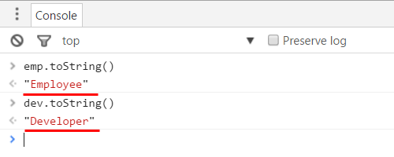

如果希望emp.toString()输出"Person,Employee"，dev.toString()输出"Person,Employee,Developer"，我们该如何做呢？   
这意味着我们需要遍历原型链。

在构建继承关系时，可以为**子构造函**数引入**uber属性**，并将它**指向父构造函数的原型对象**（因为toString()方法是定义在Person.prototype上的）。 

uber这个词表示“超级的”（不是优步哦），意指引用父类。为什么不用super呢？因为super是JavaScript的一个保留关键字。

```js
    // Person
    function Person(name) {
        this.name = name;
    }
    Person.prototype.type = 'Person';
    Person.prototype.toString = function(){
        return this.constructor.uber ? this.constructor.uber.toString() + ',' + this.type : this.type;
    }
    
    // Employee
    function Employee(name,email) {
        this.name = name;
        this.email = email;
    }
    
    // Developer
    function Developer(name, email, skills){
        this.name = name;
        this.email = email;
        this.skills = skills;
    }
    
    
    var F = function() {};
    F.prototype = Person.prototype;
    Employee.prototype = new F();
    Employee.prototype.constructor = Employee;
    
    /* 1.引入uber属性，使它指向Person()构造函数的原型对象 */
    Employee.uber = Person.prototype;
    Employee.prototype.type = 'Employee';                       
    
    var F = function(){};
    F.prototype = Employee.prototype;
    Developer.prototype = new F();
    Developer.prototype.constructor = Developer;
    
    /* 2.引入uber属性，使它指向Person()构造函数的原型对象 */      
    Developer.uber = Employee.prototype;
    Developer.prototype.type = 'Developer';
    
    var emp = new Employee('keepfool','keepfool@xxx.com');
    var dev = new Developer('Jack','Jack@xxx.com',['C#','JavaScript','HTML5'])
    
```

再次调用emp.toString()和dev.toString()方法：

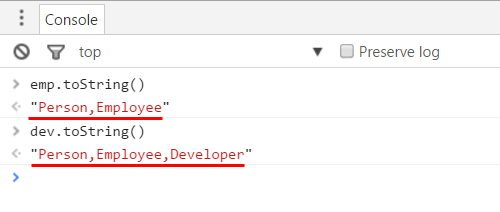

有些人可能不是明白这个过程，也可能会对下面这几行代码产生好奇：

    Person.prototype.toString = function(){
        return this.constructor.uber ? this.constructor.uber.toString() + ',' + this.type : this.type;
    }
    

我们以emp对象为例来解释为什么emp.toString()会输出"Person,Employee"。 

1. 由于Employee.prototype.constructor === emp.constructor === Employee，所以Employee.uber === emp.constructor.uber。
1. this.constructor.uber中的this是emp对象， 我们将它看作emp.constructor.uber，也就是Employee.uber，
1. 而Employee.uber指向Person()的原型对象，执行this.constructor.uber.toString()相当于执行Person.prototype.toString()方法，这个方法输出为'Person'。
1. type属性是定义在原型对象上的，this.type就是emp.type，由于Employee.prototype.type = 'Employee'，所以this.type的值为'Employee'。
1. 因此，emp.toString()方法的输出结果最终是'Person, Employee'。
#### 将继承封装为函数

在构建Devloper → Employee → Person的继承关系时，我们使用了2次临时构造函数，这些代码是重复的，我们可以把实现继承关系的代码提炼为一个函数。

```js
    /*
     * 继承方式04：使用临时构造函数-精简版
     */
    
    // Person
    function Person(name) {
        this.name = name;
    }
    Person.prototype.type = 'Person';
    Person.prototype.toString = function(){
        return this.constructor.uber ? this.constructor.uber.toString() + ',' + this.type : this.type;
    }
    
    // Employee
    function Employee(name,email) {
        this.name = name;
        this.email = email;
    }
    
    // Developer
    function Developer(name, email, skills){
        this.name = name;
        this.email = email;
        this.skills = skills;
    }
    
    function extend(Child,Parent){
        var F = function(){};
        F.prototype = Parent.prototype;
        Child.prototype = new F();
        Child.prototype.constructor = Child;
    
        Child.uber = Parent.prototype;
    }
    
    extend(Employee,Person);
    Employee.prototype.type = 'Employee';
    
    extend(Developer,Employee);
    Developer.prototype.type = 'Developer';
    
    var emp = new Employee('keepfool','keepfool@xxx.com');
    var dev = new Developer('Jack','Jack@xxx.com',['C#','JavaScript','HTML5'])
    
```


这段代码引入了一个extend()函数，指定了2个参数，分别表示Child和Parent，并将临时构造函数封装在exntend()中。

当我们需要构建继承关系时，首先定义好构造函数，然后将构造函数传入extend()方法就可以实现继承了。 使用extend()方法，既能够让我们的代码保持整洁，又能够达到重用的目的。

### 05.拷贝父构造函数原型对象的属性

由于继承是为了使代码能够重用，难道我们就不能简单地将一个对象的属性拷贝给另外一个吗？

这当然是可以的，沿用上面的代码，我们将extend()方法替换为extend2()方法：
```js
    function extend2(Child,Parent){
    
        var p = Parent.prototype;
        var c = Child.prototype;
    
        for(var i in p){
            c[i] = p[i];
        }
    
        c.uber = p;
    }
    
```


通过for循环，我们将Parent.prototype中的属性拷贝到了Child.prototype。

#### extend2()和extend()的比较

extend2()方法和extend()方法有两个不同之处。

##### extend2()不需要重写Child.prototype.constructor

在extend()方法中，由于Child.prototype = new F()这行代码使得Child.prototype被覆盖了，所以extend()方法需要重写Child.prototype.constructor。 

而在extend2()方法中，Child.prototype没有被覆盖，所以无需重写Child.prototype.constructor，Child.prototype.constructor本来就是指向Child的。 

##### extend2()拷贝原型属性

下面这段代码，定义了一个Person()和Employee()构造函数，Person.prototype提供了一个基础类型的type属性，以及一个复杂类型的toString()方法。
```js
    // Person
    function Person(name) {
        this.name = name;
    }
    Person.prototype.type = 'Person';
    Person.prototype.toString = function(){
        return this.constructor.uber ? this.constructor.uber.toString() + ',' + this.type : this.type;
    }
    
    // Employee
    function Employee(name,email) {
        this.name = name;
        this.email = email;
    }
    
```


如果使用extend()函数构建继承关系，则type属性既不是emp对象的属性，也不是Employee.prototype的属性（提示：Employee.prototype === emp.__proto__）。

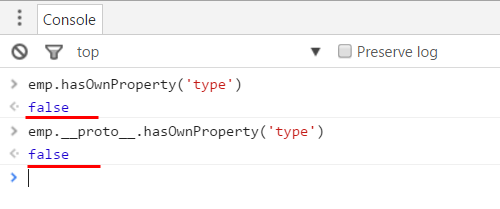

如果使用extend2()函数构建继承关系，type属性会成为Employee.prototype的属性。

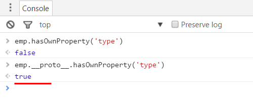

需要注意的是，toString()方法由于是复杂类型，extend2()方法只拷贝了toString()方法的引用。  
也就是说Employee.prototype.toString和Person.prototype.toString是同一个引用。 


##### extend()和extend2()效率的比较

通过以上示例，可以看到extend2()函数的效率是不如extend()函数的，因为extend2()在拷贝属性时，每一个定义于Parent.prototype中的属性，都要在Child.prototype中重建。 

但这并不是很糟糕，因为extend2()方法只重建了基础类型，复杂类型则是拷贝了引用，重建基础类型属性造成的性能的损失是可以接受的。 

extend2()方法有两个好处： 

1. **可以减少在原型链的遍历和查找，因为基础类型的属性通过第一层的原型链就能找到，因为这些属性已经拷贝到Child.prototype上了。**
1. **Parent.prototype上定义的方法得以重用，且无须在Child.prototype中重建，例如上述的toString()方法。**
#### 引用类型拷贝的隐患

实际上，复杂类型（引用类型）都是通过拷贝引用来完成的，共用一个引用可能会导致一些预期之外的结果。  
例如：在Person.prototype上定义一个favorites属性，它是数组类型的，当然也是引用类型。

    Person.prototype.favorites = ['orange','apple'];

然后我们使用Employee()构造函数创建两个对象。

    var emp1 = new Employee('Jack', 'jack@xxx.com');
    var emp2 = new Employee('Rose','rose@xxx.com');
    emp2.favorites;     // ['orange','apple']
    emp1.favorites.push('banana');
    emp2.favorites;     // ['orange','apple','nanana']
    

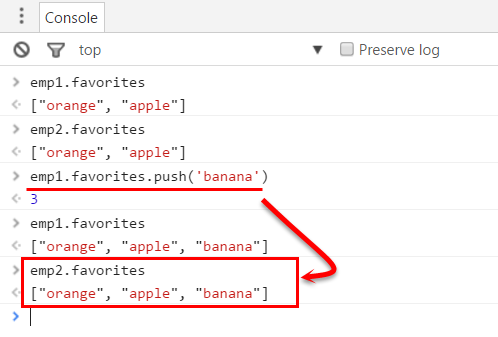

emp2.favorites最开始是['orange','apple']，然后通过数组的push方法更改了emp1.favorites，由于emp2.favorites和emp1.favorites指向同一个引用，所以emp2.favorites也变成了 ['orange','apple','nanana']。 

也就是说，emp1的改变影响了emp2，这不是我们预期的结果。 

**所以当使用extend2()实现继承时，对待引用类型应该谨慎，应该尽量避免对象修改类型为引用类型的属性。**

### 06.借用构造函数并拷贝原型

**借用构造函数**会带来重复执行两次构造函数的问题，我们可以结合apply()和extend2()函数来修复这个问题。  
使用apply()方法调用父构造函数，获取父构造函数自身的属性，然后使用extend2()函数继承父构造函数的原型属性。

```js
    /*
     * 继承方式06.借用构造函数并拷贝原型
     */
            
    function Person(name) {
        this.name = name;
        this.favorites = ['orange','apple'];
    }
    
    Person.prototype.type = 'Person';
    Person.prototype.sayHello = function() {
        return 'Hello, I am ' + this.name +'!';
    }
    
    function Employee(name,email) {
        // 调用Person()构造函数
        Person.apply(this,[name]);
        this.email = email;
    }
    
    
    function extend2(Child,Parent){
        var p = Parent.prototype;
        var c = Child.prototype;
        
        for(var i in p){
            c[i] = p[i];
        }
        
        c.uber = p;
    }
    // 继承Person()构造函数的原型对象的属性
    extend2(Employee,Person);
    Employee.prototype.type = 'Employee';
    
    var emp = new Employee('keepfool','keepfool@xxx.com');
    
```
这时，emp对象不仅继承了Person()构造函数中的属性，也继承了Person()构造函数原型对象上的属性。  
另外，emp对象还可以通过uber属性访问父对象。

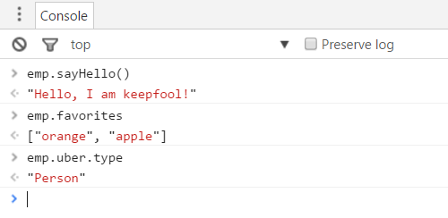

这种方式是03和05的结合，**它使得我们可以在不重复调用父构造函数的情况下，同时继承父构造函数的自身属性和原型属性。**

#### 实现要点

* 基于构造函数和原型链工作
* 拷贝父构造函数的原型属性
### 07.对象的浅拷贝

在这之前，我们使用构造函数来创建“类”，并使用new构造函数创建对象。 然后，我们通过Child.prototype = new Parent()来构建继承关系，这里的new Parent()也是调用了构造函数。 

在实现“类”、“继承”这些概念的过程中，构造函数充当了一个中间人的作用，继承的目的是对象的属性和方法可以被其他对象重用。 

如果不使用构造函数，直接进行对象之间的拷贝难道不可行吗？   
这当然是可行的，我们首先介绍一种方式——对象的浅拷贝。
```js
    /*
     * 继承方式07：对象的浅拷贝
     */
            
    function shallowCopy(p){
        var c = {};
        for(var i in p){
            c[i] = p[i];
        }
        c.uber = p;
        return c;
    }
    
    var person = {
        type : 'Person',
        toString : function(){
            return this.type;
        }
    }
    
    var emp = shallowCopy(person);
    emp.type = 'Employee';
    emp.name = 'keepfool';
    emp.email = 'keepfool@xxx.com';
    
    // 在重写emp的toString()方法前，emp.toString === person.toString为true
    emp.toString = function(){
        return this.uber.toString() + ', ' + this.type;
    }
    
```


**注意：**  
1. c.uber = p这行代码，表示子对象的uber属性指向父对象。   
2. toString()方法是引用类型，拷贝时只拷贝引用。然后emp.toString = function() { ... }将重写了该方法，重写不会影响person.toString。

该方式不仅继承了父对象的属性，还可以通过uber属性来访问父对象。

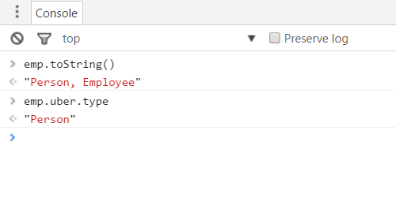

#### 实现要点

* 基于对象工作
* 遍历父对象的所有属性，基础类型的属性完全拷贝，复杂类型的属性则只拷贝引用
* 子对象的uber属性引用父对象
#### 优点

* 不用定义构造函数
* 不用遍历原型链
#### 缺点

* 由于没有构造函数，子对象的属性每次都要手动声明，例如emp.name，emp.email。
* 由于是浅拷贝，所以存在引用类型的拷贝隐患。
### 08.对象的深拷贝

在拷贝属性时，如果是引用类型的拷贝，由于共用一个对象，则可能存在一些隐患，深拷贝有助于解决这个问题。  
浅拷贝和深拷贝最大的区别是：**如果属性为复杂类型，浅拷贝是拷贝其引用，而深拷贝则会创建一个新的复杂类型。**
```js
    /*
     * 继承方式08：对象的深拷贝
     */
            
    function deepCopy(p,c){
        c = c || {};
        for(var i in p){
            // 属性i是否为p对象的自有属性
            if(p.hasOwnProperty(i)){
                // 属性i是否为复杂类型
                if(typeof p[i] === 'object'){
                    // 如果p[i]是数组，则创建一个新数组
                    // 如果p[i]是普通对象，则创建一个新对象
                    c[i] = Array.isArray(p[i]) ? [] : {};
                    // 递归拷贝复杂类型的属性
                    deepCopy(p[i],c[i]);
                }else{
                    // 属性是基础类型时，直接拷贝
                    c[i] = p[i];
                }
            }
        }
        return c;
    }
```


深拷贝的实现逻辑，已经很清晰地在注释中描述了，请注意这段代码是如何处理数组类型和对象类型的。

下面这段代码使用deepCopy()方法创建了一个child对象。
```js
    var parent = {
        name : 'keepfool',
        age : 28,
        favorites : ['orange','apple'],
        experience : {
            limit : 7,
            skills : ['C#','JavaScript','HTML5']
        }
    };
    
    // 修改child对象的属性，不会影响parent对象
    var child = deepCopy(parent);
```


如果修改child对象的复杂类型属性，不会对parent对象造成影响，因为child和parent是两个完全独立的个体，它们互不依赖。

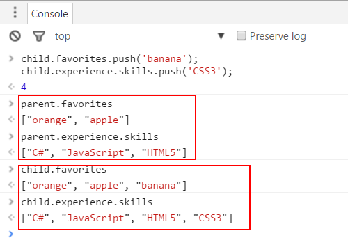

#### 实现要点

* 基于对象工作
* 遍历父对象的所有属性，基础类型的属性和复杂类型的属性都会重建
* 复杂类型属性需要递归调用deepCopy()方法
### 09.使用object()函数

基于对象继承对象的理念，Douglas Crockford提出了一个建议，使用object()函数，接收父对象，然后返回父对象的原型。
```js
    function object(o) {
        function F() {}
        F.prototype = o;
        return new F();
    }
    
```


如果要访问父对象，则为子对象添加uber属性，并指向父对象。
```js
    /*
     * 继承方式09：使用object()函数
     */
    function object(o) {
        
        var n;
        function F() {}
        F.prototype = o;
        n = new F();
        n.uber = o;
        return n;
    }
    
```


使用object()函数和使用shallowCopy()函数是一样的，复杂类型的拷贝仍然是引用拷贝。
```js
    var person = {
        type: 'Person',
        favorites : ['orange','apple'],
        toString: function() {
            return this.type;
        }
    }
    var emp = object(person);
```

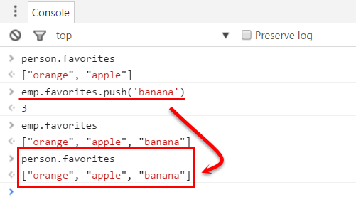

#### 实现要点

* 基于对象和原型链工作
* 使用了临时构造函数
### 10. 原型继承与属性拷贝的混合模式

继承的目的之一在于重用已有对象的属性，然后在子对象上扩展一些额外的属性。  
既然如此，我们可以将原型继承和属性拷贝混合起来使用。

通俗地讲，就是我们不仅使用现有对象（使用原型的属性），还要基于现有的对象扩展一些属性。
```js
    /*
     * 继承方式10：原型继承与属性拷贝的混合模式
     */
    function objectPlus(o, stuff) {
        var n;
        // 1. 从对象o继承原型
        function F() {}
        F.prototype = o;
        n = new F();
        n.uber = o;
        // 2. 从对象stuff拷贝属性
        for (var i in stuff) {
            n[i] = stuff[i];
        }
        return n;
    }
```

objectPlus()方法有两个参数，第1个参数用于继承原型，第2个参数用于拷贝属性。  
下面这段代码：person对象是一个参数，用于继承原型；{}匿名对象中定义了一些属性，用于扩展子对象的属性。
```js
    var person = {
        type: 'Person',
        favorites : ['orange','apple'],
        toString: function() {
            return this.type;
        }
    }
    var emp = objectPlus(person, {
        type : 'Employee',
        name: 'keepfool',
        email: 'keepfool@xxx.com',
        toString : function(){
            return this.uber + ',' + this.type;
        }
    });
```

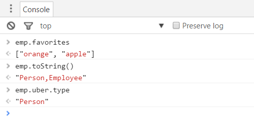

这种方式使得我们一次性完成了对象的继承和扩展。

#### 实现要点

* 基于对象和原型链工作
* 遍历父对象的所有属性，基础类型的属性完全拷贝，复杂类型的属性则只拷贝引用
### 11. 多重继承

  
像C#,Java这样的面向对象编程语言，是不支持多重继承的（但是支持多重接口实现）。  
但对于JavaScript这样的动态语言，实现多重继承就比较简单了。

下面这段代码定义了一个multi()函数，它没有显式地定义参数。但通过arguments可以获取调用函数时的参数，所以我们只需遍历arguments参数，然后拷贝每个参数对象的属性即可。
```js
    /*
     * 继承方式11：多重继承
     */
    function multi() {
        var n = {},
            stuff, j = 0,
            len = arguments.length;
        for (j = 0; j < len; j++) {
            stuff = arguments[j];
            for (var i in stuff) {
                n[i] = stuff[i];
            }
        }
        return n;
    }
    
```

使用multi()函数：
```js
    var person = {
        type: 'Person',
        toString: function() {
            return this.type;
        }
    };
    var emp = {
        type: 'Employee',
        name: 'keepfool',
        email: 'keepfool@xxx.com'
    };
    var dev = multi(person, emp, {
        type: 'Developer',
        age: 28,
        skills: ['C#', 'JavaScript']
    });
```

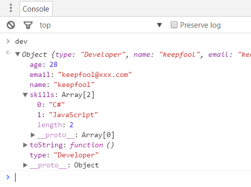

注意：如果arguments数组中的对象存在相同的属性，则后遍历的对象属性会覆盖先遍历的对象属性。

#### 实现要点

* 遍历argument数组的每一个元素（每一个元素都是对象）
* 遍历对象的所有属性，基础类型的属性完全拷贝，复杂类型的属性则只拷贝引用
### 12.寄生继承

寄生继承是指：在创建对象的函数中，创建要返回的对象时，首先直接吸收其他对象的属性，然后再扩展自己的属性。  
这个过程就好似一个对象的创建是寄生在另外一个对象上完成的。

下面这段代码，employee()是寄生继承函数，实现寄生函数时借用了09条的object()函数。
```js
    /*
     * 继承方式12：寄生继承
     */
    function object(o) {
        var n;
    
        function F() {}
        F.prototype = o;
        n = new F();
        n.uber = o;
        return n;
    }
    
    var person = {
        type: 'Person',
        toString: function() {
            return this.type;
        }
    };
    
    // employee()是寄生函数
    function employee(name, email) {
        // 寄生peson对象
        var that = object(person);
        
        // 然后扩展自己的属性
        that.type = 'Employee';
        that.toString = function(){
            return this.uber.type + ',' + this.type;
        }
        
        return that;
    }
    
    var emp = employee('keepfool','keepfoo@xxx.com');
    
```


注意：这段代码中的that不是一个关键字，它只是一个普通的对象。

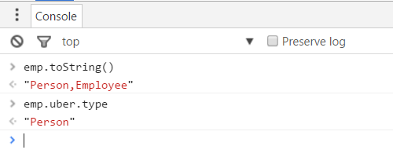

#### 实现要点

* 基于对象和原型链工作
* 使用object()函数
### 总结

由于这篇文章的篇幅较长，读到这儿的人，可能已经忘了我这篇文章开头讲的是什么内容了。但这并不要紧，咱们来个全篇的总结，能让你马上回忆起来。

编号 原型链 示例

01 原型链（经典模式） 
```js
    Child.prototype = new Parent();
                            
```
02 仅继承父构造函数的原型 
```js
    Child.prototype = Parent.prototype;
                            
```
03 借用构造函数 
```js
    function Child() {
        Parent.apply(this, arguments);
    }
                            
```
04 临时构造函数 
```js
    function extend(Child,Parent) {
        var F = function() {};
        F.prototype = Parent.prototype;
        Child.prototype = new F();
        Child.prototype.constructor = Child;
        Child.uber = Parent.prototype;
    }
                            
```
05 复制父构造函数的原型属性 
```js
    function extend2(Child, Parent) {
        var p = Parent.prototype;
        var c = Child.prototype;
        for (vari in p) {
            c[i] = p[i];
        }
        c.uber = p;
    }
                            
```
06 借用构造函数并拷贝原型 
```js
    function Child() {
        Parent.apply(this, arguments);
    }
    
    extend2(Child,Parent);
                            
```
07 基于对象的浅拷贝 
```js
    function shallowCopy(p) {
        var c = {};
        for (var i in p) {
            c[i] = p[i];
        }
        c.uber = p;
        return c;
    }
                            
```
08 基于对象的深拷贝 
```js
    function shallowCopy(p) {
        var c = {};
        for (var i in p) {
            c[i] = p[i];
        }
        c.uber = p;
        return c;
    }
                            
```
09 原型继承 
```js
    function object(o) {
        function F() {}
        F.prototype = o;
        return new F();
    }
```
                     

10 原型继承与属性拷贝的混合模式 
```js
    function objectPlus(o, stuff) {
        var n;
    
        function F() {}
        F.prototype = o;
        n = new F();
        n.uber = o;
        for (var i in stuff) {
            n[i] = stuff[i];
        }
        return n;
    }
```

11 多重继承 
```js
    function multi() {
        var n = {},stuff, j = 0,len = arguments.length;
        for (j = 0; j < len; j++) {
            stuff = arguments[j];
            for (var i in stuff) {
                n[i] = stuff[i];
            }
        }
        return n;
    }
```

12 寄生继承 

```js
    function parasite(victim) {
        var that = object(victim);
        that.more = 1;
        return that;
    }
```


面对这么多的方法，你该如何选择呢？这取决于性能的需求、任务的目标以及设计风格等等。  
如果你已经习惯了从“类”的角度去理解和分析问题，那么基于构造函数的继承实现比较适合你，01~06方式都是基于构造函数的。  
如果你只是处理某些具体对象或实例，那么基于对象的继承实现比较适合你，07~12方式都是基于对象的。

### 参考

《Object-Oriented JavaScript 2nd Edition》

[0]: http://www.cnblogs.com/keepfool/p/5592256.html