# [玩转JavaScript OOP[3]——彻底理解继承和原型链][0]

### 概述

上一篇我们介绍了通过构造函数和原型可以实现JavaScript中的“类”，由于构造函数和函数的原型都是对象，所以JavaScript的“类”本质上也是对象。这一篇我们将介绍JavaScript中的一个重要概念原型链，以及如何经原型链实现JavaScript中的继承。

### C#的继承

首先，我们简单描述一下继承的概念：当一个类和另一个类构成"is a kind of"关系时，这两个类就构成了继承关系。继承关系的双方分别是子类和基类，子类可以重用基类中的属性和方法。

C#可以显式地定义class，也可以让一个class直接继承另外一个class，下面这段代码就是一个简单的继承。

```csharp
    public class Person
    {
        public string Name { get { return "keepfool"; } }
    
        public string SayHello()
        {
            return "Hello, I am " + this.Name;
        }
    }
    
    public class Employee : Person
    {
        public string Email { get; set; }
    }
```

由于Employee类是继承Person类的，所以Employee类的实例能够使用Person类的属性和方法。

```js
    Employee emp = new Employee();
    Console.WriteLine(emp.Name);
    Console.WriteLine(emp.SayHello());
    
    Console.WriteLine("emp{0}是Person类的实例", emp is Person ? "" : "不");
```

emp是Employee类的一个实例，同时也是Person类的实例，它可以访问定义在Person类的Name属性和SayHello()方法。

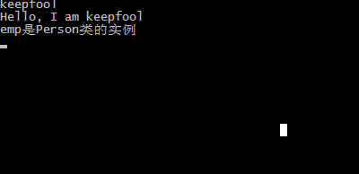

这是C#的继承语法，JavaScript则没有提供这样的语法，现在我们来探讨如何在JavaScript中实现继承。

### JavaScript原型继承

#### 继承的目的

在JavaScript中定义两个构造函数Person()和Employee()，为了方便理解和讲解，我们可以将它们理解为Person类和Employee类。  
以下内容提到的Person类、Employee类，和Person()构造函数、Employee()构造函数是一个意思。
```js
    function Person() {
        this.name = 'keefool';
        this.sayHello = function() {
            return 'Hello, I am ' + this.name;
        }
    }
    
    function Employee(email) {
        this.email = email;
    }
    
    var person = new Person();
    var emp = new Employee('keepfool@xxx.com');
```

目前Person()和Employee()构造函数是两个彼此独立的存在，它们没有任何关系。  
所以由Employee()构造函数创建的实例emp，肯定是访问不到Person的name属性和sayHello()方法的。

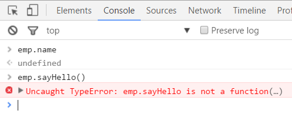

使用instanceof操作符同样可以确定emp是Employee类的实例，而不是Person类的实例。

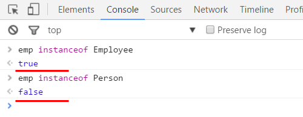

实现继承的目的是什么？当然是让子类能够使用基类的属性和方法。  
在这个示例中，我们的目的是实现Employee继承Person，然后让Employee的实例能够访问Person的name和sayHello()了。

JavaScript是如何实现继承的呢？  
这个答案有很多种，这里我先只介绍比较常见的一种——**通过原型实现继承。**

#### 实现继承

当我们定义函数时，JavaScript会自动的为函数分配一个prototype属性。  
Person()也是一个函数，那么Person()函数也会有prototype属性，即Person.prototype。
```js
    function Person() {
        this.name = 'keefool';
        this.sayHello = function() {
            return 'Hello, I am ' + this.name;
        }
    }   
    
    // 定义了函数后，JavaScript自动地为Person()函数分配了一个prototype属性
    // Person.prototype = {};
```
我们可以在Person.prototype上定义一些属性和方法，这些属性和方法是可以被Person的实例使用的。
```js
        
    function Person() {
        this.name = 'keefool';
        this.sayHello = function() {
            return 'Hello, I am ' + this.name;
        }
    }
    
    Person.prototype.height = 176;
    
    var person = new Person();
    // 访问Person.prototype上定义的属性
    person.height;  // 输出176
```
同理在Employee.prototype上定义的属性和方法，也可以被Employee类的实例使用。  
咱们的目的是让Employee的实例能够访问name属性和sayHello()方法，如果没有Person()构造函数，咱们是这么做的：
```js
        
    function Employee(email) {
        this.email = email;
    }
    Employee.prototype = {
        name : 'keefool',
        sayHello = function() {
            return 'Hello, I am ' + this.name;
        }
    }
```

既然Person()构造函数已经定义了name和sayHello()，我们就不必这么做了。  
怎么做呢？**让Employee.prototype指向一个Person类的实例。**
```js
    function Person() {
        this.name = 'keefool';
        this.sayHello = function() {
            return 'Hello, I am ' + this.name;
        }
    }
    function Employee(email) {
        this.email = email;
    }
    
    var person = new Person(); 
    Employee.prototype = person;
    
    var emp = new Employee('keepfool@xxx.com');
```
现在我们就可以访问emp.name和emp.sayHello()方法了。

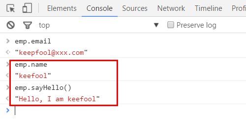

在Chrome控制台，使用instanceof操作符，可以看到emp对象现在已经是Person类的实例了。

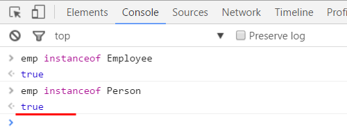

#### 这是如何实现的？

* Employee.prototype是一个引用类型，它指向一个Person类的一个实例person。
* person对象恰恰是有name属性和sayHello()方法的，访问Employee.prototype就像访问person对象一样。
* 访问emp.name和emp.sayHello()时，实际访问的是Employee.prototype.name和Employee.prototype.sayHello()，最终访问的是person.name和person.sayHello()。

如果你对这段代码还是有所疑惑，你可以这么理解：

    var person = new Person();
    Employee.prototype.name = person.name;
    Employee.prototype.sayHello = person.sayHello;

由于person对象在后面完全没有用到，以上这两行代码可以合并为一行。
```js
    function Person() {
        this.name = 'keefool';
        this.sayHello = function() {
            return 'Hello, I am ' + this.name;
        }
    }
    function Employee(email) {
        this.email = email;
    }
    
    Employee.prototype = new Person();
    var emp = new Employee('keepfool@xxx.com');
```

下面这幅图概括了实现Employee继承Person的过程：

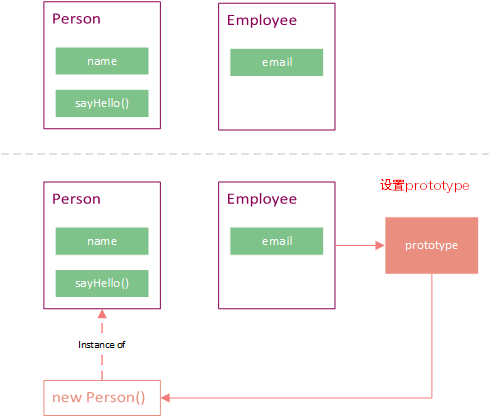

**name和sayHello()不是Employee类的自有属性和方法，它来源于Employee.prototype。**而Employee.prototype指向一个Person的实例，这个实例是能够访问name和sayHello()的。

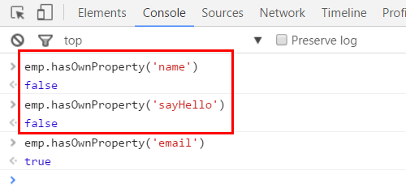

#### 原型继承的本质

**JavaScript的原型继承的本质：将构造函数的原型对象指向由另外一个构造函数创建的实例。**

这行代码Employee.prototype = new Person()描述的就是这个意思。  
现在我们可以说**Employee()构造函数继承了Person()构造函数。**

用一句话概括这个继承实现的过程：

Employee()构造函数的原型引用了一个由Person()构造函数创建的实例，从而建立了Employee()和Person()的继承关系。

### 再谈constructor

#### 对象的constructor属性

上一篇文章有提到过，**每个对象都有constructor属性，constructor属性应该指向对象的构造函。**  
例如：Person实例的constructor属性是指向Person()构造函数的。

    var person = new Person();
    


在未设置Employee.prototype时，emp对象的构造函数原本也是指向Employee()构造函数的。

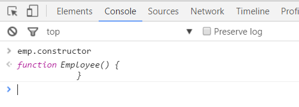

当设置了Employee.prototype = new Person();时，emp对象的构造函数却指向了Person()构造函数。

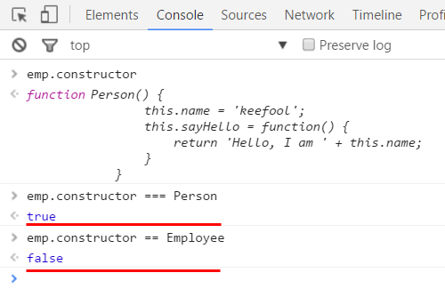

无形之中，emp.constructor被改写了。  
emp对象看起来不像是Employee()构造函数创建的，而是Person()构造函数创建的。

这不是我们期望的，我们希望emp对象看起来也是由Employee()构造函数创建的，即emp.constructor应该是指向Employee()构造函数的。  
要解决这个问题，我们先弄清楚对象的constructor属性是从哪儿来的，知道它是从哪儿来的就知道为什么emp.constructor被改写了。

#### constructor属性的来源

**当我们没有改写构造函数的原型对象时，constructor属性是构造函数原型对象的自有属性。**例如：Person()构造函数的原型没有改写，constructor是Person.prototype的自有属性。

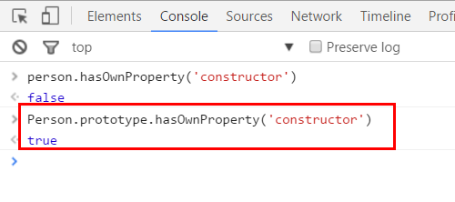

**当我们改写了构造函数的原型对象后，constructor属性就不是构造函数原型对象的自有属性了。**  
例如：Employee()构造函数的原型被改写后，constructor就不是Person.prototype的自有属性了。


Employee.prototype的constructor属性是指向Person()构造函数的。

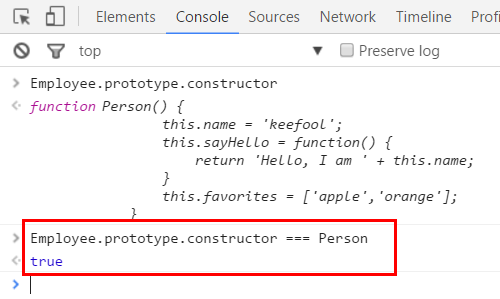

这说明：**当对象被创建时，对象本身没有constructor属性，而是来源于创建对象的构造函数的原型对象。**

即当我们访问emp.constructor时，实际访问的是Employee.prototype.constructor，Employee.prototype.constructor实际引用的是Person()构造函数，person.constructor引用是Person()构造函数，Person()构造函数实际上是Person.prototype.constructor。

这个关系有点乱，我们可以用以下式子来表示这个关系：

    emp.constructor = person.constructor = Employee.prototype.constructor = Person = Person.prototype.constructor

**它们最终都指向Person.prototype.constructor！**

#### 改写原型对象的constructor

弄清楚了对象的constructor属性的来弄去脉，上述问题就好解决了。  
解决办法就是让**Employee.prototype.constructor指向Employee()构造函数。**
```js
    var o = {};
    
    function Person() {
        this.name = 'keefool';
        this.sayHello = function() {
            return 'Hello, I am ' + this.name;
        }
    }
    function Employee(email) {
        this.email = email;
    }
    
    Employee.prototype = new Person();
    Employee.prototype.constructor = Employee;
    
    var emp = new Employee('keepfool@xxx.com');
```

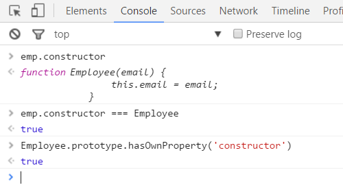

如果你还是不能理解关键的这行代码：

    Employee.prototype.constructor = Employee;

你可以尝试从C#的角度去理解，在C#中Employee类的实例肯定是由Employee类的构造函数创建出来的。

### 原型链

原型链是JavaScript中非常重要的概念，理解它有助于理解JavaScript面向对象编程的本质。

#### __proto__属性

定义函数时，函数就有了prototype属性，该属性指向一个对象。  
prototype属性指向的对象是共享的，这有点像C#中的静态属性。  
**站在C#的角度讲，由new创建的对象是不能直接访问类的静态属性的。  
那么在JavaScript中，为什么对象能够访问到prototype中的属性和方法的呢？**

**因为：**当对象由new构造函数创建时，对象会自带一个__proto__属性，这个属性是由JavaScript分配的。  
这个属性是一个引用类型，它指向的正是构造函数的原型。

例如：当emp对象被创建时，JavaScript自动地为emp对象分配了一个__proto__属性，这个属性是指向Employee.prototype的。

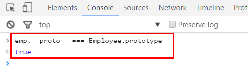

在Chrome的控制台查看emp.__proto__的内容

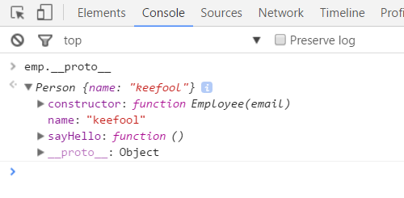

首先，_▼Person {name: "keepfool"}_表示emp.__proto__是一个Person对象，因为Employee.prototype确实指向一个Person对象。  
其次，我们把emp.__proto__的属性分为3个部分来看。

1. 第1部分：name属性和sayHello()方法，它们两个来源于Person对象。
1. 第2部分：constructor属性，因为我们重写了Employee()构造函数的原型对象的constructor属性，即Employee.prototype.constructor = Employee，所以constructor是指向Employee()构造函数的。
1. 第3部分：__proto__它指向一个Object，Person类是Employee类的父类，那么谁是Person类的父类呢？——Object类。

**对象的__proto__属性就像一个秘密链接，它指向了创建该对象的构造函数的原型对象。**

#### 什么是原型链

我们注意到第3部分的内容仍然是一个__proto__属性，我们展开它看个究竟吧。

再往下看，还有两层__proto__。

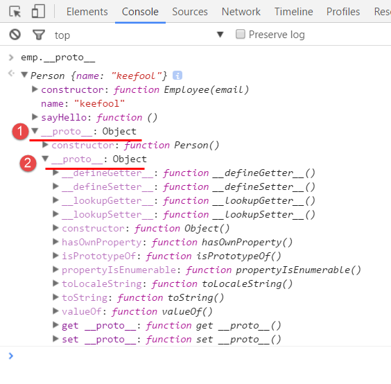

emp.__proto__.__proto__：从▶constructor:function Person()可以看出它是Person()构造函数的原型。

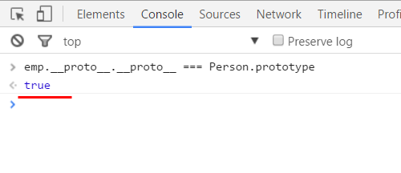

Person.prototype包含两部分内容：

* Person()构造函数
* 一个__proto__属性，即emp__proto__.__proto__.__proto__，这个属性指向内置的Object对象。


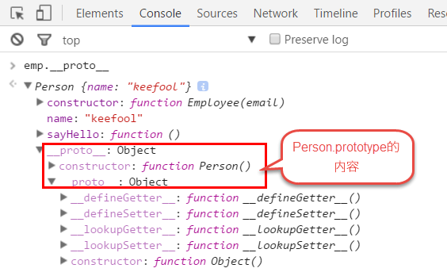

**我们将这一系列的__proto__称之为原型链。**

#### 理解原型链

下面两幅图展示了本文示例的原型链，这两幅图表示的同一个意思。原型链的最顶端是null，因为Object.prototype是没有__proto__属性。

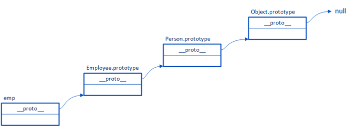

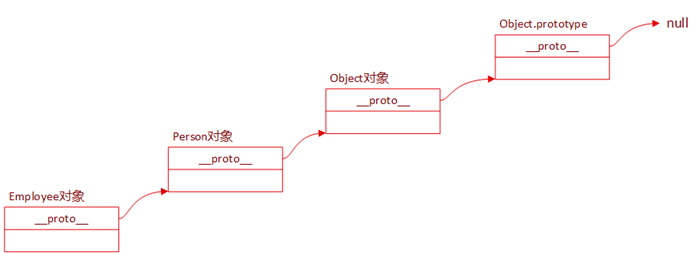

下表清晰地描述了每一层__proto__表示的内容：

编号原型链原型链指向的对象描述 1 emp.__proto__ Employee.prototype Employee()构造函数的原型对象 2 emp.__proto__.__proto__ Person.prototype Person()构造函数的原型对象 3 emp.__proto__.__proto__.__proto__ Object.prototype Object()构造函数的原型对象 4 emp.__proto__.__proto__.__proto__.__proto__ null 原型链的顶端 

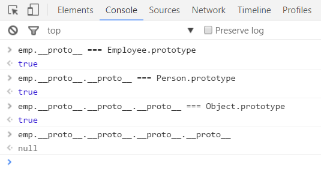

##### 原型链查找

现在可以解释emp对象能够访问到name属性和sayHello()方法了。  
以访问emp.sayHello()为例，我们用几个慢镜头来阐述：

1. emp是由Employee()构造函数创建的，JavaScript先去Employee()构造函数查找sayHello()方法
1. 在Employee()中没找到sayHello()方法，但emp有一个__proto__属性，于是JavaScript就去emp.__proto__中查找
1. emp.__proto__和Employee.prototype是相等的，而Employee.prototype指向的是一个Person对象
1. 于是JavaScript就在这个Person对象中查找，结果发现了sayHello()方法
1. 最终JavaScript调用的是emp.__proto__.sayHello()，也就是Employee.prototype.sayHello()。

##### JavaScript在背后做的事情

另外，在实现Employee()继承Person()，以及emp对象访问name和sayHello()时，JavaScript是帮我们做了一些事情的，见下图：

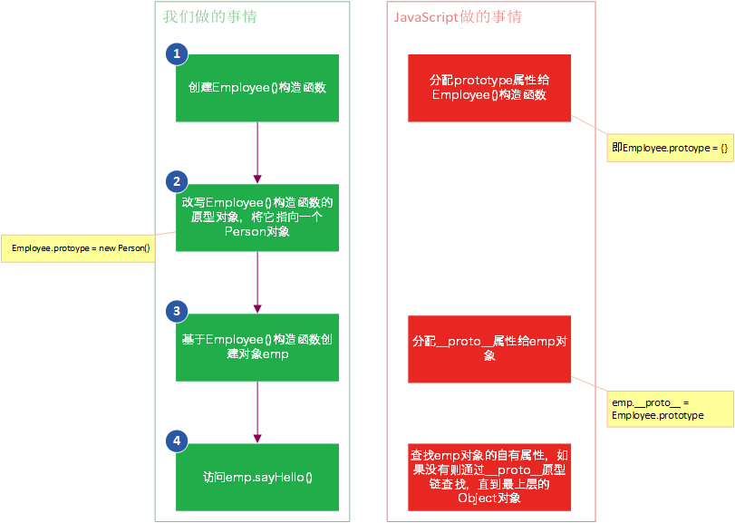

#### 将方法提升到原型对象

上一篇有提到过，Person类的sayHello()方法放到它的原型对象中更合适，这样所有的Person实例共享一个sayHelo()方法副本，如果我们把这个方法提到原型对象会发生什么？
```js
    var o = {};
    
    function Person() {
        this.name = 'keefool';
    }
    
    Person.prototype.sayHello = function(){
        return 'Hello, I am ' + this.name;
    }
    
    function Employee(email) {
        this.email = email;
    }
    
    Employee.prototype = new Person();
    Employee.prototype.constructor = Employee;
    
    var emp = new Employee('keepfool@xxx.com');
```

可以看到sayHello()方法的路径是：emp.__proto__.__proto__.sayHello()，比直接定义在Person()构造函数中多了一层。

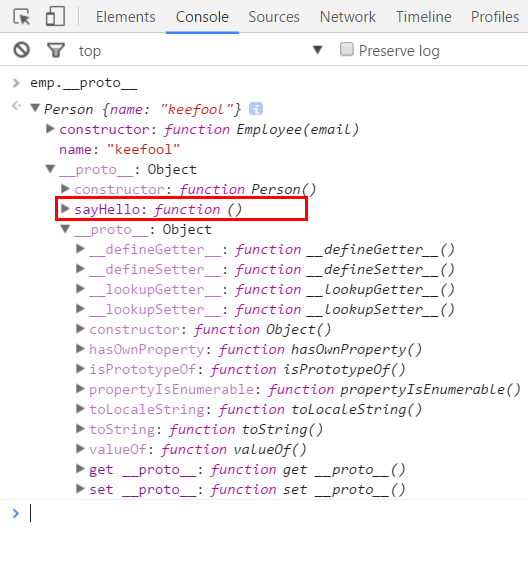

这样看来将方法定义在原型对象中并不是绝对的好，会使得JavaScript遍历较多层数的原型链，这也会有一些性能上的损失。

#### 原型链示例

为了加强对原型链的理解，我们来做个简单的示例吧。

上图已经说明了toString()方法是属于内置的Object对象的，我们以toString()方法来讲解这个示例。

在Chrome控制台输入emp.toString()，我们得到的结果是"[object Object]"。  
toString()方法是在emp的第3层原型链找到的，即emp.__proto__.__proto__.__proto__，它就是Object对象。

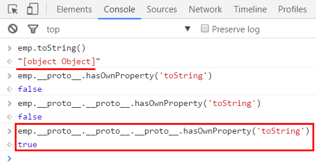

emp.toString()输出"[object Object]"没有什么意义，现在我们在Person.prototype上定义一个toString()方法。
```js
    var o = {};
    
    function Person() {
        this.name = 'keefool';
    }
    
    Person.prototype.sayHello = function(){
        return 'Hello, I am ' + this.name;
    }
    
    Person.prototype.toString = function() {
        return '[' + this.name + ']';
    }
    
    function Employee(email) {
        this.email = email;
    }
    
    Employee.prototype = new Person();
    Employee.prototype.constructor = Employee;
    
    var emp = new Employee('keepfool@xxx.com');
    
```
这时toString()方法是在emp对象的第2层原型链找到的，即emp.__proto__.__proto__。  
emp.__proto__.__proto__是Person()构造函数的原型对象，即Person.prototype。

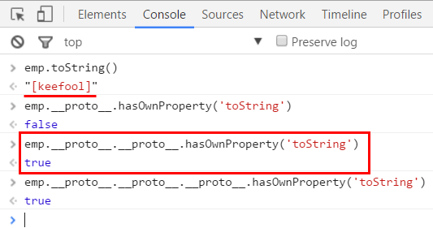

这个也是一个简单的重写示例，Person.protoype重写了toString()方法，emp最终调用的是Person.prototype.toString()方法。

### 总结

* JavaScript实现原型继承有两个关键：1.子类构造函数原型指向父类的一个实例 2.重写子类构造函数原型的constructor属性，让其指向子类构造函数本身。
* 在定义函数时，JavaScript自动地给函数分配了一个prototype属性；在创建对象时，JavaScript自动的为对象分配了一个__proto__属性。
* __proto__是JavaScript的原型链，每个__proto__都是一个对象，它是子类能够访问基类属性和方法的桥梁。
* 当访问一个对象的属性时，首先查找自有属性，其次逐层地遍历__proto__原型链。
* JavaScript是基于对象和原型的语言，“类”、“继承”这些概念都是通过对象和原型实现的。

[0]: http://www.cnblogs.com/keepfool/p/5573121.html