# [玩转JavaScript OOP[2]——类的实现][0]

### 概述

当我们在谈论面向对象编程时，我们在谈论什么？  
我们首先谈论的是一些概念：对象、类、封装、继承、多态。  
对象和类是面向对象的基础，封装、继承和多态是面向对象编程的三大特性。

JavaScript提供了对象却缺乏类，它不能像C#一样能显式地定义一个类。  
但是JavaScript的函数功能非常灵活，其中之一就是构造函数，结合构造函数和原型对象可以实现”类”。

### 对象和类的概念

#### 对象

“对象”是面向对象编程中非常重要的一个概念，一个对象是一个“东西”（某个人或某件事）的描述。  
人和事都来源于现实生活，我们对现实世界的认知就是对人和事的认知。  
在编程的领域，代码对于常人来说是抽象的，代码构成的应用是为了更好地解决现实世界的问题。  
在分析和设计阶段，使用“对象”的概念能够更好地反应现实世界的问题。

反过来说，代码是包含一些逻辑的，这些逻辑用于描述业务，业务是包含一些业务知识的，业务知识是通过对现实世界的理解和分析总结出来的，这些问题是由现实世界的“对象”构成的。

**对象包含特征和行为，用OOP的术语来说，特征是对象的属性，行为是对象的方法。**

#### 类

在现实世界中，相似的对象可以按照一定的标准来分组。例如“蜂鸟”和“老鹰”都被划分到鸟类，鸟类不是一个具体的对象，它是人们根据“蜂鸟”、“老鹰”等那些具体的鸟分析出相似的特征和行为后，归纳出来的一个概念。**类相当于一个模板，我们可以基于这个模板创建不同的具体的对象。**

在C#中，我们可以定义一个鸟类。

    /// 

    /// 鸟类
    /// 

    public class Bird
    {
        public void Fly()
        {
            Console.WriteLine("I can fly!");
        }
    }
    

虽然JavaScript是一门面向对象编程语言，但它没有提供class的语法支持。  
在JavaScript中，一切都是基于对象的，即使后面要讲的“原型”也都是对象，JavaScript的继承和重用也都是通过原型来实现的。   
但是结合构造函数和原型对象可以实现JavaScript的“类”。

### 构造函数

之前我们使用new Array()创建一个数组，使用new Object()创建一个对象，Array()和Object()是JavaScript内置的两个构造函数，尽管JavaScript没有提供类，但我们可以将Array和Object理解为“类”的概念。  
需要注意的是，JavaScript的“类”是由构造函数实现的。

#### 定义构造函数

构造函数也是函数，定义构造函数和其他函数并没有语法上的区别。  
**唯一的区别是构造函数的首字母应该大写，这也是JavaScript的编程规范。**

以下定义了一个Person()构造函数，我们可以将它理解为Person类。

    function Person(){
        console.log('I am keepfool.');
    }

JavaScript的“类”和构造函数是同时被定义的，在JavaScript中定义“类”时，就同时定义了构造器。

#### 使用构造函数

JavaScript使用类的方式和C#一样，new关键字后面跟着构造函数。

    var p = new Person();
    

### 定义属性和方法

现在我们已经定义好了Person类，可以为Person类添加一些属性和方法。

#### 定义属性

在讲JavaScript对象时，我们讲了对象的属性设置和访问。  
这段代码展示了定义对象属性的两种方式：

    var cat = {
        color: 'black'
    };
    cat.name = 'Tom';
    console.log(cat.color);
    console.log(cat.name);
    

##### 使用this定义属性

JavaScript类的属性定义方式则有些不同，在构造函数中使用this关键字定义属性：

    function Person(name){
        this.name = name;
    }
    

* 第一行代码，定义了Person类，并定义了构造函数。
* 第二行代码，定义了name属性。
##### 创建并使用对象

以下2行代码创建了两个Person类的对象

    var p1 = new Person('James');
    var p2 = new Person('Cury');
    

在Chrome控制台中输出p1.name和p2.name

##### 

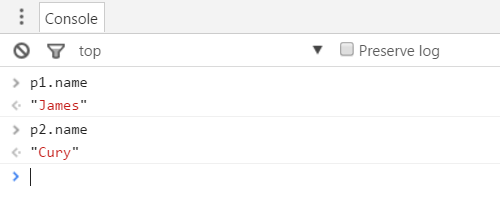

p1和p2是两个不同的对象，修改p1.name不会影响p2.name。

    p1.name = 'Lebron James';
    

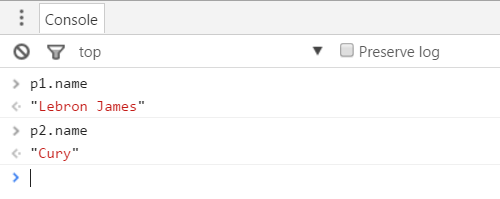

#### 定义方法

首先，我们区分一下术语“函数”和“方法”，“函数”是独立的单元，而“方法”是依赖于类这个主体存在的。

##### 使用this定义方法

在JavaScript中，类的方法是定义在构造函数中的函数，在构造函数中使用this关键字定义方法：

    function Person(name) {
        // 定义属性
        this.name = name;
        // 定义方法
        this.sayHello = function() {
            return 'Hello, I am ' + this.name;
        }
    }
    

##### 使用方法

在Chrome控制台分别调用p1和p2对象的sayHello()方法

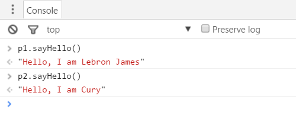

#### constructor属性

**当创建一个对象时，一个特殊的属性被JavaScript自动地分配给对象了，这个属性就是constructor属性。**  
在chrome控制台输入p1.constructor，可以看到p1对象的constructor属性指向一个函数。

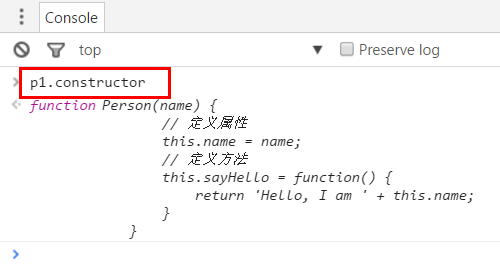

瞧瞧这个函数的内容，这不正是Person()构造函数吗？

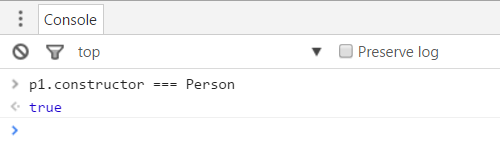

这表示我们也可以通过p1.constructor属性创建对象，

    var p3 = new p1.constructor('Steve Nash');

这行代码阐述了一句话：“我不关心p1对象是怎么创建的，但我想让另一个对象如p1一样创建！”

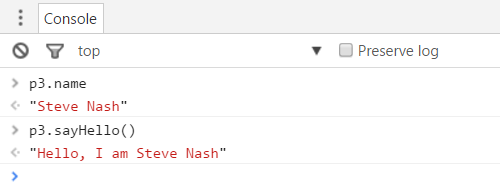

在Chrome控制台使用instanceof操作符，可以看到p1、p2、p3都是Person类的实例

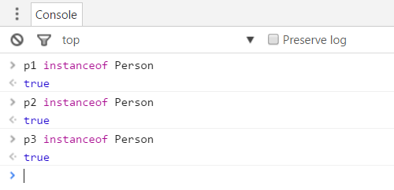

另外，当我们以{}方式创建对象时，实际上也调用了Object()构造函数。

    var o = {};
    

这行代码声明了一个对象，尽管我们没有设置任何属性和方法，但JavaScript引擎默认给它设置了constructor属性。  
o.constructor指向的是Object()构造函数，[native code]显示了Object()是JavaScript内置的函数。

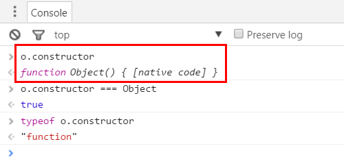

### 原型对象

在JavaScript中，定义一个函数时，**函数**就会拥有prototype属性，构造函数也不例外。  
下图说明了Person()构造函数的prototype属性是一个对象，**它是属于函数的**，我们称这个属性为**原型对象。**从Person类的角度出发，我们也可理解为prototype属性是属于Person类的。

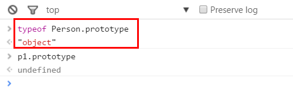

同时Person类的实例是没有prototype属性的，上图的p1.prototype是undefined，这说明prototype属性是共享的，这有点像C#中的静态属性。

#### 设置prototype

既然prototype是一个对象，那就可以为它添加属性和方法。

在函数的protpotype属性上定义属性和方法，与设置普通对象的属性和方法没什么区别。  
下面的代码为Person.prototype定义了属性和方法。

    function Person(name){
        this.name = name;
        this.sayHello = function() {
            return 'Hello, I am ' + this.name;
        }
    }
    
    // 在构造函数的prototype对象上定义属性和方法
    Person.prototype.height = 176;
    Person.prototype.run = function(){
        return 'I am ' + this.name + ', I am running!';
    }
    
    var p1 = new Person('James');
    

#### 使用prototype

在Person.prototype中定义的属性和方法，可以直接被Person类的实例使用，仍然是以object.property的方式使用。

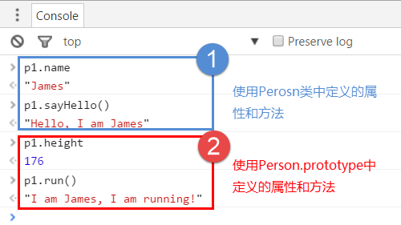

需要特别注意的是，**name和sayHello()是属于Person类的实例，而height和run()是不属于Person类的实例。**

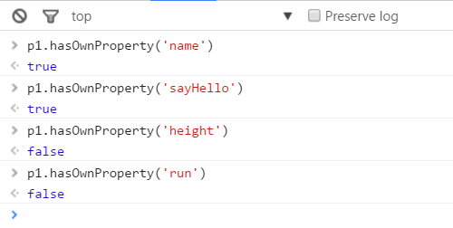

小技巧：通过hasOwnProperty方法可以查看对象是否包含某个属性或方法。

#### 自有属性 vs. prototype的属性

Person类的实例既可以使用Person类中的属性，又可以使用Person.prototype中的属性。  
那么Person类的属性和Person.prototype的属性有什么差别呢？

首先，我们可以将Person类中的属性和方法理解为“实例属性”。  
由于prototype是共享的，我们可以将prototype中的属性和方法理解为“共享属性”。

“实例属性”和“共享属性”的差别主要体现在性能上。  
每创建一个Person的实例，就会产生一个name属性和sayHello()方法的副本，而height属性和run()方法则是所有实例共享一个副本。

既然如此，这意味着sayHello()方法可以提到prototype中。  
另外，不同的Person实例height可能会不一样，应将它放到Person类中更合理。

    function Person(name,height){
        this.name = name;
        this.height = height;
    }
    
    Person.prototype.sayHello = function(){
        return 'Hello, I am ' + this.name + ', my height is ' + this.height + 'cm.';
    }
    Person.prototype.run = function(){
        return 'I am ' + this.name + ', I am running!';
    }
    
    var p1 = new Person('James',203);
    var p2 = new Person('Cury',190);
    

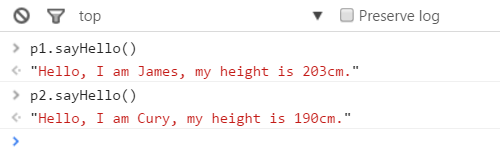

### 类的实现总结

1. JavaScript没有类，但构造函数可以实现“类”。
1. 按照JavaScript编程规范，构造函数的首字母应该大写。
1. “类”的属性和方法是用this.property方式定义在构造函数中的。
1. 在对象创建时JavaScript分配了constructor属性给对象，constructor属性是对象构造函数的一个引用。
1. 函数在定义时就已经有了prototype属性，prototype属性也是一个对象。
1. prototype是共享的，定义在prototype上的属性和方法可以被“类”的实例使用。
1. 如果属性或方法能够定义在prototype上，就不要定义在构造函数上，使用prototype可以减少内存开销。

[0]: http://www.cnblogs.com/keepfool/p/5568453.html