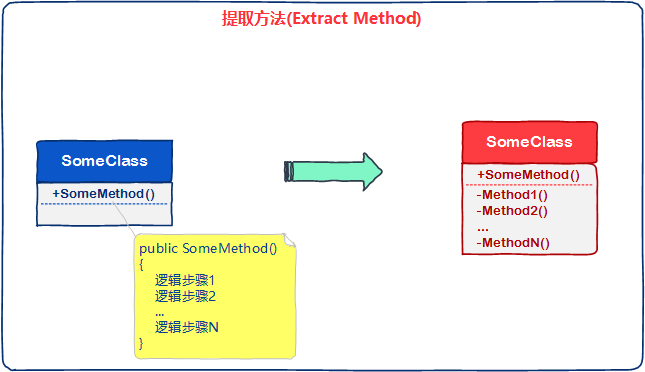
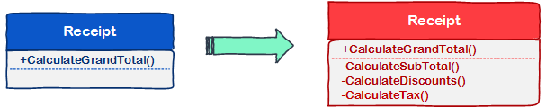
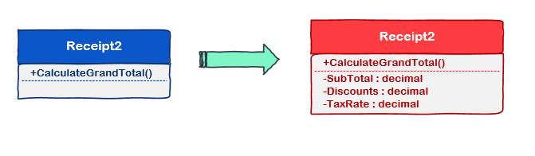

# [小酌重构系列[2]——提取方法、提取方法对象][0]

### 前言

“艺术源于生活”——代码也源于生活，你在生活中的一些行为习惯，可能会恰如其分地体现在代码中。   
当实现较为复杂的功能时，由于它包含一系列的逻辑，我们倾向于编写一个“大方法”来实现。  
为了使项目便于维护，以及增强代码的可读性，我们有必要对“大方法”的逻辑进行整理，并提取出分散的“小方法”。  
这就是本文要讲的两种重构策略：提取方法、提取方法对象。

### 如何快速地找到想读的书？

在生活中，我是一个比较随意的人，平时也买了不少书去看。  
我的书柜不够大，且已经装满了书，每当读完一本书时，我懒得花些时间整理，想着以后再去整理这些书籍，所以我通常都将这些书塞到一个大箱子里面。  
每次要重读某些书时，我恨不得把这个箱子翻个底朝天，在花费“九牛二虎之力”之后，我终于找到了要看的书。  
然后，我把其他翻出来的书再塞回去。

每次找书，我总是经历千辛万苦，弄得家里的地板一片狼藉，还得被媳妇儿臭骂一顿。 

箱子那么大，所有的书都放在一个箱子里，一整箱书都没有分类，有些书藏得很深，找起书来的确不方便。

后来，我想到了一个方法——最近快递小哥送货的包装纸箱还在家里，这些箱子不会很大，但装书应该绰绰有余，何不把这些箱子利用起来？  
于是，我就动手挑选了一些大小合适的小纸箱，用签字笔给每个纸箱做了一个标记。

1号纸箱，装ASP.NET编程相关的书  
2号纸箱，装架构设计相关的书  
3号纸箱，装管理相关的书  
…  
N号纸箱，装旅游相关的书

自从将书分类装到各个小纸箱后，通过标记我总能很快地找到想读的书了，媳妇儿再也不为这事儿骂我了。   

在生活中，很多读者可能也遇到过此类问题，为什么找个东西就这么难呢？

生活中的习惯会折射到编程中。当写完一个方法时，有时因懒惰心理和拖延习惯，我们可能会对自己说：“这个方法有时间再整理吧，先完成后续的功能”。  
结果就是抱着这种心理，这个方法一直到项目上线都没有整理过。  
在项目维护期间，需要修改这个方法时，再次阅读到这个方法，我们不禁抱怨：“我擦，这方法怎么这么长，这是谁写的，我给他666！哎呦，不对，这好像是我自己写的！”  

### 提取方法

当一个方法包含实现一个功能的所有逻辑时，不仅方法会看起来比较臃肿（可读性差），也会给将来的维护造成困扰，每次改动都会让你如履薄冰，并且较大可能带来新的bug。这不符合我们“将来的利益”，我们可以使用提取方法的重构策略来规避这个问题。

下面是我对提取方法的定义：

如果一个方法包含多个逻辑，我们应将每个逻辑提取出来，并确保每个方法只做一件事情。

下图表示了这个重构策略（蓝色为重构前，红色为重构后）。

### 示例

## 重构前

下面这段代码定义了一个Receipt类，用于描述收入信息，并计算总收入。

    using System.Collections.Generic;
    
    namespace ExtractMethod.Before
    {
        public class Receipt
        {
            public IList<decimal> Discounts { get; set; }
            public IList<decimal> ItemTotals { get; set; }
    
            public decimal CalculateGrandTotal()
            {
                decimal subTotal = 0m;
    
                // 计算subTotal
                foreach (decimal itemTotal in ItemTotals)
                    subTotal += itemTotal;
    
                // 计算折扣
                if (Discounts.Count > 0)
                {
                    foreach (decimal discount in Discounts)
                    {
                        subTotal -= discount;
                    }
                }
    
                // 计算税额
                decimal tax = subTotal*0.065m;
    
                subTotal += tax;
    
                return subTotal;
            }
        }
    }

CalculateGrandTotal()方法包含了多处逻辑：计算subTotal，计算折扣，计算税额。  
这几处逻辑是相对独立的，我们可以将其提取出来，重构为3个方法。

## 重构后

重构后，CalculateGrandTotal()方法只包含调用各个子方法的逻辑，这已经精简了很多，可读性也有所增强。

    using System.Collections.Generic;
    using System.Linq;
    
    namespace ExtractMethod.After
    {
        public class Receipt
        {
            public IList<decimal> Discounts { get; set; }
            public IList<decimal> ItemTotals { get; set; }
    
            public decimal CalculateGrandTotal()
            {
                // 计算subTotal
                decimal subTotal = CalculateSubTotal();
                // 计算折扣
                subTotal = CalculateDiscounts(subTotal);
                // 计算税额
                subTotal = CalculateTax(subTotal);
    
                return subTotal;
            }
    
            // 计算subTotal
            private decimal CalculateSubTotal()
            {
                return ItemTotals.Sum();
            }
    
            // 计算折扣
            private decimal CalculateDiscounts(decimal subTotal)
            {
                if (Discounts.Count > 0)
                {
                    subTotal = Discounts.Aggregate(subTotal, (current, discount) => current - discount);
                }
                return subTotal;
            }
    
            // 计算税额
            private decimal CalculateTax(decimal subTotal)
            {
                decimal tax = subTotal * 0.065m;
                subTotal += tax;
                return subTotal;
            }
        }
    }
    

## 二次重构

我认为这仍然不够。CalculateGrandTotal() 方法所表现的“语义”，是为了计算收入总额。  
但上面这段代码不能让我们快速地知道这个语义，我们需要通过3个子方法来理解这个语义。

“计算收入总额”本质上是有一个公式的，即“收入总额 = （各项子收入总和 - 折扣总和） * （1 + 税率）”，公式的右侧是一个简单的三项式。 这个方法没有体现”公式“这个概念，为了让这段代码OO的味道更浓厚一些。 我们再次对其重构，将公式右侧的每一项提取为属性，每一项的计算逻辑都通过get属性体现。

    using System.Collections.Generic;
    using System.Linq;
    
    namespace ExtractMethod.After
    {
        public class Receipt2
        {
            private IList<decimal> Discounts { get; set; }
            private IList<decimal> ItemTotals { get; set; }
    
            public decimal CalculateGrandTotal()
            {
                // 收入总额 = （各项子收入总和 - 折扣总和） * （1 + 税率）
                decimal grandTotal = (SubTotal - TotalDiscounts) * (1 + TaxRate);
                return grandTotal;
            }
    
            // 获取subTotal
            private decimal SubTotal
            {
                get { return ItemTotals.Sum(); }
            }
    
            // 获取TotalDiscounts
            private decimal TotalDiscounts
            {
                get { return Discounts.Sum(); }
            }
    
            // 获取TaxRate
            private decimal TaxRate
            {
                get { return 0.065m; }
            }
        }
    }

再次重构后的代码，是不是一目了然？  
这里可能有人会疑惑了，本文不是讲提取方法的吗？现在怎么去提取属性了呢？  
在C#中，属性的本质是字段的get, set方法，所以它仍然算是提取方法。

请注意，并不是所有情况下，都适合使用提取属性来代替提取方法。我的建议是，当提取的方法逻辑较少时，可以使用提取属性代替。当提取的方法逻辑较多时，如果使用提取属性代替，也会让人觉得困扰。因为属性是为了描述对象的特征，描述特征的过程如果较为复杂，会让人难以理解，我们应该keep it simple!

### 提取方法对象

以上示例描述了一个客观对象：“收入”，这个对象包含两个层面的“语义”—— “收入相关的信息”和“计算收入的方法”。 “收入相关的信息”用名词来体现，它揭示了收入客观存在的特征（例如：所有的子收入、折扣和税率）。  
“计算收入的方法”用动词来体现，它揭示了收入的计算过程。

这两层“语义”可以看做两种不同的职责，为了将这两层“语义”隔离开来，我们可以将“计算收入的方法”提取为一个新的对象。

    using System.Collections.Generic;
    using System.Linq;
    
    namespace ExtractMethod.After
    {
        /// 

        /// 描述收入相关的信息
        /// 

        public class Receipt
        {
            public IList<decimal> Discounts { get; set; }
            public IList<decimal> ItemTotals { get; set; }
    
            // 获取TaxRate
            public decimal TaxRate
            {
                get { return 0.065m; }
            }
    
            public decimal CalculateGrandTotal()
            {
                return new ReceiptCalculator(this).CalculateGrandTotal();
            }
        }
    
        /// 

        /// 描述收入的计算方法
        /// 

        public class ReceiptCalculator
        {
            private readonly Receipt _receipt;
    
            public ReceiptCalculator(Receipt receipt)
            {
                _receipt = receipt;
            }
    
            public decimal CalculateGrandTotal()
            {
                decimal grandTotal = (SubTotal - TotalDiscounts) * (1 + _receipt.TaxRate);
                return grandTotal;
            }
    
            // 获取subTotal
            private decimal SubTotal
            {
                get { return _receipt.ItemTotals.Sum(); }
            }
    
            // 获取TotalDiscounts
            private decimal TotalDiscounts
            {
                get { return _receipt.Discounts.Sum(); }
            }
        }
    }
    

这则代码将Receipt对象的“计算收入的方法”提取到了ReceiptCalculator对象，Receipt对象则只保留了属性和精简的CalculateGrandTotal()方法。

“提取方法对象”也是一个不错的重构策略，“提取方法对象”有什么作用呢？ 它可以精确类的职责，控制类的粒度。 一开始，我们用Receipt来描述“收入”这件事情；后来我们发现这件事情可以拆分为两个细节，“收入相关的信息”和“计算收的方法”，于是我们将这两个细节拆分开来。

到这里，也许大家又能看出一点点 ”OO” 的味道了， 它体现了我们看待客观事物的角度，以及对客观事物的理解程度。 OO 的过程是我们对客观事物的探索和认知过程，它也会随着我们了解到更多的事物细节而进化。

[0]: http://www.cnblogs.com/keepfool/p/5433403.html