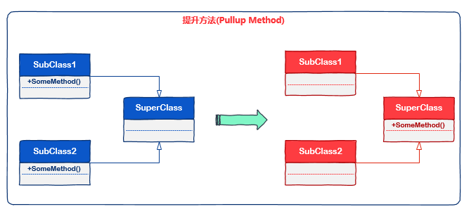
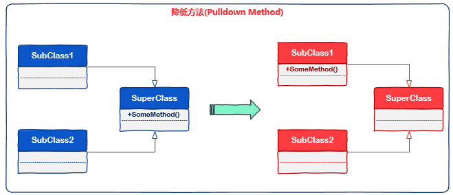
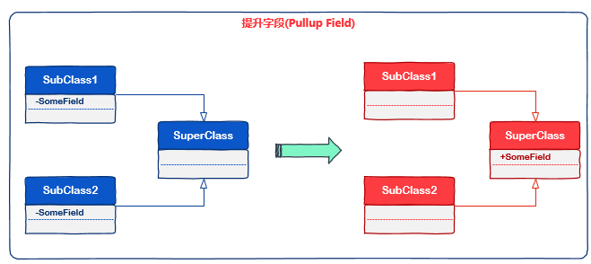
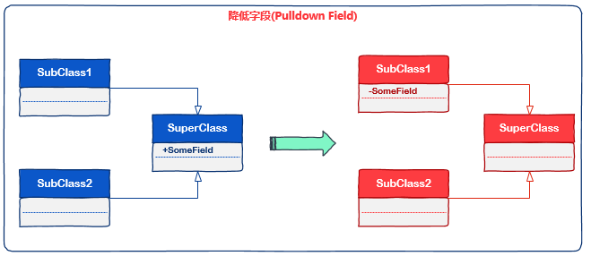

# [小酌重构系列[3]——方法、字段的提升和降低][0]

本文要介绍的是4种重构策略，它们分别是提升方法、降低方法、提升字段和降低字段。  
由于这4种重构策略具有一定的相通性，所以我将它们放到一篇来讲解。

### 定义

以下是这4种策略的定义

> 提升方法：当子类的方法描述了相同的行为时，应将这样的方法提升到基类。  
> 降低方法：在基类中的行为仅和个别子类相关时，应将这样的行为降低到子类。  
> 提升字段：当子类中的字段描述着相同的信息时，应将这样的字段提升到基类。  
> 降低字段：当基类中的字段仅仅用于个别子类时，应将这样的字段降低到子类。

以上的定义是较为为枯燥无趣的，各位读者大可不必care文字的内容，因为这是我自己的理解，你们应该会有自己的理解。  
接下来，我要介绍本文的重点——语义，这有助于我们理解并良好地使用这些重构策略。

### 理解“语义”

#### 语义含义

在前面的文章中，我常常提到一个词“语义”，我们先来看看语义的定义。以下内容是对语义的解释，这段内容我引用自[百度百科][1]。

> 数据的含义就是语义(semantic)。简单的说，数据就是符号。数据本身没哟佮意义，只有赋予含义的数据才能够被使用，这时候数据就转化为了信息，而数据的含义就是语义。

> 语义可以简单地看作是数据对应的现实世界中的事物所代表的概念和含义，以及这些含义直接的关系，是数据在某个领域上的解释和逻辑表示。

> 语义具有领域特征，不属于任何领域的语义是不存在的。

而我对它的理解是： 在事物所处的环境下，事物所表现的概念和含义。 这里面有2点要强调一下：

1. 事物：是指现实世界（真实）存在的个体，比如一个人、一辆车。这也是我们所说的对象。  
2. 环境：是指现实世界的环境，我们也可以将环境理解为上下文。

我们需要结合这2点去理解语义，事物不能脱离环境单独存在，事物在不同的环境下表现出的特征和行为会有所不同。

#### 语义举例

一辆普通的大众捷达汽车，如果它处于“出租车公司”这样一个语境，那么它的表现特征是“出租车”，体现出来的行为是“为市民提供有偿的乘车服务”。  
如果这辆车处于“某人的车”这样一个语境，那么它的表现特征是“私家车”，体现出来的行为是”车主可以自驾去做xxx事“。

当你在街上分别看到下面两部车时，你会理所当然地认为左边的是“出租车”，右边的是“私家车”。

(./img/341820-20160501221654925-1865774094.png)  
你近乎条件反射地知道了这两部车所代表的语义！你为什么能够如此快速地定义它们呢？  
因为我们对这两部车已经有了足够的认知，即使我们不去触碰它们，但是结合我们自身的知识和经验，它们所代表的含义已经深深地刻在我们的心底。

从这个例子我们可以很容易地看出，当事物处于不同的环境时，它们表现的特征和行为是有差异的。  
这也是所谓的“语义异构”，它指的是同一事物在解释上所存在的差异，也就体现为同一事物在不同领域中的理解不同。   
  
另外，由于小孩子认知上的不足，他们对这两部车的理解和大人也会有所不同。

小孩：“这两部车都能带我去游乐场玩”  
大人：左边那辆车能”为市民提供有偿的乘车服务“，右边那辆车的“车主可以自驾去做xxx事”

小孩由于对事物的认知较为浅薄，所以他们的主观判断也是较浅显的。  
大人由于对事物已经足够了解了，所以他们的主观判断时较深刻的。

每个人都是从小孩成长到大人的，人们对事物的探索和认知也会经历这个过程。在不同时期，不同场合，人们对同一个事物的认知和理解是不同的。

现在大致介绍完了语义，我们正式进入本文的示例环节。以下这4则示例代码非常简单，请结合语义去感受这4种重构策略。

### 提升方法

当子类的方法描述了相同的行为时，应将这样的方法提升到基类。

下图表示了这个重构策略（蓝色表示重构前，红色表示重构后）

方法提升到基类时，应该注意两点：

1. 基类中定义的行为实现细节，应该是所有子类共有的。  
2. 子类应该具有重写基类行为的能力，重写时应该是对行为细节的附加，而不应当随意篡改基类的行为细节（你确实可以这么做，但我不建议这么做）

#### 示例

### 重构前

这段代码定义了3个类：Vechicle（机动车），Car（汽车）和Motorcycle（摩托车）。在Car里定义了Turn()方法，表示汽车的行驶行为。

    namespace PullUpMethod.Before
    {
        public abstract class Vehicle
        {
            // other methods
        }
    
        public class Car : Vehicle
        {
            public void Turn(Direction direction)
            {
                // code here
            }
        }
    
        public class Motorcycle : Vehicle
        {
        }
    
        public enum Direction
        {
            Left,
            Right
        }
    }
    

在这个场景中，Motorcycle也具有行驶行为，如果在Motorcycle中也定义一个Turn()方法，会造成语义上的重复，所以我们应将Car中的Turn()方法提升到基类Vehicle。

### 重构后

    namespace PullUpMethod.After
    {
        public abstract class Vehicle
        {
            public virtual void Turn(Direction direction)
            {
                // 基类行为的实现细节
            }
        }
    
        public class Car : Vehicle
        {
            
        }
    
        public class Motorcycle : Vehicle
        {
            public override void Turn(Direction direction)
            {
                // 使用基类行为的细节
                base.Turn(direction);
                // 附加一些子类本身的行为细节
            }
        }
    
        public enum Direction
        {
            Left,
            Right
        }
    }

Vehicle类的Turn()方法使用了virtual关键字，当基类的实现方法不能满足子类的需求时，我们可以在子类中override。

### 降低方法

在基类中的行为仅和个别子类相关时，应将这样的行为降低到子类。

下图表示了这个重构策略（蓝色表示重构前，红色表示重构后）

#### 示例

### 重构前

这段代码定义了3个类：Animal（动物）、Dog（狗）和Cat（猫），在Animal里定义了Bark()方法，表示动物的吠叫行为。

    namespace PushDownMethod.Before
    {
        public abstract class Animal
        {
            public void Bark()
            {
                // code to bark
            }
        }
    
        public class Dog : Animal
        {
        }
    
        public class Cat : Animal
        {
        }
    }

在这个场景中，Dog能够吠叫，吠叫行为不属于Cat，Cat只能喵喵叫，所以应将Bark()方法降低到Dog类。

### 重构后

    namespace PushDownMethod.After
    {
        public abstract class Animal
        {
        }
    
        public class Dog : Animal
        {
            public void Bark()
            {
                // code to bark
            }
        }
    
        public class Cat : Animal
        {
        }
    }

### 提升字段

当子类中的字段描述着相同的信息时，应将这样的字段提升到基类。

下图表示了这个重构策略（蓝色表示重构前，红色表示重构后）

在C#中，字段通常都是以private修饰的。当使用这种重构策略时，为了让子类能够访问，提升到基类的字段至少应该使用protected修饰符。

#### 示例

### 重构前

这段代码定义了3个类：Account（账户）、CheckingAccount（活期账户）和SavingAccount（储蓄账户），CheckingAcount和SavingAccount继承自Account。

    namespace PullUpField.Before
    {
        public abstract class Account
        {
        }
    
        public class CheckingAccount : Account
        {
            private decimal _minimumCheckingBalance = 5m;
        }
    
        public class SavingAccount : Account
        {
            private decimal _minimumSavingBalance = 5m;
        }
    }
    

在这个场景中，CheckingAccount和SavingAccount都定义了最小余额字段，虽然命名不同，但表示的含义是一样的，所以应在Account中定义最小余额字段，同时使用protected修饰该字段。

### 重构后

    namespace PullUpField.After
    {
        public abstract class Account
        {
            protected decimal _minimumBalance = 5m;
        }
    
        public class CheckingAccount : Account
        {
    
        }
    
        public class SavingAccount : Account
        {
     
        }
    }
    

### 降低字段

当基类中的字段仅仅用于个别子类时，应将这样的字段降低到子类。

下图表示了这个重构策略（蓝色表示重构前，红色表示重构后）

#### 示例

### 重构前

这段代码定义了3个类：Task（任务）、BugTask（缺陷任务）和FeatureTask（功能任务），基类Task定义了_resolution字段。

    namespace PushDownField.Before
    {
        public abstract class Task
        {
            protected string _resolution;
        }
    
        public class BugTask : Task
        {
        }
    
        public class FeatureTask : Task
        {
            
        }
    }
    

在这个场景中，_resolution字段表示“bug的解决状态”，这个字段和BugTask类有关，和Feature类是无关的，所以应将_resolution字段定义在BugTask类，并以private修饰。

### 重构后

    namespace PushDownField.After
    {
        public abstract class Task
        {
     
        }
    
        public class BugTask : Task
        {
            private string _resolution;
        }
    
        public class FeatureTask : Task
        {
    
        }
    }
    

### 总结

这4种方式是较为简单的重构策略，也是经常使用的重构策略。  
如果要使用好这些策略，需要我们对类、方法和字段的语义有一个清晰地了解和认知。

即使再简单的重构策略，也需要左右权衡，否则可能造成“过度重构”或“重构不当”。  
如果您只是刚开始经历重构，请不要过于担心这两点，你能发现这两个问题，说明你已经思考过了，你需要经历这个过程才能够有所成长。

[0]: http://www.cnblogs.com/keepfool/p/5451323.html
[1]: http://baike.baidu.com/link?url=tXaVnxn-8Qp7WNlAU9Syzi08k2FM_rM6DUEXVg8tgKbE2Hvu-cghcgipxbtOxqhnwIOFiqNGARwHT42jRd6s5a