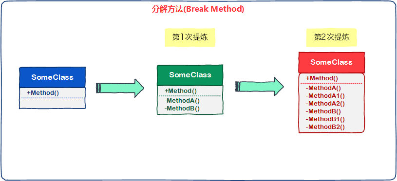
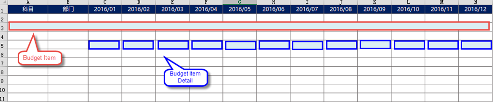
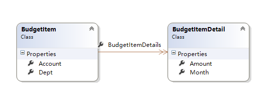
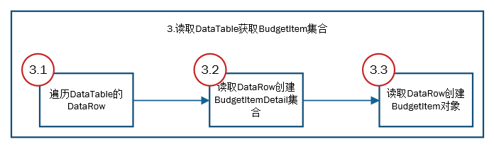
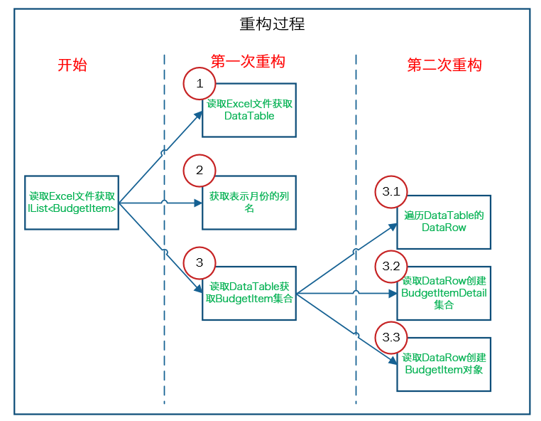

# [小酌重构系列[4]——分解方法][0]

### 概述

“分解方法”的思想和前面讲到的“提取方法”、“提取方法对象”基本一致。  
它是将较大个体的方法不断的拆分，让每个“方法”做单一的事情，从而提高每个方法的可读性和可维护性。  
分解方法可以看做是“提取方法”的递归版本，它是对方法反复提炼的一种重构策略。

### 分解方法

下图表示了这个重构策略，第1次提炼和第2次提炼都采用了“提取方法”这个策略。

#### 何时分解方法？

“分解方法”最终可以让方法的可读性极大地增强，通常我们可以依据以下几点来辨别方法是否需要分解：

1. 每个方法应该只做一件事情（对事情的理解程度，决定了事情的粒度）  
2. 方法应该尽量短小，方法最好不要超过20行（依不同情况，酌情考虑行数）   
3. 方法的缩进层次不宜太多，最好不要超过两级   
4. 方法需要太多的注释才能理解

### 示例

#### 场景说明

假设在企业制作年度预算的场景中，用户需要按照如下Excel模板填写科目、部门、各月的预算数据，然后将Excel文件导入到“预算系统”。

为了表示用户填写的每一行预算数据，开发人员在系统中设计了两个class：BudgetItem（预算项）和BudgetItemDetail（预算项明细）。  
上图红色方框标注的表示一个BudgetItem对象，每个蓝色方框则对应一个BudgetItemDetail对象。

BudgetItem.cs和BudgetItemDetail.cs

    /// 

    /// 预算项
    /// 

    public class BudgetItem
    {
        public string Dept { get; set; }
        public string Account { get; set; }
        public IList<BudgetItemDetail> BudgetItemDetails { get; set; } 
    }
    
    /// 

    /// 预算项明细
    /// 

    public class BudgetItemDetail
    {
        public string Month { get; set; }
        public decimal Amount { get; set; }
    }

#### 重构前

在表示这段逻辑时，我们编写了一个BudgetItemImport类，用于读取Excel并返回IList<BudgetItem>集合

隐藏代码

    public class BudgetItemImport
    {
        private Regex _monthRegex = new Regex(@"\d{4}\\\d{2}");
    
        public IList<BudgetItem> GetBudgetItems(string path)
        {
            // 读取Excel获取DataTable
            DataTable table = ExcelUtil.RenderFromExcel(path);
    
            // 获取表示月份的列名
            IList<string> monthColumns = new List<string>();
            for (var i = 0; i < table.Columns.Count; i++)
            {
                var columnName = table.Columns[i].ColumnName;
                if (_monthRegex.IsMatch(columnName))
                {
                    monthColumns.Add(columnName);
                }
            }
    
            // 遍历DataRow获取BudgetItems
            IList<BudgetItem> budgetItems = new List<BudgetItem>();
            for (var i = 1; i < table.Rows.Count; i++)
            {
                // 获取DataRow
                DataRow dataRow = table.Rows[i];
    
                // 创建BudgetItem对象，并设置部门和科目信息
                BudgetItem budgetItem = new BudgetItem
                {
                    Dept = dataRow[0].ToString(),
                    Account = dataRow[1].ToString()
                };
    
                // 创建BudgetItemDetail集合
                IList<BudgetItemDetail> budgetItemDetails = new List<BudgetItemDetail>();
                foreach (var column in monthColumns)
                {
                    // 创建BudgetItemDetail对象，并设置预算月份和相应金额
                    BudgetItemDetail detail = new BudgetItemDetail
                    {
                        Month = column,
                        Amount = Convert.ToDecimal(dataRow[column])
                    };
    
                    budgetItemDetails.Add(detail);
                }
                budgetItem.BudgetItemDetails = budgetItemDetails;
                budgetItems.Add(budgetItem);
            }
    
            return budgetItems;
        } 
    }
    

以上这段代码，如果没有这些注释，GetBudgetItems()方法是比较难以读懂的。  
接下来，我们采用“分解方法”这个策略来对它重构。

#### 第一次重构

我们粗略分析一下，可以得知GetBudgetItems()方法一共做了3件事情，下图阐述了它的逻辑。

(./img/341820-20160502235631232-1287306896.png)  
秉承着“一个方法只做一件事情”的原则 ，我们将这3件事情拆分出来，使其变成3个方法。

隐藏代码

    public class BudgetItemImport
    {
        private Regex _monthRegex = new Regex(@"\d{4}\\\d{2}");
    
        public IList<BudgetItem> GetBudgetItems(string path)
        {
            // 读取Excel获取DataTable
            DataTable table = ExcelUtil.RenderFromExcel(path);
    
            // 获取表示月份的列名
            IList<string> monthColumns = GetMonthColumns(table.Columns);
    
            // 读取DataTable获取BudgetItem集合
            return GetBudgetItemsFromDataTable(table, monthColumns);
        }
    
        // 获取表示月份的列名
        private IList<string> GetMonthColumns(DataColumnCollection collection)
        {
            IList<string> monthColumns = new List<string>();
            for (var i = 0; i < collection.Count; i++)
            {
                var columnName = collection[i].ColumnName;
                if (_monthRegex.IsMatch(columnName))
                {
                    monthColumns.Add(columnName);
                }
            }
            return monthColumns;
        }
    
        // 读取DataTable获取BudgetItem集合
        private IList<BudgetItem> GetBudgetItemsFromDataTable(DataTable table, IList<string> monthColumns)
        {
            // 遍历DataRow获取BudgetItems
            IList<BudgetItem> budgetItems = new List<BudgetItem>();
            for (var i = 1; i < table.Rows.Count; i++)
            {
                DataRow dataRow = table.Rows[i];
    
                // 创建BudgetItem对象，并设置部门和科目信息
                BudgetItem budgetItem = new BudgetItem
                {
                    Dept = dataRow[0].ToString(),
                    Account = dataRow[1].ToString()
                };
    
                // 创建BudgetItemDetail集合，并设置每个BudgetItemDetail对象的月份和金额
                IList<BudgetItemDetail> budgetItemDetails = monthColumns.Select(column => new BudgetItemDetail
                {
                    Month = column,
                    Amount = Convert.ToDecimal(dataRow[column])
                }).ToList();
    
                budgetItem.BudgetItemDetails = budgetItemDetails;
    
                budgetItems.Add(budgetItem);
            }
    
            return budgetItems;
        } 
    }
    

#### 第二次重构

虽然GetBudgetItems()拆分成了3个方法，但新追加的GetBudgetItemsFromDataTable()方法还是不具备良好的可读性，这个方法我们仍然需要借助注释才能读懂。  
我们再具体分析这个方法内部的逻辑，GetBudgetItemsFromDataTable()这个方法也做了3件事情，见下图：

按照这个更加明细的逻辑流程，我们将这3件事情再拆分出来。

隐藏代码

    public class BudgetItemImport
    {
        private Regex _monthRegex = new Regex(@"\d{4}\\\d{2}");
    
        public IList<BudgetItem> GetBudgetItems(string path)
        {
            // 读取Excel获取DataTable
            DataTable table = ExcelUtil.RenderFromExcel(path);
    
            // 获取表示月份的列名
            IList<string> monthColumns = GetMonthColumns(table.Columns);
    
            // 读取DataTable获取BudgetItem集合
            return GetBudgetItemsFromDataTable(table, monthColumns);
        }
    
        // 获取表示月份的列名
        private IList<string> GetMonthColumns(DataColumnCollection collection)
        {
            IList<string> monthColumns = new List<string>();
            for (var i = 0; i < collection.Count; i++)
            {
                var columnName = collection[i].ColumnName;
                if (_monthRegex.IsMatch(columnName))
                {
                    monthColumns.Add(columnName);
                }
            }
            return monthColumns;
        }
    
        // 读取DataTable获取BudgetItem集合
        private IList<BudgetItem> GetBudgetItemsFromDataTable(DataTable table, IList<string> monthColumns)
        {
            IList<BudgetItem> budgetItems = new List<BudgetItem>();
            foreach (DataRow dataRow in table.Rows)
            {
                BudgetItem budgetItem = GetBudgetItemFromDataRow(dataRow, monthColumns);
                budgetItems.Add(budgetItem);
            }
            return budgetItems;
        }
    
        // 创建BudgetItem对象，并设置部门和科目信息
        private BudgetItem GetBudgetItemFromDataRow(DataRow dataRow, IList<string> monthColumns)
        {
            BudgetItem budgetItem = new BudgetItem
            {
                Dept = dataRow[0].ToString(),
                Account = dataRow[1].ToString(),
                BudgetItemDetails = GetBudgetItemDetailsFromDataRow(dataRow, monthColumns)
            };
            return budgetItem;
        }
    
        // 创建BudgetItemDetail集合，并设置每个BudgetItemDetail对象的月份和金额
        private IList<BudgetItemDetail> GetBudgetItemDetailsFromDataRow(DataRow dataRow, 
                                                                        IList<string> monthColumns)
        {
            return monthColumns.Select(column => new BudgetItemDetail
            {
                Month = column,
                Amount = Convert.ToDecimal(dataRow[column]),
            }).ToList();
        }
    }
    

经过这次重构后，BudgetItemImport类的可读性已经很好了。 每个方法都只做一件事情，每个方法都很短小，都不超过20行，我们甚至不需要为这些方法写注释了。

#### 小结

在经历过两次重构后，我们得到了结构良好的代码。回顾这个示例的重构过程，我们可以用下面一副图来表示。

写代码和写别的东西很像。在写文章时，你先想什么就写什么，然后再打磨它。初稿也许丑陋无序，你就雕章琢句，直至达到你心目中的样子。  
我们并不能直接写出结构和可读性良好的方法，一开始我们的方法写得复杂且冗长，包含了各种循环、判断、缩进和注释。  
然后我们打磨这些代码，通过分解方法逐一解决这些问题。

[0]: http://www.cnblogs.com/keepfool/p/5453536.html