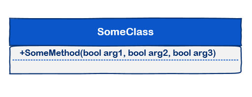

# [小酌重构系列[5]——为布尔方法命名][0]

### 概述

当一个方法包含大量的布尔参数时，方法是很脆弱的，由此还可能会产生两个问题：

1. **方法不容易被理解**  
2. **给方法的使用者造成一定困扰，可能会产生一些预期之外的结果**

本文要介绍的重构策略“为布尔方法命名”，可以有效地避开这两个问题。

### 为布尔方法命名

#### 大量布尔参数带来的问题

下图中的SomeClass的SomeMethod包含3个布尔参数，如果没有注释，调用者根本不知道3个布尔参数所代表的含义。

即使为这个方法提供了详细的注释，调用者也很容易在调用时出错。  
调用者一不小心写错了其中一个参数，就可能产生非预期的行为。

在实际的业务处理中，也许你仅用这3个参数处理2~3个业务Case。  
但这个方法有3个布尔参数，相当于为调用者提供了8种调用Case！  
难道你的程序需要提供8种Case吗？完全没有必要，因为其他几种Case可能根本不会发生！

    var obj = new SomeClass();
    obj.SomeMethod(false, false, false);  // way1
    obj.SomeMethod(false, true, false);   // way2
    obj.SomeMethod(false, true, true);    // way3
    obj.SomeMethod(false, false, true);   // way4
    obj.SomeMethod(true, true, true);     // way5
    obj.SomeMethod(true, false, false);   // way6
    obj.SomeMethod(true, true, false);    // way7
    obj.SomeMethod(true, false, true);    // way8

**这好比上个世纪生产的电视机遥控器，几十个按键，用户没有说明书根本就不知道怎么用！  
对于用户来说，一个遥控器用来调节频道、音量就足够了。  
给用户太多地选择反而不是一件好的事情，用户会因太多的选择而徘徊不定，永远不要给用户提供繁杂的使用方式！**

#### 重构策略

“为布尔方法命名”这种策略，意在将一些布尔参数提取出来，结合适当的方法命名来取代布尔参数。   
接下来，进入我们的示例环节，用实际的示例来说明这个重构策略。

### 示例

#### 重构前

CreateAccount()方法用于创建账户，它提供了4个参数，后3个参数都是布尔类型的。

    public class BankAccount
    {
        public void CreateAccount(Customer customer, bool withChecking, bool withSavings, bool withStocks)
        {
            // do work
        }
    }
    

如果你是这个方法的调用者，在你脑袋中或许会蹦出8种调用方式，但你知道该如何调用吗？  
我不知道你们的答案是什么，我的答案是：不明确。

#### 重构后

仔细分析“创建银行账户”这项业务，我们发现“创建账户”只会产生两种Case。

**1. 验证并创建账户**  
PS: 你去银行开户时，需要验证你的身份信息。  
  
**2. 验证并创建账户，同时存入初始储蓄金额**PS: 你去银行开户时，当身份信息验证通过后，你可以向银行卡中存入一部分初始金额。

  
我们提供了2个方法来实现这2种Case，这2个方法使用具有意义的命名，并将原有的CreateAccount()方法用private修饰限制其访问性。

    public class BankAccount
    {
        public void CreateAccountWithChecking(Customer customer)
        {
            CreateAccount(customer, true, false);
        }
    
        public void CreateAccountWithCheckingAndSavings(Customer customer)
        {
            CreateAccount(customer, true, true);
        }
    
        private void CreateAccount(Customer customer, bool withChecking, bool withSavings)
        {
            // do work
        }
    }
    

重构以后，调用者只能使用CreateAccountWithChecking()和CreateAccountWithCheckingAndSavings()方法，这两个方法的名称也很容易让人知道其含义。

#### 使用Flags

这条建议来自于园友@blackbob。C#的Flags特性允许enum类型使用组合值。

    public class BankAccount
    {
    
        private readonly IList<CreateAccountOptions> _createAccountOptionList = new[]
        {
            CreateAccountOptions.WithChecking, 
            CreateAccountOptions.WithChecking | CreateAccountOptions.WithSavings
        };
    
        public void CreateAccount(Customer customer, CreateAccountOptions option)
        {
            if (!_createAccountOptionList.Contains(option))
            {
                throw new ArgumentException("Invalid create account option", "option");
            }
            // do work
        }
    }
    
    [Flags]
    public enum CreateAccountOptions
    {
        None = 0,
        WithChecking = 1,
        WithSavings = 2,
        WithStocks = 4
    }
    
    class Program
    {
        static void Main(string[] args)
        {
            BankAccount bankAccount = new BankAccount();
    
            Customer customer1 = new Customer();
            // 验证并创建账户
            bankAccount.CreateAccount(customer1, CreateAccountOptions.WithChecking);
    
            // 验证并创建账户，同时存入初始储蓄金额
            Customer customer2 = new Customer();
            bankAccount.CreateAccount(customer2, CreateAccountOptions.WithChecking | CreateAccountOptions.WithSavings);
        }
    }
    

使用Flags枚举，除了例子中的两种Case外，还可能产生一些其他的组合。  
为了防止用户滥传参数，我们可以在执行CreateAccount操作前先做个参数验证。

[0]: http://www.cnblogs.com/keepfool/p/5456843.html