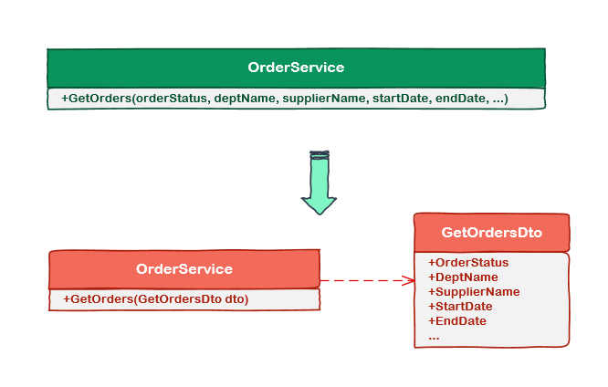

# [小酌重构系列[6]——引入参数对象][0]

### 简述

如果方法有超过3个以上的参数，调用方法时就会显得冗词赘句。这时将多个参数封装成一个对象，调用方法会显得干净整洁。  
这就是本文要讲的重构策略“引入参数对象”——将方法的参数封为类，并用这个类的对象替换方法中原有的参数。

### 引入参数对象

下图演示了这个重构策略，OrderSerivce表示订单服务，GetOrders()方法根据一些条件获取订单信息。  
在重构前，GetOrders()方法看起来像长篇大论，调用时也颇为麻烦；在重构后，GetOrders()方法看起来言简意赅，调用时仅需要传入一个参数。

#### 

#### 优点

这个策略在我看来至少有两个优点：

> 1. 可以减少方法的参数个数，调用方法时会更加干净整洁。  
> 2. 当方法需要追加或者删除参数时，不需要修改方法签名。

#### 注意点

> 1. 意味着你要在项目中追加新的class。  
> 2. 并非死板地将所有的参数都放到一个参数对象中，需要确定这些参数属于某一个“共同的概念”。  
> 3. 方法调用参数减少了，给“参数对象”起个好名字也很重要。  
> 4. 项目开发阶段，如果方法的参数随时可能变更，建议直接将参数设计为对象参数。

例如：在一个平面坐标系统中，基于坐标和半径画圆。

    public void CreateCircle(double x, double y, double radius)
    {
        // do work
    }
    

如果使用参数对象，我们可以用两种方式来表达。

方式1：将坐标封装为参数对象  
方式2：将坐标 + 半径封装为参数对象

使用合适的参数对象命名可以将这两种方式区分开来。  
方式1，提炼出“坐标”概念，于是就有了Point对象；方式2，提炼出“圆”概念，故使用了Circle对象作为参数。

    public class ShapeTool
    {
        // 方式1：封装坐标
        public void CreateCircle(Point point, double radius)
        {
            // do work
        }
    
        // 方式1：封装坐标 + 半径
        public void CreateCircle(Circle circle)
        {
            // do work
        }
    }
    
    public class Point
    {
        public double X { get; set; }
        public double Y { get; set; }
    }
    
    public class Circle
    {
        public Point Point { get; set; }
        public double Radius { get; set; }
    }

### 示例

#### 重构前

这段代码用于“学生注册课程”。

    public class Registration
    {
        public void Create(decimal amount, Student student, IEnumerable<Course> courses, decimal credits)
        {
            // do work
        }
    }
    
    public class Student
    {
        
    }
    
    public class Course
    {
    
    }
    

Create()方法的看起来难以理解，它的参数个数很多，并且没有良好的分类，我们应将这些参数封装起来。

#### 重构后

针对“学生注册课程”这个场景，我们提炼出一个概念——”注册上下文“，这个上下文可以包含以上方法的所有参数。  
重构后，Create()方法看起来简洁易懂，"RegistrationContext"这个命名恰到好处，所有参数都放到RegistrationContext类里了。

    public class RegistrationContext
    {
        public decimal Amount { get; set; }
        public Student Student { get; set; }
        public IEnumerable<Course> Courses { get; set; }
        public decimal Credits { get; set; }
    }
    
    
    public class Registration
    {
        public void Create(RegistrationContext registrationContext)
        {
            // do work
        }
    }
    
    
    public class Student
    {
    
    }
    
    public class Course
    {
    
    }

在一些应用场景中，当你的方法拥有很多参数，且这些参数表示不同的意义时，我们很难通过这些参数的名称提炼出一个合适的名词。  
例如：为了将HttpRequest和HttpResponse放到一个对象中，若将这个对象命名为"HttpRequestAndResponse"会显得喋喋不休。  
这时，我们可以用一种偷懒的做法，把这样的对象命名为“xxx上下文”。  
例如，在ASP.NET中HttpContext和ViewContext就是这样的对象。

[0]: http://www.cnblogs.com/keepfool/p/5460303.html