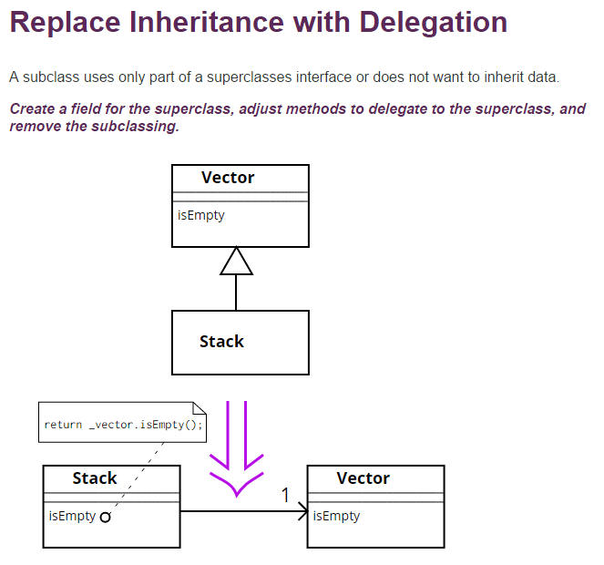

# [小酌重构系列[7]——使用委派代替继承][0]

### 概述

子类可以继承父类的字段、属性和方法，使用“继承”可以较大程度地复用代码。  
在使用继承时，务必要确定代码中定义的“父类”和“子类”确实存在客观的“父子关系”，而不要去做“为了代码复用而使用继承”的事情，这是舍本逐末的做法，也是滥用继承的体现。  
滥用继承会破坏类之间客观存在的关系，也会模糊代码所体现的语义。

### 使用委派代替继承

#### 继承的误区

当多个类具有相似的属性、方法时，使其中一个类变成基类，其他的类去继承该基类实现代码复用。   
当将应用场景中的某一个类提升为基类时，需要慎重考虑这个类是否确实和其他类存在“父子关系”，如果不存在“父子关系”，则不构成继承关系。

如何确定类之间的继承关系？  
应该从现实的业务和语义去理解（这是一句无关痛痒的废话）。

举个不那么恰当的例子，虽然大头儿子和隔壁王叔叔长得实在是太像了，但是在法律上，大头儿子继承小头爸爸是合法的，而不是去继承隔壁的王叔叔。  
（PS：我也不知道大头儿子是不是小头爸爸亲生的）

#### 继承的滥用

下图是Java 中的Vector和Stack类，为了让IsEmpty()方法得以复用，Stack继承了Vector。  
但Vector和Stack是不同的数据结构，二者没有明显的“父子关系”，这是典型的滥用继承的做法。



#### 委派代替继承

现在问题来了，当两个类确实不存在继承关系，并且一个类依赖于另外一个类的方法时，应该如何构建这2个类的关系？  
这就是本文要说明的重构策略——**使用委派代替类继承**

继承是一种强关联的关系，而委派是一种弱关联的关系。

### 示例

#### 重构前

这段代码定义了Sanitation类和Child类和类，用于描述“小孩洗手”这件事情。  
在这件事情中，Sanitation类表示卫生设施，比如水龙头和洗手液，可供人们洗手，当然也可供小孩洗手；Child表示小孩，他是利用这些卫生设施去洗手。  
Sanitation类提供了WashHands()方法，并让Child继承Sanitation。

    public class Sanitation
    {
        public string WashHands()
        {
            return "Cleaned!";
        }
    }
    
    public class Child : Sanitation
    {
    }
    

从语义上分析：

1. 卫生设施可供小孩洗手，这是一个被动行为。小孩利用卫生设施洗手，这是一个主动行为。   
2. 小孩不是从卫生设施里面蹦出来的，而是诞生自父母的受精卵，二者之间本身是一个间接关系。

二者之间仅存在“利用”关系，不存在“继承”关系。为了体现“利用”语义，我们应该使用委派。

#### 重构后

将这段代码进行如下调整：

1. 解除Child和Sanitation的继承关系。   
2. 在Child类中定义Sanitation属性。   
3. 在Child类中定义WashHands()方法，并调用Sanitation属性的WashHand()方法。
```
    public class Sanitation
    {
        public string WashHands()
        {
            return "Cleaned!";
        }
    }
    
    public class Child
    {
        private Sanitation Sanitation { get; set; }
    
        public Child()
        {
            Sanitation = new Sanitation();
        }
    
        public string WashHands()
        {
            return Sanitation.WashHands();
        }
    }
```
大家可能会对重构后的代码产生疑问，代码量比之前多了，Child还需要依赖于Sanitation类，这能带来什么好处？  
仅从代码角度去看，这确实如你所想，它确实没有带来什么好处。

但我觉得代码应该能够体现客观事实和语义——“小孩利用卫生设施去洗手”，而不是“小孩因为继承了卫生设施，才具备洗手的行为”。

我个人一直比较提倡一个观点—— 代码层面的所见即所得，当我们看到一段代码时，就知道这段代码能做什么事情，不需要过多的修辞和注释，不多不少，恰如其分。用一个词概括，就是“言出法随”。  
 就好比这篇文章：[写了10年的代码，我最怕写这段代码][1]中的一些“干货”（没错，我确实不认为这是什么“干货）。  
“判断字符串是否为Email”，本来就是一件很简单的事情，为何不能直截了当地去描述呢？

    public static bool Email(this String str)
    {
        bool result = false;
        if (!string.IsNullOrEmpty(str) && System.Text.RegularExpressions.Regex.IsMatch(str, @"^([0-9a-zA-Z]+[-._+&])*[0-9a-zA-Z]+@([-0-9a-zA-Z]+[.])+[a-zA-Z]{2,6}$"))
        {
            result = true;
        }
        else
        {
            result = false;
        }
        return result;
    }

“判断字符串是否为Email”这件事情用一句话就能说清楚它的语义和逻辑—— “字符串不为空，且匹配Email正则表达式” 。

    public static bool IsEmail(this String str)
    {
        string emailPattern = @"^([0-9a-zA-Z]+[-._+&])*[0-9a-zA-Z]+@([-0-9a-zA-Z]+[.])+[a-zA-Z]{2,6}$";
        return !string.IsNullOrEmpty(str) && Regex.IsMatch(str, emailPattern);
    }

这段代码没有用到语法糖，也不是什么装x行为，我也不是为了体现2行代码就一定比10行代码好。

[0]: http://www.cnblogs.com/keepfool/p/5467753.html
[1]: http://www.cnblogs.com/xcj26/p/5464857.html