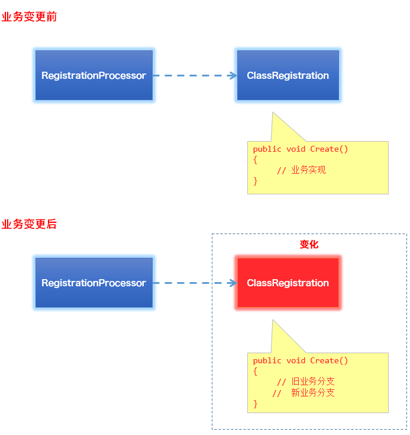
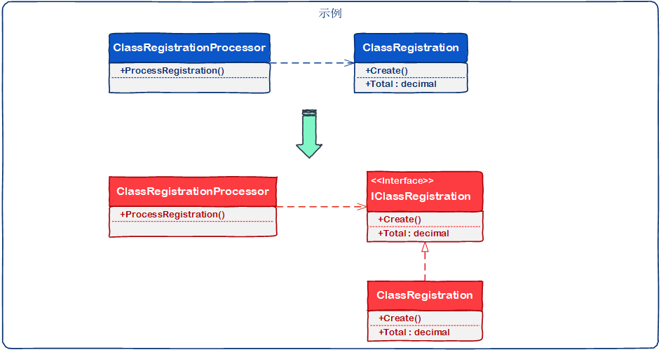

# [小酌重构系列[8]——提取接口][0]

### 前言

世间唯一“不变”的是“变化”本身 ，这句话同样适用于软件设计和开发。  
在软件系统中，模块（类、方法）应该依赖于抽象，而不应该依赖于实现。

当需求发生“变化”时，如果模块（类、方法）依赖于具体实现，具体实现也需要修改；  
如果模块（类、方法）依赖于接口，则无需修改现有实现，而是基于接口扩展新的实现。

#### 面向实现？面向接口？

接口可以被复用，但接口的实现却不一定能被复用。

面向实现编程，意味着软件的模块（类、方法）之间的耦合性非常高，每次遭遇“变化”，都会涉及到修改，并且可能是牵一发而动全身的。  
每次修改，都需要对原有的代码重新测试，也可能给旧的代码引入新的错误。

面向接口编程，是为了应对软件设计和开发中的“变化”，它是一种“以不变应万变”的思维模式。  
只要确保我们的抽象（接口）是不变的，无论需求怎么变化，我们总能通过扩展新的实现自如地应对。

接口是稳定的，关闭的，但接口的实现是可变的，开放的。

#### 开闭原则

“依赖于抽象，而不是具体实现”，它同时也是开闭原则的一种体现。

开闭原则的定义：当软件需要变化时，尽量通过扩展软件实体的行为来实现变化，而不是通过修改已有的代码来实现变化。它是面向对象的基本原则之一。

开闭原则主要有两个特征：  
（1）扩展开放（Open for extension）

（2）修改关闭（Closed for modification）  
开闭原则要求模块（类、方法）应具备良好的扩展性，同时对现有的功能具有一定的保护能力。

开闭原则是一个比较模糊的一个原则，它没有告诉你如何才能对扩展开放，以及如何才能对修改关闭。  
这需要借助我们自身的经验，以及对需求的理解程度，去分析软件系统中抽象的部分，识别其中的“变化”和“不变”。

#### 提取接口

“提取接口”是面向对象编程常用的解耦策略，将一些可能发生变化的具体实现提取为接口，将“变化”封装起来，从而达到依赖接口、而非具体实现的目的。

### 示例

#### 重构前

以下是一个课程注册的场景，这段代码提供了2个类：ClassRegistration和RegistrationProcessor，RegistrationProcessor依赖于ClassRegistration的Create()方法和Total属性。

    public class ClassRegistration
    {
        public void Create()
        {
            // create registration code
        }
    
        public decimal Total { get; private set; }
    }
    
    public class RegistrationProcessor
    {
        public decimal ProcessRegistration(ClassRegistration registration)
        {
            registration.Create();
            return registration.Total;
        }
    }
    

假如系统的业务发生了变化，ClassRegistration类的Create()方法已经不能满足新的业务了，我们需要使用另外的注册方法。  
这意味着，我们需要修改ClassRegistration类的Create()方法，且需要让其同时满足旧业务和新业务。

RegistrationProcessor依赖于ClassRegistration，既然ClassRegistration存在着诸多变数，我们可以使用“提取接口”的重构策略，让RegistrationProcessor依赖于某个接口。

#### 重构后

重构后，RegistrationProcessor依赖于IClassRegistration接口，RegistrationProcessor不必去关心IClassRegistration的具体实现是什么。  
新的业务要求不同的Create()方式时，我们无需更改现有的ClassRegistration，而是添加新class并实现IClassRegistration接口。

另外，在不同场景下，旧业务和新业务的实现可能在不同场景下被使用。  
这时，我们可以借助IoC框架将IClassRegistration接口的实例注入到指定场景。

    public interface IClassRegistration
    {
        void Create();
    
        decimal Total { get; }
    }
    
    public class ClassRegistration : IClassRegistration
    {
        public void Create()
        {
            // create registration code
        }
    
        public decimal Total { get; private set; }
    }
    
    public class RegistrationProcessor
    {
        public decimal ProcessRegistration(IClassRegistration registration)
        {
            registration.Create();
            return registration.Total;
        }
    }
    

最后，下面这幅图描述了这次重构过程。

[小酌重构系列目录汇总][1]

[0]: http://www.cnblogs.com/keepfool/p/5472217.html
[1]: http://www.cnblogs.com/keepfool/p/5492665.html
