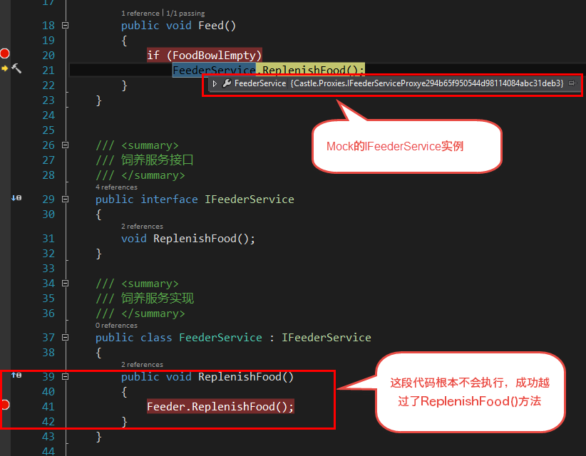
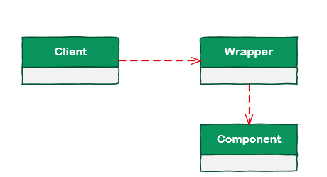

# [小酌重构系列[9]——分解依赖][0]

### 概述

编写单元测试有助于改善代码的质量，在编写单元测试时，某些功能可能依赖了其他代码（比如调用了其他组件）。  
通常我们只想测试这些功能本身，而不想测试它所依赖的代码。

**为什么呢？**  
单元测试的目标是验证该功能是否正确，然而功能所依赖的代码是处于功能范围外的，这些代码可能是一些外部的组件，单元测试无法验证这些外部组件的准确性。  
单元测试因调用“依赖的代码”出错而失败时，会影响测试结果的判断，我们无法确定功能本身是否是正确的。  
也许功能是正确的，但调用依赖的代码出错时，这个单元测试仍然会被认为是失败的。  
如果要测试这些被依赖的代码，我们应该另外地为这些代码编写单元测试。

**如何解决？**  
“依赖的代码”成了我们编写这类单元测试的拦路石，我们可以通过2种方式来解决这个问题：  
1. Mock依赖的代码   
2. 分解依赖

Mock的强大是毋庸置疑的，然而Mock不是万能的，它也是有限制的， 我们不能在单元测试中Mock静态类 。  
但是，通过“分解依赖”可以解决这个问题，本文将通过一个示例来演示这2种方式。 

### 示例

#### 重构前

这段代码描述了一个场景——“饲养动物”，它包含2个类：  
AnimalFeedingService（动物饲养服务），以及静态类Feeder（饲养员）。  
AnimalFeedingService描述了“饲养”行为，Feeder类描述了“补充食物”行为。  
在饲养动物时，如果动物的食盆是空的，则饲养员需要补充食物。

    /// 

    /// 动物饲养服务
    /// 

    public class AnimalFeedingService
    {
        private bool FoodBowlEmpty { get; set; }
    
        public void Feed()
        {
            if(FoodBowlEmpty)
                Feeder.ReplenishFood();
        }
    }
    
    /// 

    /// 饲养员
    /// 

    public static class Feeder
    {
        /// 

        /// 补充食物
        /// 

        public static void ReplenishFood()
        {
            
        }
    }

**单元测试代码（基于xUnit和Rhino.Mocks框架）**

    public class AnimalFeedingServiceTests
    {
        [Fact]
        public void TestFeed()
        {
            AnimalFeedingService service = new AnimalFeedingService();
            // 测试Feed()方法
            service.Feed();
        }
    }
    

由于Feeder是一个静态类，所以在为AnimalFeedingService编写单元测试时，我们无法mock Feeder类，而且Feeder类的功能我们也不想在这个单元测试中验证。  
如果在调用Feeder.ReplenishFood()时就出错了，这个单元测试的执行就是失败的。  
同时，Feed()方法的正确性也无法验证。

#### 重构后

为了能在单元测试中解除对Feeder类的依赖，我们可以为Feeder类添加包装接口IFeederService，然后让AnimalFeedingService依赖于这个包装接口。这样在AnimalFeedingServiceTest类中，我们就不需要考虑Feeder类了。

显示代码

    /// 

    /// 动物饲养服务
    /// 

    
    public class AnimalFeedingService
    {
        private bool FoodBowlEmpty { get; set; }
    
        public IFeederService FeederService { get; set; }
    
        public AnimalFeedingService(IFeederService feederService)
        {
            this.FeederService = feederService;
        }
    
        public void Feed()
        {
            if (FoodBowlEmpty)
                FeederService.ReplenishFood();
        }
    }
    
    
    /// 

    /// 饲养服务接口
    /// 

    public interface IFeederService
    {
        void ReplenishFood();
    }
    
    /// 

    /// 饲养服务实现
    /// 

    public class FeederService : IFeederService
    {
        public void ReplenishFood()
        {
            Feeder.ReplenishFood();
        }
    }
    
    /// 

    /// 饲养员
    /// 

    public static class Feeder
    {
        public static void ReplenishFood()
        {
    
        }
    }

**单元测试代码（基于xUnit和Rhino.Mocks框架）**

    public class AnimalFeedingServiceTests
    {
        [Fact]
        public void TestFeed()
        {
            // 基于Rhino.Mocks框架的MockRepository
            var mocks = new MockRepository();
            // Mock IFeederService
            var feederService = mocks.DynamicMock<IFeederService>();
            AnimalFeedingService service = new AnimalFeedingService(feederService);
            // 测试Feed()方法
            service.Feed();
        }
    }
    

重构后的AnimalFeedingServiceTests，由于IFeederService是Mock的，所以IFeederService的ReplenishFood()方法根本不会被调用，因此Feeder的ReplenishFood()方法也不会被调用。  
调用Feed()方法时，Feeder.ReplenishFood()方法被忽略了，这可以让我们更加关注于Feed()方法本身的逻辑。

#### 包装模式

以上这段代码，实际上是一个简单的包装模式(Wrapper Pattern)，包装模式不能算是一个具体的设计模式，因为在适配器模式(Adapter Pattern)、装饰模式(Decorator Pattern)、代理模式(Proxy Pattern)、门面模式(Facade Pattern)等都使用了包装类，这几个设计模式我在这里就不具体描述了。通常情况下，包装类用于封装其他class或component，包装类可以为上层调用提供便利性，并使底层class或component的运用变得更安全。

包装模式的UML结构大致如下。它包含3个部分：调用方(Client)、包装(Wrapper)、组件(Component)

再来谈谈“分解依赖”这个概念，依照这个结构，我们可以很清楚地知道：为了解除Client和Component之间的依赖，我们在Client和Component之上添加了一个Wrapper，让Client依赖于Wrapper。请注意，由于我们更加倾向于面向接口编程，所以通常这个Wrapper是一个包装接口。再举一个常用的例子，当我们在编写一些API时，我们只需要通过Wrapper向Client公开API的规格(名称、输入输出参数)，API的内部实现则通过Wrapper隔离开来。

[0]: http://www.cnblogs.com/keepfool/p/5476039.html