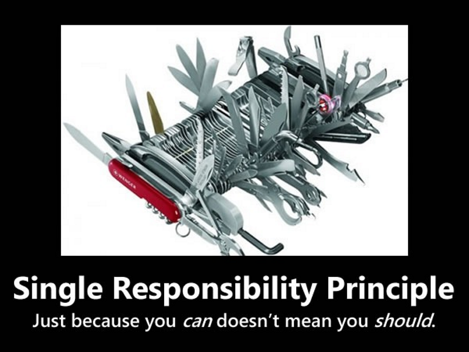

# [小酌重构系列[10]——分离职责][0]

### 概述

“分离职责” 是经常使用的一个重构策略，当一个类担任的职责太多时，应按职责将它拆分成多个类，每个类分别承担“单一”的职责，也就是让每个类专心地做“一件事情”。

### SRP原则

在面向对象编程中，SRP原则是一个非常重要的原则（SOLID原则都很重要），在展示示例前，我们先了解一下SRP原则是什么，以及它有什么作用。

#### 什么是SRP原则？

SRP原则的定义是这样的：

> There should never be more than one reason for a class to change.

**就一个类而言，应该仅有一个引起它变化的原因。**

#### 为什么要遵守SRP原则？

> When a class has more than one responsibility, there are also more triggers and reasons to change that class. A responsibility is the same as “a reason for change” in this context.

因为每一个职责都是变化的因子，当需求变化时，该变化通常反映为类的职责的变化。  
如果一个类承担了多于一个的职责，那么就意味着引起它的变化的原因会有多个，等同于把这些职责耦合在了一起。  
一个职责的变化可能会抑制到该类完成其他职责的能力，这样的耦合会导致脆弱的设计。

**在设计类或接口时，如果能够遵守SRP原则，则会带来以下优点：**

1. **类的复杂性降低：每个类或接口都只定义单一的职责，定义清晰明确**
1. **可读性提高：定义清晰明确，自然带来较高的代码可读性**
1. **可维护性提高：代码可读性提高，意味着更容易理解；单一职责使得类之间的耦合性较低，更改也会较为容易**
1. **扩展性更好：当需要扩展新的职责时，只需要定义新的接口和新的实现即可**

#### 如何遵守SRP原则？

> Separating responsibility can be done by defining for every responsibility a class or an interface.

**应该为每一项职责定义类或接口的方式实现职责分离。**

#### SRP原则的难点

SRP原则堪称是SOLID原则里面最简单的一个原则，但也可以说是最难的一个。  
它的“简单”之处在于它很容易被理解，“困难”之处在于很多人在软件设计过程中，很难真正地抓住关键点。 

对于开发者来说，“分离职责”存在四个难点，也是开发者在使用这种重构策略时需要慎重考虑的地方

##### 职责的划分

**“职责”单一是相对的，每个人看事情的角度，对业务的理解程度是不尽相同的，这导致了人们对职责的定义和细化程度的差异性。**同样一个业务，有些人从角度A出发，在对业务提炼归纳总结后，得出三项职责：J、K、L。而有些人则从角度B出发，归纳总结出两项职责：X、Y。  
在设计接口时，这两人自然而然地会设计出不同的接口，两人设计的接口个数和表达的语义也各不相同。

拿装修房子来说，业主通常会委托装修公司来做这件事儿，站在业主的角度理解，它就是一件大事儿——**“装修公司装修房子”**，至于怎么装修，由装修公司来搞定。  
装修公司通常会将这件大事儿拆分成几件小事儿，譬如：**“室内设计”、“贴瓷砖”、“做家具”、“刷墙”**等等，然后再去雇佣不同类型的工人来完成这些小事儿。

##### 类的命名

职责和类的命名应该匹配，如果在职责归纳时，归纳出的职责比较模糊，可能会使类的命名变得艰难。  
另外，即使你归纳出的职责是清晰的，如果命名与职责不符（词不达意），仍然会给将来的维护、再重构带来一些困难（命名是非常非常重要的）。

##### 类粒度的控制

将多个职责被拆分到多个类时，原本在一个类中体现的职责被分散到多个类了，与此同时也需要考虑类的粒度。  
粒度应当适中，粒度的控制没有固定的标准，这需要结合业务场景具体分析。

##### 类之间的依赖

原本用一个类就能完成的功能，现在需要结合多个类才能完成。  
现在为了确保原有的功能仍然能正常运行，较大可能会形成多个类之间的依赖关系。  
如果有些类被迁移到其他工程了，这还会涉及到工程之间的依赖关系。

##### 小结

“分离职责”是比较难的一个重构策略，尤其是在一些大型项目中。  
该策略如果不能良好地利用，可能会让你的工程或解决方案变得不伦不类。  
如果你的重构经验较浅，建议你从一些较小的项目练习这项重构策略。

### 示例

#### 重构前

这段代码包含两个类Video和Customer。  
Viedo类包含三个职责：支付费用、租借Video和计算租金。  
Video的职责太多，它把Customer类的职责也“抢”过来了。

    public class Video
    {
        public void PayFee(decimal fee)
        {
            
        }
    
        public void RendVideo(Video video, Customer customer)
        {
            customer.Videos.Add(video);
        }
    
        public decimal CalculateBalance(Customer customer)
        {
            return customer.LateFees.Sum();
        }
    }
    
    public class Customer
    {
        public IList<decimal> LateFees { get; set; }
        public IList<Video> Videos { get; set; } 
    }
    

#### 重构后

在归纳职责时，我们可以通过识别主语的方式来确定其归属。

* 支付费用的主语是“客户”，即“客户支付费用”。
* 计算租金的主语也是“客户”，即“计算客户的租金”。

所以，我们可以将Video类的PayFee()、CalculateBalance()方法放到Customer类中。

        
    public class Video
    {
        public void RentVideo(Video video, Customer customer)
        {
            customer.Videos.Add(video);
        }
    }
    
    public class Customer
    {
        public IList<decimal> LateFees { get; set; }
        public IList<Video> Videos { get; set; }
    
        public void PayFee(decimal fee)
        {
        }
    
        public decimal CalculateBalance(Customer customer)
        {
            return customer.LateFees.Sum();
        }
    }
    

原则就像基准线，在设计类和接口时，我们应该尽量遵守基准线，而不是死守基准线，在设计时不应死板地依照原则进行设计。这就好比开车，司机的视线应该始终保持在正前方，如果沿着公路上的线开车而忽视了前方的交通情况，可能会引发交通事故。

[0]: http://www.cnblogs.com/keepfool/p/5484139.html