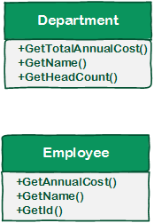
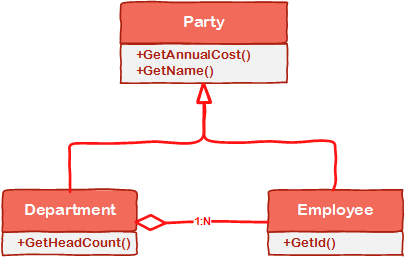
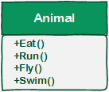
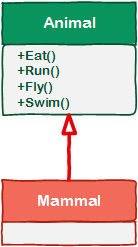
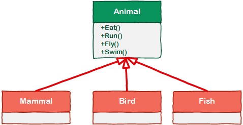
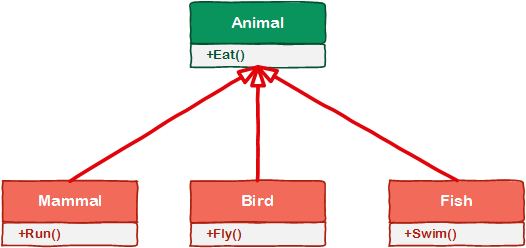
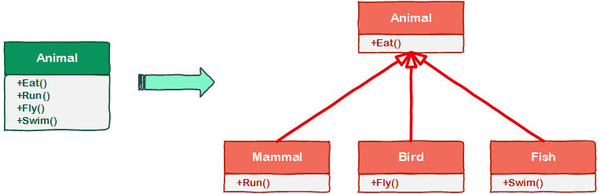

# [小酌重构系列[11]——提取基类、提取子类、合并子类][0]

### 概述

继承是面向对象中的一个 概念 ，在[小酌重构系列[7]——使用委派代替继承][1]这篇文章中，我“父子关系”描述了继承，这是一种比较片面的说法。后来我又在[UML类图的6大关系][2]，描述了继承是一种 “is a kind of” 关系，它更偏向于概念层次，这种解释更契合继承的本质。本篇要讲的3个重构策略提取基类、提取子类、合并子类都是和继承相关的，如果大家对继承的理解已经足够深刻了，这3个策略用起来应该会得心应手。

### 提取基类

定义：如果有超过一个类有相似的功能，应该提取出一个基类，并将共通的功能放在基类中。

#### 图说

##### 初定关系

下图左定义了Department和Employee类，虽然这两个类有一些共同的特质——“获取年度成本”、“获取名称”。

在你第一眼看到这张图时，会觉得Department和Employee会是什么关系？通常情况下，大家可能会觉得Department和Employee是一个聚合关系。

从这两个类的特质分析，它们具有一些共同点——“获取年度成本”、“获取名称”。  
如果希望重用这些共通点，我们该怎么做呢？当然是使用继承啦。  
拿Employee继承Department吗？毛线啊，Department和Employee在语义上不存在 “is a kind of” 关系啊。我们总不能说 “Employee is a kind of department” 吧。

Well，这条路子走不通，那我们换个概念来理解Department和Employee吧——Party。  
Party是个什么玩意儿？在概念上，Party表示一个群体，群体可以是一个部门，也可以是一个人。

##### 造句时刻

前面讲了，继承关系可以用"is a kind of"来描述，现在咱们就用"is a kind of"造几个句子试试。  
"Department is a kind of party."  
"Employee is a kind of party." "Party"概念这样理解起来是否通顺一些了呢？我觉得是通顺的。

如果你觉得它不通顺，咱们换个姿势再来造2个句子，用被动式造句。  
"Party can be a kind of department."  
"Party can be a kind of employee."   
"Party"是否也能作为Department和Employee的抽象概念呢？我仍然觉得是（如果您觉得还不是，我也没辙了）。

##### 确定关系

经过这么一番折腾后，我们终于得以见证以下关系的产生。  
注意，我们仍然保留了Department和Employee的聚合关系。

看了这几幅图，是否会引起你的思考呢？  
一些看似没有特定关系的事物，可以通过抽象更高层次的概念，让它们产生其它层面的一些关系。   
Department和Employee看似没有继承关系，然而通过抽象出"Party"这个概念，让它Department和Employee产生了另外一层关系——同为Party的子类。

#### 示例

##### 重构前

这段代码定义了一个Dog类，并定义了两个方法：EatFood()和Grrom()，分别表示“进食”和“训练”行为。

    public class Dog
    {
        public void EatFood()
        {
            // eat some food
        }
    
    
        public void Groom()
        {
            // perform grooming
        }
    }
    

EatFood()和Groom()是大多数动物的公有行为，当追加新的动物class时，也可能会有这两个行为，我们应考虑将这两个行为提取到基类。

##### 重构后

    public class Animal
    {
        public void EatFood()
        {
            // eat some food
        }
    
    
        public void Groom()
        {
            // perform grooming
        } 
    }
    
    public class Dog : Animal
    {
    
    }
    

小提示：在提取基类时，如果当下只有一个类，你需要根据场景去分析“将来”可能发生的事情，这个例子较好地体现了这一点。  
Of course，你可以不必这么早地去提取基类，等到代码出现2~3次重复以后再去提取也不迟。

### 提取子类

定义：如果基类的方法或属性不是所有子类需要的，应将这些方法和属性提取到子类中。

#### 图说

有人可能觉得基类中的方法或属性越多越好，这样子类只需要很少的代码就能完成很多的功能。  
我们在基类中定义方法或属性时，一定要事先确定基类的职责。

##### 初回

下图的Animal类定义了4个方法：Eat()、Run()、Fly()和Swim()，分别表示进食、奔跑、飞翔和浮游行为。

确实所有的动物都要进食，但世界上基本上不存在水陆空三栖动物，你以为这是传说中的龙吗？

##### 第2回

现在你添加了一个类Mammal，它继承了Animal类。

Eat()和Run()是哺乳动物的共通行为，Fly()和Swim()并不是所有哺乳动物都具备的能力。

##### 第3回

再丰富一下咱们的动物世界，把鸟类和鱼类也加进来（ 哺乳动物终于不那么寂寞了，可以吃海鲜和烧鸡了）。

咱们不搞特殊化，从一般化上去认知Mammal、Bird和Fish。  
一般来说，Mammal具备Eat()和Run()行为，Bird具备Eat()和Fly()行为，Fish具备Eat()和Swim()行为。

这幅图如果用代码来展现，代码量会非常少。  
虽然使用继承可以减少代码量，可以一定程度上达到代码复用的目的， 但这不意味着准确性，也不意味着较低的复杂性。

以上内容已经说明了“不准确性”，即子类的行为不那么准确，那是基类强加给子类的。  
接着，我们来看看复杂性，上面这幅图为例，我们从两个角度来判断复杂性：

* 基类 + 子类的方法总数：一共16个方法
* 每个子类的方法总数：每个子类都有4个方法

##### 第4回

结合下面这幅图，我们比较一下这两种方式的复杂性：

* 基类 + 子类的方法总数：一共7个方法
* 每个子类的方法总数：每个子类都有2个方法

从数量上看，这两种方式的复杂程度不言而喻。

##### 终回

磨磨唧唧了这么久，用一幅图来表示“提取子类”这个重构策略吧（绿色表示重构前，红色表示重构后）。

#### 示例

##### 重构前

Registration类描述了学生选课的场景，学生选课有两种情况——已注册的课程和未注册的课程。

    public class Registration
    {
        public NonRegistrationAction Action { get; set; }
        public decimal RegistrationTotal { get; set; }
        public string Notes { get; set; }
        public string Description { get; set; }
        public DateTime RegistrationDate { get; set; }
    }
    
    public class NonRegistrationAction
    {
        
    }
    

Registration类的属性NonRegistrationAction和Notes只有在未注册的场景才会用到，所以可以考虑将这两个属性提取到子类。

##### 重构后

重构时追加了NonRegistration类，这样职责划分就很清晰了：Registration类对应已注册的选课场景，NonRegistration类对应未注册的选课场景。

    public class Registration
    {
        public decimal RegistrationTotal { get; set; }
        public string Description { get; set; }
        public DateTime RegistrationDate { get; set; }
    }
    
    public class NonRegistration : Registration
    {
        public NonRegistrationAction Action { get; set; }
        public string Notes { get; set; }
    
    }
    
    public class NonRegistrationAction
    {
        
    }

小提示：在基类中定义方法和属性时，请确定它们是否具备“一般性”。

### 合并子类

定义：当子类所有的方法属性完全适用于基类时，应该将这些方法和属性提取到基类，并移除子类。

这个重构策略比较简单，咱就不上图示了，直接用示例来向大家说明吧 ，有点困了

(./img/341820-20160513012754515-1273194205.gif) 

。

#### 示例

##### 重构前

这段代码定义了两个类：Website和StudentWebsite，分别表示“网站”和“学生网站”（ 难道还有“成人网站”？

(./img/341820-20160513012755624-958902570.gif) 

。StudentWebsite继承自Website，StudentWebSite扩展了一个IsActive属性，表示“是否激活”。

    public class Website
    {
        public string Title { get; set; }
        public string Description { get; set; }
        public IEnumerable<Webpage> Pages { get; set; } 
    }
    
    public class StudentWebsite : Website
    {
        public bool IsActive { get; set; }
    }
    
    public class Webpage
    {
        
    }
    

##### 重构后

实际上IsActive属性完全适用于所有的Website实例，所以没有必要单独地声明一个StudentWebsite类，可以将IsActive属性定义到Website类中，并移除StudentWebSite类（难道我的“成人网站”说没有就没有了吗？）

    public class Website
    {
        public string Title { get; set; }
        public string Description { get; set; }
        public IEnumerable<Webpage> Pages { get; set; }
        public bool IsActive { get; set; }
    }
    
    public class Webpage
    {
    
    }
    

小提示：不要盲目地创建子类，也不要盲目地在子类中定义方法和属性，搞不好基类也要用呢。

[0]: http://www.cnblogs.com/keepfool/p/5488031.html
[1]: http://www.cnblogs.com/keepfool/p/5467753.html
[2]: http://www.cnblogs.com/keepfool/p/5470423.html