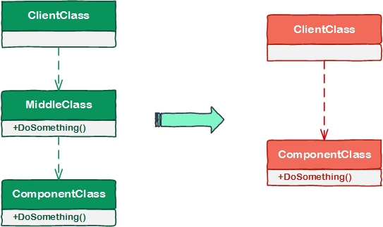
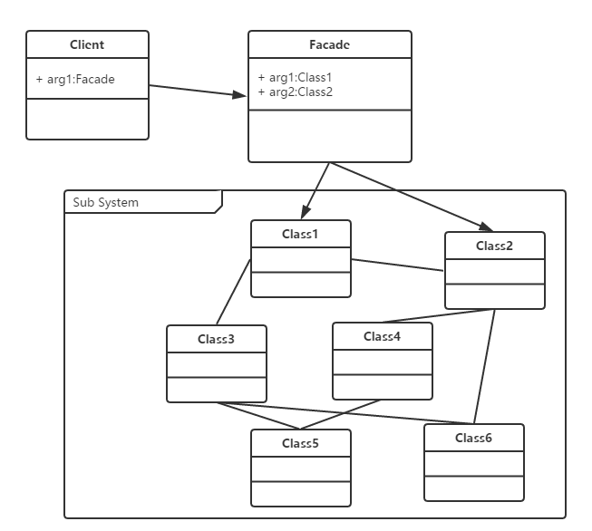
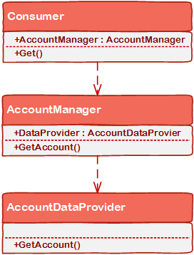
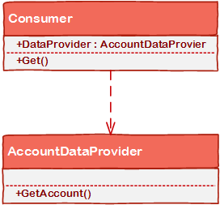

# [小酌重构系列[13]——移除中间类][0]

我们有时候在应用程序中可能编写了一些“幽灵”类，“幽灵”类也叫中间类。这些中间类可能什么事儿都没做，而只是简单地调用了其他的组件。这些中间类没有发挥实际的作用，它们增加了应用程序的层级（layer），并且增加了应用程序的复杂性。这时，我们应将这样的中间类删除，甚至删除中间类所处的“中间层”——这就是本文要讲的重构策略“移除中间类”。

### 移除中间类

#### 图说

这个重构策略比较容易理解，下面这幅图演示了它的重构过程。

#### 例外

通常情况下，无效的中间类可能是因为滥用设计模式而造成的。

如果设计模式使用的恰当，这个重构策略就不适用了，比如用“门面模式”、“适配器模式”和“代理模式”的场景。

下面我以“门面模式”简单说明一下不适用的场景。

##### 门面模式

  
门面模式，是指提供一个统一的接口去访问多个子系统的多个不同的接口，它为子系统中的一组接口提供一个统一的高层接口。使得子系统更容易使用。

通过区分“门面模式”的使用场景，可以判断是否应该使用“移除中间类”：

> 1、客户只需要使用某个复杂系统的子集，或者需要以一种特殊的方式与系统交互时，使用门面模式。

> 2、当需要跟踪原系统的使用情况时 ，使用门面模面模式。因为所有对系统的访问都经过FACADE,所以可以很容易地监视系统的使用 。

> 3、 希望封装和隐藏原系统时。

> 4、编写新类的成本小于所有人使用和维护原系统使用所需的成本时

### 示例

#### 重构前

这段代码定义了3个类，Consumer依赖于AccountManager，AccountManager依赖于AccountDataProvider。

隐藏代码

    public class Consumer
    {
        public AccountManager AccountManager { get; set; }
    
        public Consumer(AccountManager accountManager)
        {
            AccountManager = accountManager;
        }
    
        public void Get(int id)
        {
            Account account = AccountManager.GetAccount(id);
        }
    }
    
    public class AccountManager
    {
        public AccountDataProvider DataProvider { get; set; }
    
        public AccountManager(AccountDataProvider dataProvider)
        {
            DataProvider = dataProvider;
        }
    
        public Account GetAccount(int id)
        {
            return DataProvider.GetAccount(id);
        }
    }
    
    public class AccountDataProvider
    {
        public Account GetAccount(int id)
        {
            // get account
        }
    }
    

AccountManager类作为中间类，没有起到任何实际的作用，它只是依葫芦画瓢地套用了AccountDataProvider做的事情。

#### 重构后

移除中间类后，Consumer类直接依赖于AccountDataProvider类。

隐藏代码

    public class Consumer
    {
        public AccountDataProvider AccountDataProvider { get; set; }
    
        public Consumer(AccountDataProvider dataProvider)
        {
            AccountDataProvider = dataProvider;
        }
    
        public void Get(int id)
        {
            Account account = AccountDataProvider.GetAccount(id);
        }
    }
    
    public class AccountDataProvider
    {
        public Account GetAccount(int id)
        {
            // get account
        }
    }

[0]: http://www.cnblogs.com/keepfool/p/5494731.html