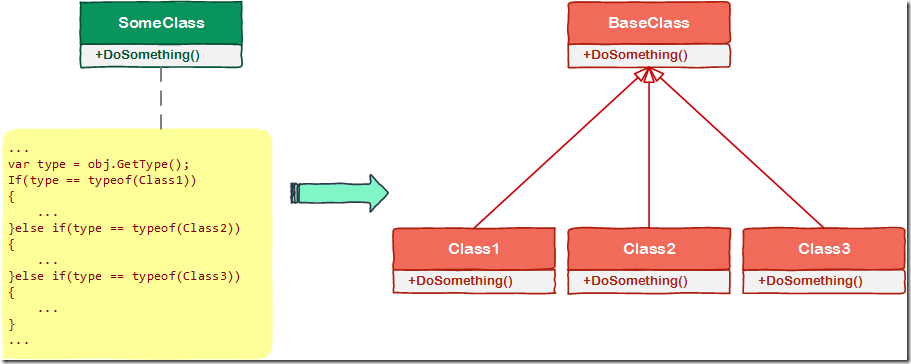
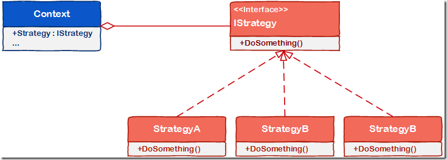
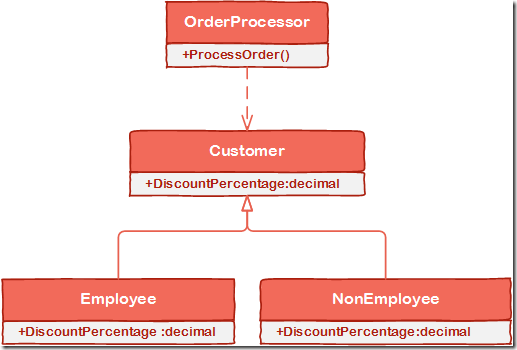

# [小酌重构系列[14]——使用多态代替条件判断][0]

### 概述

有时候你可能会在条件判断中，根据不同的对象类型（通常是基类的一系列子类，或接口的一系列实现），提供相应的逻辑和算法。  
当出现大量类型检查和判断时，if else（或switch）语句的体积会比较臃肿，这无疑降低了代码的可读性。  
另外，if else（或switch）本身就是一个“变化点”，当需要扩展新的对象类型时，我们不得不追加if else（或switch）语句块，以及相应的逻辑，这无疑降低了程序的可扩展性，也违反了面向对象的OCP原则。

基于这种场景，我们可以考虑使用“多态”来代替冗长的条件判断，将if else（或switch）中的“变化点”封装到子类中。这样，就不需要使用if else（或switch）语句了，取而代之的是子类多态的实例，从而使得代码的可读性和可扩展性提高了——这就是本文要介绍的重构策略“使用多态代替条件判断”。

### 使用多态代替条件

#### 图说

这个重构策略比较容易理解，下面这幅图演示了它的重构过程（绿色表示重构前，红色表示重构后）。

这个重构也常见于一些设计模式，例如：“策略者模式”（指对象的某个行为，在某个场景中，该行为有不同的实现算法）。

### 示例

#### 重构前

这段代码定义了4个类，Employee和NonEmployee是Customer的子类，OrderProcessor类根据不同的客户类型和订单商品处理订单折扣。

隐藏代码

    public abstract class Customer
    {
    }
    
    public class Employee : Customer
    {
    }
    
    public class NonEmployee : Customer
    {
    }
    
    public class OrderProcessor
    {
        public decimal ProcessOrder(Customer customer, IEnumerable<Product> products)
        {
            // do some processing of order
            decimal orderTotal = products.Sum(p => p.Price);
    
            Type customerType = customer.GetType();
            if (customerType == typeof(Employee))
            {
                orderTotal -= orderTotal * 0.15m;
            }
            else if (customerType == typeof(NonEmployee))
            {
                orderTotal -= orderTotal * 0.05m;
            }
    
            return orderTotal;
        }
    }
    

可以看到，ProcessOrder()方法的可读性较差，也比较难以维护。  
如果某些客户类型不再使用了，它里面的一些分支判断就变成了无效的代码。  
如果扩展新的客户类型，ProcessOrder()方法的逻辑需要变更，if else语句块也会越来越大。  
我们使用多态代替条件判断来重构。

#### 重构后

重构后，由于DiscountPercentage封装在Customer类和其子类中了，所以ProcessOrder()方法就无需去判定customer对象的真正类型了。  
即使扩展新的Customer类型，ProcessOrder()方法也不用修改，而只需要继承Customer类并实现DiscountPercentage属性，这也符合面向对象的OCP原则。

隐藏代码

    public abstract class Customer
    {
        public abstract decimal DiscountPercentage { get; }
    }
    
    public class Employee : Customer
    {
        public override decimal DiscountPercentage
        {
            get { return 0.15m; }
        }
    }
    
    public class NonEmployee : Customer
    {
        public override decimal DiscountPercentage
        {
            get { return 0.05m; }
        }
    }
    
    public class OrderProcessor
    {
        public decimal ProcessOrder(Customer customer, IEnumerable<Product> products)
        {
            // do some processing of order
            decimal orderTotal = products.Sum(p => p.Price);
    
            orderTotal -= orderTotal * customer.DiscountPercentage;
    
            return orderTotal;
        }
    }

[0]: http://www.cnblogs.com/keepfool/p/5495548.html