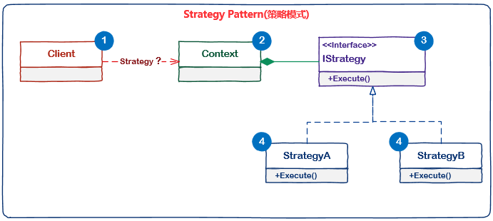
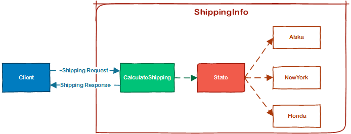
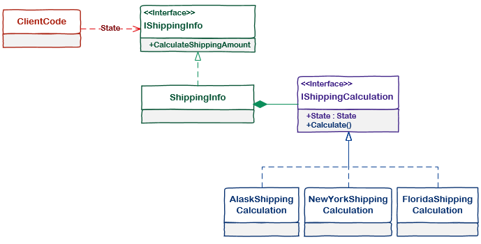

# [小酌重构系列[15]——策略模式代替分支][0]

### 前言

在一些较为复杂的业务中，客户端需要依据条件，执行相应的行为或算法。在实现这些业务时，我们可能会使用较多的分支语句（switch case或if else语句）。使用分支语句，意味着“变化”和“重复”，每个分支条件都代表一个变化，每个分支逻辑都是相似行为或算法的重复。  
当追加新的条件时，我们需要追加分支语句，并追加相应的行为或算法。

上一篇文章[“使用多态代替条件判断”][1]中，我们讲到它可以处理这些“变化”和“重复”，今天我将介绍一种新的方式——使用策略模式代替分支，它也能处理这些“变化”和“重复”。在讲这个策略之前，我们先来看一则小故事。

### 小商城的运营

某小型在线商城，有3位核心成员，他们分别是CTO、COO和CEO。  
CTO：小A，负责撸代码，以及维护商城系统。  
COO：小B，负责吹牛忽悠，以及市场推广和运营。  
CEO：小C，负责拉皮条，以及看着你俩干活。

在这个故事中，假定你就是小A，头衔CTO（谁让你既不会拉皮条，也不会吹牛忽悠呢）。

#### 第一幕

某一天，小B策划了一个促销活动，免费给用户发放一些优惠券，用户在消费满一定金额后，可以使用这些优惠券抵扣。  
假定现在有两个优惠活动——“满99减20，满199减50”。

每个用户要买的东西和花费的金额是不同的，根据不同的消费金额，系统需要判定使用什么优惠券。  
面对这样一个场景，你说这不是忒简单了嘛，然后唰唰唰2分钟就撸完了这串代码。

    public decimal CalculateAmount(decimal amount)
    {
        if (amount < 99)
            return amount;
        else if (amount < 200)
            return amount - 20;
        else
            return amount - 50;
    }
    

小B看了后，说道：“哇，这么快就弄完了，不愧是咱们公司的CTO，赶紧上线吧！”。

#### 第二幕

第一天，小B根据交易数据分析得知，自从上了优惠券后（我是优惠券，谁要上我？），商城的交易额增长了很多，而且有较多用户的订单金额竟然超过了200。  
为了回馈这部分“高端”用户的热情和贡献，商城决定加大优惠力度，于是小B追加了两项优惠活动：满299减80，满399减120。（好吧，这和街边卖场的大叔吆喝是一样样的，原价500多的真皮皮鞋、钱包，现在只要50元，全场50元，通通50元…！）

看到这新出现的场景，你想这不是分分钟搞定的事儿？于是你修改了CalculateAmount()方法。

    public decimal CalculateAmount(decimal amount)
    {
        if (amount < 99)
            return amount;
        else if (amount < 200)
            return amount - 20;
        else if(amount < 300)
            return amount - 50;
        else if (amount < 400)
            return amount - 80;
        else
            return amount - 120;
    }

#### 第三幕

第二天，小B又提了一个要求：“有些用户的会员等级比较高，为了给用户一种“老子是上帝”的感觉，可以为这些高级会员打一些折扣。”

铜牌会员无折扣，银牌会员打98折，金牌会员打95折，砖石会员打9折。

这时，你心里嘀咕了一声，干嘛不早说？ 改吧，反正也不是啥难事儿。

    public decimal CalculateAmount(Customer customer, decimal amount)
    {
        // 优惠券减免
        if (amount < 99)
        {
        }
        else if (amount <200)
            amount -= 20;
        else if(amount <300)
            amount -= 50;
        else if (amount < 400)
            amount -= 80;
        else
            amount -= 120;
    
        // 会员等级减免
        switch (customer.MemberLevel)
        {
            case MemberLevel.Silver:
                amount *= 0.98m;
                break;
            case MemberLevel.Gold:
                amount *= 0.95m;
                break;
            case MemberLevel.Diamond:
                amount *= 0.90m;
                break;
        }
        return amount;
    }

小B拍了拍你的肩膀，意味深长地说：“网站的维护就全靠你了，咱们会好起来的，赚了钱大家一起分！”。

#### 第四幕

三天之后，小B说这几天商城销量非常不错，咱们应该赚了不少钱。但是用户现在的激情也降下去了，咱们可以撤回这些优惠了，商品都按原价来卖吧，麻烦你把优惠政策给撤销吧。

你幽幽地叹了一口气：“好吧，现在改（说好的赚钱大家一起分的呢，这茬子事儿你咋不提？一万匹草泥马疯狂地踏过）。”

于是你删除了调用这个方法的代码。

#### 第五幕

一个月后，小B又来找你了：“现在又到了购物的旺季，淘宝京东开始做活动了，优惠力度还挺大，咱们也在这股购物潮里凑个热闹吧。这一次，我们有以下几项业务规则，和上次的不同，也比上次的复杂一些，你听我向你娓娓道来啊。”

> 1. aaa规则  
> 2. bbb规则  
> 3. ccc规则  
> 4. ddd规则  
> …  
> 10. xxx规则

听完这些后，你崩溃了，你这个小B（一语双关），怎么一下子提出这么多业务，还不带重样的，我从何改起啊？

#### 设计模式简介

听完这个故事后，你能了解到什么呢？我们用两个词来概括，也就是本文开头提到的“变化”和“重复”。  
大多数的“变化”都会伴随着“重复”，这些“重复”的表现形式可能不一样，但它们的本质是类似的。

无论是生活还是工作，变化是和重复都是无处不在的。  
在工作中，我们处于某一个岗位，我们每天的工作任务都会有变化，我们使用近乎相同的方式处理这些工作任务。

代码中也会出现很多“变化”和“重复”，我们该如何应对呢？。  
你可以借用一些设计模式，怎么用设计模式咱先不说，我们先粗略地解一下设计模式。

_设计模式是对软件设计中普遍存在（反复出现）的各种问题，所提出的解决方案。_

设计模式我们把它拆分成两个来看，“设计”和“模式”。  
“设计”就是设计，对于软件系统来说，即分析问题并解决问题的过程。  
“模式”是指事物的标准。在软件领域，每个人面临的问题是不同的，虽然不同的问题有不同的标准，但很多问题本质上是类似的。

设计模式更多的是软件层面的，而非业务层面的。  
即使你用了设计模式，你也不一定能解决业务上的问题。  
即使你不用设计模式，业务上的问题你也许能通过其他途径解决。

设计模式怎么用，在这里我也无法给一个确定的答案。  
我个人的看法是，尽量做到“心中无模式”。最关键的是，你应该直面问题的本质，寻找问题最有效的解决方式，不要一遇到问题，就夸夸其谈地使用某某设计模式。真切地从用户角度去出发，去剖析问题的本质，并提出合理的设计和解决方案。当问题得以解决，你回顾这个过程时，你会发现很多模式你是自然而然地用到了。不要特别在意设计模式，这可能会让你忽视问题的本质，即使你把GOF的23种设计模式倒背如流，你解决问题的能力也不会有所提升。

PS：为了描述“变化”和“重复”，我使用了小商城运营这个故事。这个故事里面有些不恰当的地方，搞在线购物的是不会这么去设计优惠券和折扣的。

### 策略模式

正式进入今天的主题吧，这篇文章要提到的设计模式是“策略模式”。

#### 定义

策略模式是设计模式里面较为简单的一种，它的定义如下：

_The Strategy Pattern defines a family of algorithms,encapsulates each one,and makes them interchangeable. Strategy lets the algorithm vary independently from clients that use it._

策略模式定义了一系列的算法，并将每一个算法封装起来，而且使它们还可以相互替换。  
在策略模式中，算法是其中的“变化点”，策略模式让算法独立于使用它的客户而独立变化。

#### 组成部分

策略模式有4个部分组成：

**1. 客户端**：指定使用哪种策略，它依赖于环境

**2. 环境**：依赖于算法接口，并为客户端提供算法接口的实例

**3. 抽象策略**：定义公共的算法接口

**4. 策略实现**：算法接口的具体实现

下面这幅图诠释了这4个组成部分：

注意：在策略模式中，策略是由用户选择的，这意味着具体策略可能都要暴露给客户端，但是我们可以通过[“分解依赖”][2]来隐藏策略细节。

### 示例

#### 重构前

该示例是一家物流公司根据State计算物流运费的场景，ShippingInfo类的CalculateShippingAmount()方法，会按照不同的State计算出运输费用。物流公司最开始只处理3个State的运输业务，分别是Alaska, NewYork和Florida。

隐藏代码

    public class ClientCode
    {
        public decimal CalculateShipping()
        {
            ShippingInfo shippingInfo = new ShippingInfo();
            return shippingInfo.CalculateShippingAmount(State.Alaska);
        }
    }
    
    public enum State
    {
        Alaska,
        NewYork,
        Florida
    }
    
    public class ShippingInfo
    {
        public decimal CalculateShippingAmount(State shipToState)
        {
            switch (shipToState)
            {
                case State.Alaska:
                    return GetAlaskaShippingAmount();
                case State.NewYork:
                    return GetNewYorkShippingAmount();
                case State.Florida:
                    return GetFloridaShippingAmount();
                default:
                    return 0m;   
            }
        }
    
        private decimal GetAlaskaShippingAmount()
        {
            return 15m;
        }
    
        private decimal GetNewYorkShippingAmount()
        {
            return 10m;
        }
    
        private decimal GetFloridaShippingAmount()
        {
            return 3m;
        }
    }
    

这段代码使用了switch case分支语句，每个State都有相应的运费算法。当物流公司业务扩大，追加新的State时，我们不得不追加switch case分支，并提供新的State的运费算法。

在不远的将来，ShippingInfo类将变成这样：

* CalculateShippingAmount()方法中包含了大量的switch case分支
* 大量的运费算法使得ShippingInfo变得非常臃肿

从职责角度看，运费算法是另外一个层面的职责，我们也理应将运费算法从ShippingInfo中剥离出来。

#### 重构后

为了演示策略模式的各个组成部分，我将重构后的代码拆分为4个部分，下图是重构后的UML图示。

##### 抽象策略

计算运费的策略接口，在接口中定义了State属性和Calculate()计算方法。

    public interface IShippingCalculation
    {
        State State { get; }
        decimal Calculate();
    }
    

##### 策略实现

计算运费的策略实现，分别实现了Alask、NewYork和Florida三个州的运算策略。

    public class AlaskShippingCalculation : IShippingCalculation
    {
        public State State { get { return State.Alaska; } }
    
        public decimal Calculate()
        {
            return 15m;
        }
    }
    
    public class NewYorkShippingCalculation : IShippingCalculation
    {
        public State State { get { return State.NewYork; } }
    
        public decimal Calculate()
        {
            return 10m;
        }
    }
    
    public class FloridaShippingCalculation : IShippingCalculation
    {
        public State State { get { return State.Florida; } }
    
        public decimal Calculate()
        {
            return 3m;
        }
    }
    

##### 环境

IShippingInfo接口相当于环境接口，ShippingInfo相当于环境具体实现，ShippingInfo知道所有的运算策略。

    public interface IShippingInfo
    {
        decimal CalculateShippingAmount(State state);
    }
    
    public class ShippingInfo : IShippingInfo
    {
        private IDictionary<State, IShippingCalculation> ShippingCalculations { get; set; }
    
        public ShippingInfo(IEnumerable<IShippingCalculation> shippingCalculations)
        {
            ShippingCalculations = shippingCalculations.ToDictionary(calc => calc.State);
        }
    
        public decimal CalculateShippingAmount(State state)
        {
            return ShippingCalculations[state].Calculate();
        }
    }
    

##### 客户端

ClientCode表示客户端，由客户端指定运输目的地，它通过IShippingInfo获取运费计算结果。

客户端依赖于IShippingInfo接口，这使运费计算策略得以隐藏，并解除了客户端对具体环境的依赖性。

    public class ClientCode
    {
        public IShippingInfo ShippingInfo { get; set; }
    
        public decimal CalculateShipping()
        {
            return ShippingInfo.CalculateShippingAmount(State.Alaska);
        }
    }

### 使用分支还是策略模式?

通过上面这个示例，大家可以清晰地看到，重构后的代码比重构前复杂的多。出现新的State时，虽然我们可以方便地扩展新的策略，但是会导致策略类越来越多，这意味着我们可能需要维护大量的策略类。

有些人会觉得重构前的代码会比较实用，虽然耦合性高，无扩展性，但代码也比较好改——想使用哪种方式完全取决于你。  
（在实际的应用中，运费计算远比示例中的代码要复杂的多。比如：需要依据当前的油价、运输路线、运输工具、运输时间等各种条件来计算。）

另外，我们不应该一遇到分支语句，就想着把它改造成策略模式，这是设计模式的滥用。  
如果分支条件是比较固定的，而且每个分支处理逻辑较为简单，我们就没必要使用设计模式。

总的来说，使用分支判断还是策略模式？答案是：It depends on you.

[0]: http://www.cnblogs.com/keepfool/p/5503516.html
[1]: http://www.cnblogs.com/keepfool/p/5495548.html
[2]: http://www.cnblogs.com/keepfool/p/5476039.html