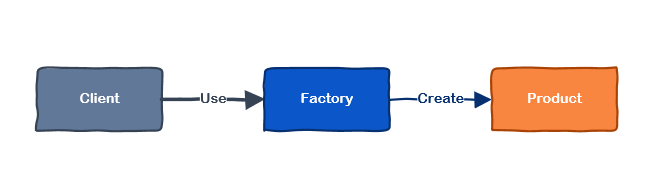
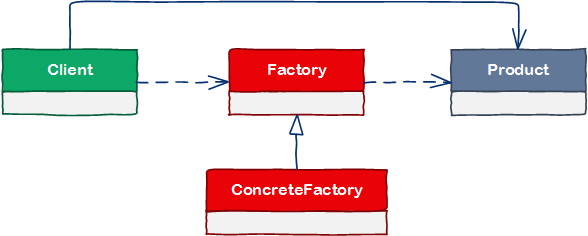

# [小酌重构系列[17]——提取工厂类][0]

### 概述

在程序中创建对象，并设置对象的属性，是我们长干的事儿。当创建对象需要大量的重复代码时，代码看起来就不那么优雅了。从类的职责角度出发，业务类既要实现一定的逻辑，还要负责对象的创建，业务类干的事儿也忒多了点。对象创建也是“一件事”，我们可以将“这件事”从业务代码中提取出来，让专门的类去做“这件事”，这个专门的类一般是“工厂类”，这样使得业务类和工厂类各司其职，代码整洁性得以提高。这就是本文要讲的主题——提取工厂类。

### 工厂举例

#### 什么都做的PC厂商

某PC厂商生产一系列的笔记本电脑，如果笔记本电脑的各个部件都由PC厂商自己生产提供，没准第一批笔记本电脑还未生产出来，这家PC厂商就已经倒闭了。因为它需要自己研发设计CPU、显卡、内存、硬盘等核心硬件，这些硬件都需要不同的团队来支持，维持并管理好这些团队是非常耗时耗力的。

我们把“类”看作是这个“PC厂商”，所有硬件都靠PC厂商自己研发，意味着类的职责特别多，职责过多也意味着这个类的稳健性较差。  
即使这家PC厂商除了CPU，其他所有零件它都生产好了，它仍然不能生产出一台可以正常运行的PC。

#### 专一的PC厂商

那么怎么做会比较合适呢？这个PC厂商找好自己在市场上的定位，树立起这些笔记本的品牌，准备好售前售后策略，至于CPU、显卡、内存、硬盘这些核心硬件，联络优质的厂家，由他们来供货。然后，拿着这些厂家提供的硬件，在自己的工厂里生产组装笔记本电脑，贴上自己的品牌，最终推向市场。  
这样做的好处是，PC的各个零件不需要自己的团队来研发，也不需要自己生产，他们负责联络合适的供应商，由供应商生产这些硬件，他们只需专注于品牌设计、PC组装和市场推广这些环节，这也使得他们的整体风险降低了。

这个过程中包含三方：Client(PC厂商)、Factory(硬件厂商)和Product(硬件产品)，可以用下面的图来表示。

站在硬件厂商的角度，PC厂商是他们的客户，硬件厂商为PC厂商提供PC零件。

注意：这个示例中的“专一”是指PC厂商专注于品牌设计、PC组装和市场推广。

### 示例

#### 重构前

PoliceCarController类的New()方法包含了创建PoliceCar的所有逻辑

    public class PoliceCarController
    {
        public PoliceCar New(int mileage, bool serviceRequired)
        {
            PoliceCar policeCar = new PoliceCar();
            policeCar.ServiceRequired = serviceRequired;
            policeCar.Mileage = mileage;
            return policeCar;
        }
    }
    
    public class PoliceCar
    {
        public bool ServiceRequired { get; set; }
        public int Mileage { get; set; }
    }
    

如果PoliceCar的属性很多，New()方法将变得非常大，代码的可读性和维护性也会降低。从“类的职责”角度去看，PoliceCarController类担任了PoliceCar的创建职责，我们应将这项职责提取出来。

#### 重构后

重构后PoliceCarController类就很直观了，New()方法被移除了。  
现在它依赖于IPoliceCarFactory接口，PoliceCarController不需要知道PoliceCar的创建细节，PoliceCar的创建逻辑被这个工厂接口隔离开了。  
这不仅精简了PoliceCarController的职责，也降低了PoliceCarController和PoliceCar之间的耦合性。

另外，原本PoliceCar对象的生命周期是由PoliceCarController管理的，重构后则由工厂类来管理的。  
由工厂类来集中管理对象的生命周期，可以保证程序具有一致的行为（一致性）。

隐藏代码

    public class PoliceCarController
    {
        public IPoliceCarFactory PoliceCarFactory { get; set; }
    
        public PoliceCarController(IPoliceCarFactory policeCarFactory)
        {
            PoliceCarFactory = policeCarFactory;
        }
    
        public PoliceCar New(int mileage, bool serviceRequired)
        {
            return PoliceCarFactory.Create(mileage, serviceRequired);
        }
    }
    
    public class PoliceCar
    {
        public bool ServiceRequired { get; set; }
        public int Mileage { get; set; }
    }
    
    public interface IPoliceCarFactory
    {
        PoliceCar Create(int mileage, bool serviceRequired);
    }
    
    public class PoliceCarFactory : IPoliceCarFactory
    {
        public PoliceCar Create(int mileage, bool serviceRequired)
        {
            PoliceCar policeCar = new PoliceCar();
            policeCar.ServiceRequired = serviceRequired;
            policeCar.Mileage = mileage;
            return policeCar;
        }
    }
    

注意：阅读这段代码时，请将它看成两部分。  
一部分是IPoliceCarFactory和PoliceCarFactory，另一部分是PoliceCarController和PoliceCar。

### 简单工厂模式介绍

我们所熟知的”工厂模式“有三种，它们也被称之为“工厂模式家族”，或者“工厂三兄弟”。

* 简单工厂(Simple Factory)
* 工厂方法(Factory Method)
* 抽象工厂(Abstract Factory)。

本文中用到的就是 简单工厂模式 ，这三者有很多不同的地方，运用场景也各不相同。  
（由于本文不是专门 讲设计模式的，所以我在这里就不过多介绍它们的区别和运用场景了）

#### 定义

_Simple Factory Pattern：Creates objects without exposing the instantiation logic to the client. Refers to the newly created object through a common interface。_

简单工厂模式由3部分组成：客户、工厂和产品。  
用一句话可以概括为：客户需要的产品应由工厂创建，产品的实现细节不应该暴露给客户。  
用户使用的iPhone手机是由富士康生产的，用户对应下图中的Client，iPhone对应Product，富士康则对应Factory，用户无需知道富士康是怎么生产iPhone的。

在简单工厂模式中，可以根据参数的不同返回不同类的实例。简单工厂模式需要专门定义一个类（或接口）来负责创建其他类的实例，被创建的实例通常都具有共同的父类。

#### 使用场景

简单工厂模式适用的场景如下：

* 工厂类负责创建的对象比较少：由于创建的对象较少，不会造成工厂方法中的业务逻辑太过复杂。
* 客户端只知道传入工厂类的参数，对于如何创建对象不关心：客户端既不需要关心创建细节，甚至连类名都不需要记住，只需要知道类型所对应的参数。

[0]: http://www.cnblogs.com/keepfool/p/5510674.html