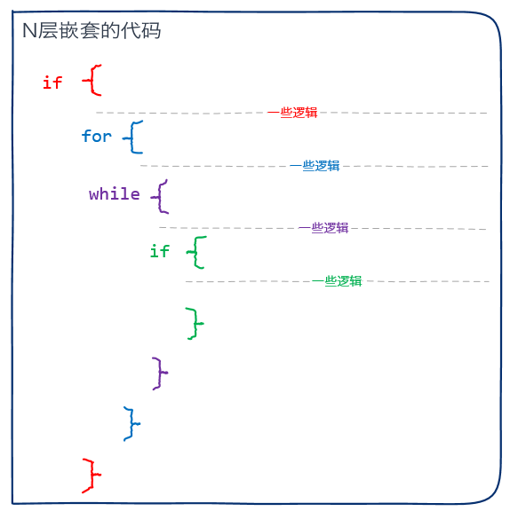
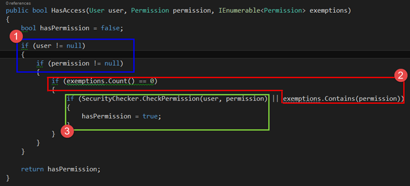

# [小酌重构系列[19]——分解大括号][0]

### 概述

if else, for, while等是程序中最常用的语句，这些语句有一个共同点——它们的逻辑都封装在一对“{}”包围的代码块中。在实现复杂的业务逻辑时，会较多地用到这些语句，可能会形成多层的代码嵌套。代码的嵌套层数越大，代码的缩进层次就越深，这将会降低代码的可读性。  
如下图所示，如果我们想理解绿色if代码块的逻辑，需要先了解前3个代码块是如何工作的。

N层嵌套的代码不仅可读性差，也难以维护。当需要变更某一层的代码时，因前后层次的逻辑制约，很容易改出有问题的代码。  
本文要讲的“分解大括号”策略正是为了避免这种问题，它也可以使我们的代码变得更加整洁。

### 示例

#### 重构前

Security类的HasAccess方法为了判断用户是否有权限访问，它用了4层if嵌套。

隐藏代码

    public class Security
    {
        public ISecurityChecker SecurityChecker { get; set; }
    
        public Security(ISecurityChecker securityChecker)
        {
            SecurityChecker = securityChecker;
        }
    
        public bool HasAccess(User user, Permission permission, IEnumerable<Permission> exemptions)
        {
            bool hasPermission = false;
    
            if (user != null)
            {
                if (permission != null)
                {
                    if (exemptions.Count() == 0)
                    {
                        if (SecurityChecker.CheckPermission(user, permission) || exemptions.Contains(permission))
                        {
                            hasPermission = true;
                        }
                    }
                }
            }
    
            return hasPermission;
        } 
    }
    
    public interface ISecurityChecker
    {
        bool CheckPermission(User user, Permission permission);
    }
    

HasAccess方法的逻辑可以分解为3个步骤：

1. 当user或permission为null时，返回false
1. 当参数permission是参数exemptions的一个元素时，返回true
1. 返回SecurityChecker.CheckPermission(user, permission)调用的结果

下图标示了这3个步骤。

这3个步骤都能决定方法的返回结果，所以没有必要将这些步骤用“{}”嵌套在一起。  
我们可以将这3个步骤分离开来，然后指定这3个步骤的执行顺序，并尽快返回结果，就能解除这些嵌套的大括号。

#### 重构后

重构后，我们再次阅读读HasAccess方法，一眼就知道它所表达的逻辑。  
这段代码也用到了我后面要讲的一个重构策略——“尽快返回”。

隐藏代码

    public class Security
    {
        public ISecurityChecker SecurityChecker { get; set; }
    
        public Security(ISecurityChecker securityChecker)
        {
            SecurityChecker = securityChecker;
        }
    
        public bool HasAccess(User user, Permission permission, IEnumerable<Permission> exemptions)
        {
            if (user == null || permission == null)
                return false;
    
            if (exemptions.Contains(permission))
            {
                return true;
            }
    
            return SecurityChecker.CheckPermission(user, permission);
        } 
    }
    
    public interface ISecurityChecker
    {
        bool CheckPermission(User user, Permission permission);
    }
    

### 小结

较多层次的嵌套代码，会增加阅读代码的难度。  
在编码时，一个方法的嵌套层次应该尽量少。  
多少层最合适呢？一般不应该多于一层或两层。

[0]: http://www.cnblogs.com/keepfool/p/5513725.html