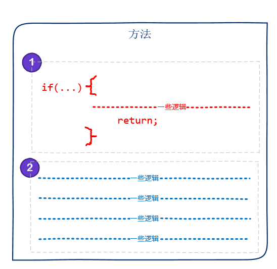

# [小酌重构系列[22]——尽快返回][0]

### 概述

阅读文章时，如果某个段落已经传达了关键信息，我们可能就不会逐字逐句地将文章读完，因为我们已经知道了这篇文章的核心内容。  
与此类似，如果方法中某些条件判断可以得到结果，我们应该尽快返回该结果。

尽快返回可以带来三个好处

* **节省阅读代码的时间——如果方法能够尽快返回，后面的代码逻辑可以不必阅读。**见下图，如果①已经返回了，就不必阅读②部分的代码
* **避免执行无效的逻辑——如果方法能够尽快返回，后面的代码逻辑就不会被执行。**见下图，如果①已经返回了，②部分的逻辑不会被执行
* **增强代码的可读性**

在[分解大括号][1]这篇文章中，我们已经用到了“尽快返回”这个重构策略。  
在实现复杂的业务逻辑时，可能会形成多层的代码嵌套，如果某些条件判断可以得到结果，我们应该尽快返回这个结果，这也能够减少嵌套层数，从而增强代码的可读性。

### 示例

下面沿用了[分解大括号][1]这篇文章中的实例，但我会从“尽快返回”的角度去讲解这个示例。

#### 重构前

Security类的HasAccess方法为了判断用户是否有权限访问，直到方法的最后一行才返回结果。  
这个方法有4层嵌套，它的可读性本身是较差的，这意味着我们需要理解所有的嵌套逻辑，才能知道返回结果。

隐藏代码

    public class Security
    {
        public ISecurityChecker SecurityChecker { get; set; }
    
        public Security(ISecurityChecker securityChecker)
        {
            SecurityChecker = securityChecker;
        }
    
        public bool HasAccess(User user, Permission permission, IEnumerable<Permission> exemptions)
        {
            bool hasPermission = false;
    
            if (user != null)
            {
                if (permission != null)
                {
                    if (exemptions.Count() == 0)
                    {
                        if (SecurityChecker.CheckPermission(user, permission) || exemptions.Contains(permission))
                        {
                            hasPermission = true;
                        }
                    }
                }
            }
    
            return hasPermission;
        } 
    }
    
    public interface ISecurityChecker
    {
        bool CheckPermission(User user, Permission permission);
    }

HasAccess方法的逻辑可以分解为3个步骤：

1. 当user或permission为null时，**返回false**
1. 当参数permission是参数exemptions的一个元素时，**返回true**
1. **返回**SecurityChecker.CheckPermission(user, permission)的**调用结果**

下图标示了这3个步骤。

![]

这3个步骤都能决定方法的**返回结果**，它们之间没有相互依赖性。  
我们可以将这3个步骤分离开来，然后指定这3个步骤的执行顺序，**并尽快返回结果。**

#### 重构后

重构后，HasAccess方法的逻辑一目了然，它的3步逻辑都用到了return，易于阅读和理解。

隐藏代码

    public class Security
    {
        public ISecurityChecker SecurityChecker { get; set; }
    
        public Security(ISecurityChecker securityChecker)
        {
            SecurityChecker = securityChecker;
        }
    
        public bool HasAccess(User user, Permission permission, IEnumerable<Permission> exemptions)
        {
            if (user == null || permission == null)
                return false;
    
            if (exemptions.Contains(permission))
            {
                return true;
            }
    
            return SecurityChecker.CheckPermission(user, permission);
        } 
    }
    
    public interface ISecurityChecker
    {
        bool CheckPermission(User user, Permission permission);
    }

### 小结

如果能够尽快得到结果，何必等到最后一刻？

[0]: http://www.cnblogs.com/keepfool/p/5544601.html
[1]: http://www.cnblogs.com/keepfool/p/5513725.html