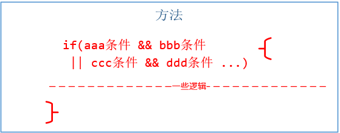

# [小酌重构系列[23]——封装条件][0]

### 概述

当条件判断语句较为复杂时（有多个不同的检查项），就像下面这幅图所表示的，会使得代码的可读性会大打折扣，也难以清晰地传达判断意图。

再者，当判断逻辑变更时，我们不得不去修改if语句里面的判断代码。  
如果判断写得有问题，则会影响方法的正确性，也会给该方法的单元测试带来一些障碍。

我们可以根据检查项是否需要参数来封装条件，如果检查项不需要参数，则可以将其提取为属性；如果需要参数，则将其提取为方法。  
本文要讲的重构策略**“封装条件”**是基于[“提取方法”][1]这个重构策略的。

### 示例

#### 重构前

这个示例中，PerformCoolFunction()方法的if条件检查项有三个。

    public class RemoteControl
    {
        private string[] Functions { get; set; }
        private string Name { get; set; }
        private int CreatedYear { get; set; }
    
        public string PerformCoolFunction(string buttonPressed)
        {
            // Determine if we are controlling some extra function
            // that requires special conditions
            if (Functions.Length > 1 && Name == "RCA" && CreatedYear > DateTime.Now.Year - 2)
                return "doSomething";
        }
    }
    

我们可以不必去理解这个复杂判断的含义，从代码层面看，这个判断有三个问题：

* 可读性较差，同时也意味着较差的维护性
* 增加了编写PerformCoolFunction方法单元测试的复杂度，我们不得不为if判断单独追加一个测试case
* if判断所用的参数和PerformCoolFunction方法无关

#### 重构后

这三个检查项构成的条件表达式可读较差，所以将这个条件表达式提取为一个方法。这样在做条件判断时就变成了if (HasExtraFunctions)，代码的可读性由此增强。另外，我们通过提取出来的条件判断方法名称，也可以准确地洞悉判断的意图。

    public class RemoteControl
    {
        private string[] Functions { get; set; }
        private string Name { get; set; }
        private int CreatedYear { get; set; }
    
        private bool HasExtraFunctions
        {
            get
            {
                return Functions.Length > 1 && Name == "RCA" &&
                       CreatedYear > DateTime.Now.Year - 2;
            }
        }
    
        public string PerformCoolFunction(string buttonPressed)
        {
            // Determine if we are controlling some extra function
            // that requires special conditions
            if (HasExtraFunctions)
                return "doSomething";
        }
    }
    

#### 用bool变量代替判断条件

这个示例的判断条件只有3个，而且每个条件的判断语句比较短。  
**如果遇到一些判断语句较长，且条件个数很多的判断，我们该怎么办？  
我的建议是用bool变量代替判断条件。**

偷个懒，我们仍然用上面的例子来示范这种方式：

    public class RemoteControl
    {
        private string[] Functions { get; set; }
        private string Name { get; set; }
        private int CreatedYear { get; set; }
    
        private bool HasExtraFunctions
        {
            get
            {
                // 前缀c表示condition
                bool cFuncLen = (Functions.Length > 1);
                bool cName = (Name == "RCA");
                bool cCreatedYear = (CreatedYear > DateTime.Now.Year - 2);
    
                return cFuncLen && cName && cCreatedYear;
            }
        }
    
        public string PerformCoolFunction(string buttonPressed)
        {
            // Determine if we are controlling some extra function
            // that requires special conditions
            if (HasExtraFunctions)
                return "doSomething";
        }
    }

### 小结

封装复杂判断的精髓是“提取方法”，即将复杂的判断逻辑提取为方法。

[0]: http://www.cnblogs.com/keepfool/p/5547797.html
[1]: http://www.cnblogs.com/keepfool/p/5433403.html