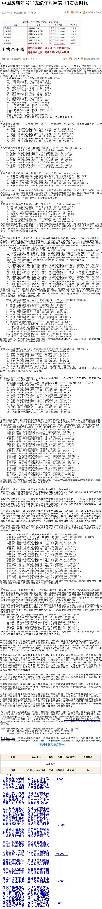

历史已然过去，不论轰轰烈烈，抑或平平淡淡，有何关系？
未来近在脚下，一丝马马虎虎，半缕浑浑噩噩，都要不得。
读史以明事理，风流还看今朝，浮生当得明白，于是道：
真假本无所谓，只为织一件无缝的天衣；
对错不必认真，要的是填补遗留的缺憾。

--上古--
史纪无年七千载，笑谈上古帝王谱。
部落群居天地间，为嘴终日攀山谷。
日行百里又何如，神州浩荡无尽土。
大江难渡高山阻，河泽处处绕行苦。

伏羲女娲首登场，风姓八百四十载。
同气连枝十五部，又将一千八百过。
祝融混沌列八九，第十一名有巢补。
丛林生存多夜兽，有巢树屋安然度。

炎帝魁隗相继起，姜姓二百四十载。
祝融共工列五六，满山遍野追野兽。
炎帝神农续魁隗，得过二百四十载。
手握石锄耕田地，从此不再愁生计。
同时又有仓颉氏，父子为众造文字。
心意交流跨时空，有话不须当面说。

少典黄帝相继出，都是姬姓轩辕氏。
北与炎帝相联合，东征九黎蚩尤氏。
蚩尤兵败被斩首，轩辕逍遥四百久。

东夷少昊东山起，又将轩辕逐去北。
蚩尤少昊是老乡，都在现今山东住。

少昊金天二百载，传位高阳颛顼氏。
这是舅舅传外甥，一传再续四百载。

帝喾姓姜辅颛顼，东征共工展雄威。
各部推举执牛耳，传五百载号高辛。

高辛少昊结姻亲，血脉帝挚称青阳。
治水东夷显才干，相传四百四十载。

帝尧本为帝挚辅，受禅代挚天下主。
传承二百至帝舜，五十然后归禹主。

部族余粮积满仓，无须为嘴再奔忙。
人心已知权力好，为贪享乐施机巧。
帝禹传子家天下，从此夏商相接续。
西周文武灭殷商，周公制礼定家邦。
直至厉王施暴虐，国人驱逐共和建。
忽然想起要记史，好把人生写上纸。
自此历史有年表，前七七零见分晓。